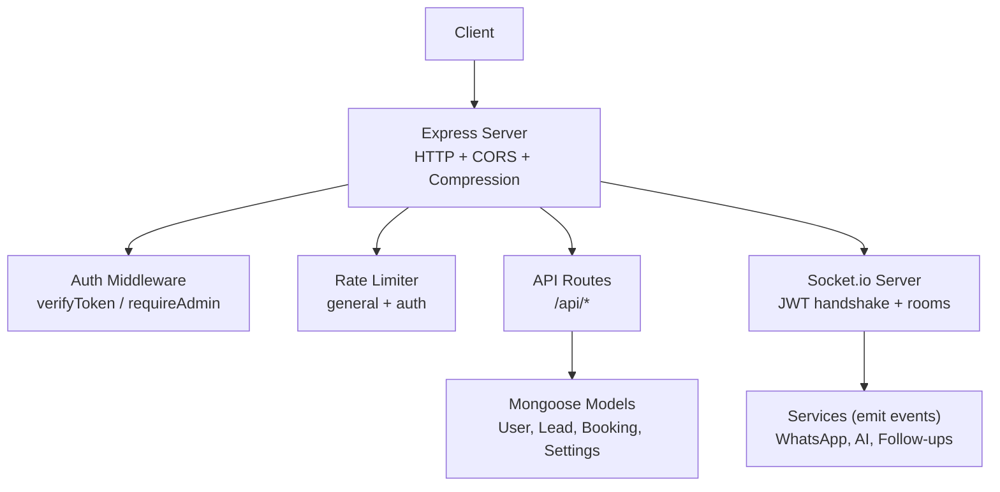
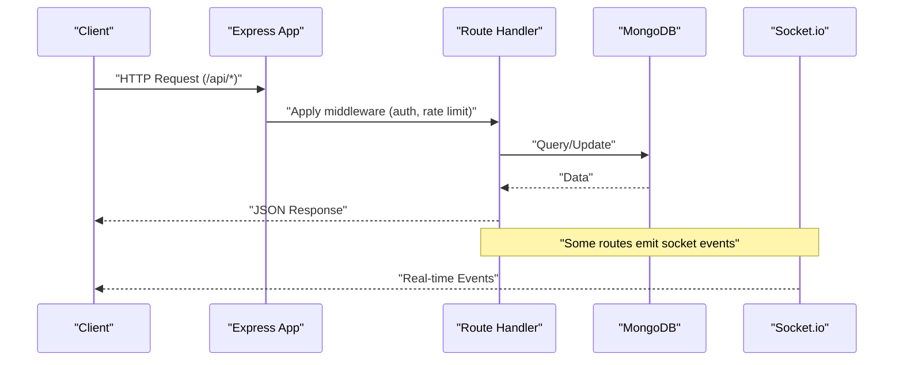
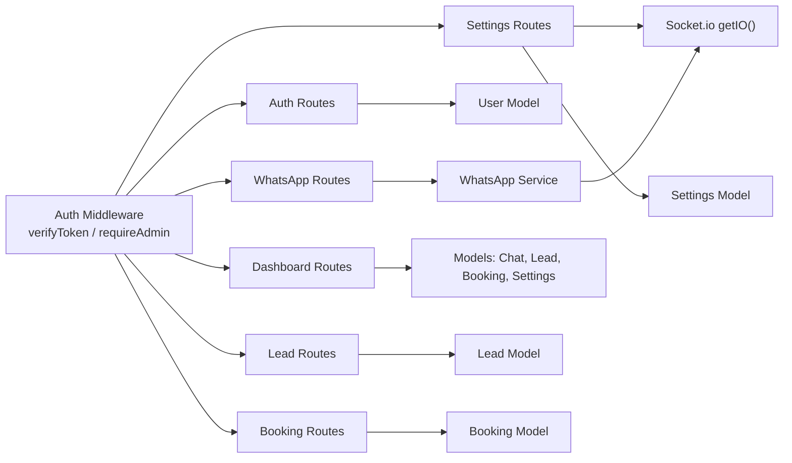

# API Reference

<cite>
**Referenced Files in This Document**
- [server.js](file://backend/src/server.js)
- [authRoutes.js](file://backend/src/routes/authRoutes.js)
- [whatsappRoutes.js](file://backend/src/routes/whatsappRoutes.js)
- [dashboardRoutes.js](file://backend/src/routes/dashboardRoutes.js)
- [leadRoutes.js](file://backend/src/routes/leadRoutes.js)
- [bookingRoutes.js](file://backend/src/routes/bookingRoutes.js)
- [settingsRoutes.js](file://backend/src/routes/settingsRoutes.js)
- [index.js](file://backend/src/sockets/index.js)
- [auth.js](file://backend/src/middleware/auth.js)
- [rateLimiter.js](file://backend/src/middleware/rateLimiter.js)
- [errorHandler.js](file://backend/src/middleware/errorHandler.js)
- [env.js](file://backend/src/config/env.js)
- [User.js](file://backend/src/models/User.js)
- [Lead.js](file://backend/src/models/Lead.js)
- [Booking.js](file://backend/src/models/Booking.js)
- [Settings.js](file://backend/src/models/Settings.js)
</cite>

## Table of Contents
1. Introduction
2. Project Structure
3. Core Components
4. Architecture Overview
5. Detailed Component Analysis
6. Dependency Analysis
7. Performance Considerations
8. Troubleshooting Guide
9. Conclusion

## Introduction
This document provides comprehensive API documentation for the backend endpoints, including authentication, WhatsApp management, dashboard statistics, lead management, booking operations, and settings configuration. It also documents WebSocket events for real-time communication, client implementation guidelines, rate limiting behavior, and security considerations.

## Project Structure
The backend is an Express application with modular route handlers, middleware for authentication and error handling, Socket.io for real-time updates, and Mongoose models for data persistence. Routes are mounted under /api prefixes and protected by JWT-based authentication where required.

**Diagram sources**
- [server.js:34-103](file://backend/src/server.js#L34-L103)
- [index.js:18-63](file://backend/src/sockets/index.js#L18-L63)

**Section sources**
- [server.js:1-103](file://backend/src/server.js#L1-L103)

## Core Components
- Authentication: JWT issuance and verification; admin-only enforcement.
- WhatsApp Management: Session lifecycle, QR/pairing flows, status queries.
- Dashboard Statistics: Aggregated counts and health metrics.
- Leads: Listing and stats by status.
- Bookings: Listing and manual status update.
- Settings: Global mode toggle, follow-up enablement, WhatsApp numbers.
- Real-time: Socket.io with JWT handshake and room-based broadcasting.

**Section sources**
- [authRoutes.js:1-138](file://backend/src/routes/authRoutes.js#L1-L138)
- [whatsappRoutes.js:1-110](file://backend/src/routes/whatsappRoutes.js#L1-L110)
- [dashboardRoutes.js:1-71](file://backend/src/routes/dashboardRoutes.js#L1-L71)
- [leadRoutes.js:1-72](file://backend/src/routes/leadRoutes.js#L1-L72)
- [bookingRoutes.js:1-71](file://backend/src/routes/bookingRoutes.js#L1-L71)
- [settingsRoutes.js:1-143](file://backend/src/routes/settingsRoutes.js#L1-L143)
- [index.js:1-82](file://backend/src/sockets/index.js#L1-L82)

## Architecture Overview
High-level request flow and real-time event distribution.

**Diagram sources**
- [server.js:88-103](file://backend/src/server.js#L88-L103)
- [index.js:50-63](file://backend/src/sockets/index.js#L50-L63)

## Detailed Component Analysis

### Authentication Endpoints
- POST /api/auth/login
  - Purpose: Authenticate user and issue JWT.
  - Auth: None.
  - Rate Limit: Strict login limiter applies.
  - Request Body:
    - email: string (email format)
    - password: string
    - rememberMe: boolean (optional, default false)
  - Success Response (200):
    - success: true
    - token: string (JWT)
    - user: { id, name, email, role }
    - expiresIn: string
  - Errors:
    - 400: Validation error
    - 401: Invalid credentials or inactive account
- POST /api/auth/logout
  - Purpose: Stateless logout helper.
  - Auth: None.
  - Success Response (200):
    - success: true
    - message: string
- GET /api/auth/me
  - Purpose: Get current user info from token.
  - Auth: Required (Bearer token).
  - Success Response (200):
    - success: true
    - user: { id, name, email, role, isActive, lastLogin }
  - Errors:
    - 401: Missing/invalid/expired token
    - 404: User not found

Implementation notes:
- Token payload includes id, email, role.
- rememberMe extends token lifetime to 30 days; otherwise uses configured expiration.
- Last login timestamp updated on successful login.

**Section sources**
- [authRoutes.js:12-93](file://backend/src/routes/authRoutes.js#L12-L93)
- [authRoutes.js:95-104](file://backend/src/routes/authRoutes.js#L95-L104)
- [authRoutes.js:106-135](file://backend/src/routes/authRoutes.js#L106-L135)
- [auth.js:10-47](file://backend/src/middleware/auth.js#L10-L47)
- [auth.js:53-62](file://backend/src/middleware/auth.js#L53-L62)
- [rateLimiter.js:22-31](file://backend/src/middleware/rateLimiter.js#L22-L31)
- [env.js:56-69](file://backend/src/config/env.js#L56-L69)
- [User.js:1-63](file://backend/src/models/User.js#L1-L63)

### WhatsApp Management Endpoints
- GET /api/whatsapp/sessions
  - Purpose: List all WhatsApp session statuses.
  - Auth: Required (Bearer token).
  - Success Response (200):
    - success: true
    - sessions: object mapping sessionId -> status
- POST /api/whatsapp/sessions
  - Purpose: Start a new WhatsApp session initialization (non-blocking).
  - Auth: Required (admin only).
  - Request Body:
    - sessionId: string (required)
    - cleanStart: boolean (optional)
  - Success Response (200):
    - success: true
    - message: string
    - sessionId: string
  - Notes: Frontend should listen for socket events for progress.
- POST /api/whatsapp/sessions/:id/pairing-code
  - Purpose: Initialize session using pairing code instead of QR.
  - Auth: Required (Bearer token).
  - Path Params:
    - id: string (sessionId)
  - Request Body:
    - phoneNumber: string (required)
  - Success Response (200):
    - success: true
    - message: string
- DELETE /api/whatsapp/sessions/:id
  - Purpose: Destroy a session and delete its data folder.
  - Auth: Required (admin only).
  - Path Params:
    - id: string (sessionId)
  - Success Response (200):
    - success: true
    - message: string

WebSocket events related to WhatsApp:
- whatsapp:qr
- whatsapp:ready
- whatsapp:init_failed

These events are emitted during session initialization and readiness.

**Section sources**
- [whatsappRoutes.js:13-27](file://backend/src/routes/whatsappRoutes.js#L13-L27)
- [whatsappRoutes.js:37-60](file://backend/src/routes/whatsappRoutes.js#L37-L60)
- [whatsappRoutes.js:66-87](file://backend/src/routes/whatsappRoutes.js#L66-L87)
- [whatsappRoutes.js:94-107](file://backend/src/routes/whatsappRoutes.js#L94-L107)
- [whatsappRoutes.js:1-6](file://backend/src/routes/whatsappRoutes.js#L1-L6)

### Dashboard Statistics Endpoint
- GET /api/dashboard/stats
  - Purpose: Summary statistics for dashboard.
  - Auth: Required (Bearer token).
  - Success Response (200):
    - success: true
    - stats:
      - chatsToday: number
      - hotLeadsCount: number
      - aiFailuresLast24h: number
      - activeSessions: number
      - bookingsThisWeek: number
      - totalChats: number
      - totalBookings: number
      - conversionRate: number
      - modelHealthLast1Hour: object

Notes:
- Counts use date filters for today and this week.
- Active sessions derived from WhatsApp service status.

**Section sources**
- [dashboardRoutes.js:13-68](file://backend/src/routes/dashboardRoutes.js#L13-L68)

### Lead Management Endpoints
- GET /api/leads
  - Purpose: List leads with optional status filter.
  - Auth: Required (Bearer token).
  - Query Params:
    - status: enum ["cold","warm","hot","converted","lost"] (optional)
  - Success Response (200):
    - success: true
    - leads: array of Lead objects (populated chatId fields included)
- GET /api/leads/stats
  - Purpose: Count leads by status for dashboard.
  - Auth: Required (Bearer token).
  - Success Response (200):
    - success: true
    - stats: { cold, warm, hot, converted, lost, total }

**Section sources**
- [leadRoutes.js:11-31](file://backend/src/routes/leadRoutes.js#L11-L31)
- [leadRoutes.js:37-69](file://backend/src/routes/leadRoutes.js#L37-L69)
- [Lead.js:1-55](file://backend/src/models/Lead.js#L1-L55)

### Booking Operations Endpoints
- GET /api/bookings
  - Purpose: List bookings with optional status filter.
  - Auth: Required (Bearer token).
  - Query Params:
    - status: enum ["draft","pending_payment","confirmed","cancelled"] (optional)
  - Success Response (200):
    - success: true
    - bookings: array of Booking objects (populated chatId fields included)
- PATCH /api/bookings/:id/status
  - Purpose: Update booking status manually.
  - Auth: Required (Bearer token).
  - Path Params:
    - id: string (booking _id)
  - Request Body:
    - status: enum ["draft","pending_payment","confirmed","cancelled"] (required)
  - Success Response (200):
    - success: true
    - booking: updated Booking object
  - Errors:
    - 400: Invalid status
    - 404: Booking not found

**Section sources**
- [bookingRoutes.js:11-31](file://backend/src/routes/bookingRoutes.js#L11-L31)
- [bookingRoutes.js:37-68](file://backend/src/routes/bookingRoutes.js#L37-L68)
- [Booking.js:1-69](file://backend/src/models/Booking.js#L1-L69)

### Settings Configuration Endpoints
- GET /api/settings
  - Purpose: Retrieve global settings (creates defaults if missing).
  - Auth: Required (Bearer token).
  - Success Response (200):
    - success: true
    - settings: Settings object
- PATCH /api/settings/global-mode
  - Purpose: Toggle global mode (ai/human) and bulk-update existing chats. Emits real-time updates.
  - Auth: Required (admin only).
  - Request Body:
    - globalMode: enum ["ai","human"] (required)
  - Success Response (200):
    - success: true
    - settings: updated Settings object
  - Notes: Emits socket events to clients.
- PATCH /api/settings/follow-ups
  - Purpose: Enable/disable follow-up system.
  - Auth: Required (admin only).
  - Request Body:
    - followUpEnabled: boolean (required)
  - Success Response (200):
    - success: true
    - settings: updated Settings object
- PUT /api/settings/whatsapp-numbers
  - Purpose: Update WhatsApp numbers configuration.
  - Auth: Required (admin only).
  - Request Body:
    - whatsappNumbers: array of { number, label, isActive, isPrimary }
  - Success Response (200):
    - success: true
    - settings: updated Settings object

**Section sources**
- [settingsRoutes.js:13-35](file://backend/src/routes/settingsRoutes.js#L13-L35)
- [settingsRoutes.js:42-80](file://backend/src/routes/settingsRoutes.js#L42-L80)
- [settingsRoutes.js:86-110](file://backend/src/routes/settingsRoutes.js#L86-L110)
- [settingsRoutes.js:116-140](file://backend/src/routes/settingsRoutes.js#L116-L140)
- [Settings.js:1-38](file://backend/src/models/Settings.js#L1-L38)

### WebSocket Events
Connection and authentication:
- Clients must connect with JWT in handshake.auth.token.
- On successful auth, server joins the client to the "dashboard" room.

Events:
- chats:bulk_mode_updated
  - Payload: { mode: "ai" | "human" }
  - Emitted when global mode is toggled.
- settings:global_mode_changed
  - Payload: { globalMode: "ai" | "human" }
  - Emitted alongside bulk mode update for dashboard sync.
- whatsapp:qr
  - Emitted during WhatsApp session initialization when QR is available.
- whatsapp:ready
  - Emitted when a WhatsApp session becomes ready.
- whatsapp:init_failed
  - Emitted when WhatsApp session initialization fails.

Client guidelines:
- Connect with Bearer token via handshake.auth.token.
- Subscribe to "dashboard" room events.
- Handle disconnects and reconnection logic.

**Section sources**
- [index.js:18-63](file://backend/src/sockets/index.js#L18-L63)
- [settingsRoutes.js:64-71](file://backend/src/routes/settingsRoutes.js#L64-L71)
- [whatsappRoutes.js:33-36](file://backend/src/routes/whatsappRoutes.js#L33-L36)

## Dependency Analysis
Key dependencies and relationships among components:

**Diagram sources**
- [auth.js:10-62](file://backend/src/middleware/auth.js#L10-L62)
- [authRoutes.js:1-10](file://backend/src/routes/authRoutes.js#L1-L10)
- [whatsappRoutes.js:1-6](file://backend/src/routes/whatsappRoutes.js#L1-L6)
- [dashboardRoutes.js:1-6](file://backend/src/routes/dashboardRoutes.js#L1-L6)
- [leadRoutes.js:1-4](file://backend/src/routes/leadRoutes.js#L1-L4)
- [bookingRoutes.js:1-4](file://backend/src/routes/bookingRoutes.js#L1-L4)
- [settingsRoutes.js:1-5](file://backend/src/routes/settingsRoutes.js#L1-L5)
- [index.js:71-76](file://backend/src/sockets/index.js#L71-L76)

**Section sources**
- [auth.js:10-62](file://backend/src/middleware/auth.js#L10-L62)
- [server.js:88-103](file://backend/src/server.js#L88-L103)

## Performance Considerations
- Use query filters and indexes provided by models to optimize listing endpoints.
- Avoid heavy synchronous operations in route handlers; rely on async patterns.
- Leverage compression and CORS tuning for production environments.
- Monitor MongoDB connection state and session counts via health endpoint.

[No sources needed since this section provides general guidance]

## Troubleshooting Guide
Common issues and resolutions:
- 401 Unauthorized: Ensure Authorization header contains a valid Bearer token. Check token expiry and secret configuration.
- 403 Forbidden: Admin-only endpoints require role=admin.
- 400 Bad Request: Validate request body against documented schemas.
- 404 Not Found: Resource IDs may be invalid or deleted.
- 500 Internal Server Error: Check logs for stack traces in development; ensure environment variables are set correctly.

Rate limiting:
- General API: 200 requests per 15 minutes per IP.
- Login: 5 attempts per 15 minutes per IP.

Error response shape:
- success: boolean
- message: string
- stack: string (development only)

**Section sources**
- [auth.js:10-47](file://backend/src/middleware/auth.js#L10-L47)
- [auth.js:53-62](file://backend/src/middleware/auth.js#L53-L62)
- [rateLimiter.js:7-16](file://backend/src/middleware/rateLimiter.js#L7-L16)
- [rateLimiter.js:22-31](file://backend/src/middleware/rateLimiter.js#L22-L31)
- [errorHandler.js:9-33](file://backend/src/middleware/errorHandler.js#L9-L33)
- [env.js:56-69](file://backend/src/config/env.js#L56-L69)

## Conclusion
This API reference covers all major backend endpoints, their authentication requirements, request/response formats, and real-time events. Follow the client guidelines for secure connections, handle rate limits gracefully, and implement robust error handling based on the documented response shapes.