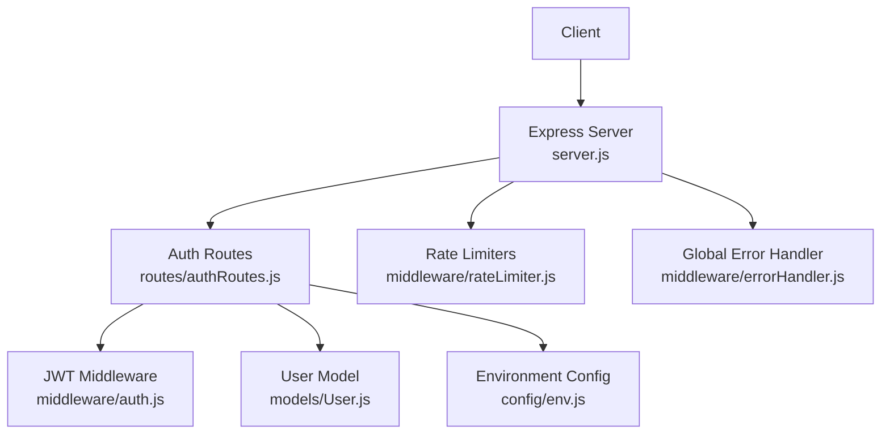
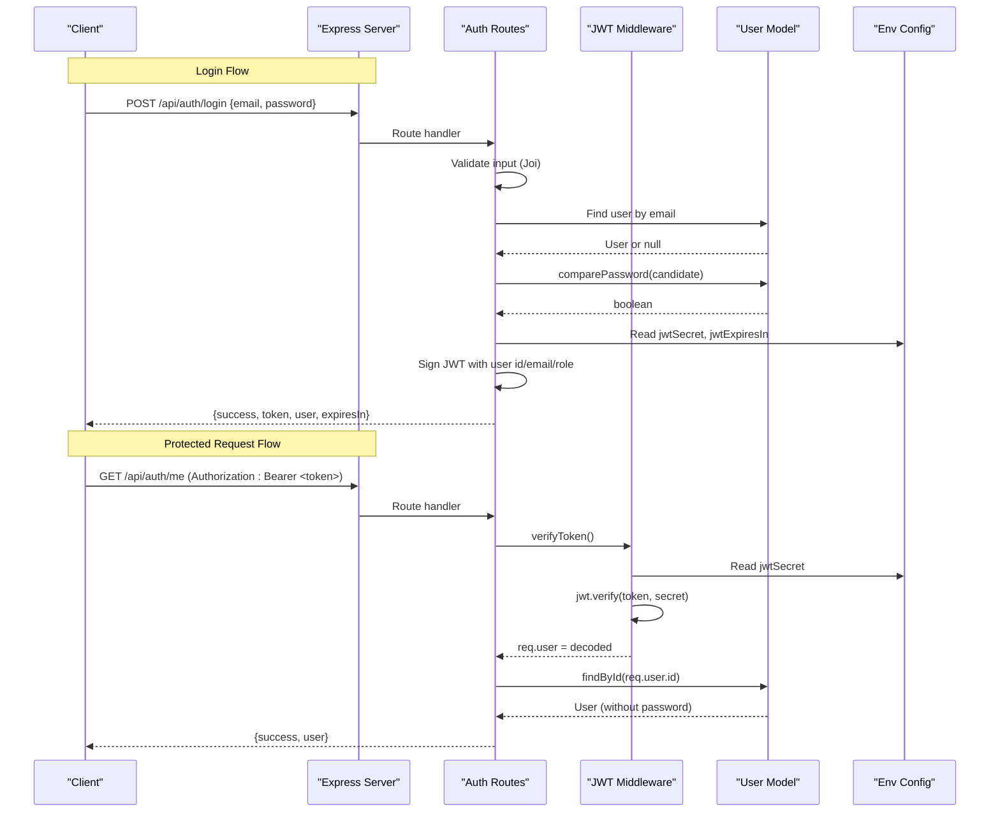
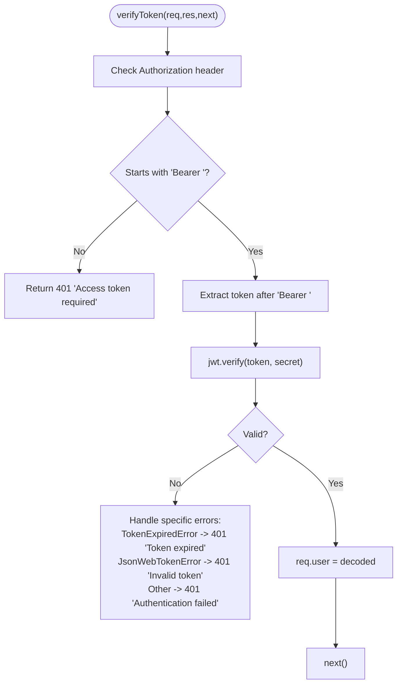
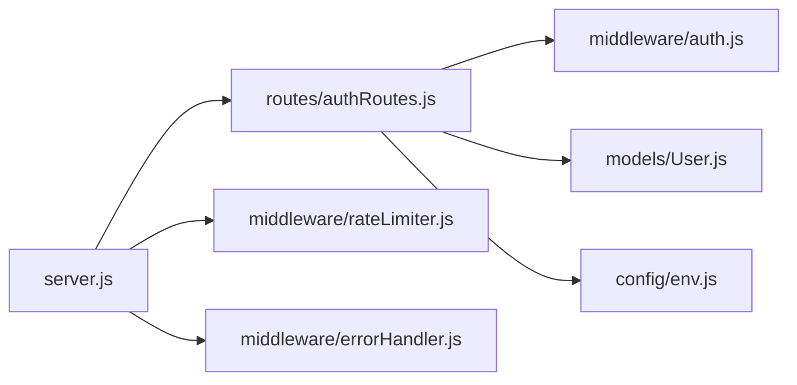

# Authentication API

<cite>
**Referenced Files in This Document**
- [server.js](file://backend/src/server.js)
- [authRoutes.js](file://backend/src/routes/authRoutes.js)
- [auth.js](file://backend/src/middleware/auth.js)
- [User.js](file://backend/src/models/User.js)
- [env.js](file://backend/src/config/env.js)
- [rateLimiter.js](file://backend/src/middleware/rateLimiter.js)
- [errorHandler.js](file://backend/src/middleware/errorHandler.js)
</cite>

## Table of Contents
1. [Introduction](#introduction)
2. [Project Structure](#project-structure)
3. [Core Components](#core-components)
4. [Architecture Overview](#architecture-overview)
5. [Detailed Component Analysis](#detailed-component-analysis)
6. [Dependency Analysis](#dependency-analysis)
7. [Performance Considerations](#performance-considerations)
8. [Troubleshooting Guide](#troubleshooting-guide)
9. [Conclusion](#conclusion)

## Introduction
This document provides comprehensive API documentation for the authentication subsystem, including:
- Login endpoint (POST /api/auth/login) with email/password validation and JWT issuance
- Logout endpoint (POST /api/auth/logout) for stateless session termination
- Protected user info endpoint (GET /api/auth/me) returning current authenticated user details

It also documents the authentication middleware implementation, token validation process, security considerations (password hashing, token expiration), and practical request/response examples.

## Project Structure
The authentication feature is implemented using Express routes, a custom JWT verification middleware, a Mongoose User model with password hashing, environment configuration, rate limiting, and a global error handler. The server wires these components together and mounts the auth routes under /api/auth.

**Diagram sources**
- [server.js:88-97](file://backend/src/server.js#L88-L97)
- [authRoutes.js:1-10](file://backend/src/routes/authRoutes.js#L1-L10)
- [auth.js:1-10](file://backend/src/middleware/auth.js#L1-L10)
- [User.js:1-10](file://backend/src/models/User.js#L1-L10)
- [env.js:56-69](file://backend/src/config/env.js#L56-L69)
- [rateLimiter.js:1-16](file://backend/src/middleware/rateLimiter.js#L1-L16)
- [errorHandler.js:1-10](file://backend/src/middleware/errorHandler.js#L1-L10)

**Section sources**
- [server.js:88-97](file://backend/src/server.js#L88-L97)
- [authRoutes.js:1-10](file://backend/src/routes/authRoutes.js#L1-L10)
- [auth.js:1-10](file://backend/src/middleware/auth.js#L1-L10)
- [User.js:1-10](file://backend/src/models/User.js#L1-L10)
- [env.js:56-69](file://backend/src/config/env.js#L56-L69)
- [rateLimiter.js:1-16](file://backend/src/middleware/rateLimiter.js#L1-L16)
- [errorHandler.js:1-10](file://backend/src/middleware/errorHandler.js#L1-L10)

## Core Components
- Authentication routes define login, logout, and me endpoints.
- JWT middleware verifies tokens from Authorization headers and attaches decoded payload to req.user.
- User model implements secure password hashing and comparison via bcrypt.
- Environment configuration supplies JWT secret and token expiration settings.
- Rate limiters protect against brute-force login attempts.
- Global error handler standardizes error responses and logs errors.

**Section sources**
- [authRoutes.js:18-135](file://backend/src/routes/authRoutes.js#L18-L135)
- [auth.js:10-47](file://backend/src/middleware/auth.js#L10-L47)
- [User.js:40-60](file://backend/src/models/User.js#L40-L60)
- [env.js:56-69](file://backend/src/config/env.js#L56-L69)
- [rateLimiter.js:22-31](file://backend/src/middleware/rateLimiter.js#L22-L31)
- [errorHandler.js:9-33](file://backend/src/middleware/errorHandler.js#L9-L33)

## Architecture Overview
The authentication flow uses stateless JWTs. Clients authenticate by sending credentials; on success, they receive a signed token. Subsequent requests include the token in the Authorization header. Protected routes validate the token before processing.

**Diagram sources**
- [authRoutes.js:22-93](file://backend/src/routes/authRoutes.js#L22-L93)
- [authRoutes.js:110-135](file://backend/src/routes/authRoutes.js#L110-L135)
- [auth.js:10-47](file://backend/src/middleware/auth.js#L10-L47)
- [User.js:54-60](file://backend/src/models/User.js#L54-L60)
- [env.js:56-69](file://backend/src/config/env.js#L56-L69)

## Detailed Component Analysis

### Endpoints

#### POST /api/auth/login
- Purpose: Authenticate a user with email and password, return a JWT and minimal user profile.
- Authentication: None required.
- Rate limiting: Strict per-IP limit applied at route level.
- Input schema:
  - email: string, valid email format, required
  - password: string, required
  - rememberMe: boolean, optional, default false
- Processing logic:
  - Validates input using Joi.
  - Looks up user by normalized email.
  - Checks account active status.
  - Compares provided password with stored hash.
  - Updates lastLogin timestamp.
  - Issues JWT with id, email, role; expiration depends on rememberMe flag and configured expiry.
- Success response (200):
  - success: true
  - token: string (JWT)
  - user: object with id, name, email, role
  - expiresIn: string (e.g., "7d" or "30d")
- Error responses:
  - 400 Bad Request: Validation failure (missing/invalid fields)
  - 401 Unauthorized: Invalid credentials or deactivated account
  - 429 Too Many Requests: Exceeded login attempt limit
  - 500 Internal Server Error: Unexpected server error

Example request:
- Method: POST
- URL: /api/auth/login
- Headers: Content-Type: application/json
- Body:
  - email: "user@example.com"
  - password: "your-password"
  - rememberMe: false

Example success response:
- Status: 200
- Body:
  - success: true
  - token: "<jwt-token>"
  - user: { id: "...", name: "...", email: "user@example.com", role: "staff" }
  - expiresIn: "7d"

Example error responses:
- 400: { success: false, message: "..." }
- 401: { success: false, message: "Invalid credentials" } or { success: false, message: "Account is deactivated" }
- 429: { success: false, message: "Too many login attempts, please try again later" }

Security notes:
- Passwords are hashed using bcrypt with salt rounds configured in the model.
- Email is normalized to lowercase before lookup.
- Last login time is updated on successful authentication.

**Section sources**
- [authRoutes.js:12-16](file://backend/src/routes/authRoutes.js#L12-L16)
- [authRoutes.js:22-93](file://backend/src/routes/authRoutes.js#L22-L93)
- [rateLimiter.js:22-31](file://backend/src/middleware/rateLimiter.js#L22-L31)
- [User.js:40-60](file://backend/src/models/User.js#L40-L60)
- [env.js:56-69](file://backend/src/config/env.js#L56-L69)

#### POST /api/auth/logout
- Purpose: Stateless logout; client should discard stored token.
- Authentication: Not required.
- Behavior: Returns success without server-side state changes.
- Success response (200):
  - success: true
  - message: "Logged out successfully"
- Error responses:
  - 500 Internal Server Error: Unexpected server error

Example request:
- Method: POST
- URL: /api/auth/logout
- Headers: none required

Example success response:
- Status: 200
- Body:
  - success: true
  - message: "Logged out successfully"

**Section sources**
- [authRoutes.js:99-104](file://backend/src/routes/authRoutes.js#L99-L104)

#### GET /api/auth/me
- Purpose: Return current authenticated user details based on the provided JWT.
- Authentication: Required (Bearer token).
- Token requirement:
  - Header: Authorization: Bearer <token>
- Processing logic:
  - Middleware verifies token and decodes payload into req.user.
  - Fetches user by id, excluding sensitive fields.
- Success response (200):
  - success: true
  - user: object with id, name, email, role, isActive, lastLogin
- Error responses:
  - 401 Unauthorized: Missing token, invalid token, or expired token
  - 404 Not Found: User not found
  - 429 Too Many Requests: Exceeded general API rate limit
  - 500 Internal Server Error: Unexpected server error

Example request:
- Method: GET
- URL: /api/auth/me
- Headers: Authorization: Bearer <jwt-token>

Example success response:
- Status: 200
- Body:
  - success: true
  - user: { id: "...", name: "...", email: "user@example.com", role: "staff", isActive: true, lastLogin: "..." }

Example error responses:
- 401: { success: false, message: "Access token required" } or { success: false, message: "Token expired" } or { success: false, message: "Invalid token" }
- 404: { success: false, message: "User not found" }

**Section sources**
- [authRoutes.js:110-135](file://backend/src/routes/authRoutes.js#L110-L135)
- [auth.js:10-47](file://backend/src/middleware/auth.js#L10-L47)

### Authentication Middleware Implementation
- Token extraction: Reads Authorization header and expects "Bearer <token>".
- Verification: Uses jwt.verify with configured secret.
- Attachments: Decoded payload attached to req.user.
- Error handling:
  - Missing/invalid header: 401 with "Access token required"
  - Expired token: 401 with "Token expired"
  - Malformed token: 401 with "Invalid token"
  - Other errors: 401 with "Authentication failed" and logging

**Diagram sources**
- [auth.js:10-47](file://backend/src/middleware/auth.js#L10-L47)

**Section sources**
- [auth.js:10-47](file://backend/src/middleware/auth.js#L10-L47)

### Security Considerations
- Password hashing:
  - Pre-save hook hashes passwords using bcrypt with configurable salt rounds.
  - comparePassword method validates candidate passwords against stored hashes.
- Token signing and expiration:
  - Tokens are signed with a secret from environment configuration.
  - Expiration is configurable; login supports longer-lived tokens when rememberMe is true.
- Rate limiting:
  - General API limiter applies across all routes.
  - Stricter login limiter reduces brute-force risk.
- CORS and Helmet:
  - CORS configured to allow only specified frontend origin.
  - Helmet sets secure HTTP headers.
- Error exposure:
  - Stack traces are omitted in production; only messages returned.

**Section sources**
- [User.js:40-60](file://backend/src/models/User.js#L40-L60)
- [env.js:56-69](file://backend/src/config/env.js#L56-L69)
- [rateLimiter.js:7-16](file://backend/src/middleware/rateLimiter.js#L7-L16)
- [rateLimiter.js:22-31](file://backend/src/middleware/rateLimiter.js#L22-L31)
- [server.js:38-44](file://backend/src/server.js#L38-L44)
- [errorHandler.js:9-33](file://backend/src/middleware/errorHandler.js#L9-L33)

## Dependency Analysis
The authentication subsystem depends on Express routing, JSON Web Tokens, Mongoose models, environment variables, and middleware for validation and protection.

**Diagram sources**
- [server.js:88-97](file://backend/src/server.js#L88-L97)
- [authRoutes.js:1-10](file://backend/src/routes/authRoutes.js#L1-L10)
- [auth.js:1-10](file://backend/src/middleware/auth.js#L1-L10)
- [User.js:1-10](file://backend/src/models/User.js#L1-L10)
- [env.js:56-69](file://backend/src/config/env.js#L56-L69)
- [rateLimiter.js:1-16](file://backend/src/middleware/rateLimiter.js#L1-L16)
- [errorHandler.js:1-10](file://backend/src/middleware/errorHandler.js#L1-L10)

**Section sources**
- [server.js:88-97](file://backend/src/server.js#L88-L97)
- [authRoutes.js:1-10](file://backend/src/routes/authRoutes.js#L1-L10)
- [auth.js:1-10](file://backend/src/middleware/auth.js#L1-L10)
- [User.js:1-10](file://backend/src/models/User.js#L1-L10)
- [env.js:56-69](file://backend/src/config/env.js#L56-L69)
- [rateLimiter.js:1-16](file://backend/src/middleware/rateLimiter.js#L1-L16)
- [errorHandler.js:1-10](file://backend/src/middleware/errorHandler.js#L1-L10)

## Performance Considerations
- Database queries:
  - User lookup by email benefits from an index on email.
  - Role and isActive indexes support common filters.
- Token operations:
  - JWT verification is CPU-bound but lightweight; ensure secret is constant-time safe.
- Rate limiting:
  - In-memory store used by express-rate-limit; monitor memory usage under high load.
- Response size:
  - Minimize payload by selecting only necessary fields (already done for protected endpoints).

[No sources needed since this section provides general guidance]

## Troubleshooting Guide
Common issues and resolutions:
- 400 Bad Request on login:
  - Ensure email is a valid email string and password is present.
- 401 Unauthorized:
  - Verify Authorization header format: "Bearer <token>".
  - Check token expiration and re-authenticate if expired.
  - Confirm user exists and is active.
- 404 Not Found on /me:
  - Token may be valid but user record deleted or inaccessible.
- 429 Too Many Requests:
  - Wait for the rate limit window to reset; consider reducing retry frequency.
- 500 Internal Server Error:
  - Review server logs for stack traces in development; check database connectivity and environment variables.

Operational checks:
- Health endpoint returns system status and MongoDB connection state.
- Environment variables must include JWT_SECRET and JWT_EXPIRES_IN.

**Section sources**
- [authRoutes.js:22-93](file://backend/src/routes/authRoutes.js#L22-L93)
- [authRoutes.js:110-135](file://backend/src/routes/authRoutes.js#L110-L135)
- [auth.js:10-47](file://backend/src/middleware/auth.js#L10-L47)
- [rateLimiter.js:22-31](file://backend/src/middleware/rateLimiter.js#L22-L31)
- [errorHandler.js:9-33](file://backend/src/middleware/errorHandler.js#L9-L33)
- [server.js:63-86](file://backend/src/server.js#L63-L86)
- [env.js:56-69](file://backend/src/config/env.js#L56-L69)

## Conclusion
The authentication API provides secure login, logout, and user info retrieval using stateless JWTs. It enforces strong password hashing, strict input validation, token verification, and rate limiting to mitigate abuse. Follow the documented request/response schemas and security practices to integrate clients effectively.

[No sources needed since this section summarizes without analyzing specific files]