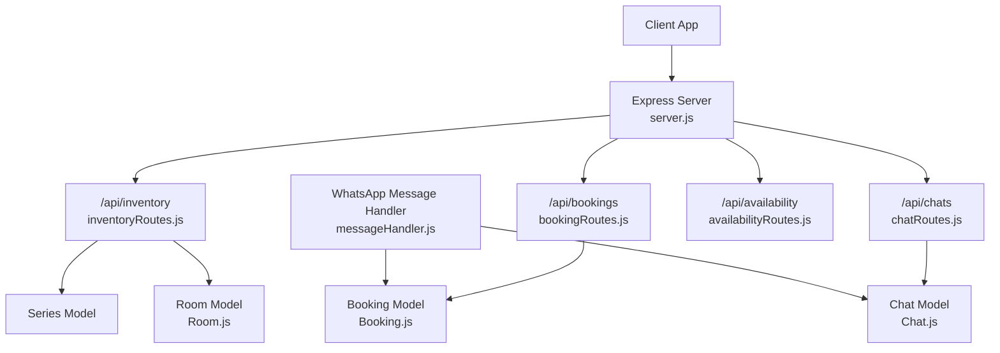
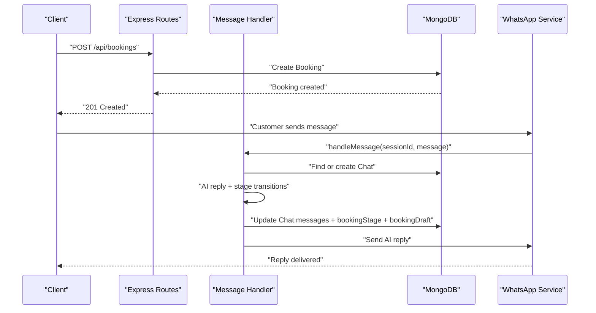
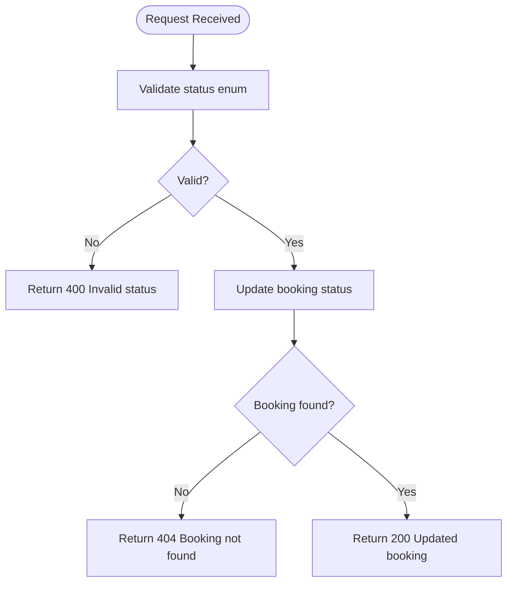
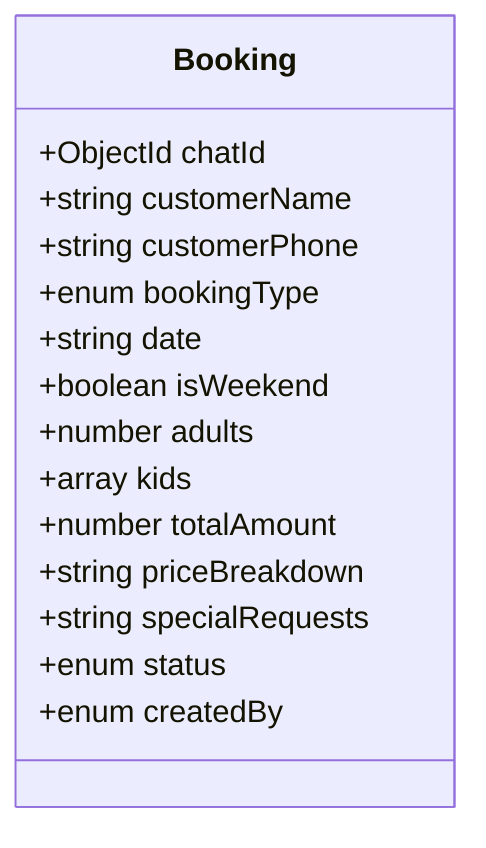
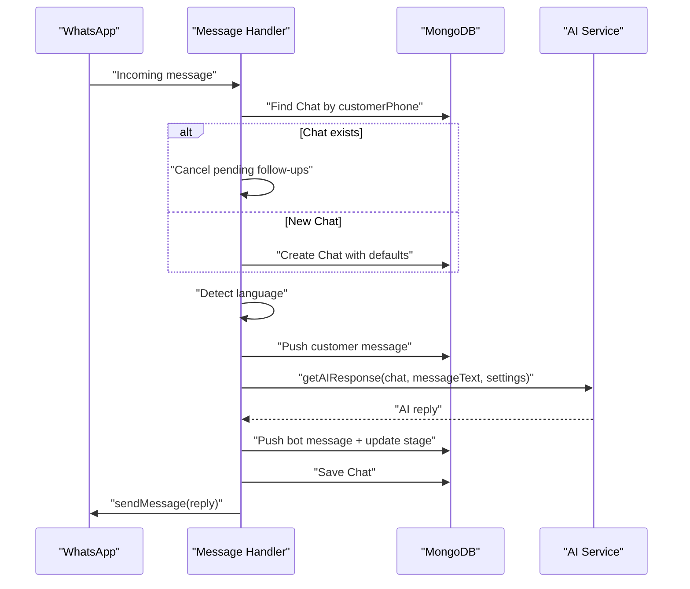
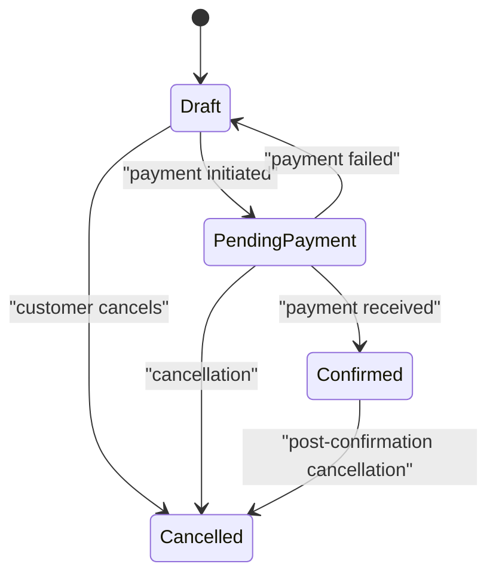
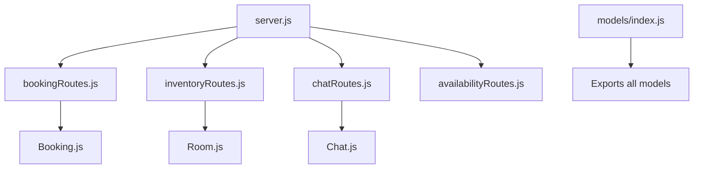

# Booking Management API

<cite>
**Referenced Files in This Document**
- [server.js](file://backend/src/server.js)
- [bookingRoutes.js](file://backend/src/routes/bookingRoutes.js)
- [Booking.js](file://backend/src/models/Booking.js)
- [Chat.js](file://backend/src/models/Chat.js)
- [messageHandler.js](file://backend/src/services/messageHandler.js)
- [inventoryRoutes.js](file://backend/src/routes/inventoryRoutes.js)
- [Room.js](file://backend/src/models/Room.js)
- [index.js](file://backend/src/models/index.js)
</cite>

## Table of Contents
1. [Introduction](#introduction)
2. [Project Structure](#project-structure)
3. [Core Components](#core-components)
4. [Architecture Overview](#architecture-overview)
5. [Detailed Component Analysis](#detailed-component-analysis)
6. [Dependency Analysis](#dependency-analysis)
7. [Performance Considerations](#performance-considerations)
8. [Troubleshooting Guide](#troubleshooting-guide)
9. [Conclusion](#conclusion)
10. [Appendices](#appendices)

## Introduction
This document provides comprehensive API documentation for booking management endpoints and related workflows. It covers:
- Booking lifecycle operations: creation, status updates, cancellation, and completion
- Room availability checking and inventory management
- Pricing calculation and quote generation via conversational flows
- Draft storage mechanisms and automated price calculations
- Integration with WhatsApp conversations
- Conflict resolution considerations, payment processing hooks, and reporting capabilities

The backend exposes REST endpoints under /api/bookings and /api/inventory, integrates with a conversational AI flow that maintains conversation state and drafts, and uses MongoDB models to persist bookings and room inventory.

## Project Structure
Key files relevant to booking management:
- Server entrypoint registers routes and middleware
- Booking routes expose listing and status update endpoints
- Inventory routes manage series and rooms (capacity, status)
- Models define schemas for bookings, chats (with drafts), and rooms
- Message handler orchestrates WhatsApp interactions and updates chat state/drafts



**Diagram sources**
- [server.js:88-97](file://backend/src/server.js#L88-L97)
- [bookingRoutes.js:1-71](file://backend/src/routes/bookingRoutes.js#L1-L71)
- [inventoryRoutes.js:1-445](file://backend/src/routes/inventoryRoutes.js#L1-L445)
- [Chat.js:1-107](file://backend/src/models/Chat.js#L1-L107)
- [Room.js:1-35](file://backend/src/models/Room.js#L1-L35)
- [messageHandler.js:1-183](file://backend/src/services/messageHandler.js#L1-L183)

**Section sources**
- [server.js:88-97](file://backend/src/server.js#L88-L97)
- [index.js:1-22](file://backend/src/models/index.js#L1-L22)

## Core Components
- Booking model defines fields for customer details, booking type, date, guests, pricing, special requests, status, and creator source. Statuses include draft, pending_payment, confirmed, cancelled.
- Chat model includes conversation history, language detection, booking stage progression, and a structured bookingDraft object used during conversational flows.
- Inventory routes provide CRUD for series and rooms, including soft-delete semantics and summary aggregation.
- Booking routes support listing bookings with optional status filter and manual status updates.
- Message handler coordinates WhatsApp message processing, AI response generation, lead scoring, follow-up scheduling, and updates to chat state and drafts.

**Section sources**
- [Booking.js:1-69](file://backend/src/models/Booking.js#L1-L69)
- [Chat.js:28-97](file://backend/src/models/Chat.js#L28-L97)
- [inventoryRoutes.js:81-445](file://backend/src/routes/inventoryRoutes.js#L81-L445)
- [bookingRoutes.js:7-68](file://backend/src/routes/bookingRoutes.js#L7-L68)
- [messageHandler.js:22-178](file://backend/src/services/messageHandler.js#L22-L178)

## Architecture Overview
The booking system integrates three primary layers:
- API layer: Express routes handle HTTP requests for bookings and inventory
- Service layer: Message handler orchestrates AI-driven conversational flows and updates chat state/drafts
- Data layer: Mongoose models persist bookings, chats, and room inventory



**Diagram sources**
- [server.js:88-97](file://backend/src/server.js#L88-L97)
- [bookingRoutes.js:1-71](file://backend/src/routes/bookingRoutes.js#L1-L71)
- [messageHandler.js:22-178](file://backend/src/services/messageHandler.js#L22-L178)

## Detailed Component Analysis

### Booking Endpoints
- GET /api/bookings
  - Purpose: List bookings with optional status filter
  - Authentication: Required (verifyToken)
  - Query parameters:
    - status: one of draft, pending_payment, confirmed, cancelled
  - Response schema:
    - success: boolean
    - bookings: array of Booking documents populated with chatId.customerPhone and chatId.customerName
  - Notes: Results sorted by createdAt descending

- PATCH /api/bookings/:id/status
  - Purpose: Manually update booking status
  - Authentication: Required (verifyToken)
  - Path parameter: id (Mongo ObjectId)
  - Request body:
    - status: one of draft, pending_payment, confirmed, cancelled
  - Response schema:
    - success: boolean
    - booking: updated Booking document
  - Error responses:
    - 400 Invalid status
    - 404 Booking not found



**Diagram sources**
- [bookingRoutes.js:37-68](file://backend/src/routes/bookingRoutes.js#L37-L68)

**Section sources**
- [bookingRoutes.js:7-68](file://backend/src/routes/bookingRoutes.js#L7-L68)

### Booking Model
- Fields:
  - chatId: reference to Chat
  - customerName, customerPhone: required
  - bookingType: couple, group, picnic
  - date: string; isWeekend: boolean
  - adults: number; kids: array of { age, rate }
  - totalAmount: number; priceBreakdown: string
  - specialRequests: string
  - status: draft, pending_payment, confirmed, cancelled (default draft)
  - createdBy: ai or staff (default ai)
- Indexes: customerPhone, date, status, bookingType, chatId



**Diagram sources**
- [Booking.js:1-69](file://backend/src/models/Booking.js#L1-L69)

**Section sources**
- [Booking.js:1-69](file://backend/src/models/Booking.js#L1-L69)

### Conversational Booking Flow and Draft Storage
- Chat model stores:
  - messages: array of { sender, text, timestamp, messageType }
  - bookingStage: progression through stages like type_selected, date_given, guests_given, kids_given, married_checked, price_quoted, name_given, phone_given, special_requests, handed_over, completed
  - bookingDraft: structured object capturing partial booking info (type, date, nights, adults, kids ages, marital status, calculatedPrice, priceBreakdown, specialRequests)
- Message handler:
  - Finds or creates Chat per customerPhone
  - Updates language detection and lastMessageAt
  - In human mode, saves message and notifies staff without auto-reply
  - In AI mode, generates reply, appends bot message, updates isNewConversation, schedules follow-ups on first interest, and emits socket events



**Diagram sources**
- [messageHandler.js:22-178](file://backend/src/services/messageHandler.js#L22-L178)
- [Chat.js:45-97](file://backend/src/models/Chat.js#L45-L97)

**Section sources**
- [Chat.js:28-97](file://backend/src/models/Chat.js#L28-L97)
- [messageHandler.js:22-178](file://backend/src/services/messageHandler.js#L22-L178)

### Inventory and Room Availability
- Series and Room management:
  - Series: name, status, notes; soft-delete cascades to rooms
  - Room: seriesId, roomNumber, capacity, status (active, maintenance, wellness, deleted), notes
  - Endpoints:
    - GET /api/inventory/series: list series with room counts
    - POST /api/inventory/series: create series (admin only)
    - PATCH /api/inventory/series/:id: update series (admin only)
    - DELETE /api/inventory/series/:id: soft-delete series and cascade to rooms (admin only)
    - GET /api/inventory/rooms: list rooms filtered by status and seriesId
    - POST /api/inventory/rooms: create room (admin only)
    - PATCH /api/inventory/rooms/:id: update room (admin only)
    - DELETE /api/inventory/rooms/:id: soft-delete room (admin only)
    - PATCH /api/inventory/rooms/:id/status: update room status and notes (admin only)
    - GET /api/inventory/summary: aggregated stats by status and series
- Availability checking:
  - The server mounts /api/availability but the route file is not included in this analysis; availability logic should query active rooms and consider existing bookings by date and type.

```mermaid
classDiagram
class Series {
+string name
+enum status
+string notes
}
class Room {
+ObjectId seriesId
+string roomNumber
+number capacity
+enum status
+string notes
}
Series ||--o{ Room : "contains"
```

**Diagram sources**
- [inventoryRoutes.js:81-445](file://backend/src/routes/inventoryRoutes.js#L81-L445)
- [Room.js:1-35](file://backend/src/models/Room.js#L1-L35)

**Section sources**
- [inventoryRoutes.js:81-445](file://backend/src/routes/inventoryRoutes.js#L81-L445)
- [Room.js:1-35](file://backend/src/models/Room.js#L1-L35)

### Pricing Calculation and Quote Generation
- Automated pricing:
  - The bookingDraft includes calculatedPrice and priceBreakdown fields, indicating that pricing is computed during the conversational flow and stored in the draft before finalizing a booking.
- Quote generation:
  - When the AI determines pricing based on inputs (date, guests, type), it populates bookingDraft.calculatedPrice and bookingDraft.priceBreakdown.
  - Finalization typically involves creating a Booking record with totalAmount and priceBreakdown derived from the draft.

Note: Specific pricing rules are implemented within the AI service and prompt configuration; they are not exposed as separate API endpoints.

**Section sources**
- [Chat.js:28-43](file://backend/src/models/Chat.js#L28-L43)
- [messageHandler.js:126-172](file://backend/src/services/messageHandler.js#L126-L172)

### Status Transitions and Completion Workflow
- Manual status updates:
  - Use PATCH /api/bookings/:id/status to transition between draft, pending_payment, confirmed, cancelled.
- Completion workflow:
  - After payment confirmation, transition to confirmed.
  - On cancellation, set status to cancelled.
  - For operational tracking, maintain audit logs externally if needed.



**Diagram sources**
- [bookingRoutes.js:37-68](file://backend/src/routes/bookingRoutes.js#L37-L68)
- [Booking.js:47-52](file://backend/src/models/Booking.js#L47-L52)

**Section sources**
- [bookingRoutes.js:37-68](file://backend/src/routes/bookingRoutes.js#L37-L68)
- [Booking.js:47-52](file://backend/src/models/Booking.js#L47-L52)

### Payment Processing Hooks
- Current implementation does not include explicit payment gateway integration endpoints.
- Recommended approach:
  - Create a dedicated endpoint (e.g., POST /api/bookings/:id/payments) to record payment attempts and outcomes.
  - Transition booking status to pending_payment upon initiation and to confirmed upon successful payment.
  - Integrate webhook handlers for external payment providers to update booking status asynchronously.

[No sources needed since this section provides general guidance]

### Reporting Capabilities
- Available data for reporting:
  - Bookings: list with filters by status; populate chat details for customer context
  - Inventory: summary aggregations by status and series; room counts and active capacity
- Suggested enhancements:
  - Add date-range filters for bookings
  - Provide revenue summaries using totalAmount
  - Export functions for CSV/JSON

**Section sources**
- [bookingRoutes.js:11-31](file://backend/src/routes/bookingRoutes.js#L11-L31)
- [inventoryRoutes.js:404-442](file://backend/src/routes/inventoryRoutes.js#L404-L442)

## Dependency Analysis
- Server mounts routes and initializes services:
  - /api/bookings -> bookingRoutes.js
  - /api/inventory -> inventoryRoutes.js
  - /api/chats -> chatRoutes.js
  - /api/availability -> availabilityRoutes.js (route file present but not analyzed here)
- Models exported via index.js ensure consistent imports across routes and services.



**Diagram sources**
- [server.js:88-97](file://backend/src/server.js#L88-L97)
- [index.js:1-22](file://backend/src/models/index.js#L1-L22)

**Section sources**
- [server.js:88-97](file://backend/src/server.js#L88-L97)
- [index.js:1-22](file://backend/src/models/index.js#L1-L22)

## Performance Considerations
- Database indexing:
  - Booking indexes on customerPhone, date, status, bookingType, chatId improve query performance for listing and filtering.
- Aggregation efficiency:
  - Inventory summary uses aggregation pipelines to compute counts and capacities efficiently.
- Rate limiting:
  - Global and auth-specific rate limiters protect endpoints from abuse.
- Compression and logging:
  - Compression reduces payload sizes; morgan logs help diagnose performance issues in development.

**Section sources**
- [Booking.js:62-66](file://backend/src/models/Booking.js#L62-L66)
- [inventoryRoutes.js:50-79](file://backend/src/routes/inventoryRoutes.js#L50-L79)
- [server.js:58-60](file://backend/src/server.js#L58-L60)
- [server.js:46-56](file://backend/src/server.js#L46-L56)

## Troubleshooting Guide
Common issues and resolutions:
- Invalid status updates:
  - Ensure status values match allowed enums; verify request body format.
- Booking not found:
  - Confirm ObjectId validity and existence before updating.
- Inventory conflicts:
  - Soft-deletion prevents accidental hard deletes; check series/room status before operations.
- Conversational failures:
  - AI errors are logged and do not block message queue; inspect logs for provider timeouts or invalid replies.

**Section sources**
- [bookingRoutes.js:41-68](file://backend/src/routes/bookingRoutes.js#L41-L68)
- [inventoryRoutes.js:183-217](file://backend/src/routes/inventoryRoutes.js#L183-L217)
- [messageHandler.js:163-172](file://backend/src/services/messageHandler.js#L163-L172)

## Conclusion
The booking management system provides robust endpoints for listing and updating bookings, comprehensive inventory management for rooms and series, and a conversational flow that captures drafts and automates pricing calculations. While payment processing hooks are not currently implemented, the architecture supports future integrations. Enhancements such as availability checks, conflict resolution, and expanded reporting can be added to further strengthen the system.

[No sources needed since this section summarizes without analyzing specific files]

## Appendices

### Practical Examples

- Creating a booking from a WhatsApp conversation:
  - Customer initiates chat; AI collects details (type, date, guests); calculates price and stores in bookingDraft; upon confirmation, a Booking is created with totalAmount and priceBreakdown.
  - Reference:
    - [Chat.js:28-43](file://backend/src/models/Chat.js#L28-L43)
    - [messageHandler.js:126-172](file://backend/src/services/messageHandler.js#L126-L172)

- Updating booking status manually:
  - Use PATCH /api/bookings/:id/status with valid status enum.
  - Reference:
    - [bookingRoutes.js:37-68](file://backend/src/routes/bookingRoutes.js#L37-L68)

- Checking room availability:
  - Query active rooms via GET /api/inventory/rooms with filters; integrate with booking dates to determine conflicts.
  - Reference:
    - [inventoryRoutes.js:222-250](file://backend/src/routes/inventoryRoutes.js#L222-L250)

- Generating quotes:
  - AI computes pricing and populates bookingDraft.calculatedPrice and priceBreakdown; finalize into a Booking.
  - Reference:
    - [Chat.js:28-43](file://backend/src/models/Chat.js#L28-L43)
    - [messageHandler.js:126-172](file://backend/src/services/messageHandler.js#L126-L172)

**Section sources**
- [Chat.js:28-43](file://backend/src/models/Chat.js#L28-L43)
- [messageHandler.js:126-172](file://backend/src/services/messageHandler.js#L126-L172)
- [bookingRoutes.js:37-68](file://backend/src/routes/bookingRoutes.js#L37-L68)
- [inventoryRoutes.js:222-250](file://backend/src/routes/inventoryRoutes.js#L222-L250)