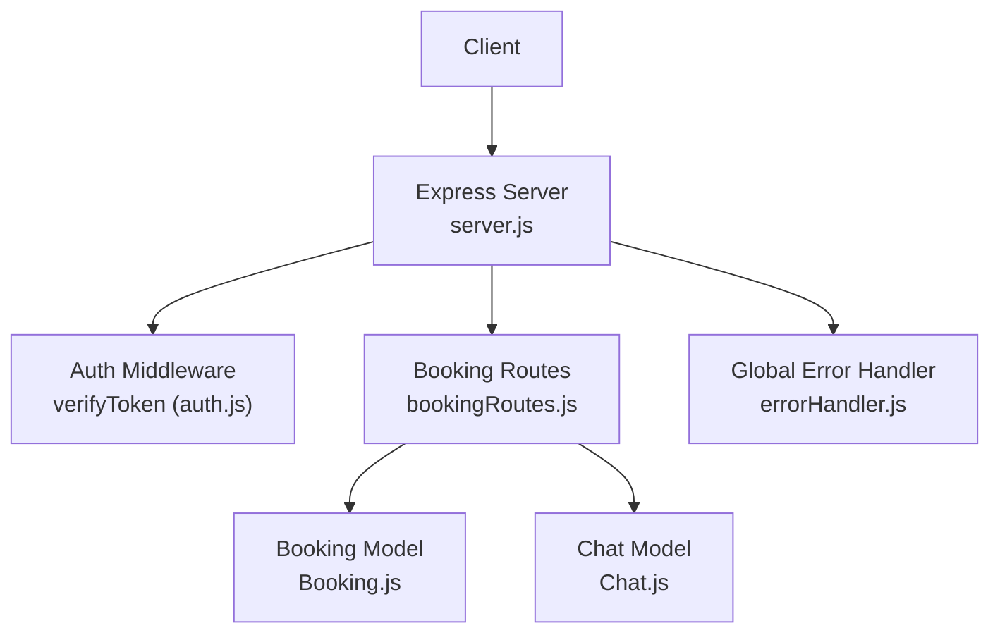
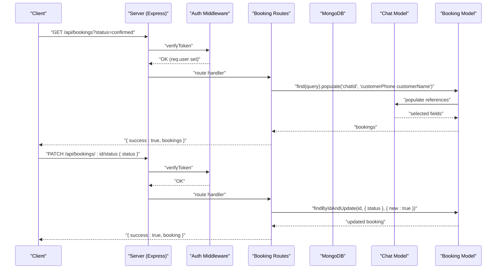
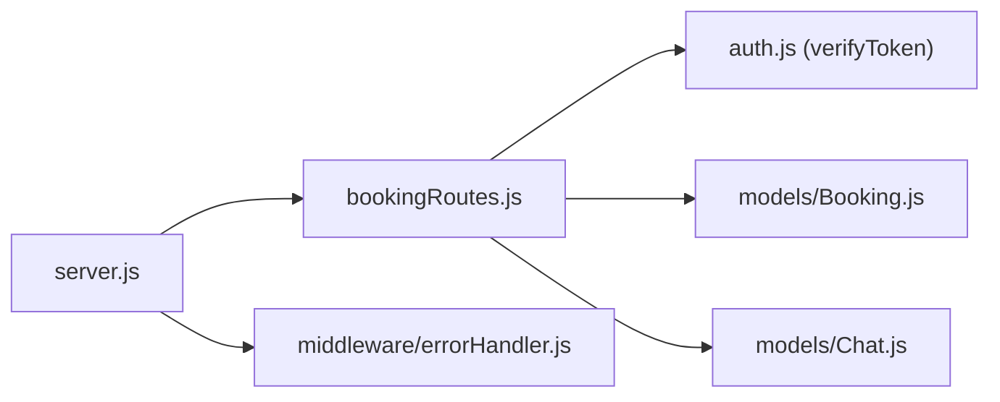

# Booking Operations

<cite>
**Referenced Files in This Document**
- [server.js](file://backend/src/server.js)
- [bookingRoutes.js](file://backend/src/routes/bookingRoutes.js)
- [Booking.js](file://backend/src/models/Booking.js)
- [Chat.js](file://backend/src/models/Chat.js)
- [auth.js](file://backend/src/middleware/auth.js)
- [errorHandler.js](file://backend/src/middleware/errorHandler.js)
- [messageHandler.js](file://backend/src/services/messageHandler.js)
</cite>

## Table of Contents
1. [Introduction](#introduction)
2. [Project Structure](#project-structure)
3. [Core Components](#core-components)
4. [Architecture Overview](#architecture-overview)
5. [Detailed Component Analysis](#detailed-component-analysis)
6. [Dependency Analysis](#dependency-analysis)
7. [Performance Considerations](#performance-considerations)
8. [Troubleshooting Guide](#troubleshooting-guide)
9. [Conclusion](#conclusion)

## Introduction
This document provides detailed API documentation for booking lifecycle operations, focusing on:
- Listing bookings with optional status filtering via GET /api/bookings
- Manual status updates via PATCH /api/bookings/:id/status
- Authentication requirements and error handling
- Data population with customer information from the chat system
- Practical examples of how bookings are created from WhatsApp conversations and integrated with the chat system

The endpoints are protected by JWT-based authentication and return consistent JSON responses.

## Project Structure
The booking-related functionality is implemented as Express routes backed by Mongoose models and secured by middleware. The server wires up routes under /api/bookings.

**Diagram sources**
- [server.js:88-97](file://backend/src/server.js#L88-L97)
- [bookingRoutes.js:1-71](file://backend/src/routes/bookingRoutes.js#L1-L71)
- [Booking.js:1-69](file://backend/src/models/Booking.js#L1-L69)
- [Chat.js:1-107](file://backend/src/models/Chat.js#L1-L107)
- [auth.js:1-68](file://backend/src/middleware/auth.js#L1-L68)
- [errorHandler.js:1-36](file://backend/src/middleware/errorHandler.js#L1-L36)

**Section sources**
- [server.js:88-97](file://backend/src/server.js#L88-L97)
- [bookingRoutes.js:1-71](file://backend/src/routes/bookingRoutes.js#L1-L71)

## Core Components
- GET /api/bookings
  - Purpose: List bookings with optional status filter
  - Authentication: Required (Bearer token)
  - Query parameters:
    - status: Optional; one of draft, pending_payment, confirmed, cancelled
  - Response schema:
    - success: boolean
    - bookings: array of Booking documents populated with selected Chat fields (customerPhone, customerName)
- PATCH /api/bookings/:id/status
  - Purpose: Manually update a booking’s status
  - Authentication: Required (Bearer token)
  - Path parameter:
    - id: Booking ObjectId
  - Request body:
    - status: One of draft, pending_payment, confirmed, cancelled
  - Validation rules:
    - Status must be one of the allowed values
  - Response schema:
    - success: boolean
    - booking: updated Booking document

Notes:
- Valid statuses are defined in the Booking model enum.
- The listing endpoint populates customer details from the related Chat document.

**Section sources**
- [bookingRoutes.js:7-31](file://backend/src/routes/bookingRoutes.js#L7-L31)
- [bookingRoutes.js:33-68](file://backend/src/routes/bookingRoutes.js#L33-L68)
- [Booking.js:47-52](file://backend/src/models/Booking.js#L47-L52)
- [Chat.js:45-97](file://backend/src/models/Chat.js#L45-L97)

## Architecture Overview
The booking APIs integrate with the chat system to enrich listings with customer data and support manual status management.

**Diagram sources**
- [bookingRoutes.js:11-31](file://backend/src/routes/bookingRoutes.js#L11-L31)
- [bookingRoutes.js:37-68](file://backend/src/routes/bookingRoutes.js#L37-L68)
- [Booking.js:1-69](file://backend/src/models/Booking.js#L1-L69)
- [Chat.js:1-107](file://backend/src/models/Chat.js#L1-L107)
- [auth.js:10-47](file://backend/src/middleware/auth.js#L10-L47)

## Detailed Component Analysis

### GET /api/bookings
- Endpoint: GET /api/bookings
- Authentication: Bearer token required
- Query parameters:
  - status: Optional; filters by one of draft, pending_payment, confirmed, cancelled
- Behavior:
  - Builds a query object; if status is provided and valid, adds status filter
  - Retrieves bookings sorted by creation date descending
  - Populates chatId reference with customerPhone and customerName
- Success response:
  - 200 OK
  - Body: { success: true, bookings: [...] }
- Errors:
  - 401 Unauthorized if token missing or invalid
  - 5xx Internal server errors handled globally

Example request:
- GET /api/bookings?status=confirmed
- Headers: Authorization: Bearer <token>

Example response:
- { success: true, bookings: [ ... ] }

**Section sources**
- [bookingRoutes.js:7-31](file://backend/src/routes/bookingRoutes.js#L7-L31)
- [auth.js:10-47](file://backend/src/middleware/auth.js#L10-L47)

### PATCH /api/bookings/:id/status
- Endpoint: PATCH /api/bookings/:id/status
- Authentication: Bearer token required
- Path parameters:
  - id: Booking ObjectId
- Request body:
  - status: One of draft, pending_payment, confirmed, cancelled
- Validation:
  - Rejects invalid status values with 400 Bad Request
- Behavior:
  - Updates the booking’s status atomically
  - Returns the updated booking document
- Success response:
  - 200 OK
  - Body: { success: true, booking: {...} }
- Errors:
  - 400 Bad Request if status is invalid
  - 404 Not Found if booking does not exist
  - 401 Unauthorized if token missing or invalid
  - 5xx Internal server errors handled globally

Example request:
- PATCH /api/bookings/64a1b2c3d4e5f6a7b8c9d0e1/status
- Headers: Authorization: Bearer <token>
- Body: { status: "pending_payment" }

Example response:
- { success: true, booking: { ..., status: "pending_payment", ... } }

Status transitions:
- Allowed values: draft, pending_payment, confirmed, cancelled
- Note: The current implementation accepts any valid enum value without enforcing specific transition rules. If strict transitions are required, add validation logic before updating.

**Section sources**
- [bookingRoutes.js:33-68](file://backend/src/routes/bookingRoutes.js#L33-L68)
- [Booking.js:47-52](file://backend/src/models/Booking.js#L47-L52)

### Authentication Requirements
- All booking endpoints require a valid JWT in the Authorization header using the Bearer scheme.
- Missing or invalid tokens result in 401 Unauthorized responses.
- Token expiration and malformed tokens are handled distinctly.

**Section sources**
- [auth.js:10-47](file://backend/src/middleware/auth.js#L10-L47)

### Data Population with Customer Information
- The listing endpoint populates the chatId reference to include customerPhone and customerName from the Chat model.
- This ensures each booking in the list includes key customer identifiers.

**Section sources**
- [bookingRoutes.js:20-22](file://backend/src/routes/bookingRoutes.js#L20-L22)
- [Chat.js:45-97](file://backend/src/models/Chat.js#L45-L97)

### Booking Creation from WhatsApp Conversations
- Incoming WhatsApp messages are processed by the message handler, which:
  - Finds or creates a Chat document per customer phone number
  - Maintains conversation state including bookingStage and bookingDraft
  - Generates AI replies and sends them back via WhatsApp
- While the current codebase does not show direct automatic creation of Booking documents within these files, the Chat model tracks booking progress through bookingStage and bookingDraft. Staff can use this context to create or finalize bookings manually or via other flows.

Integration patterns:
- Use Chat.customerPhone and Chat.bookingDraft to assemble Booking data when finalizing a reservation.
- Populate Booking.chatId with the corresponding Chat._id to link the booking to its conversation history.

**Section sources**
- [messageHandler.js:22-160](file://backend/src/services/messageHandler.js#L22-L160)
- [Chat.js:45-97](file://backend/src/models/Chat.js#L45-L97)

### Status Management Workflows
- Typical workflow:
  - Create a draft booking after collecting initial details from the chat
  - Move to pending_payment upon payment initiation
  - Confirm after payment verification
  - Cancel if the customer cancels or payment fails
- Since the current PATCH endpoint allows any valid enum value, consider adding explicit transition checks if business rules require strict ordering.

[No sources needed since this section provides general guidance]

## Dependency Analysis
The booking routes depend on authentication middleware and Mongoose models. The server mounts the routes under /api/bookings.

**Diagram sources**
- [server.js:88-97](file://backend/src/server.js#L88-L97)
- [bookingRoutes.js:1-71](file://backend/src/routes/bookingRoutes.js#L1-L71)
- [auth.js:1-68](file://backend/src/middleware/auth.js#L1-68)
- [Booking.js:1-69](file://backend/src/models/Booking.js#L1-L69)
- [Chat.js:1-107](file://backend/src/models/Chat.js#L1-L107)
- [errorHandler.js:1-36](file://backend/src/middleware/errorHandler.js#L1-L36)

**Section sources**
- [server.js:88-97](file://backend/src/server.js#L88-L97)
- [bookingRoutes.js:1-71](file://backend/src/routes/bookingRoutes.js#L1-L71)

## Performance Considerations
- Indexes:
  - Booking model defines indexes on status, customerPhone, date, bookingType, and chatId to optimize queries and lookups.
- Sorting:
  - Listings sort by createdAt descending; ensure clients paginate if large datasets are expected.
- Population:
  - Only necessary Chat fields are populated to reduce payload size.

**Section sources**
- [Booking.js:62-66](file://backend/src/models/Booking.js#L62-L66)
- [bookingRoutes.js:20-22](file://backend/src/routes/bookingRoutes.js#L20-L22)

## Troubleshooting Guide
Common issues and resolutions:
- 401 Unauthorized:
  - Ensure Authorization header is present and uses Bearer token format.
  - Check token expiration and validity.
- 400 Bad Request:
  - Verify status value is one of draft, pending_payment, confirmed, cancelled.
- 404 Not Found:
  - Confirm the booking ID exists.
- Global errors:
  - Unexpected exceptions are caught by the global error handler and returned as consistent JSON.

**Section sources**
- [auth.js:10-47](file://backend/src/middleware/auth.js#L10-L47)
- [bookingRoutes.js:37-68](file://backend/src/routes/bookingRoutes.js#L37-L68)
- [errorHandler.js:9-33](file://backend/src/middleware/errorHandler.js#L9-L33)

## Conclusion
The booking APIs provide secure listing and manual status management capabilities, integrating with the chat system to enrich results with customer information. For production deployments, consider implementing explicit status transition validation to enforce business rules and adding pagination for large booking lists.