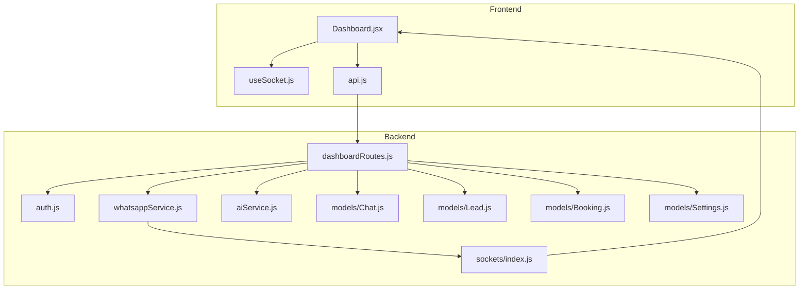
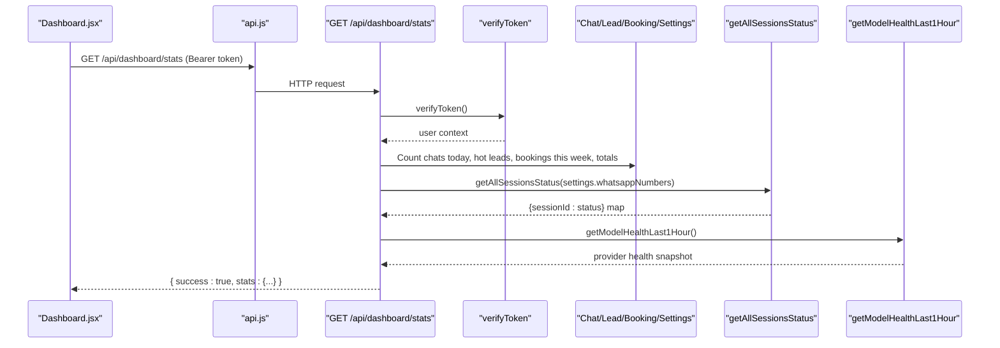
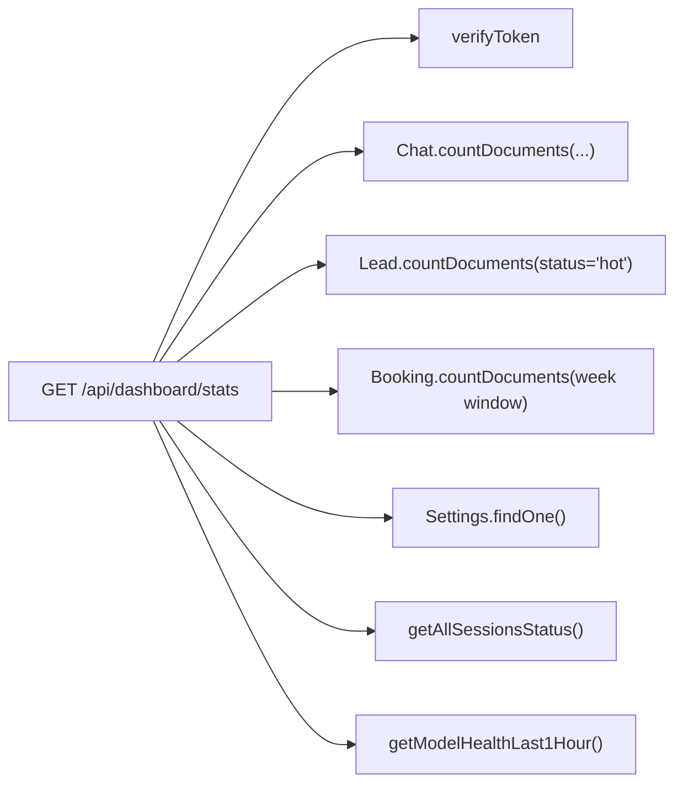

# Dashboard API

<cite>
**Referenced Files in This Document**
- [dashboardRoutes.js](file://backend/src/routes/dashboardRoutes.js)
- [auth.js](file://backend/src/middleware/auth.js)
- [whatsappService.js](file://backend/src/services/whatsappService.js)
- [aiService.js](file://backend/src/services/aiService.js)
- [Lead.js](file://backend/src/models/Lead.js)
- [Chat.js](file://backend/models/Chat.js)
- [Booking.js](file://backend/models/Booking.js)
- [Settings.js](file://backend/models/Settings.js)
- [index.js (sockets)](file://backend/src/sockets/index.js)
- [Dashboard.jsx](file://frontend/src/pages/Dashboard.jsx)
- [api.js](file://frontend/src/utils/api.js)
- [useSocket.js](file://frontend/src/hooks/useSocket.js)
</cite>

## Table of Contents
1. [Introduction](#introduction)
2. [Project Structure](#project-structure)
3. [Core Components](#core-components)
4. [Architecture Overview](#architecture-overview)
5. [Detailed Component Analysis](#detailed-component-analysis)
6. [Dependency Analysis](#dependency-analysis)
7. [Performance Considerations](#performance-considerations)
8. [Troubleshooting Guide](#troubleshooting-guide)
9. [Conclusion](#conclusion)
10. [Appendices](#appendices)

## Introduction
This document provides comprehensive API documentation for dashboard statistics and monitoring endpoints, including:
- System overview statistics
- Active conversation counts
- Lead metrics
- Performance indicators
- Real-time data streaming via WebSocket events for live dashboard updates

It also covers data aggregation logic, caching strategies, filtering options, pagination considerations, data retention policies, and monitoring best practices.

## Project Structure
The dashboard functionality is implemented across backend routes, services, models, and a Socket.io-based real-time layer. The frontend consumes REST endpoints and subscribes to WebSocket events to render live dashboards.

**Diagram sources**
- [dashboardRoutes.js:1-71](file://backend/src/routes/dashboardRoutes.js#L1-L71)
- [auth.js:1-68](file://backend/src/middleware/auth.js#L1-L68)
- [whatsappService.js:1-642](file://backend/src/services/whatsappService.js#L1-L642)
- [aiService.js:1-800](file://backend/src/services/aiService.js#L1-L800)
- [index.js (sockets):1-82](file://backend/src/sockets/index.js#L1-L82)
- [Chat.js:1-107](file://backend/models/Chat.js#L1-L107)
- [Lead.js:1-55](file://backend/models/Lead.js#L1-L55)
- [Booking.js:1-69](file://backend/models/Booking.js#L1-L69)
- [Settings.js:1-38](file://backend/models/Settings.js#L1-L38)
- [Dashboard.jsx:1-496](file://frontend/src/pages/Dashboard.jsx#L1-L496)
- [api.js:1-83](file://frontend/src/utils/api.js#L1-L83)
- [useSocket.js:1-49](file://frontend/src/hooks/useSocket.js#L1-L49)

**Section sources**
- [dashboardRoutes.js:1-71](file://backend/src/routes/dashboardRoutes.js#L1-L71)
- [index.js (sockets):1-82](file://backend/src/sockets/index.js#L1-L82)

## Core Components
- REST endpoint for dashboard stats: GET /api/dashboard/stats
- Authentication middleware: verifyToken
- Data sources: Chat, Lead, Booking, Settings models
- WhatsApp session status service: getAllSessionsStatus
- AI model health metrics: getModelHealthLast1Hour
- WebSocket server: Socket.io with JWT auth and “dashboard” room

Key responsibilities:
- Aggregate counts and metrics from MongoDB collections
- Compute derived metrics such as conversion rate
- Include active WhatsApp sessions count
- Include per-provider AI model health snapshot for the last hour
- Secure access via JWT Bearer token

**Section sources**
- [dashboardRoutes.js:13-68](file://backend/src/routes/dashboardRoutes.js#L13-L68)
- [auth.js:10-47](file://backend/src/middleware/auth.js#L10-L47)
- [whatsappService.js:435-452](file://backend/src/services/whatsappService.js#L435-L452)
- [aiService.js:459-471](file://backend/src/services/aiService.js#L459-L471)
- [index.js (sockets):18-63](file://backend/src/sockets/index.js#L18-L63)

## Architecture Overview
The dashboard aggregates system-wide metrics by querying multiple models and services, then returns a unified JSON payload. Real-time alerts are emitted through Socket.io and consumed by the frontend.

**Diagram sources**
- [dashboardRoutes.js:13-68](file://backend/src/routes/dashboardRoutes.js#L13-L68)
- [auth.js:10-47](file://backend/src/middleware/auth.js#L10-L47)
- [whatsappService.js:435-452](file://backend/src/services/whatsappService.js#L435-L452)
- [aiService.js:459-471](file://backend/src/services/aiService.js#L459-L471)
- [Dashboard.jsx:42-51](file://frontend/src/pages/Dashboard.jsx#L42-L51)
- [api.js:18-34](file://frontend/src/utils/api.js#L18-L34)

## Detailed Component Analysis

### REST Endpoint: GET /api/dashboard/stats
- Method: GET
- URL: /api/dashboard/stats
- Authentication: Required (Bearer JWT)
- Response schema:
  - success: boolean
  - stats: object
    - chatsToday: number (count of chats created today)
    - hotLeadsCount: number (leads with status 'hot')
    - aiFailuresLast24h: number (placeholder; currently 0)
    - activeSessions: number (WhatsApp sessions connected)
    - bookingsThisWeek: number (bookings created within last 7 days)
    - totalChats: number (non-archived chats)
    - totalBookings: number (all bookings)
    - conversionRate: string percentage (totalBookings / totalChats * 100, rounded to one decimal)
    - modelHealthLast1Hour: object (per-provider health snapshot)

Data aggregation logic:
- Today’s chats: count documents where createdAt >= start-of-day
- Hot leads: count documents where status = 'hot'
- Bookings this week: count documents where createdAt >= now minus 7 days
- Total chats: count non-archived chats
- Total bookings: count all bookings
- Conversion rate: computed from totalBookings and totalChats
- Active sessions: read settings.whatsappNumbers, call getAllSessionsStatus, count entries equal to 'connected'
- Model health: retrieve in-memory hourly snapshot from AI service

Filtering options:
- None currently exposed via query parameters. Time windows are fixed (today, last 7 days).

Pagination:
- Not applicable for this endpoint; it returns aggregated counts only.

Caching:
- No explicit response-level cache on this endpoint. Aggregation queries run per request.

Error handling:
- Errors are forwarded to global error handler via next(error).

Example response structure:
- { success: true, stats: { chatsToday, hotLeadsCount, aiFailuresLast24h, activeSessions, bookingsThisWeek, totalChats, totalBookings, conversionRate, modelHealthLast1Hour } }

Real-time integration:
- Frontend polls every 30 seconds and also listens to WebSocket events for live alerts.

**Section sources**
- [dashboardRoutes.js:13-68](file://backend/src/routes/dashboardRoutes.js#L13-L68)
- [Chat.js:99-104](file://backend/models/Chat.js#L99-L104)
- [Lead.js:48-52](file://backend/models/Lead.js#L48-L52)
- [Booking.js:62-66](file://backend/models/Booking.js#L62-L66)
- [Settings.js:16-33](file://backend/models/Settings.js#L16-L33)
- [whatsappService.js:435-452](file://backend/src/services/whatsappService.js#L435-L452)
- [aiService.js:459-471](file://backend/src/services/aiService.js#L459-L471)
- [Dashboard.jsx:72-80](file://frontend/src/pages/Dashboard.jsx#L72-L80)

### WebSocket Events for Live Dashboard Updates
Authentication:
- Socket.io handshake requires JWT token in auth.token field.
- Server verifies token and attaches decoded user to socket.user.
- Authenticated users join the “dashboard” room.

Events emitted to the “dashboard” room:
- lead:hot_alert
  - Payload: { chatId, customerPhone, score, status }
- lead:ai_failure_alert
  - Payload: { chatId, customerPhone, error }
- whatsapp:disconnected
  - Payload: { sessionId, reason }
- whatsapp:reconnect_failed
  - Payload: { sessionId }
- settings:global_mode_changed
  - Payload: { globalMode }

Client-side consumption:
- Frontend uses useSocket hook to connect and listen for these events.
- Dashboard.jsx maps events to UI alerts and notifications.

Connection lifecycle:
- Auto-reconnect handled by client if disconnected while authenticated.

**Section sources**
- [index.js (sockets):18-63](file://backend/src/sockets/index.js#L18-L63)
- [leadScoring.js:171-182](file://backend/src/services/leadScoring.js#L171-L182)
- [leadScoring.js:192-202](file://backend/src/services/leadScoring.js#L192-L202)
- [whatsappService.js:212-256](file://backend/src/services/whatsappService.js#L212-L256)
- [whatsappService.js:333-363](file://backend/src/services/whatsappService.js#L333-L363)
- [Dashboard.jsx:82-176](file://frontend/src/pages/Dashboard.jsx#L82-L176)
- [useSocket.js:13-46](file://frontend/src/hooks/useSocket.js#L13-L46)

### Data Models Relevant to Dashboard Metrics
- Chat
  - Fields used: createdAt, isArchived, bookingStage, mode, language
  - Indexes: customerPhone, lastMessageAt, mode, bookingStage, isArchived, language
- Lead
  - Fields used: status, score, scoreFactors, lastActivityAt
  - Indexes: chatId, customerPhone, status, score, lastActivityAt
- Booking
  - Fields used: createdAt, status, bookingType, date
  - Indexes: customerPhone, date, status, bookingType, chatId
- Settings
  - Fields used: whatsappNumbers (array of { label, number, isActive, isPrimary })

These indexes support efficient counting and filtering for dashboard aggregations.

**Section sources**
- [Chat.js:45-106](file://backend/models/Chat.js#L45-L106)
- [Lead.js:12-54](file://backend/models/Lead.js#L12-L54)
- [Booking.js:8-60](file://backend/models/Booking.js#L8-L60)
- [Settings.js:16-33](file://backend/models/Settings.js#L16-L33)

### AI Model Health Snapshot
- In-memory provider metrics reset hourly.
- Snapshot includes per-provider success, invalid, error counts and average latency.
- Exposed via getModelHealthLast1Hour() and included in dashboard stats.

**Section sources**
- [aiService.js:414-471](file://backend/src/services/aiService.js#L414-L471)

## Dependency Analysis
The dashboard endpoint depends on:
- Authentication middleware for security
- MongoDB models for counts and filters
- WhatsApp service for session status
- AI service for model health metrics

**Diagram sources**
- [dashboardRoutes.js:13-68](file://backend/src/routes/dashboardRoutes.js#L13-L68)
- [auth.js:10-47](file://backend/src/middleware/auth.js#L10-L47)
- [whatsappService.js:435-452](file://backend/src/services/whatsappService.js#L435-L452)
- [aiService.js:459-471](file://backend/src/services/aiService.js#L459-L471)

**Section sources**
- [dashboardRoutes.js:13-68](file://backend/src/routes/dashboardRoutes.js#L13-L68)

## Performance Considerations
- Aggregation queries rely on indexes defined in models; ensure indexes exist for createdAt, status, isArchived, and other filter fields.
- The endpoint performs multiple count operations per request; consider:
  - Caching the stats response for a short TTL (e.g., 10–30 seconds) using an in-memory cache or Redis to reduce database load.
  - Batched aggregation pipelines if MongoDB supports multi-collection aggregation patterns.
- WhatsApp session status retrieval is O(n) over configured numbers; keep the number of sessions reasonable.
- AI model health snapshot is in-memory and resets hourly; avoid high-frequency reads that could cause contention.

[No sources needed since this section provides general guidance]

## Troubleshooting Guide
Common issues and resolutions:
- 401 Unauthorized: Ensure Authorization header contains a valid Bearer JWT token.
- Token expired: Refresh token or re-authenticate.
- Socket authentication failed: Verify socket handshake includes auth.token and that the token is valid.
- WhatsApp session not connected: Check session status via getAllSessionsStatus and review disconnect/reconnect events.
- AI failures alert: Monitor lead:ai_failure_alert events and investigate provider errors.

Operational checks:
- Confirm indexes exist for frequently filtered fields.
- Validate environment variables for JWT secret and frontend URL.
- Review logs for socket connection and WhatsApp session lifecycle events.

**Section sources**
- [auth.js:10-47](file://backend/src/middleware/auth.js#L10-L47)
- [index.js (sockets):27-48](file://backend/src/sockets/index.js#L27-L48)
- [whatsappService.js:212-256](file://backend/src/services/whatsappService.js#L212-L256)
- [leadScoring.js:192-202](file://backend/src/services/leadScoring.js#L192-L202)

## Conclusion
The dashboard API provides a concise set of system overview metrics and integrates real-time alerts via WebSocket. It leverages indexed MongoDB queries and in-memory AI health snapshots to deliver timely insights. For production deployments, consider adding response caching, time-window filtering parameters, and pagination for any future list endpoints.

[No sources needed since this section summarizes without analyzing specific files]

## Appendices

### Request/Response Examples

- Request
  - Method: GET
  - URL: /api/dashboard/stats
  - Headers: Authorization: Bearer <JWT_TOKEN>

- Response
  - Body:
    - success: boolean
    - stats:
      - chatsToday: number
      - hotLeadsCount: number
      - aiFailuresLast24h: number
      - activeSessions: number
      - bookingsThisWeek: number
      - totalChats: number
      - totalBookings: number
      - conversionRate: string
      - modelHealthLast1Hour: object

**Section sources**
- [dashboardRoutes.js:51-64](file://backend/src/routes/dashboardRoutes.js#L51-L64)

### WebSocket Event Formats

- lead:hot_alert
  - { chatId, customerPhone, score, status }

- lead:ai_failure_alert
  - { chatId, customerPhone, error }

- whatsapp:disconnected
  - { sessionId, reason }

- whatsapp:reconnect_failed
  - { sessionId }

- settings:global_mode_changed
  - { globalMode }

**Section sources**
- [leadScoring.js:171-182](file://backend/src/services/leadScoring.js#L171-L182)
- [leadScoring.js:192-202](file://backend/src/services/leadScoring.js#L192-L202)
- [whatsappService.js:212-256](file://backend/src/services/whatsappService.js#L212-L256)
- [whatsappService.js:333-363](file://backend/src/services/whatsappService.js#L333-L363)
- [Dashboard.jsx:104-176](file://frontend/src/pages/Dashboard.jsx#L104-L176)

### Filtering Options and Time Windows
- Current implementation uses fixed windows:
  - Today: start-of-day timestamp
  - Last 7 days: current time minus 7 days
- Future enhancements may add query parameters like ?period=day|week|month and ?from=&to= for custom ranges.

**Section sources**
- [dashboardRoutes.js:15-18](file://backend/src/routes/dashboardRoutes.js#L15-L18)

### Pagination Notes
- The stats endpoint returns aggregated counts and does not require pagination.
- If list endpoints are added later (e.g., recent chats), implement cursor-based or offset/limit pagination with appropriate indexes.

[No sources needed since this section provides general guidance]

### Data Retention Policies
- Chats are soft-deleted via isArchived flag; hard deletion is intentionally avoided to preserve history and analytics integrity.
- Leads and Bookings persist with timestamps; consider archiving or purging very old records based on business needs.

**Section sources**
- [Chat.js:1-4](file://backend/models/Chat.js#L1-L4)

### Monitoring Best Practices
- Track AI provider health metrics and alert on elevated error rates or latency spikes.
- Monitor WhatsApp session connectivity and auto-reconnect attempts.
- Use periodic polling (e.g., every 30 seconds) combined with WebSocket events for near-real-time dashboards.
- Log and surface actionable alerts for hot leads and AI failures.

**Section sources**
- [aiService.js:414-471](file://backend/src/services/aiService.js#L414-L471)
- [whatsappService.js:601-612](file://backend/src/services/whatsappService.js#L601-L612)
- [Dashboard.jsx:72-80](file://frontend/src/pages/Dashboard.jsx#L72-L80)