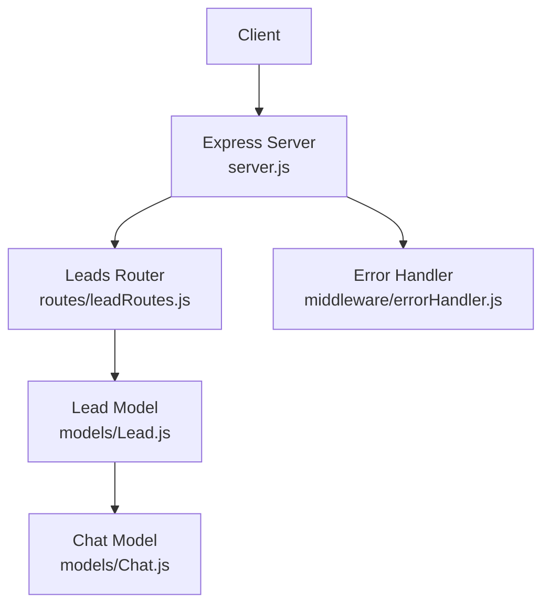
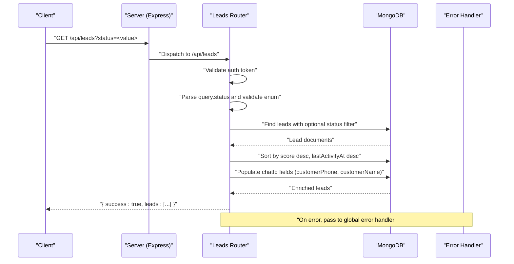
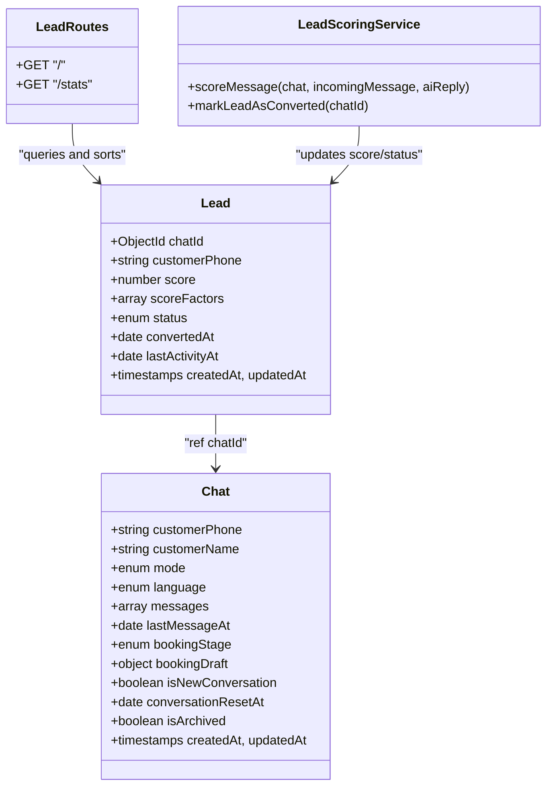

# Lead CRUD Operations

<cite>
**Referenced Files in This Document**
- [server.js](file://backend/src/server.js)
- [leadRoutes.js](file://backend/src/routes/leadRoutes.js)
- [Lead.js](file://backend/src/models/Lead.js)
- [Chat.js](file://backend/src/models/Chat.js)
- [leadScoring.js](file://backend/src/services/leadScoring.js)
- [errorHandler.js](file://backend/src/middleware/errorHandler.js)
</cite>

## Table of Contents
1. [Introduction](#introduction)
2. [Project Structure](#project-structure)
3. [Core Components](#core-components)
4. [Architecture Overview](#architecture-overview)
5. [Detailed Component Analysis](#detailed-component-analysis)
6. [Dependency Analysis](#dependency-analysis)
7. [Performance Considerations](#performance-considerations)
8. [Troubleshooting Guide](#troubleshooting-guide)
9. [Conclusion](#conclusion)

## Introduction
This document provides detailed API documentation for lead listing operations, focusing on the GET /api/leads endpoint with status filtering and response schemas that include populated chat information. It also explains how leads are scored and sorted by score and last activity, describes the lead data model and its relationship to chats, and outlines pagination considerations and error handling patterns.

## Project Structure
The lead listing functionality is implemented as an Express route under the leads module, which uses a Mongoose model for querying and populating related chat data. The server mounts the leads routes at /api/leads.

**Diagram sources**
- [server.js:88-97](file://backend/src/server.js#L88-L97)
- [leadRoutes.js:1-31](file://backend/src/routes/leadRoutes.js#L1-L31)
- [Lead.js:1-55](file://backend/src/models/Lead.js#L1-L55)
- [Chat.js:1-107](file://backend/src/models/Chat.js#L1-L107)
- [errorHandler.js:1-36](file://backend/src/middleware/errorHandler.js#L1-L36)

**Section sources**
- [server.js:88-97](file://backend/src/server.js#L88-L97)
- [leadRoutes.js:1-31](file://backend/src/routes/leadRoutes.js#L1-L31)

## Core Components
- GET /api/leads: Lists leads with optional status filter and returns populated chat fields.
- GET /api/leads/stats: Returns counts per status for dashboard use.
- Lead model: Defines fields such as score, status, lastActivityAt, and relationships to Chat.
- Lead scoring service: Updates lead scores and statuses based on conversation signals.

Key responsibilities:
- Route layer: Validates query parameters, builds queries, sorts results, and populates chat details.
- Data layer: Stores lead metadata and references to chats; indexes optimize filtering and sorting.
- Scoring service: Adjusts lead score and status over time and emits real-time alerts when thresholds are crossed.

**Section sources**
- [leadRoutes.js:11-31](file://backend/src/routes/leadRoutes.js#L11-L31)
- [leadRoutes.js:37-69](file://backend/src/routes/leadRoutes.js#L37-L69)
- [Lead.js:12-52](file://backend/src/models/Lead.js#L12-L52)
- [leadScoring.js:38-163](file://backend/src/services/leadScoring.js#L38-L163)

## Architecture Overview
The GET /api/leads flow validates authentication, filters by status if provided, queries leads, sorts by score and last activity, and populates selected chat fields before returning a standardized JSON response.

**Diagram sources**
- [server.js:88-97](file://backend/src/server.js#L88-L97)
- [leadRoutes.js:11-31](file://backend/src/routes/leadRoutes.js#L11-L31)
- [Lead.js:12-52](file://backend/src/models/Lead.js#L12-L52)
- [Chat.js:45-97](file://backend/src/models/Chat.js#L45-L97)
- [errorHandler.js:9-33](file://backend/src/middleware/errorHandler.js#L9-L33)

## Detailed Component Analysis

### Endpoint: GET /api/leads
- Purpose: List leads with optional status filtering and return enriched lead objects including chat details.
- Authentication: Requires a valid token via middleware.
- Query Parameters:
  - status: Optional. Filters leads by one of the allowed values: cold, warm, hot, converted, lost. If omitted or invalid, no status filter is applied.
- Sorting:
  - Primary: score descending.
  - Secondary: lastActivityAt descending.
- Response Schema:
  - success: boolean indicating request outcome.
  - leads: array of lead objects. Each lead includes:
    - _id: ObjectId of the lead.
    - chatId: Object reference to Chat with fields:
      - customerPhone: string.
      - customerName: string (nullable).
    - customerPhone: string.
    - score: number between 0 and 100.
    - scoreFactors: array of { factor: string, points: number, addedAt: date }.
    - status: one of cold, warm, hot, converted, lost.
    - convertedAt: date or null.
    - lastActivityAt: date.
    - createdAt, updatedAt: timestamps.
- Example Requests:
  - List all leads: GET /api/leads
  - Filter by hot leads: GET /api/leads?status=hot
  - Filter by warm leads: GET /api/leads?status=warm
  - Filter by converted leads: GET /api/leads?status=converted
  - Filter by lost leads: GET /api/leads?status=lost
  - Filter by cold leads: GET /api/leads?status=cold
- Example Responses:
  - Success:
    - { success: true, leads: [ ... ] }
  - Error:
    - { success: false, message: "<error message>" }

Notes:
- Invalid or missing status parameter does not cause an error; it simply omits the status filter.
- Only specific chat fields are populated to reduce payload size.

**Section sources**
- [leadRoutes.js:11-31](file://backend/src/routes/leadRoutes.js#L11-L31)
- [Lead.js:12-52](file://backend/src/models/Lead.js#L12-L52)
- [Chat.js:45-97](file://backend/src/models/Chat.js#L45-L97)

### Endpoint: GET /api/leads/stats
- Purpose: Provide counts per status for dashboard visualization.
- Response Schema:
  - success: boolean.
  - stats: object with keys cold, warm, hot, converted, lost, total. Each key maps to the count of leads in that status; total is the sum across statuses.
- Example Response:
  - { success: true, stats: { cold: 10, warm: 5, hot: 2, converted: 1, lost: 0, total: 18 } }

**Section sources**
- [leadRoutes.js:37-69](file://backend/src/routes/leadRoutes.js#L37-L69)

### Lead Data Model
Fields:
- chatId: Reference to Chat document; required and indexed.
- customerPhone: String; required.
- score: Number; default 0; constrained between 0 and 100.
- scoreFactors: Array of { factor, points, addedAt }; tracks reasons for score changes.
- status: Enum; default cold; one of cold, warm, hot, converted, lost; indexed.
- convertedAt: Date; set when a lead becomes converted.
- lastActivityAt: Date; updated on scoring events; indexed.
- Timestamps: createdAt, updatedAt automatically managed.

Indexes:
- chatId, customerPhone, status, score (desc), lastActivityAt (desc) to support efficient filtering and sorting.

Relationships:
- One-to-one logical mapping from Chat to Lead via chatId.
- Populated fields returned by GET /api/leads include customerPhone and customerName from Chat.

**Section sources**
- [Lead.js:12-52](file://backend/src/models/Lead.js#L12-L52)
- [Chat.js:45-97](file://backend/src/models/Chat.js#L45-L97)

### Lead Scoring and Status Logic
- Score updates occur when messages are processed:
  - Points are awarded for signals like pricing inquiries, dates provided, guest counts, reaching price_quoted stage, name/phone sharing, browsing photos/location, and booking intent phrases.
  - Cumulative score determines status:
    - 0–30: cold
    - 31–60: warm
    - 61–100: hot
  - Converted leads are explicitly marked with status converted and score 100.
- lastActivityAt is updated on each scoring event.
- Real-time alerts:
  - When a lead first crosses into hot territory, a socket event is emitted to notify dashboards.

Practical implications for listing:
- Hot leads tend to appear earlier due to higher scores.
- Among equal scores, more recent activity surfaces first.

**Section sources**
- [leadScoring.js:38-163](file://backend/src/services/leadScoring.js#L38-L163)
- [leadScoring.js:209-226](file://backend/src/services/leadScoring.js#L209-L226)

### Sorting Mechanism
- Sort order:
  - score descending (highest first).
  - lastActivityAt descending (most recent first).
- This ensures high-intent leads surface quickly while keeping recently active leads visible.

**Section sources**
- [leadRoutes.js:20-22](file://backend/src/routes/leadRoutes.js#L20-L22)
- [Lead.js:48-52](file://backend/src/models/Lead.js#L48-L52)

### Pagination Considerations
- Current implementation does not include pagination parameters (e.g., page, limit).
- All matching leads are returned in a single response.
- For large datasets, consider adding pagination in future iterations to improve performance and client rendering efficiency.

[No sources needed since this section provides general guidance]

### Practical Listing Scenarios
- Show only hot leads:
  - Request: GET /api/leads?status=hot
  - Use case: Focus sales attention on highest-intent prospects.
- Show warm leads:
  - Request: GET /api/leads?status=warm
  - Use case: Nurture campaigns for moderately interested customers.
- Show converted leads:
  - Request: GET /api/leads?status=converted
  - Use case: Post-sale follow-ups and retention.
- Show lost leads:
  - Request: GET /api/leads?status=lost
  - Use case: Win-back analysis and reporting.
- Show all leads:
  - Request: GET /api/leads
  - Use case: Full overview without filtering.

**Section sources**
- [leadRoutes.js:11-31](file://backend/src/routes/leadRoutes.js#L11-L31)

### Error Handling Patterns
- Authentication failures:
  - If the token is invalid or missing, the auth middleware will reject the request before reaching the route logic.
- Unexpected errors:
  - Any unhandled exception within the route is passed to the global error handler, which logs details and returns a consistent JSON error shape.
- Typical error response:
  - { success: false, message: "<error message>" }
  - In development environments, stack traces may be included for debugging.

**Section sources**
- [leadRoutes.js:28-30](file://backend/src/routes/leadRoutes.js#L28-L30)
- [errorHandler.js:9-33](file://backend/src/middleware/errorHandler.js#L9-L33)

## Dependency Analysis
The following diagram shows how the leads listing feature depends on models and services.

**Diagram sources**
- [leadRoutes.js:11-31](file://backend/src/routes/leadRoutes.js#L11-L31)
- [Lead.js:12-52](file://backend/src/models/Lead.js#L12-L52)
- [Chat.js:45-97](file://backend/src/models/Chat.js#L45-L97)
- [leadScoring.js:38-163](file://backend/src/services/leadScoring.js#L38-L163)

**Section sources**
- [server.js:88-97](file://backend/src/server.js#L88-L97)
- [leadRoutes.js:11-31](file://backend/src/routes/leadRoutes.js#L11-L31)
- [Lead.js:12-52](file://backend/src/models/Lead.js#L12-L52)
- [Chat.js:45-97](file://backend/src/models/Chat.js#L45-L97)
- [leadScoring.js:38-163](file://backend/src/services/leadScoring.js#L38-L163)

## Performance Considerations
- Indexes:
  - status, score (desc), and lastActivityAt (desc) are indexed to accelerate filtering and sorting.
- Population:
  - Only necessary chat fields are populated to minimize payload size.
- Aggregation:
  - Stats endpoint uses aggregation to compute counts efficiently.
- Future improvements:
  - Add pagination and field selection options to reduce memory usage and network overhead for large result sets.

**Section sources**
- [Lead.js:48-52](file://backend/src/models/Lead.js#L48-L52)
- [leadRoutes.js:20-22](file://backend/src/routes/leadRoutes.js#L20-L22)
- [leadRoutes.js:37-69](file://backend/src/routes/leadRoutes.js#L37-L69)

## Troubleshooting Guide
- No leads returned:
  - Verify status filter value is one of the allowed enums.
  - Ensure there are leads in the database and they are not archived or otherwise filtered out by other constraints.
- Incorrect sort order:
  - Confirm that score and lastActivityAt are being updated by the scoring service.
- Missing chat fields:
  - The route populates only customerPhone and customerName from Chat; additional fields require extending the populate call.
- Authentication errors:
  - Ensure a valid token is included in requests to protected endpoints.
- Unexpected server errors:
  - Check application logs for stack traces in development; production responses omit stacks for security.

**Section sources**
- [leadRoutes.js:11-31](file://backend/src/routes/leadRoutes.js#L11-L31)
- [errorHandler.js:9-33](file://backend/src/middleware/errorHandler.js#L9-L33)

## Conclusion
The GET /api/leads endpoint provides a robust way to list leads with flexible status filtering and meaningful enrichment from related chat data. Combined with automatic scoring and indexing, it supports prioritization by intent and recency. While pagination is not currently implemented, the existing design allows straightforward extension for large-scale deployments.