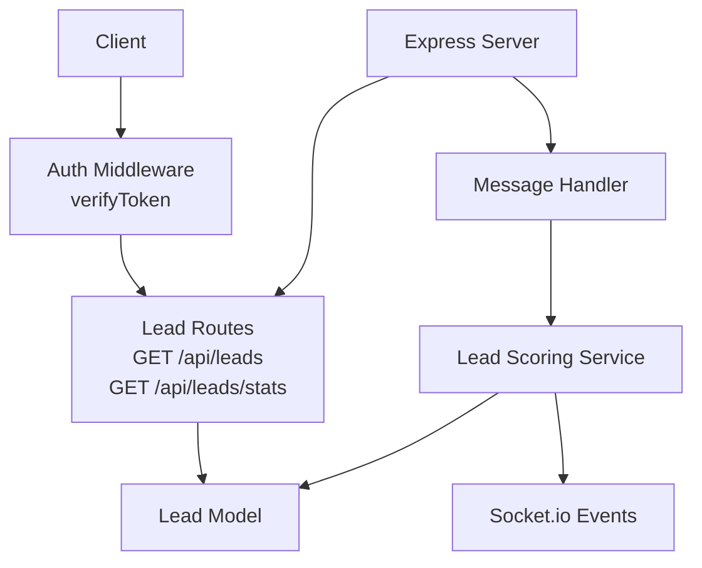
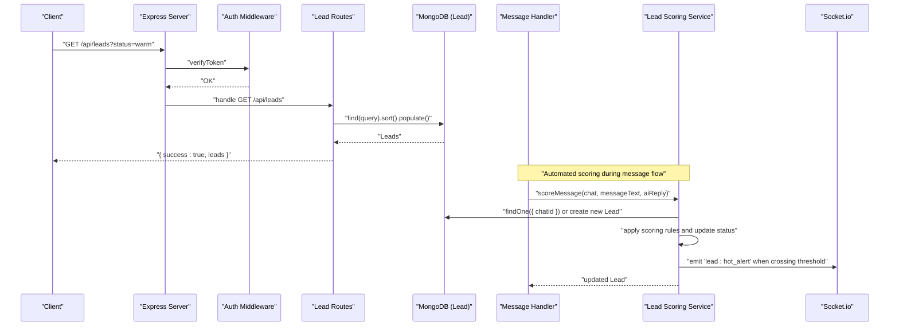
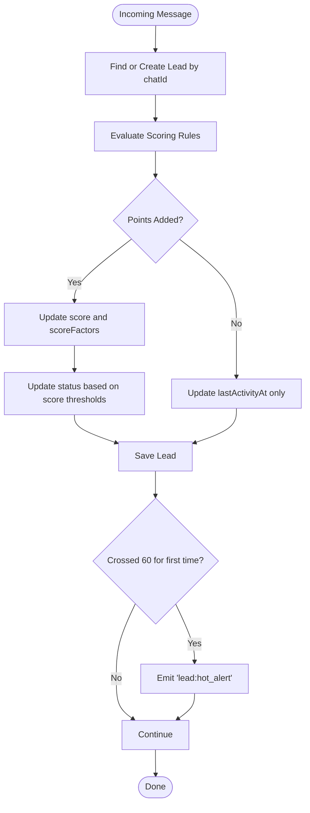
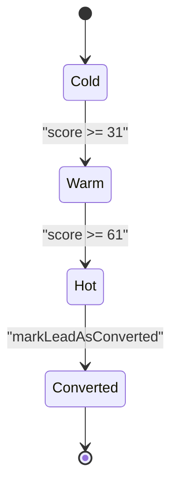
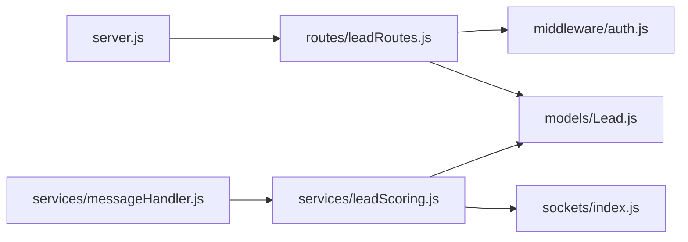

# Lead Management API

<cite>
**Referenced Files in This Document**
- [server.js](file://backend/src/server.js)
- [leadRoutes.js](file://backend/src/routes/leadRoutes.js)
- [Lead.js](file://backend/src/models/Lead.js)
- [Chat.js](file://backend/src/models/Chat.js)
- [leadScoring.js](file://backend/src/services/leadScoring.js)
- [messageHandler.js](file://backend/src/services/messageHandler.js)
- [auth.js](file://backend/src/middleware/auth.js)
</cite>

## Table of Contents
1. [Introduction](#introduction)
2. [Project Structure](#project-structure)
3. [Core Components](#core-components)
4. [Architecture Overview](#architecture-overview)
5. [Detailed Component Analysis](#detailed-component-analysis)
6. [Dependency Analysis](#dependency-analysis)
7. [Performance Considerations](#performance-considerations)
8. [Troubleshooting Guide](#troubleshooting-guide)
9. [Conclusion](#conclusion)
10. [Appendices](#appendices)

## Introduction
This document provides detailed API documentation for lead management endpoints and the automated lead scoring system. It covers:
- Available endpoints for listing leads and retrieving status-based statistics
- Authentication requirements and response formats
- The automated scoring engine that updates lead scores based on conversation signals and engagement metrics
- Status progression from cold to warm to hot, and conversion handling
- Activity tracking mechanisms and real-time alerts via Socket.io
- Practical workflows for lead creation, scoring criteria configuration, and integration with follow-up systems

## Project Structure
The lead management functionality is implemented across routes, models, services, and middleware:
- Routes define HTTP endpoints under /api/leads
- Models define data structures for Leads and Chats
- Services implement scoring logic and integrate with message processing
- Middleware enforces authentication for protected endpoints
- Server wires routes and initializes real-time communication

**Diagram sources**
- [server.js:88-97](file://backend/src/server.js#L88-L97)
- [leadRoutes.js:1-72](file://backend/src/routes/leadRoutes.js#L1-L72)
- [Lead.js:1-55](file://backend/src/models/Lead.js#L1-L55)
- [messageHandler.js:1-183](file://backend/src/services/messageHandler.js#L1-L183)
- [leadScoring.js:1-235](file://backend/src/services/leadScoring.js#L1-L235)
- [auth.js:1-68](file://backend/src/middleware/auth.js#L1-L68)

**Section sources**
- [server.js:88-97](file://backend/src/server.js#L88-L97)
- [leadRoutes.js:1-72](file://backend/src/routes/leadRoutes.js#L1-L72)
- [Lead.js:1-55](file://backend/src/models/Lead.js#L1-L55)
- [messageHandler.js:1-183](file://backend/src/services/messageHandler.js#L1-L183)
- [leadScoring.js:1-235](file://backend/src/services/leadScoring.js#L1-L235)
- [auth.js:1-68](file://backend/src/middleware/auth.js#L1-L68)

## Core Components
- Lead model defines fields such as chatId, customerPhone, score (0–100), scoreFactors, status (cold/warm/hot/converted/lost), convertedAt, lastActivityAt, and timestamps.
- Lead routes expose GET endpoints for listing leads with optional status filtering and for retrieving aggregated stats by status.
- Lead scoring service evaluates incoming messages against keyword and pattern rules, updates lead scores and statuses, tracks activity, and emits real-time events.
- Message handler integrates scoring into the WhatsApp message flow, ensuring every AI-mode interaction contributes to lead scoring.

Key responsibilities:
- Endpoints: list leads, filter by status, aggregate counts
- Data model: enforce constraints and indexes for performance
- Scoring: compute points, update status thresholds, record factors
- Integration: trigger alerts and follow-ups based on lead state changes

**Section sources**
- [Lead.js:1-55](file://backend/src/models/Lead.js#L1-L55)
- [leadRoutes.js:1-72](file://backend/src/routes/leadRoutes.js#L1-L72)
- [leadScoring.js:1-235](file://backend/src/services/leadScoring.js#L1-L235)
- [messageHandler.js:1-183](file://backend/src/services/messageHandler.js#L1-L183)

## Architecture Overview
The lead management architecture combines REST endpoints with an event-driven scoring pipeline:
- Clients authenticate via JWT and call lead endpoints
- The server mounts lead routes under /api/leads
- Incoming WhatsApp messages are processed by the message handler, which triggers lead scoring
- The scoring service updates the Lead document and emits Socket.io events for real-time dashboards

**Diagram sources**
- [server.js:88-97](file://backend/src/server.js#L88-L97)
- [leadRoutes.js:1-72](file://backend/src/routes/leadRoutes.js#L1-L72)
- [auth.js:1-68](file://backend/src/middleware/auth.js#L1-L68)
- [messageHandler.js:1-183](file://backend/src/services/messageHandler.js#L1-L183)
- [leadScoring.js:1-235](file://backend/src/services/leadScoring.js#L1-L235)

## Detailed Component Analysis

### Lead Listing Endpoint
- Method: GET
- URL: /api/leads
- Authentication: Required (Bearer token)
- Query parameters:
  - status: one of cold, warm, hot, converted, lost
- Response schema:
  - success: boolean
  - leads: array of Lead documents populated with chatId fields (customerPhone, customerName)
- Behavior:
  - Filters by status if provided
  - Sorts by score descending, then lastActivityAt descending
  - Populates related Chat fields for display

Example request:
- GET /api/leads?status=hot
- Headers: Authorization: Bearer <token>

Example response:
- { success: true, leads: [...] }

**Section sources**
- [leadRoutes.js:11-31](file://backend/src/routes/leadRoutes.js#L11-L31)
- [auth.js:10-47](file://backend/src/middleware/auth.js#L10-L47)

### Lead Statistics Endpoint
- Method: GET
- URL: /api/leads/stats
- Authentication: Required (Bearer token)
- Response schema:
  - success: boolean
  - stats: object with keys cold, warm, hot, converted, lost, total
- Behavior:
  - Aggregates count per status using MongoDB aggregation
  - Normalizes result to include all statuses even if zero

Example request:
- GET /api/leads/stats
- Headers: Authorization: Bearer <token>

Example response:
- { success: true, stats: { cold: N, warm: N, hot: N, converted: N, lost: N, total: N } }

**Section sources**
- [leadRoutes.js:37-69](file://backend/src/routes/leadRoutes.js#L37-L69)
- [auth.js:10-47](file://backend/src/middleware/auth.js#L10-L47)

### Lead Model Schema
- Fields:
  - chatId: ObjectId reference to Chat, required, indexed
  - customerPhone: String, required
  - score: Number, default 0, min 0, max 100
  - scoreFactors: Array of factor entries with factor, points, addedAt
  - status: Enum ['cold','warm','hot','converted','lost'], default 'cold', indexed
  - convertedAt: Date, default null
  - lastActivityAt: Date, indexed
  - timestamps: createdAt, updatedAt
- Indexes:
  - chatId, customerPhone, status, score (desc), lastActivityAt (desc)

Notes:
- Enforces score bounds and status values
- Optimized queries for listing and sorting by score/activity

**Section sources**
- [Lead.js:1-55](file://backend/src/models/Lead.js#L1-L55)

### Automated Lead Scoring System
- Trigger:
  - After AI-generated responses in message handling
- Inputs:
  - Chat document (includes bookingStage)
  - Incoming message text
  - Optional AI reply context
- Scoring rules (examples):
  - Pricing/cost keywords → +15
  - Specific date patterns → +25
  - Guest count patterns → +15
  - Reached booking stage price_quoted → +10 (once)
  - Name provided patterns → +15 (once)
  - Phone number pattern → +20 (once)
  - Photos/location browsing keywords → +5
  - Booking intent phrases → +30
- State updates:
  - score = min(100, previousScore + pointsAdded)
  - status transitions:
    - 0–30 → cold
    - 31–60 → warm
    - 61–100 → hot
  - lastActivityAt updated on each evaluation
- Real-time alerts:
  - Emits 'lead:hot_alert' when first crossing 60 points
- Conversion:
  - markLeadAsConverted sets status to 'converted', score to 100, records convertedAt, emits 'lead:converted'

**Diagram sources**
- [leadScoring.js:38-163](file://backend/src/services/leadScoring.js#L38-L163)
- [messageHandler.js:152-153](file://backend/src/services/messageHandler.js#L152-L153)

**Section sources**
- [leadScoring.js:38-163](file://backend/src/services/leadScoring.js#L38-L163)
- [leadScoring.js:171-182](file://backend/src/services/leadScoring.js#L171-L182)
- [leadScoring.js:209-226](file://backend/src/services/leadScoring.js#L209-L226)
- [messageHandler.js:152-153](file://backend/src/services/messageHandler.js#L152-L153)

### Status Transitions and Lifecycle
- Initial status: cold
- Progression:
  - cold → warm (score ≥ 31)
  - warm → hot (score ≥ 61)
  - hot → converted (manual or booking completion)
- Lost status:
  - Not updated automatically by scoring; can be set externally if needed
- Conversion:
  - Sets status to 'converted', score to 100, records convertedAt
  - Emits 'lead:converted' event

**Diagram sources**
- [leadScoring.js:141-147](file://backend/src/services/leadScoring.js#L141-L147)
- [leadScoring.js:209-226](file://backend/src/services/leadScoring.js#L209-L226)

**Section sources**
- [leadScoring.js:141-147](file://backend/src/services/leadScoring.js#L141-L147)
- [leadScoring.js:209-226](file://backend/src/services/leadScoring.js#L209-L226)

### Activity Tracking Mechanisms
- lastActivityAt updated on every scoring evaluation
- Useful for sorting and prioritizing active leads
- Combined with score for ordering in listings

**Section sources**
- [leadScoring.js:135-160](file://backend/src/services/leadScoring.js#L135-L160)
- [leadRoutes.js:20-22](file://backend/src/routes/leadRoutes.js#L20-L22)

### Integration with Follow-Up Systems
- When a chat transitions out of initial stage, follow-ups may be scheduled
- Customer replies cancel pending follow-ups
- Opt-out handling prevents further automated outreach

**Section sources**
- [messageHandler.js:99-101](file://backend/src/services/messageHandler.js#L99-L101)
- [messageHandler.js:155-159](file://backend/src/services/messageHandler.js#L155-L159)

### Real-Time Alerts
- Hot lead alert emitted when lead crosses 60 points for the first time
- AI failure alert emitted when AI generation fails
- Frontend listens for these events to notify staff

**Section sources**
- [leadScoring.js:171-182](file://backend/src/services/leadScoring.js#L171-L182)
- [leadScoring.js:192-202](file://backend/src/services/leadScoring.js#L192-L202)
- [messageHandler.js:169-172](file://backend/src/services/messageHandler.js#L169-L172)

## Dependency Analysis
- Express server mounts lead routes under /api/leads
- Lead routes depend on auth middleware for JWT verification
- Lead routes query Lead model and populate Chat fields
- Message handler depends on lead scoring service to evaluate conversations
- Lead scoring service depends on Lead model and emits Socket.io events

**Diagram sources**
- [server.js:88-97](file://backend/src/server.js#L88-L97)
- [leadRoutes.js:1-72](file://backend/src/routes/leadRoutes.js#L1-L72)
- [auth.js:1-68](file://backend/src/middleware/auth.js#L1-L68)
- [messageHandler.js:1-183](file://backend/src/services/messageHandler.js#L1-L183)
- [leadScoring.js:1-235](file://backend/src/services/leadScoring.js#L1-L235)

**Section sources**
- [server.js:88-97](file://backend/src/server.js#L88-L97)
- [leadRoutes.js:1-72](file://backend/src/routes/leadRoutes.js#L1-L72)
- [auth.js:1-68](file://backend/src/middleware/auth.js#L1-L68)
- [messageHandler.js:1-183](file://backend/src/services/messageHandler.js#L1-L183)
- [leadScoring.js:1-235](file://backend/src/services/leadScoring.js#L1-L235)

## Performance Considerations
- Database indexes:
  - status, score (desc), lastActivityAt (desc), chatId, customerPhone improve query efficiency
- Sorting:
  - Listings sort by score and lastActivityAt to prioritize active, high-value leads
- Aggregation:
  - Stats endpoint uses $group to efficiently count leads per status
- Caching:
  - No explicit caching implemented; consider adding cache layers for frequently accessed stats if needed

[No sources needed since this section provides general guidance]

## Troubleshooting Guide
Common issues and resolutions:
- Authentication failures:
  - Ensure Authorization header includes valid Bearer token
  - Check token expiration and secret configuration
- Missing leads:
  - Verify chatId exists and matches Chat document
  - Confirm scoring service is invoked in AI mode message flow
- Incorrect status:
  - Review scoring rules and ensure thresholds are met
  - Check for duplicate factor additions (e.g., name/phone once-only logic)
- Real-time alerts not received:
  - Confirm Socket.io instance is initialized and passed to scoring service
  - Validate frontend listeners for 'lead:hot_alert' and 'lead:ai_failure_alert'

**Section sources**
- [auth.js:10-47](file://backend/src/middleware/auth.js#L10-L47)
- [leadScoring.js:38-163](file://backend/src/services/leadScoring.js#L38-L163)
- [messageHandler.js:152-172](file://backend/src/services/messageHandler.js#L152-L172)

## Conclusion
The lead management system provides robust endpoints for listing and analyzing leads, combined with an automated scoring engine that transforms conversational signals into actionable insights. Status progression and real-time alerts enable timely follow-ups, while activity tracking ensures prioritization of engaged prospects. Integrating with follow-up systems and maintaining clean data schemas supports scalable operations and improved conversion outcomes.

[No sources needed since this section summarizes without analyzing specific files]

## Appendices

### Practical Workflows

- Lead Creation Workflow:
  - A new WhatsApp conversation creates a Chat document
  - On first AI-mode message, scoring service finds or creates a Lead linked by chatId
  - Lead starts at cold with score 0 and lastActivityAt set

- Scoring Criteria Configuration:
  - Adjust keyword lists and pattern regexes in scoring service
  - Modify point weights and thresholds to align with business goals
  - Re-test with sample messages to validate behavior

- Bulk Operations:
  - Currently no bulk endpoints exposed; use direct database operations if necessary
  - For future enhancements, add batch update endpoints with admin authorization

- Data Enrichment Processes:
  - Extract customerName and phone from messages and update Chat and Lead fields
  - Use bookingDraft and bookingStage to enrich lead context

- Integration with Follow-Up Systems:
  - Schedule follow-ups when booking interest emerges
  - Cancel pending follow-ups upon customer replies
  - Respect opt-out flags to avoid unwanted outreach

**Section sources**
- [messageHandler.js:57-74](file://backend/src/services/messageHandler.js#L57-L74)
- [messageHandler.js:152-159](file://backend/src/services/messageHandler.js#L152-L159)
- [leadScoring.js:38-163](file://backend/src/services/leadScoring.js#L38-L163)