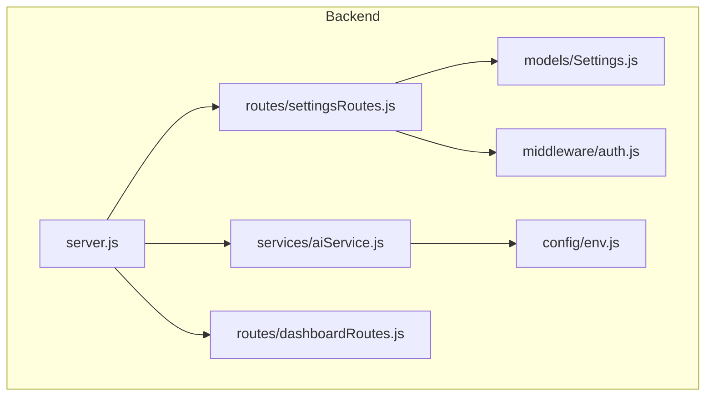
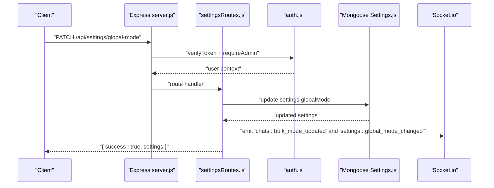
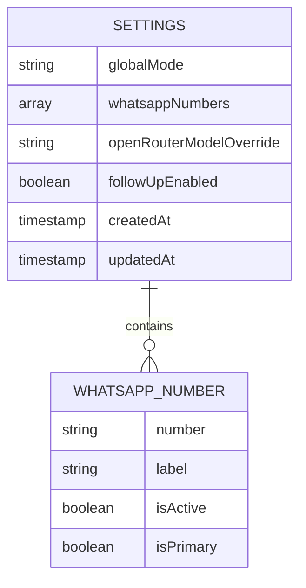
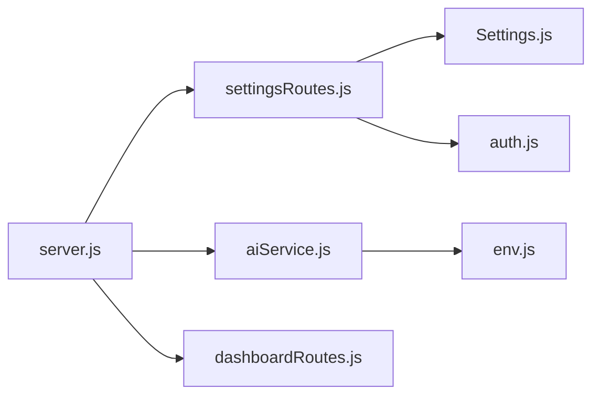

# Settings Management API

<cite>
**Referenced Files in This Document**
- [server.js](file://backend/src/server.js)
- [settingsRoutes.js](file://backend/src/routes/settingsRoutes.js)
- [Settings.js](file://backend/src/models/Settings.js)
- [env.js](file://backend/src/config/env.js)
- [aiService.js](file://backend/src/services/aiService.js)
- [auth.js](file://backend/src/middleware/auth.js)
- [dashboardRoutes.js](file://backend/src/routes/dashboardRoutes.js)
</cite>

## Table of Contents
1. [Introduction](#introduction)
2. [Project Structure](#project-structure)
3. [Core Components](#core-components)
4. [Architecture Overview](#architecture-overview)
5. [Detailed Component Analysis](#detailed-component-analysis)
6. [Dependency Analysis](#dependency-analysis)
7. [Performance Considerations](#performance-considerations)
8. [Troubleshooting Guide](#troubleshooting-guide)
9. [Conclusion](#conclusion)
10. [Appendices](#appendices)

## Introduction
This document provides detailed API documentation for system settings and configuration endpoints, focusing on:
- Managing global application settings (mode toggles, follow-ups, WhatsApp numbers)
- Understanding environment-driven provider configuration for AI services (OpenRouter, Google Gemini, Groq, Cloudflare Workers AI, Cerebras, Ollama)
- Security considerations for sensitive configuration data
- Validation rules and configuration schemas
- Practical examples for updating settings and understanding runtime behavior

Note: The repository implements a subset of the requested provider management endpoints. Provider credentials are configured via environment variables at startup; there are no runtime PATCH/PUT endpoints to update provider keys or models through the API.

## Project Structure
The settings-related functionality is implemented under the backend module with Express routes, Mongoose models, and environment validation.

**Diagram sources**
- [server.js:88-97](file://backend/src/server.js#L88-L97)
- [settingsRoutes.js:1-143](file://backend/src/routes/settingsRoutes.js#L1-L143)
- [Settings.js:1-38](file://backend/src/models/Settings.js#L1-L38)
- [auth.js:1-68](file://backend/src/middleware/auth.js#L1-L68)
- [aiService.js:1-120](file://backend/src/services/aiService.js#L1-L120)
- [env.js:1-95](file://backend/src/config/env.js#L1-L95)
- [dashboardRoutes.js:1-71](file://backend/src/routes/dashboardRoutes.js#L1-L71)

**Section sources**
- [server.js:88-97](file://backend/src/server.js#L88-L97)
- [settingsRoutes.js:1-143](file://backend/src/routes/settingsRoutes.js#L1-L143)
- [Settings.js:1-38](file://backend/src/models/Settings.js#L1-L38)
- [env.js:1-95](file://backend/src/config/env.js#L1-L95)
- [aiService.js:1-120](file://backend/src/services/aiService.js#L1-L120)
- [dashboardRoutes.js:1-71](file://backend/src/routes/dashboardRoutes.js#L1-L71)

## Core Components
- Settings REST endpoints:
  - GET /api/settings
  - PATCH /api/settings/global-mode
  - PATCH /api/settings/follow-ups
  - PUT /api/settings/whatsapp-numbers
- Settings model schema defines persisted fields and defaults.
- Environment configuration validates and exposes provider credentials and model names used by the AI service.
- Authentication middleware enforces token verification and admin-only access for write operations.

Key responsibilities:
- Route handlers validate inputs, persist changes, and emit real-time updates where applicable.
- Model schema ensures type safety and default values.
- Environment loader centralizes provider configuration and fails fast on invalid env.

**Section sources**
- [settingsRoutes.js:9-143](file://backend/src/routes/settingsRoutes.js#L9-L143)
- [Settings.js:16-37](file://backend/src/models/Settings.js#L16-L37)
- [env.js:4-95](file://backend/src/config/env.js#L4-L95)
- [auth.js:10-62](file://backend/src/middleware/auth.js#L10-L62)

## Architecture Overview
The settings API integrates with authentication, database persistence, and real-time broadcasting. Provider configuration is loaded from environment variables and consumed by the AI service.

**Diagram sources**
- [server.js:88-97](file://backend/src/server.js#L88-L97)
- [settingsRoutes.js:42-80](file://backend/src/routes/settingsRoutes.js#L42-L80)
- [auth.js:10-62](file://backend/src/middleware/auth.js#L10-L62)
- [Settings.js:16-37](file://backend/src/models/Settings.js#L16-L37)

## Detailed Component Analysis

### Settings Endpoints

#### GET /api/settings
- Purpose: Retrieve current global settings. Creates default settings if none exist.
- Authorization: Requires valid JWT token.
- Request: None
- Response:
  - success: boolean
  - settings: object containing:
    - globalMode: string ("ai" | "human")
    - whatsappNumbers: array of number objects
    - openRouterModelOverride: string or null
    - followUpEnabled: boolean
- Notes:
  - If no settings record exists, a default one is created and returned.

Example response shape:
{
  "success": true,
  "settings": {
    "globalMode": "ai",
    "whatsappNumbers": [],
    "openRouterModelOverride": null,
    "followUpEnabled": true
  }
}

**Section sources**
- [settingsRoutes.js:9-35](file://backend/src/routes/settingsRoutes.js#L9-L35)
- [Settings.js:16-37](file://backend/src/models/Settings.js#L16-L37)

#### PATCH /api/settings/global-mode
- Purpose: Toggle all-AI vs all-human mode globally. Admin only.
- Authorization: Valid JWT token + admin role.
- Request body:
  - globalMode: string ("ai" | "human")
- Validation:
  - Must be exactly "ai" or "human".
- Behavior:
  - Updates settings.globalMode
  - Bulk updates existing Chat documents’ mode field
  - Emits real-time events:
    - chats:bulk_mode_updated
    - settings:global_mode_changed
- Response:
  - success: boolean
  - settings: updated settings object

Error responses:
- 400: Invalid globalMode value
- 401: Missing or invalid token
- 403: Non-admin user

Example request:
{
  "globalMode": "human"
}

**Section sources**
- [settingsRoutes.js:37-80](file://backend/src/routes/settingsRoutes.js#L37-L80)
- [auth.js:53-62](file://backend/src/middleware/auth.js#L53-L62)

#### PATCH /api/settings/follow-ups
- Purpose: Enable/disable automated follow-up system. Admin only.
- Authorization: Valid JWT token + admin role.
- Request body:
  - followUpEnabled: boolean
- Validation:
  - Must be a boolean.
- Response:
  - success: boolean
  - settings: updated settings object

Error responses:
- 400: followUpEnabled must be a boolean
- 401: Missing or invalid token
- 403: Non-admin user

Example request:
{
  "followUpEnabled": false
}

**Section sources**
- [settingsRoutes.js:82-110](file://backend/src/routes/settingsRoutes.js#L82-L110)
- [auth.js:53-62](file://backend/src/middleware/auth.js#L53-L62)

#### PUT /api/settings/whatsapp-numbers
- Purpose: Update WhatsApp numbers configuration. Admin only.
- Authorization: Valid JWT token + admin role.
- Request body:
  - whatsappNumbers: array of number objects
- Validation:
  - Must be an array.
- Number object structure (from model):
  - number: string
  - label: string
  - isActive: boolean (default true)
  - isPrimary: boolean (default false)
- Response:
  - success: boolean
  - settings: updated settings object

Error responses:
- 400: whatsappNumbers must be an array
- 401: Missing or invalid token
- 403: Non-admin user

Example request:
{
  "whatsappNumbers": [
    { "number": "+91XXXXXXXXXX", "label": "Main", "isActive": true, "isPrimary": true },
    { "number": "+91YYYYYYYYYY", "label": "Support", "isActive": true, "isPrimary": false }
  ]
}

**Section sources**
- [settingsRoutes.js:112-140](file://backend/src/routes/settingsRoutes.js#L112-L140)
- [Settings.js:3-14](file://backend/src/models/Settings.js#L3-L14)
- [auth.js:53-62](file://backend/src/middleware/auth.js#L53-L62)

### Settings Data Model

**Diagram sources**
- [Settings.js:3-37](file://backend/src/models/Settings.js#L3-L37)

**Section sources**
- [Settings.js:16-37](file://backend/src/models/Settings.js#L16-L37)

### Environment Configuration and Provider Settings
Provider credentials and model names are validated and exposed via environment configuration. These are consumed by the AI service at runtime. There are no API endpoints to update these values dynamically.

Supported providers and environment variables:
- OpenRouter
  - OPENROUTER_API_KEY (required)
  - OPENROUTER_MODEL_PRIMARY (required)
- Google Gemini
  - GEMINI_API_KEY (optional)
  - GEMINI_MODEL (default gemini-2.0-flash)
- Groq
  - GROQ_API_KEY (optional)
  - GROQ_MODEL (default llama-3.3-70b-versatile)
  - GROQ_BASE_URL (default https://api.groq.com/openai/v1)
- Cloudflare Workers AI
  - CLOUDFLARE_ACCOUNT_ID (optional)
  - CLOUDFLARE_API_TOKEN (optional)
  - CLOUDFLARE_MODEL (default @cf/meta/llama-3.1-8b-instruct)
- Cerebras
  - CEREBRAS_API_KEY (optional)
  - CEREBRAS_MODEL (default gemma-4-31b)
- Ollama (local dev/testing only)
  - AI_TEST_MODE (boolean, default false)
  - OLLAMA_BASE_URL (default http://localhost:11434/v1)
  - OLLAMA_MODEL (default llama3.2)

Validation behavior:
- On startup, environment variables are validated using a schema. Any missing required variable causes the process to exit with details.

AI service usage:
- The AI service lazily initializes clients based on available environment variables and follows a tiered fallback chain across providers.

Important notes:
- No runtime API endpoints exist to update provider credentials or models. Changes require restarting the server after updating environment variables.

**Section sources**
- [env.js:4-95](file://backend/src/config/env.js#L4-L95)
- [aiService.js:1-120](file://backend/src/services/aiService.js#L1-L120)

### Security Considerations
- All settings endpoints require a valid JWT token.
- Write endpoints additionally require admin role.
- Sensitive provider credentials are managed via environment variables and never stored in the database or exposed via API responses.
- Helmet and CORS are enabled at the server level.

**Section sources**
- [auth.js:10-62](file://backend/src/middleware/auth.js#L10-L62)
- [server.js:37-44](file://backend/src/server.js#L37-L44)

## Dependency Analysis

**Diagram sources**
- [server.js:88-97](file://backend/src/server.js#L88-L97)
- [settingsRoutes.js:1-143](file://backend/src/routes/settingsRoutes.js#L1-L143)
- [Settings.js:1-38](file://backend/src/models/Settings.js#L1-L38)
- [auth.js:1-68](file://backend/src/middleware/auth.js#L1-L68)
- [aiService.js:1-120](file://backend/src/services/aiService.js#L1-L120)
- [env.js:1-95](file://backend/src/config/env.js#L1-L95)
- [dashboardRoutes.js:1-71](file://backend/src/routes/dashboardRoutes.js#L1-L71)

**Section sources**
- [server.js:88-97](file://backend/src/server.js#L88-L97)
- [settingsRoutes.js:1-143](file://backend/src/routes/settingsRoutes.js#L1-L143)
- [Settings.js:1-38](file://backend/src/models/Settings.js#L1-L38)
- [auth.js:1-68](file://backend/src/middleware/auth.js#L1-L68)
- [aiService.js:1-120](file://backend/src/services/aiService.js#L1-L120)
- [env.js:1-95](file://backend/src/config/env.js#L1-L95)
- [dashboardRoutes.js:1-71](file://backend/src/routes/dashboardRoutes.js#L1-L71)

## Performance Considerations
- Global mode toggle performs a bulk update across all Chat documents; consider indexing and maintenance windows for large datasets.
- Real-time socket emissions occur after successful updates; ensure clients handle potential network issues gracefully.
- Provider calls use timeouts and retries are disabled at client level; the AI service implements a tiered fallback strategy to improve resilience.

[No sources needed since this section provides general guidance]

## Troubleshooting Guide
Common errors and resolutions:
- 401 Unauthorized: Ensure Authorization header includes a valid Bearer token.
- 403 Forbidden: Only users with admin role can modify settings.
- 400 Bad Request: Validate request body types and allowed values (e.g., globalMode must be "ai" or "human").
- Startup failures due to environment validation: Check that all required environment variables are set correctly.

Operational checks:
- Health endpoint returns status, uptime, MongoDB connection state, and active WhatsApp sessions.
- Dashboard stats include per-provider health metrics for the last hour.

**Section sources**
- [auth.js:10-46](file://backend/src/middleware/auth.js#L10-L46)
- [settingsRoutes.js:42-110](file://backend/src/routes/settingsRoutes.js#L42-L110)
- [env.js:48-54](file://backend/src/config/env.js#L48-L54)
- [server.js:63-86](file://backend/src/server.js#L63-L86)
- [dashboardRoutes.js:13-68](file://backend/src/routes/dashboardRoutes.js#L13-L68)

## Conclusion
The settings API provides essential controls for global operation modes, follow-up automation, and WhatsApp number configurations. Provider credentials and model selections are managed via environment variables and validated at startup. For security, all write operations require admin privileges and valid tokens. While provider-specific runtime updates are not exposed via API, the system’s tiered fallback architecture ensures robustness across multiple AI providers.

[No sources needed since this section summarizes without analyzing specific files]

## Appendices

### Practical Examples

- Update global mode to human:
  - Method: PATCH
  - URL: /api/settings/global-mode
  - Body: { "globalMode": "human" }
  - Expected: Updated settings and real-time broadcast

- Disable follow-ups:
  - Method: PATCH
  - URL: /api/settings/follow-ups
  - Body: { "followUpEnabled": false }
  - Expected: Updated settings

- Set WhatsApp numbers:
  - Method: PUT
  - URL: /api/settings/whatsapp-numbers
  - Body: { "whatsappNumbers": [...] }
  - Expected: Updated settings

- Get current settings:
  - Method: GET
  - URL: /api/settings
  - Expected: Current settings including mode, numbers, overrides, and follow-up flag

[No sources needed since this section provides general guidance]

### Configuration Schema Summary

Environment variables (selected):
- OPENROUTER_API_KEY (required)
- OPENROUTER_MODEL_PRIMARY (required)
- GEMINI_API_KEY (optional)
- GEMINI_MODEL (default gemini-2.0-flash)
- GROQ_API_KEY (optional)
- GROQ_MODEL (default llama-3.3-70b-versatile)
- GROQ_BASE_URL (default https://api.groq.com/openai/v1)
- CLOUDFLARE_ACCOUNT_ID (optional)
- CLOUDFLARE_API_TOKEN (optional)
- CLOUDFLARE_MODEL (default @cf/meta/llama-3.1-8b-instruct)
- CEREBRAS_API_KEY (optional)
- CEREBRAS_MODEL (default gemma-4-31b)
- AI_TEST_MODE (boolean, default false)
- OLLAMA_BASE_URL (default http://localhost:11434/v1)
- OLLAMA_MODEL (default llama3.2)

Runtime behavior:
- AI service uses these variables to initialize provider clients and execute a tiered fallback chain.
- Changes to environment variables require server restart.

**Section sources**
- [env.js:4-95](file://backend/src/config/env.js#L4-L95)
- [aiService.js:1-120](file://backend/src/services/aiService.js#L1-L120)