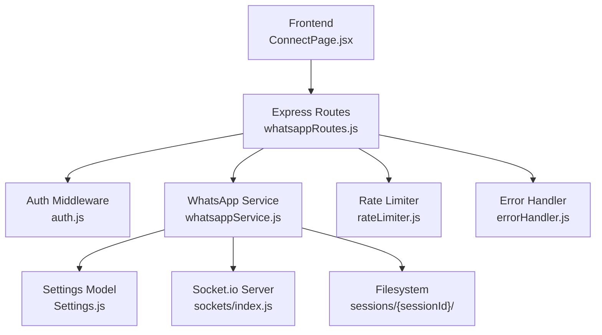
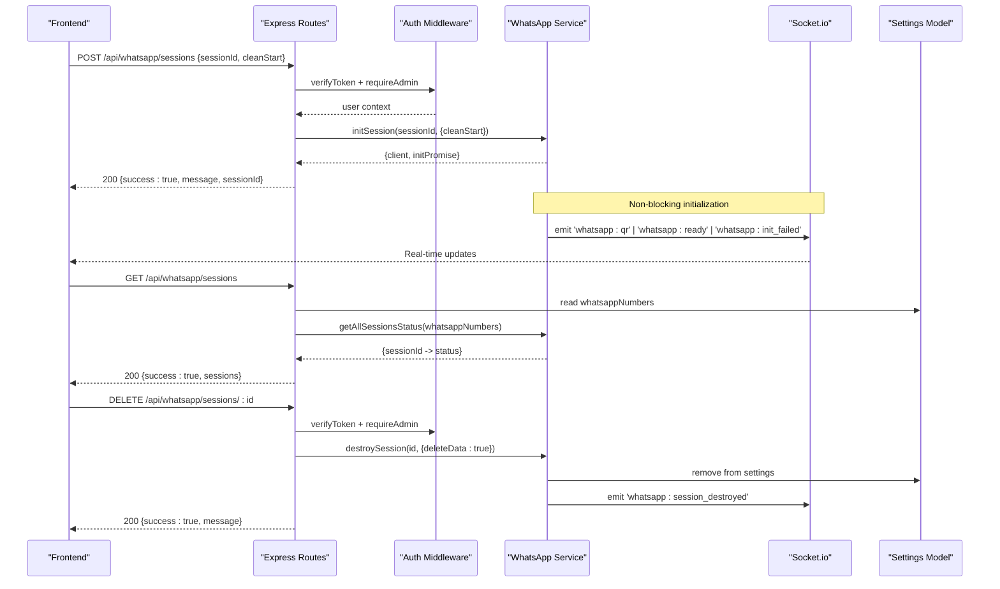
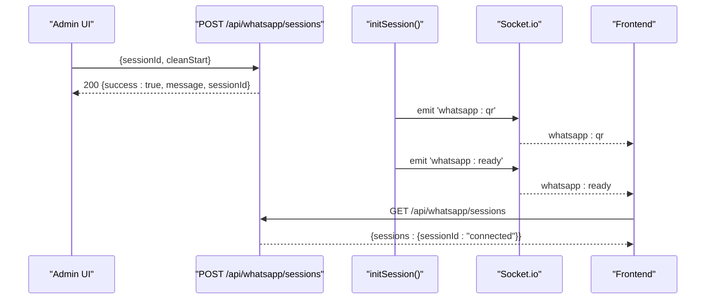
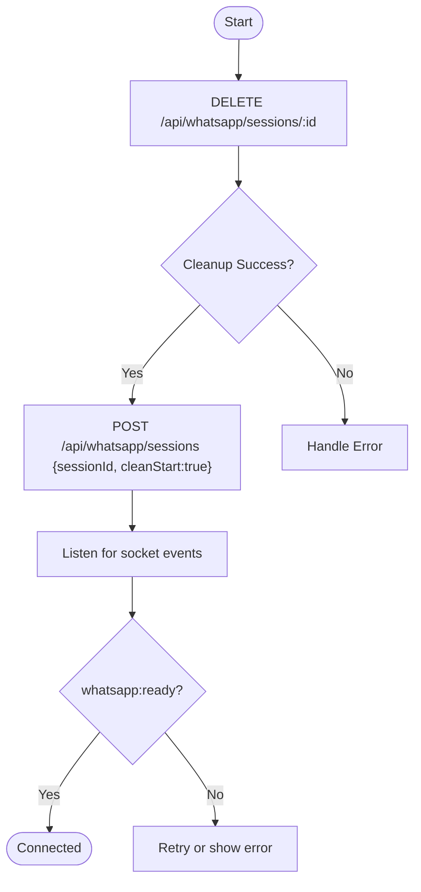
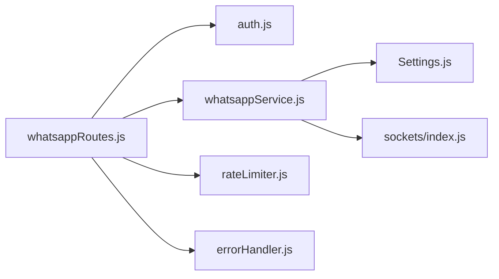

# Session Management

<cite>
**Referenced Files in This Document**
- [whatsappRoutes.js](file://backend/src/routes/whatsappRoutes.js)
- [whatsappService.js](file://backend/src/services/whatsappService.js)
- [auth.js](file://backend/src/middleware/auth.js)
- [rateLimiter.js](file://backend/src/middleware/rateLimiter.js)
- [index.js](file://backend/src/sockets/index.js)
- [server.js](file://backend/src/server.js)
- [Settings.js](file://backend/src/models/Settings.js)
- [errorHandler.js](file://backend/src/middleware/errorHandler.js)
- [ConnectPage.jsx](file://frontend/src/pages/ConnectPage.jsx)
</cite>

## Table of Contents
1. [Introduction](#introduction)
2. [Project Structure](#project-structure)
3. [Core Components](#core-components)
4. [Architecture Overview](#architecture-overview)
5. [Detailed Component Analysis](#detailed-component-analysis)
6. [Dependency Analysis](#dependency-analysis)
7. [Performance Considerations](#performance-considerations)
8. [Troubleshooting Guide](#troubleshooting-guide)
9. [Conclusion](#conclusion)

## Introduction
This document provides comprehensive API documentation for WhatsApp session management endpoints. It covers:
- GET /api/whatsapp/sessions: Retrieve status of all active sessions, including connection details and state.
- POST /api/whatsapp/sessions: Create a new session with non-blocking initialization and real-time progress via socket events.
- DELETE /api/whatsapp/sessions/:id: Destroy a session and clean up on-disk data.

It also documents authentication requirements (admin role), session lifecycle states, error handling patterns, rate limiting considerations, and practical workflows for creation, monitoring, and cleanup.

## Project Structure
The WhatsApp session management is implemented as Express routes backed by a service layer that manages multiple WhatsApp clients using whatsapp-web.js. Real-time updates are delivered through Socket.io. The frontend polls the status endpoint and listens to socket events to drive the UI.

**Diagram sources**
- [whatsappRoutes.js:1-110](file://backend/src/routes/whatsappRoutes.js#L1-L110)
- [whatsappService.js:1-642](file://backend/src/services/whatsappService.js#L1-L642)
- [auth.js:1-68](file://backend/src/middleware/auth.js#L1-L68)
- [rateLimiter.js:1-37](file://backend/src/middleware/rateLimiter.js#L1-L37)
- [index.js:1-82](file://backend/src/sockets/index.js#L1-L82)
- [Settings.js:1-38](file://backend/src/models/Settings.js#L1-L38)
- [errorHandler.js:1-36](file://backend/src/middleware/errorHandler.js#L1-L36)
- [ConnectPage.jsx:1-579](file://frontend/src/pages/ConnectPage.jsx#L1-L579)

**Section sources**
- [whatsappRoutes.js:1-110](file://backend/src/routes/whatsappRoutes.js#L1-L110)
- [whatsappService.js:1-642](file://backend/src/services/whatsappService.js#L1-L642)
- [server.js:1-241](file://backend/src/server.js#L1-L241)

## Core Components
- Express routes define the REST endpoints for session management.
- Service layer manages session lifecycle, QR/pairing flows, auto-reconnect, and emits socket events.
- Authentication middleware enforces JWT verification and admin-only access for mutating operations.
- Rate limiter applies general request throttling across /api.
- Socket.io server authenticates connections and joins users to a dashboard room for real-time updates.
- Settings model persists configured WhatsApp numbers and their states.
- Error handler centralizes error responses and logging.

Key responsibilities:
- GET /api/whatsapp/sessions returns a map of sessionId to status.
- POST /api/whatsapp/sessions starts initialization asynchronously and returns immediately; frontend listens to socket events for progress.
- DELETE /api/whatsapp/sessions/:id destroys the session and cleans up persisted data.

**Section sources**
- [whatsappRoutes.js:10-107](file://backend/src/routes/whatsappRoutes.js#L10-L107)
- [whatsappService.js:107-321](file://backend/src/services/whatsappService.js#L107-L321)
- [auth.js:10-62](file://backend/src/middleware/auth.js#L10-L62)
- [rateLimiter.js:1-37](file://backend/src/middleware/rateLimiter.js#L1-L37)
- [index.js:18-63](file://backend/src/sockets/index.js#L18-L63)
- [Settings.js:1-38](file://backend/src/models/Settings.js#L1-L38)
- [errorHandler.js:9-33](file://backend/src/middleware/errorHandler.js#L9-L33)

## Architecture Overview
The system uses a multi-session architecture where each WhatsApp number is represented by a session identified by a label or number. Sessions persist authentication data under sessions/{sessionId}/ and reconnect automatically with exponential backoff.

**Diagram sources**
- [whatsappRoutes.js:13-107](file://backend/src/routes/whatsappRoutes.js#L13-L107)
- [whatsappService.js:107-321](file://backend/src/services/whatsappService.js#L107-L321)
- [whatsappService.js:435-452](file://backend/src/services/whatsappService.js#L435-L452)
- [whatsappService.js:520-568](file://backend/src/services/whatsappService.js#L520-L568)
- [index.js:18-63](file://backend/src/sockets/index.js#L18-L63)
- [Settings.js:1-38](file://backend/src/models/Settings.js#L1-L38)

## Detailed Component Analysis

### Endpoint: GET /api/whatsapp/sessions
- Purpose: Return status of all configured and active sessions.
- Authentication: Requires valid JWT token.
- Response schema:
  - success: boolean
  - sessions: object mapping sessionId to one of:
    - connected
    - connecting
    - disconnected
    - not_initialized
- Behavior:
  - Reads configured whatsappNumbers from Settings.
  - Builds a status map by checking in-memory sessions and configured entries.
  - Includes any currently initializing/connecting sessions even if not yet saved to Settings.

Example response:
{
  "success": true,
  "sessions": {
    "+1234567890": "connected",
    "Support": "connecting",
    "Sales": "not_initialized"
  }
}

**Section sources**
- [whatsappRoutes.js:13-27](file://backend/src/routes/whatsappRoutes.js#L13-L27)
- [whatsappService.js:435-452](file://backend/src/services/whatsappService.js#L435-L452)
- [whatsappService.js:410-427](file://backend/src/services/whatsappService.js#L410-L427)
- [Settings.js:1-38](file://backend/src/models/Settings.js#L1-L38)

### Endpoint: POST /api/whatsapp/sessions
- Purpose: Start a new WhatsApp session with non-blocking initialization.
- Authentication: Requires valid JWT token and admin role.
- Request body:
  - sessionId: string (required). Used as both identifier and LocalAuth folder name.
  - cleanStart: boolean (optional). If true, deletes existing session folder before re-initialization.
- Response:
  - success: boolean
  - message: string indicating initialization started
  - sessionId: string echoed back
- Real-time progress:
  - Frontend should listen for socket events:
    - whatsapp:qr: contains sessionId and qr data URL
    - whatsapp:ready: indicates successful connection
    - whatsapp:init_failed: includes sessionId and message/hint
    - whatsapp:auth_failure: includes sessionId and message
    - whatsapp:reconnect_failed: indicates final failure after retries
- Notes:
  - Initialization runs in background; the API returns immediately.
  - On successful ready, the session may be added to Settings.whatsappNumbers if not present.

**Section sources**
- [whatsappRoutes.js:37-60](file://backend/src/routes/whatsappRoutes.js#L37-L60)
- [whatsappService.js:107-321](file://backend/src/services/whatsappService.js#L107-L321)
- [whatsappService.js:165-194](file://backend/src/services/whatsappService.js#L165-L194)
- [whatsappService.js:202-209](file://backend/src/services/whatsappService.js#L202-L209)
- [whatsappService.js:312-318](file://backend/src/services/whatsappService.js#L312-L318)
- [whatsappService.js:333-363](file://backend/src/services/whatsappService.js#L333-L363)

### Endpoint: DELETE /api/whatsapp/sessions/:id
- Purpose: Destroy a session and perform data cleanup.
- Authentication: Requires valid JWT token and admin role.
- Path parameter:
  - id: string (sessionId to destroy)
- Behavior:
  - Logs out and destroys the client if present.
  - Removes entry from Settings.whatsappNumbers.
  - Deletes on-disk session folder to allow clean re-initialization.
  - Emits whatsapp:session_destroyed event to update dashboards.
- Response:
  - success: boolean
  - message: string confirming destruction and cleanup

**Section sources**
- [whatsappRoutes.js:94-107](file://backend/src/routes/whatsappRoutes.js#L94-L107)
- [whatsappService.js:520-568](file://backend/src/services/whatsappService.js#L520-L568)

### Session Lifecycle States
- not_initialized: No client found in memory for the session ID.
- connecting: Client exists but has not reported a valid WID yet.
- connected: Client reports a valid WID (authenticated and ready).
- disconnected: Client was destroyed or failed; may trigger auto-reconnect attempts.

Auto-reconnect behavior:
- Exponential backoff with delays: 5s, 10s, 20s, 40s, 80s.
- After max attempts, emits whatsapp:reconnect_failed.
- Permanent disconnect reasons (e.g., LOGOUT/UNPAIRED) skip auto-reconnect and clean up session data.

**Section sources**
- [whatsappService.js:410-427](file://backend/src/services/whatsappService.js#L410-L427)
- [whatsappService.js:333-363](file://backend/src/services/whatsappService.js#L333-L363)
- [whatsappService.js:212-256](file://backend/src/services/whatsappService.js#L212-L256)

### Authentication and Authorization
- All endpoints require a Bearer JWT token.
- POST and DELETE endpoints additionally require admin role.
- Token errors return 401 with consistent messages.
- Missing admin role returns 403.

**Section sources**
- [auth.js:10-62](file://backend/src/middleware/auth.js#L10-L62)
- [whatsappRoutes.js:37-60](file://backend/src/routes/whatsappRoutes.js#L37-L60)
- [whatsappRoutes.js:94-107](file://backend/src/routes/whatsappRoutes.js#L94-L107)

### Error Handling Patterns
- Global error handler logs errors and returns JSON with success:false and message.
- Development mode includes stack traces; production omits them.
- Route handlers pass errors to the global handler.

**Section sources**
- [errorHandler.js:9-33](file://backend/src/middleware/errorHandler.js#L9-L33)
- [whatsappRoutes.js:24-26](file://backend/src/routes/whatsappRoutes.js#L24-L26)
- [whatsappRoutes.js:56-59](file://backend/src/routes/whatsappRoutes.js#L56-L59)
- [whatsappRoutes.js:104-106](file://backend/src/routes/whatsappRoutes.js#L104-L106)

### Rate Limiting
- General API limiter: 200 requests per 15 minutes per IP applied to /api.
- Auth login limiter: stricter limits for brute-force protection.
- These apply to session endpoints as part of /api.

**Section sources**
- [rateLimiter.js:1-37](file://backend/src/middleware/rateLimiter.js#L1-L37)
- [server.js:58-61](file://backend/src/server.js#L58-L61)

### Socket Integration
- Socket.io server authenticates via JWT passed in handshake.
- Users join a dashboard room to receive real-time updates.
- Service emits events such as whatsapp:qr, whatsapp:ready, whatsapp:init_failed, whatsapp:auth_failure, whatsapp:reconnect_failed, whatsapp:session_destroyed.

**Section sources**
- [index.js:18-63](file://backend/src/sockets/index.js#L18-L63)
- [whatsappService.js:152-162](file://backend/src/services/whatsappService.js#L152-L162)
- [whatsappService.js:189-194](file://backend/src/services/whatsappService.js#L189-L194)
- [whatsappService.js:312-318](file://backend/src/services/whatsappService.js#L312-L318)
- [whatsappService.js:341-345](file://backend/src/services/whatsappService.js#L341-L345)
- [whatsappService.js:565-567](file://backend/src/services/whatsappService.js#L565-L567)

### Practical Workflows

#### Creating a New Session (QR Flow)
- Admin calls POST /api/whatsapp/sessions with sessionId and optional cleanStart.
- Backend initializes session in background and returns immediately.
- Frontend listens for whatsapp:qr to display QR code.
- Upon scanning, backend emits whatsapp:ready; frontend shows success and refreshes session list.

**Diagram sources**
- [whatsappRoutes.js:37-60](file://backend/src/routes/whatsappRoutes.js#L37-L60)
- [whatsappService.js:107-162](file://backend/src/services/whatsappService.js#L107-L162)
- [whatsappService.js:189-194](file://backend/src/services/whatsappService.js#L189-L194)
- [whatsappRoutes.js:13-27](file://backend/src/routes/whatsappRoutes.js#L13-L27)

#### Status Monitoring
- Poll GET /api/whatsapp/sessions periodically or rely on socket events for live updates.
- Use returned statuses to render badges and actions.

**Section sources**
- [ConnectPage.jsx:51-66](file://frontend/src/pages/ConnectPage.jsx#L51-L66)
- [ConnectPage.jsx:113-182](file://frontend/src/pages/ConnectPage.jsx#L113-L182)

#### Cleanup and Reconnection
- To retry cleanly, call DELETE /api/whatsapp/sessions/:id to log out, destroy client, remove from Settings, and delete session folder.
- Then call POST /api/whatsapp/sessions again with cleanStart=true to force fresh initialization.

**Diagram sources**
- [whatsappRoutes.js:94-107](file://backend/src/routes/whatsappRoutes.js#L94-L107)
- [whatsappService.js:520-568](file://backend/src/services/whatsappService.js#L520-L568)
- [whatsappRoutes.js:37-60](file://backend/src/routes/whatsappRoutes.js#L37-L60)

## Dependency Analysis
- Routes depend on auth middleware and service functions.
- Service depends on whatsapp-web.js, filesystem, cron, and socket emitter.
- Socket server depends on JWT verification and User model.
- Settings model defines structure for whatsappNumbers array used by routes and service.

**Diagram sources**
- [whatsappRoutes.js:1-110](file://backend/src/routes/whatsappRoutes.js#L1-L110)
- [whatsappService.js:1-642](file://backend/src/services/whatsappService.js#L1-L642)
- [auth.js:1-68](file://backend/src/middleware/auth.js#L1-L68)
- [rateLimiter.js:1-37](file://backend/src/middleware/rateLimiter.js#L1-L37)
- [index.js:1-82](file://backend/src/sockets/index.js#L1-L82)
- [Settings.js:1-38](file://backend/src/models/Settings.js#L1-L38)
- [errorHandler.js:1-36](file://backend/src/middleware/errorHandler.js#L1-L36)

**Section sources**
- [whatsappRoutes.js:1-110](file://backend/src/routes/whatsappRoutes.js#L1-L110)
- [whatsappService.js:1-642](file://backend/src/services/whatsappService.js#L1-L642)
- [server.js:102-108](file://backend/src/server.js#L102-L108)

## Performance Considerations
- Non-blocking initialization avoids holding HTTP requests during browser startup and QR generation.
- Auto-reconnect with exponential backoff reduces load on WhatsApp servers during transient failures.
- Per-chat message queue locks prevent race conditions when updating shared chat documents.
- Health check cron monitors session states every two minutes without impacting normal operations.
- Rate limiting protects endpoints from abuse and excessive polling.

[No sources needed since this section provides general guidance]

## Troubleshooting Guide
Common issues and resolutions:
- Stale Puppeteer lock files causing “browser already running” errors:
  - ClearSingletonLock and SingletonSocket files under sessions/{sessionId}/session/.
  - Use cleanStart=true to force deletion of session folder before re-init.
- Permanent unlink (LOGOUT/UNPAIRED):
  - Session data is deleted automatically; reconnect via QR or pairing code.
- Reconnect failures after multiple attempts:
  - Check network connectivity and WhatsApp availability; consider manual restart.
- Authentication failures:
  - Ensure correct phone number and valid QR scan; review whatsapp:auth_failure events.
- Session not appearing in status:
  - Verify Settings.whatsappNumbers includes the session; backend adds it on successful ready.

Operational tips:
- Use DELETE /api/whatsapp/sessions/:id followed by POST with cleanStart=true to reset corrupted sessions.
- Monitor socket events for real-time diagnostics.
- Review server logs for detailed error stacks in development.

**Section sources**
- [whatsappService.js:76-92](file://backend/src/services/whatsappService.js#L76-L92)
- [whatsappService.js:212-256](file://backend/src/services/whatsappService.js#L212-L256)
- [whatsappService.js:333-363](file://backend/src/services/whatsappService.js#L333-L363)
- [whatsappService.js:202-209](file://backend/src/services/whatsappService.js#L202-L209)
- [whatsappService.js:165-194](file://backend/src/services/whatsappService.js#L165-L194)
- [errorHandler.js:9-33](file://backend/src/middleware/errorHandler.js#L9-L33)

## Conclusion
The WhatsApp session management API provides robust, non-blocking session creation, real-time status monitoring, and safe cleanup procedures. With admin-only controls, consistent error handling, and rate limiting, it supports reliable multi-session operation. Integrating socket events enables responsive dashboards and streamlined operational workflows.