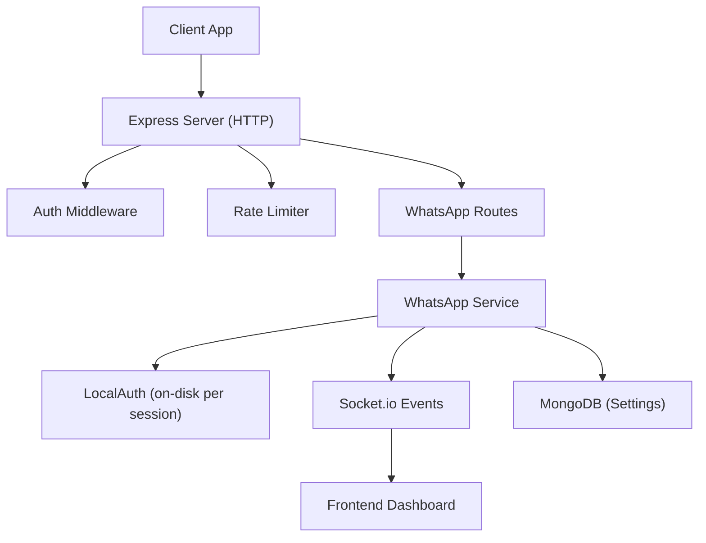
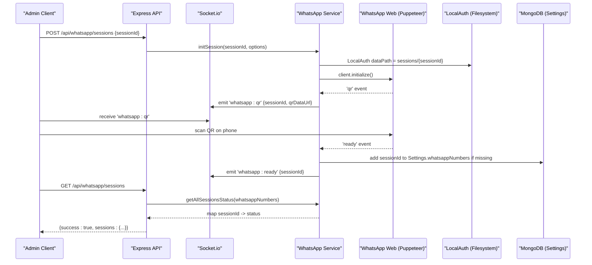
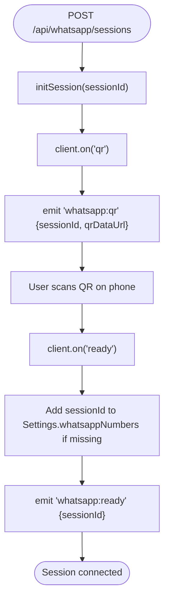
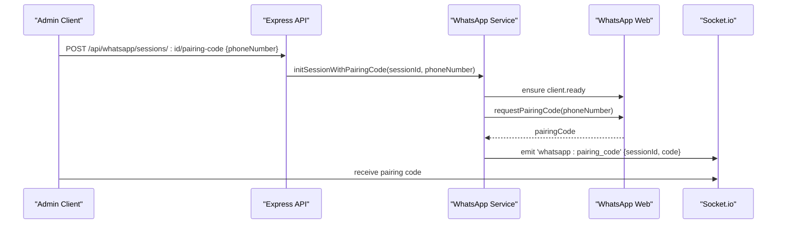
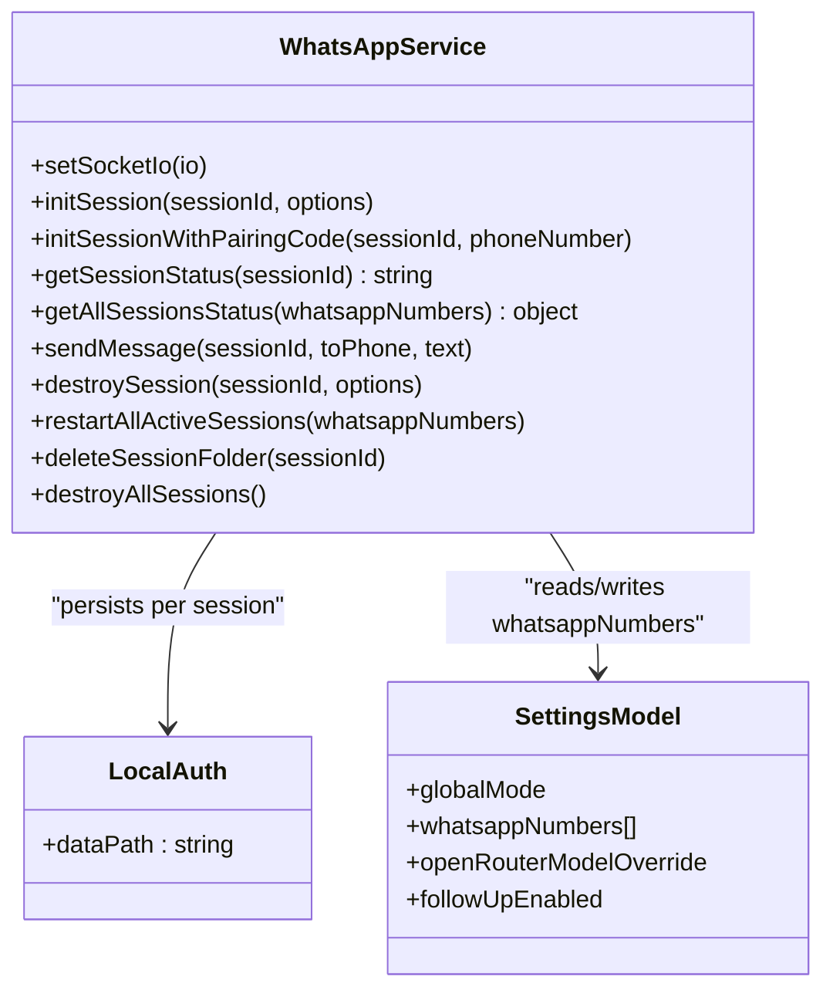
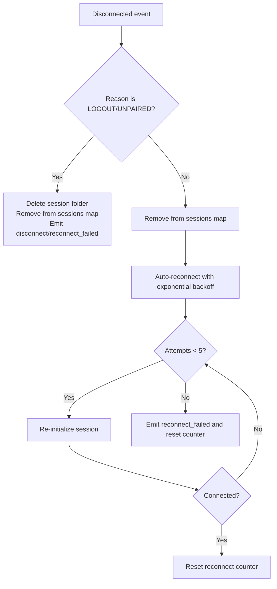
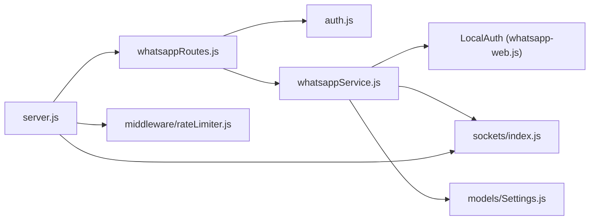

# WhatsApp Management API

<cite>
**Referenced Files in This Document**
- [server.js](file://backend/src/server.js)
- [whatsappRoutes.js](file://backend/src/routes/whatsappRoutes.js)
- [whatsappService.js](file://backend/src/services/whatsappService.js)
- [auth.js](file://backend/src/middleware/auth.js)
- [rateLimiter.js](file://backend/src/middleware/rateLimiter.js)
- [index.js](file://backend/src/sockets/index.js)
- [Settings.js](file://backend/src/models/Settings.js)
- [db.js](file://backend/src/config/db.js)
</cite>

## Table of Contents
1. [Introduction](#introduction)
2. [Project Structure](#project-structure)
3. [Core Components](#core-components)
4. [Architecture Overview](#architecture-overview)
5. [Detailed Component Analysis](#detailed-component-analysis)
6. [Dependency Analysis](#dependency-analysis)
7. [Performance Considerations](#performance-considerations)
8. [Troubleshooting Guide](#troubleshooting-guide)
9. [Conclusion](#conclusion)
10. [Appendices](#appendices)

## Introduction
This document provides detailed API documentation for WhatsApp management endpoints, focusing on multi-session management, QR code generation, and pairing code authentication flows. It explains session lifecycle, persistence, automatic reconnection, rate limiting, cleanup procedures, and monitoring capabilities. The backend uses a multi-session architecture where each WhatsApp number is represented as an independent session with persistent local storage and real-time updates via Socket.io.

## Project Structure
The WhatsApp management functionality is implemented across routes, services, middleware, sockets, and models:
- Routes define HTTP endpoints for session operations.
- Service encapsulates session lifecycle, persistence, reconnection, and messaging.
- Middleware enforces authentication and admin-only access.
- Sockets provide real-time events to the frontend.
- Models persist configuration including active sessions.

**Diagram sources**
- [server.js:88-97](file://backend/src/server.js#L88-L97)
- [whatsappRoutes.js:1-110](file://backend/src/routes/whatsappRoutes.js#L1-L110)
- [whatsappService.js:1-642](file://backend/src/services/whatsappService.js#L1-L642)
- [index.js:1-82](file://backend/src/sockets/index.js#L1-L82)
- [Settings.js:1-38](file://backend/src/models/Settings.js#L1-L38)

**Section sources**
- [server.js:88-97](file://backend/src/server.js#L88-L97)
- [whatsappRoutes.js:1-110](file://backend/src/routes/whatsappRoutes.js#L1-L110)
- [whatsappService.js:1-642](file://backend/src/services/whatsappService.js#L1-L642)
- [index.js:1-82](file://backend/src/sockets/index.js#L1-L82)
- [Settings.js:1-38](file://backend/src/models/Settings.js#L1-L38)

## Core Components
- WhatsApp Routes: Expose endpoints for listing sessions, creating sessions, requesting pairing codes, and destroying sessions.
- WhatsApp Service: Manages multiple sessions using whatsapp-web.js with LocalAuth persistence, auto-reconnect with exponential backoff, message queuing, and health checks.
- Authentication Middleware: Validates JWT tokens and enforces admin roles.
- Rate Limiting: Applies general and auth-specific request limits.
- Socket.io: Emits real-time events for QR codes, readiness, failures, and disconnections.
- Settings Model: Persists configured WhatsApp numbers and their states.

Key responsibilities:
- Session creation and initialization are non-blocking; UI reacts to socket events.
- Persistent session data stored under sessions/{sessionId}/.
- Automatic reconnection attempts up to five times with increasing delays.
- Health check cron job monitors session state every two minutes.

**Section sources**
- [whatsappRoutes.js:1-110](file://backend/src/routes/whatsappRoutes.js#L1-L110)
- [whatsappService.js:1-642](file://backend/src/services/whatsappService.js#L1-L642)
- [auth.js:1-68](file://backend/src/middleware/auth.js#L1-L68)
- [rateLimiter.js:1-37](file://backend/src/middleware/rateLimiter.js#L1-L37)
- [index.js:1-82](file://backend/src/sockets/index.js#L1-L82)
- [Settings.js:1-38](file://backend/src/models/Settings.js#L1-L38)

## Architecture Overview
The system supports multiple concurrent WhatsApp sessions. Each session corresponds to a configured number or label and persists its authentication data locally. Real-time status updates are emitted via Socket.io to the dashboard.

**Diagram sources**
- [whatsappRoutes.js:37-60](file://backend/src/routes/whatsappRoutes.js#L37-L60)
- [whatsappService.js:107-321](file://backend/src/services/whatsappService.js#L107-L321)
- [whatsappService.js:435-452](file://backend/src/services/whatsappService.js#L435-L452)
- [index.js:1-82](file://backend/src/sockets/index.js#L1-L82)
- [Settings.js:1-38](file://backend/src/models/Settings.js#L1-L38)

## Detailed Component Analysis

### Session Management Endpoints
- List all sessions
  - Method: GET
  - URL: /api/whatsapp/sessions
  - Auth: Bearer token required
  - Response schema:
    - success: boolean
    - sessions: object mapping sessionId to status string ('connected' | 'disconnected' | 'connecting' | 'not_initialized')
  - Notes: Status reflects both configured numbers and currently initializing sessions.

- Create a new session
  - Method: POST
  - URL: /api/whatsapp/sessions
  - Auth: Bearer token + admin role required
  - Request body:
    - sessionId: string (required)
    - cleanStart: boolean (optional; when true, deletes existing session folder before init)
  - Response schema:
    - success: boolean
    - message: string
    - sessionId: string
  - Behavior: Non-blocking; returns immediately. Use socket events to track progress.

- Request pairing code for a session
  - Method: POST
  - URL: /api/whatsapp/sessions/:id/pairing-code
  - Auth: Bearer token required
  - Request body:
    - phoneNumber: string (required; digits only, no leading +)
  - Response schema:
    - success: boolean
    - message: string
  - Behavior: Initializes session if needed, waits until ready, then requests pairing code. A socket event delivers the code.

- Destroy a session
  - Method: DELETE
  - URL: /api/whatsapp/sessions/:id
  - Auth: Bearer token + admin role required
  - Response schema:
    - success: boolean
    - message: string
  - Behavior: Logs out and destroys client, removes from settings, optionally deletes on-disk session folder, emits destruction event.

Error responses:
- 400: Missing required fields (e.g., sessionId, phoneNumber).
- 401: Missing or invalid JWT token.
- 403: User lacks admin role.
- 5xx: Internal server errors handled by global error handler.

Real-time events (Socket.io):
- whatsapp:qr: { sessionId, qr } where qr is a data URL string.
- whatsapp:ready: { sessionId }.
- whatsapp:init_failed: { sessionId, message, hint }.
- whatsapp:auth_failure: { sessionId, message }.
- whatsapp:disconnected: { sessionId, reason }.
- whatsapp:reconnect_failed: { sessionId }.
- whatsapp:pairing_code: { sessionId, code }.
- whatsapp:session_destroyed: { sessionId }.

**Section sources**
- [whatsappRoutes.js:13-27](file://backend/src/routes/whatsappRoutes.js#L13-L27)
- [whatsappRoutes.js:37-60](file://backend/src/routes/whatsappRoutes.js#L37-L60)
- [whatsappRoutes.js:66-87](file://backend/src/routes/whatsappRoutes.js#L66-L87)
- [whatsappRoutes.js:94-107](file://backend/src/routes/whatsappRoutes.js#L94-L107)
- [whatsappService.js:152-162](file://backend/src/services/whatsappService.js#L152-L162)
- [whatsappService.js:165-194](file://backend/src/services/whatsappService.js#L165-L194)
- [whatsappService.js:202-209](file://backend/src/services/whatsappService.js#L202-L209)
- [whatsappService.js:212-256](file://backend/src/services/whatsappService.js#L212-L256)
- [whatsappService.js:333-363](file://backend/src/services/whatsappService.js#L333-L363)
- [whatsappService.js:375-402](file://backend/src/services/whatsappService.js#L375-L402)
- [whatsappService.js:410-452](file://backend/src/services/whatsappService.js#L410-L452)
- [whatsappService.js:520-568](file://backend/src/services/whatsappService.js#L520-L568)
- [index.js:1-82](file://backend/src/sockets/index.js#L1-L82)

### QR Code Generation Flow
- Trigger: Creating a session initiates WhatsApp client initialization.
- Event emission: On 'qr' event, service converts QR to a data URL and emits it via Socket.io.
- Frontend action: Display QR image and prompt user to scan with WhatsApp mobile app.
- Completion: On 'ready' event, session becomes connected and is persisted in settings if not already present.

**Diagram sources**
- [whatsappRoutes.js:37-60](file://backend/src/routes/whatsappRoutes.js#L37-L60)
- [whatsappService.js:152-162](file://backend/src/services/whatsappService.js#L152-L162)
- [whatsappService.js:165-194](file://backend/src/services/whatsappService.js#L165-L194)

### Pairing Code Flow
- Trigger: POST /api/whatsapp/sessions/:id/pairing-code with phoneNumber.
- Behavior: Ensures session is initialized and ready, then requests pairing code from WhatsApp.
- Delivery: Emits 'whatsapp:pairing_code' event containing the pairing code for the frontend to display.

**Diagram sources**
- [whatsappRoutes.js:66-87](file://backend/src/routes/whatsappRoutes.js#L66-L87)
- [whatsappService.js:375-402](file://backend/src/services/whatsappService.js#L375-L402)

### Multi-Session Architecture
- In-memory Map stores active clients keyed by sessionId.
- LocalAuth persists authentication data per session under sessions/{sessionId}/.
- Auto-reconnect with exponential backoff after transient disconnects.
- Per-chat message queue prevents race conditions during message processing.
- Health check cron runs every two minutes to log session states.

**Diagram sources**
- [whatsappService.js:1-642](file://backend/src/services/whatsappService.js#L1-L642)
- [Settings.js:1-38](file://backend/src/models/Settings.js#L1-L38)

### Session Persistence and Cleanup
- Persistence: LocalAuth writes session data to sessions/{sessionId}/.
- Clean start: Optional deletion of session folder before initialization to avoid stale locks.
- Stale lock cleanup: Removes SingletonLock and SingletonSocket files to prevent browser-in-use errors.
- Destruction: Logs out and destroys client, removes from settings, deletes on-disk folder if requested, emits destruction event.

**Section sources**
- [whatsappService.js:53-92](file://backend/src/services/whatsappService.js#L53-L92)
- [whatsappService.js:123-128](file://backend/src/services/whatsappService.js#L123-L128)
- [whatsappService.js:520-568](file://backend/src/services/whatsappService.js#L520-L568)

### Automatic Reconnection Handling
- Disconnect reasons:
  - Permanent unlink/logout/unpaired: Deletes session data and notifies dashboard without retry.
  - Other disconnects: Triggers auto-reconnect with exponential backoff (5s, 10s, 20s, 40s, 80s), up to five attempts.
- After max attempts: Emits reconnect_failed event and resets counters.

**Diagram sources**
- [whatsappService.js:212-256](file://backend/src/services/whatsappService.js#L212-L256)
- [whatsappService.js:333-363](file://backend/src/services/whatsappService.js#L333-L363)

### Monitoring and Health Checks
- Health endpoint: Returns uptime, MongoDB connection status, and count of active WhatsApp sessions.
- Cron health check: Every two minutes logs session state for all active sessions.

**Section sources**
- [server.js:63-86](file://backend/src/server.js#L63-L86)
- [whatsappService.js:602-612](file://backend/src/services/whatsappService.js#L602-L612)

## Dependency Analysis
- Express routes depend on authentication and admin middleware.
- WhatsApp service depends on whatsapp-web.js, qrcode, node-cron, filesystem, and Socket.io.
- Settings model persists session configurations.
- Global error handler centralizes error responses.

**Diagram sources**
- [server.js:88-97](file://backend/src/server.js#L88-L97)
- [whatsappRoutes.js:1-110](file://backend/src/routes/whatsappRoutes.js#L1-L110)
- [whatsappService.js:1-642](file://backend/src/services/whatsappService.js#L1-L642)
- [index.js:1-82](file://backend/src/sockets/index.js#L1-L82)
- [Settings.js:1-38](file://backend/src/models/Settings.js#L1-L38)
- [rateLimiter.js:1-37](file://backend/src/middleware/rateLimiter.js#L1-L37)

**Section sources**
- [server.js:88-97](file://backend/src/server.js#L88-L97)
- [whatsappRoutes.js:1-110](file://backend/src/routes/whatsappRoutes.js#L1-L110)
- [whatsappService.js:1-642](file://backend/src/services/whatsappService.js#L1-L642)
- [index.js:1-82](file://backend/src/sockets/index.js#L1-L82)
- [Settings.js:1-38](file://backend/src/models/Settings.js#L1-L38)
- [rateLimiter.js:1-37](file://backend/src/middleware/rateLimiter.js#L1-L37)

## Performance Considerations
- Non-blocking session initialization avoids holding HTTP responses while waiting for QR scanning.
- Exponential backoff reduces pressure on WhatsApp servers during transient failures.
- Per-chat message queue serializes updates to prevent race conditions.
- Health checks run at low frequency to minimize overhead.
- Compression and Helmet improve security and performance.

[No sources needed since this section provides general guidance]

## Troubleshooting Guide
Common issues and resolutions:
- QR code not appearing:
  - Ensure session was created successfully and socket connection is established.
  - Check for 'whatsapp:init_failed' event and follow the provided hint.
- Authentication failure:
  - Verify JWT token validity and admin role for admin-only endpoints.
- Disconnected due to unlink:
  - Session permanently unlinked requires re-authentication via QR or pairing code.
- Stale browser locks:
  - Clean startup option or automatic lock file cleanup resolves "browser already running" errors.
- Rate limit exceeded:
  - General API limit is 200 requests per 15 minutes per IP; login attempts limited to 5 per 15 minutes per IP.

Operational tips:
- Use the health endpoint to monitor active sessions and MongoDB connectivity.
- Monitor socket events for real-time diagnostics.
- For persistent issues, destroy the session and recreate with cleanStart enabled.

**Section sources**
- [whatsappService.js:152-162](file://backend/src/services/whatsappService.js#L152-L162)
- [whatsappService.js:202-209](file://backend/src/services/whatsappService.js#L202-L209)
- [whatsappService.js:212-256](file://backend/src/services/whatsappService.js#L212-L256)
- [whatsappService.js:53-92](file://backend/src/services/whatsappService.js#L53-L92)
- [rateLimiter.js:1-37](file://backend/src/middleware/rateLimiter.js#L1-L37)
- [server.js:63-86](file://backend/src/server.js#L63-L86)

## Conclusion
The WhatsApp Management API provides robust multi-session support with persistent authentication, resilient reconnection, and real-time monitoring. Administrators can create, list, and manage sessions, authenticate via QR or pairing codes, and rely on comprehensive event-driven feedback. Rate limiting and health checks help maintain stability and observability.

[No sources needed since this section summarizes without analyzing specific files]

## Appendices

### Practical Examples

- Session creation workflow:
  - Call POST /api/whatsapp/sessions with sessionId and optional cleanStart.
  - Listen for 'whatsapp:qr' event and display QR to the user.
  - Upon 'whatsapp:ready', confirm session is connected.
  - Optionally call GET /api/whatsapp/sessions to verify status.

- Pairing code flow:
  - Call POST /api/whatsapp/sessions/:id/pairing-code with phoneNumber.
  - Receive 'whatsapp:pairing_code' event and instruct the user to enter the code on their device.
  - Wait for 'whatsapp:ready' to confirm connection.

- Error handling for connection failures:
  - Handle 'whatsapp:init_failed' and 'whatsapp:auth_failure' events.
  - If disconnected due to unlink, prompt re-authentication.
  - Respect rate limits and retry after delay.

[No sources needed since this section provides conceptual examples]