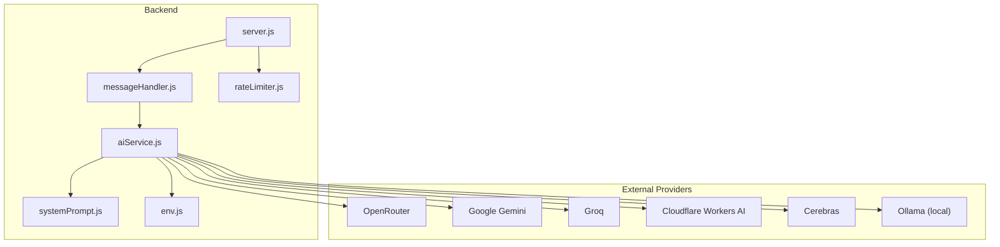
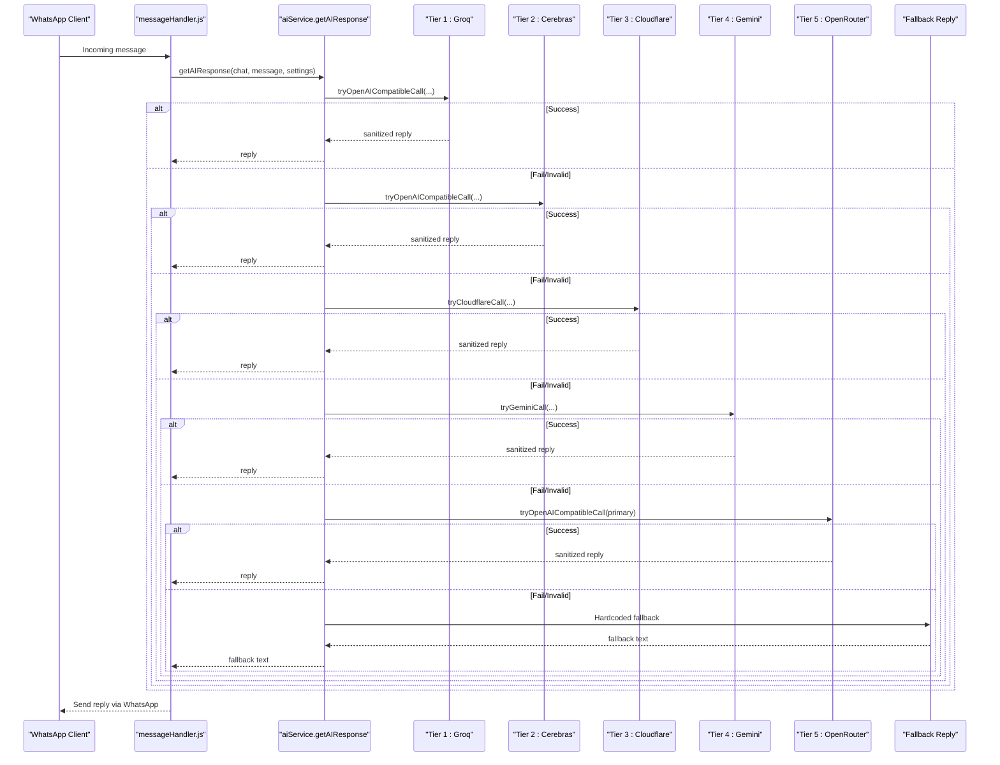
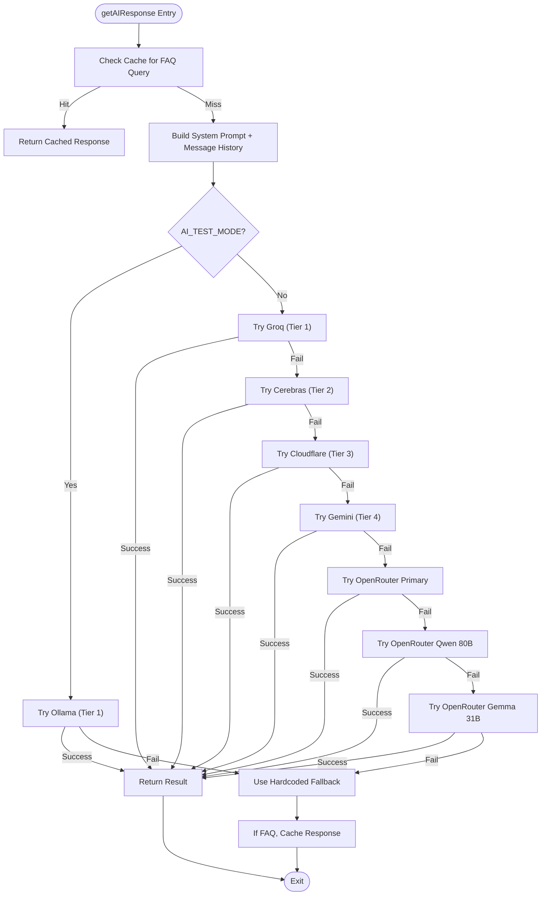
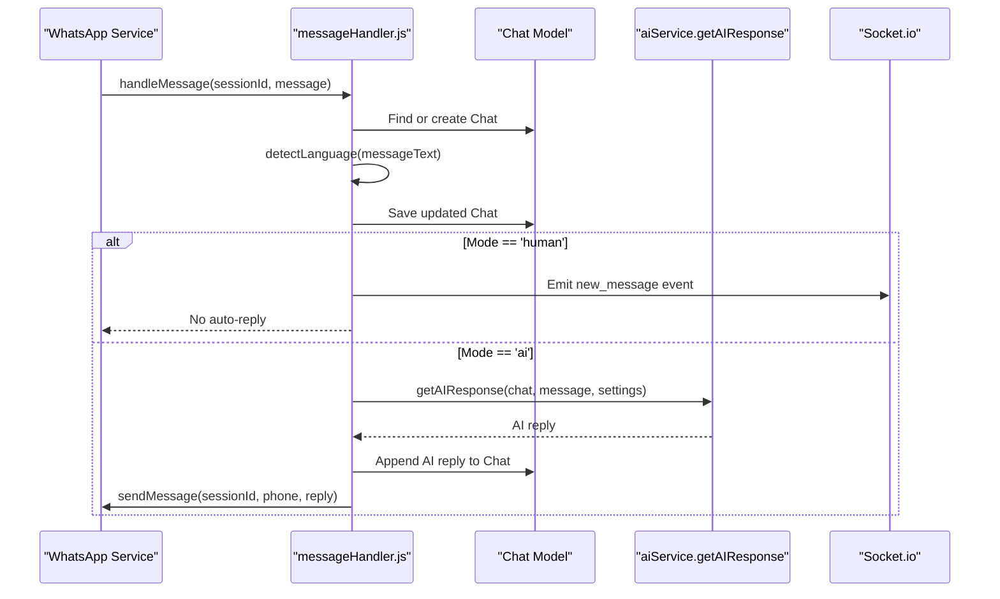
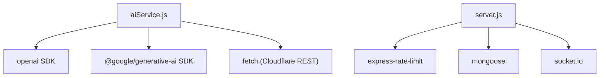

# AI Service Layer

<cite>
**Referenced Files in This Document**
- [aiService.js](file://backend/src/services/aiService.js)
- [env.js](file://backend/src/config/env.js)
- [systemPrompt.js](file://backend/src/services/systemPrompt.js)
- [messageHandler.js](file://backend/src/services/messageHandler.js)
- [rateLimiter.js](file://backend/src/middleware/rateLimiter.js)
- [server.js](file://backend/src/server.js)
- [package.json](file://backend/package.json)
</cite>

## Table of Contents
1. [Introduction](#introduction)
2. [Project Structure](#project-structure)
3. [Core Components](#core-components)
4. [Architecture Overview](#architecture-overview)
5. [Detailed Component Analysis](#detailed-component-analysis)
6. [Dependency Analysis](#dependency-analysis)
7. [Performance Considerations](#performance-considerations)
8. [Troubleshooting Guide](#troubleshooting-guide)
9. [Conclusion](#conclusion)

## Introduction
This document describes the AI service layer for Nandibaag Bot, focusing on its multi-provider architecture and response generation pipeline. It covers:
- Multi-provider support across OpenRouter, Google Gemini, Groq, Cloudflare Workers AI, Cerebras, and Ollama (local dev/test only).
- Fallback chain implementation and provider selection strategies.
- Response generation logic including sanitization, validation, length enforcement, and caching.
- Context-aware conversation handling, language detection, and human-in-the-loop mode switching.
- Provider configuration via environment variables, rate limiting, and performance optimization techniques.

## Project Structure
The AI service layer is implemented primarily in the backend services and configuration modules:
- aiService.js: Core AI orchestration, provider adapters, fallback chain, caching, validation, metrics, and utilities.
- systemPrompt.js: Dynamic system prompt builder with resort-specific rules and link-sharing policies.
- messageHandler.js: Orchestrates incoming WhatsApp messages, integrates AI responses, and manages conversation state.
- env.js: Environment variable schema and exports for all providers and runtime settings.
- server.js: Application bootstrap, middleware setup, and initialization of services.
- rateLimiter.js: API-level rate limiting to protect endpoints.
- package.json: Dependencies including OpenAI SDK, Google Generative AI SDK, Express, and others.

**Diagram sources**
- [aiService.js:1-1061](file://backend/src/services/aiService.js#L1-L1061)
- [systemPrompt.js:1-94](file://backend/src/services/systemPrompt.js#L1-L94)
- [messageHandler.js:1-183](file://backend/src/services/messageHandler.js#L1-L183)
- [env.js:1-95](file://backend/src/config/env.js#L1-L95)
- [server.js:1-241](file://backend/src/server.js#L1-L241)
- [rateLimiter.js:1-37](file://backend/src/middleware/rateLimiter.js#L1-L37)

**Section sources**
- [aiService.js:1-1061](file://backend/src/services/aiService.js#L1-L1061)
- [systemPrompt.js:1-94](file://backend/src/services/systemPrompt.js#L1-L94)
- [messageHandler.js:1-183](file://backend/src/services/messageHandler.js#L1-L183)
- [env.js:1-95](file://backend/src/config/env.js#L1-L95)
- [server.js:1-241](file://backend/src/server.js#L1-L241)
- [rateLimiter.js:1-37](file://backend/src/middleware/rateLimiter.js#L1-L37)

## Core Components
- AI Orchestration and Fallback Chain:
  - getAIResponse orchestrates a tiered chain of providers based on environment flags and availability.
  - tryOpenAICompatibleCall handles OpenAI-compatible clients (Groq, Cerebras, OpenRouter, Ollama).
  - tryGeminiCall adapts calls to Google Gemini using the official SDK.
  - tryCloudflareCall uses Cloudflare Workers AI REST API.
- System Prompt Builder:
  - buildSystemPrompt constructs context-rich instructions tailored to resort operations, pricing, facilities, policies, and link-sharing rules.
- Conversation Handling:
  - handleMessage integrates AI responses into chat history, updates language detection, schedules follow-ups, and supports human-in-the-loop mode.
- Configuration:
  - env.js validates and exports provider credentials and model names.
- Rate Limiting:
  - rateLimiter.js applies general and auth-specific limits to API routes.

**Section sources**
- [aiService.js:640-1061](file://backend/src/services/aiService.js#L640-L1061)
- [systemPrompt.js:1-94](file://backend/src/services/systemPrompt.js#L1-L94)
- [messageHandler.js:1-183](file://backend/src/services/messageHandler.js#L1-L183)
- [env.js:1-95](file://backend/src/config/env.js#L1-L95)
- [rateLimiter.js:1-37](file://backend/src/middleware/rateLimiter.js#L1-L37)

## Architecture Overview
The AI service layer implements a resilient, multi-tier fallback strategy:
- Production mode:
  - Tier 1: Groq (OpenAI-compatible)
  - Tier 2: Cerebras (OpenAI-compatible)
  - Tier 3: Cloudflare Workers AI (REST)
  - Tier 4: Google Gemini (official SDK)
  - Tier 5: OpenRouter multi-model chain (primary + two free models)
  - Final fallback: Hardcoded safe reply with contact number
- Test mode (AI_TEST_MODE=true):
  - Tier 1: Ollama (local, OpenAI-compatible)
  - Final fallback: Hardcoded safe reply

**Diagram sources**
- [aiService.js:838-1030](file://backend/src/services/aiService.js#L838-L1030)
- [messageHandler.js:126-172](file://backend/src/services/messageHandler.js#L126-L172)

## Detailed Component Analysis

### AI Orchestration and Fallback Chain
- Provider Adapters:
  - OpenAI-compatible adapter used by Groq, Cerebras, OpenRouter, and Ollama.
  - Gemini adapter converts internal message format to Gemini’s contents structure.
  - Cloudflare adapter posts to the Workers AI REST endpoint.
- Validation and Sanitization:
  - sanitizeReply removes reasoning tags, markdown blocks, bold, headers, links, and normalizes formatting.
  - enforceLengthLimits caps lines and characters; trims at sentence boundaries if needed.
  - isReplyValid enforces script constraints, rejects unexpected markdown/syntax, repeated words, and suspicious English-only tokens.
- Caching:
  - In-memory Map caches FAQ-type responses keyed by hash of last customer message plus booking stage. TTL is 5 minutes.
  - Booking-related queries bypass cache to ensure freshness.
- Metrics:
  - Per-provider health and latency metrics tracked in-memory with hourly resets.
  - Exposed snapshot for dashboard analytics.

**Diagram sources**
- [aiService.js:838-1030](file://backend/src/services/aiService.js#L838-L1030)

**Section sources**
- [aiService.js:1-1061](file://backend/src/services/aiService.js#L1-L1061)

### Provider Selection Strategies
- Production mode prioritizes high-throughput providers first (Groq, Cerebras), then diversifies infrastructure (Cloudflare, Gemini), and finally leverages OpenRouter’s multi-model chain for resilience.
- Each tier has an 8-second timeout and logs timing/diagnostics.
- Invalid outputs are rejected early and trigger fallback to the next tier.

**Section sources**
- [aiService.js:838-995](file://backend/src/services/aiService.js#L838-L995)

### Response Generation Logic
- Messages are trimmed to the last 10 entries to optimize token usage and speed.
- System prompt includes current date, day-of-week, resort info, pricing, facilities, policies, link-sharing rules, language guidance, and conversation flow.
- Responses are sanitized, validated, and length-limited before being returned.

**Section sources**
- [aiService.js:855-883](file://backend/src/services/aiService.js#L855-L883)
- [systemPrompt.js:1-94](file://backend/src/services/systemPrompt.js#L1-L94)

### Context-Aware Conversation Handling
- Chat documents store conversation history, booking stage, language, and timestamps.
- Language detection updates per-chat language field based on Unicode ranges and common loanwords.
- Human-in-the-loop mode:
  - If chat.mode === 'human', no auto-reply is sent; instead, staff are notified via socket events.
  - Otherwise, AI mode generates replies and continues conversation flow.

**Diagram sources**
- [messageHandler.js:22-172](file://backend/src/services/messageHandler.js#L22-L172)
- [aiService.js:838-1030](file://backend/src/services/aiService.js#L838-L1030)

**Section sources**
- [messageHandler.js:1-183](file://backend/src/services/messageHandler.js#L1-L183)
- [aiService.js:594-637](file://backend/src/services/aiService.js#L594-L637)

### Language Detection
- Heuristic-based detection using Unicode ranges and common loanwords.
- Supports Gujarati, Marathi, Hindi (Devanagari), Hinglish, and English.
- Used for analytics and per-chat language tracking.

**Section sources**
- [aiService.js:594-637](file://backend/src/services/aiService.js#L594-L637)

### Human-in-the-Loop Mode Switching
- Global/per-chat mode is read from Settings and persisted in Chat documents.
- When mode is 'human', the bot saves the message and emits a socket event for staff to respond manually.

**Section sources**
- [messageHandler.js:102-124](file://backend/src/services/messageHandler.js#L102-L124)

### Provider Configuration
- All provider credentials and model names are validated and exported via env.js.
- Required fields include OpenRouter key/model; optional fields include Gemini, Groq, Cloudflare, Cerebras, and Ollama settings.
- Startup checks validate fallback contact phone numbers and warn when AI_TEST_MODE is enabled.

**Section sources**
- [env.js:1-95](file://backend/src/config/env.js#L1-L95)
- [aiService.js:1032-1052](file://backend/src/services/aiService.js#L1032-L1052)

### Rate Limiting
- General API limiter: 200 requests per 15 minutes per IP.
- Auth login limiter: 5 attempts per 15 minutes per IP.
- Applied to /api and /api/auth/login routes.

**Section sources**
- [rateLimiter.js:1-37](file://backend/src/middleware/rateLimiter.js#L1-L37)
- [server.js:58-61](file://backend/src/server.js#L58-L61)

### Performance Optimization Techniques
- Timeout control:
  - Each provider call uses AbortController with an 8-second timeout to prevent hanging requests.
- Token optimization:
  - Message history truncated to last 10 messages to reduce payload size and improve latency.
- Caching:
  - FAQ responses cached in-memory with 5-minute TTL; booking-related queries bypass cache.
- Length enforcement:
  - Sanitization and trimming ensure concise, readable replies suitable for WhatsApp.
- Metrics:
  - Per-provider success/invalid/error counts and average latency tracked for observability.

**Section sources**
- [aiService.js:649-727](file://backend/src/services/aiService.js#L649-L727)
- [aiService.js:855-883](file://backend/src/services/aiService.js#L855-L883)
- [aiService.js:186-208](file://backend/src/services/aiService.js#L186-L208)
- [aiService.js:402-471](file://backend/src/services/aiService.js#L402-L471)

## Dependency Analysis
The AI service layer depends on external SDKs and HTTP clients:
- openai: Used for OpenAI-compatible providers (Groq, Cerebras, OpenRouter, Ollama).
- @google/generative-ai: Official SDK for Google Gemini.
- fetch: Used for Cloudflare Workers AI REST calls.
- express-rate-limit: Applied at the API layer for request throttling.
- mongoose: Database persistence for chats, leads, settings.
- socket.io: Real-time notifications for human-in-the-loop mode and alerts.

**Diagram sources**
- [aiService.js:1-12](file://backend/src/services/aiService.js#L1-L12)
- [server.js:1-21](file://backend/src/server.js#L1-L21)
- [package.json:23-42](file://backend/package.json#L23-L42)

**Section sources**
- [package.json:23-42](file://backend/package.json#L23-L42)
- [server.js:1-21](file://backend/src/server.js#L1-L21)
- [aiService.js:1-12](file://backend/src/services/aiService.js#L1-L12)

## Performance Considerations
- Timeouts:
  - Enforce 8-second timeouts per provider call to avoid long waits and cascading failures.
- Token Limits:
  - Keep message history small (last 10 messages) to balance context richness with speed.
- Caching Strategy:
  - Use in-memory cache for static FAQs; avoid caching dynamic booking queries.
- Output Constraints:
  - Sanitize and trim responses to fit WhatsApp constraints and improve readability.
- Observability:
  - Track per-provider metrics and log detailed diagnostics for troubleshooting.

[No sources needed since this section provides general guidance]

## Troubleshooting Guide
- Common Issues:
  - Empty or invalid responses: The validation pipeline rejects malformed outputs and triggers fallback.
  - Rate limit errors: Provider returns 429; handled as rate limit reasons in diagnostics.
  - Server errors: Status >= 500 logged with full error details.
  - Timeouts: AbortError indicates provider did not respond within timeout.
- Diagnostics:
  - Timing logs mark each step of the pipeline for end-to-end analysis.
  - Rejection reasons provide specific causes (e.g., unexpected script, markdown syntax, repeated words).
- Startup Checks:
  - Warns if AI_TEST_MODE is enabled (local Ollama only).
  - Validates fallback contact phone number format.

**Section sources**
- [aiService.js:649-727](file://backend/src/services/aiService.js#L649-L727)
- [aiService.js:734-774](file://backend/src/services/aiService.js#L734-L774)
- [aiService.js:781-821](file://backend/src/services/aiService.js#L781-L821)
- [aiService.js:1032-1052](file://backend/src/services/aiService.js#L1032-L1052)

## Conclusion
Nandibaag Bot’s AI service layer delivers a robust, multi-provider architecture with a carefully designed fallback chain, strong output validation, and performance optimizations. It supports context-aware conversations, language detection, and human-in-the-loop mode while maintaining clear configuration and observability. The design ensures resilience against provider outages and rate limits, delivering consistent user experiences across diverse scenarios.