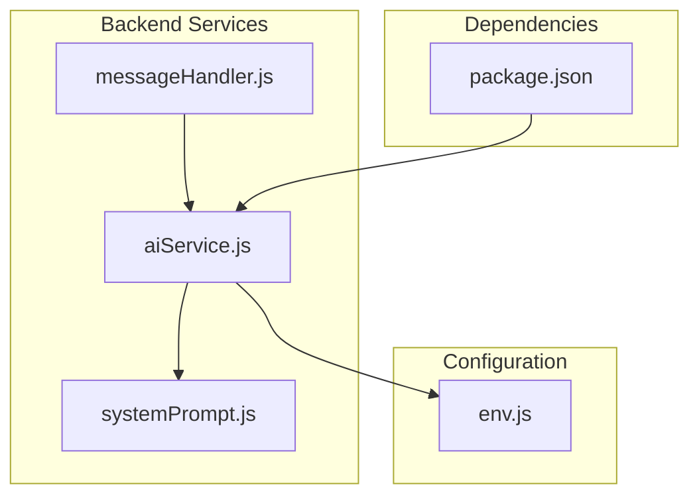
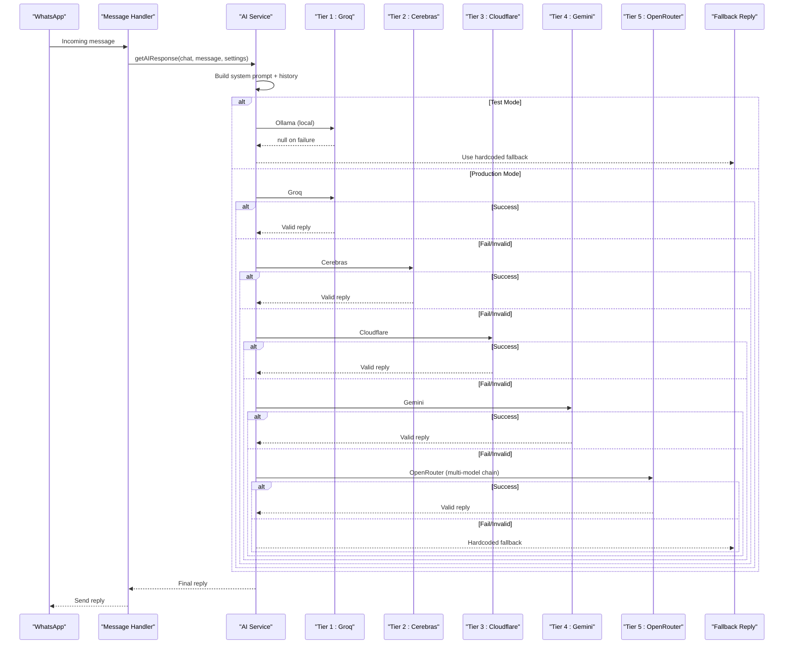
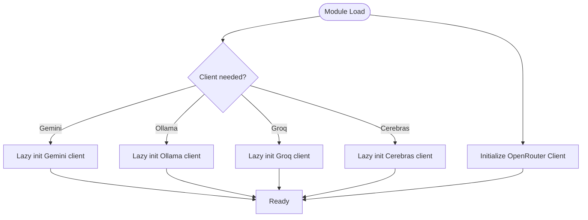
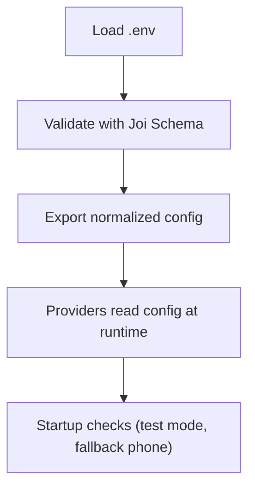
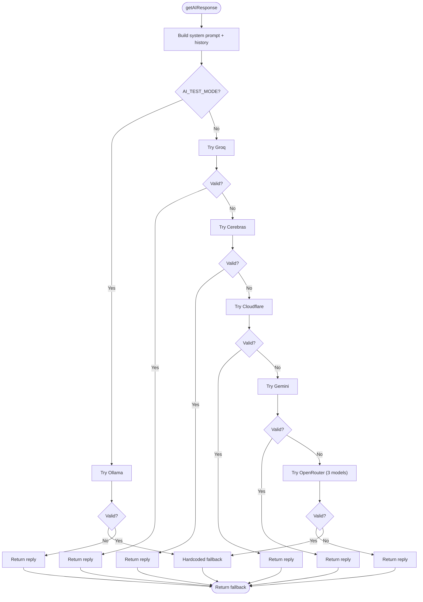
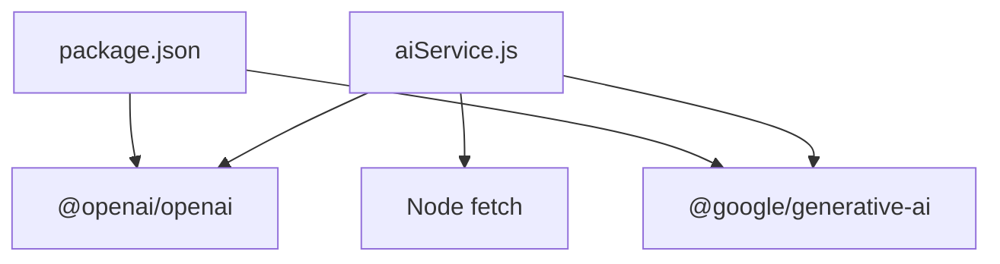

# Multi-Provider Architecture

<cite>
**Referenced Files in This Document**
- [aiService.js](file://backend/src/services/aiService.js)
- [env.js](file://backend/src/config/env.js)
- [messageHandler.js](file://backend/src/services/messageHandler.js)
- [systemPrompt.js](file://backend/src/services/systemPrompt.js)
- [package.json](file://backend/package.json)
</cite>

## Table of Contents
1. [Introduction](#introduction)
2. [Project Structure](#project-structure)
3. [Core Components](#core-components)
4. [Architecture Overview](#architecture-overview)
5. [Detailed Component Analysis](#detailed-component-analysis)
6. [Dependency Analysis](#dependency-analysis)
7. [Performance Considerations](#performance-considerations)
8. [Troubleshooting Guide](#troubleshooting-guide)
9. [Conclusion](#conclusion)
10. [Appendices](#appendices)

## Introduction
This document explains the multi-provider AI architecture used by Nandibaag Bot to generate customer-facing replies across six supported providers: OpenRouter, Google Gemini, Groq, Cloudflare Workers AI, Cerebras, and Ollama. It details the provider abstraction layer, client initialization patterns, configuration management, and the strategy pattern implementation that enables seamless switching between providers through a tiered fallback chain. It also includes provider-specific setup requirements, API key configuration, connection handling, and guidance for adding new AI providers.

## Project Structure
The AI logic is centralized in the backend service layer with environment configuration and message orchestration:
- Provider clients and tiered fallback logic are implemented in the AI service.
- Environment variables are validated and exported via the configuration module.
- The message handler integrates the AI service into the WhatsApp workflow.
- System prompt generation is isolated for clarity and maintainability.
- Dependencies (OpenAI SDK, Google Generative AI SDK) are declared in the package manifest.



**Diagram sources**
- [messageHandler.js:1-183](file://backend/src/services/messageHandler.js#L1-L183)
- [aiService.js:1-1061](file://backend/src/services/aiService.js#L1-L1061)
- [systemPrompt.js:1-94](file://backend/src/services/systemPrompt.js#L1-L94)
- [env.js:1-95](file://backend/src/config/env.js#L1-L95)
- [package.json:1-47](file://backend/package.json#L1-L47)

**Section sources**
- [messageHandler.js:1-183](file://backend/src/services/messageHandler.js#L1-L183)
- [aiService.js:1-1061](file://backend/src/services/aiService.js#L1-L1061)
- [env.js:1-95](file://backend/src/config/env.js#L1-L95)
- [systemPrompt.js:1-94](file://backend/src/services/systemPrompt.js#L1-L94)
- [package.json:1-47](file://backend/package.json#L1-L47)

## Core Components
- Provider Abstraction Layer:
  - Unified call wrappers normalize messages and responses across providers.
  - OpenAI-compatible providers share a common invocation path.
  - Non-OpenAI providers (Gemini, Cloudflare) have dedicated adapters.
- Client Initialization Patterns:
  - Eager initialization for OpenRouter client.
  - Lazy initialization for Gemini, Ollama, Groq, and Cerebras clients to avoid unnecessary startup overhead.
- Configuration Management:
  - All provider settings are loaded from environment variables and validated at startup.
  - Defaults and base URLs are provided where applicable.
- Strategy Pattern Implementation:
  - A tiered fallback chain executes providers sequentially until a valid response is produced or all tiers fail.
  - In test mode, only local Ollama is used; otherwise, production tiers run in order.
- Response Quality Controls:
  - Sanitization removes reasoning tags and markdown artifacts.
  - Length limits enforce concise replies suitable for chat interfaces.
  - Validation rejects malformed or off-script outputs before returning them.

**Section sources**
- [aiService.js:14-68](file://backend/src/services/aiService.js#L14-L68)
- [aiService.js:79-184](file://backend/src/services/aiService.js#L79-L184)
- [aiService.js:213-289](file://backend/src/services/aiService.js#L213-L289)
- [aiService.js:477-546](file://backend/src/services/aiService.js#L477-L546)
- [aiService.js:838-995](file://backend/src/services/aiService.js#L838-L995)
- [env.js:1-95](file://backend/src/config/env.js#L1-L95)

## Architecture Overview
The system uses a layered approach:
- Message Handler orchestrates conversation state and invokes the AI service.
- AI Service builds prompts, runs the tiered provider chain, sanitizes and validates output, and caches FAQ responses.
- Providers are invoked via either OpenAI-compatible clients or custom adapters.
- Configuration is centralized and validated at startup.



**Diagram sources**
- [messageHandler.js:126-172](file://backend/src/services/messageHandler.js#L126-L172)
- [aiService.js:838-995](file://backend/src/services/aiService.js#L838-L995)
- [aiService.js:997-1018](file://backend/src/services/aiService.js#L997-L1018)

## Detailed Component Analysis

### Provider Abstraction Layer
- OpenAI-Compatible Wrapper:
  - Centralized function handles timeouts, metrics recording, sanitization, length enforcement, and validation for any OpenAI-compatible endpoint.
  - Used by Groq, Cerebras, and OpenRouter models.
- Gemini Adapter:
  - Converts internal message format to Gemini’s contents structure and calls the official SDK.
- Cloudflare Adapter:
  - Direct REST call to Cloudflare Workers AI with account ID and token authentication.
- Ollama Client:
  - Local development/testing client configured via OpenAI-compatible endpoint.

```mermaid
classDiagram
class AIService {
+getAIResponse(chat, incomingMessage, resortSettings) string
+tryOpenAICompatibleCall(client, modelName, providerKey, tierLabel, messages, systemPrompt, timeoutMs) string|null
+callGemini(messages, systemPrompt, timeoutMs) string
+callCloudflare(messages, systemPrompt, timeoutMs) string
+sanitizeReply(text) string
+isReplyValid(text) bool
}
class OpenAI_Client {
+chat.completions.create(params)
}
class Gemini_Client {
+getGenerativeModel(config)
+generateContent(request)
}
class Cloudflare_REST {
+POST /accounts/{id}/ai/run/{model}
}
AIService --> OpenAI_Client : "uses for Groq/Cerebras/OpenRouter"
AIService --> Gemini_Client : "adapter"
AIService --> Cloudflare_REST : "adapter"
```

**Diagram sources**
- [aiService.js:649-727](file://backend/src/services/aiService.js#L649-L727)
- [aiService.js:79-119](file://backend/src/services/aiService.js#L79-L119)
- [aiService.js:130-184](file://backend/src/services/aiService.js#L130-L184)

**Section sources**
- [aiService.js:649-727](file://backend/src/services/aiService.js#L649-L727)
- [aiService.js:79-119](file://backend/src/services/aiService.js#L79-L119)
- [aiService.js:130-184](file://backend/src/services/aiService.js#L130-L184)

### Client Initialization Patterns
- Eager Initialization:
  - OpenRouter client created at module load with base URL and API key.
- Lazy Initialization:
  - Gemini, Ollama, Groq, and Cerebras clients are instantiated on first use to reduce startup cost and avoid errors when keys are missing.



**Diagram sources**
- [aiService.js:14-19](file://backend/src/services/aiService.js#L14-L19)
- [aiService.js:22-42](file://backend/src/services/aiService.js#L22-L42)
- [aiService.js:45-68](file://backend/src/services/aiService.js#L45-L68)

**Section sources**
- [aiService.js:14-19](file://backend/src/services/aiService.js#L14-L19)
- [aiService.js:22-42](file://backend/src/services/aiService.js#L22-L42)
- [aiService.js:45-68](file://backend/src/services/aiService.js#L45-L68)

### Configuration Management
- Environment Variables:
  - All provider credentials and model names are defined via environment variables and validated using a schema.
  - Required fields include OpenRouter key and primary model; optional fields exist for other providers.
- Base URLs and Defaults:
  - Default endpoints and model names are provided for Groq, Cloudflare, Cerebras, and Ollama.
- Startup Checks:
  - Warnings are emitted if test mode is enabled or if fallback contact numbers are invalid.



**Diagram sources**
- [env.js:1-54](file://backend/src/config/env.js#L1-L54)
- [env.js:56-94](file://backend/src/config/env.js#L56-L94)
- [aiService.js:1032-1052](file://backend/src/services/aiService.js#L1032-L1052)

**Section sources**
- [env.js:1-95](file://backend/src/config/env.js#L1-L95)
- [aiService.js:1032-1052](file://backend/src/services/aiService.js#L1032-L1052)

### Strategy Pattern Implementation (Tiered Fallback Chain)
- Test Mode:
  - Only Ollama is attempted; if it fails or produces invalid output, a hardcoded safe fallback is used immediately.
- Production Mode:
  - Tier 1: Groq (OpenAI-compatible).
  - Tier 2: Cerebras (OpenAI-compatible).
  - Tier 3: Cloudflare Workers AI (REST adapter).
  - Tier 4: Google Gemini (official SDK adapter).
  - Tier 5: OpenRouter multi-model chain (three free models across diverse infra).
  - Final Fallback: Hardcoded safe reply with contact number.
- Each tier records success, invalid, error counts, and latency for health monitoring.



**Diagram sources**
- [aiService.js:838-995](file://backend/src/services/aiService.js#L838-L995)
- [aiService.js:997-1018](file://backend/src/services/aiService.js#L997-L1018)

**Section sources**
- [aiService.js:838-995](file://backend/src/services/aiService.js#L838-L995)
- [aiService.js:997-1018](file://backend/src/services/aiService.js#L997-L1018)

### Provider-Specific Setup Requirements and Configuration
- OpenRouter:
  - Requires OPENROUTER_API_KEY and OPENROUTER_MODEL_PRIMARY.
  - Uses OpenAI-compatible endpoint; client initialized eagerly.
- Google Gemini:
  - Optional GEMINI_API_KEY and GEMINI_MODEL.
  - Uses official SDK; lazy-initialized when key present.
- Groq:
  - Optional GROQ_API_KEY, GROQ_MODEL, GROQ_BASE_URL.
  - Uses OpenAI-compatible endpoint; lazy-initialized when key present.
- Cloudflare Workers AI:
  - Optional CLOUDFLARE_ACCOUNT_ID, CLOUDFLARE_API_TOKEN, CLOUDFLARE_MODEL.
  - Calls REST API directly; requires both account ID and token.
- Cerebras:
  - Optional CEREBRAS_API_KEY, CEREBRAS_MODEL.
  - Uses OpenAI-compatible endpoint with default base URL.
- Ollama:
  - Controlled by AI_TEST_MODE flag; supports OLLAMA_BASE_URL and OLLAMA_MODEL.
  - Intended for local development/testing only.

**Section sources**
- [env.js:1-95](file://backend/src/config/env.js#L1-L95)
- [aiService.js:14-68](file://backend/src/services/aiService.js#L14-L68)
- [aiService.js:79-184](file://backend/src/services/aiService.js#L79-L184)

### Connection Handling and Error Management
- Timeouts:
  - AbortController-based timeouts per provider call ensure responsiveness.
- Retries:
  - No automatic retries; failures trigger the next tier in the chain.
- Metrics:
  - Per-provider counters track successes, invalid outputs, errors, total latency, and average latency over an hourly window.
- Validation:
  - Output sanitization and strict validation prevent leaking internal tokens or markdown artifacts.
- Fallback:
  - If all tiers fail, a safe fallback message with a contact number is returned.

**Section sources**
- [aiService.js:649-727](file://backend/src/services/aiService.js#L649-L727)
- [aiService.js:79-119](file://backend/src/services/aiService.js#L79-L119)
- [aiService.js:130-184](file://backend/src/services/aiService.js#L130-L184)
- [aiService.js:402-471](file://backend/src/services/aiService.js#L402-L471)
- [aiService.js:213-289](file://backend/src/services/aiService.js#L213-L289)
- [aiService.js:477-546](file://backend/src/services/aiService.js#L477-L546)
- [aiService.js:997-1018](file://backend/src/services/aiService.js#L997-L1018)

### Examples: Adding New AI Providers
To integrate a new provider while preserving the strategy pattern:
- Implement a dedicated adapter function similar to existing ones:
  - For OpenAI-compatible providers, reuse the unified wrapper.
  - For non-OpenAI providers, create a custom adapter that converts messages and parses responses.
- Add environment variables and defaults in the configuration module.
- Insert a new tier in the fallback chain within the main response function.
- Ensure metrics recording and validation are applied consistently.

Implementation references:
- Unified wrapper for OpenAI-compatible providers.
- Custom adapters for Gemini and Cloudflare.
- Tiered chain orchestration and final fallback.

**Section sources**
- [aiService.js:649-727](file://backend/src/services/aiService.js#L649-L727)
- [aiService.js:79-119](file://backend/src/services/aiService.js#L79-L119)
- [aiService.js:130-184](file://backend/src/services/aiService.js#L130-L184)
- [aiService.js:838-995](file://backend/src/services/aiService.js#L838-L995)
- [env.js:1-95](file://backend/src/config/env.js#L1-L95)

## Dependency Analysis
External dependencies relevant to the multi-provider architecture:
- OpenAI SDK: Used for OpenAI-compatible endpoints (OpenRouter, Groq, Cerebras, Ollama).
- Google Generative AI SDK: Used for Gemini integration.
- Node fetch: Used for Cloudflare Workers AI REST calls.



**Diagram sources**
- [aiService.js:1-12](file://backend/src/services/aiService.js#L1-L12)
- [package.json:23-42](file://backend/package.json#L23-L42)

**Section sources**
- [aiService.js:1-12](file://backend/src/services/aiService.js#L1-L12)
- [package.json:23-42](file://backend/package.json#L23-L42)

## Performance Considerations
- Prompt Optimization:
  - Message history is trimmed to the last ten messages to reduce token usage and improve speed.
- Caching:
  - In-memory cache stores FAQ-type responses for five minutes to reduce API calls.
- Timeouts:
  - Eight-second timeouts per provider call balance responsiveness and reliability.
- Metrics:
  - Hourly reset metrics help monitor provider performance and identify slow or failing tiers.

[No sources needed since this section provides general guidance]

## Troubleshooting Guide
Common issues and diagnostics:
- Missing API Keys:
  - Ensure required environment variables are set; optional providers will be skipped if keys are absent.
- Invalid Responses:
  - Sanitization and validation reject outputs containing markdown, unexpected scripts, or repeated words. Review logs for rejection reasons.
- Timeouts:
  - Long-running requests may abort; check provider status and consider adjusting timeouts if necessary.
- Test Mode:
  - When AI_TEST_MODE is enabled, only local Ollama is used; verify local endpoint availability.
- Fallback Contact Number:
  - Startup warnings indicate if the fallback contact number is missing or invalid.

**Section sources**
- [aiService.js:213-289](file://backend/src/services/aiService.js#L213-L289)
- [aiService.js:477-546](file://backend/src/services/aiService.js#L477-L546)
- [aiService.js:1032-1052](file://backend/src/services/aiService.js#L1032-L1052)

## Conclusion
Nandibaag Bot’s multi-provider AI architecture leverages a robust strategy pattern with a tiered fallback chain to ensure high availability and resilience. By centralizing provider abstractions, enforcing strict output validation, and managing configuration via environment variables, the system can seamlessly switch between providers and gracefully handle failures. The design supports easy extension for additional providers while maintaining consistent quality controls and observability.

[No sources needed since this section summarizes without analyzing specific files]

## Appendices

### Provider Quick Reference
- OpenRouter:
  - Required: OPENROUTER_API_KEY, OPENROUTER_MODEL_PRIMARY
  - Endpoint: OpenAI-compatible
- Google Gemini:
  - Optional: GEMINI_API_KEY, GEMINI_MODEL
  - SDK: Official Google Generative AI
- Groq:
  - Optional: GROQ_API_KEY, GROQ_MODEL, GROQ_BASE_URL
  - Endpoint: OpenAI-compatible
- Cloudflare Workers AI:
  - Optional: CLOUDFLARE_ACCOUNT_ID, CLOUDFLARE_API_TOKEN, CLOUDFLARE_MODEL
  - Endpoint: REST API
- Cerebras:
  - Optional: CEREBRAS_API_KEY, CEREBRAS_MODEL
  - Endpoint: OpenAI-compatible
- Ollama:
  - Controlled by AI_TEST_MODE; supports OLLAMA_BASE_URL, OLLAMA_MODEL
  - Intended for local development/testing only

**Section sources**
- [env.js:1-95](file://backend/src/config/env.js#L1-L95)
- [aiService.js:14-68](file://backend/src/services/aiService.js#L14-L68)
- [aiService.js:79-184](file://backend/src/services/aiService.js#L79-L184)