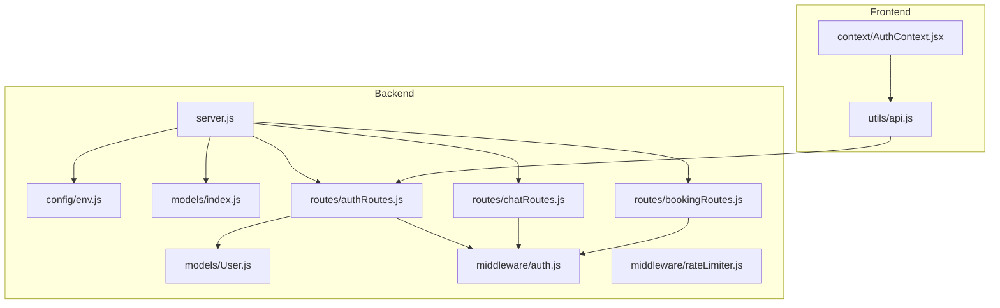
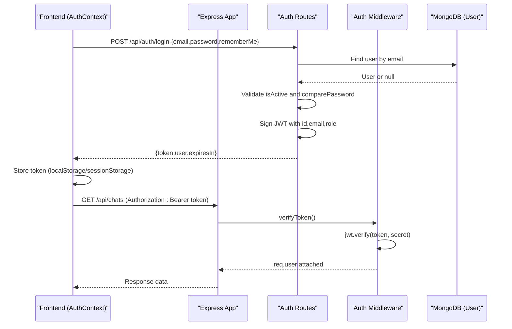
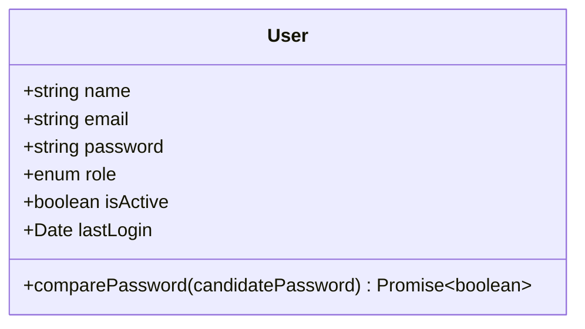
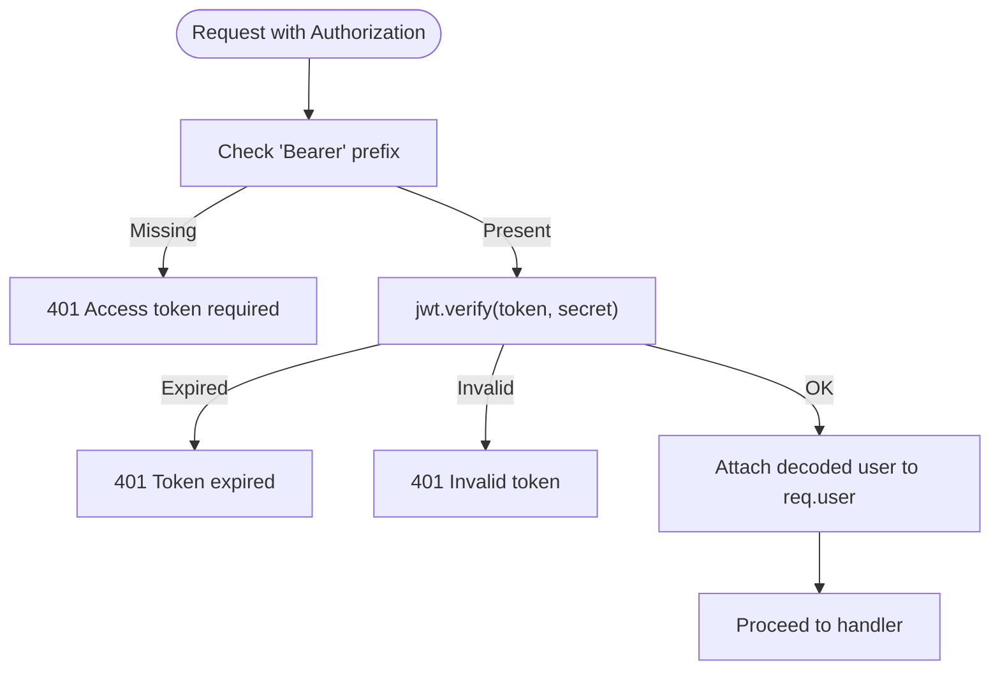
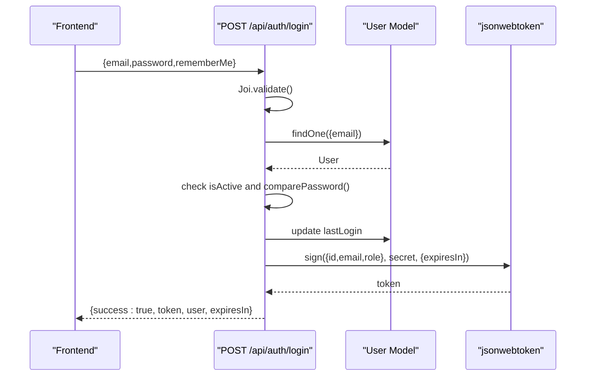
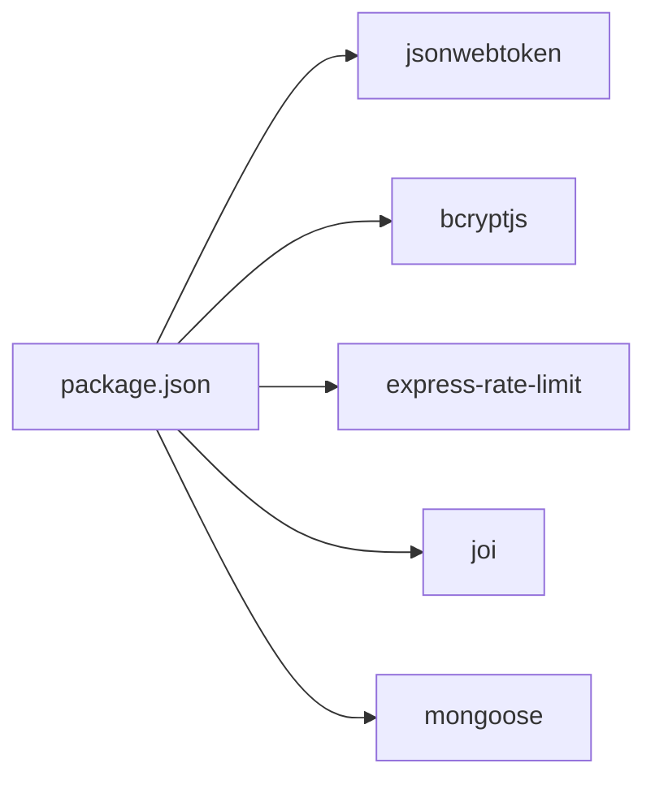

# Authentication System

<cite>
**Referenced Files in This Document**
- [server.js](file://backend/src/server.js)
- [env.js](file://backend/src/config/env.js)
- [User.js](file://backend/src/models/User.js)
- [index.js](file://backend/src/models/index.js)
- [auth.js](file://backend/src/middleware/auth.js)
- [rateLimiter.js](file://backend/src/middleware/rateLimiter.js)
- [authRoutes.js](file://backend/src/routes/authRoutes.js)
- [chatRoutes.js](file://backend/src/routes/chatRoutes.js)
- [bookingRoutes.js](file://backend/src/routes/bookingRoutes.js)
- [package.json](file://backend/package.json)
- [api.js](file://frontend/src/utils/api.js)
- [AuthContext.jsx](file://frontend/src/context/AuthContext.jsx)
</cite>

## Table of Contents
1. [Introduction](#introduction)
2. [Project Structure](#project-structure)
3. [Core Components](#core-components)
4. [Architecture Overview](#architecture-overview)
5. [Detailed Component Analysis](#detailed-component-analysis)
6. [Dependency Analysis](#dependency-analysis)
7. [Performance Considerations](#performance-considerations)
8. [Troubleshooting Guide](#troubleshooting-guide)
9. [Conclusion](#conclusion)
10. [Appendices](#appendices)

## Introduction
This document explains the authentication system for Nandibaag Bot, focusing on JWT-based authentication, user registration and login flows, password hashing with bcryptjs, role-based access control (RBAC), middleware, protected routes, token refresh strategy, default admin creation, and security best practices. It also provides guidance for implementing new protected endpoints and extending user roles.

## Project Structure
The authentication system spans backend and frontend:
- Backend: Express server, environment configuration, Mongoose models, middleware, routes, and rate limiting.
- Frontend: Axios API client with interceptors and React context for auth state and token management.

**Diagram sources**
- [server.js:88-97](file://backend/src/server.js#L88-L97)
- [env.js:56-69](file://backend/src/config/env.js#L56-L69)
- [index.js:11-21](file://backend/src/models/index.js#L11-L21)
- [auth.js:1-67](file://backend/src/middleware/auth.js#L1-L67)
- [rateLimiter.js:1-36](file://backend/src/middleware/rateLimiter.js#L1-L36)
- [authRoutes.js:1-137](file://backend/src/routes/authRoutes.js#L1-L137)
- [chatRoutes.js:1-254](file://backend/src/routes/chatRoutes.js#L1-L254)
- [bookingRoutes.js:1-71](file://backend/src/routes/bookingRoutes.js#L1-L71)
- [api.js:36-82](file://frontend/src/utils/api.js#L36-L82)
- [AuthContext.jsx:1-50](file://frontend/src/context/AuthContext.jsx#L1-L50)

**Section sources**
- [server.js:88-97](file://backend/src/server.js#L88-L97)
- [env.js:56-69](file://backend/src/config/env.js#L56-L69)
- [index.js:11-21](file://backend/src/models/index.js#L11-L21)
- [auth.js:1-67](file://backend/src/middleware/auth.js#L1-L67)
- [rateLimiter.js:1-36](file://backend/src/middleware/rateLimiter.js#L1-L36)
- [authRoutes.js:1-137](file://backend/src/routes/authRoutes.js#L1-L137)
- [chatRoutes.js:1-254](file://backend/src/routes/chatRoutes.js#L1-L254)
- [bookingRoutes.js:1-71](file://backend/src/routes/bookingRoutes.js#L1-L71)
- [api.js:36-82](file://frontend/src/utils/api.js#L36-L82)
- [AuthContext.jsx:1-50](file://frontend/src/context/AuthContext.jsx#L1-L50)

## Core Components
- User model with bcryptjs password hashing and comparison method.
- JWT signing and verification via jsonwebtoken.
- Middleware to verify tokens and enforce admin-only access.
- Auth routes for login, logout, and current user info.
- Protected routes across features using the same middleware.
- Rate limiting for general API and login endpoint.
- Frontend token storage and automatic 401 handling.

Key implementation references:
- Password hashing and schema: [User.js:1-63](file://backend/src/models/User.js#L1-L63)
- Token verification and RBAC: [auth.js:1-67](file://backend/src/middleware/auth.js#L1-L67)
- Login flow and JWT issuance: [authRoutes.js:1-137](file://backend/src/routes/authRoutes.js#L1-L137)
- Protected route examples: [chatRoutes.js:1-254](file://backend/src/routes/chatRoutes.js#L1-L254), [bookingRoutes.js:1-71](file://backend/src/routes/bookingRoutes.js#L1-L71)
- Rate limiting: [rateLimiter.js:1-36](file://backend/src/middleware/rateLimiter.js#L1-L36)
- Environment variables: [env.js:1-95](file://backend/src/config/env.js#L1-L95)
- Default admin creation at startup: [server.js:110-131](file://backend/src/server.js#L110-L131)
- Frontend token handling: [api.js:36-82](file://frontend/src/utils/api.js#L36-82), [AuthContext.jsx:1-50](file://frontend/src/context/AuthContext.jsx#L1-50)

**Section sources**
- [User.js:1-63](file://backend/src/models/User.js#L1-L63)
- [auth.js:1-67](file://backend/src/middleware/auth.js#L1-L67)
- [authRoutes.js:1-137](file://backend/src/routes/authRoutes.js#L1-L137)
- [chatRoutes.js:1-254](file://backend/src/routes/chatRoutes.js#L1-L254)
- [bookingRoutes.js:1-71](file://backend/src/routes/bookingRoutes.js#L1-L71)
- [rateLimiter.js:1-36](file://backend/src/middleware/rateLimiter.js#L1-L36)
- [env.js:1-95](file://backend/src/config/env.js#L1-L95)
- [server.js:110-131](file://backend/src/server.js#L110-L131)
- [api.js:36-82](file://frontend/src/utils/api.js#L36-L82)
- [AuthContext.jsx:1-50](file://frontend/src/context/AuthContext.jsx#L1-L50)

## Architecture Overview
High-level authentication flow:
- Client sends credentials to /api/auth/login.
- Server validates input, checks user existence and status, compares hashed password, updates lastLogin, and issues a JWT.
- Client stores token and attaches it as Bearer Authorization header.
- Protected routes use middleware to verify token and optionally enforce admin role.
- On 401 responses, frontend clears tokens and redirects to login.

**Diagram sources**
- [authRoutes.js:22-93](file://backend/src/routes/authRoutes.js#L22-L93)
- [auth.js:10-47](file://backend/src/middleware/auth.js#L10-L47)
- [chatRoutes.js:14-50](file://backend/src/routes/chatRoutes.js#L14-L50)
- [api.js:36-82](file://frontend/src/utils/api.js#L36-L82)
- [AuthContext.jsx:27-50](file://frontend/src/context/AuthContext.jsx#L27-L50)

## Detailed Component Analysis

### User Model and Password Hashing
- Fields include name, email (unique, lowercase, trimmed), password, role (admin/staff), isActive, lastLogin, timestamps.
- Pre-save hook hashes passwords using bcryptjs with salt rounds configured in the model.
- Method comparePassword verifies candidate passwords against stored hash.
- Indexes on email, role, and isActive improve query performance.

**Diagram sources**
- [User.js:4-34](file://backend/src/models/User.js#L4-L34)
- [User.js:40-60](file://backend/src/models/User.js#L40-L60)

**Section sources**
- [User.js:1-63](file://backend/src/models/User.js#L1-L63)

### JWT Implementation and Configuration
- Signing: JWT payload includes id, email, role; expiration is configurable via environment variable or extended when rememberMe is true.
- Verification: Middleware extracts Bearer token, verifies signature using secret from env, and attaches decoded payload to req.user.
- Error handling: Distinct messages for missing token, expired token, invalid token, and other errors.

**Diagram sources**
- [auth.js:10-47](file://backend/src/middleware/auth.js#L10-L47)
- [env.js:56-69](file://backend/src/config/env.js#L56-L69)

**Section sources**
- [auth.js:1-67](file://backend/src/middleware/auth.js#L1-L67)
- [env.js:1-95](file://backend/src/config/env.js#L1-L95)

### Login Flow
- Input validation via Joi schema enforces email format and presence of password and rememberMe flag.
- Finds user by normalized email, checks isActive, compares password using model method.
- Updates lastLogin timestamp and returns JWT along with minimal user profile and expiresIn.

**Diagram sources**
- [authRoutes.js:12-93](file://backend/src/routes/authRoutes.js#L12-L93)
- [User.js:40-60](file://backend/src/models/User.js#L40-L60)

**Section sources**
- [authRoutes.js:12-93](file://backend/src/routes/authRoutes.js#L12-L93)
- [User.js:40-60](file://backend/src/models/User.js#L40-L60)

### Logout and Current User
- Logout is stateless; client deletes token locally.
- Current user endpoint requires valid token and returns non-sensitive user details.

**Section sources**
- [authRoutes.js:95-135](file://backend/src/routes/authRoutes.js#L95-L135)

### Role-Based Access Control (RBAC)
- Admin-only middleware checks req.user.role === 'admin'.
- Can be composed after verifyToken to restrict sensitive operations.

**Section sources**
- [auth.js:53-62](file://backend/src/middleware/auth.js#L53-L62)

### Protected Routes Examples
- Chat routes: list chats, get chat detail, toggle mode, send message, reset conversation, archive chat—all guarded by verifyToken.
- Booking routes: list bookings and update status—guarded by verifyToken.

**Section sources**
- [chatRoutes.js:14-251](file://backend/src/routes/chatRoutes.js#L14-L251)
- [bookingRoutes.js:11-68](file://backend/src/routes/bookingRoutes.js#L11-L68)

### Default Admin Creation
- On server start, if no admin exists, creates one using environment-provided default credentials and logs a warning to change them immediately.

**Section sources**
- [server.js:110-131](file://backend/src/server.js#L110-L131)
- [env.js:67-68](file://backend/src/config/env.js#L67-L68)

### Token Refresh Strategy
- The current implementation does not include a dedicated refresh endpoint.
- Clients should handle token expiry by prompting re-authentication or refreshing the page to obtain a new token.
- Frontend automatically clears tokens and redirects on 401 responses.

**Section sources**
- [api.js:36-54](file://frontend/src/utils/api.js#L36-L54)
- [auth.js:27-31](file://backend/src/middleware/auth.js#L27-L31)

### Security Best Practices Observed
- Helmet enabled globally for HTTP security headers.
- CORS restricted to configured frontend URL with credentials allowed.
- Rate limiting applied to all API endpoints and stricter limits on login attempts.
- Passwords hashed with bcryptjs before persistence.
- Environment variables validated at startup.

**Section sources**
- [server.js:37-44](file://backend/src/server.js#L37-L44)
- [rateLimiter.js:1-36](file://backend/src/middleware/rateLimiter.js#L1-L36)
- [User.js:40-52](file://backend/src/models/User.js#L40-L52)
- [env.js:48-54](file://backend/src/config/env.js#L48-L54)

## Dependency Analysis
Authentication-related dependencies and their roles:
- jsonwebtoken: signing and verifying tokens.
- bcryptjs: secure password hashing and comparison.
- express-rate-limit: request throttling for brute-force protection.
- Joi: input validation for login payloads.
- mongoose: user persistence and schema hooks.

**Diagram sources**
- [package.json:23-42](file://backend/package.json#L23-L42)

**Section sources**
- [package.json:23-42](file://backend/package.json#L23-L42)

## Performance Considerations
- Database indexes on email, role, and isActive reduce lookup time for common queries.
- Short-lived tokens minimize risk window; consider adding a refresh mechanism if long sessions are needed.
- Avoid storing sensitive fields in JWT payload; current payload is minimal and appropriate.
- Use pagination and filtering on list endpoints to limit response sizes.

[No sources needed since this section provides general guidance]

## Troubleshooting Guide
Common issues and resolutions:
- Missing or malformed Authorization header: ensure requests include "Authorization: Bearer <token>".
- Token expired: prompt user to log in again; implement client-side refresh logic if desired.
- Invalid token: verify secret configuration and that the token was signed correctly.
- Brute force protection: login attempts are rate-limited; wait or adjust limits if necessary.
- Default admin credentials: change immediately after first run to avoid security risks.

**Section sources**
- [auth.js:10-47](file://backend/src/middleware/auth.js#L10-L47)
- [rateLimiter.js:22-31](file://backend/src/middleware/rateLimiter.js#L22-L31)
- [server.js:116-130](file://backend/src/server.js#L116-L130)

## Conclusion
Nandibaag Bot implements a robust, stateless JWT authentication system with strong defaults: secure password hashing, strict input validation, rate limiting, and clear separation between authentication and authorization via middleware. The frontend integrates seamlessly by managing token storage and handling 401 responses. Extending the system with additional roles or a token refresh endpoint can be achieved by following the established patterns.

[No sources needed since this section summarizes without analyzing specific files]

## Appendices

### Implementing a New Protected Endpoint
Steps:
1. Import verifyToken from middleware/auth.
2. Apply verifyToken to your route handler.
3. Access authenticated user via req.user.

Example reference paths:
- Protected GET example: [chatRoutes.js:14-50](file://backend/src/routes/chatRoutes.js#L14-L50)
- Protected PATCH example: [bookingRoutes.js:37-68](file://backend/src/routes/bookingRoutes.js#L37-L68)

**Section sources**
- [chatRoutes.js:14-50](file://backend/src/routes/chatRoutes.js#L14-L50)
- [bookingRoutes.js:37-68](file://backend/src/routes/bookingRoutes.js#L37-L68)

### Adding an Admin-Only Endpoint
Steps:
1. Ensure verifyToken is applied first.
2. Add requireAdmin middleware to enforce admin role.

Reference path:
- Admin-only middleware definition: [auth.js:53-62](file://backend/src/middleware/auth.js#L53-L62)

**Section sources**
- [auth.js:53-62](file://backend/src/middleware/auth.js#L53-L62)

### Extending User Roles
To add a new role:
1. Update the role enum in the User schema to include the new value.
2. Extend RBAC middleware to support the new role where needed.
3. Update any UI or business logic that depends on roles.

Reference path:
- Role enum and defaults: [User.js:20-24](file://backend/src/models/User.js#L20-L24)

**Section sources**
- [User.js:20-24](file://backend/src/models/User.js#L20-L24)

### Environment Variables Reference
Required and relevant variables for authentication:
- JWT_SECRET: Secret key used to sign and verify tokens.
- JWT_EXPIRES_IN: Default token lifetime string (e.g., "7d").
- ADMIN_DEFAULT_EMAIL: Email for initial admin account.
- ADMIN_DEFAULT_PASSWORD: Password for initial admin account.
- FRONTEND_URL: Allowed CORS origin.

Reference path:
- Validation and exports: [env.js:4-69](file://backend/src/config/env.js#L4-L69)

**Section sources**
- [env.js:4-69](file://backend/src/config/env.js#L4-L69)