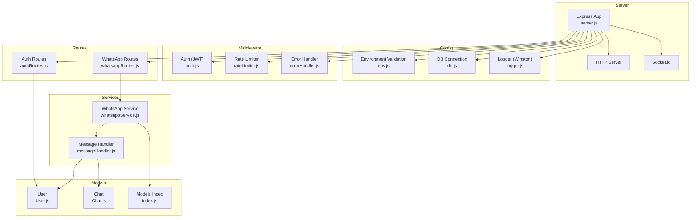
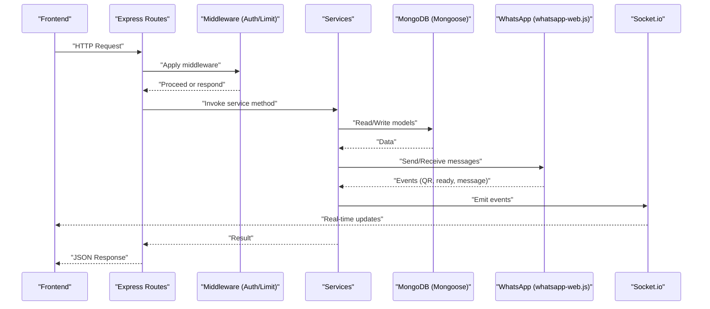
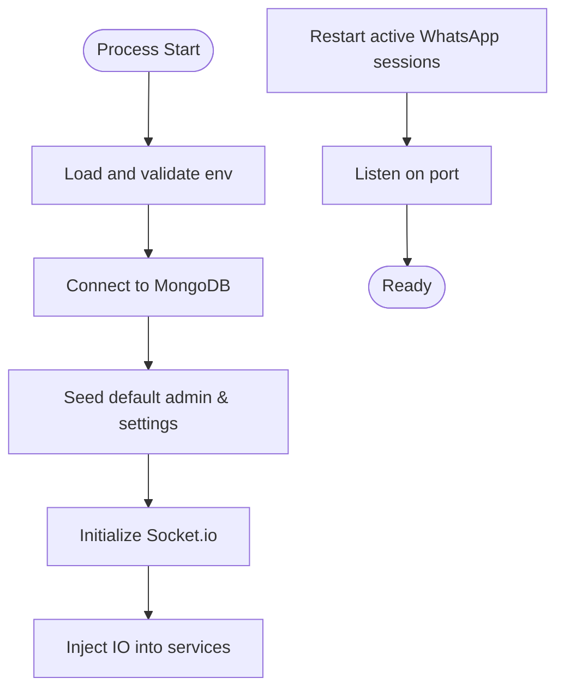
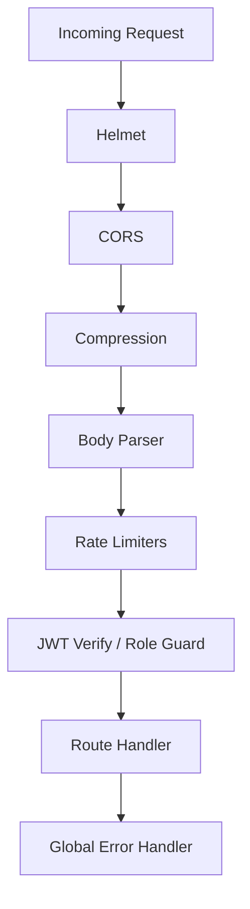
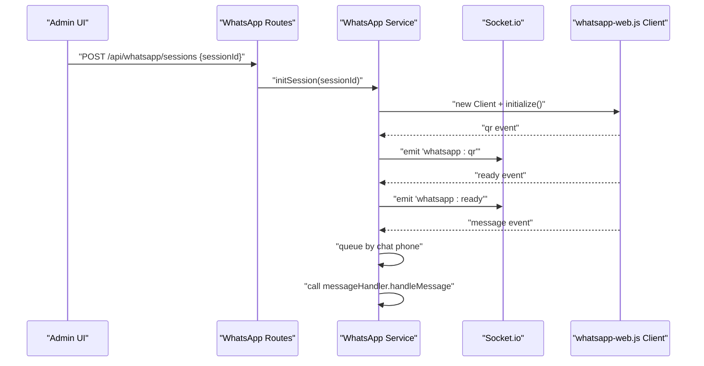
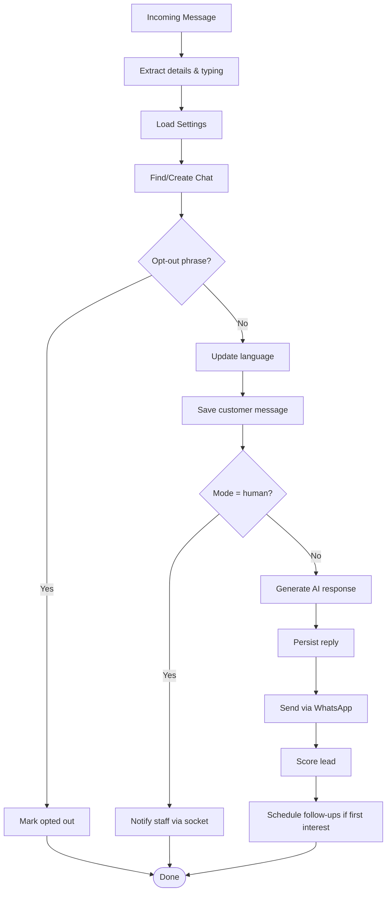
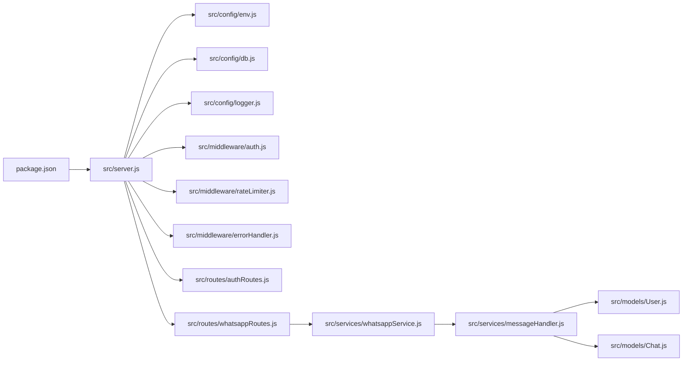

# Backend Development

<cite>
**Referenced Files in This Document**
- [server.js](file://backend/src/server.js)
- [package.json](file://backend/package.json)
- [db.js](file://backend/src/config/db.js)
- [env.js](file://backend/src/config/env.js)
- [logger.js](file://backend/src/config/logger.js)
- [auth.js](file://backend/src/middleware/auth.js)
- [errorHandler.js](file://backend/src/middleware/errorHandler.js)
- [rateLimiter.js](file://backend/src/middleware/rateLimiter.js)
- [whatsappService.js](file://backend/src/services/whatsappService.js)
- [messageHandler.js](file://backend/src/services/messageHandler.js)
- [User.js](file://backend/src/models/User.js)
- [Chat.js](file://backend/src/models/Chat.js)
- [index.js](file://backend/src/models/index.js)
- [authRoutes.js](file://backend/src/routes/authRoutes.js)
- [whatsappRoutes.js](file://backend/src/routes/whatsappRoutes.js)
</cite>

## Table of Contents
1. Introduction
2. Project Structure
3. Core Components
4. Architecture Overview
5. Detailed Component Analysis
6. Dependency Analysis
7. Performance Considerations
8. Troubleshooting Guide
9. Conclusion

## Introduction
This document provides comprehensive backend development documentation for Nandibaag Bot. It covers the Express.js server setup, middleware configuration, service layer architecture, modular structure (config, middleware, routes, services), JWT authentication, error handling and logging with Winston, WhatsApp integration using whatsapp-web.js with multi-session support and message routing, database connection management with Mongoose including model relationships and query optimization patterns, and guidance on extending the service layer and adding new API endpoints.

## Project Structure
The backend is organized by feature and responsibility:
- Configuration: environment validation, database connection, logging
- Middleware: authentication, rate limiting, global error handling
- Routes: REST endpoints grouped by domain
- Services: business logic and integrations (WhatsApp, AI, lead scoring, follow-ups)
- Models: Mongoose schemas and indexes
- Sockets: real-time communication wiring
- Scripts: utilities for setup, testing, and maintenance

**Diagram sources**
- [server.js:1-100](file://backend/src/server.js#L1-L100)
- [env.js:1-95](file://backend/src/config/env.js#L1-L95)
- [db.js:1-40](file://backend/src/config/db.js#L1-L40)
- [logger.js:1-52](file://backend/src/config/logger.js#L1-L52)
- [auth.js:1-68](file://backend/src/middleware/auth.js#L1-L68)
- [rateLimiter.js:1-37](file://backend/src/middleware/rateLimiter.js#L1-L37)
- [errorHandler.js:1-36](file://backend/src/middleware/errorHandler.js#L1-L36)
- [authRoutes.js:1-138](file://backend/src/routes/authRoutes.js#L1-L138)
- [whatsappRoutes.js:1-110](file://backend/src/routes/whatsappRoutes.js#L1-L110)
- [whatsappService.js:1-120](file://backend/src/services/whatsappService.js#L1-L120)
- [messageHandler.js:1-60](file://backend/src/services/messageHandler.js#L1-L60)
- [User.js:1-63](file://backend/src/models/User.js#L1-L63)
- [Chat.js:1-107](file://backend/src/models/Chat.js#L1-L107)
- [index.js:1-22](file://backend/src/models/index.js#L1-L22)

**Section sources**
- [server.js:1-100](file://backend/src/server.js#L1-L100)
- [package.json:1-46](file://backend/package.json#L1-L46)

## Core Components
- Express application bootstrap and HTTP server creation
- Security and performance middleware: Helmet, CORS, compression, body parsers, morgan (dev)
- Global rate limiting per route group
- Health check endpoint exposing MongoDB connectivity and active WhatsApp sessions
- Socket.io initialization and injection into services
- Graceful shutdown sequence ensuring session cleanup and DB disconnect
- Environment validation via Joi
- Database connection with retry strategy
- Winston logger configured for console (development) and file transports (production)

Key responsibilities:
- server.js orchestrates app setup, middleware, routes, sockets, and lifecycle
- config/* centralizes settings, DB, and logging
- middleware/* enforces security, auth, and error contracts
- services/* encapsulates external integrations and business workflows
- models/* defines data structures and indexes
- routes/* exposes REST APIs and delegates to services

**Section sources**
- [server.js:1-174](file://backend/src/server.js#L1-L174)
- [env.js:1-95](file://backend/src/config/env.js#L1-L95)
- [db.js:1-40](file://backend/src/config/db.js#L1-L40)
- [logger.js:1-52](file://backend/src/config/logger.js#L1-L52)

## Architecture Overview
High-level flow:
- Client requests hit Express routes
- Middleware validates, authenticates, and rate-limits
- Route handlers call services for business logic
- Services interact with Mongoose models and external systems (WhatsApp, AI providers)
- Real-time updates are emitted via Socket.io to the frontend

**Diagram sources**
- [server.js:88-108](file://backend/src/server.js#L88-L108)
- [whatsappRoutes.js:1-110](file://backend/src/routes/whatsappRoutes.js#L1-L110)
- [whatsappService.js:150-320](file://backend/src/services/whatsappService.js#L150-L320)
- [messageHandler.js:22-178](file://backend/src/services/messageHandler.js#L22-L178)

## Detailed Component Analysis

### Express Server Setup and Lifecycle
- Creates Express app and HTTP server
- Applies security and performance middleware
- Registers health check and API routes
- Initializes Socket.io and injects it into services
- Bootstraps default admin user and settings if missing
- Restarts active WhatsApp sessions at startup
- Starts scheduled tasks (follow-up cron)
- Handles process signals for graceful shutdown

**Diagram sources**
- [server.js:110-174](file://backend/src/server.js#L110-L174)

**Section sources**
- [server.js:1-174](file://backend/src/server.js#L1-L174)

### Configuration Management
- Environment variables validated with Joi; required fields enforced
- Exports typed configuration values used across modules
- Supports multiple AI provider tiers and local test mode flags
- Centralizes URLs, keys, and operational toggles

Best practices:
- Keep secrets out of code; rely on .env
- Validate early to fail fast on misconfiguration
- Use defaults where safe and appropriate

**Section sources**
- [env.js:1-95](file://backend/src/config/env.js#L1-L95)

### Database Connection Management (Mongoose)
- connectDB wraps mongoose.connect with retry logic and exponential backoff
- Emits warnings/errors on disconnect and errors
- Ensures resilient startup even under transient DB issues

Query optimization patterns:
- Use selective field projection in find operations
- Leverage existing indexes defined in models
- Prefer aggregation pipelines for complex analytics
- Avoid loading large arrays when not needed

**Section sources**
- [db.js:1-40](file://backend/src/config/db.js#L1-L40)
- [Chat.js:99-105](file://backend/src/models/Chat.js#L99-L105)
- [User.js:36-38](file://backend/src/models/User.js#L36-L38)

### Logging with Winston
- Console transport in development with colored timestamps
- File transports for error and combined logs in all environments
- Structured JSON output for log aggregation
- Centralized logger instance imported across modules

Operational tips:
- Log contextual metadata (URL, method, IP) in error handler
- Avoid sensitive data in logs
- Rotate logs externally if needed

**Section sources**
- [logger.js:1-52](file://backend/src/config/logger.js#L1-L52)
- [errorHandler.js:1-36](file://backend/src/middleware/errorHandler.js#L1-L36)

### Middleware Pipeline
- Security: Helmet, CORS restricted to frontend URL, compression
- Parsing: JSON and URL-encoded bodies
- Rate limiting: general API limiter and stricter login limiter
- Authentication: JWT verification and role-based guard
- Error handling: global error handler returning consistent JSON shape

**Diagram sources**
- [server.js:37-61](file://backend/src/server.js#L37-L61)
- [auth.js:1-68](file://backend/src/middleware/auth.js#L1-L68)
- [rateLimiter.js:1-37](file://backend/src/middleware/rateLimiter.js#L1-L37)
- [errorHandler.js:1-36](file://backend/src/middleware/errorHandler.js#L1-L36)

**Section sources**
- [server.js:37-61](file://backend/src/server.js#L37-L61)
- [auth.js:1-68](file://backend/src/middleware/auth.js#L1-L68)
- [rateLimiter.js:1-37](file://backend/src/middleware/rateLimiter.js#L1-L37)
- [errorHandler.js:1-36](file://backend/src/middleware/errorHandler.js#L1-L36)

### JWT Authentication
- verifyToken extracts Bearer token, verifies signature, attaches decoded payload to req.user
- requireAdmin enforces role-based access
- Login route validates input, compares password, sets lastLogin, and returns token with configurable expiry

Security notes:
- Store secret securely via environment
- Enforce HTTPS in production
- Consider refresh tokens for long-lived sessions

**Section sources**
- [auth.js:1-68](file://backend/src/middleware/auth.js#L1-L68)
- [authRoutes.js:1-138](file://backend/src/routes/authRoutes.js#L1-L138)
- [User.js:40-60](file://backend/src/models/User.js#L40-L60)

### WhatsApp Integration (Multi-Session Support)
- Multi-session architecture: Map of sessionId -> Client instances
- LocalAuth persists session data per sessionId on disk
- Non-blocking initialization with event-driven UI updates via Socket.io
- Auto-reconnect with exponential backoff and attempt counters
- Per-chat message queue locks prevent race conditions on Chat updates
- Pairing code alternative to QR scanning
- Session lifecycle: init, ready, auth_failure, disconnected, destroy
- Health checks via cron and state inspection

**Diagram sources**
- [whatsappRoutes.js:37-60](file://backend/src/routes/whatsappRoutes.js#L37-L60)
- [whatsappService.js:107-162](file://backend/src/services/whatsappService.js#L107-L162)
- [whatsappService.js:258-290](file://backend/src/services/whatsappService.js#L258-L290)

**Section sources**
- [whatsappService.js:1-642](file://backend/src/services/whatsappService.js#L1-L642)
- [whatsappRoutes.js:1-110](file://backend/src/routes/whatsappRoutes.js#L1-L110)

### Message Routing and Business Logic
- handleMessage orchestrates conversation processing:
  - Extract contact and text, ignore non-text
  - Emit typing indicator immediately
  - Load Settings, find or create Chat
  - Handle opt-out phrases and language detection
  - Persist customer message and cancel pending follow-ups
  - If human mode: notify staff via socket, no auto-reply
  - If AI mode: generate response, persist, send via WhatsApp, score lead, schedule follow-ups
  - Robust error handling with alerts on AI failures

**Diagram sources**
- [messageHandler.js:22-178](file://backend/src/services/messageHandler.js#L22-L178)

**Section sources**
- [messageHandler.js:1-183](file://backend/src/services/messageHandler.js#L1-L183)

### Data Models and Relationships
- User: authentication and roles, hashed passwords, indexes for email, role, isActive
- Chat: conversation history, booking stage/draft, language, mode, archived flag, indexes for queries
- Models index aggregates exports for convenient imports

Relationships and constraints:
- Chat.customerPhone unique ensures one conversation per number
- Chat.mode and bookingStage drive routing and workflow
- Soft deletion via isArchived preserves auditability

Indexes:
- Frequent filters and sorts benefit from indexes on customerPhone, lastMessageAt, mode, bookingStage, isArchived, language

**Section sources**
- [User.js:1-63](file://backend/src/models/User.js#L1-L63)
- [Chat.js:1-107](file://backend/src/models/Chat.js#L1-L107)
- [index.js:1-22](file://backend/src/models/index.js#L1-L22)

### API Endpoints Overview
- Authentication
  - POST /api/auth/login: Validates credentials, returns JWT
  - POST /api/auth/logout: Stateless logout
  - GET /api/auth/me: Protected, returns current user info
- WhatsApp Sessions
  - GET /api/whatsapp/sessions: Lists session statuses
  - POST /api/whatsapp/sessions: Start a new session (admin only)
  - POST /api/whatsapp/sessions/:id/pairing-code: Request pairing code
  - DELETE /api/whatsapp/sessions/:id: Destroy session and clean up data

Notes:
- All session endpoints use verifyToken; mutating endpoints additionally require requireAdmin
- Initialization is non-blocking; frontend listens to Socket.io events for progress

**Section sources**
- [authRoutes.js:1-138](file://backend/src/routes/authRoutes.js#L1-L138)
- [whatsappRoutes.js:1-110](file://backend/src/routes/whatsappRoutes.js#L1-L110)

## Dependency Analysis
External dependencies include Express, Mongoose, Socket.io, whatsapp-web.js, JWT, bcryptjs, helmet, cors, compression, morgan, express-rate-limit, winston, node-cron, and various AI SDKs. The package entry point is src/server.js.

**Diagram sources**
- [package.json:1-46](file://backend/package.json#L1-L46)
- [server.js:1-100](file://backend/src/server.js#L1-L100)
- [authRoutes.js:1-138](file://backend/src/routes/authRoutes.js#L1-L138)
- [whatsappRoutes.js:1-110](file://backend/src/routes/whatsappRoutes.js#L1-L110)
- [whatsappService.js:1-120](file://backend/src/services/whatsappService.js#L1-L120)
- [messageHandler.js:1-60](file://backend/src/services/messageHandler.js#L1-L60)
- [User.js:1-63](file://backend/src/models/User.js#L1-L63)
- [Chat.js:1-107](file://backend/src/models/Chat.js#L1-L107)

**Section sources**
- [package.json:1-46](file://backend/package.json#L1-L46)

## Performance Considerations
- Enable compression and set strict CORS origin
- Use rate limiters to protect endpoints
- Prefer indexed queries and avoid unnecessary array loads
- Queue per-chat message processing to prevent contention
- Use non-blocking initialization for heavy operations (WhatsApp sessions)
- Monitor health endpoints and session states
- Tune Puppeteer args for containerized environments

[No sources needed since this section provides general guidance]

## Troubleshooting Guide
Common issues and resolutions:
- Port already in use: Check and free the port or change PORT in .env
- MongoDB connection failures: Retry logic will attempt reconnect; ensure URI and network reachability
- WhatsApp session stuck or locked: Clean stale lock files and delete session folder, then reinitialize
- Unhandled exceptions/rejections: Process-level handlers log and exit; inspect logs for root cause
- Token expired or invalid: Ensure correct secret and expiration; refresh client token
- Too many requests: Adjust rate limits or investigate abuse patterns

Operational checks:
- Use /health to verify DB connectivity and active WhatsApp sessions
- Review Winston logs for detailed stack traces in development
- Inspect Socket.io events for session lifecycle status

**Section sources**
- [server.js:155-174](file://backend/src/server.js#L155-L174)
- [db.js:10-29](file://backend/src/config/db.js#L10-L29)
- [whatsappService.js:76-92](file://backend/src/services/whatsappService.js#L76-L92)
- [errorHandler.js:1-36](file://backend/src/middleware/errorHandler.js#L1-L36)

## Conclusion
Nandibaag Bot’s backend follows a clear separation of concerns with robust configuration, secure middleware, scalable service layer, and resilient WhatsApp integration. The design emphasizes reliability through retries, queues, and event-driven updates. Extending functionality involves adding routes that delegate to services, updating models as needed, and emitting Socket.io events for real-time feedback.

[No sources needed since this section summarizes without analyzing specific files]