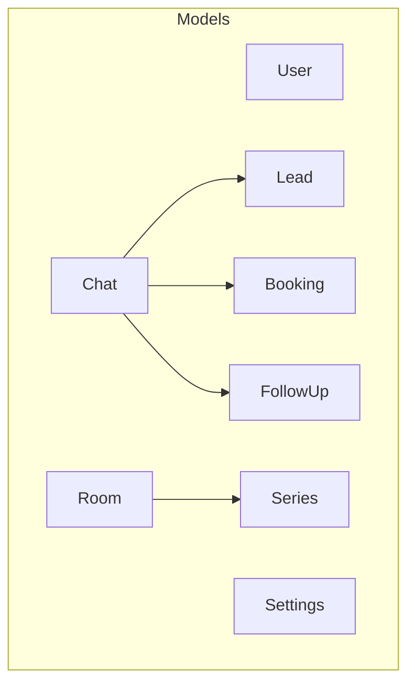
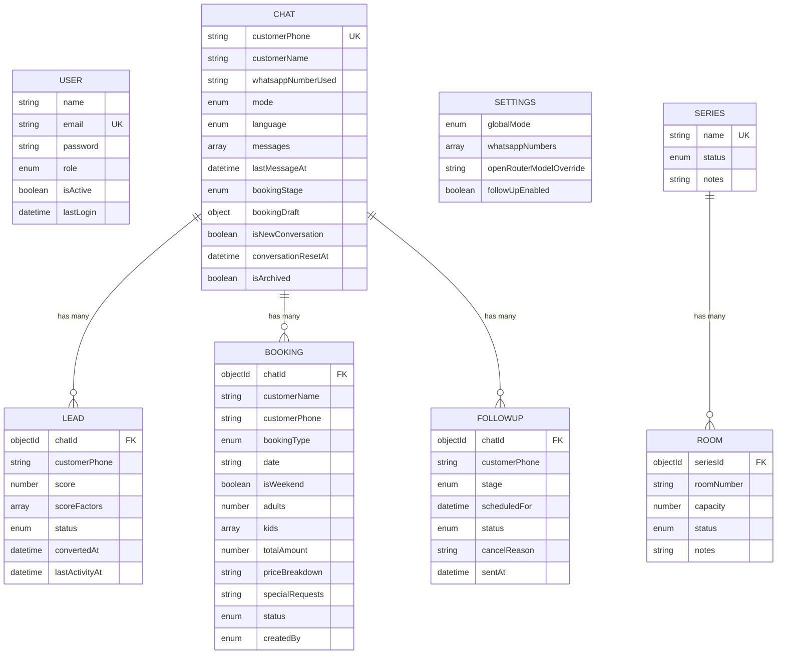
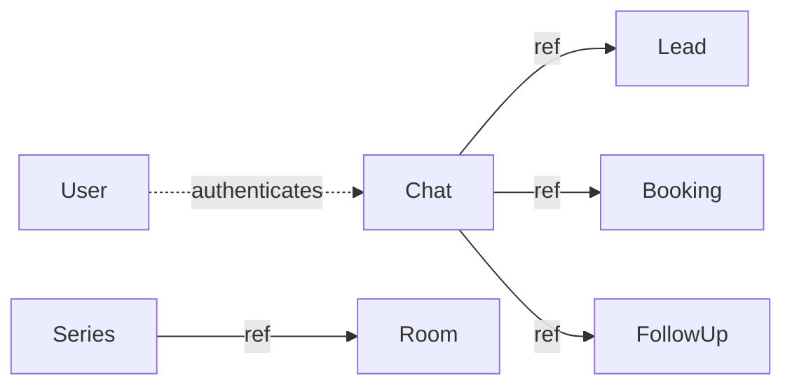

# Database Models & Schema

<cite>
**Referenced Files in This Document**
- [User.js](file://backend/src/models/User.js)
- [Chat.js](file://backend/src/models/Chat.js)
- [Lead.js](file://backend/src/models/Lead.js)
- [Booking.js](file://backend/src/models/Booking.js)
- [FollowUp.js](file://backend/src/models/FollowUp.js)
- [Settings.js](file://backend/src/models/Settings.js)
- [Room.js](file://backend/src/models/Room.js)
- [Series.js](file://backend/src/models/Series.js)
- [index.js](file://backend/src/models/index.js)
</cite>

## Table of Contents
1. [Introduction](#introduction)
2. [Project Structure](#project-structure)
3. [Core Components](#core-components)
4. [Architecture Overview](#architecture-overview)
5. [Detailed Component Analysis](#detailed-component-analysis)
6. [Dependency Analysis](#dependency-analysis)
7. [Performance Considerations](#performance-considerations)
8. [Troubleshooting Guide](#troubleshooting-guide)
9. [Conclusion](#conclusion)
10. [Appendices](#appendices)

## Introduction
This document provides comprehensive database models documentation for Nandibaag Bot using Mongoose schemas. It covers the User, Chat, Lead, Booking, FollowUp, Settings, Room, and Series models with field definitions, data types, validation rules, relationships, indexing strategies, query optimization patterns, data lifecycle management, sample queries, aggregation pipelines, and migration considerations.

## Project Structure
The database models are organized under backend/src/models. Each model is defined in its own file and exported via a central index. The models represent core entities such as users, conversations (chats), leads, bookings, follow-ups, settings, rooms, and series.

**Diagram sources**
- [index.js:1-22](file://backend/src/models/index.js#L1-L22)
- [Chat.js:1-107](file://backend/src/models/Chat.js#L1-L107)
- [Lead.js:1-55](file://backend/src/models/Lead.js#L1-L55)
- [Booking.js:1-69](file://backend/src/models/Booking.js#L1-L69)
- [FollowUp.js:1-49](file://backend/src/models/FollowUp.js#L1-L49)
- [Settings.js:1-38](file://backend/src/models/Settings.js#L1-L38)
- [Room.js:1-35](file://backend/src/models/Room.js#L1-L35)
- [Series.js:1-24](file://backend/src/models/Series.js#L1-L24)

**Section sources**
- [index.js:1-22](file://backend/src/models/index.js#L1-L22)

## Core Components
- User: Authentication and authorization entity with role-based access control and password hashing.
- Chat: Conversation record per customer phone with message history, booking draft, language, mode, and soft deletion via archive flag.
- Lead: Conversion tracking linked to a chat with scoring and status transitions.
- Booking: Finalized reservation details derived from chat drafts or staff input.
- FollowUp: Scheduled messaging tasks tied to chats and customers.
- Settings: Global configuration including global mode, WhatsApp numbers, AI model override, and follow-up toggles.
- Room and Series: Inventory structures for room capacity and grouping.

Key relationships:
- Chat is referenced by Lead, Booking, and FollowUp via ObjectId references.
- Room references Series.

Indexing highlights:
- Frequent filters and sorts are supported by indexes on phone numbers, statuses, dates, modes, languages, and stages.

Lifecycle notes:
- Chats are never hard-deleted; use isArchived for soft deletion.
- Passwords are hashed before save.
- Timestamps are enabled across most models.

**Section sources**
- [User.js:1-63](file://backend/src/models/User.js#L1-L63)
- [Chat.js:1-107](file://backend/src/models/Chat.js#L1-L107)
- [Lead.js:1-55](file://backend/src/models/Lead.js#L1-L55)
- [Booking.js:1-69](file://backend/src/models/Booking.js#L1-L69)
- [FollowUp.js:1-49](file://backend/src/models/FollowUp.js#L1-L49)
- [Settings.js:1-38](file://backend/src/models/Settings.js#L1-L38)
- [Room.js:1-35](file://backend/src/models/Room.js#L1-L35)
- [Series.js:1-24](file://backend/src/models/Series.js#L1-L24)

## Architecture Overview
High-level data flow between models:
- A new conversation creates a Chat entry.
- As interactions progress, a Lead may be created and updated based on engagement signals.
- When a booking intent materializes, a Booking is persisted, often referencing the originating Chat.
- FollowUp records schedule future messages for re-engagement.
- Settings influence behavior globally (e.g., default mode).
- Rooms belong to Series for inventory management.

**Diagram sources**
- [User.js:1-63](file://backend/src/models/User.js#L1-L63)
- [Chat.js:1-107](file://backend/src/models/Chat.js#L1-L107)
- [Lead.js:1-55](file://backend/src/models/Lead.js#L1-L55)
- [Booking.js:1-69](file://backend/src/models/Booking.js#L1-L69)
- [FollowUp.js:1-49](file://backend/src/models/FollowUp.js#L1-L49)
- [Settings.js:1-38](file://backend/src/models/Settings.js#L1-L38)
- [Room.js:1-35](file://backend/src/models/Room.js#L1-L35)
- [Series.js:1-24](file://backend/src/models/Series.js#L1-L24)

## Detailed Component Analysis

### User Model
- Fields:
  - name: String, required
  - email: String, required, unique, lowercase, trim
  - password: String, required
  - role: String, enum ["admin", "staff"], default "staff"
  - isActive: Boolean, default true
  - lastLogin: Date
  - timestamps: enabled
- Validation and hooks:
  - Pre-save hook hashes passwords using bcrypt before persisting.
  - Method comparePassword validates candidate passwords.
- Indexes:
  - email, role, isActive
- Relationships:
  - No direct references to other models.

Sample queries:
- Find user by email:
  - await User.findOne({ email })
- Update last login:
  - await User.findByIdAndUpdate(id, { lastLogin: new Date() }, { new: true })
- Role-based listing:
  - await User.find({ role: "staff", isActive: true }).sort({ createdAt: -1 })

Aggregation pipeline example:
- Count users by role:
  - await User.aggregate([
      { $group: { _id: "$role", count: { $sum: 1 } } }
    ])

Migration considerations:
- Adding new roles requires updating the enum and any business logic that depends on it.
- If migrating to a different hashing algorithm, implement a one-time pass to rehash existing passwords.

**Section sources**
- [User.js:1-63](file://backend/src/models/User.js#L1-L63)

### Chat Model
- Fields:
  - customerPhone: String, required, unique, indexed
  - customerName: String, nullable default
  - whatsappNumberUsed: String
  - mode: String, enum ["ai", "human"], default "ai"
  - language: String, enum ["hindi","marathi","english","hinglish","gujarati","unknown"], default "unknown"
  - messages: Array of embedded message objects (sender, text, timestamp, messageType)
  - lastMessageAt: Date, indexed
  - bookingStage: String, enum representing conversation progression, default "none"
  - bookingDraft: Embedded schema capturing partial booking info
  - isNewConversation: Boolean, default true
  - conversationResetAt: Date, default null
  - isArchived: Boolean, default false
  - timestamps: enabled
- Lifecycle:
  - Soft delete via isArchived; no hard deletes.
- Indexes:
  - customerPhone, lastMessageAt, mode, bookingStage, isArchived, language

Sample queries:
- Recent conversations:
  - await Chat.find({ isArchived: false }).sort({ lastMessageAt: -1 }).limit(50)
- Filter by mode and language:
  - await Chat.find({ mode: "ai", language: "hindi", isArchived: false })
- Get latest message:
  - const chat = await Chat.findOne({ customerPhone }).sort({ updatedAt: -1 });
  - const lastMsg = chat.messages[chat.messages.length - 1];

Aggregation pipeline example:
- Group conversations by language and count:
  - await Chat.aggregate([
      { $match: { isArchived: false } },
      { $group: { _id: "$language", count: { $sum: 1 } } }
    ])

Migration considerations:
- Changing enums (mode, language, bookingStage) must be coordinated with UI and services.
- Ensure indexes remain aligned with query patterns after schema changes.

**Section sources**
- [Chat.js:1-107](file://backend/src/models/Chat.js#L1-L107)

### Lead Model
- Fields:
  - chatId: ObjectId ref "Chat", required, indexed
  - customerPhone: String, required
  - score: Number, default 0, min 0, max 100
  - scoreFactors: Array of factor entries (factor, points, addedAt)
  - status: String, enum ["cold","warm","hot","converted","lost"], default "cold", indexed
  - convertedAt: Date, default null
  - lastActivityAt: Date, indexed
  - timestamps: enabled
- Indexes:
  - chatId, customerPhone, status, score, lastActivityAt

Sample queries:
- Hot leads:
  - await Lead.find({ status: "hot" }).sort({ score: -1 })
- Leads by phone:
  - await Lead.findOne({ customerPhone })
- Recent activity:
  - await Lead.find({ lastActivityAt: { $gte: someDate } }).sort({ lastActivityAt: -1 })

Aggregation pipeline example:
- Score distribution:
  - await Lead.aggregate([
      { $bucket: {
          groupBy: "$score",
          boundaries: [0, 25, 50, 75, 100],
          default: "Other",
          output: { count: { $sum: 1 } }
        }
      }
    ])

Migration considerations:
- Adjusting score bounds or adding new statuses requires updates to scoring logic and UI.

**Section sources**
- [Lead.js:1-55](file://backend/src/models/Lead.js#L1-L55)

### Booking Model
- Fields:
  - chatId: ObjectId ref "Chat"
  - customerName: String, required
  - customerPhone: String, required
  - bookingType: String, enum ["couple","group","picnic"], required
  - date: String, required
  - isWeekend: Boolean
  - adults: Number
  - kids: Array of kid entries (age, rate)
  - totalAmount: Number, required
  - priceBreakdown: String
  - specialRequests: String
  - status: String, enum ["draft","pending_payment","confirmed","cancelled"], default "draft", indexed
  - createdBy: String, enum ["ai","staff"], default "ai"
  - timestamps: enabled
- Indexes:
  - customerPhone, date, status, bookingType, chatId

Sample queries:
- Upcoming confirmed bookings:
  - await Booking.find({ status: "confirmed" }).sort({ date: 1 })
- Bookings by type:
  - await Booking.find({ bookingType: "picnic", status: { $ne: "cancelled" } })
- By phone:
  - await Booking.find({ customerPhone }).sort({ createdAt: -1 })

Aggregation pipeline example:
- Revenue by booking type:
  - await Booking.aggregate([
      { $match: { status: "confirmed" } },
      { $group: { _id: "$bookingType", revenue: { $sum: "$totalAmount" } } }
    ])

Migration considerations:
- Introducing new statuses or types should include backward compatibility checks and data migrations if needed.

**Section sources**
- [Booking.js:1-69](file://backend/src/models/Booking.js#L1-L69)

### FollowUp Model
- Fields:
  - chatId: ObjectId ref "Chat", required, indexed
  - customerPhone: String, required
  - stage: String, enum ["3hr","1day","3day","7day"], required
  - scheduledFor: Date, required, indexed
  - status: String, enum ["pending","sent","cancelled"], default "pending", indexed
  - cancelReason: String, default null
  - sentAt: Date, default null
  - timestamps: enabled
- Indexes:
  - chatId, customerPhone, scheduledFor, status, stage

Sample queries:
- Pending follow-ups due now:
  - await FollowUp.find({ status: "pending", scheduledFor: { $lte: new Date() } })
- Sent this week:
  - await FollowUp.find({ status: "sent", sentAt: { $gte: startOfWeek } })

Aggregation pipeline example:
- Follow-up success rate by stage:
  - await FollowUp.aggregate([
      { $group: {
          _id: "$stage",
          total: { $sum: 1 },
          sent: { $sum: { $cond: [{ $eq: ["$status", "sent"] }, 1, 0] } }
        }
      },
      { $addFields: { rate: { $divide: ["$sent", "$total"] } } }
    ])

Migration considerations:
- Adding new stages requires cron adjustments and template updates.

**Section sources**
- [FollowUp.js:1-49](file://backend/src/models/FollowUp.js#L1-L49)

### Settings Model
- Fields:
  - globalMode: String, enum ["ai","human"], default "ai"
  - whatsappNumbers: Array of number entries (number, label, isActive, isPrimary)
  - openRouterModelOverride: String, default null
  - followUpEnabled: Boolean, default true
  - timestamps: enabled
- Indexes:
  - globalMode

Sample queries:
- Read settings:
  - await Settings.findOne()
- Update global mode:
  - await Settings.updateOne({}, { globalMode: "human" })

Aggregation pipeline example:
- Not typically aggregated; simple find/update operations suffice.

Migration considerations:
- Changes to globalMode can trigger bulk overrides of existing chats' modes at application level.

**Section sources**
- [Settings.js:1-38](file://backend/src/models/Settings.js#L1-L38)

### Room and Series Models
- Series:
  - name: String, required, unique, trimmed
  - status: String, enum ["active","maintenance","wellness","deleted"], default "active"
  - notes: String, default ""
  - timestamps: enabled
- Room:
  - seriesId: ObjectId ref "Series", required, indexed
  - roomNumber: String, required, trimmed
  - capacity: Number, required
  - status: String, enum ["active","maintenance","wellness","deleted"], default "active"
  - notes: String, default ""
  - timestamps: enabled
  - Unique composite index on seriesId + roomNumber

Sample queries:
- List active rooms in a series:
  - await Room.find({ seriesId, status: "active" })
- Series details:
  - await Series.findOne({ name })

Aggregation pipeline example:
- Room counts by status per series:
  - await Room.aggregate([
      { $group: { _id: "$seriesId", total: { $sum: 1 }, active: { $sum: { $cond: [{ $eq: ["$status", "active"] }, 1, 0] } } } }
    ])

Migration considerations:
- Status enums must be consistent across Series and Room.

**Section sources**
- [Room.js:1-35](file://backend/src/models/Room.js#L1-L35)
- [Series.js:1-24](file://backend/src/models/Series.js#L1-L24)

## Dependency Analysis
Model relationships and references:
- Chat is the central entity referenced by Lead, Booking, and FollowUp.
- Room references Series.
- User is independent of these conversational entities.

**Diagram sources**
- [Chat.js:1-107](file://backend/src/models/Chat.js#L1-L107)
- [Lead.js:1-55](file://backend/src/models/Lead.js#L1-L55)
- [Booking.js:1-69](file://backend/src/models/Booking.js#L1-L69)
- [FollowUp.js:1-49](file://backend/src/models/FollowUp.js#L1-L49)
- [Room.js:1-35](file://backend/src/models/Room.js#L1-L35)
- [Series.js:1-24](file://backend/src/models/Series.js#L1-L24)
- [User.js:1-63](file://backend/src/models/User.js#L1-L63)

**Section sources**
- [index.js:1-22](file://backend/src/models/index.js#L1-L22)

## Performance Considerations
- Index usage:
  - Queries frequently filter by customerPhone, status, mode, language, bookingStage, scheduledFor, and lastMessageAt. Ensure these fields remain indexed.
- Query patterns:
  - Prefer sorting by indexed fields like lastMessageAt (-1) for recent chats.
  - Use projection to limit returned fields when retrieving large documents (e.g., messages arrays).
- Aggregations:
  - Use $match early to reduce dataset size.
  - Avoid heavy computations on unindexed fields.
- Data size:
  - Messages arrays can grow; consider pagination or truncation policies for historical data.
- Soft deletes:
  - Always include isArchived: false in queries to exclude archived chats.

[No sources needed since this section provides general guidance]

## Troubleshooting Guide
Common issues and resolutions:
- Duplicate emails:
  - Email has a unique constraint; ensure normalization (lowercase, trim) before insert.
- Password hashing errors:
  - Verify pre-save hook runs and bcrypt is available.
- Missing indexes:
  - Confirm indexes exist for high-frequency filters; recreate if necessary.
- Archived chats still appearing:
  - Ensure queries include isArchived: false.
- Follow-ups not firing:
  - Check scheduledFor and status indexes; verify cron jobs query pending items correctly.

**Section sources**
- [User.js:1-63](file://backend/src/models/User.js#L1-L63)
- [Chat.js:1-107](file://backend/src/models/Chat.js#L1-L107)
- [FollowUp.js:1-49](file://backend/src/models/FollowUp.js#L1-L49)

## Conclusion
The Nandibaag Bot database models are designed around a central Chat entity with supporting Lead, Booking, and FollowUp records. Strong indexing and validation rules support efficient querying and data integrity. Soft deletion preserves conversation history, while Settings provide global behavioral controls. Proper migration practices and careful index maintenance will sustain performance as data grows.

[No sources needed since this section summarizes without analyzing specific files]

## Appendices

### Sample Migration Checklist
- Enum changes:
  - Identify all usages of enums (mode, language, bookingStage, status).
  - Update schema and application code.
  - Backfill existing data if needed.
- New fields:
  - Add schema fields with defaults where appropriate.
  - Create indexes for new filtered/sorted fields.
- Renaming fields:
  - Write migration scripts to rename values in collections.
  - Update all service and route handlers.
- Index maintenance:
  - Review slow queries and add or adjust indexes accordingly.
- Data consistency:
  - Validate referential integrity for chatId references.
  - Reconcile orphaned records if chats are archived or removed.

[No sources needed since this section provides general guidance]