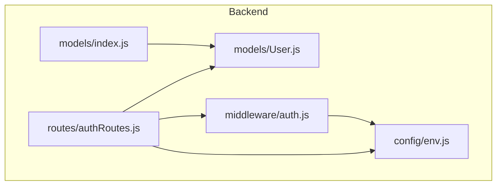
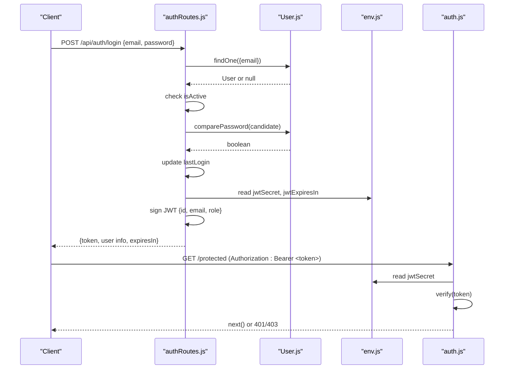
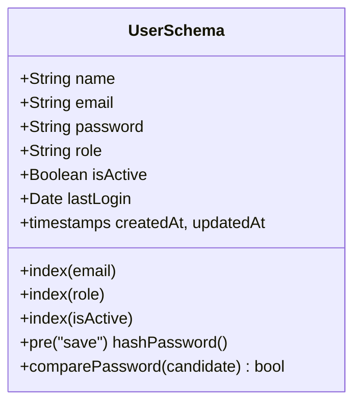
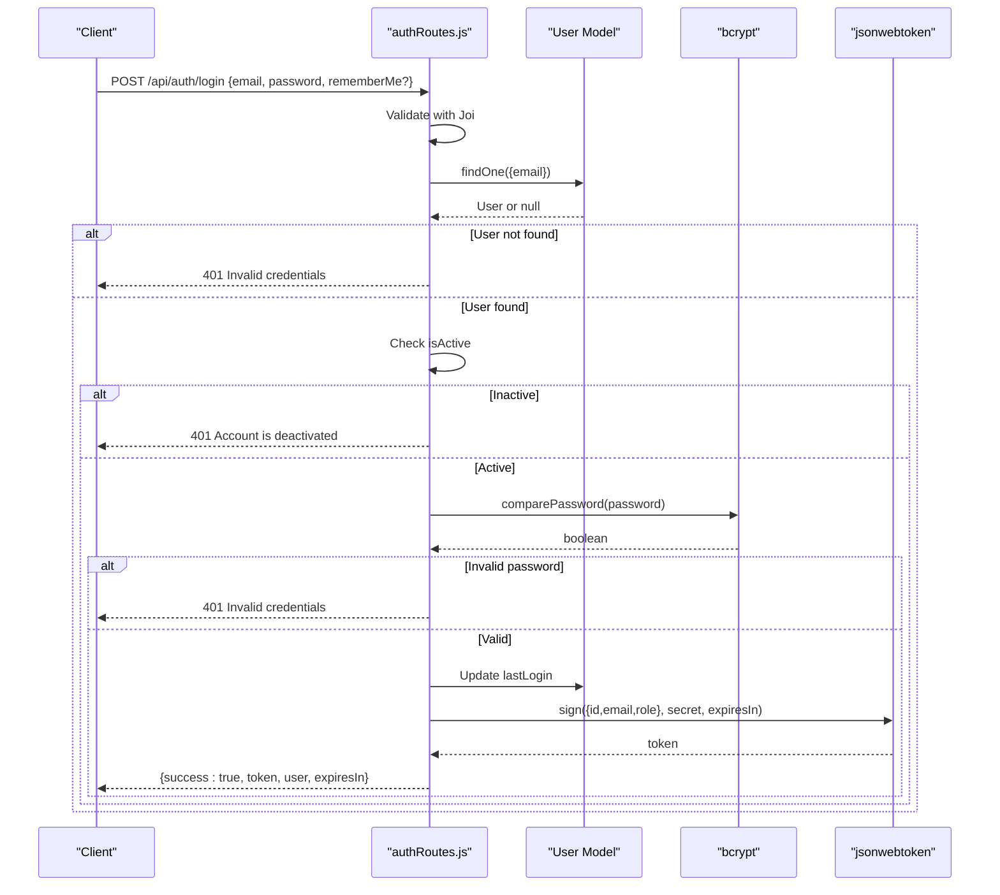
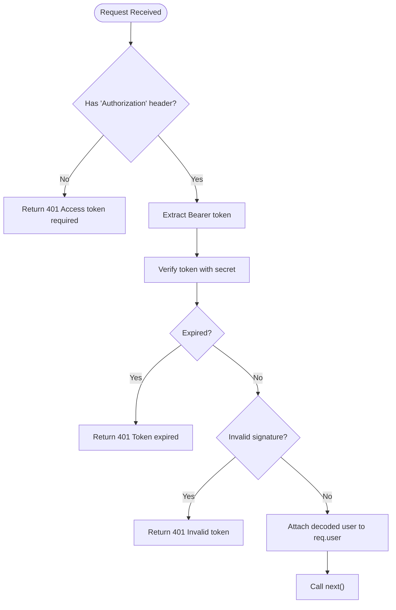
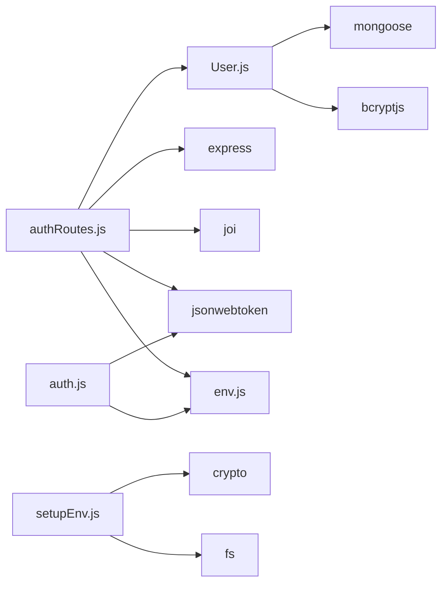

# User Model

<cite>
**Referenced Files in This Document**
- [User.js](file://backend/src/models/User.js)
- [authRoutes.js](file://backend/src/routes/authRoutes.js)
- [auth.js](file://backend/src/middleware/auth.js)
- [env.js](file://backend/src/config/env.js)
- [index.js](file://backend/src/models/index.js)
- [setupEnv.js](file://backend/src/scripts/setupEnv.js)
</cite>

## Table of Contents
1. [Introduction](#introduction)
2. [Project Structure](#project-structure)
3. [Core Components](#core-components)
4. [Architecture Overview](#architecture-overview)
5. [Detailed Component Analysis](#detailed-component-analysis)
6. [Dependency Analysis](#dependency-analysis)
7. [Performance Considerations](#performance-considerations)
8. [Troubleshooting Guide](#troubleshooting-guide)
9. [Conclusion](#conclusion)
10. [Appendices](#appendices)

## Introduction
This document provides comprehensive data model documentation for the User schema and its integration with authentication and authorization flows. It covers field definitions, validation rules, security considerations (password hashing), user lifecycle management, indexing strategies for authentication queries, and role-based access control patterns. It also includes sample workflows for user creation, authentication, and permission checks.

## Project Structure
The User model is defined as a Mongoose schema and used by authentication routes and middleware to manage login, token verification, and admin-only access. Configuration values such as JWT secret and expiration are loaded from environment variables.

**Diagram sources**
- [User.js:1-63](file://backend/src/models/User.js#L1-L63)
- [authRoutes.js:1-138](file://backend/src/routes/authRoutes.js#L1-L138)
- [auth.js:1-68](file://backend/src/middleware/auth.js#L1-L68)
- [env.js:1-95](file://backend/src/config/env.js#L1-L95)
- [index.js:1-22](file://backend/src/models/index.js#L1-L22)

**Section sources**
- [User.js:1-63](file://backend/src/models/User.js#L1-L63)
- [authRoutes.js:1-138](file://backend/src/routes/authRoutes.js#L1-L138)
- [auth.js:1-68](file://backend/src/middleware/auth.js#L1-L68)
- [env.js:1-95](file://backend/src/config/env.js#L1-L95)
- [index.js:1-22](file://backend/src/models/index.js#L1-L22)

## Core Components
- User Schema: Defines fields, default values, constraints, indexes, and hooks for password hashing and comparison.
- Authentication Routes: Provide login, logout, and current-user endpoints; validate input; issue JWTs; update last login.
- Middleware: Verifies JWT tokens and enforces admin-only access.
- Environment Configuration: Loads JWT secret and expiration settings.
- Models Index: Centralizes model exports for consistent imports.

Key responsibilities:
- Data integrity via schema validation and unique constraints.
- Security via bcrypt-based password hashing and JWT-based sessionless auth.
- Access control via role checks in middleware.

**Section sources**
- [User.js:1-63](file://backend/src/models/User.js#L1-L63)
- [authRoutes.js:1-138](file://backend/src/routes/authRoutes.js#L1-L138)
- [auth.js:1-68](file://backend/src/middleware/auth.js#L1-L68)
- [env.js:1-95](file://backend/src/config/env.js#L1-L95)
- [index.js:1-22](file://backend/src/models/index.js#L1-L22)

## Architecture Overview
The authentication flow uses email/password credentials to authenticate users, issues stateless JWTs, and relies on middleware to protect routes and enforce roles. The User model persists hashed passwords and supports quick lookups via indexes.

**Diagram sources**
- [authRoutes.js:1-138](file://backend/src/routes/authRoutes.js#L1-L138)
- [User.js:1-63](file://backend/src/models/User.js#L1-L63)
- [env.js:1-95](file://backend/src/config/env.js#L1-L95)
- [auth.js:1-68](file://backend/src/middleware/auth.js#L1-L68)

## Detailed Component Analysis

### User Schema Definition
- Fields:
  - name: String, required.
  - email: String, required, unique, lowercase, trim.
  - password: String, required.
  - role: String, enum ["admin", "staff"], default "staff".
  - isActive: Boolean, default true.
  - lastLogin: Date, optional.
- Timestamps: Enabled (createdAt, updatedAt).
- Indexes:
  - email (ascending)
  - role (ascending)
  - isActive (ascending)
- Hooks and Methods:
  - pre('save'): Hashes password using bcrypt when modified.
  - comparePassword(candidate): Compares candidate password against stored hash.

Security considerations:
- Passwords are never stored in plaintext; they are hashed with bcrypt before persistence.
- Email normalization ensures case-insensitive uniqueness.
- Role defaults to staff to minimize privilege escalation risk.

Lifecycle notes:
- isActive controls account enablement; deactivated accounts cannot log in.
- lastLogin is updated upon successful authentication.

**Section sources**
- [User.js:1-63](file://backend/src/models/User.js#L1-L63)

#### Class Diagram

**Diagram sources**
- [User.js:1-63](file://backend/src/models/User.js#L1-L63)

### Authentication Routes
Endpoints:
- POST /api/auth/login
  - Validates email and password using Joi.
  - Finds user by normalized email.
  - Checks isActive status.
  - Compares password using model method.
  - Updates lastLogin timestamp.
  - Issues JWT with id, email, role; sets expiration based on rememberMe flag or configured value.
  - Returns token and minimal user profile.
- POST /api/auth/logout
  - Stateless success response; client should discard token.
- GET /api/auth/me
  - Protected by token verification.
  - Returns user details excluding password.

Validation rules:
- Login payload requires valid email and non-empty password; rememberMe is optional boolean.

Error handling:
- Returns 400 for invalid input.
- Returns 401 for invalid credentials or inactive account.
- Propagates unexpected errors to global error handler.

**Section sources**
- [authRoutes.js:1-138](file://backend/src/routes/authRoutes.js#L1-L138)

#### Sequence Diagram: Login Flow

**Diagram sources**
- [authRoutes.js:1-138](file://backend/src/routes/authRoutes.js#L1-L138)
- [User.js:1-63](file://backend/src/models/User.js#L1-L63)

### Authorization Middleware
- verifyToken(req, res, next):
  - Requires Authorization header with Bearer token.
  - Verifies token using configured secret.
  - Attaches decoded payload (id, email, role) to req.user.
  - Returns 401 for missing, expired, or invalid tokens.
- requireAdmin(req, res, next):
  - Ensures req.user.role equals "admin".
  - Returns 403 if not authorized.

Access control pattern:
- Apply verifyToken to protected routes.
- Compose requireAdmin for admin-only endpoints.

**Section sources**
- [auth.js:1-68](file://backend/src/middleware/auth.js#L1-L68)
- [env.js:1-95](file://backend/src/config/env.js#L1-L95)

#### Flowchart: Token Verification

**Diagram sources**
- [auth.js:1-68](file://backend/src/middleware/auth.js#L1-L68)
- [env.js:1-95](file://backend/src/config/env.js#L1-L95)

### Environment Configuration
- JWT_SECRET: Secret key for signing and verifying tokens.
- JWT_EXPIRES_IN: Default token lifetime string (e.g., "7d").
- ADMIN_DEFAULT_EMAIL and ADMIN_DEFAULT_PASSWORD: Used during initial setup to create an admin user.

Security considerations:
- Ensure JWT_SECRET is strong and unique per environment.
- Configure appropriate JWT_EXPIRES_IN for your threat model.
- Rotate secrets securely and avoid committing them to version control.

**Section sources**
- [env.js:1-95](file://backend/src/config/env.js#L1-L95)
- [setupEnv.js:1-192](file://backend/src/scripts/setupEnv.js#L1-L192)

### Models Index
- Centralized export of all models including User.
- Simplifies imports across routes and services.

**Section sources**
- [index.js:1-22](file://backend/src/models/index.js#L1-L22)

## Dependency Analysis
- User model depends on mongoose and bcryptjs.
- Authentication routes depend on express, joi, jsonwebtoken, User model, env configuration, and logger.
- Middleware depends on jsonwebtoken, env configuration, and logger.
- Setup script generates secure JWT secret and admin credentials for initial bootstrap.

**Diagram sources**
- [User.js:1-63](file://backend/src/models/User.js#L1-L63)
- [authRoutes.js:1-138](file://backend/src/routes/authRoutes.js#L1-L138)
- [auth.js:1-68](file://backend/src/middleware/auth.js#L1-L68)
- [env.js:1-95](file://backend/src/config/env.js#L1-L95)
- [setupEnv.js:1-192](file://backend/src/scripts/setupEnv.js#L1-L192)

**Section sources**
- [User.js:1-63](file://backend/src/models/User.js#L1-L63)
- [authRoutes.js:1-138](file://backend/src/routes/authRoutes.js#L1-L138)
- [auth.js:1-68](file://backend/src/middleware/auth.js#L1-L68)
- [env.js:1-95](file://backend/src/config/env.js#L1-L95)
- [setupEnv.js:1-192](file://backend/src/scripts/setupEnv.js#L1-L192)

## Performance Considerations
- Indexing strategy:
  - email index optimizes login lookups.
  - role and isActive indexes support filtering and access control queries.
- Password hashing cost:
  - bcrypt salt rounds are set at a moderate level suitable for typical workloads; adjust only after benchmarking.
- Token operations:
  - JWT verification is CPU-light; ensure secret is cached efficiently by the runtime.
- Database queries:
  - Use select('-password') where applicable to reduce payload size.

[No sources needed since this section provides general guidance]

## Troubleshooting Guide
Common issues and resolutions:
- Invalid credentials:
  - Verify email normalization and that the account is active.
  - Confirm password hashing was applied via pre-save hook.
- Token expired:
  - Adjust JWT_EXPIRES_IN or implement refresh logic.
- Invalid token:
  - Ensure JWT_SECRET matches between signing and verification.
- Admin access denied:
  - Confirm user role is "admin" and token contains correct role claim.

Operational tips:
- Log authentication events for auditability.
- Monitor failed login attempts and consider rate limiting.
- Rotate JWT_SECRET periodically and reissue tokens.

**Section sources**
- [authRoutes.js:1-138](file://backend/src/routes/authRoutes.js#L1-L138)
- [auth.js:1-68](file://backend/src/middleware/auth.js#L1-L68)

## Conclusion
The User model provides a secure and efficient foundation for authentication and authorization. With robust schema validation, password hashing, and JWT-based sessions, it supports scalable access control through role checks. Proper indexing and careful configuration of secrets and token lifetimes ensure both performance and security.

[No sources needed since this section summarizes without analyzing specific files]

## Appendices

### Field Definitions and Validation Rules
- name: String, required.
- email: String, required, unique, lowercase, trim.
- password: String, required; hashed automatically on save.
- role: String, enum ["admin", "staff"], default "staff".
- isActive: Boolean, default true.
- lastLogin: Date, updated on successful login.
- timestamps: createdAt, updatedAt enabled.

**Section sources**
- [User.js:1-63](file://backend/src/models/User.js#L1-L63)

### Security Considerations for Password Hashing
- Uses bcrypt with configurable salt rounds.
- Never store or return plaintext passwords.
- Compare passwords using the provided method.

**Section sources**
- [User.js:1-63](file://backend/src/models/User.js#L1-L63)

### User Lifecycle Management
- Creation: Typically performed via setup script or admin provisioning.
- Activation: Toggle isActive to enable/disable accounts.
- Login: Updates lastLogin and returns JWT.
- Logout: Stateless; client discards token.

**Section sources**
- [authRoutes.js:1-138](file://backend/src/routes/authRoutes.js#L1-L138)
- [setupEnv.js:1-192](file://backend/src/scripts/setupEnv.js#L1-L192)

### Indexing Strategies for Authentication Queries
- email: Optimizes lookup during login.
- role: Supports role-based filtering.
- isActive: Enables fast deactivation checks.

**Section sources**
- [User.js:1-63](file://backend/src/models/User.js#L1-L63)

### Access Control Patterns
- Protect routes with token verification middleware.
- Restrict sensitive actions to admins using requireAdmin middleware.

**Section sources**
- [auth.js:1-68](file://backend/src/middleware/auth.js#L1-L68)

### Sample Workflows

- Create Initial Admin User:
  - Run environment setup script to generate JWT secret and admin credentials.
  - Use provided admin email and password to log in.

  **Section sources**
  - [setupEnv.js:1-192](file://backend/src/scripts/setupEnv.js#L1-L192)

- Authenticate User:
  - Send POST /api/auth/login with email and password.
  - Receive JWT and minimal user profile.

  **Section sources**
  - [authRoutes.js:1-138](file://backend/src/routes/authRoutes.js#L1-L138)

- Verify Current User:
  - Send GET /api/auth/me with Authorization: Bearer <token>.
  - Receive user details excluding password.

  **Section sources**
  - [authRoutes.js:1-138](file://backend/src/routes/authRoutes.js#L1-L138)

- Enforce Admin Access:
  - Apply requireAdmin middleware to admin-only endpoints.
  - Non-admin requests receive 403 Forbidden.

  **Section sources**
  - [auth.js:1-68](file://backend/src/middleware/auth.js#L1-L68)