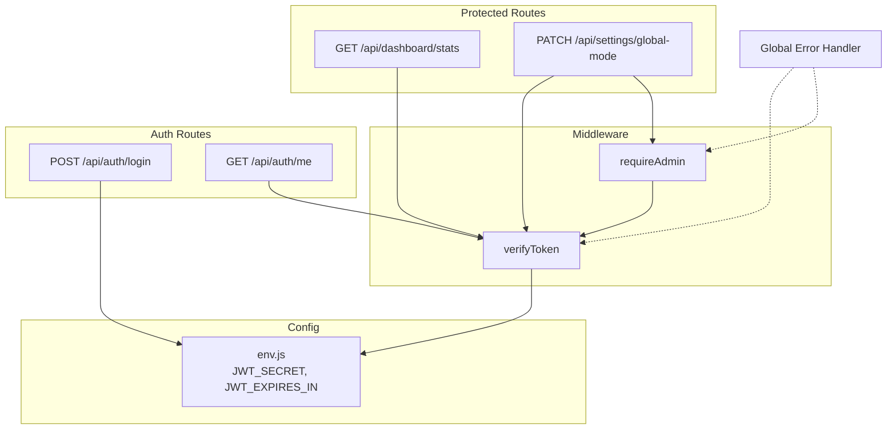
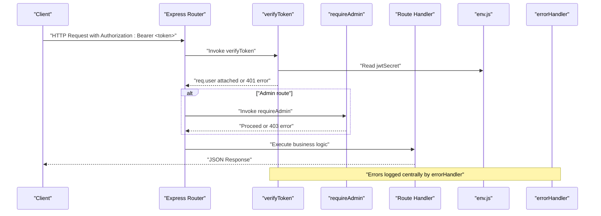
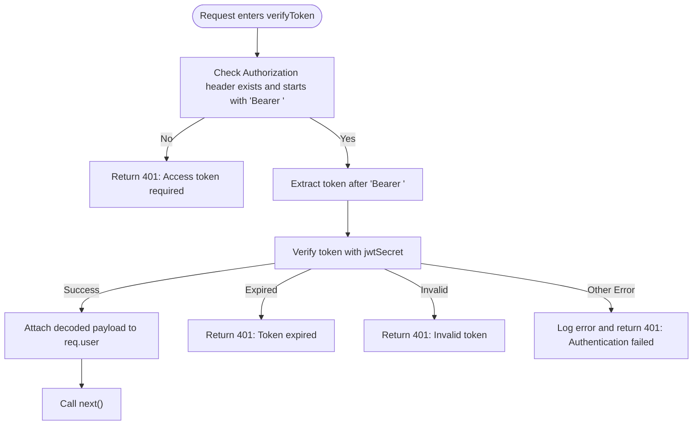
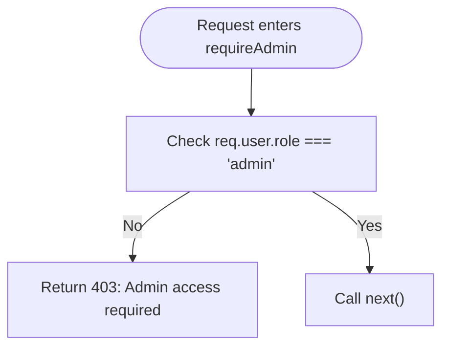
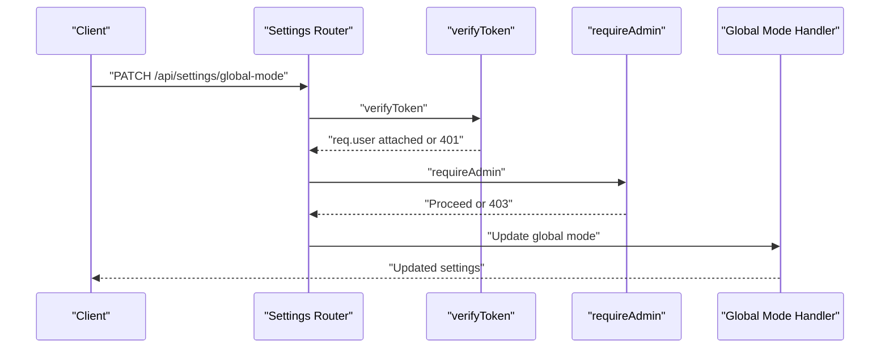
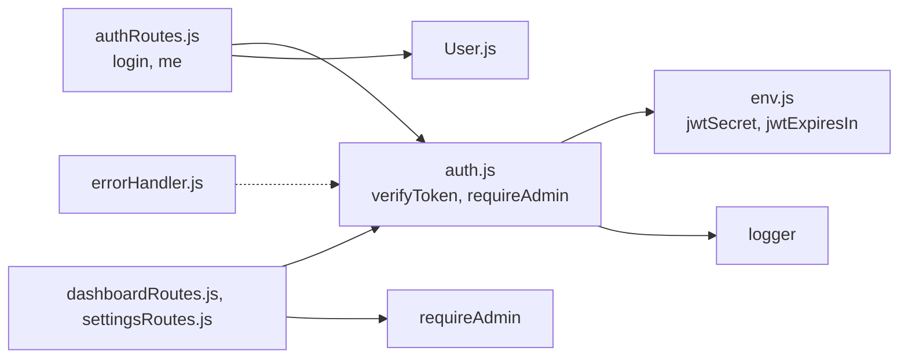

# Authentication Middleware

<cite>
**Referenced Files in This Document**
- [auth.js](file://backend/src/middleware/auth.js)
- [env.js](file://backend/src/config/env.js)
- [errorHandler.js](file://backend/src/middleware/errorHandler.js)
- [authRoutes.js](file://backend/src/routes/authRoutes.js)
- [User.js](file://backend/src/models/User.js)
- [dashboardRoutes.js](file://backend/src/routes/dashboardRoutes.js)
- [settingsRoutes.js](file://backend/src/routes/settingsRoutes.js)
</cite>

## Table of Contents
1. [Introduction](#introduction)
2. [Project Structure](#project-structure)
3. [Core Components](#core-components)
4. [Architecture Overview](#architecture-overview)
5. [Detailed Component Analysis](#detailed-component-analysis)
6. [Dependency Analysis](#dependency-analysis)
7. [Performance Considerations](#performance-considerations)
8. [Troubleshooting Guide](#troubleshooting-guide)
9. [Conclusion](#conclusion)
10. [Appendices](#appendices)

## Introduction
This document explains the authentication middleware system used across the backend API. It covers how JWT tokens are verified, how Bearer tokens are extracted from requests, and how user roles are validated for admin-only routes. It also details error handling for expired or invalid tokens, shows examples of middleware usage in routes, and outlines security best practices including token structure and expiration configuration.

## Project Structure
The authentication-related code is organized into:
- Middleware layer for request validation and authorization
- Configuration module for environment variables (including JWT secret and expiration)
- Auth routes for login/logout and retrieving current user info
- Example protected routes demonstrating middleware usage
- Global error handler for consistent error responses

**Diagram sources**
- [auth.js:10-62](file://backend/src/middleware/auth.js#L10-L62)
- [env.js:56-59](file://backend/src/config/env.js#L56-L59)
- [authRoutes.js:22-93](file://backend/src/routes/authRoutes.js#L22-L93)
- [authRoutes.js:110-135](file://backend/src/routes/authRoutes.js#L110-L135)
- [dashboardRoutes.js:13](file://backend/src/routes/dashboardRoutes.js#L13)
- [settingsRoutes.js:42](file://backend/src/routes/settingsRoutes.js#L42)
- [errorHandler.js:9-33](file://backend/src/middleware/errorHandler.js#L9-L33)

**Section sources**
- [auth.js:1-68](file://backend/src/middleware/auth.js#L1-L68)
- [env.js:1-95](file://backend/src/config/env.js#L1-L95)
- [authRoutes.js:1-138](file://backend/src/routes/authRoutes.js#L1-L138)
- [dashboardRoutes.js:1-71](file://backend/src/routes/dashboardRoutes.js#L1-L71)
- [settingsRoutes.js:1-143](file://backend/src/routes/settingsRoutes.js#L1-L143)
- [errorHandler.js:1-36](file://backend/src/middleware/errorHandler.js#L1-L36)

## Core Components
- verifyToken: Extracts and validates the Bearer token, attaches decoded payload to req.user, and returns standardized 401 errors for missing, malformed, invalid, or expired tokens.
- requireAdmin: Ensures the authenticated user has an admin role; otherwise returns a 403 response.
- Environment configuration: Provides JWT_SECRET and JWT_EXPIRES_IN used for signing and verifying tokens.
- Auth routes: Issue JWT on successful login and protect the “me” endpoint with verifyToken.
- Protected routes: Demonstrate middleware usage for both general protection and admin-only operations.
- Global error handler: Centralizes error logging and consistent JSON error responses.

Key responsibilities:
- Token extraction from Authorization header
- Signature verification using configured secret
- Expiration checks via library-provided errors
- Role-based access control for admin endpoints
- Consistent error shapes for clients

**Section sources**
- [auth.js:10-62](file://backend/src/middleware/auth.js#L10-L62)
- [env.js:56-59](file://backend/src/config/env.js#L56-L59)
- [authRoutes.js:22-93](file://backend/src/routes/authRoutes.js#L22-L93)
- [authRoutes.js:110-135](file://backend/src/routes/authRoutes.js#L110-L135)
- [dashboardRoutes.js:13](file://backend/src/routes/dashboardRoutes.js#L13)
- [settingsRoutes.js:42](file://backend/src/routes/settingsRoutes.js#L42)
- [errorHandler.js:9-33](file://backend/src/middleware/errorHandler.js#L9-L33)

## Architecture Overview
The authentication flow integrates Express middleware with JWT libraries and environment configuration. Tokens are issued at login and verified on subsequent requests. Admin-only routes add an additional role check.

**Diagram sources**
- [auth.js:10-62](file://backend/src/middleware/auth.js#L10-L62)
- [env.js:56-59](file://backend/src/config/env.js#L56-L59)
- [errorHandler.js:9-33](file://backend/src/middleware/errorHandler.js#L9-L33)

## Detailed Component Analysis

### verifyToken Implementation
Responsibilities:
- Extract Authorization header and validate presence and format
- Remove Bearer prefix and decode token
- Verify signature and expiration using configured secret
- Attach decoded payload to req.user
- Return specific 401 messages for different failure modes

Error handling:
- Missing or malformed Authorization header: 401 with message indicating token requirement
- Expired token: 401 with explicit “Token expired” message
- Invalid token (signature mismatch, malformed): 401 with “Invalid token” message
- Unexpected errors: 401 with generic “Authentication failed” and server-side logging

**Diagram sources**
- [auth.js:10-47](file://backend/src/middleware/auth.js#L10-L47)

**Section sources**
- [auth.js:10-47](file://backend/src/middleware/auth.js#L10-L47)

### requireAdmin Implementation
Responsibilities:
- Ensure req.user.role equals admin
- Allow non-admin users to proceed if not checking admin role
- Return 403 with a clear message when role is insufficient

Usage pattern:
- Applied after verifyToken to ensure req.user is present
- Typically chained on sensitive administrative endpoints

**Diagram sources**
- [auth.js:53-62](file://backend/src/middleware/auth.js#L53-L62)

**Section sources**
- [auth.js:53-62](file://backend/src/middleware/auth.js#L53-L62)

### Token Issuance and Structure
Issuance:
- Successful login verifies credentials and issues a JWT signed with jwtSecret
- Payload includes minimal identity fields: id, email, role
- Expiration is configurable via JWT_EXPIRES_IN; can be extended for “remember me” flows

Structure:
- Header: algorithm and type
- Payload: id, email, role
- Signature: HMAC using jwtSecret

Expiration handling:
- Server enforces expiration during verification
- Clients should handle 401 “Token expired” by prompting re-authentication or refreshing tokens

Security considerations:
- Do not include sensitive data in the token payload
- Keep jwtSecret secure and rotate periodically
- Use HTTPS to protect tokens in transit

**Section sources**
- [authRoutes.js:65-75](file://backend/src/routes/authRoutes.js#L65-L75)
- [env.js:56-59](file://backend/src/config/env.js#L56-L59)

### User Model Integration
- The User model stores hashed passwords and exposes comparePassword for credential checks
- Roles are constrained to admin and staff
- Active status controls whether a user can log in

Integration points:
- Login route uses User.findOne and comparePassword before issuing a token
- Protected routes rely on req.user populated by verifyToken

**Section sources**
- [User.js:1-63](file://backend/src/models/User.js#L1-L63)
- [authRoutes.js:35-59](file://backend/src/routes/authRoutes.js#L35-L59)

### Middleware Usage Examples in Routes
General protection:
- GET /api/auth/me uses verifyToken to retrieve current user info
- GET /api/dashboard/stats uses verifyToken to protect dashboard statistics
- Various chat and booking endpoints use verifyToken to restrict access

Admin-only protection:
- PATCH /api/settings/global-mode chains verifyToken and requireAdmin
- Other settings endpoints similarly chain both middlewares

**Diagram sources**
- [settingsRoutes.js:42](file://backend/src/routes/settingsRoutes.js#L42)
- [auth.js:10-62](file://backend/src/middleware/auth.js#L10-L62)

**Section sources**
- [authRoutes.js:110-135](file://backend/src/routes/authRoutes.js#L110-L135)
- [dashboardRoutes.js:13](file://backend/src/routes/dashboardRoutes.js#L13)
- [settingsRoutes.js:42](file://backend/src/routes/settingsRoutes.js#L42)

### Custom Error Responses
Consistent shape:
- All auth-related failures return a JSON object with success: false and a descriptive message
- Status codes:
  - 401 for missing/invalid/expired tokens
  - 403 for insufficient role (non-admin accessing admin routes)
  - 400 for client input validation errors in login and other endpoints

Centralized error handling:
- Global error handler logs errors and returns consistent JSON responses
- Stack traces are included only in development environments

**Section sources**
- [auth.js:14-46](file://backend/src/middleware/auth.js#L14-L46)
- [auth.js:54-59](file://backend/src/middleware/auth.js#L54-L59)
- [errorHandler.js:9-33](file://backend/src/middleware/errorHandler.js#L9-L33)

## Dependency Analysis
- verifyToken depends on:
  - jsonwebtoken library for token verification
  - env.js for jwtSecret
  - logger for error logging
- requireAdmin depends on verifyToken being executed first so that req.user is available
- Auth routes depend on:
  - User model for credential verification
  - env.js for jwtSecret and jwtExpiresIn
  - verifyToken for protecting endpoints
- Protected routes depend on verifyToken and optionally requireAdmin

**Diagram sources**
- [auth.js:1-68](file://backend/src/middleware/auth.js#L1-L68)
- [env.js:56-59](file://backend/src/config/env.js#L56-L59)
- [authRoutes.js:1-138](file://backend/src/routes/authRoutes.js#L1-L138)
- [User.js:1-63](file://backend/src/models/User.js#L1-L63)
- [dashboardRoutes.js:1-71](file://backend/src/routes/dashboardRoutes.js#L1-L71)
- [settingsRoutes.js:1-143](file://backend/src/routes/settingsRoutes.js#L1-L143)
- [errorHandler.js:1-36](file://backend/src/middleware/errorHandler.js#L1-L36)

**Section sources**
- [auth.js:1-68](file://backend/src/middleware/auth.js#L1-L68)
- [env.js:1-95](file://backend/src/config/env.js#L1-L95)
- [authRoutes.js:1-138](file://backend/src/routes/authRoutes.js#L1-L138)
- [User.js:1-63](file://backend/src/models/User.js#L1-L63)
- [dashboardRoutes.js:1-71](file://backend/src/routes/dashboardRoutes.js#L1-L71)
- [settingsRoutes.js:1-143](file://backend/src/routes/settingsRoutes.js#L1-L143)
- [errorHandler.js:1-36](file://backend/src/middleware/errorHandler.js#L1-L36)

## Performance Considerations
- Token verification is lightweight but should be placed early in middleware chains to fail fast
- Avoid storing large payloads in JWTs; keep only necessary identifiers and roles
- Use appropriate expiration times based on security requirements and user experience
- Centralize error logging to reduce overhead in handlers

[No sources needed since this section provides general guidance]

## Troubleshooting Guide
Common issues and resolutions:
- Missing Authorization header:
  - Ensure clients send Authorization: Bearer <token>
  - Expected response: 401 with message indicating token requirement
- Malformed token:
  - Validate token format and encoding
  - Expected response: 401 with “Invalid token”
- Expired token:
  - Refresh or re-authenticate
  - Expected response: 401 with “Token expired”
- Non-admin accessing admin routes:
  - Confirm user role is admin
  - Expected response: 403 with “Admin access required”
- Unexpected server errors:
  - Check centralized logs via errorHandler
  - Review stack traces in development

Operational tips:
- Verify JWT_SECRET is set correctly in environment configuration
- Ensure JWT_EXPIRES_IN matches expected token lifetime
- Inspect req.user in protected handlers to confirm payload contents

**Section sources**
- [auth.js:14-46](file://backend/src/middleware/auth.js#L14-L46)
- [auth.js:54-59](file://backend/src/middleware/auth.js#L54-L59)
- [errorHandler.js:9-33](file://backend/src/middleware/errorHandler.js#L9-L33)
- [env.js:56-59](file://backend/src/config/env.js#L56-L59)

## Conclusion
The authentication middleware provides robust JWT-based protection with clear error semantics and role-based access control. By centralizing token verification and admin checks, it ensures consistent security across all protected endpoints. Proper configuration of JWT secrets and expiration, combined with disciplined client behavior, yields a secure and maintainable authentication system.

[No sources needed since this section summarizes without analyzing specific files]

## Appendices

### Security Best Practices
- Store JWT_SECRET securely and rotate regularly
- Enforce HTTPS to protect tokens in transit
- Limit token payload to essential fields
- Implement token refresh strategies for long-lived sessions
- Monitor and alert on repeated 401/403 responses
- Apply rate limiting to login endpoints to mitigate brute-force attacks

[No sources needed since this section provides general guidance]