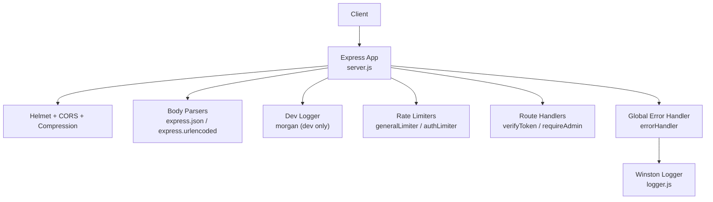
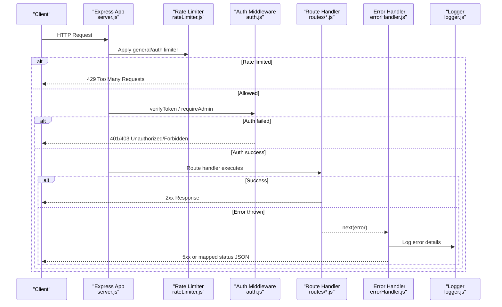
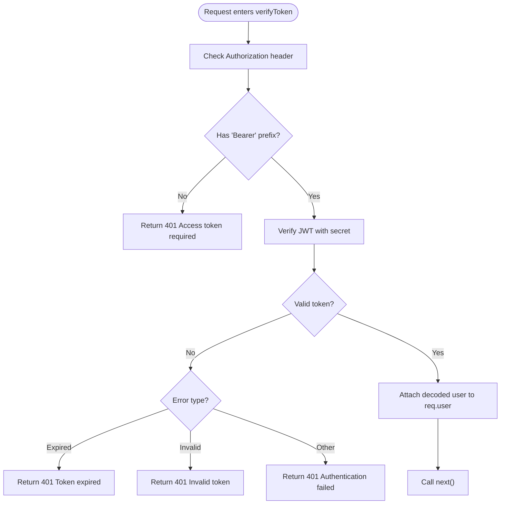
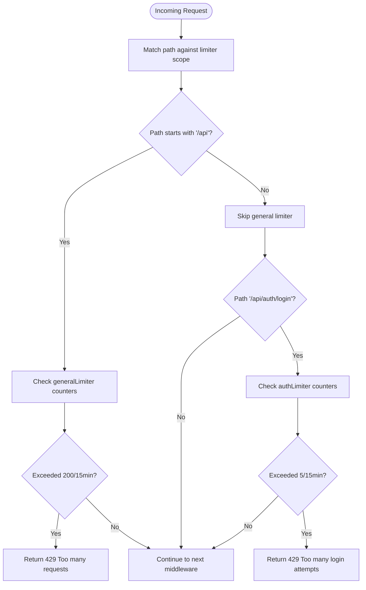
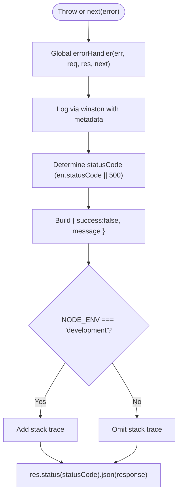
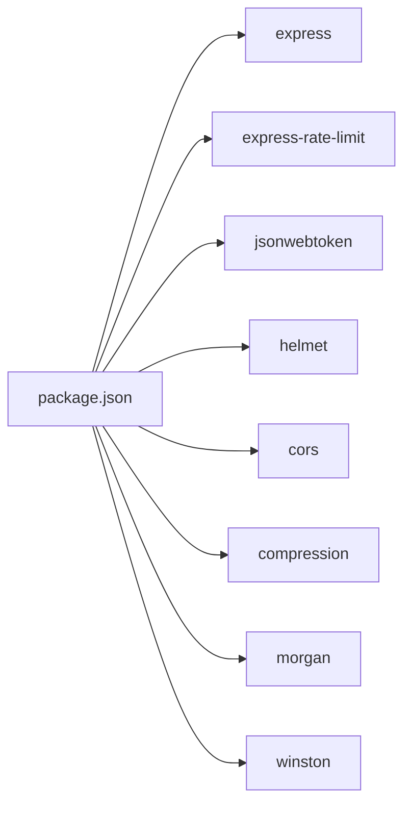

# Middleware Pipeline

<cite>
**Referenced Files in This Document**
- [server.js](file://backend/src/server.js)
- [auth.js](file://backend/src/middleware/auth.js)
- [errorHandler.js](file://backend/src/middleware/errorHandler.js)
- [rateLimiter.js](file://backend/src/middleware/rateLimiter.js)
- [logger.js](file://backend/src/config/logger.js)
- [env.js](file://backend/src/config/env.js)
- [authRoutes.js](file://backend/src/routes/authRoutes.js)
- [chatRoutes.js](file://backend/src/routes/chatRoutes.js)
- [dashboardRoutes.js](file://backend/src/routes/dashboardRoutes.js)
- [settingsRoutes.js](file://backend/src/routes/settingsRoutes.js)
- [package.json](file://backend/package.json)
</cite>

## Table of Contents
1. [Introduction](#introduction)
2. [Project Structure](#project-structure)
3. [Core Components](#core-components)
4. [Architecture Overview](#architecture-overview)
5. [Detailed Component Analysis](#detailed-component-analysis)
6. [Dependency Analysis](#dependency-analysis)
7. [Performance Considerations](#performance-considerations)
8. [Troubleshooting Guide](#troubleshooting-guide)
9. [Conclusion](#conclusion)
10. [Appendices](#appendices)

## Introduction
This document explains the Express.js middleware pipeline for Nandibaag Bot’s backend. It covers authentication, error handling, and rate limiting; details custom middleware patterns; shows how requests and responses are modified; and outlines error propagation strategies. It also documents logging integration, rate limiting behavior, and provides guidance for creating new middleware and debugging execution order.

## Project Structure
The middleware stack is configured at application bootstrap and applied globally or per-route:
- Global security and parsing: Helmet, CORS, compression, JSON/URL body parsers, optional dev request logger (Morgan).
- Rate limiting: General API limiter and stricter login limiter.
- Authentication: JWT verification and admin role checks attached to routes.
- Error handling: Centralized error handler as the last middleware.

**Diagram sources**
- [server.js:34-100](file://backend/src/server.js#L34-L100)
- [rateLimiter.js:1-37](file://backend/src/middleware/rateLimiter.js#L1-L37)
- [auth.js:1-68](file://backend/src/middleware/auth.js#L1-L68)
- [errorHandler.js:1-36](file://backend/src/middleware/errorHandler.js#L1-L36)
- [logger.js:1-52](file://backend/src/config/logger.js#L1-L52)

**Section sources**
- [server.js:34-100](file://backend/src/server.js#L34-L100)
- [package.json:23-42](file://backend/package.json#L23-L42)

## Core Components
- Authentication middleware:
  - Verifies JWT from Authorization header and attaches decoded user to req.user.
  - Role-based guard for admin-only endpoints.
- Rate limiting:
  - General API limiter with a generous window and max.
  - Stricter login limiter to mitigate brute force.
- Error handling:
  - Centralized handler that logs errors via Winston and returns consistent JSON.
  - Exposes stack traces only in development.
- Logging:
  - Winston transports for console (development) and file outputs (error and combined logs).

Key behaviors:
- Auth failure returns 401 with clear messages for missing token, invalid token, and expired token.
- Admin-only access returns 403 when role is not admin.
- Rate limit exceeded returns 429 with standard headers enabled.
- Unhandled exceptions bubble to the global error handler.

**Section sources**
- [auth.js:1-68](file://backend/src/middleware/auth.js#L1-L68)
- [rateLimiter.js:1-37](file://backend/src/middleware/rateLimiter.js#L1-L37)
- [errorHandler.js:1-36](file://backend/src/middleware/errorHandler.js#L1-L36)
- [logger.js:1-52](file://backend/src/config/logger.js#L1-L52)

## Architecture Overview
The request lifecycle flows through the middleware stack in a deterministic order. The following sequence diagram maps a protected route call end-to-end, including rate limiting, authentication, business logic, and centralized error handling.

**Diagram sources**
- [server.js:58-100](file://backend/src/server.js#L58-L100)
- [rateLimiter.js:1-37](file://backend/src/middleware/rateLimiter.js#L1-L37)
- [auth.js:1-68](file://backend/src/middleware/auth.js#L1-L68)
- [errorHandler.js:1-36](file://backend/src/middleware/errorHandler.js#L1-L36)
- [logger.js:1-52](file://backend/src/config/logger.js#L1-L52)

## Detailed Component Analysis

### Authentication Middleware
Responsibilities:
- Extracts and validates JWT from Authorization header.
- Attaches decoded payload to req.user.
- Enforces admin role where required.

Patterns:
- Early return on malformed or missing tokens.
- Specific handling for TokenExpiredError and JsonWebTokenError.
- Non-sensitive error message for unexpected failures.

Integration points:
- Applied per-route using router-level middleware composition.

**Diagram sources**
- [auth.js:10-47](file://backend/src/middleware/auth.js#L10-L47)

Usage examples:
- Protected read endpoint: GET /api/chats uses verifyToken.
- Admin-only update: PATCH /api/settings/global-mode uses verifyToken then requireAdmin.

**Section sources**
- [auth.js:1-68](file://backend/src/middleware/auth.js#L1-L68)
- [chatRoutes.js:14-50](file://backend/src/routes/chatRoutes.js#L14-L50)
- [settingsRoutes.js:42-80](file://backend/src/routes/settingsRoutes.js#L42-L80)

### Rate Limiting
Algorithms and configuration:
- Uses a sliding-window counter per IP with two presets:
  - General API: 200 requests per 15 minutes.
  - Login: 5 attempts per 15 minutes.
- Enables standard response headers for client visibility.

Behavior:
- Returns a consistent JSON error shape on exceedance.
- Applied globally under /api and specifically under /api/auth/login.

**Diagram sources**
- [rateLimiter.js:1-37](file://backend/src/middleware/rateLimiter.js#L1-L37)
- [server.js:58-61](file://backend/src/server.js#L58-L61)

**Section sources**
- [rateLimiter.js:1-37](file://backend/src/middleware/rateLimiter.js#L1-L37)
- [server.js:58-61](file://backend/src/server.js#L58-L61)

### Error Handling and Propagation
Strategy:
- Route handlers use try/catch and forward errors via next(error).
- Global error handler logs structured error data and responds with a uniform JSON envelope.
- Stack traces are included only in development.

Response shape:
- success: boolean
- message: string
- stack: string (development only)

**Diagram sources**
- [errorHandler.js:9-33](file://backend/src/middleware/errorHandler.js#L9-L33)
- [logger.js:1-52](file://backend/src/config/logger.js#L1-L52)

Propagation examples:
- Auth route: POST /api/auth/login forwards DB or validation errors to the global handler.
- Chat routes: Any async error bubbles up to errorHandler.

**Section sources**
- [errorHandler.js:1-36](file://backend/src/middleware/errorHandler.js#L1-L36)
- [authRoutes.js:22-93](file://backend/src/routes/authRoutes.js#L22-L93)
- [chatRoutes.js:14-50](file://backend/src/routes/chatRoutes.js#L14-L50)

### Logging Integration
- Winston logger writes:
  - Console output in development with timestamps and levels.
  - File outputs for error and combined logs with JSON formatting.
- Environment-aware log level selection.

Integration points:
- Used by errorHandler to persist runtime errors.
- Used by routes and services for operational insights.

**Section sources**
- [logger.js:1-52](file://backend/src/config/logger.js#L1-L52)
- [errorHandler.js:1-36](file://backend/src/middleware/errorHandler.js#L1-L36)

### Request/Response Modification Patterns
- Request augmentation:
  - Authentication middleware attaches decoded user to req.user for downstream handlers.
- Response shaping:
  - All successful responses follow a consistent envelope with success flag and payload.
  - Errors are normalized by the global handler.

Examples:
- GET /api/auth/me reads req.user.id after verification.
- GET /api/dashboard/stats aggregates metrics and returns a unified response.

**Section sources**
- [auth.js:22-26](file://backend/src/middleware/auth.js#L22-L26)
- [authRoutes.js:110-135](file://backend/src/routes/authRoutes.js#L110-L135)
- [dashboardRoutes.js:13-68](file://backend/src/routes/dashboardRoutes.js#L13-L68)

### Custom Middleware Implementation Patterns
Recommended pattern:
- Create a function(req, res, next) that performs cross-cutting concerns.
- Use early returns for error cases and always call next() on success.
- Keep side effects minimal; prefer attaching context to req/res.

Guidelines:
- For input validation, consider Joi schemas similar to login route.
- For feature toggles or environment-specific behavior, consult env configuration.

**Section sources**
- [authRoutes.js:12-31](file://backend/src/routes/authRoutes.js#L12-L31)
- [env.js:1-95](file://backend/src/config/env.js#L1-L95)

## Dependency Analysis
External dependencies relevant to the middleware pipeline:
- express-rate-limit: Sliding window rate limiting.
- jsonwebtoken: JWT signing and verification.
- helmet, cors, compression: Security and performance hardening.
- morgan: Development request logging.
- winston: Structured logging.

**Diagram sources**
- [package.json:23-42](file://backend/package.json#L23-L42)

**Section sources**
- [package.json:23-42](file://backend/package.json#L23-L42)

## Performance Considerations
- Rate limiting protects against abuse and reduces load spikes.
- Compression reduces payload sizes for all responses.
- Morgan is disabled in production to avoid overhead.
- Avoid heavy work in global middleware; keep it fast and stateless.

[No sources needed since this section provides general guidance]

## Troubleshooting Guide
Common issues and diagnostics:
- 401 Unauthorized:
  - Missing or malformed Authorization header.
  - Expired or invalid JWT.
  - Check verifyToken flow and jwtSecret configuration.
- 403 Forbidden:
  - User lacks admin role for admin-only routes.
- 429 Too Many Requests:
  - Hit general or login rate limits; check windowMs and max values.
- 500 Internal Server Error:
  - Errors logged via Winston; inspect error.log and combined.log.
  - In development, stack traces are included in the response.

Debugging tips:
- Enable Morgan in development to see request/response timing and paths.
- Inspect Winston files for detailed error context.
- Validate environment variables (e.g., JWT_SECRET, NODE_ENV) using the env schema.

**Section sources**
- [auth.js:10-47](file://backend/src/middleware/auth.js#L10-L47)
- [rateLimiter.js:1-37](file://backend/src/middleware/rateLimiter.js#L1-L37)
- [errorHandler.js:9-33](file://backend/src/middleware/errorHandler.js#L9-L33)
- [logger.js:1-52](file://backend/src/config/logger.js#L1-L52)
- [env.js:1-95](file://backend/src/config/env.js#L1-L95)

## Conclusion
Nandibaag Bot’s middleware pipeline follows a clean, layered approach: secure and parse requests early, enforce rate limits, authenticate and authorize per-route, and centralize error handling with structured logging. This design ensures predictable behavior, robust protection, and maintainability. New middleware should adhere to the established patterns and integrate with the existing logging and error-handling infrastructure.

[No sources needed since this section summarizes without analyzing specific files]

## Appendices

### Creating New Middleware
Steps:
- Implement a function(req, res, next) with clear responsibilities.
- Perform validation or checks; return early with appropriate status codes on failure.
- Attach any necessary context to req or res.
- Call next() to continue the pipeline.
- If applicable, add route-level usage in the corresponding router file.

Example references:
- Input validation pattern similar to login route.
- Role-based guard pattern similar to requireAdmin.

**Section sources**
- [authRoutes.js:12-31](file://backend/src/routes/authRoutes.js#L12-L31)
- [auth.js:53-62](file://backend/src/middleware/auth.js#L53-L62)

### Debugging Middleware Execution Order
- Confirm global middleware registration order in server startup.
- Ensure route-level middleware is composed before the route handler.
- Use development request logs to trace the path and timing.
- Verify that the global error handler is registered last.

**Section sources**
- [server.js:34-100](file://backend/src/server.js#L34-L100)