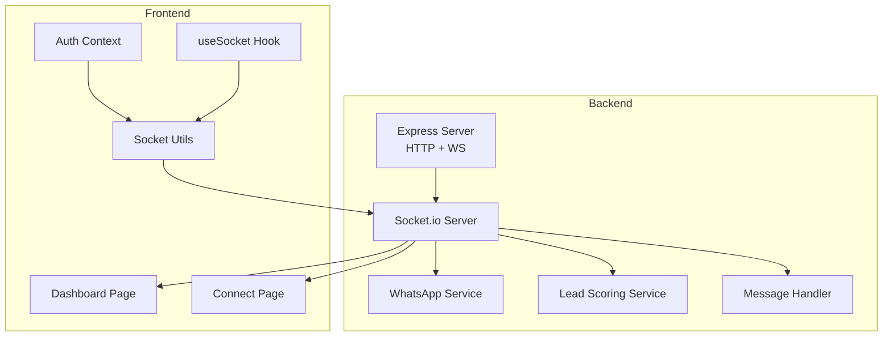
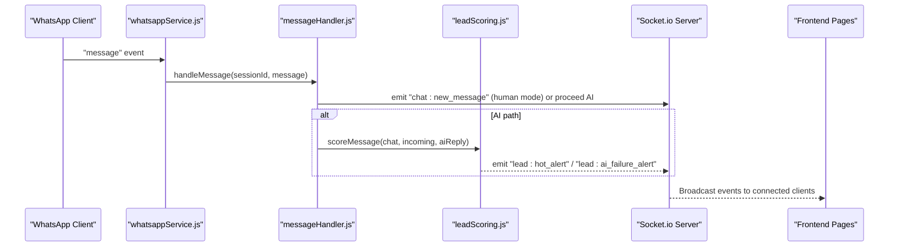
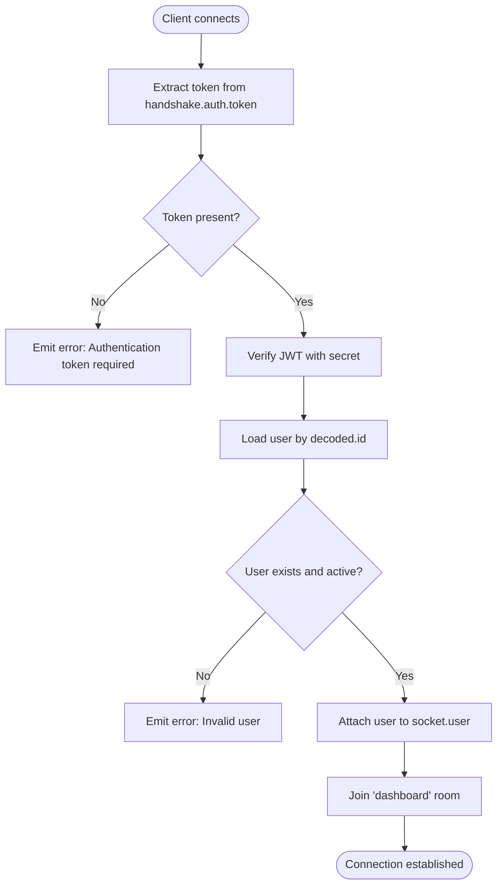
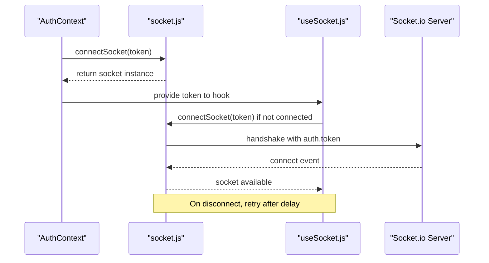
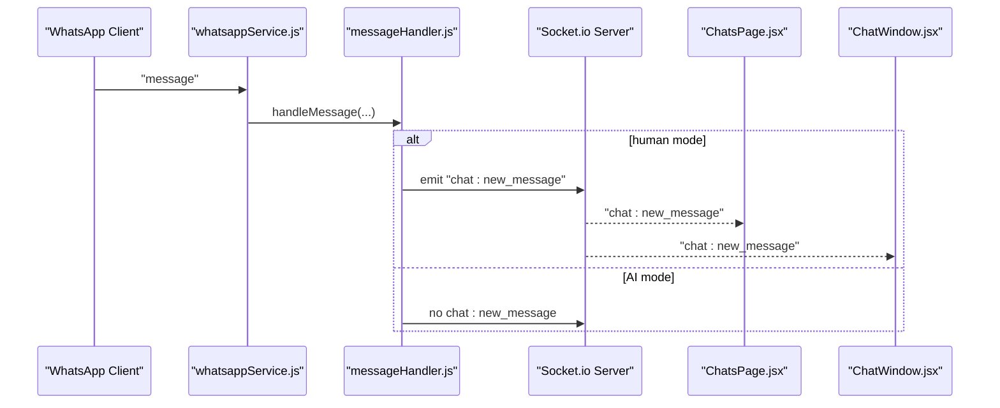
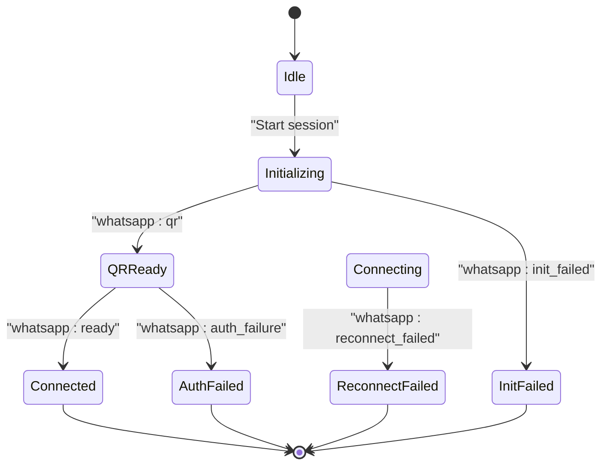
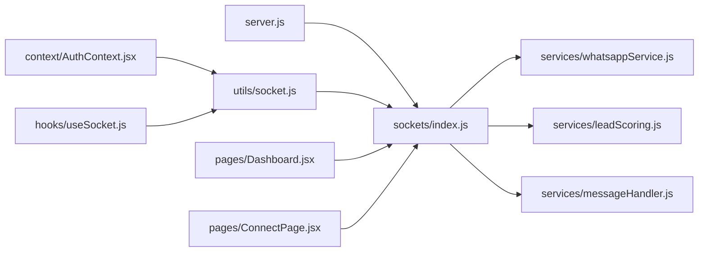

# Real-time Communication

<cite>
**Referenced Files in This Document**
- [server.js](file://backend/src/server.js)
- [index.js](file://backend/src/sockets/index.js)
- [whatsappService.js](file://backend/src/services/whatsappService.js)
- [leadScoring.js](file://backend/src/services/leadScoring.js)
- [messageHandler.js](file://backend/src/services/messageHandler.js)
- [useSocket.js](file://frontend/src/hooks/useSocket.js)
- [socket.js](file://frontend/src/utils/socket.js)
- [AuthContext.jsx](file://frontend/src/context/AuthContext.jsx)
- [Dashboard.jsx](file://frontend/src/pages/Dashboard.jsx)
- [ConnectPage.jsx](file://frontend/src/pages/ConnectPage.jsx)
</cite>

## Table of Contents
1. [Introduction](#introduction)
2. [Project Structure](#project-structure)
3. [Core Components](#core-components)
4. [Architecture Overview](#architecture-overview)
5. [Detailed Component Analysis](#detailed-component-analysis)
6. [Dependency Analysis](#dependency-analysis)
7. [Performance Considerations](#performance-considerations)
8. [Troubleshooting Guide](#troubleshooting-guide)
9. [Conclusion](#conclusion)

## Introduction
This document explains the real-time communication layer for Nandibaag Bot, focusing on Socket.io server setup, authentication middleware, event broadcasting, room-based messaging, and client-side connection management. It covers how the backend initializes WebSocket support, authenticates connections via JWT, emits events for WhatsApp session lifecycle and lead scoring alerts, and how the frontend connects, reconnects, and listens to live updates for dashboard and chat synchronization.

## Project Structure
The real-time system spans both backend and frontend:
- Backend: Express HTTP server with Socket.io initialized on the same process; services emit events through a shared Socket.io instance.
- Frontend: React app manages a singleton socket connection, reconnection logic, and UI updates based on emitted events.

**Diagram sources**
- [server.js:102-108](file://backend/src/server.js#L102-L108)
- [index.js:18-63](file://backend/src/sockets/index.js#L18-L63)
- [whatsappService.js:15-17](file://backend/src/services/whatsappService.js#L15-L17)
- [leadScoring.js:11-13](file://backend/src/services/leadScoring.js#L11-L13)
- [AuthContext.jsx:21-36](file://frontend/src/context/AuthContext.jsx#L21-L36)
- [useSocket.js:13-46](file://frontend/src/hooks/useSocket.js#L13-L46)
- [socket.js:13-44](file://frontend/src/utils/socket.js#L13-L44)
- [Dashboard.jsx:82-176](file://frontend/src/pages/Dashboard.jsx#L82-L176)
- [ConnectPage.jsx:112-182](file://frontend/src/pages/ConnectPage.jsx#L112-L182)

**Section sources**
- [server.js:102-108](file://backend/src/server.js#L102-L108)
- [index.js:18-63](file://backend/src/sockets/index.js#L18-L63)
- [AuthContext.jsx:21-36](file://frontend/src/context/AuthContext.jsx#L21-L36)
- [useSocket.js:13-46](file://frontend/src/hooks/useSocket.js#L13-L46)
- [socket.js:13-44](file://frontend/src/utils/socket.js#L13-L44)

## Core Components
- Socket.io initialization and auth middleware: The server creates a Socket.io instance, applies JWT-based authentication, attaches user info to sockets, and joins authenticated users to a shared room for broadcast-style updates.
- Services emitting events: WhatsApp service emits session lifecycle events (QR, ready, disconnect, pairing code). Lead scoring emits hot lead and AI failure alerts. Message handler emits new message notifications when human mode is active.
- Client connection management: A singleton socket client is created with JWT in handshake options, fallback transports, and reconnection settings. A custom hook coordinates connection lifecycle and auto-reconnect behavior.
- Dashboard and Connect pages: Subscribe to relevant events to update UI state, show alerts, and manage WhatsApp session flows.

**Section sources**
- [index.js:18-63](file://backend/src/sockets/index.js#L18-L63)
- [whatsappService.js:152-256](file://backend/src/services/whatsappService.js#L152-L256)
- [leadScoring.js:171-226](file://backend/src/services/leadScoring.js#L171-L226)
- [messageHandler.js:105-172](file://backend/src/services/messageHandler.js#L105-L172)
- [socket.js:13-44](file://frontend/src/utils/socket.js#L13-L44)
- [useSocket.js:13-46](file://frontend/src/hooks/useSocket.js#L13-L46)
- [Dashboard.jsx:82-176](file://frontend/src/pages/Dashboard.jsx#L82-L176)
- [ConnectPage.jsx:112-182](file://frontend/src/pages/ConnectPage.jsx#L112-L182)

## Architecture Overview
End-to-end flow from WhatsApp inbound message to dashboard alert and chat UI updates.

**Diagram sources**
- [whatsappService.js:258-290](file://backend/src/services/whatsappService.js#L258-L290)
- [messageHandler.js:22-172](file://backend/src/services/messageHandler.js#L22-L172)
- [leadScoring.js:38-182](file://backend/src/services/leadScoring.js#L38-L182)
- [index.js:50-60](file://backend/src/sockets/index.js#L50-L60)
- [Dashboard.jsx:162-176](file://frontend/src/pages/Dashboard.jsx#L162-L176)

## Detailed Component Analysis

### Socket.io Server Setup and Authentication
- Initialization: The server instantiates Socket.io with CORS configured for the frontend URL.
- Authentication middleware: Validates JWT from handshake.auth.token, verifies signature, loads user by ID, checks active status, and attaches user to socket context. Errors are logged and rejected with descriptive messages.
- Room usage: Authenticated sockets join a shared room for global broadcasts. Disconnection logs are recorded.
- Accessor: getIO() provides a safe way for services to emit events without circular imports.

**Diagram sources**
- [index.js:27-48](file://backend/src/sockets/index.js#L27-L48)
- [index.js:50-60](file://backend/src/sockets/index.js#L50-L60)

**Section sources**
- [index.js:18-63](file://backend/src/sockets/index.js#L18-L63)
- [server.js:102-108](file://backend/src/server.js#L102-L108)

### Event Broadcasting and Room-Based Messaging
- Global broadcasts: Services call io.emit(...) to push events to all connected clients.
- Room-based targeting: Authenticated clients join the 'dashboard' room; targeted room emissions can be used to restrict updates to specific groups if needed.
- Current implementation uses global emits for WhatsApp lifecycle and lead scoring alerts.

Key events emitted by services:
- WhatsApp lifecycle: qr, ready, auth_failure, disconnected, reconnect_failed, init_failed, pairing_code, session_destroyed
- Lead scoring: hot_alert, ai_failure_alert, converted
- Chat updates: new_message (when human mode), mode_updated, bulk_mode_updated (consumed by frontend)

**Section sources**
- [whatsappService.js:152-256](file://backend/src/services/whatsappService.js#L152-L256)
- [leadScoring.js:171-226](file://backend/src/services/leadScoring.js#L171-L226)
- [messageHandler.js:110-124](file://backend/src/services/messageHandler.js#L110-L124)
- [index.js:50-60](file://backend/src/sockets/index.js#L50-L60)

### Client Connection Management and Reconnection Logic
- Singleton client: connectSocket(token) returns an existing connected socket or creates a new one with JWT in handshake.auth.token.
- Transports and reconnection: Uses websocket and polling fallbacks with exponential backoff configuration.
- Hook orchestration: useSocket ensures a socket exists while authenticated, handles disconnect events, and attempts reconnection after a short delay.
- Lifecycle: AuthContext connects on initial load if a token exists; disconnects on logout.

**Diagram sources**
- [AuthContext.jsx:27-36](file://frontend/src/context/AuthContext.jsx#L27-L36)
- [socket.js:13-44](file://frontend/src/utils/socket.js#L13-L44)
- [useSocket.js:17-43](file://frontend/src/hooks/useSocket.js#L17-L43)

**Section sources**
- [socket.js:13-44](file://frontend/src/utils/socket.js#L13-L44)
- [useSocket.js:13-46](file://frontend/src/hooks/useSocket.js#L13-L46)
- [AuthContext.jsx:21-36](file://frontend/src/context/AuthContext.jsx#L21-L36)

### Live Dashboard Updates
- Dashboard subscribes to:
  - lead:hot_alert
  - lead:ai_failure_alert
  - whatsapp:disconnected
  - whatsapp:reconnect_failed
  - settings:global_mode_changed
- Alerts are added to local state, displayed with icons and timestamps, and optionally trigger browser notifications.

**Section sources**
- [Dashboard.jsx:82-176](file://frontend/src/pages/Dashboard.jsx#L82-L176)

### Live Chat Synchronization
- Human mode path: When a chat is in human mode, messageHandler emits chat:new_message with chatId, customerPhone, and message text.
- Frontend consumers:
  - ChatsPage listens for chat:new_message and chats:bulk_mode_updated to refresh lists and highlight new items.
  - ChatWindow listens for chat:new_message and chat:mode_updated to append messages and reflect mode changes.

**Diagram sources**
- [messageHandler.js:105-124](file://backend/src/services/messageHandler.js#L105-L124)
- [ChatsPage.jsx:122-124](file://frontend/src/pages/ChatsPage.jsx#L122-L124)
- [ChatWindow.jsx:92-94](file://frontend/src/components/ChatWindow.jsx#L92-L94)

**Section sources**
- [messageHandler.js:105-124](file://backend/src/services/messageHandler.js#L105-L124)
- [ChatsPage.jsx:122-124](file://frontend/src/pages/ChatsPage.jsx#L122-L124)
- [ChatWindow.jsx:92-94](file://frontend/src/components/ChatWindow.jsx#L92-L94)

### WhatsApp Session Flow (QR and Pairing Code)
- QR flow:
  - Frontend requests session creation via API.
  - Backend initializes session and emits whatsapp:qr with sessionId and QR data URL.
  - Frontend renders QR and waits for whatsapp:ready or errors.
- Pairing code flow:
  - Frontend requests pairing code via API.
  - Backend emits whatsapp:pairing_code with sessionId and code.
  - Frontend displays code and continues until ready or failure.
- Error handling:
  - whatsapp:auth_failure, whatsapp:init_failed, whatsapp:reconnect_failed inform the UI to prompt retry or cleanup.

**Diagram sources**
- [ConnectPage.jsx:112-182](file://frontend/src/pages/ConnectPage.jsx#L112-L182)
- [whatsappService.js:152-256](file://backend/src/services/whatsappService.js#L152-L256)

**Section sources**
- [ConnectPage.jsx:112-182](file://frontend/src/pages/ConnectPage.jsx#L112-L182)
- [whatsappService.js:152-256](file://backend/src/services/whatsappService.js#L152-L256)

## Dependency Analysis
- Server bootstraps Socket.io and injects the instance into services that need to emit events.
- Services depend on models and external integrations (WhatsApp Web, AI service) but expose clean event-driven interfaces to the frontend.
- Frontend components depend on a small set of utilities and hooks to maintain a single socket connection and react to events.

**Diagram sources**
- [server.js:102-108](file://backend/src/server.js#L102-L108)
- [index.js:18-63](file://backend/src/sockets/index.js#L18-L63)
- [whatsappService.js:15-17](file://backend/src/services/whatsappService.js#L15-L17)
- [leadScoring.js:11-13](file://backend/src/services/leadScoring.js#L11-L13)
- [AuthContext.jsx:21-36](file://frontend/src/context/AuthContext.jsx#L21-L36)
- [useSocket.js:13-46](file://frontend/src/hooks/useSocket.js#L13-L46)
- [socket.js:13-44](file://frontend/src/utils/socket.js#L13-L44)
- [Dashboard.jsx:82-176](file://frontend/src/pages/Dashboard.jsx#L82-L176)
- [ConnectPage.jsx:112-182](file://frontend/src/pages/ConnectPage.jsx#L112-L182)

**Section sources**
- [server.js:102-108](file://backend/src/server.js#L102-L108)
- [index.js:18-63](file://backend/src/sockets/index.js#L18-L63)
- [AuthContext.jsx:21-36](file://frontend/src/context/AuthContext.jsx#L21-L36)
- [useSocket.js:13-46](file://frontend/src/hooks/useSocket.js#L13-L46)
- [socket.js:13-44](file://frontend/src/utils/socket.js#L13-L44)

## Performance Considerations
- Use transports: ['websocket', 'polling'] to ensure connectivity across restrictive networks.
- Configure reconnection with bounded attempts and delays to avoid thundering herds.
- Prefer global emits for low-volume alerts; consider rooms for high-frequency per-chat updates if scaling requires it.
- Avoid heavy payloads in frequent events; keep messages compact and include only necessary fields.
- Debounce UI updates where appropriate to prevent excessive re-renders.

[No sources needed since this section provides general guidance]

## Troubleshooting Guide
Common issues and resolutions:
- Authentication failures: Ensure the client sends a valid JWT in handshake.auth.token and that the server’s secret matches. Check logs for verification errors.
- No events received: Verify CORS allows the frontend origin and credentials. Confirm the client is connected and joined to the expected room.
- WhatsApp session instability: Monitor whatsapp:disconnected and whatsapp:reconnect_failed events. Use the Connect page’s retry flow to clean stale sessions and reinitialize.
- AI failures: Watch for lead:ai_failure_alert and handle gracefully by prompting staff intervention.

**Section sources**
- [index.js:27-48](file://backend/src/sockets/index.js#L27-L48)
- [whatsappService.js:212-256](file://backend/src/services/whatsappService.js#L212-L256)
- [leadScoring.js:192-202](file://backend/src/services/leadScoring.js#L192-L202)

## Conclusion
Nandibaag Bot’s real-time layer combines a secure, JWT-authenticated Socket.io server with event-driven services and a resilient frontend client. The design supports live dashboard updates, WhatsApp session management, and chat synchronization. With careful attention to reconnection, payload size, and room scoping, the system remains robust under varying network conditions and scales effectively for multi-session operations.