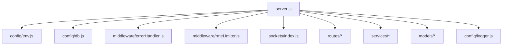
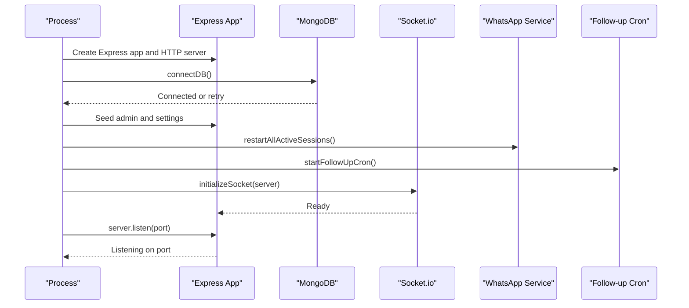
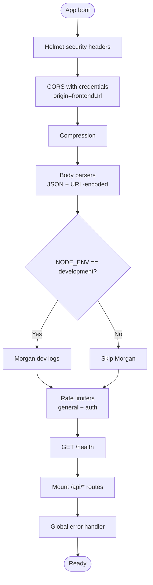
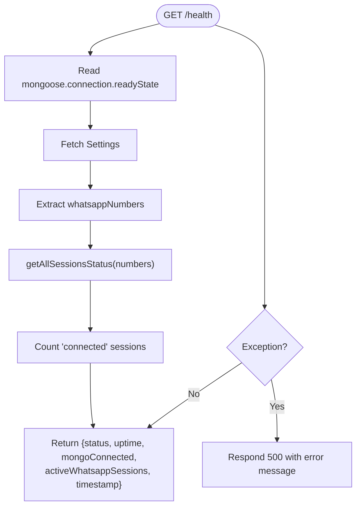
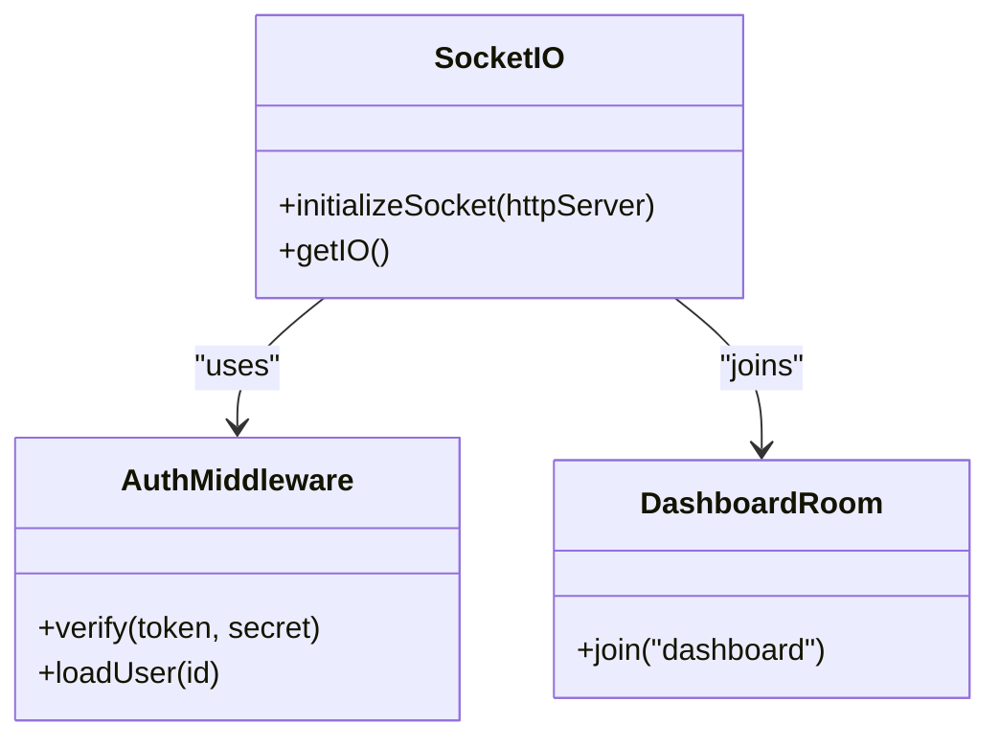
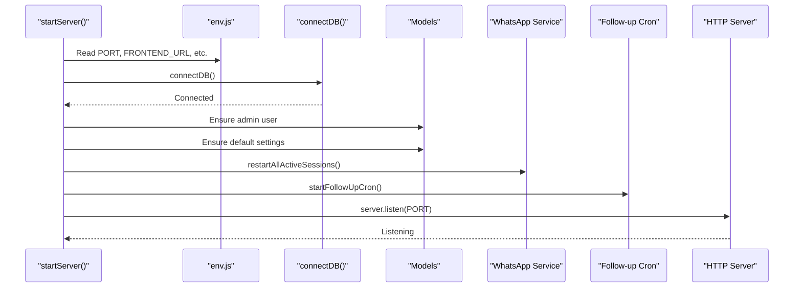
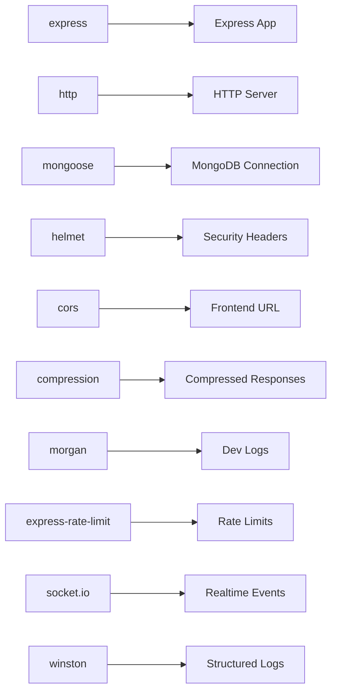

# Express Server Setup

<cite>
**Referenced Files in This Document**
- [server.js](file://backend/src/server.js)
- [db.js](file://backend/src/config/db.js)
- [env.js](file://backend/src/config/env.js)
- [errorHandler.js](file://backend/src/middleware/errorHandler.js)
- [index.js](file://backend/src/sockets/index.js)
- [rateLimiter.js](file://backend/src/middleware/rateLimiter.js)
- [logger.js](file://backend/src/config/logger.js)
</cite>

## Table of Contents
1. [Introduction](#introduction)
2. [Project Structure](#project-structure)
3. [Core Components](#core-components)
4. [Architecture Overview](#architecture-overview)
5. [Detailed Component Analysis](#detailed-component-analysis)
6. [Dependency Analysis](#dependency-analysis)
7. [Performance Considerations](#performance-considerations)
8. [Troubleshooting Guide](#troubleshooting-guide)
9. [Conclusion](#conclusion)

## Introduction
This document explains how the Nandibaag Bot backend initializes and configures its Express.js server. It covers the HTTP server creation, middleware stack (security headers, CORS, compression, body parsing, logging), health check endpoint behavior, route mounting patterns, global error handling placement, Socket.io integration, port management, startup sequence orchestration, and service initialization order. The goal is to provide a clear, code-mapped understanding for both developers and operators.

## Project Structure
The server entrypoint wires together configuration, database connectivity, security and performance middleware, routes, real-time communication via Socket.io, and process lifecycle management. Key files:
- Server bootstrap and orchestration: server.js
- Environment validation and exports: env.js
- Database connection with retries: db.js
- Global error handler: errorHandler.js
- Rate limiting middleware: rateLimiter.js
- Logging setup: logger.js
- Socket.io initialization and auth: sockets/index.js

**Diagram sources**
- [server.js:1-35](file://backend/src/server.js#L1-L35)
- [env.js:1-20](file://backend/src/config/env.js#L1-L20)
- [db.js:1-10](file://backend/src/config/db.js#L1-L10)
- [errorHandler.js:1-10](file://backend/src/middleware/errorHandler.js#L1-L10)
- [rateLimiter.js:1-10](file://backend/src/middleware/rateLimiter.js#L1-L10)
- [index.js:1-10](file://backend/src/sockets/index.js#L1-L10)

**Section sources**
- [server.js:1-35](file://backend/src/server.js#L1-L35)
- [env.js:1-20](file://backend/src/config/env.js#L1-L20)

## Core Components
- HTTP server creation and Express app instance
- Security and performance middleware stack
- Health check endpoint for MongoDB and WhatsApp sessions
- Route mounting under /api prefixes
- Global error handling middleware
- Socket.io initialization and service wiring
- Port management and startup orchestration
- Process-level error handlers and graceful shutdown

**Section sources**
- [server.js:34-108](file://backend/src/server.js#L34-L108)
- [server.js:110-174](file://backend/src/server.js#L110-L174)
- [server.js:176-241](file://backend/src/server.js#L176-L241)

## Architecture Overview
High-level flow from process start to a healthy HTTP + WebSocket server:
- Load and validate environment variables
- Connect to MongoDB with retry logic
- Initialize default admin user and settings if missing
- Restart active WhatsApp sessions based on stored numbers
- Start background cron jobs
- Attach middleware stack and routes
- Initialize Socket.io and wire it into services
- Listen on configured port with error handling
- Register process signals for graceful shutdown

**Diagram sources**
- [server.js:110-174](file://backend/src/server.js#L110-L174)
- [db.js:10-29](file://backend/src/config/db.js#L10-L29)
- [index.js:18-63](file://backend/src/sockets/index.js#L18-L63)

## Detailed Component Analysis

### Server Creation and Middleware Stack
- Creates an Express application and an underlying HTTP server.
- Applies middleware in this order:
  - Helmet for security headers
  - CORS with credentials enabled and origin set from frontendUrl
  - Compression for response payload reduction
  - Body parsers for JSON and URL-encoded payloads
  - Development-only Morgan request logging
  - Rate limiters for general API and login endpoints
- Mounts health check before authentication to allow unauthenticated probes.
- Mounts feature routes under /api prefixes.
- Registers global error handler last.

**Diagram sources**
- [server.js:34-100](file://backend/src/server.js#L34-L100)

**Section sources**
- [server.js:34-100](file://backend/src/server.js#L34-L100)
- [rateLimiter.js:1-37](file://backend/src/middleware/rateLimiter.js#L1-L37)
- [logger.js:1-52](file://backend/src/config/logger.js#L1-L52)

### Health Check Endpoint
- Returns status, uptime, MongoDB connection state, number of active WhatsApp sessions, and timestamp.
- Reads MongoDB readiness directly from Mongoose connection state.
- Queries Settings to obtain configured WhatsApp numbers and inspects session statuses via the WhatsApp service helper.
- Returns 500 with error details on exceptions.

**Diagram sources**
- [server.js:63-86](file://backend/src/server.js#L63-L86)

**Section sources**
- [server.js:63-86](file://backend/src/server.js#L63-L86)

### Route Mounting Patterns
- Feature routes are mounted under consistent /api prefixes:
  - /api/auth
  - /api/whatsapp
  - /api/chats
  - /api/leads
  - /api/bookings
  - /api/settings
  - /api/dashboard
  - /api/inventory
  - /api/availability
- All routes are registered after rate limiting and before the global error handler.

**Section sources**
- [server.js:88-97](file://backend/src/server.js#L88-L97)

### Global Error Handling
- Centralized error handler logs structured errors including URL, method, IP, and stack.
- Always returns a consistent JSON shape with success=false and message.
- Includes stack trace only when NODE_ENV is development.
- Must be placed last in the middleware chain to catch all upstream errors.

**Section sources**
- [errorHandler.js:1-36](file://backend/src/middleware/errorHandler.js#L1-L36)
- [server.js:99-100](file://backend/src/server.js#L99-L100)

### Socket.io Integration
- Initializes Socket.io on the same HTTP server with CORS configured using FRONTEND_URL.
- Implements JWT-based handshake authentication:
  - Extracts token from socket.handshake.auth.token
  - Verifies token using jwtSecret
  - Loads user by id and ensures isActive
  - Attaches user to socket context
- Joins authenticated users to a dashboard room for real-time updates.
- Provides getIO() for services to emit events without circular imports.

**Diagram sources**
- [index.js:18-63](file://backend/src/sockets/index.js#L18-L63)
- [index.js:71-76](file://backend/src/sockets/index.js#L71-L76)

**Section sources**
- [index.js:1-82](file://backend/src/sockets/index.js#L1-82)
- [server.js:102-108](file://backend/src/server.js#L102-L108)

### Port Management and Startup Sequence
- Port is read from validated environment variables with a default value.
- On successful startup, logs server port, environment, and frontend URL.
- Handles EADDRINUSE by logging actionable guidance and exiting.
- Other listen errors log and exit.

Startup orchestration steps:
- Connect to MongoDB with retries
- Ensure default admin user exists
- Ensure default settings exist
- Restart active WhatsApp sessions if any numbers are configured
- Start follow-up cron job
- Start listening on port

**Diagram sources**
- [server.js:110-174](file://backend/src/server.js#L110-L174)
- [env.js:56-69](file://backend/src/config/env.js#L56-L69)
- [db.js:10-29](file://backend/src/config/db.js#L10-L29)

**Section sources**
- [server.js:110-174](file://backend/src/server.js#L110-L174)
- [env.js:12-19](file://backend/src/config/env.js#L12-L19)

### Service Initialization Order
- Database must be connected before seeding data and restarting sessions.
- Default admin and settings are created if absent.
- WhatsApp sessions are restarted after settings are available.
- Background tasks (cron) are started after core services are ready.
- Socket.io is initialized and then injected into services that need to emit events.

**Section sources**
- [server.js:110-158](file://backend/src/server.js#L110-L158)
- [index.js:18-63](file://backend/src/sockets/index.js#L18-L63)

### Process-Level Error Handling and Graceful Shutdown
- Unhandled rejections and uncaught exceptions are logged; process exits on uncaught exception.
- Graceful shutdown:
  - Destroys all WhatsApp sessions
  - Closes HTTP server
  - Disconnects MongoDB
  - Supports SIGTERM, SIGINT, SIGUSR2
  - Enforces a timeout to force-exit if shutdown hangs

**Section sources**
- [server.js:176-241](file://backend/src/server.js#L176-L241)

## Dependency Analysis
Key runtime dependencies and their roles:
- express: HTTP framework
- http: Node HTTP server used by Socket.io
- mongoose: MongoDB ODM and connection state
- helmet: Security headers
- cors: Cross-origin resource sharing
- compression: Response compression
- morgan: Request logging (development)
- express-rate-limit: Rate limiting
- socket.io: Real-time bidirectional communication
- winston: Structured logging

**Diagram sources**
- [server.js:1-22](file://backend/src/server.js#L1-L22)
- [index.js:1-6](file://backend/src/sockets/index.js#L1-L6)
- [logger.js:1-10](file://backend/src/config/logger.js#L1-L10)

**Section sources**
- [server.js:1-22](file://backend/src/server.js#L1-L22)
- [index.js:1-6](file://backend/src/sockets/index.js#L1-L6)
- [logger.js:1-10](file://backend/src/config/logger.js#L1-L10)

## Performance Considerations
- Enable compression to reduce payload sizes across responses.
- Use CORS only for the configured frontend URL to minimize overhead and improve security.
- Apply rate limiting at the router level to protect sensitive endpoints like login.
- Keep Morgan logging disabled in production to avoid I/O overhead.
- Ensure Socket.io CORS matches the frontend URL to prevent unnecessary preflight traffic.

[No sources needed since this section provides general guidance]

## Troubleshooting Guide
- Port already in use:
  - Symptom: Startup fails with address-in-use error.
  - Action: Free the port or change PORT in environment.
- MongoDB connection failures:
  - Behavior: Retries up to a maximum count; exits after exhausting attempts.
  - Action: Verify MONGO_URI and network access.
- Health check shows disconnected:
  - Check mongoose.connection.readyState and ensure connectDB succeeded.
- Socket.io connection rejected:
  - Validate JWT token presence and correctness during handshake.
  - Confirm FRONTEND_URL matches the browser origin.
- Excessive requests blocked:
  - Review rate limiter thresholds for general and auth endpoints.

**Section sources**
- [server.js:155-173](file://backend/src/server.js#L155-L173)
- [db.js:10-29](file://backend/src/config/db.js#L10-L29)
- [index.js:27-48](file://backend/src/sockets/index.js#L27-L48)
- [rateLimiter.js:1-37](file://backend/src/middleware/rateLimiter.js#L1-L37)

## Conclusion
The Express server is initialized with a clear separation of concerns: secure and performant middleware, robust health checks, organized route mounting, centralized error handling, and integrated real-time capabilities via Socket.io. The startup sequence ensures critical services (database, WhatsApp sessions, background jobs) are ready before accepting traffic, while process-level handlers and graceful shutdown improve reliability and operational safety.