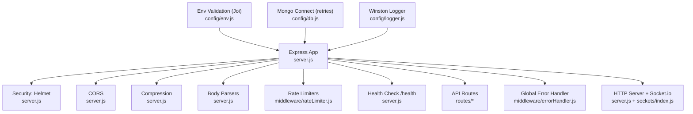
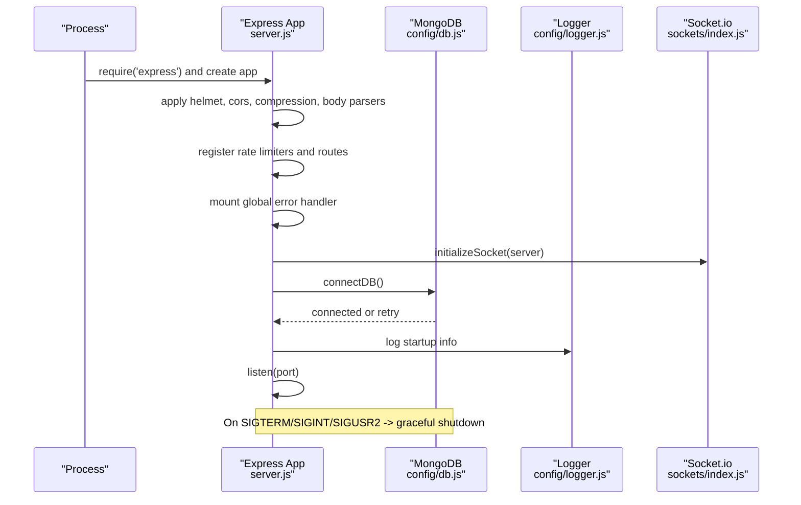
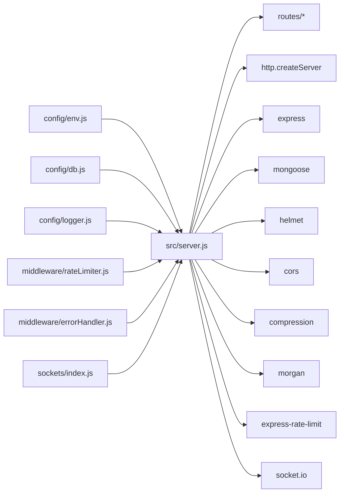

# Server Configuration

<cite>
**Referenced Files in This Document**
- [server.js](file://backend/src/server.js)
- [env.js](file://backend/src/config/env.js)
- [db.js](file://backend/src/config/db.js)
- [logger.js](file://backend/src/config/logger.js)
- [errorHandler.js](file://backend/src/middleware/errorHandler.js)
- [rateLimiter.js](file://backend/src/middleware/rateLimiter.js)
- [index.js](file://backend/src/sockets/index.js)
- [package.json](file://backend/package.json)
- [checkPorts.js](file://backend/src/scripts/checkPorts.js)
</cite>

## Table of Contents
1. [Introduction](#introduction)
2. [Project Structure](#project-structure)
3. [Core Components](#core-components)
4. [Architecture Overview](#architecture-overview)
5. [Detailed Component Analysis](#detailed-component-analysis)
6. [Dependency Analysis](#dependency-analysis)
7. [Performance Considerations](#performance-considerations)
8. [Troubleshooting Guide](#troubleshooting-guide)
9. [Conclusion](#conclusion)

## Introduction
This document explains the server configuration for Nandibaag Bot’s Express.js backend. It covers server initialization, middleware setup (Helmet security, CORS, compression, body parsing), environment variable management with Joi validation, MongoDB connection with retry logic, Winston logging, health check endpoint, process-level error handlers, graceful shutdown, port management, startup sequence, and service initialization patterns.

## Project Structure
The backend is organized by feature and concern:
- Entry point and orchestration: server.js
- Configuration: env.js (Joi validation), db.js (MongoDB connect with retries), logger.js (Winston)
- Middleware: errorHandler.js, rateLimiter.js
- Real-time: sockets/index.js (Socket.io initialization and auth)
- Scripts: checkPorts.js (port availability diagnostics)
- Package scripts: package.json (start/dev commands)

**Diagram sources**
- [server.js:1-100](file://backend/src/server.js#L1-L100)
- [env.js:1-95](file://backend/src/config/env.js#L1-L95)
- [db.js:1-40](file://backend/src/config/db.js#L1-L40)
- [logger.js:1-52](file://backend/src/config/logger.js#L1-L52)
- [rateLimiter.js:1-37](file://backend/src/middleware/rateLimiter.js#L1-L37)
- [errorHandler.js:1-36](file://backend/src/middleware/errorHandler.js#L1-L36)
- [index.js:1-82](file://backend/src/sockets/index.js#L1-L82)

**Section sources**
- [server.js:1-100](file://backend/src/server.js#L1-L100)
- [package.json:1-47](file://backend/package.json#L1-L47)

## Core Components
- Express application and HTTP server creation
- Security and performance middleware stack
- Environment configuration with strict validation
- Database connectivity with retry strategy
- Structured logging via Winston
- Health check endpoint for readiness/liveness
- Process-level error handling and graceful shutdown
- Port management utilities

**Section sources**
- [server.js:34-100](file://backend/src/server.js#L34-L100)
- [env.js:1-95](file://backend/src/config/env.js#L1-L95)
- [db.js:1-40](file://backend/src/config/db.js#L1-L40)
- [logger.js:1-52](file://backend/src/config/logger.js#L1-L52)
- [errorHandler.js:1-36](file://backend/src/middleware/errorHandler.js#L1-L36)
- [rateLimiter.js:1-37](file://backend/src/middleware/rateLimiter.js#L1-L37)
- [index.js:1-82](file://backend/src/sockets/index.js#L1-L82)
- [checkPorts.js:1-226](file://backend/src/scripts/checkPorts.js#L1-L226)

## Architecture Overview
The server bootstraps an Express app on top of a Node HTTP server, mounts security and utility middleware, registers routes, initializes Socket.io, connects to MongoDB with retries, seeds initial data, starts background tasks, and listens on a configured port. Graceful shutdown handles active sessions, closes the server, and disconnects from MongoDB.

**Diagram sources**
- [server.js:34-174](file://backend/src/server.js#L34-L174)
- [db.js:10-29](file://backend/src/config/db.js#L10-L29)
- [logger.js:46-51](file://backend/src/config/logger.js#L46-L51)
- [index.js:18-63](file://backend/src/sockets/index.js#L18-L63)

## Detailed Component Analysis

### Express Server Initialization and Middleware Stack
- Creates an Express app and wraps it with an HTTP server.
- Applies security and performance middleware in order:
  - Helmet for secure HTTP headers
  - CORS configured with frontend URL and credentials enabled
  - Compression for response payload reduction
  - Body parsers for JSON and URL-encoded payloads
  - Optional development request logging via Morgan when NODE_ENV is development
- Mounts rate limiting:
  - General API limiter on /api
  - Stricter login limiter on /api/auth/login
- Registers a health check route before authentication and other routes.
- Mounts all API route modules under their respective prefixes.
- Installs a global error handler last.

Key behaviors:
- CORS origin is sourced from validated environment variables.
- Rate limiters use standard headers and return consistent messages.
- Health check returns status, uptime, MongoDB connection state, active WhatsApp session count, and timestamp.

**Section sources**
- [server.js:34-100](file://backend/src/server.js#L34-L100)
- [rateLimiter.js:1-37](file://backend/src/middleware/rateLimiter.js#L1-L37)

### Environment Variable Management with Joi Validation
- Loads .env via dotenv and validates against a schema using Joi.
- Required fields include database URI, JWT secret and expiry, OpenRouter keys and model, server port, environment, resort contacts, admin defaults, and frontend URL.
- Optional fields cover AI provider tiers (Gemini, Groq, Cloudflare Workers AI, Cerebras) and local Ollama testing mode.
- Exports normalized config values used across the app.
- On validation failure, logs detailed errors and exits the process.

Operational notes:
- PORT defaults to 7000 if not provided.
- NODE_ENV defaults to development.
- Frontend URL must be a valid URI.

**Section sources**
- [env.js:1-95](file://backend/src/config/env.js#L1-L95)

### MongoDB Connection with Retry Logic
- Uses Mongoose to connect with the validated URI.
- Implements exponential-free retry with fixed delay and maximum attempts.
- Logs each attempt and final failure; exits process after max retries.
- Subscribes to disconnection and error events for observability.

Retry characteristics:
- Maximum retries: 10
- Delay between retries: 5 seconds
- Final exit on exhaustion to fail fast during startup.

**Section sources**
- [db.js:1-40](file://backend/src/config/db.js#L1-L40)

### Winston Logging Implementation
- Configures transports based on environment:
  - Development: colored console output with timestamps and structured formatting
  - Always: file transports for errors and combined logs in JSON format
- Sets level to debug in development and info in production.
- Centralized logger instance exported for use throughout the app.

File locations:
- Error logs: logs/error.log
- Combined logs: logs/combined.log

**Section sources**
- [logger.js:1-52](file://backend/src/config/logger.js#L1-L52)

### Health Check Endpoint
- GET /health provides:
  - status: ok or error
  - uptime: process uptime
  - mongoConnected: boolean derived from Mongoose readyState
  - activeWhatsappSessions: count of connected WhatsApp sessions
  - timestamp: ISO string
- Returns 500 with message on exceptions.

Usage:
- Suitable for liveness probes and basic readiness checks.
- Does not depend on authentication.

**Section sources**
- [server.js:62-86](file://backend/src/server.js#L62-L86)

### Global Error Handling
- Centralized Express error middleware that:
  - Logs error details including stack, URL, method, and IP
  - Returns a consistent JSON shape with success flag and message
  - Includes stack only in development
  - Defaults to 500 status if none set

Integration:
- Mounted last in middleware chain to catch unhandled errors.

**Section sources**
- [errorHandler.js:1-36](file://backend/src/middleware/errorHandler.js#L1-L36)

### Graceful Shutdown Mechanism
- Listens for SIGTERM, SIGINT, and SIGUSR2 signals.
- Prevents concurrent shutdowns with a guard flag.
- Enforces a hard timeout to force-exit if shutdown hangs.
- Destroys all active WhatsApp sessions, closes the HTTP server, and disconnects from MongoDB.
- Re-emits SIGUSR2 to notify supervisors after cleanup.

Error resilience:
- Errors during session destruction, server close, and DB disconnect are logged but do not abort shutdown.

**Section sources**
- [server.js:186-238](file://backend/src/server.js#L186-L238)

### Process-Level Error Handlers
- Unhandled promise rejections are logged.
- Uncaught exceptions are logged and cause immediate process exit.

Purpose:
- Ensure failures are captured and surfaced rather than silently failing.

**Section sources**
- [server.js:176-184](file://backend/src/server.js#L176-L184)

### Port Management and Startup Sequence
- The server listens on the validated PORT.
- On EADDRINUSE, logs actionable guidance and exits.
- A diagnostic script checks common ports (backend, frontend dev server, and URLs from .env) and reports processes occupying them with kill instructions per platform.

Startup flow:
- Initialize Express and middleware
- Initialize Socket.io
- Connect to MongoDB with retries
- Seed default admin user and settings if missing
- Restart active WhatsApp sessions if configured
- Start follow-up cron job
- Listen on port and log startup context

**Section sources**
- [server.js:110-174](file://backend/src/server.js#L110-L174)
- [checkPorts.js:122-220](file://backend/src/scripts/checkPorts.js#L122-L220)
- [package.json:6-14](file://backend/package.json#L6-L14)

### Service Initialization Patterns
- Socket.io is initialized with the HTTP server and secured with JWT-based handshake verification.
- Services receive the Socket.io instance via setters to emit real-time events without circular imports.
- Background jobs (e.g., follow-up cron) are started after successful startup.

Real-time considerations:
- Socket.io CORS mirrors the HTTP CORS origin.
- Authentication middleware ensures only active users can connect.

**Section sources**
- [index.js:18-63](file://backend/src/sockets/index.js#L18-L63)
- [server.js:102-108](file://backend/src/server.js#L102-L108)

## Dependency Analysis
High-level dependencies relevant to server configuration:

**Diagram sources**
- [server.js:1-33](file://backend/src/server.js#L1-L33)
- [env.js:1-95](file://backend/src/config/env.js#L1-L95)
- [db.js:1-40](file://backend/src/config/db.js#L1-L40)
- [logger.js:1-52](file://backend/src/config/logger.js#L1-L52)
- [rateLimiter.js:1-37](file://backend/src/middleware/rateLimiter.js#L1-L37)
- [errorHandler.js:1-36](file://backend/src/middleware/errorHandler.js#L1-L36)
- [index.js:1-82](file://backend/src/sockets/index.js#L1-L82)

**Section sources**
- [server.js:1-33](file://backend/src/server.js#L1-L33)
- [package.json:23-42](file://backend/package.json#L23-L42)

## Performance Considerations
- Enable compression to reduce bandwidth usage for large responses.
- Use rate limiting to protect endpoints from abuse and mitigate resource exhaustion.
- Keep Morgan disabled in production to avoid overhead; rely on Winston for structured logs.
- Prefer efficient queries and indexes in MongoDB to support health checks and frequent reads.
- Avoid heavy work in the health endpoint; current implementation performs minimal checks.

[No sources needed since this section provides general guidance]

## Troubleshooting Guide
Common issues and resolutions:
- Port already in use:
  - Run the port checker script to identify conflicting processes and obtain kill commands.
  - Adjust PORT in .env or stop the conflicting process.
- MongoDB connection failures:
  - Verify MONGO_URI and network access.
  - Observe retry logs; after max retries, the process exits intentionally.
- CORS errors:
  - Ensure FRONTEND_URL matches the browser origin exactly and includes protocol and port.
- Health check failures:
  - Inspect MongoDB connection state and WhatsApp session counts returned by /health.
- Graceful shutdown not completing:
  - Watch for forced exit due to timeout; investigate hanging session destroy operations.

**Section sources**
- [checkPorts.js:122-220](file://backend/src/scripts/checkPorts.js#L122-L220)
- [db.js:10-29](file://backend/src/config/db.js#L10-L29)
- [server.js:155-173](file://backend/src/server.js#L155-L173)
- [server.js:186-238](file://backend/src/server.js#L186-L238)

## Conclusion
Nandibaag Bot’s server configuration follows a robust pattern: strict environment validation, layered middleware for security and performance, resilient database connectivity, structured logging, clear health signaling, and safe shutdown procedures. The included port diagnostics and process-level handlers improve operational reliability and ease of troubleshooting.