# Session Management

<cite>
**Referenced Files in This Document**
- [whatsappService.js](file://backend/src/services/whatsappService.js)
- [whatsappRoutes.js](file://backend/src/routes/whatsappRoutes.js)
- [server.js](file://backend/src/server.js)
- [index.js](file://backend/src/sockets/index.js)
- [messageHandler.js](file://backend/src/services/messageHandler.js)
- [Settings.js](file://backend/src/models/Settings.js)
- [package.json](file://backend/package.json)
</cite>

## Table of Contents
1. [Introduction](#introduction)
2. [Project Structure](#project-structure)
3. [Core Components](#core-components)
4. [Architecture Overview](#architecture-overview)
5. [Detailed Component Analysis](#detailed-component-analysis)
6. [Dependency Analysis](#dependency-analysis)
7. [Performance Considerations](#performance-considerations)
8. [Troubleshooting Guide](#troubleshooting-guide)
9. [Conclusion](#conclusion)

## Introduction
This document explains WhatsApp session management in Nandibaag Bot, focusing on the multi-session architecture built with whatsapp-web.js LocalAuth strategy. It covers how sessions are stored in memory and on disk, initialization flows including cleanStart behavior, automatic reconnection with exponential backoff, health checks, graceful shutdown, and troubleshooting guidance for common issues such as stale lock files, corrupted session data, and Puppeteer process management.

## Project Structure
The session management logic is primarily implemented in the backend service layer and integrated into the Express server and Socket.io infrastructure:

- Service layer: Multi-session orchestration, lifecycle, persistence, and reconnection
- Routes: REST endpoints to manage sessions (start, pair, destroy, list)
- Server: Bootstraps services, initializes Socket.io, restarts active sessions at startup, and handles graceful shutdown
- Sockets: Real-time event channel used by the service to notify the frontend about QR codes, ready states, failures, and disconnects
- Message handling: Queues messages per chat to avoid race conditions during processing
- Settings model: Persists configured WhatsApp numbers and their activation state

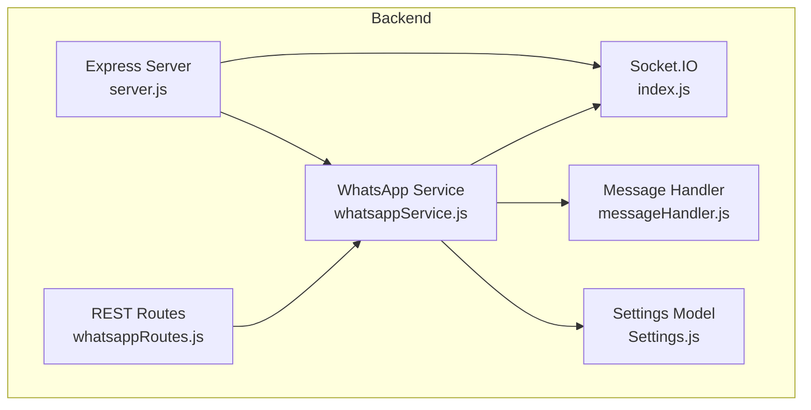

**Diagram sources**
- [server.js:103-108](file://backend/src/server.js#L103-L108)
- [whatsappService.js:15-17](file://backend/src/services/whatsappService.js#L15-L17)
- [whatsappRoutes.js:1-6](file://backend/src/routes/whatsappRoutes.js#L1-L6)
- [index.js:18-24](file://backend/src/sockets/index.js#L18-L24)
- [messageHandler.js:1-6](file://backend/src/services/messageHandler.js#L1-L6)
- [Settings.js:1-38](file://backend/src/models/Settings.js#L1-L38)

**Section sources**
- [server.js:103-108](file://backend/src/server.js#L103-L108)
- [whatsappService.js:15-17](file://backend/src/services/whatsappService.js#L15-L17)
- [whatsappRoutes.js:1-6](file://backend/src/routes/whatsappRoutes.js#L1-L6)
- [index.js:18-24](file://backend/src/sockets/index.js#L18-L24)
- [messageHandler.js:1-6](file://backend/src/services/messageHandler.js#L1-L6)
- [Settings.js:1-38](file://backend/src/models/Settings.js#L1-L38)

## Core Components
- Multi-session Map: An in-memory Map stores active Client instances keyed by sessionId.
- LocalAuth persistence: Each session’s authentication data is persisted under sessions/{sessionId}/ using LocalAuth.
- Reconnect attempts tracking: A Map tracks reconnect attempt counts per session.
- Per-chat message queue locks: A Map ensures sequential processing per chat to prevent race conditions.
- Health check cron: Runs every 2 minutes to log session states.
- Graceful shutdown: Destroys all sessions and closes server/MongoDB connections.

Key responsibilities:
- Initialize sessions non-blocking, emit events via Socket.io
- Handle QR generation, ready, authenticated, auth_failure, disconnected
- Auto-reconnect with exponential backoff
- Provide status queries and send messages
- Clean up stale lock files and session folders when needed

**Section sources**
- [whatsappService.js:40-48](file://backend/src/services/whatsappService.js#L40-L48)
- [whatsappService.js:53-92](file://backend/src/services/whatsappService.js#L53-L92)
- [whatsappService.js:107-147](file://backend/src/services/whatsappService.js#L107-L147)
- [whatsappService.js:152-256](file://backend/src/services/whatsappService.js#L152-L256)
- [whatsappService.js:333-363](file://backend/src/services/whatsappService.js#L333-L363)
- [whatsappService.js:410-452](file://backend/src/services/whatsappService.js#L410-L452)
- [whatsappService.js:602-612](file://backend/src/services/whatsappService.js#L602-L612)
- [whatsappService.js:617-628](file://backend/src/services/whatsappService.js#L617-L628)

## Architecture Overview
The system uses a multi-session architecture where each WhatsApp number is represented by a separate Client instance managed by LocalAuth. The service orchestrates initialization, event handling, reconnection, and cleanup while exposing REST APIs and emitting real-time updates over Socket.io.

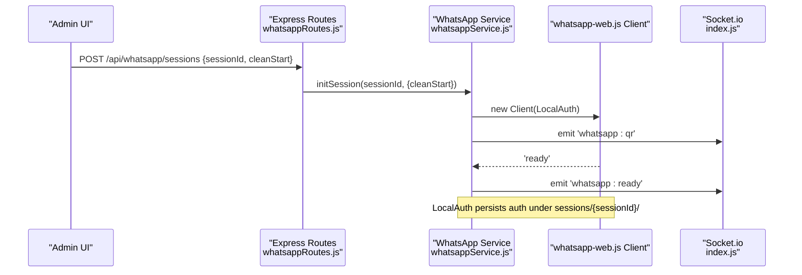

**Diagram sources**
- [whatsappRoutes.js:37-60](file://backend/src/routes/whatsappRoutes.js#L37-L60)
- [whatsappService.js:107-147](file://backend/src/services/whatsappService.js#L107-L147)
- [whatsappService.js:152-162](file://backend/src/services/whatsappService.js#L152-L162)
- [whatsappService.js:165-194](file://backend/src/services/whatsappService.js#L165-L194)
- [index.js:18-24](file://backend/src/sockets/index.js#L18-L24)

## Detailed Component Analysis

### Multi-Session Architecture and Storage
- In-memory storage: Map<sessionId, Client> holds active clients.
- On-disk storage: LocalAuth writes session data to sessions/{sessionId}/.
- Lock file cleanup: Stale SingletonLock and SingletonSocket files are removed before initialization to avoid “browser already running” errors.

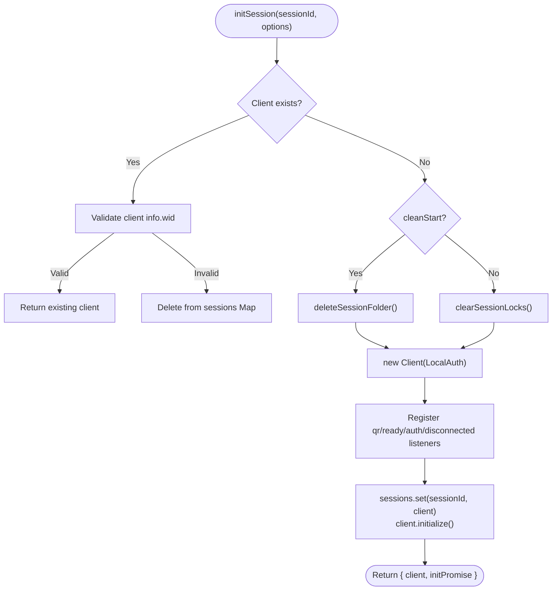

**Diagram sources**
- [whatsappService.js:107-147](file://backend/src/services/whatsappService.js#L107-L147)
- [whatsappService.js:53-92](file://backend/src/services/whatsappService.js#L53-L92)

**Section sources**
- [whatsappService.js:40-48](file://backend/src/services/whatsappService.js#L40-L48)
- [whatsappService.js:53-92](file://backend/src/services/whatsappService.js#L53-L92)
- [whatsappService.js:107-147](file://backend/src/services/whatsappService.js#L107-L147)

### Session Lifecycle Management
- Initialization: Non-blocking; emits QR code and readiness events via Socket.io.
- Authentication success: Adds session to database settings if not present.
- Disconnection handling: Differentiates permanent unlinking (LOGOUT/UNPAIRED) vs transient disconnects; deletes session folder for permanent cases and triggers auto-reconnect otherwise.
- Pairing code flow: Alternative to QR scanning; requests pairing code after client is ready.

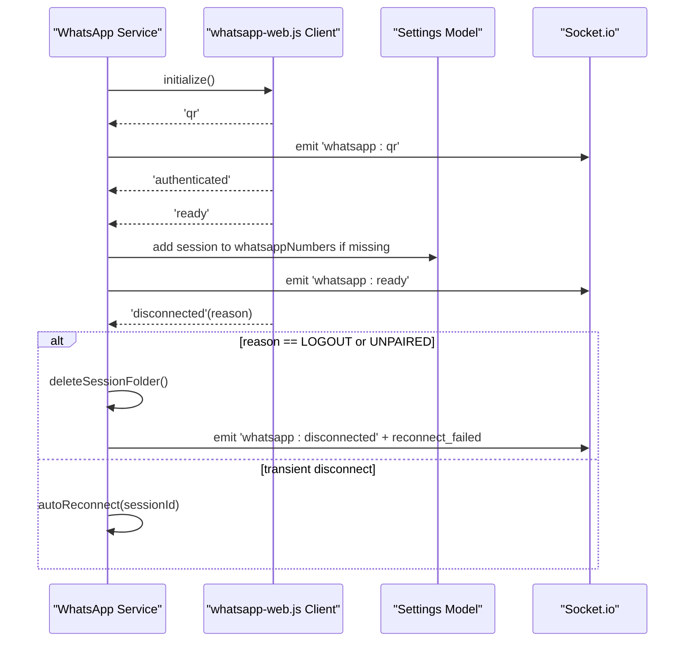

**Diagram sources**
- [whatsappService.js:152-256](file://backend/src/services/whatsappService.js#L152-L256)
- [whatsappService.js:165-194](file://backend/src/services/whatsappService.js#L165-L194)
- [whatsappService.js:333-363](file://backend/src/services/whatsappService.js#L333-L363)

**Section sources**
- [whatsappService.js:152-256](file://backend/src/services/whatsappService.js#L152-L256)
- [whatsappService.js:375-402](file://backend/src/services/whatsappService.js#L375-L402)

### Automatic Reconnection with Exponential Backoff
- Attempts: Up to 5 reconnection attempts.
- Delays: 5s, 10s, 20s, 40s, 80s.
- Behavior: After each failure, increments attempt counter and schedules next attempt; resets counter on successful connection; emits reconnect_failed after max attempts.

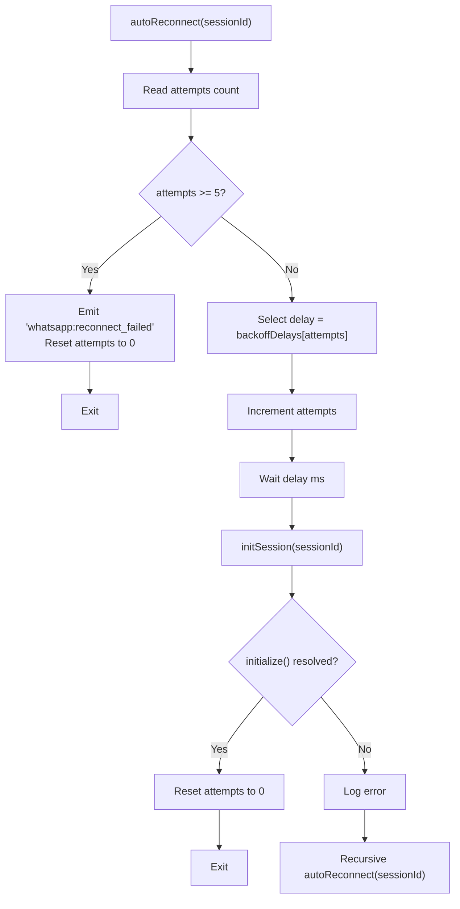

**Diagram sources**
- [whatsappService.js:333-363](file://backend/src/services/whatsappService.js#L333-L363)

**Section sources**
- [whatsappService.js:333-363](file://backend/src/services/whatsappService.js#L333-L363)

### Session Status Tracking
- States: 'connected', 'disconnected', 'connecting', 'not_initialized'.
- Logic: Checks presence in Map and client.info.wid to determine state; aggregates across configured numbers and in-memory sessions.

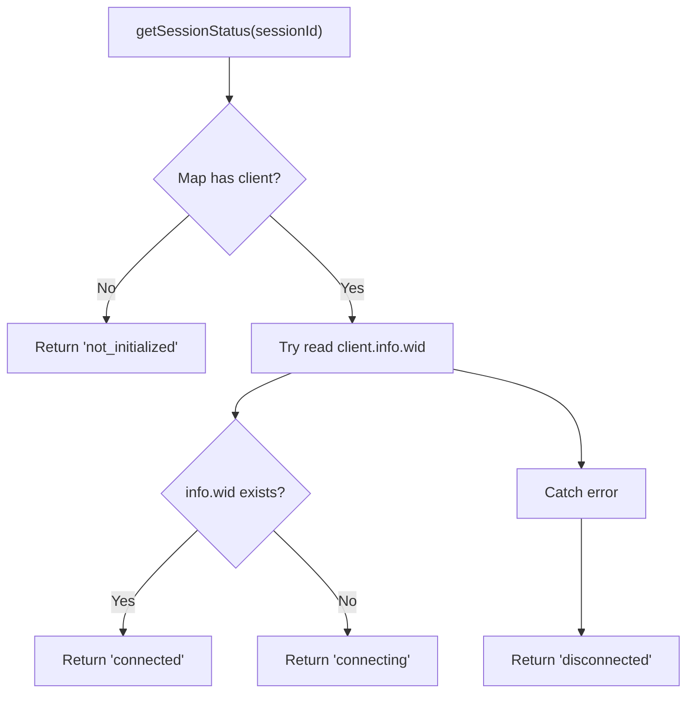

**Diagram sources**
- [whatsappService.js:410-427](file://backend/src/services/whatsappService.js#L410-L427)

**Section sources**
- [whatsappService.js:410-452](file://backend/src/services/whatsappService.js#L410-L452)

### Health Check Cron Job
- Schedule: Every 2 minutes.
- Action: Iterates active sessions and logs their current state via client.getState().

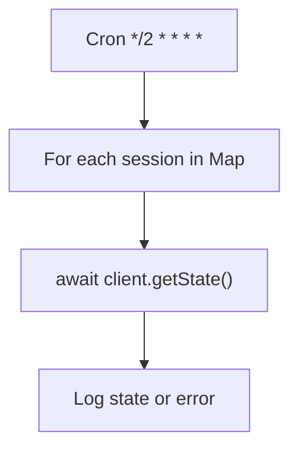

**Diagram sources**
- [whatsappService.js:602-612](file://backend/src/services/whatsappService.js#L602-L612)

**Section sources**
- [whatsappService.js:602-612](file://backend/src/services/whatsappService.js#L602-L612)

### Graceful Shutdown Handling
- Triggers: SIGTERM, SIGINT, SIGUSR2.
- Actions: Destroy all sessions, close HTTP server, disconnect MongoDB, force exit after timeout if hung.

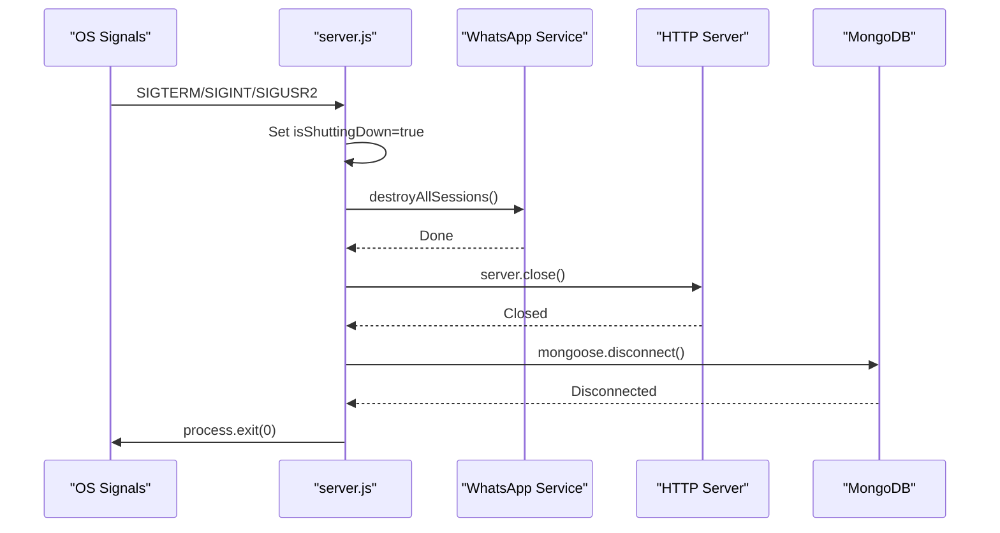

**Diagram sources**
- [server.js:186-238](file://backend/src/server.js#L186-L238)
- [whatsappService.js:617-628](file://backend/src/services/whatsappService.js#L617-L628)

**Section sources**
- [server.js:186-238](file://backend/src/server.js#L186-L238)
- [whatsappService.js:617-628](file://backend/src/services/whatsappService.js#L617-L628)

### REST API Integration
- GET /api/whatsapp/sessions: Returns status map for all configured and active sessions.
- POST /api/whatsapp/sessions: Starts session initialization (non-blocking); supports cleanStart option.
- POST /api/whatsapp/sessions/:id/pairing-code: Requests pairing code for a session.
- DELETE /api/whatsapp/sessions/:id: Destroys session and cleans up on-disk data.

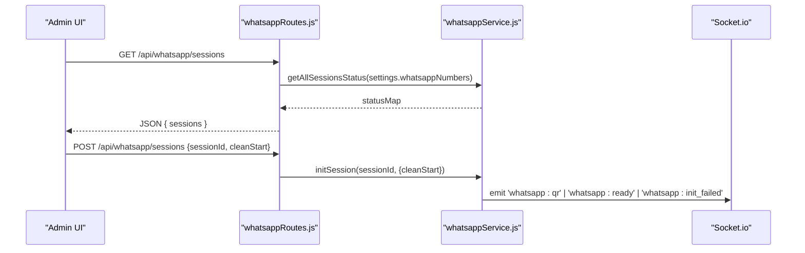

**Diagram sources**
- [whatsappRoutes.js:13-27](file://backend/src/routes/whatsappRoutes.js#L13-L27)
- [whatsappRoutes.js:37-60](file://backend/src/routes/whatsappRoutes.js#L37-L60)
- [whatsappRoutes.js:66-87](file://backend/src/routes/whatsappRoutes.js#L66-L87)
- [whatsappRoutes.js:94-107](file://backend/src/routes/whatsappRoutes.js#L94-L107)
- [whatsappService.js:435-452](file://backend/src/services/whatsappService.js#L435-L452)
- [whatsappService.js:107-147](file://backend/src/services/whatsappService.js#L107-L147)

**Section sources**
- [whatsappRoutes.js:13-27](file://backend/src/routes/whatsappRoutes.js#L13-L27)
- [whatsappRoutes.js:37-60](file://backend/src/routes/whatsappRoutes.js#L37-L60)
- [whatsappRoutes.js:66-87](file://backend/src/routes/whatsappRoutes.js#L66-L87)
- [whatsappRoutes.js:94-107](file://backend/src/routes/whatsappRoutes.js#L94-L107)

### Message Processing and Per-Chat Queue
- Incoming messages are queued per chat to ensure sequential processing and avoid race conditions on Chat document updates.
- The handler integrates AI responses, lead scoring, follow-ups, and sends replies through the appropriate session.

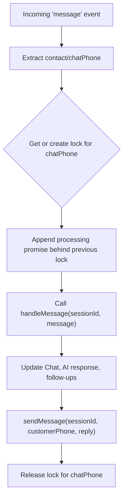

**Diagram sources**
- [whatsappService.js:259-290](file://backend/src/services/whatsappService.js#L259-L290)
- [messageHandler.js:22-178](file://backend/src/services/messageHandler.js#L22-L178)

**Section sources**
- [whatsappService.js:259-290](file://backend/src/services/whatsappService.js#L259-L290)
- [messageHandler.js:22-178](file://backend/src/services/messageHandler.js#L22-L178)

## Dependency Analysis
- External dependencies:
  - whatsapp-web.js: Provides Client and LocalAuth for WhatsApp Web automation and session persistence.
  - node-cron: Schedules periodic health checks.
  - qrcode: Generates QR code data URLs for display.
  - socket.io: Emits real-time events to the dashboard.
  - express: Hosts REST routes that trigger session operations.

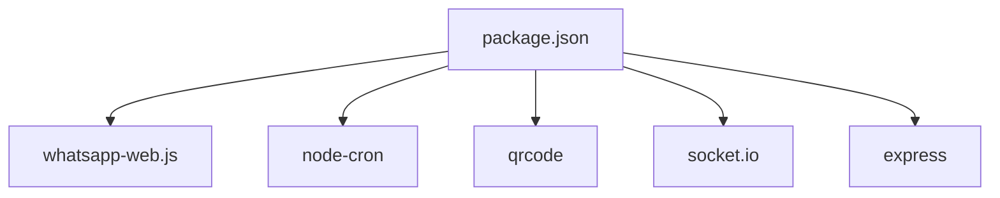

**Diagram sources**
- [package.json:23-42](file://backend/package.json#L23-L42)

**Section sources**
- [package.json:23-42](file://backend/package.json#L23-L42)

## Performance Considerations
- Non-blocking initialization: initSession returns immediately; initialization runs in background, minimizing request latency.
- Sequential per-chat processing: Prevents concurrent writes to Chat documents and reduces contention.
- Exponential backoff: Reduces load on WhatsApp servers during instability and avoids rapid retry storms.
- Headless Puppeteer args: Optimized for containerized environments and reduced resource usage.

[No sources needed since this section provides general guidance]

## Troubleshooting Guide
Common issues and resolutions:

- Stale lock files preventing browser startup
  - Symptom: “The browser is already running...” or similar Puppeteer errors on restart.
  - Resolution: The service clears SingletonLock and SingletonSocket files before initializing sessions. If issues persist, manually remove these files under sessions/{sessionId}/session/.

- Corrupted session data causing crash loops
  - Symptom: Sessions repeatedly fail to connect or crash during initialization.
  - Resolution: Use cleanStart=true when starting a session to delete the entire session folder. Alternatively, call destroySession with deleteData=true to remove on-disk data and reset.

- Permanent unlinking (logout/unpaired)
  - Symptom: Disconnected with reason LOGOUT or UNPAIRED; no auto-reconnect.
  - Resolution: The service deletes session data and emits reconnect_failed. Re-initialize the session (optionally with cleanStart) and re-authenticate via QR or pairing code.

- Reconnection failures
  - Symptom: Repeated reconnect attempts fail and eventually stop after 5 tries.
  - Resolution: Investigate network connectivity and WhatsApp Web availability. Restart the server to reset state if necessary. Monitor logs for specific error messages.

- Puppeteer process management
  - Symptom: Zombie Chrome processes after crashes or abrupt stops.
  - Resolution: Ensure graceful shutdown destroys all sessions. If processes remain, terminate them manually and clear lock files. Verify headless args and environment constraints.

- Health checks not reporting
  - Symptom: No health check logs every 2 minutes.
  - Resolution: Confirm cron job is scheduled and running. Check logs for errors during getState calls.

**Section sources**
- [whatsappService.js:76-92](file://backend/src/services/whatsappService.js#L76-L92)
- [whatsappService.js:123-128](file://backend/src/services/whatsappService.js#L123-L128)
- [whatsappService.js:212-256](file://backend/src/services/whatsappService.js#L212-L256)
- [whatsappService.js:333-363](file://backend/src/services/whatsappService.js#L333-L363)
- [whatsappService.js:602-612](file://backend/src/services/whatsappService.js#L602-L612)
- [server.js:186-238](file://backend/src/server.js#L186-L238)

## Conclusion
Nandibaag Bot implements a robust multi-session WhatsApp architecture leveraging whatsapp-web.js LocalAuth for persistent, per-session authentication. The service manages session lifecycles with non-blocking initialization, comprehensive event-driven updates, exponential backoff reconnection, and periodic health checks. Graceful shutdown ensures clean release of resources. With proper monitoring and troubleshooting procedures, the system maintains reliable WhatsApp connectivity across multiple accounts.