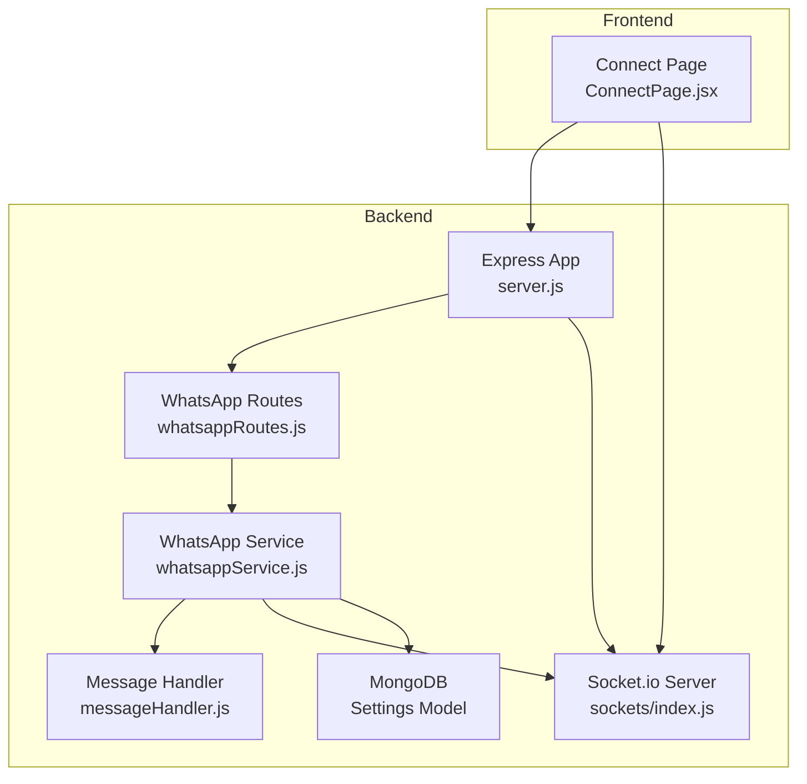
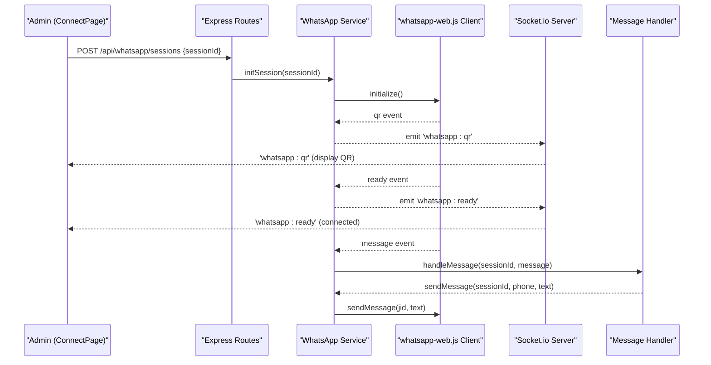
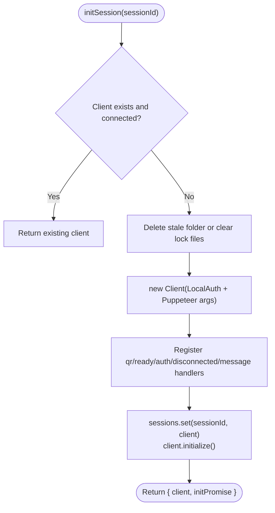
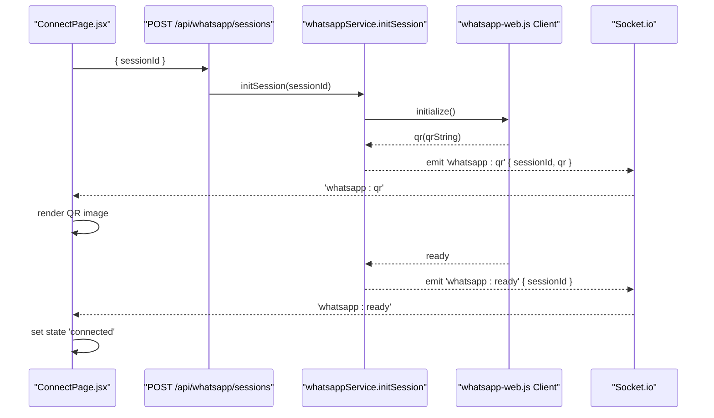
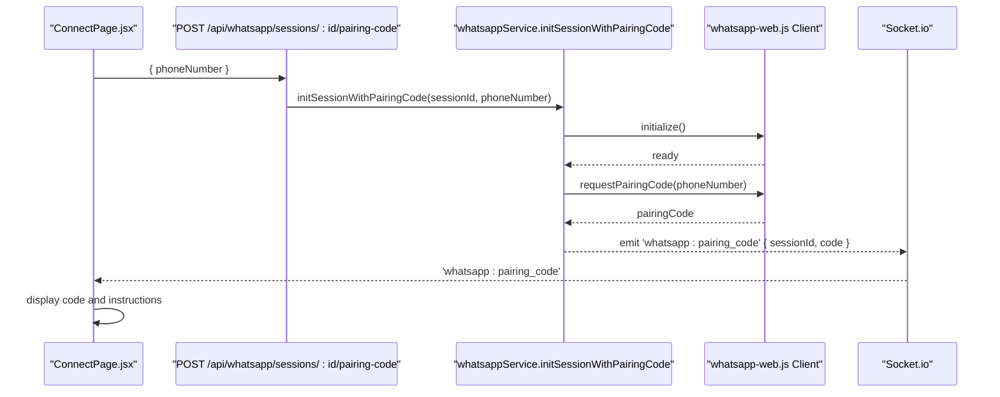
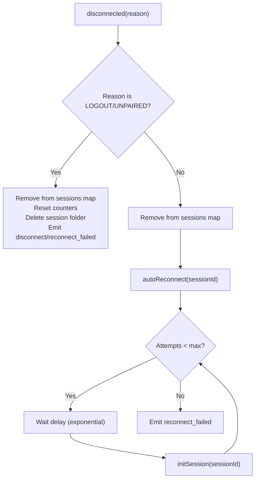
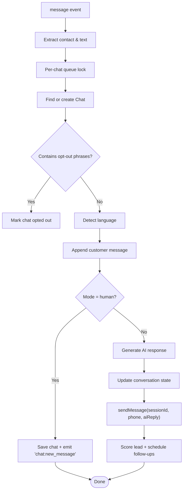
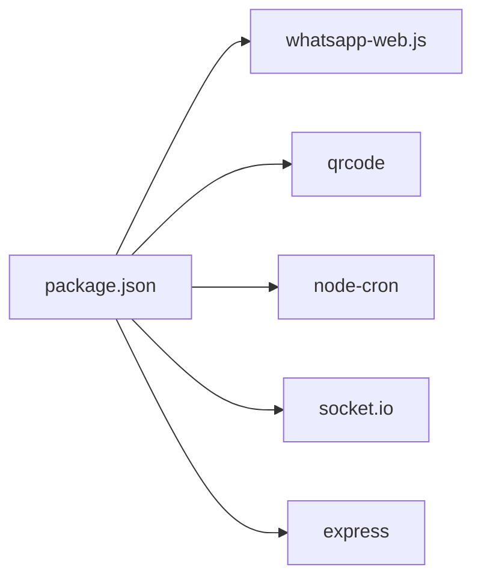

# WhatsApp Integration Service

<cite>
**Referenced Files in This Document**
- [whatsappService.js](file://backend/src/services/whatsappService.js)
- [whatsappRoutes.js](file://backend/src/routes/whatsappRoutes.js)
- [index.js](file://backend/src/sockets/index.js)
- [server.js](file://backend/src/server.js)
- [messageHandler.js](file://backend/src/services/messageHandler.js)
- [ConnectPage.jsx](file://frontend/src/pages/ConnectPage.jsx)
- [Settings.js](file://backend/src/models/Settings.js)
- [package.json](file://backend/package.json)
</cite>

## Table of Contents
1. [Introduction](#introduction)
2. [Project Structure](#project-structure)
3. [Core Components](#core-components)
4. [Architecture Overview](#architecture-overview)
5. [Detailed Component Analysis](#detailed-component-analysis)
6. [Dependency Analysis](#dependency-analysis)
7. [Performance Considerations](#performance-considerations)
8. [Troubleshooting Guide](#troubleshooting-guide)
9. [Conclusion](#conclusion)

## Introduction
This document explains the WhatsApp integration service for Nandibaag Bot, focusing on:
- whatsapp-web.js implementation and multi-session management
- QR code authentication flow and pairing code support
- Session persistence and automatic reconnection handling
- Message routing logic and real-time status updates via Socket.io
- Connection lifecycle, session storage, and scaling considerations for multiple WhatsApp accounts

The system supports multiple concurrent WhatsApp sessions (one per resort number), each with persistent local auth data, robust reconnection, and a responsive dashboard UI.

## Project Structure
Key backend components involved in WhatsApp integration:
- Services: whatsappService.js (session lifecycle, events, messaging), messageHandler.js (incoming message routing)
- Routes: whatsappRoutes.js (REST endpoints to manage sessions)
- Sockets: index.js (Socket.io server and room-based broadcasting)
- Server bootstrap: server.js (initialization, health checks, graceful shutdown)
- Frontend: ConnectPage.jsx (QR/pairing flows, connection state machine)
- Data model: Settings.js (stores configured WhatsApp numbers and modes)

**Diagram sources**
- [server.js:88-108](file://backend/src/server.js#L88-L108)
- [whatsappRoutes.js:1-110](file://backend/src/routes/whatsappRoutes.js#L1-L110)
- [whatsappService.js:1-642](file://backend/src/services/whatsappService.js#L1-L642)
- [messageHandler.js:1-183](file://backend/src/services/messageHandler.js#L1-L183)
- [index.js:1-82](file://backend/src/sockets/index.js#L1-L82)
- [ConnectPage.jsx:1-579](file://frontend/src/pages/ConnectPage.jsx#L1-L579)
- [Settings.js:1-38](file://backend/src/models/Settings.js#L1-L38)

**Section sources**
- [server.js:1-241](file://backend/src/server.js#L1-L241)
- [whatsappRoutes.js:1-110](file://backend/src/routes/whatsappRoutes.js#L1-L110)
- [whatsappService.js:1-642](file://backend/src/services/whatsappService.js#L1-L642)
- [messageHandler.js:1-183](file://backend/src/services/messageHandler.js#L1-L183)
- [index.js:1-82](file://backend/src/sockets/index.js#L1-L82)
- [ConnectPage.jsx:1-579](file://frontend/src/pages/ConnectPage.jsx#L1-L579)
- [Settings.js:1-38](file://backend/src/models/Settings.js#L1-L38)

## Core Components
- WhatsApp Service: Manages multiple sessions using LocalAuth, emits QR and status events, handles auto-reconnect, and routes incoming messages to the message handler.
- Routes: Provide REST endpoints to add, list, destroy sessions, and request pairing codes.
- Socket.io: Authenticates staff users, joins them to a dashboard room, and enables real-time event broadcasting from services.
- Message Handler: Orchestrates AI/human mode, language detection, opt-out handling, follow-up scheduling, and outbound replies.
- Frontend Connect Page: Implements a connection state machine, renders QR or pairing code flows, and polls as a fallback.

**Section sources**
- [whatsappService.js:1-642](file://backend/src/services/whatsappService.js#L1-L642)
- [whatsappRoutes.js:1-110](file://backend/src/routes/whatsappRoutes.js#L1-L110)
- [index.js:1-82](file://backend/src/sockets/index.js#L1-L82)
- [messageHandler.js:1-183](file://backend/src/services/messageHandler.js#L1-L183)
- [ConnectPage.jsx:1-579](file://frontend/src/pages/ConnectPage.jsx#L1-L579)

## Architecture Overview
End-to-end flow overview:
- Admin adds a new WhatsApp session via REST; backend initializes a whatsapp-web.js Client with LocalAuth and emits socket events for QR or pairing code.
- Frontend listens to socket events, displays QR or pairing code, and transitions states accordingly.
- On successful authentication, the session becomes ready; incoming messages are queued per chat and routed through the message handler.
- The message handler decides whether to reply automatically (AI mode) or notify staff (human mode), then sends replies back via the appropriate session.

**Diagram sources**
- [whatsappRoutes.js:37-60](file://backend/src/routes/whatsappRoutes.js#L37-L60)
- [whatsappService.js:107-321](file://backend/src/services/whatsappService.js#L107-L321)
- [whatsappService.js:259-290](file://backend/src/services/whatsappService.js#L259-L290)
- [messageHandler.js:22-178](file://backend/src/services/messageHandler.js#L22-L178)
- [index.js:18-63](file://backend/src/sockets/index.js#L18-L63)
- [ConnectPage.jsx:112-182](file://frontend/src/pages/ConnectPage.jsx#L112-L182)

## Detailed Component Analysis

### WhatsApp Service (Multi-Session Management)
Responsibilities:
- Maintain an in-memory Map of active sessions keyed by sessionId.
- Persist authentication data per session using LocalAuth under sessions/{sessionId}/.
- Emit real-time events for QR, ready, auth_failure, disconnected, init_failed, reconnect_failed, and pairing_code.
- Implement exponential backoff auto-reconnect up to a fixed number of attempts.
- Queue message processing per chat to avoid race conditions on shared Chat documents.
- Provide utilities to send messages, restart all active sessions, and destroy sessions cleanly.

Key behaviors:
- Non-blocking initialization: initSession registers listeners and starts client.initialize() in the background.
- Per-chat locks: messageQueueLocks ensures sequential processing per customer chat.
- Health check cron: periodically logs session states.
- Graceful cleanup: destroys clients and clears maps during shutdown.

**Diagram sources**
- [whatsappService.js:107-321](file://backend/src/services/whatsappService.js#L107-L321)

**Section sources**
- [whatsappService.js:1-642](file://backend/src/services/whatsappService.js#L1-L642)

### QR Code Authentication Flow
Flow summary:
- Backend initializes a session and emits 'whatsapp:qr' with a base64-encoded QR image.
- Frontend renders the QR and waits for scanning.
- Upon successful scan, backend emits 'whatsapp:ready', frontend transitions to connected and refreshes session list.

**Diagram sources**
- [whatsappRoutes.js:37-60](file://backend/src/routes/whatsappRoutes.js#L37-L60)
- [whatsappService.js:152-194](file://backend/src/services/whatsappService.js#L152-L194)
- [ConnectPage.jsx:112-182](file://frontend/src/pages/ConnectPage.jsx#L112-L182)

**Section sources**
- [whatsappService.js:152-194](file://backend/src/services/whatsappService.js#L152-L194)
- [ConnectPage.jsx:112-182](file://frontend/src/pages/ConnectPage.jsx#L112-L182)

### Pairing Code Support
Alternative to QR:
- Frontend requests a pairing code by calling POST /api/whatsapp/sessions/:id/pairing-code with phoneNumber.
- Backend initializes the session, waits until ready, calls client.requestPairingCode(phoneNumber), and emits 'whatsapp:pairing_code'.
- Frontend shows the code and instructs user to enter it in WhatsApp Linked Devices.

**Diagram sources**
- [whatsappRoutes.js:66-87](file://backend/src/routes/whatsappRoutes.js#L66-L87)
- [whatsappService.js:375-402](file://backend/src/services/whatsappService.js#L375-L402)
- [ConnectPage.jsx:221-237](file://frontend/src/pages/ConnectPage.jsx#L221-L237)

**Section sources**
- [whatsappService.js:375-402](file://backend/src/services/whatsappService.js#L375-L402)
- [whatsappRoutes.js:66-87](file://backend/src/routes/whatsappRoutes.js#L66-L87)
- [ConnectPage.jsx:221-237](file://frontend/src/pages/ConnectPage.jsx#L221-L237)

### Session Persistence and Storage
- LocalAuth persists session data under sessions/{sessionId}/ per session label/number.
- On successful connection, the service optionally adds the session to Settings.whatsappNumbers if not present.
- On disconnect due to permanent unlinking, the service deletes the session folder to prevent crash loops.
- Destroying a session removes it from memory, database settings, and optionally deletes the on-disk folder.

Operational notes:
- Stale Puppeteer lock files are cleaned before re-initialization to avoid “browser already running” errors.
- Restarting all active sessions at startup leverages persisted LocalAuth data to reconnect without re-scanning unless expired.

**Section sources**
- [whatsappService.js:53-92](file://backend/src/services/whatsappService.js#L53-L92)
- [whatsappService.js:168-194](file://backend/src/services/whatsappService.js#L168-L194)
- [whatsappService.js:212-256](file://backend/src/services/whatsappService.js#L212-L256)
- [whatsappService.js:520-568](file://backend/src/services/whatsappService.js#L520-L568)
- [whatsappService.js:581-599](file://backend/src/services/whatsappService.js#L581-L599)
- [Settings.js:1-38](file://backend/src/models/Settings.js#L1-L38)

### Automatic Reconnection Handling
- On non-permanent disconnections, the service triggers autoReconnect with exponential backoff delays.
- After max attempts, it emits 'whatsapp:reconnect_failed' so the dashboard can alert staff.
- Permanent disconnect reasons (e.g., logout/unpaired) skip reconnection and clean up session data.

**Diagram sources**
- [whatsappService.js:212-256](file://backend/src/services/whatsappService.js#L212-L256)
- [whatsappService.js:333-363](file://backend/src/services/whatsappService.js#L333-L363)

**Section sources**
- [whatsappService.js:212-256](file://backend/src/services/whatsappService.js#L212-L256)
- [whatsappService.js:333-363](file://backend/src/services/whatsappService.js#L333-L363)

### Message Routing Logic
Incoming message pipeline:
- Extract sender phone and queue processing per chat to ensure sequential updates.
- Find or create a Chat document, detect language, handle opt-outs, and cancel pending follow-ups.
- In human mode: save message and notify staff via socket; no auto-reply.
- In AI mode: generate response, update conversation state, send reply via the originating session, score lead, schedule follow-ups if needed.

**Diagram sources**
- [whatsappService.js:259-290](file://backend/src/services/whatsappService.js#L259-L290)
- [messageHandler.js:22-178](file://backend/src/services/messageHandler.js#L22-L178)

**Section sources**
- [whatsappService.js:259-290](file://backend/src/services/whatsappService.js#L259-L290)
- [messageHandler.js:22-178](file://backend/src/services/messageHandler.js#L22-L178)

### Real-Time Status Updates via Socket.io
- Socket.io server authenticates staff users via JWT and joins them to a 'dashboard' room.
- WhatsApp service sets the global Socket.io instance and emits events such as 'whatsapp:qr', 'whatsapp:ready', 'whatsapp:auth_failure', 'whatsapp:disconnected', 'whatsapp:init_failed', 'whatsapp:reconnect_failed', 'whatsapp:pairing_code', and 'whatsapp:session_destroyed'.
- Frontend ConnectPage subscribes to these events and updates its internal connection state machine accordingly.

**Section sources**
- [index.js:18-63](file://backend/src/sockets/index.js#L18-L63)
- [whatsappService.js:152-194](file://backend/src/services/whatsappService.js#L152-L194)
- [whatsappService.js:202-256](file://backend/src/services/whatsappService.js#L202-L256)
- [whatsappService.js:312-318](file://backend/src/services/whatsappService.js#L312-L318)
- [whatsappService.js:393-395](file://backend/src/services/whatsappService.js#L393-395)
- [ConnectPage.jsx:112-182](file://frontend/src/pages/ConnectPage.jsx#L112-L182)

### Connection Lifecycle and Startup
- Server bootstraps Express, HTTP, Socket.io, and sets the Socket.io instance into services.
- On startup, it connects to MongoDB, ensures default admin and settings exist, and restarts all active WhatsApp sessions.
- Health endpoint reports active WhatsApp session counts.
- Graceful shutdown destroys all sessions and closes connections.

**Section sources**
- [server.js:102-149](file://backend/src/server.js#L102-L149)
- [server.js:63-86](file://backend/src/server.js#L63-L86)
- [server.js:186-238](file://backend/src/server.js#L186-L238)

## Dependency Analysis
External dependencies relevant to WhatsApp integration:
- whatsapp-web.js: Provides the WhatsApp Web automation client and LocalAuth strategy.
- qrcode: Generates QR images for display.
- node-cron: Runs periodic health checks.
- socket.io: Enables real-time communication between backend and frontend.
- express: HTTP server and routing layer.

**Diagram sources**
- [package.json:23-42](file://backend/package.json#L23-L42)

**Section sources**
- [package.json:23-42](file://backend/package.json#L23-L42)

## Performance Considerations
- Multi-session concurrency: Each session runs a headless browser process; resource usage scales linearly with the number of active sessions. Ensure adequate CPU and memory allocation.
- Per-chat message queuing: Prevents contention on Chat document updates but may introduce latency under high throughput; consider batching or worker processes if needed.
- Auto-reconnect backoff: Exponential delays reduce load on WhatsApp servers during instability; tune max attempts and delays based on operational needs.
- Health checks: Periodic state checks help detect silent failures; adjust frequency to balance overhead and observability.
- Disk I/O: LocalAuth writes per session; use fast storage and monitor disk space for session folders.

[No sources needed since this section provides general guidance]

## Troubleshooting Guide
Common issues and resolutions:
- QR never appears or times out:
  - Verify that the session was initialized and that the backend emitted 'whatsapp:qr'.
  - Check for stale Puppeteer lock files; the service cleans them before re-init.
  - Use the “Clean Retry” flow to delete session data and reinitialize.

- Authentication failed:
  - Backend emits 'whatsapp:auth_failure'; review logs for details.
  - Ensure the correct device is used to scan QR or enter pairing code.

- Disconnected unexpectedly:
  - For permanent disconnects (logout/unpaired), session data is deleted and reconnection is skipped; reconnect via QR or pairing code.
  - For transient disconnects, auto-reconnect attempts run with exponential backoff; after max attempts, 'whatsapp:reconnect_failed' is emitted.

- Initialization failed:
  - Backend emits 'whatsapp:init_failed' with hints; try deleting the session folder and retrying.

- Multiple sessions conflict:
  - Ensure unique session labels/numbers; each session has isolated LocalAuth data.
  - Monitor health checks and session statuses via the dashboard.

- Scaling across multiple WhatsApp accounts:
  - Increase server resources proportionally to the number of sessions.
  - Consider separate processes or containers per session for isolation.
  - Monitor disk usage for session folders and implement retention policies.

**Section sources**
- [whatsappService.js:76-92](file://backend/src/services/whatsappService.js#L76-L92)
- [whatsappService.js:202-256](file://backend/src/services/whatsappService.js#L202-L256)
- [whatsappService.js:312-318](file://backend/src/services/whatsappService.js#L312-L318)
- [whatsappService.js:333-363](file://backend/src/services/whatsappService.js#L333-L363)
- [ConnectPage.jsx:209-219](file://frontend/src/pages/ConnectPage.jsx#L209-L219)

## Conclusion
The WhatsApp integration service provides a robust, multi-session architecture built on whatsapp-web.js with LocalAuth persistence, resilient reconnection, and real-time dashboard updates. It supports both QR and pairing code authentication, queues message processing safely, and integrates seamlessly with the frontend’s connection state machine. With careful resource planning and monitoring, the system can scale to support multiple WhatsApp accounts reliably.