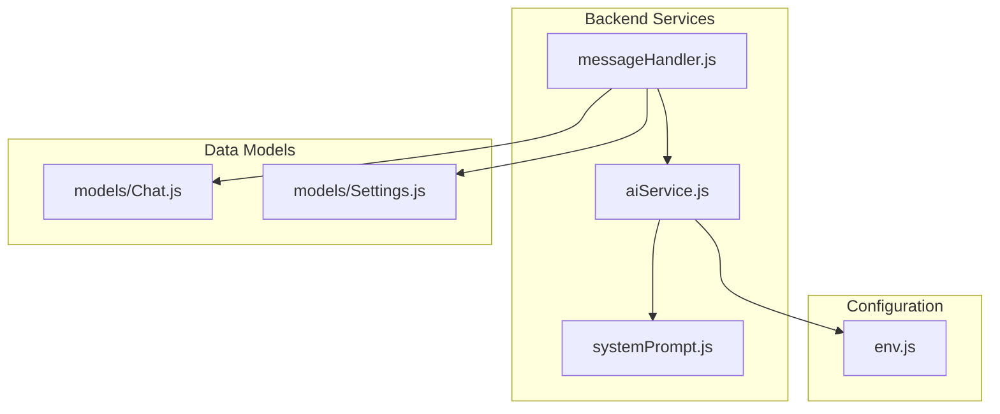
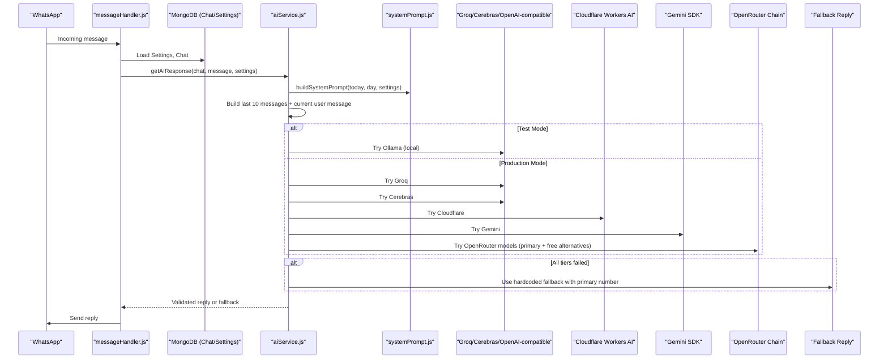
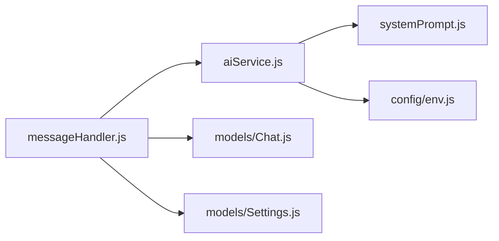

# AI Prompt Management

<cite>
**Referenced Files in This Document**
- [aiService.js](file://backend/src/services/aiService.js)
- [systemPrompt.js](file://backend/src/services/systemPrompt.js)
- [messageHandler.js](file://backend/src/services/messageHandler.js)
- [env.js](file://backend/src/config/env.js)
- [Chat.js](file://backend/src/models/Chat.js)
- [Settings.js](file://backend/src/models/Settings.js)
</cite>

## Table of Contents
1. [Introduction](#introduction)
2. [Project Structure](#project-structure)
3. [Core Components](#core-components)
4. [Architecture Overview](#architecture-overview)
5. [Detailed Component Analysis](#detailed-component-analysis)
6. [Dependency Analysis](#dependency-analysis)
7. [Performance Considerations](#performance-considerations)
8. [Troubleshooting Guide](#troubleshooting-guide)
9. [Conclusion](#conclusion)
10. [Appendices](#appendices)

## Introduction
This document explains the AI prompt management system used by the Nandibaag Resort WhatsApp bot. It covers how context-aware prompts are engineered, how conversation and business context is injected into prompts, how multiple AI providers are integrated with a robust fallback strategy, and how responses are sanitized, validated, and length-limited for WhatsApp delivery. It also documents configuration options for model selection, provider credentials, and testing modes.

## Project Structure
The AI prompt management spans three core backend modules:
- System prompt builder that constructs resort-specific instructions and rules
- AI service orchestrator that builds messages, calls providers, validates outputs, and applies fallbacks
- Message handler that wires chat history, settings, and language detection into the AI pipeline

**Diagram sources**
- [messageHandler.js:1-183](file://backend/src/services/messageHandler.js#L1-L183)
- [aiService.js:838-1030](file://backend/src/services/aiService.js#L838-L1030)
- [systemPrompt.js:1-94](file://backend/src/services/systemPrompt.js#L1-L94)
- [env.js:1-95](file://backend/src/config/env.js#L1-L95)
- [Chat.js:1-107](file://backend/src/models/Chat.js#L1-L107)
- [Settings.js:1-38](file://backend/src/models/Settings.js#L1-L38)

**Section sources**
- [messageHandler.js:1-183](file://backend/src/services/messageHandler.js#L1-L183)
- [aiService.js:838-1030](file://backend/src/services/aiService.js#L838-L1030)
- [systemPrompt.js:1-94](file://backend/src/services/systemPrompt.js#L1-L94)
- [env.js:1-95](file://backend/src/config/env.js#L1-L95)
- [Chat.js:1-107](file://backend/src/models/Chat.js#L1-L107)
- [Settings.js:1-38](file://backend/src/models/Settings.js#L1-L38)

## Core Components
- System prompt builder: Produces role definition, business rules, pricing, facilities, policies, link-sharing rules, language guidance, conversation flow, formatting constraints, and fallback phrasing. It injects dynamic date/day-of-week and active contact numbers from Settings.
- AI service orchestrator: Builds message history (last 10), attaches the system prompt, executes a tiered provider chain, sanitizes and validates replies, enforces length limits, caches FAQ answers, and falls back to a safe message when all tiers fail.
- Message handler: Loads Settings, persists chat history, detects language, triggers AI generation, sends WhatsApp reply, scores leads, and schedules follow-ups.

Key responsibilities:
- Context injection: Date, day-of-week, active contacts, last 10 messages, booking stage
- Provider integration: Groq, Cerebras, Cloudflare Workers AI, Gemini, OpenRouter multi-model chain, plus local Ollama in test mode
- Output quality: Sanitization, validation, length enforcement, language detection
- Resilience: Tiered fallback, per-provider metrics, startup checks

**Section sources**
- [systemPrompt.js:1-94](file://backend/src/services/systemPrompt.js#L1-L94)
- [aiService.js:838-1030](file://backend/src/services/aiService.js#L838-L1030)
- [messageHandler.js:1-183](file://backend/src/services/messageHandler.js#L1-L183)

## Architecture Overview
End-to-end flow from incoming WhatsApp message to AI response or fallback:

**Diagram sources**
- [messageHandler.js:22-178](file://backend/src/services/messageHandler.js#L22-L178)
- [aiService.js:838-1030](file://backend/src/services/aiService.js#L838-L1030)
- [systemPrompt.js:9-91](file://backend/src/services/systemPrompt.js#L9-L91)

## Detailed Component Analysis

### System Prompt Engineering
The system prompt defines:
- Role identity and tone: Front-desk staff persona, natural greetings, no “I am AI” disclosures
- Business rules: Pricing (no GST), weekday vs weekend, kids pricing, optional picnic room upgrade guidance, pickup costs
- Facilities and activities: Pool, kayaking, games, DJ, buffet, cafe hours, pet-friendly, pure veg/Jain food
- Policies: Non-veg prohibition, BYOB alcohol, married-only couples policy, ID requirements, cancellation/reschedule rules
- Link sharing rules: When to include room gallery, Instagram, maps, website links
- Language rules: Auto-detect and reply in customer’s language; examples for Hinglish/Hindi/Marathi/English/Gujarati; banned translated-sounding words
- Conversation flow: Step-by-step booking funnel with one question at a time and line-length constraints
- Formatting rules: Plain text only, minimal emojis, short lines, no markdown or reasoning tags
- Fallback phrasing: Safe handoff to human team with phone number

Dynamic context injection:
- Today’s full date string and day-of-week
- Active WhatsApp numbers and primary number derived from Settings

Customization points:
- Add/remove facility details, policies, pricing, and link targets via the prompt builder
- Adjust greeting style and banned words list
- Update fallback message content and phone number resolution logic

**Section sources**
- [systemPrompt.js:9-91](file://backend/src/services/systemPrompt.js#L9-L91)
- [Settings.js:16-33](file://backend/src/models/Settings.js#L16-L33)

### Context Injection Mechanisms
- Conversation history: Last 10 messages are included as alternating user/assistant turns to maintain continuity without token bloat
- Current input: The latest customer message appended as the final user turn
- Dynamic date/time: Full date and day-of-week injected into the system prompt for accurate weekday/weekend pricing decisions
- Booking stage awareness: Used to decide whether to cache responses (FAQ vs booking queries)
- Settings-driven data: Active and primary WhatsApp numbers influence prompt content and fallback behavior

Implementation highlights:
- History trimming to last 10 messages
- Mapping sender roles to OpenAI-style roles
- Building system prompt with today’s date and settings

**Section sources**
- [aiService.js:855-883](file://backend/src/services/aiService.js#L855-L883)
- [aiService.js:838-854](file://backend/src/services/aiService.js#L838-L854)
- [Chat.js:45-94](file://backend/src/models/Chat.js#L45-L94)

### Provider Integration and Fallback Strategy
Providers and order:
- Test mode: Ollama (local) then hardcoded fallback
- Production mode:
  - Tier 1: Groq (OpenAI-compatible)
  - Tier 2: Cerebras (OpenAI-compatible)
  - Tier 3: Cloudflare Workers AI (REST API)
  - Tier 4: Google Gemini (official SDK)
  - Tier 5: OpenRouter multi-model chain (primary + two free models)
  - Final fallback: Hardcoded safe message with primary number

Each call:
- Uses an AbortController timeout (default 8 seconds)
- Sanitizes output (removes reasoning tags, markdown, bold, headers, links)
- Enforces length limits (max 4 lines, ~500 chars; truncates at sentence boundary if needed)
- Validates reply against script, markdown leakage, repeated words, English whitelist/blacklist, and truncated word patterns
- Records per-provider metrics (success/invalid/error counts and average latency)

Provider-specific adapters:
- OpenAI-compatible clients: Groq, Cerebras, OpenRouter, Ollama
- Gemini adapter: Converts internal messages to Gemini contents format and uses systemInstruction
- Cloudflare adapter: REST endpoint with account ID and token, expects simple messages array

**Section sources**
- [aiService.js:649-727](file://backend/src/services/aiService.js#L649-L727)
- [aiService.js:734-774](file://backend/src/services/aiService.js#L734-L774)
- [aiService.js:781-821](file://backend/src/services/aiService.js#L781-L821)
- [aiService.js:838-995](file://backend/src/services/aiService.js#L838-L995)
- [aiService.js:997-1018](file://backend/src/services/aiService.js#L997-L1018)

### Response Validation and Sanitization
Sanitization steps:
- Remove reasoning tags (<thought>, <reasoning>)
- Strip markdown code blocks, bold, headers, links, and stray asterisks
- Trim whitespace

Length enforcement:
- Max 4 non-empty lines
- If over ~500 characters, trim at nearest sentence boundary up to 700 characters

Validation checks:
- Length boundaries (3–700 characters)
- Allowed scripts (ASCII, Devanagari, Gujarati, punctuation, emoji ranges)
- No leftover markdown or code syntax
- Repeated word duplication except allowed reduplications
- English word whitelist/blacklist to avoid technical jargon leaking into customer-facing replies
- Truncated Hinglish word pattern detection

Language detection:
- Heuristic based on Unicode ranges and common loanwords for dashboard/analytics

**Section sources**
- [aiService.js:213-270](file://backend/src/services/aiService.js#L213-L270)
- [aiService.js:275-289](file://backend/src/services/aiService.js#L275-L289)
- [aiService.js:477-546](file://backend/src/services/aiService.js#L477-L546)
- [aiService.js:553-588](file://backend/src/services/aiService.js#L553-L588)
- [aiService.js:594-637](file://backend/src/services/aiService.js#L594-L637)

### Configuration Options
Environment variables control provider keys, models, endpoints, and test mode:
- OpenRouter: key and primary model
- Gemini: key and model
- Ollama: base URL and model (test mode only)
- Groq: key, model, base URL
- Cloudflare: account ID, API token, model
- Cerebras: key and model

Startup validations:
- Warns if AI_TEST_MODE is enabled
- Validates fallback phone number presence and numeric format

Note on temperature and tokens:
- Providers use fixed parameters within their adapters (e.g., temperature around 0.7, max tokens capped). These are not exposed as runtime toggles in the current implementation.

**Section sources**
- [env.js:1-95](file://backend/src/config/env.js#L1-L95)
- [aiService.js:1032-1052](file://backend/src/services/aiService.js#L1032-L1052)
- [aiService.js:649-679](file://backend/src/services/aiService.js#L649-L679)
- [aiService.js:734-744](file://backend/src/services/aiService.js#L734-L744)
- [aiService.js:781-790](file://backend/src/services/aiService.js#L781-L790)

### Data Flow and State
- Chat model stores conversation history, language, booking stage, draft booking fields, and flags like isNewConversation and isArchived
- Settings model holds global mode default, WhatsApp numbers (active/primary), and feature toggles
- Message handler updates chat state, cancels pending follow-ups on customer reply, and emits socket events for human mode

**Section sources**
- [Chat.js:1-107](file://backend/src/models/Chat.js#L1-L107)
- [Settings.js:1-38](file://backend/src/models/Settings.js#L1-L38)
- [messageHandler.js:22-178](file://backend/src/services/messageHandler.js#L22-L178)

## Dependency Analysis
High-level dependencies among AI prompt components:

**Diagram sources**
- [messageHandler.js:1-183](file://backend/src/services/messageHandler.js#L1-L183)
- [aiService.js:1-12](file://backend/src/services/aiService.js#L1-L12)
- [systemPrompt.js:1-94](file://backend/src/services/systemPrompt.js#L1-L94)
- [env.js:1-95](file://backend/src/config/env.js#L1-L95)
- [Chat.js:1-107](file://backend/src/models/Chat.js#L1-L107)
- [Settings.js:1-38](file://backend/src/models/Settings.js#L1-L38)

**Section sources**
- [messageHandler.js:1-183](file://backend/src/services/messageHandler.js#L1-L183)
- [aiService.js:1-12](file://backend/src/services/aiService.js#L1-L12)
- [systemPrompt.js:1-94](file://backend/src/services/systemPrompt.js#L1-L94)
- [env.js:1-95](file://backend/src/config/env.js#L1-L95)
- [Chat.js:1-107](file://backend/src/models/Chat.js#L1-L107)
- [Settings.js:1-38](file://backend/src/models/Settings.js#L1-L38)

## Performance Considerations
- Conversation history limited to last 10 messages to reduce token usage and latency
- In-memory FAQ cache with 5-minute TTL for non-booking queries reduces provider calls
- Per-provider timeouts prevent long hangs
- Metrics tracking helps identify slow or failing providers
- Sanitization and validation run once per response to ensure consistent output size and safety

[No sources needed since this section provides general guidance]

## Troubleshooting Guide
Common issues and diagnostics:
- Invalid/corrupted replies: Logs include rejection reasons (too short/long, unexpected script, markdown leakage, repeated words, common English words, truncated words)
- Provider failures: Logs capture reason categories (timeout, rate limit, server error) and full error details
- Empty responses: Handled explicitly before validation
- Fallback activation: When all tiers fail, a safe message with the primary number is returned
- Startup warnings: AI_TEST_MODE enabled warning and invalid fallback phone number warning

Operational tips:
- Check logs for “[TIMING]” and “[DIAGNOSTIC]” entries to trace request/response lifecycle
- Verify environment variables for each provider
- Ensure primary WhatsApp number is numeric and set in Settings or environment

**Section sources**
- [aiService.js:697-727](file://backend/src/services/aiService.js#L697-L727)
- [aiService.js:747-774](file://backend/src/services/aiService.js#L747-L774)
- [aiService.js:794-821](file://backend/src/services/aiService.js#L794-L821)
- [aiService.js:997-1018](file://backend/src/services/aiService.js#L997-L1018)
- [aiService.js:1032-1052](file://backend/src/services/aiService.js#L1032-L1052)

## Conclusion
The AI prompt management system combines a carefully engineered system prompt with a resilient, multi-provider orchestration layer. It injects timely context (date, day-of-week, recent conversation), enforces business rules and formatting constraints, and ensures high-quality, safe outputs through rigorous sanitization and validation. The tiered fallback strategy and startup checks provide operational resilience, while configuration options allow customization across providers and environments.

[No sources needed since this section summarizes without analyzing specific files]

## Appendices

### Prompt Template Structure
- Role and identity: Staff persona, greeting norms, no AI disclosures
- Business info: Name, address, ratings, check-in/out times, contacts, website, Instagram, maps
- Pricing: Group, couple, kids, one-day picnic, optional room upgrade, pickup costs, weekday/weekend distinction
- Facilities and activities: Amenities, dining, events hosting
- Policies: Non-veg ban, BYOB, married-only couples, ID proof, cancellation/reschedule rules
- Link sharing rules: When to include room gallery, Instagram, maps, website
- Language rules: Auto-detect language, examples, banned translated words
- Conversation flow: One question at a time, stepwise booking funnel
- Formatting rules: Plain text, minimal emojis, short lines, no markdown/reasoning tags
- Fallback: Safe handoff with phone number

**Section sources**
- [systemPrompt.js:19-90](file://backend/src/services/systemPrompt.js#L19-L90)

### Context Variables Injected into Prompts
- todayDateString: Full formatted date string
- dayOfWeek: Day name
- whatsappNumbers: Active and primary numbers from Settings
- messageHistory: Last 10 messages mapped to user/assistant roles
- bookingStage: Determines caching behavior

**Section sources**
- [aiService.js:855-883](file://backend/src/services/aiService.js#L855-L883)
- [systemPrompt.js:10-18](file://backend/src/services/systemPrompt.js#L10-L18)

### Customization Scenarios
- Update pricing or policies: Edit the relevant sections in the system prompt builder
- Change link targets: Modify URLs for rooms, Instagram, maps, website
- Adjust banned words or language examples: Update the language rules section
- Add new provider: Implement a new adapter and integrate it into the tier chain
- Enable test mode: Set AI_TEST_MODE to true to use local Ollama only

**Section sources**
- [systemPrompt.js:19-90](file://backend/src/services/systemPrompt.js#L19-L90)
- [env.js:21-46](file://backend/src/config/env.js#L21-L46)
- [aiService.js:887-995](file://backend/src/services/aiService.js#L887-L995)