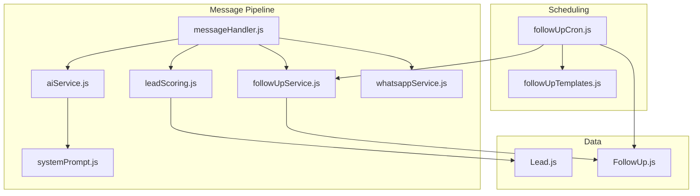
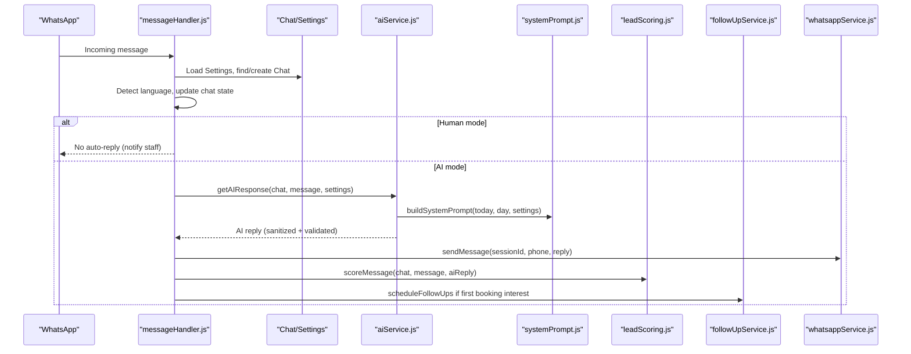
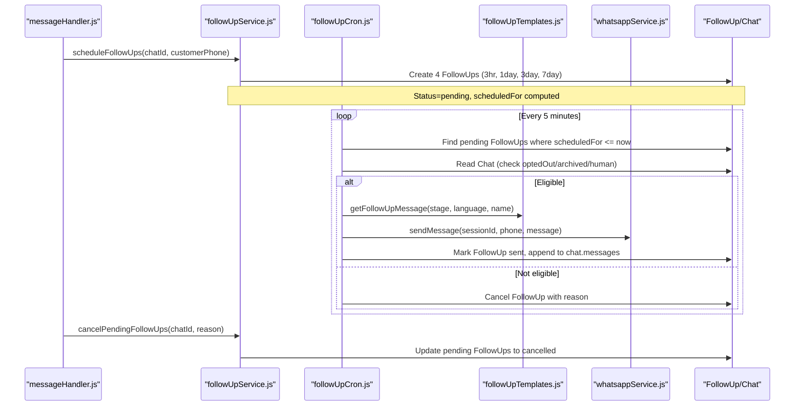
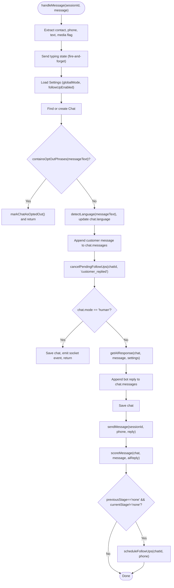
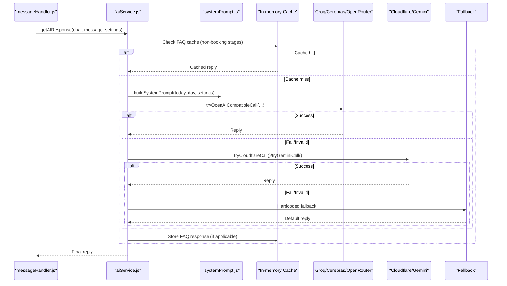
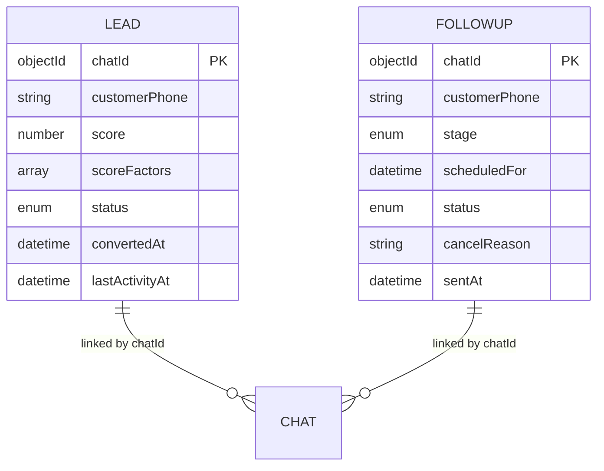
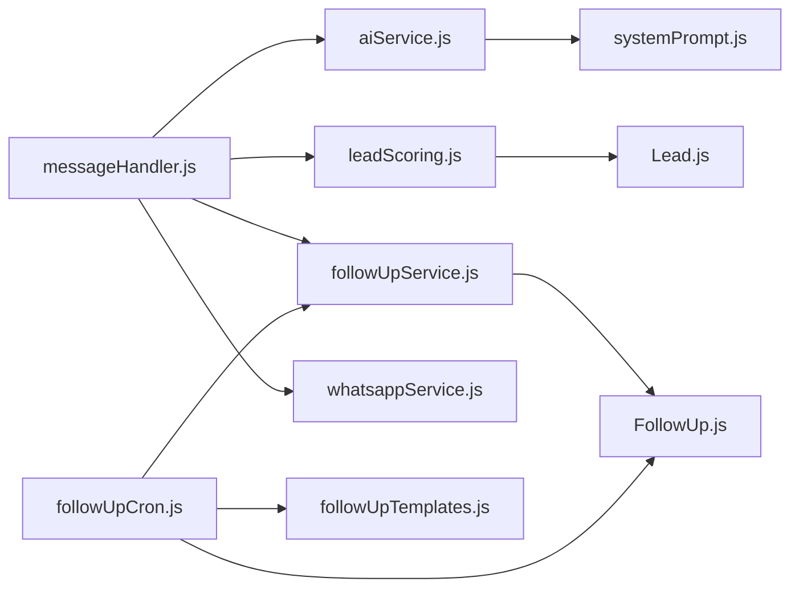

# Business Logic Services

<cite>
**Referenced Files in This Document**
- [messageHandler.js](file://backend/src/services/messageHandler.js)
- [aiService.js](file://backend/src/services/aiService.js)
- [systemPrompt.js](file://backend/src/services/systemPrompt.js)
- [leadScoring.js](file://backend/src/services/leadScoring.js)
- [followUpService.js](file://backend/src/services/followUpService.js)
- [followUpCron.js](file://backend/src/services/followUpCron.js)
- [followUpTemplates.js](file://backend/src/utils/followUpTemplates.js)
- [Lead.js](file://backend/src/models/Lead.js)
- [FollowUp.js](file://backend/src/models/FollowUp.js)
</cite>

## Table of Contents
1. [Introduction](#introduction)
2. [Project Structure](#project-structure)
3. [Core Components](#core-components)
4. [Architecture Overview](#architecture-overview)
5. [Detailed Component Analysis](#detailed-component-analysis)
6. [Dependency Analysis](#dependency-analysis)
7. [Performance Considerations](#performance-considerations)
8. [Troubleshooting Guide](#troubleshooting-guide)
9. [Conclusion](#conclusion)
10. [Appendices](#appendices)

## Introduction
This document explains the core business logic services that power the WhatsApp resort booking assistant. It covers:
- Lead scoring algorithm that automatically categorizes customers based on conversation signals and engagement patterns
- Follow-up scheduling system with intelligent timing, template-based messaging, and cancellation logic
- Message processing pipeline including conversation state management, booking flow automation, and human-in-the-loop mode switching
- System prompt engineering for AI responses and context-aware conversation handling
- Configuration options, customization points, and extension mechanisms for business rules

## Project Structure
The business logic is implemented as modular services under backend/src/services, with supporting utilities and models:
- messageHandler.js orchestrates incoming messages, mode routing, AI response generation, lead scoring, and follow-up scheduling
- aiService.js implements a multi-tiered AI provider chain with caching, sanitization, validation, and health metrics
- systemPrompt.js builds the dynamic system prompt used by all AI providers
- leadScoring.js computes lead scores and status transitions from conversation signals
- followUpService.js schedules and cancels follow-ups; followUpCron.js executes scheduled follow-ups using templates
- Models (Lead.js, FollowUp.js) define persistent data structures and indexes

**Diagram sources**
- [messageHandler.js:1-183](file://backend/src/services/messageHandler.js#L1-L183)
- [aiService.js:838-1030](file://backend/src/services/aiService.js#L838-L1030)
- [systemPrompt.js:9-91](file://backend/src/services/systemPrompt.js#L9-L91)
- [leadScoring.js:38-163](file://backend/src/services/leadScoring.js#L38-L163)
- [followUpService.js:18-90](file://backend/src/services/followUpService.js#L18-L90)
- [followUpCron.js:127-163](file://backend/src/services/followUpCron.js#L127-L163)
- [followUpTemplates.js:19-58](file://backend/src/utils/followUpTemplates.js#L19-L58)
- [Lead.js:12-54](file://backend/src/models/Lead.js#L12-L54)
- [FollowUp.js:3-48](file://backend/src/models/FollowUp.js#L3-L48)

**Section sources**
- [messageHandler.js:1-183](file://backend/src/services/messageHandler.js#L1-L183)
- [aiService.js:838-1030](file://backend/src/services/aiService.js#L838-L1030)
- [systemPrompt.js:9-91](file://backend/src/services/systemPrompt.js#L9-L91)
- [leadScoring.js:38-163](file://backend/src/services/leadScoring.js#L38-L163)
- [followUpService.js:18-90](file://backend/src/services/followUpService.js#L18-L90)
- [followUpCron.js:127-163](file://backend/src/services/followUpCron.js#L127-L163)
- [followUpTemplates.js:19-58](file://backend/src/utils/followUpTemplates.js#L19-L58)
- [Lead.js:12-54](file://backend/src/models/Lead.js#L12-L54)
- [FollowUp.js:3-48](file://backend/src/models/FollowUp.js#L3-L48)

## Core Components
- Message Handler: Central router for incoming WhatsApp messages, manages chat lifecycle, language detection, opt-out handling, AI/human mode, and triggers scoring and follow-up scheduling.
- AI Service: Multi-tiered provider chain with caching, sanitization, length enforcement, reply validation, and per-provider health metrics.
- System Prompt Builder: Generates a comprehensive, context-aware system prompt with resort info, pricing, policies, link-sharing rules, and conversation flow guidance.
- Lead Scoring: Computes numeric score and status (cold/warm/hot/converted) based on keyword and pattern matching against customer messages and conversation stage progression.
- Follow-Up Scheduling: Creates time-based follow-up tasks, cancels them on engagement or conversion, and sends templated messages via cron job.

**Section sources**
- [messageHandler.js:22-178](file://backend/src/services/messageHandler.js#L22-L178)
- [aiService.js:838-1030](file://backend/src/services/aiService.js#L838-L1030)
- [systemPrompt.js:9-91](file://backend/src/services/systemPrompt.js#L9-L91)
- [leadScoring.js:38-163](file://backend/src/services/leadScoring.js#L38-L163)
- [followUpService.js:18-90](file://backend/src/services/followUpService.js#L18-L90)
- [followUpCron.js:127-163](file://backend/src/services/followUpCron.js#L127-L163)

## Architecture Overview
End-to-end flow from incoming message to outbound reply and downstream actions:

**Diagram sources**
- [messageHandler.js:22-178](file://backend/src/services/messageHandler.js#L22-L178)
- [aiService.js:838-1030](file://backend/src/services/aiService.js#L838-L1030)
- [systemPrompt.js:9-91](file://backend/src/services/systemPrompt.js#L9-L91)
- [leadScoring.js:38-163](file://backend/src/services/leadScoring.js#L38-L163)
- [followUpService.js:18-90](file://backend/src/services/followUpService.js#L18-L90)

## Detailed Component Analysis

### Lead Scoring Algorithm
The lead scoring service evaluates each incoming message to increment a numeric score and derive a status category. Signals include:
- Pricing/cost inquiries (+15)
- Specific date provided (+25)
- Guest count provided (+15)
- Booking stage progression to price_quoted (+10, once)
- Name provided (+15, once)
- Phone number provided (+20, once)
- Browsing photos/location (+5)
- Explicit booking intent phrases (+30)

Status mapping:
- 0–30: cold
- 31–60: warm
- 61–100: hot
- Converted leads are marked converted with score set to maximum.

On crossing the hot threshold for the first time, an alert event is emitted to the dashboard.

```mermaid
flowchart TD
Start(["scoreMessage(chat, incomingMessage, aiReply)"]) --> FindLead["Find or create Lead by chatId"]
FindLead --> Init["Initialize previousScore/status, pointsAdded=0, newFactors=[]"]
Init --> CheckPricing{"Contains pricing keywords?"}
CheckPricing --> |Yes| AddPricing["+15, add factor 'asked_pricing'"]
CheckPricing --> |No| Next1["Next signal check"]
AddPricing --> Next1
Next1 --> CheckDate{"Contains date-like pattern?"}
CheckDate --> |Yes| AddDate["+25, add factor 'gave_date'"]
CheckDate --> |No| Next2["Next signal check"]
AddDate --> Next2
Next2 --> CheckGuests{"Contains guest count?"}
CheckGuests --> |Yes| AddGuests["+15, add factor 'gave_guest_count'"]
CheckGuests --> |No| Next3["Next signal check"]
AddGuests --> Next3
Next3 --> CheckStage{"chat.bookingStage == 'price_quoted' and not already added?"}
CheckStage --> |Yes| AddStage["+10, add factor 'reached_price_quoted'"]
CheckStage --> |No| Next4["Next signal check"]
AddStage --> Next4
Next4 --> CheckName{"Contains name pattern and length > 10 and not already added?"}
CheckName --> |Yes| AddName["+15, add factor 'gave_name'"]
CheckName --> |No| Next5["Next signal check"]
AddName --> Next5
Next5 --> CheckPhone{"Contains 10-digit phone and not already added?"}
CheckPhone --> |Yes| AddPhone["+20, add factor 'gave_phone'"]
CheckPhone --> |No| Next6["Next signal check"]
AddPhone --> Next6
Next6 --> CheckBrowse{"Contains browsing keywords?"}
CheckBrowse --> |Yes| AddBrowse["+5, add factor 'browsing_photos_location'"]
CheckBrowse --> |No| Next7["Next signal check"]
AddBrowse --> Next7
Next7 --> CheckIntent{"Contains booking intent phrases?"}
CheckIntent --> |Yes| AddIntent["+30, add factor 'booking_intent'"]
CheckIntent --> |No| Update["Update lastActivityAt and save"]
AddIntent --> Update
Update --> PointsAdded{"pointsAdded > 0?"}
PointsAdded --> |Yes| Apply["Add points, push factors, clamp to 100, update status"]
PointsAdded --> |No| End(["Return Lead"])
Apply --> HotCheck{"Crossed 60 for first time?"}
HotCheck --> |Yes| Alert["Emit hot lead alert"]
HotCheck --> |No| Save["Save Lead"]
Alert --> Save
Save --> End
```

**Diagram sources**
- [leadScoring.js:38-163](file://backend/src/services/leadScoring.js#L38-L163)

**Section sources**
- [leadScoring.js:38-163](file://backend/src/services/leadScoring.js#L38-L163)
- [Lead.js:12-54](file://backend/src/models/Lead.js#L12-L54)

### Follow-Up Scheduling System
The follow-up system creates four scheduled reminders at 3 hours, 1 day, 3 days, and 7 days after initial booking interest. Each follow-up is persisted and processed by a cron job every 5 minutes. Cancellation occurs when:
- Customer replies (engagement)
- A booking is created
- Customer opts out
- Staff takes over (human mode)

Messages are generated from language-aware templates and sent via WhatsApp. Stale follow-ups (>24h past due) are cancelled.

**Diagram sources**
- [followUpService.js:18-90](file://backend/src/services/followUpService.js#L18-L90)
- [followUpCron.js:127-163](file://backend/src/services/followUpCron.js#L127-L163)
- [followUpTemplates.js:19-58](file://backend/src/utils/followUpTemplates.js#L19-L58)
- [FollowUp.js:3-48](file://backend/src/models/FollowUp.js#L3-L48)

**Section sources**
- [followUpService.js:18-90](file://backend/src/services/followUpService.js#L18-L90)
- [followUpCron.js:127-163](file://backend/src/services/followUpCron.js#L127-L163)
- [followUpTemplates.js:19-58](file://backend/src/utils/followUpTemplates.js#L19-L58)
- [FollowUp.js:3-48](file://backend/src/models/FollowUp.js#L3-L48)

### Message Processing Pipeline
The message handler performs:
- Chat lookup or creation with defaults (mode from global settings, language unknown, bookingStage none)
- Opt-out detection and immediate cancellation of follow-ups
- Language detection and update
- Append customer message to chat history
- Mode routing:
  - Human mode: no auto-reply, notify staff via socket
  - AI mode: generate response, send via WhatsApp, score lead, schedule follow-ups on first booking interest

**Diagram sources**
- [messageHandler.js:22-178](file://backend/src/services/messageHandler.js#L22-L178)
- [aiService.js:838-1030](file://backend/src/services/aiService.js#L838-L1030)
- [leadScoring.js:38-163](file://backend/src/services/leadScoring.js#L38-L163)
- [followUpService.js:18-90](file://backend/src/services/followUpService.js#L18-L90)

**Section sources**
- [messageHandler.js:22-178](file://backend/src/services/messageHandler.js#L22-L178)

### AI Response Generation and Context-Aware Handling
The AI service constructs a system prompt and runs a tiered provider chain:
- Test mode: Ollama only, then hardcoded fallback
- Production mode: Groq → Cerebras → Cloudflare Workers AI → Gemini → OpenRouter multi-model chain → hardcoded fallback
- FAQ cache for non-booking queries (TTL 5 minutes)
- Sanitization removes reasoning tags and markdown; length limits enforced; reply validation ensures safe output
- Per-provider health metrics tracked hourly

**Diagram sources**
- [aiService.js:838-1030](file://backend/src/services/aiService.js#L838-L1030)
- [systemPrompt.js:9-91](file://backend/src/services/systemPrompt.js#L9-L91)

**Section sources**
- [aiService.js:838-1030](file://backend/src/services/aiService.js#L838-L1030)
- [systemPrompt.js:9-91](file://backend/src/services/systemPrompt.js#L9-L91)

### System Prompt Engineering
The system prompt builder injects:
- Identity and tone guidelines
- Resort details, contacts, website, gallery, maps links
- Pricing structure and rules (no GST, weekday vs weekend, optional picnic room upgrade)
- Facilities and activities, with link-sharing directives
- Policies (veg-only, alcohol BYOB, couple policy, cancellation terms)
- Link sharing rules tied to topics
- Language rules and banned words
- Conversation flow steps (one question at a time, max lines)
- Negotiation guidance and vulgar language handling
- Formatting constraints and fallback behavior

Customization points:
- Active numbers and primary number selection
- Pricing and facility descriptions
- Link targets
- Language examples and banned words
- Conversation flow steps

**Section sources**
- [systemPrompt.js:9-91](file://backend/src/services/systemPrompt.js#L9-L91)

### Data Models
Key entities and relationships:

**Diagram sources**
- [Lead.js:12-54](file://backend/src/models/Lead.js#L12-L54)
- [FollowUp.js:3-48](file://backend/src/models/FollowUp.js#L3-L48)

**Section sources**
- [Lead.js:12-54](file://backend/src/models/Lead.js#L12-L54)
- [FollowUp.js:3-48](file://backend/src/models/FollowUp.js#L3-L48)

## Dependency Analysis
High-level dependencies between services and models:

**Diagram sources**
- [messageHandler.js:1-183](file://backend/src/services/messageHandler.js#L1-L183)
- [aiService.js:838-1030](file://backend/src/services/aiService.js#L838-L1030)
- [systemPrompt.js:9-91](file://backend/src/services/systemPrompt.js#L9-L91)
- [leadScoring.js:38-163](file://backend/src/services/leadScoring.js#L38-L163)
- [followUpService.js:18-90](file://backend/src/services/followUpService.js#L18-L90)
- [followUpCron.js:127-163](file://backend/src/services/followUpCron.js#L127-L163)
- [followUpTemplates.js:19-58](file://backend/src/utils/followUpTemplates.js#L19-L58)
- [Lead.js:12-54](file://backend/src/models/Lead.js#L12-L54)
- [FollowUp.js:3-48](file://backend/src/models/FollowUp.js#L3-L48)

**Section sources**
- [messageHandler.js:1-183](file://backend/src/services/messageHandler.js#L1-L183)
- [aiService.js:838-1030](file://backend/src/services/aiService.js#L838-L1030)
- [systemPrompt.js:9-91](file://backend/src/services/systemPrompt.js#L9-L91)
- [leadScoring.js:38-163](file://backend/src/services/leadScoring.js#L38-L163)
- [followUpService.js:18-90](file://backend/src/services/followUpService.js#L18-L90)
- [followUpCron.js:127-163](file://backend/src/services/followUpCron.js#L127-L163)
- [followUpTemplates.js:19-58](file://backend/src/utils/followUpTemplates.js#L19-L58)
- [Lead.js:12-54](file://backend/src/models/Lead.js#L12-L54)
- [FollowUp.js:3-48](file://backend/src/models/FollowUp.js#L3-L48)

## Performance Considerations
- AI provider chain uses timeouts and retries across diverse infrastructures to improve resilience and reduce latency.
- In-memory FAQ cache reduces repeated API calls for static questions; it is disabled for booking-related queries to ensure freshness.
- Message history is trimmed to the last 10 messages to optimize token usage and speed.
- Cron job processes follow-ups sequentially to avoid overwhelming WhatsApp APIs.
- Health metrics per provider are tracked hourly to monitor success rates and average latency.

[No sources needed since this section provides general guidance]

## Troubleshooting Guide
Common issues and diagnostics:
- AI failures: When all tiers fail, a default fallback message is used and an AI failure alert is emitted to the dashboard.
- Invalid outputs: The reply validator rejects malformed or unsafe responses; logs include rejection reasons for debugging.
- Opt-outs: If a user requests to stop messages, follow-ups are cancelled immediately and the chat is marked opted out.
- Stale follow-ups: Follow-ups older than 24 hours past due are cancelled to prevent sending outdated messages.
- Session connectivity: If WhatsApp session is not connected, follow-up sends are skipped and retried next tick.

**Section sources**
- [messageHandler.js:163-178](file://backend/src/services/messageHandler.js#L163-L178)
- [aiService.js:998-1030](file://backend/src/services/aiService.js#L998-L1030)
- [followUpService.js:75-118](file://backend/src/services/followUpService.js#L75-L118)
- [followUpCron.js:58-70](file://backend/src/services/followUpCron.js#L58-L70)

## Conclusion
The business logic services implement a robust, extensible system for automated WhatsApp conversations:
- Lead scoring captures engagement signals and updates statuses in real time
- Follow-up scheduling drives re-engagement with timely, templated messages
- The message pipeline supports both AI and human modes with clear handoff points
- AI response generation is resilient, validated, and context-aware through a carefully engineered system prompt
- Configuration and extension points allow customization of prompts, scoring rules, and follow-up flows

[No sources needed since this section summarizes without analyzing specific files]

## Appendices

### Configuration Options and Customization Points
- Global mode and follow-up enablement are loaded from settings and influence message routing and cron execution.
- System prompt can be customized for resort info, pricing, facilities, policies, link-sharing rules, and conversation flow.
- Lead scoring weights and conditions can be extended by adding new signal checks and factors.
- Follow-up stages and delays can be adjusted by modifying scheduling logic and templates.
- AI provider configuration includes multiple backends; test mode allows local development with Ollama.

**Section sources**
- [messageHandler.js:49-74](file://backend/src/services/messageHandler.js#L49-L74)
- [systemPrompt.js:9-91](file://backend/src/services/systemPrompt.js#L9-L91)
- [leadScoring.js:62-132](file://backend/src/services/leadScoring.js#L62-L132)
- [followUpService.js:35-61](file://backend/src/services/followUpService.js#L35-L61)
- [aiService.js:838-995](file://backend/src/services/aiService.js#L838-L995)