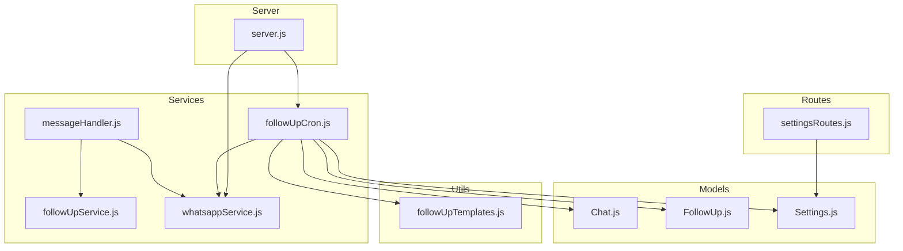
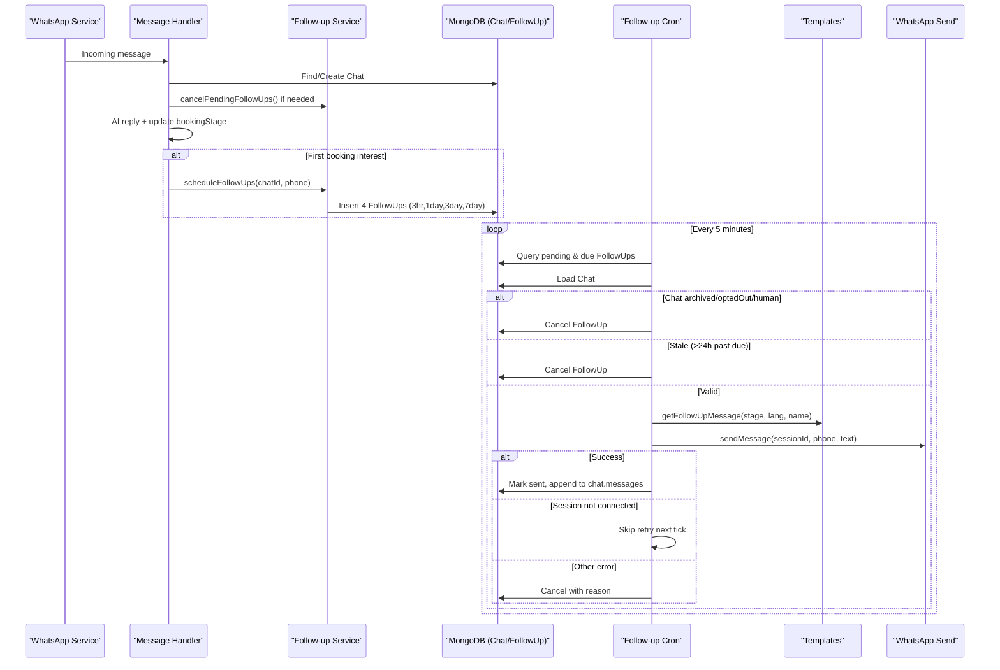
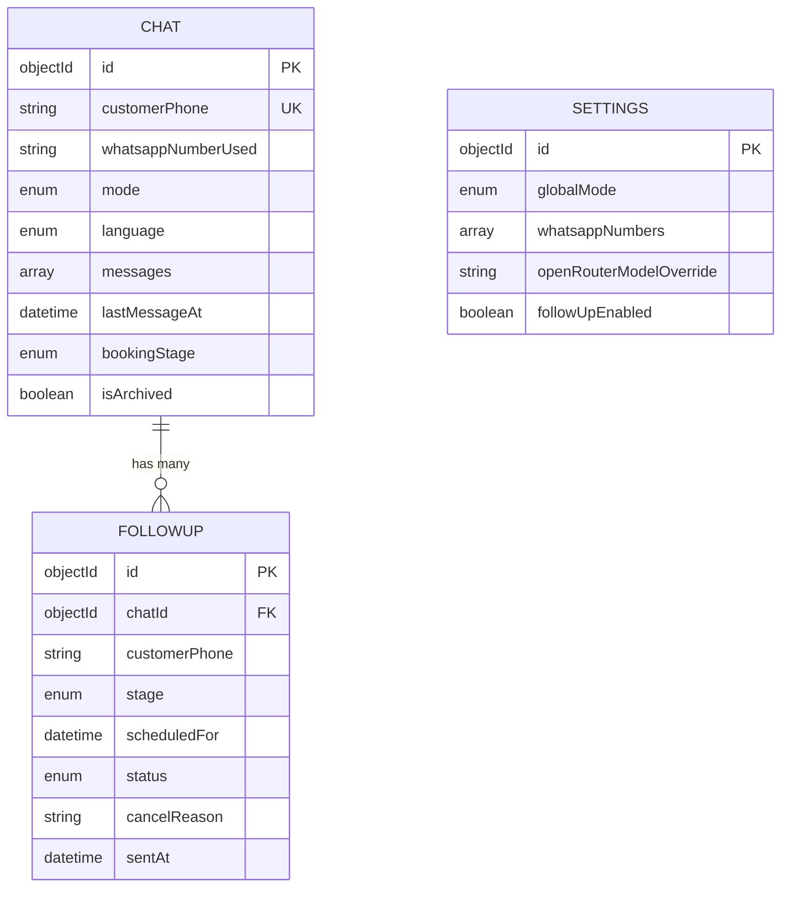
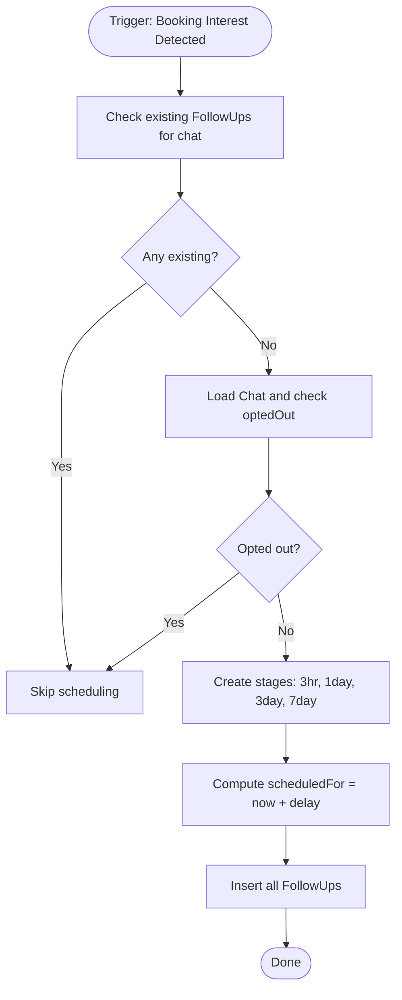
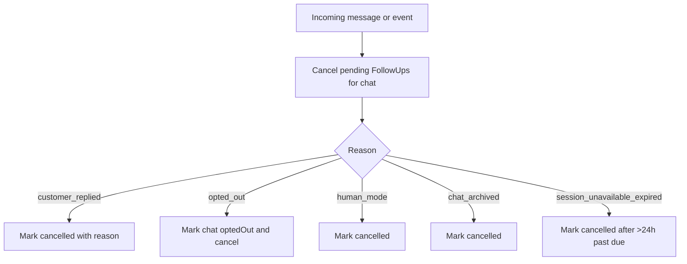
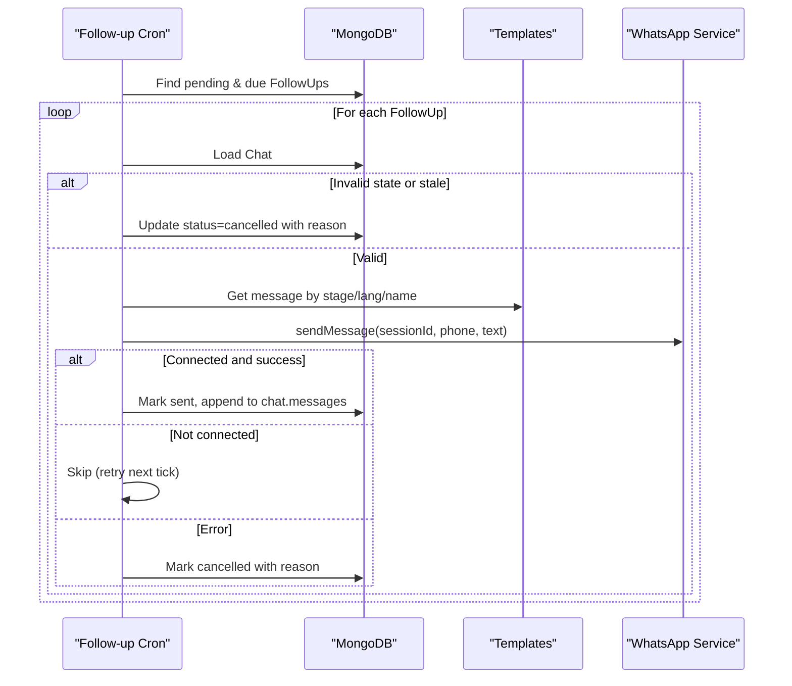
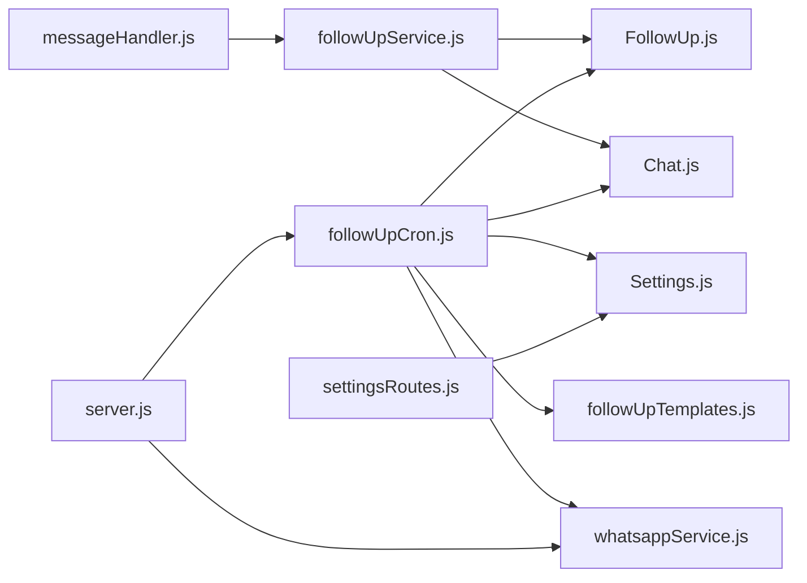

# Follow-up System

<cite>
**Referenced Files in This Document**
- [server.js](file://backend/src/server.js)
- [followUpService.js](file://backend/src/services/followUpService.js)
- [followUpCron.js](file://backend/src/services/followUpCron.js)
- [followUpTemplates.js](file://backend/src/utils/followUpTemplates.js)
- [Chat.js](file://backend/src/models/Chat.js)
- [FollowUp.js](file://backend/src/models/FollowUp.js)
- [Settings.js](file://backend/src/models/Settings.js)
- [settingsRoutes.js](file://backend/src/routes/settingsRoutes.js)
- [whatsappService.js](file://backend/src/services/whatsappService.js)
- [messageHandler.js](file://backend/src/services/messageHandler.js)
</cite>

## Table of Contents
1. [Introduction](#introduction)
2. [Project Structure](#project-structure)
3. [Core Components](#core-components)
4. [Architecture Overview](#architecture-overview)
5. [Detailed Component Analysis](#detailed-component-analysis)
6. [Dependency Analysis](#dependency-analysis)
7. [Performance Considerations](#performance-considerations)
8. [Troubleshooting Guide](#troubleshooting-guide)
9. [Conclusion](#conclusion)
10. [Appendices](#appendices)

## Introduction
This document explains the automated follow-up messaging system that proactively engages customers who show booking interest but do not complete a booking immediately. The system schedules intelligent follow-ups at 3-hour, 1-day, 3-day, and 7-day intervals, generates personalized messages using templates, and sends them via WhatsApp. It includes robust cancellation logic to prevent sending when conversations are active, bookings are completed, or customers opt out. Configuration is provided for enabling/disabling follow-ups and managing WhatsApp sessions. A cron job processes due follow-ups every 5 minutes with safeguards against stale entries and session unavailability.

## Project Structure
The follow-up system spans services, models, utilities, routes, and the server bootstrap:
- Services: scheduling, cron processing, WhatsApp delivery
- Models: Chat, FollowUp, Settings
- Utilities: message templates
- Routes: admin settings endpoints
- Server: initializes cron and integrates with WhatsApp sessions

**Diagram sources**
- [server.js:150-153](file://backend/src/server.js#L150-L153)
- [messageHandler.js:155-159](file://backend/src/services/messageHandler.js#L155-L159)
- [followUpService.js:18-61](file://backend/src/services/followUpService.js#L18-L61)
- [followUpCron.js:127-163](file://backend/src/services/followUpCron.js#L127-L163)
- [followUpTemplates.js:19-58](file://backend/src/utils/followUpTemplates.js#L19-L58)
- [whatsappService.js:466-508](file://backend/src/services/whatsappService.js#L466-L508)
- [settingsRoutes.js:86-110](file://backend/src/routes/settingsRoutes.js#L86-L110)

**Section sources**
- [server.js:150-153](file://backend/src/server.js#L150-L153)
- [messageHandler.js:155-159](file://backend/src/services/messageHandler.js#L155-L159)
- [followUpService.js:18-61](file://backend/src/services/followUpService.js#L18-L61)
- [followUpCron.js:127-163](file://backend/src/services/followUpCron.js#L127-L163)
- [followUpTemplates.js:19-58](file://backend/src/utils/followUpTemplates.js#L19-L58)
- [whatsappService.js:466-508](file://backend/src/services/whatsappService.js#L466-L508)
- [settingsRoutes.js:86-110](file://backend/src/routes/settingsRoutes.js#L86-L110)

## Core Components
- Scheduling service: creates four scheduled follow-ups (3hr, 1day, 3day, 7day) when a chat first shows booking interest; prevents duplicates and respects opt-out status.
- Cron processor: runs every 5 minutes, checks pending due follow-ups, validates chat state, generates templated messages, sends via WhatsApp, updates status, and appends to chat history.
- Templates utility: returns localized, stage-specific messages based on language and optional customer name.
- Cancellation logic: cancels pending follow-ups when the customer replies, opts out, conversation enters human mode, or when archived.
- Configuration: global enable/disable flag for follow-ups; WhatsApp session management; per-chat mode and language.

Key behaviors:
- Intelligent timing: fixed intervals relative to the moment booking interest is detected.
- Template-based generation: supports multiple languages and personalization by name.
- Robust cancellation: avoids spamming engaged or opted-out users.
- Resilient delivery: retries on transient failures, skips if session unavailable, marks stale entries as cancelled.

**Section sources**
- [followUpService.js:18-61](file://backend/src/services/followUpService.js#L18-L61)
- [followUpService.js:75-90](file://backend/src/services/followUpService.js#L75-L90)
- [followUpService.js:98-118](file://backend/src/services/followUpService.js#L98-L118)
- [followUpCron.js:33-122](file://backend/src/services/followUpCron.js#L33-L122)
- [followUpTemplates.js:19-58](file://backend/src/utils/followUpTemplates.js#L19-L58)
- [whatsappService.js:466-508](file://backend/src/services/whatsappService.js#L466-L508)
- [settingsRoutes.js:86-110](file://backend/src/routes/settingsRoutes.js#L86-L110)

## Architecture Overview
End-to-end flow from booking interest detection to follow-up delivery:

**Diagram sources**
- [messageHandler.js:155-159](file://backend/src/services/messageHandler.js#L155-L159)
- [followUpService.js:18-61](file://backend/src/services/followUpService.js#L18-L61)
- [followUpCron.js:127-163](file://backend/src/services/followUpCron.js#L127-L163)
- [followUpCron.js:33-122](file://backend/src/services/followUpCron.js#L33-L122)
- [followUpTemplates.js:19-58](file://backend/src/utils/followUpTemplates.js#L19-L58)
- [whatsappService.js:466-508](file://backend/src/services/whatsappService.js#L466-L508)

## Detailed Component Analysis

### Database Schema and Indexes
- FollowUp model tracks each scheduled message with fields for chat association, customer phone, stage, scheduled time, status, cancellation reason, and send timestamp. Multiple indexes optimize queries by chat, phone, scheduled time, status, and stage.
- Chat model stores conversation metadata including mode (ai/human), language, last message time, booking stage, and archive flag. These fields drive cancellation and routing decisions.
- Settings model holds global flags like followUpEnabled and WhatsApp number configurations used by both WhatsApp service and follow-up cron.

**Diagram sources**
- [FollowUp.js:3-48](file://backend/src/models/FollowUp.js#L3-L48)
- [Chat.js:45-97](file://backend/src/models/Chat.js#L45-L97)
- [Settings.js:16-33](file://backend/src/models/Settings.js#L16-L33)

**Section sources**
- [FollowUp.js:3-48](file://backend/src/models/FollowUp.js#L3-L48)
- [Chat.js:45-97](file://backend/src/models/Chat.js#L45-L97)
- [Settings.js:16-33](file://backend/src/models/Settings.js#L16-L33)

### Scheduling Logic and Intelligent Timing
- Trigger point: When a chat transitions from no booking interest to any booking interest, the system schedules four follow-ups at fixed offsets: 3 hours, 1 day, 3 days, and 7 days from now.
- Duplicate prevention: If follow-ups already exist for the chat, scheduling is skipped.
- Opt-out check: If the chat has opted out, scheduling is skipped.

**Diagram sources**
- [followUpService.js:18-61](file://backend/src/services/followUpService.js#L18-L61)
- [messageHandler.js:155-159](file://backend/src/services/messageHandler.js#L155-L159)

**Section sources**
- [followUpService.js:18-61](file://backend/src/services/followUpService.js#L18-L61)
- [messageHandler.js:155-159](file://backend/src/services/messageHandler.js#L155-L159)

### Template-Based Message Generation
- Stage-specific templates: Each stage (3hr, 1day, 3day, 7day) has tailored messages designed to be warm, concise, and conversational.
- Language support: Messages are available in multiple languages (e.g., Hindi, Marathi, English, Hinglish, Gujarati). Unknown languages fall back to English.
- Personalization: Optional customer name is inserted into greetings where applicable.

Usage patterns:
- The cron processor selects the appropriate template based on stage, chat language, and customer name.
- Templates can be extended by adding new language variants or stages within the utility.

**Section sources**
- [followUpTemplates.js:19-58](file://backend/src/utils/followUpTemplates.js#L19-L58)
- [followUpCron.js:72-77](file://backend/src/services/followUpCron.js#L72-L77)

### Cancellation Logic
Follow-ups are cancelled when:
- Customer replies: Engagement indicates no need for automated nudges.
- Opt-out phrases detected: Immediate opt-out handling sets chat optedOut and cancels pending follow-ups.
- Human takeover: When chat mode is set to human, automated follow-ups stop.
- Archive: Archived chats are excluded from follow-ups.
- Staleness: If a follow-up is more than 24 hours past its scheduled time, it is marked cancelled to avoid sending outdated messages.

**Diagram sources**
- [followUpService.js:75-90](file://backend/src/services/followUpService.js#L75-L90)
- [followUpService.js:98-118](file://backend/src/services/followUpService.js#L98-L118)
- [followUpCron.js:47-70](file://backend/src/services/followUpCron.js#L47-L70)
- [messageHandler.js:99-101](file://backend/src/services/messageHandler.js#L99-L101)

**Section sources**
- [followUpService.js:75-90](file://backend/src/services/followUpService.js#L75-L90)
- [followUpService.js:98-118](file://backend/src/services/followUpService.js#L98-L118)
- [followUpCron.js:47-70](file://backend/src/services/followUpCron.js#L47-L70)
- [messageHandler.js:99-101](file://backend/src/services/messageHandler.js#L99-L101)

### Cron Job Implementation
- Schedule: Runs every 5 minutes with timezone Asia/Kolkata.
- Gate: Only executes if Settings.followUpEnabled is true.
- Processing:
  - Queries pending follow-ups with scheduledFor <= now.
  - For each follow-up:
    - Loads Chat and validates conditions (not archived, not optedOut, not human mode).
    - Checks staleness (>24h past due) and cancels if stale.
    - Generates message via templates.
    - Sends via WhatsApp service; handles session connectivity errors gracefully.
    - On success, marks FollowUp as sent and appends message to Chat.messages.
- Manual trigger: Exposed for testing.

**Diagram sources**
- [followUpCron.js:127-163](file://backend/src/services/followUpCron.js#L127-L163)
- [followUpCron.js:33-122](file://backend/src/services/followUpCron.js#L33-L122)
- [followUpTemplates.js:19-58](file://backend/src/utils/followUpTemplates.js#L19-L58)
- [whatsappService.js:466-508](file://backend/src/services/whatsappService.js#L466-L508)

**Section sources**
- [followUpCron.js:127-163](file://backend/src/services/followUpCron.js#L127-L163)
- [followUpCron.js:33-122](file://backend/src/services/followUpCron.js#L33-L122)
- [followUpTemplates.js:19-58](file://backend/src/utils/followUpTemplates.js#L19-L58)
- [whatsappService.js:466-508](file://backend/src/services/whatsappService.js#L466-L508)

### Delivery Rules and WhatsApp Integration
- Session selection: Uses the chat’s associated WhatsApp session identifier to route messages.
- Connectivity checks: Validates session status before sending; throws descriptive errors if not connected.
- Retry behavior: Attempts one retry after a short delay for transient failures.
- Health monitoring: Background health checks run periodically to monitor session states.

**Section sources**
- [whatsappService.js:466-508](file://backend/src/services/whatsappService.js#L466-L508)
- [whatsappService.js:602-612](file://backend/src/services/whatsappService.js#L602-L612)

### Configuration Options
- Enable/disable follow-ups: PATCH /api/settings/follow-ups toggles Settings.followUpEnabled.
- Global mode toggle: PATCH /api/settings/global-mode affects per-chat mode (human vs ai), which influences follow-up cancellation.
- WhatsApp numbers: PUT /api/settings/whatsapp-numbers configures active sessions used for sending.

Admin-only endpoints ensure controlled configuration changes.

**Section sources**
- [settingsRoutes.js:86-110](file://backend/src/routes/settingsRoutes.js#L86-L110)
- [settingsRoutes.js:42-80](file://backend/src/routes/settingsRoutes.js#L42-L80)
- [settingsRoutes.js:116-140](file://backend/src/routes/settingsRoutes.js#L116-L140)

### Examples and Workflows

#### Example: Template Usage
- Stage: 3hr
- Language: hinglish
- Name: present
- Result: A friendly reminder inviting further questions.

- Stage: 1day
- Language: english
- Name: absent
- Result: A prompt about weekend dates filling up quickly.

- Stage: 3day
- Language: marathi
- Name: present
- Result: An invitation highlighting amenities.

- Stage: 7day
- Language: gujarati
- Name: absent
- Result: A final nudge with contact information.

These examples illustrate how templates adapt to stage, language, and personalization.

**Section sources**
- [followUpTemplates.js:19-58](file://backend/src/utils/followUpTemplates.js#L19-L58)

#### Example: Scheduling Configuration
- Trigger: Chat transitions from bookingStage 'none' to any other stage during AI response processing.
- Action: Four follow-ups created with scheduledFor times at 3 hours, 1 day, 3 days, and 7 days from now.

Operational notes:
- No duplicate scheduling if follow-ups already exist.
- Opt-out status prevents scheduling.

**Section sources**
- [messageHandler.js:155-159](file://backend/src/services/messageHandler.js#L155-L159)
- [followUpService.js:18-61](file://backend/src/services/followUpService.js#L18-L61)

#### Example: Manual Intervention Workflow
- Disable follow-ups globally:
  - PATCH /api/settings/follow-ups with followUpEnabled=false.
- Re-enable follow-ups:
  - PATCH /api/settings/follow-ups with followUpEnabled=true.
- Force immediate processing:
  - Use manual trigger function exposed by the cron service for testing.
- Switch to human mode for specific chats:
  - Update per-chat mode to 'human'; pending follow-ups will be cancelled.

**Section sources**
- [settingsRoutes.js:86-110](file://backend/src/routes/settingsRoutes.js#L86-L110)
- [followUpCron.js:198-201](file://backend/src/services/followUpCron.js#L198-L201)
- [followUpService.js:75-90](file://backend/src/services/followUpService.js#L75-L90)

## Dependency Analysis
The follow-up system depends on several components:
- Message handler triggers scheduling upon booking interest.
- Follow-up service manages creation and cancellation of follow-ups.
- Cron job orchestrates processing, template selection, and WhatsApp delivery.
- WhatsApp service provides multi-session messaging with reconnection and health checks.
- Settings control global behavior and session configuration.

**Diagram sources**
- [messageHandler.js:155-159](file://backend/src/services/messageHandler.js#L155-L159)
- [followUpService.js:18-61](file://backend/src/services/followUpService.js#L18-L61)
- [followUpCron.js:127-163](file://backend/src/services/followUpCron.js#L127-L163)
- [settingsRoutes.js:86-110](file://backend/src/routes/settingsRoutes.js#L86-L110)
- [server.js:150-153](file://backend/src/server.js#L150-L153)

**Section sources**
- [messageHandler.js:155-159](file://backend/src/services/messageHandler.js#L155-L159)
- [followUpService.js:18-61](file://backend/src/services/followUpService.js#L18-L61)
- [followUpCron.js:127-163](file://backend/src/services/followUpCron.js#L127-L163)
- [settingsRoutes.js:86-110](file://backend/src/routes/settingsRoutes.js#L86-L110)
- [server.js:150-153](file://backend/src/server.js#L150-L153)

## Performance Considerations
- Sequential processing: The cron job processes follow-ups sequentially to avoid overwhelming the WhatsApp API.
- Staleness guard: Cancelling follow-ups older than 24 hours reduces noise and resource usage.
- Session health: Periodic health checks help detect and recover from WhatsApp session issues.
- Indexing: FollowUp and Chat models include indexes on frequently queried fields to improve performance.

[No sources needed since this section provides general guidance]

## Troubleshooting Guide
Common issues and resolutions:
- Follow-ups not sending:
  - Verify Settings.followUpEnabled is true.
  - Ensure WhatsApp sessions are connected and healthy.
  - Check logs for “session not connected” warnings indicating retries.
- Follow-ups cancelled unexpectedly:
  - Review cancellation reasons such as customer_replied, opted_out, human_mode, chat_archived, or session_unavailable_expired.
  - Confirm chat mode and opt-out status.
- Stale follow-ups:
  - Entries older than 24 hours are automatically cancelled; investigate why they were not processed earlier.
- Manual intervention:
  - Use the manual trigger endpoint/function to test processing.
  - Toggle follow-ups via settings routes.

**Section sources**
- [followUpCron.js:127-163](file://backend/src/services/followUpCron.js#L127-L163)
- [followUpCron.js:33-122](file://backend/src/services/followUpCron.js#L33-L122)
- [followUpService.js:75-90](file://backend/src/services/followUpService.js#L75-L90)
- [settingsRoutes.js:86-110](file://backend/src/routes/settingsRoutes.js#L86-L110)

## Conclusion
The follow-up system provides a structured, configurable approach to re-engaging potential customers through timely, personalized messages. Its scheduling logic, template engine, cancellation safeguards, and resilient delivery pipeline ensure effective outreach while respecting user preferences and operational constraints. Admin controls allow fine-grained configuration, and the cron-based architecture offers reliability and maintainability.

[No sources needed since this section summarizes without analyzing specific files]

## Appendices

### API Endpoints for Follow-up Configuration
- GET /api/settings: Retrieve current settings including followUpEnabled.
- PATCH /api/settings/follow-ups: Enable/disable follow-ups (admin only).
- PATCH /api/settings/global-mode: Toggle global mode affecting per-chat behavior (admin only).
- PUT /api/settings/whatsapp-numbers: Configure WhatsApp sessions (admin only).

**Section sources**
- [settingsRoutes.js:13-35](file://backend/src/routes/settingsRoutes.js#L13-L35)
- [settingsRoutes.js:86-110](file://backend/src/routes/settingsRoutes.js#L86-L110)
- [settingsRoutes.js:42-80](file://backend/src/routes/settingsRoutes.js#L42-L80)
- [settingsRoutes.js:116-140](file://backend/src/routes/settingsRoutes.js#L116-L140)