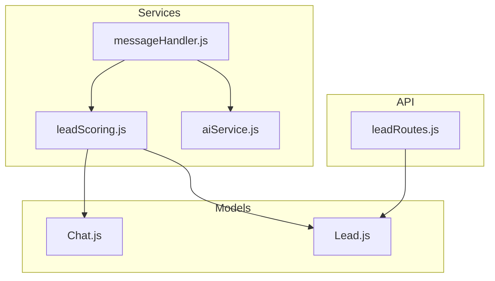
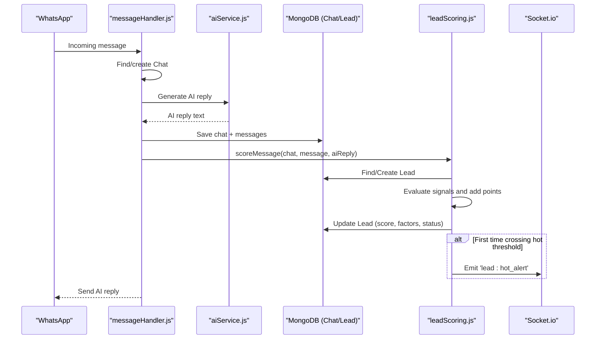
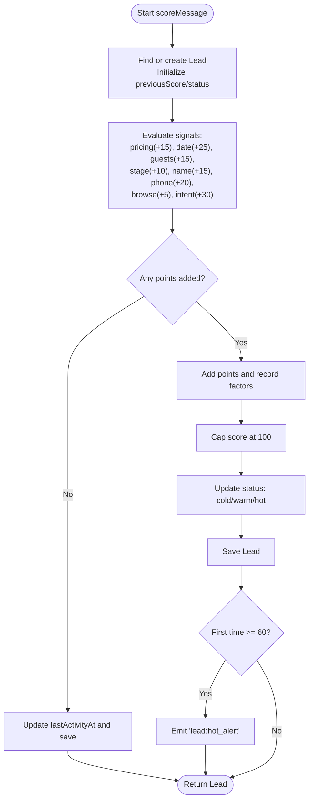
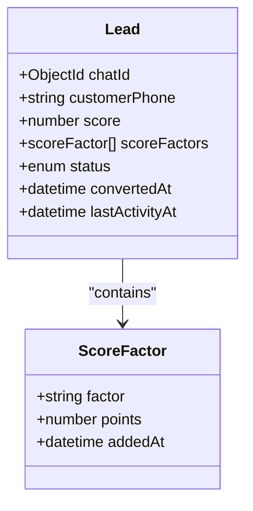
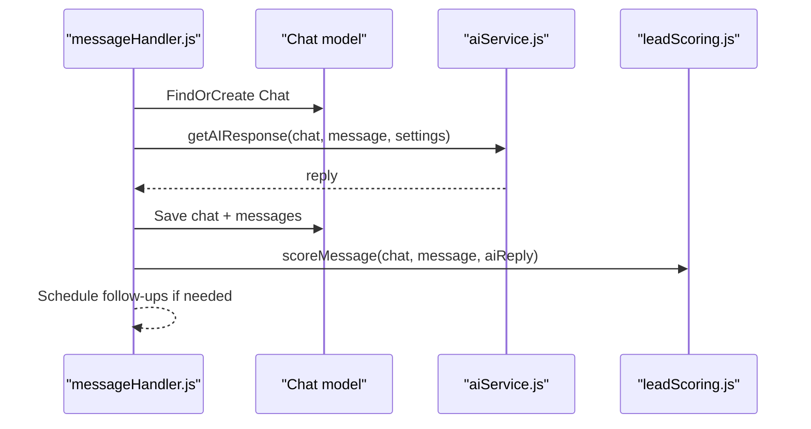
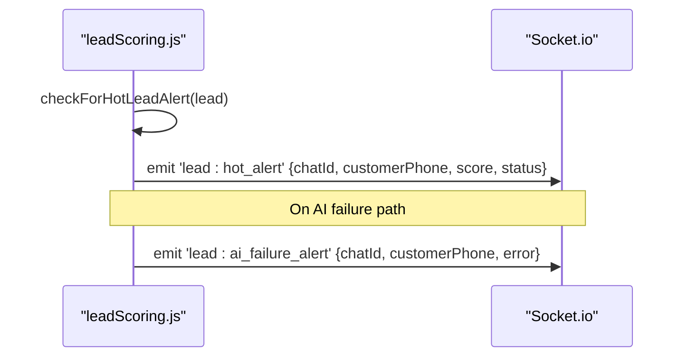
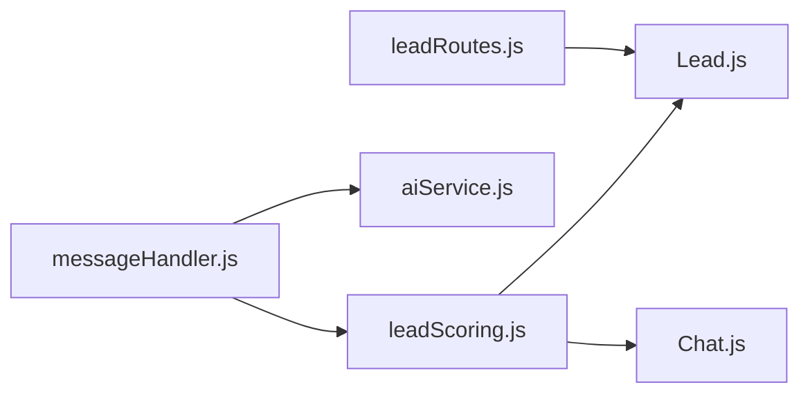

# Lead Scoring System

<cite>
**Referenced Files in This Document**
- [leadScoring.js](file://backend/src/services/leadScoring.js)
- [Lead.js](file://backend/src/models/Lead.js)
- [Chat.js](file://backend/src/models/Chat.js)
- [messageHandler.js](file://backend/src/services/messageHandler.js)
- [aiService.js](file://backend/src/services/aiService.js)
- [leadRoutes.js](file://backend/src/routes/leadRoutes.js)
</cite>

## Table of Contents
1. [Introduction](#introduction)
2. [Project Structure](#project-structure)
3. [Core Components](#core-components)
4. [Architecture Overview](#architecture-overview)
5. [Detailed Component Analysis](#detailed-component-analysis)
6. [Dependency Analysis](#dependency-analysis)
7. [Performance Considerations](#performance-considerations)
8. [Troubleshooting Guide](#troubleshooting-guide)
9. [Conclusion](#conclusion)
10. [Appendices](#appendices)

## Introduction
This document explains the lead scoring system that automatically categorizes customers based on conversation signals and engagement patterns. It details the point-based scoring mechanism, status transitions from cold to warm to hot leads, real-time alerting for hot leads and AI failures, and provides practical examples of score calculation and status updates. The system is designed to be simple, transparent, and easy to extend with new signals or thresholds.

## Project Structure
The lead scoring feature spans a small set of focused modules:
- Service layer: scoring logic and alerts
- Data models: lead and chat entities
- Message pipeline: integration with incoming messages and AI responses
- API routes: listing leads and stats
- Real-time events: socket-based notifications

**Diagram sources**
- [messageHandler.js:1-183](file://backend/src/services/messageHandler.js#L1-L183)
- [leadScoring.js:1-235](file://backend/src/services/leadScoring.js#L1-L235)
- [aiService.js:1-800](file://backend/src/services/aiService.js#L1-L800)
- [Chat.js:1-107](file://backend/src/models/Chat.js#L1-L107)
- [Lead.js:1-55](file://backend/src/models/Lead.js#L1-L55)
- [leadRoutes.js:1-72](file://backend/src/routes/leadRoutes.js#L1-L72)

**Section sources**
- [messageHandler.js:1-183](file://backend/src/services/messageHandler.js#L1-L183)
- [leadScoring.js:1-235](file://backend/src/services/leadScoring.js#L1-L235)
- [Lead.js:1-55](file://backend/src/models/Lead.js#L1-L55)
- [Chat.js:1-107](file://backend/src/models/Chat.js#L1-L107)
- [leadRoutes.js:1-72](file://backend/src/routes/leadRoutes.js#L1-L72)

## Core Components
- Lead scoring service: evaluates incoming messages, computes points, updates lead status, and emits real-time alerts.
- Lead model: persists scores, factors, and lifecycle state (cold/warm/hot/converted/lost).
- Chat model: provides context such as booking stage used by scoring rules.
- Message handler: orchestrates AI response generation, lead scoring, and follow-up scheduling.
- Routes: expose endpoints to list leads and aggregate stats for dashboards.

Key responsibilities:
- Detect signals like pricing inquiries, date mentions, guest counts, personal info sharing, browsing behavior, and booking intent.
- Apply non-duplicate scoring per factor where applicable.
- Cap total score at 100 and update status accordingly.
- Emit hot lead and AI failure alerts via Socket.io.

**Section sources**
- [leadScoring.js:1-235](file://backend/src/services/leadScoring.js#L1-L235)
- [Lead.js:1-55](file://backend/src/models/Lead.js#L1-L55)
- [Chat.js:1-107](file://backend/src/models/Chat.js#L1-L107)
- [messageHandler.js:1-183](file://backend/src/services/messageHandler.js#L1-L183)
- [leadRoutes.js:1-72](file://backend/src/routes/leadRoutes.js#L1-L72)

## Architecture Overview
End-to-end flow for scoring an incoming message:

**Diagram sources**
- [messageHandler.js:126-172](file://backend/src/services/messageHandler.js#L126-L172)
- [leadScoring.js:38-163](file://backend/src/services/leadScoring.js#L38-L163)
- [aiService.js:640-800](file://backend/src/services/aiService.js#L640-L800)

## Detailed Component Analysis

### Lead Scoring Algorithm
The scoring function inspects the incoming message and applies the following signals:
- Pricing inquiry (+15): keywords related to price/cost/rate/quote/quotation.
- Specific date mention (+25): date-like patterns or relative terms like today/tomorrow.
- Guest count information (+15): numeric value followed by people/guests/members.
- Booking stage progression (+10): when chat reaches price_quoted stage (once per stage).
- Personal information sharing (+15–+20): name pattern (+15), phone number (+20).
- Browsing behavior (+5): interest in photos/location/gallery/room/cottage.
- Booking intent phrases (+30): explicit phrases indicating desire to book/confirm/reserve.

Rules:
- Points are capped at 100.
- Some factors are awarded only once per lead (e.g., gave_name, gave_phone, reached_price_quoted).
- Status transitions:
  - Cold: 0–30
  - Warm: 31–60
  - Hot: 61–100
- When a lead first crosses into hot (score >= 60), a real-time alert is emitted.

**Diagram sources**
- [leadScoring.js:38-163](file://backend/src/services/leadScoring.js#L38-L163)

**Section sources**
- [leadScoring.js:38-163](file://backend/src/services/leadScoring.js#L38-L163)

### Data Model: Lead
The Lead schema captures:
- chatId: reference to the Chat entity
- customerPhone: contact identifier
- score: integer between 0 and 100
- scoreFactors: array of {factor, points, addedAt}
- status: enum ['cold', 'warm', 'hot', 'converted', 'lost']
- convertedAt: timestamp when marked converted
- lastActivityAt: most recent activity timestamp

Indexes optimize queries by chatId, customerPhone, status, score, and lastActivityAt.

**Diagram sources**
- [Lead.js:1-55](file://backend/src/models/Lead.js#L1-L55)

**Section sources**
- [Lead.js:1-55](file://backend/src/models/Lead.js#L1-L55)

### Integration: Message Handler
The message handler:
- Finds or creates a Chat document
- Generates an AI response
- Saves the conversation
- Sends the reply back to WhatsApp
- Invokes lead scoring with the incoming message and AI reply
- Schedules follow-ups if this is the first booking interest
- Emits AI failure alerts if all AI providers fail

**Diagram sources**
- [messageHandler.js:126-172](file://backend/src/services/messageHandler.js#L126-L172)
- [aiService.js:640-800](file://backend/src/services/aiService.js#L640-L800)

**Section sources**
- [messageHandler.js:126-172](file://backend/src/services/messageHandler.js#L126-L172)
- [aiService.js:640-800](file://backend/src/services/aiService.js#L640-L800)

### Real-Time Alerts: Hot Leads and AI Failures
- Hot lead alert: emitted when a lead’s score first reaches or exceeds 60.
- AI failure alert: emitted when AI generation fails; includes chatId, customerPhone, and error message.

These alerts are broadcast via Socket.io and can be consumed by the dashboard UI.

**Diagram sources**
- [leadScoring.js:171-202](file://backend/src/services/leadScoring.js#L171-L202)

**Section sources**
- [leadScoring.js:171-202](file://backend/src/services/leadScoring.js#L171-L202)

### API Endpoints: Listing Leads and Stats
- GET /api/leads: lists leads with optional status filter, sorted by score and last activity.
- GET /api/leads/stats: aggregates counts by status and returns totals.

These endpoints use the Lead model and populate minimal chat fields for display.

**Section sources**
- [leadRoutes.js:1-72](file://backend/src/routes/leadRoutes.js#L1-L72)

## Dependency Analysis
High-level dependencies among components:

**Diagram sources**
- [leadScoring.js:1-235](file://backend/src/services/leadScoring.js#L1-L235)
- [Lead.js:1-55](file://backend/src/models/Lead.js#L1-L55)
- [Chat.js:1-107](file://backend/src/models/Chat.js#L1-L107)
- [messageHandler.js:1-183](file://backend/src/services/messageHandler.js#L1-L183)
- [aiService.js:1-800](file://backend/src/services/aiService.js#L1-L800)
- [leadRoutes.js:1-72](file://backend/src/routes/leadRoutes.js#L1-L72)

**Section sources**
- [leadScoring.js:1-235](file://backend/src/services/leadScoring.js#L1-L235)
- [messageHandler.js:1-183](file://backend/src/services/messageHandler.js#L1-L183)
- [leadRoutes.js:1-72](file://backend/src/routes/leadRoutes.js#L1-L72)

## Performance Considerations
- Regex checks are lightweight and operate on a single message string.
- Database writes occur only when points are added or activity is updated.
- Status transitions and alerts are conditional to avoid unnecessary emissions.
- Indexes on frequently queried fields (status, score, lastActivityAt) improve dashboard performance.

[No sources needed since this section provides general guidance]

## Troubleshooting Guide
Common issues and resolutions:
- No points added: verify message content matches expected signals; ensure no duplicate factors already recorded.
- Status not updating: confirm score cap at 100 and correct thresholds; check database write success.
- Hot alert not received: ensure Socket.io instance is initialized and connected; verify first-time crossing condition.
- AI failure alert missing: confirm error propagation path and that emitAIFailureAlert is invoked.

Operational tips:
- Inspect scoreFactors to understand which signals triggered points.
- Use GET /api/leads?status=hot to quickly surface hot leads.
- Monitor logs for “Lead scored” and “AI failure alert” entries.

**Section sources**
- [leadScoring.js:150-202](file://backend/src/services/leadScoring.js#L150-L202)
- [leadRoutes.js:11-31](file://backend/src/routes/leadRoutes.js#L11-L31)

## Conclusion
The lead scoring system provides a clear, rule-based approach to prioritizing conversations. By combining conversational signals with booking-stage context, it produces actionable statuses and real-time alerts. The design is modular and extensible, allowing teams to adjust weights, thresholds, and patterns without disrupting core flows.

[No sources needed since this section summarizes without analyzing specific files]

## Appendices

### Configuration Options
Current implementation uses hardcoded scoring rules and thresholds within the scoring service. To customize:
- Adjust point values and keyword/pattern lists in the scoring service.
- Modify status thresholds (cold/warm/hot ranges) in the scoring service.
- Extend signal detection by adding new regex patterns or keyword sets.
- For future flexibility, consider moving these values to a configuration store or Settings model.

Note: The Settings model currently manages global mode, WhatsApp numbers, and follow-up toggles, but does not include scoring parameters.

**Section sources**
- [leadScoring.js:62-132](file://backend/src/services/leadScoring.js#L62-L132)
- [Settings.js:16-33](file://backend/src/models/Settings.js#L16-L33)

### Examples: Score Calculation and Status Updates
Example scenarios (illustrative):
- Customer asks about pricing: +15 → cold (if starting from 0).
- Customer shares a specific date: +25 → warm (cumulative 40).
- Customer provides guest count: +15 → warm (cumulative 55).
- Chat reaches price_quoted stage: +10 → warm (cumulative 65) → hot.
- Customer shares name: +15 → hot (cumulative 80).
- Customer shares phone: +20 → hot (capped at 100).
- Customer expresses booking intent: +30 → hot (capped at 100).

Status transitions:
- 0–30: cold
- 31–60: warm
- 61–100: hot

Real-time actions:
- First time reaching ≥60 triggers a hot lead alert.
- AI failure triggers an AI failure alert.

**Section sources**
- [leadScoring.js:38-163](file://backend/src/services/leadScoring.js#L38-L163)