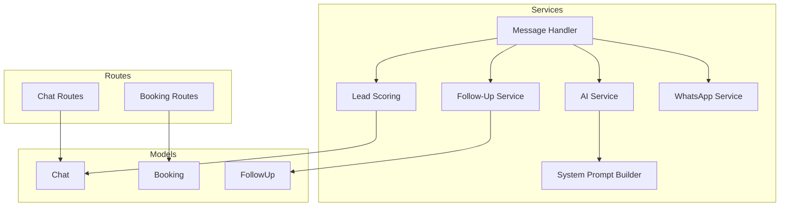
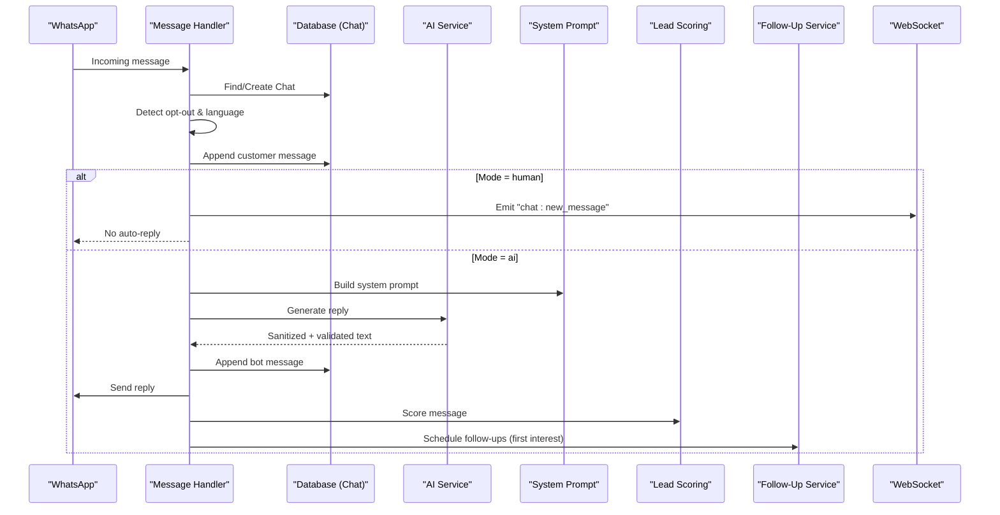
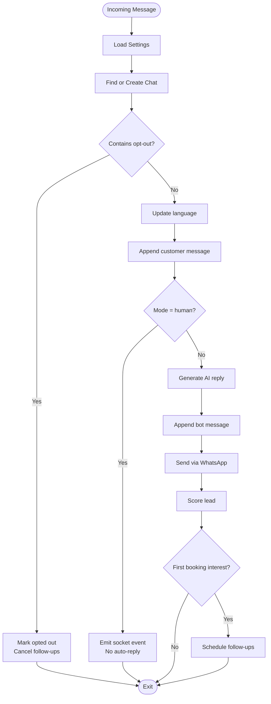
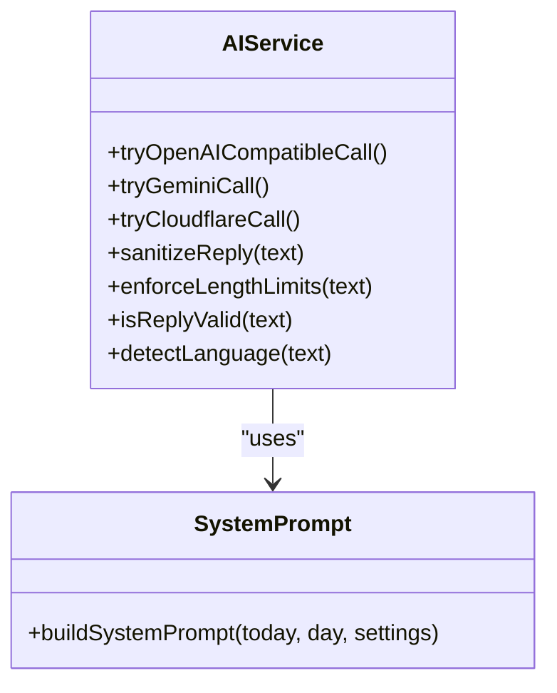
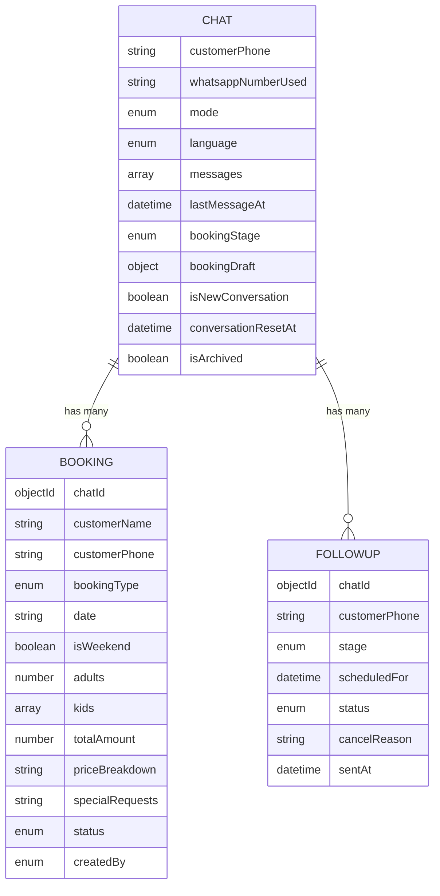
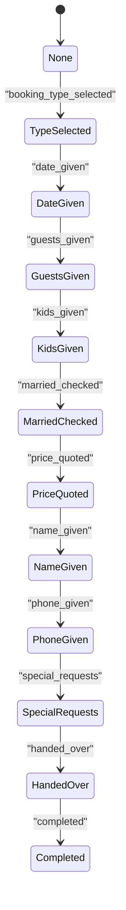
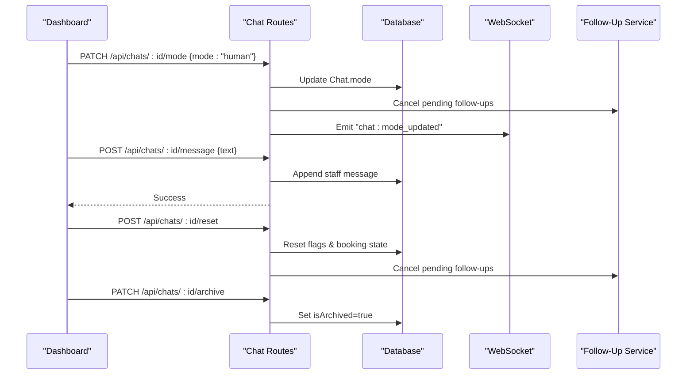
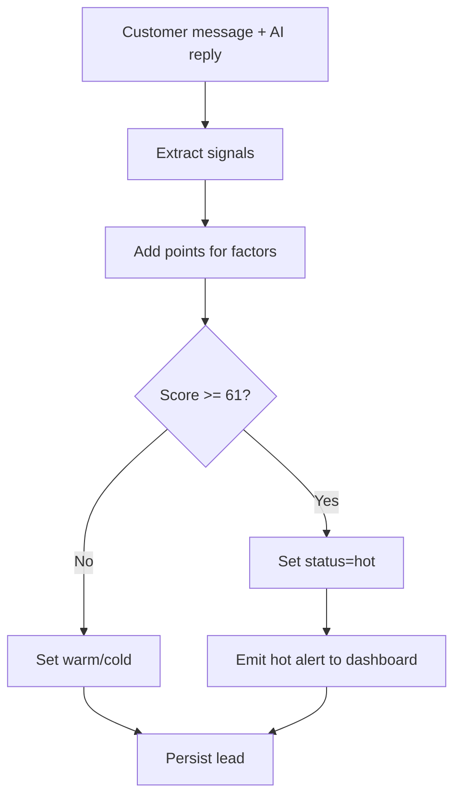
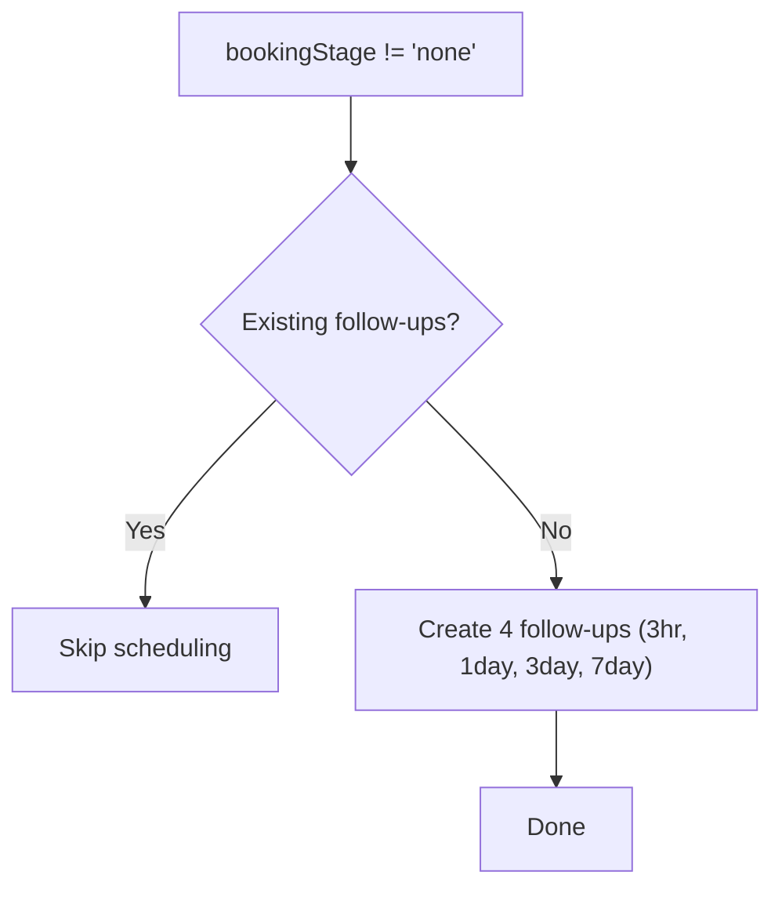
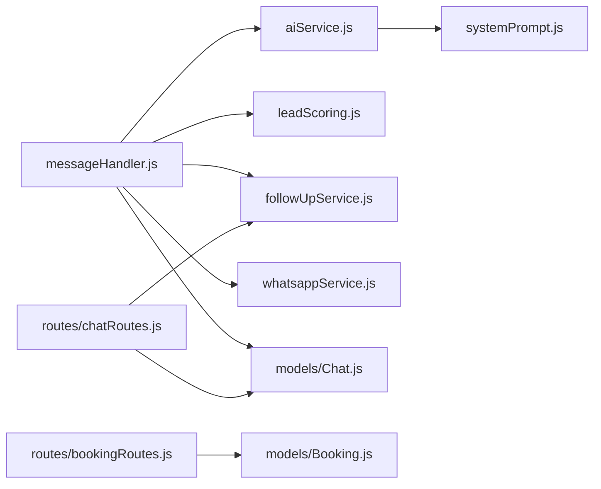

# Message Processing Pipeline

<cite>
**Referenced Files in This Document**
- [messageHandler.js](file://backend/src/services/messageHandler.js)
- [aiService.js](file://backend/src/services/aiService.js)
- [systemPrompt.js](file://backend/src/services/systemPrompt.js)
- [Chat.js](file://backend/src/models/Chat.js)
- [Booking.js](file://backend/src/models/Booking.js)
- [FollowUp.js](file://backend/src/models/FollowUp.js)
- [leadScoring.js](file://backend/src/services/leadScoring.js)
- [followUpService.js](file://backend/src/services/followUpService.js)
- [chatRoutes.js](file://backend/src/routes/chatRoutes.js)
- [bookingRoutes.js](file://backend/src/routes/bookingRoutes.js)
</cite>

## Table of Contents
1. [Introduction](#introduction)
2. [Project Structure](#project-structure)
3. [Core Components](#core-components)
4. [Architecture Overview](#architecture-overview)
5. [Detailed Component Analysis](#detailed-component-analysis)
6. [Dependency Analysis](#dependency-analysis)
7. [Performance Considerations](#performance-considerations)
8. [Troubleshooting Guide](#troubleshooting-guide)
9. [Conclusion](#conclusion)
10. [Appendices](#appendices)

## Introduction
This document explains the end-to-end message processing pipeline for the WhatsApp-based resort booking assistant. It covers how incoming messages are routed, how conversation state is managed across multi-turn dialogues, how the booking flow progresses (price quoting, availability cues, and confirmation handover), and how human-in-the-loop mode switching allows staff intervention. It also documents integration points with lead scoring and follow-up scheduling, along with examples of booking states and manual override procedures.

## Project Structure
The backend implements a modular service-oriented architecture:
- Services orchestrate messaging, AI generation, lead scoring, and follow-ups
- Models define persistent entities for chats, bookings, and follow-ups
- Routes expose REST endpoints for dashboard operations (mode switching, manual messaging, resets, archiving, listing)
- System prompt centralizes business rules and conversation flow instructions for the AI

**Diagram sources**
- [messageHandler.js:1-183](file://backend/src/services/messageHandler.js#L1-L183)
- [aiService.js:1-800](file://backend/src/services/aiService.js#L1-L800)
- [systemPrompt.js:1-94](file://backend/src/services/systemPrompt.js#L1-L94)
- [leadScoring.js:1-235](file://backend/src/services/leadScoring.js#L1-L235)
- [followUpService.js:1-126](file://backend/src/services/followUpService.js#L1-L126)
- [Chat.js:1-107](file://backend/src/models/Chat.js#L1-L107)
- [Booking.js:1-69](file://backend/src/models/Booking.js#L1-L69)
- [FollowUp.js:1-49](file://backend/src/models/FollowUp.js#L1-L49)
- [chatRoutes.js:1-254](file://backend/src/routes/chatRoutes.js#L1-L254)
- [bookingRoutes.js:1-71](file://backend/src/routes/bookingRoutes.js#L1-L71)

**Section sources**
- [messageHandler.js:1-183](file://backend/src/services/messageHandler.js#L1-L183)
- [aiService.js:1-800](file://backend/src/services/aiService.js#L1-L800)
- [systemPrompt.js:1-94](file://backend/src/services/systemPrompt.js#L1-L94)
- [Chat.js:1-107](file://backend/src/models/Chat.js#L1-L107)
- [Booking.js:1-69](file://backend/src/models/Booking.js#L1-L69)
- [FollowUp.js:1-49](file://backend/src/models/FollowUp.js#L1-L49)
- [leadScoring.js:1-235](file://backend/src/services/leadScoring.js#L1-L235)
- [followUpService.js:1-126](file://backend/src/services/followUpService.js#L1-L126)
- [chatRoutes.js:1-254](file://backend/src/routes/chatRoutes.js#L1-L254)
- [bookingRoutes.js:1-71](file://backend/src/routes/bookingRoutes.js#L1-L71)

## Core Components
- Message routing and orchestration: Loads settings, finds or creates chat records, detects opt-out, updates language, persists messages, decides AI vs human mode, sends replies, scores leads, and schedules follow-ups.
- AI response generation: Multi-provider chain (OpenAI-compatible, Gemini, Cloudflare), sanitization, length enforcement, reply validation, and per-provider metrics.
- Conversation state model: Tracks customer phone, mode, language, messages, last activity, booking stage, draft details, new-conversation flag, reset timestamp, and archive status.
- Booking model: Stores finalized booking details including type, date, adults/kids, total amount, price breakdown, special requests, status, and creator source.
- Lead scoring: Heuristic-based point system that upgrades lead status (cold/warm/hot) based on signals like pricing interest, dates, guest counts, name/phone sharing, and intent phrases.
- Follow-up automation: Schedules staged reminders after first booking interest; cancels pending follow-ups when customers engage, opt out, or staff take over.
- Dashboard routes: Per-chat mode switching, manual staff messaging, conversation reset, soft archive, and listing/search.

**Section sources**
- [messageHandler.js:1-183](file://backend/src/services/messageHandler.js#L1-L183)
- [aiService.js:1-800](file://backend/src/services/aiService.js#L1-L800)
- [Chat.js:1-107](file://backend/src/models/Chat.js#L1-L107)
- [Booking.js:1-69](file://backend/src/models/Booking.js#L1-L69)
- [leadScoring.js:1-235](file://backend/src/services/leadScoring.js#L1-L235)
- [followUpService.js:1-126](file://backend/src/services/followUpService.js#L1-L126)
- [chatRoutes.js:1-254](file://backend/src/routes/chatRoutes.js#L1-L254)

## Architecture Overview
The pipeline processes an incoming WhatsApp message through a deterministic sequence:
- Identify or create a Chat record
- Check opt-out and update language
- Persist the customer message
- Decide mode (human vs AI)
- If AI: generate response via provider chain, sanitize/validate, persist, send via WhatsApp, score lead, schedule follow-ups if first interest
- If human: persist and notify staff via socket events

**Diagram sources**
- [messageHandler.js:1-183](file://backend/src/services/messageHandler.js#L1-L183)
- [aiService.js:1-800](file://backend/src/services/aiService.js#L1-L800)
- [systemPrompt.js:1-94](file://backend/src/services/systemPrompt.js#L1-L94)
- [leadScoring.js:1-235](file://backend/src/services/leadScoring.js#L1-L235)
- [followUpService.js:1-126](file://backend/src/services/followUpService.js#L1-L126)
- [chatRoutes.js:1-254](file://backend/src/routes/chatRoutes.js#L1-L254)

## Detailed Component Analysis

### Message Routing and Human-in-the-Loop
- Entry point loads global settings and resolves per-chat mode.
- Opt-out detection immediately halts automation and marks the chat opted out.
- Language detection updates the chat’s language field for analytics and personalization.
- In human mode, no auto-reply is sent; instead, a socket event notifies the dashboard for staff to respond manually.
- In AI mode, the handler orchestrates AI generation, persistence, delivery, lead scoring, and follow-up scheduling.

**Diagram sources**
- [messageHandler.js:1-183](file://backend/src/services/messageHandler.js#L1-L183)
- [followUpService.js:1-126](file://backend/src/services/followUpService.js#L1-L126)
- [chatRoutes.js:1-254](file://backend/src/routes/chatRoutes.js#L1-L254)

**Section sources**
- [messageHandler.js:1-183](file://backend/src/services/messageHandler.js#L1-L183)
- [chatRoutes.js:76-126](file://backend/src/routes/chatRoutes.js#L76-L126)

### AI Response Generation and Validation
- Provider chain attempts multiple backends (OpenAI-compatible, Gemini, Cloudflare). Each attempt is wrapped with timeouts, error handling, and metrics recording.
- Responses are sanitized to remove reasoning tags and markdown, then enforced to line/character limits.
- A strict validator checks script ranges, repeated words, and English word heuristics to ensure safe, natural Hinglish/Hindi/Marathi/Gujarati outputs.
- The system prompt defines identity, pricing, facilities, policies, link-sharing rules, language behavior, and the golden rule of one question at a time.

**Diagram sources**
- [aiService.js:1-800](file://backend/src/services/aiService.js#L1-L800)
- [systemPrompt.js:1-94](file://backend/src/services/systemPrompt.js#L1-L94)

**Section sources**
- [aiService.js:1-800](file://backend/src/services/aiService.js#L1-L800)
- [systemPrompt.js:1-94](file://backend/src/services/systemPrompt.js#L1-L94)

### Conversation State Management and Multi-Turn Dialogue
- The Chat model stores:
  - Mode (ai/human)
  - Language (auto-detected)
  - Messages array (sender, text, timestamp, type)
  - Last activity timestamp
  - Booking stage (progression through the flow)
  - Booking draft (type, date, nights, adults, kids, marital check, calculated price, breakdown, special requests)
  - New conversation flag and reset timestamp
  - Archive flag for soft deletion
- Multi-turn context is preserved by appending both customer and bot messages to the same Chat document, enabling the AI to reference prior turns via the stored history.

**Diagram sources**
- [Chat.js:1-107](file://backend/src/models/Chat.js#L1-L107)
- [Booking.js:1-69](file://backend/src/models/Booking.js#L1-L69)
- [FollowUp.js:1-49](file://backend/src/models/FollowUp.js#L1-L49)

**Section sources**
- [Chat.js:1-107](file://backend/src/models/Chat.js#L1-L107)

### Booking Flow Automation
- The system prompt defines a stepwise flow:
  1) Select booking type (Couple Stay / Group Stay / One Day Picnic / Event)
  2) Collect date (reject past dates; same-day prompts direct call)
  3) Collect guest count
  4) Collect kids ages
  5) For couple stays, verify married-only policy
  6) Quote price with breakdown (weekday vs weekend)
  7) Collect name
  8) Collect phone
  9) Capture special requests
  10) Handover to staff with contact number
- The Chat.bookingStage tracks progress through these steps, while bookingDraft accumulates structured data. When the stage transitions from none to a non-none value, follow-ups are scheduled.
- Finalized bookings can be persisted using the Booking model with fields for type, date, adults/kids, totals, breakdown, special requests, status, and creator source.

**Diagram sources**
- [Chat.js:74-78](file://backend/src/models/Chat.js#L74-L78)
- [systemPrompt.js:75-77](file://backend/src/services/systemPrompt.js#L75-L77)

**Section sources**
- [systemPrompt.js:1-94](file://backend/src/services/systemPrompt.js#L1-L94)
- [Chat.js:1-107](file://backend/src/models/Chat.js#L1-L107)
- [Booking.js:1-69](file://backend/src/models/Booking.js#L1-L69)

### Human-in-the-Loop Mode Switching and Manual Overrides
- Staff can switch a specific chat into human mode via API; this prevents auto-replies and cancels pending follow-ups.
- Staff can send manual messages from the dashboard; these are appended as staff-sender entries and delivered via WhatsApp.
- Staff can reset a conversation to start fresh while preserving history, and can archive chats for soft deletion.

**Diagram sources**
- [chatRoutes.js:76-254](file://backend/src/routes/chatRoutes.js#L76-L254)
- [followUpService.js:1-126](file://backend/src/services/followUpService.js#L1-L126)

**Section sources**
- [chatRoutes.js:76-254](file://backend/src/routes/chatRoutes.js#L76-L254)

### Lead Scoring Integration
- After each AI reply, the message is scored based on signals such as pricing interest, date/guest mentions, name/phone sharing, browsing photos/location, and explicit booking intent.
- Leads transition between cold/warm/hot statuses; hot leads trigger real-time alerts to the dashboard.
- On conversion (e.g., completed booking), leads can be marked converted with maximum score.

**Diagram sources**
- [leadScoring.js:1-235](file://backend/src/services/leadScoring.js#L1-L235)

**Section sources**
- [leadScoring.js:1-235](file://backend/src/services/leadScoring.js#L1-L235)

### Follow-Up Automation
- When a chat first shows booking interest (transition from none to any other stage), four follow-ups are scheduled at staggered intervals.
- Follow-ups are cancelled when the customer replies, opts out, staff takes over, or the conversation is reset/archived.

**Diagram sources**
- [followUpService.js:1-126](file://backend/src/services/followUpService.js#L1-L126)

**Section sources**
- [followUpService.js:1-126](file://backend/src/services/followUpService.js#L1-L126)

## Dependency Analysis
- messageHandler depends on:
  - aiService for response generation
  - leadScoring for post-reply scoring
  - followUpService for opt-out handling and follow-up scheduling
  - whatsappService for outbound delivery
  - models.Chat and models.Settings for persistence and configuration
- aiService depends on:
  - systemPrompt for dynamic prompt construction
  - environment config for provider credentials and model selection
- Routes depend on:
  - models.Chat and models.Booking for CRUD operations
  - services.followUpService for cancellation logic
  - sockets for real-time notifications

**Diagram sources**
- [messageHandler.js:1-183](file://backend/src/services/messageHandler.js#L1-L183)
- [aiService.js:1-800](file://backend/src/services/aiService.js#L1-L800)
- [systemPrompt.js:1-94](file://backend/src/services/systemPrompt.js#L1-L94)
- [leadScoring.js:1-235](file://backend/src/services/leadScoring.js#L1-L235)
- [followUpService.js:1-126](file://backend/src/services/followUpService.js#L1-L126)
- [Chat.js:1-107](file://backend/src/models/Chat.js#L1-L107)
- [Booking.js:1-69](file://backend/src/models/Booking.js#L1-L69)
- [chatRoutes.js:1-254](file://backend/src/routes/chatRoutes.js#L1-L254)
- [bookingRoutes.js:1-71](file://backend/src/routes/bookingRoutes.js#L1-L71)

**Section sources**
- [messageHandler.js:1-183](file://backend/src/services/messageHandler.js#L1-L183)
- [aiService.js:1-800](file://backend/src/services/aiService.js#L1-L800)
- [systemPrompt.js:1-94](file://backend/src/services/systemPrompt.js#L1-L94)
- [leadScoring.js:1-235](file://backend/src/services/leadScoring.js#L1-L235)
- [followUpService.js:1-126](file://backend/src/services/followUpService.js#L1-L126)
- [Chat.js:1-107](file://backend/src/models/Chat.js#L1-L107)
- [Booking.js:1-69](file://backend/src/models/Booking.js#L1-L69)
- [chatRoutes.js:1-254](file://backend/src/routes/chatRoutes.js#L1-L254)
- [bookingRoutes.js:1-71](file://backend/src/routes/bookingRoutes.js#L1-L71)

## Performance Considerations
- Provider fallback chain reduces single-point failures and improves latency resilience.
- In-memory caching for FAQ-type responses reduces API calls for static information.
- Strict output validation and sanitization prevent costly retries due to malformed content.
- Socket events for real-time dashboards avoid polling overhead.
- Indexes on frequently queried fields (customerPhone, lastMessageAt, mode, bookingStage, isArchived, language) improve database performance.

[No sources needed since this section provides general guidance]

## Troubleshooting Guide
- AI failure alerts: When all providers fail, an alert is emitted to the dashboard for immediate attention.
- Opt-out handling: Ensure opt-out phrases are recognized and follow-ups are cancelled promptly.
- Mode switching issues: Verify that switching to human mode cancels pending follow-ups and emits socket updates.
- Conversation resets: Confirm that resetting clears booking stage and draft without losing historical messages.
- Booking status updates: Use the booking status endpoint to correct or finalize reservations created by AI or staff.

**Section sources**
- [messageHandler.js:163-172](file://backend/src/services/messageHandler.js#L163-L172)
- [leadScoring.js:184-202](file://backend/src/services/leadScoring.js#L184-L202)
- [followUpService.js:92-118](file://backend/src/services/followUpService.js#L92-L118)
- [chatRoutes.js:76-254](file://backend/src/routes/chatRoutes.js#L76-L254)
- [bookingRoutes.js:33-68](file://backend/src/routes/bookingRoutes.js#L33-L68)

## Conclusion
The message processing pipeline integrates robust routing, resilient AI generation, precise conversation state management, and automated follow-ups with clear human-in-the-loop controls. The design supports multi-turn dialogues, preserves context, and provides actionable integrations for lead scoring and dashboard operations. With well-defined booking flow stages and manual override capabilities, the system balances automation with operational flexibility.

[No sources needed since this section summarizes without analyzing specific files]

## Appendices

### Examples of Booking Flow States
- none → type_selected → date_given → guests_given → kids_given → married_checked → price_quoted → name_given → phone_given → special_requests → handed_over → completed

**Section sources**
- [Chat.js:74-78](file://backend/src/models/Chat.js#L74-L78)

### Manual Override Procedures
- Switch per-chat mode to human to stop auto-replies and notify staff.
- Send manual messages from the dashboard to continue the conversation.
- Reset conversations to restart the flow while retaining history.
- Archive chats for soft deletion and compliance.

**Section sources**
- [chatRoutes.js:76-254](file://backend/src/routes/chatRoutes.js#L76-L254)

### Integration Points
- Lead scoring: Real-time alerts for hot leads and conversion tracking.
- Follow-up scheduling: Automated reminders after initial booking interest.
- Dashboard APIs: Listing chats/bookings, updating booking status, and managing chat lifecycle.

**Section sources**
- [leadScoring.js:1-235](file://backend/src/services/leadScoring.js#L1-L235)
- [followUpService.js:1-126](file://backend/src/services/followUpService.js#L1-L126)
- [chatRoutes.js:1-254](file://backend/src/routes/chatRoutes.js#L1-L254)
- [bookingRoutes.js:1-71](file://backend/src/routes/bookingRoutes.js#L1-L71)