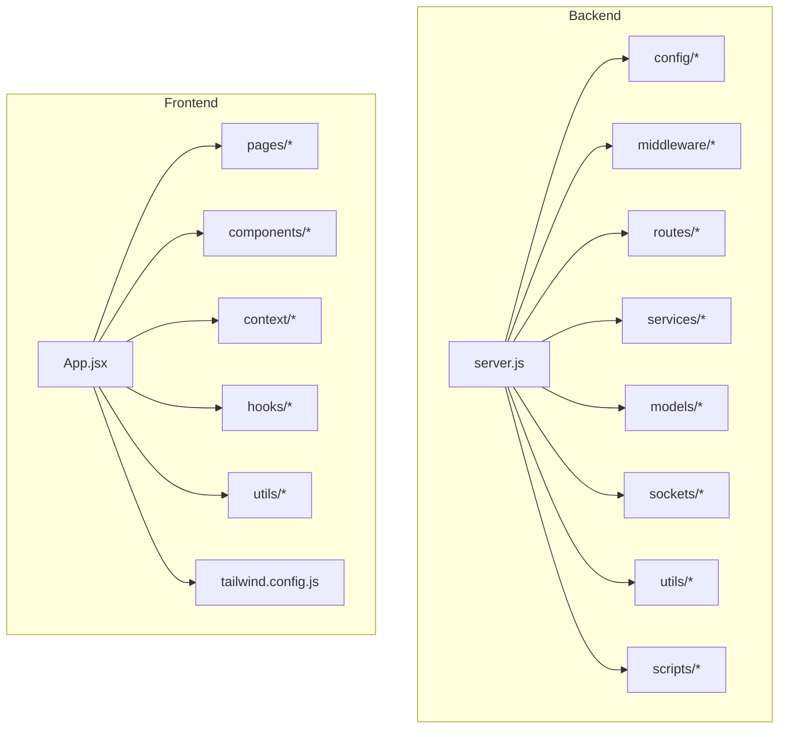
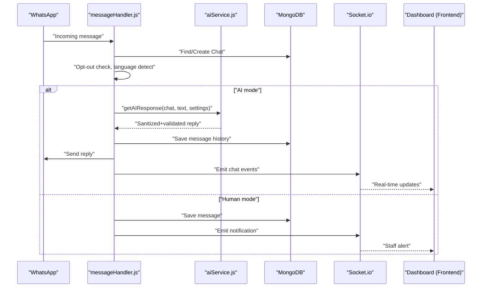
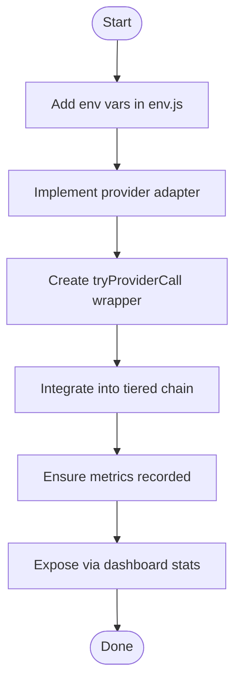
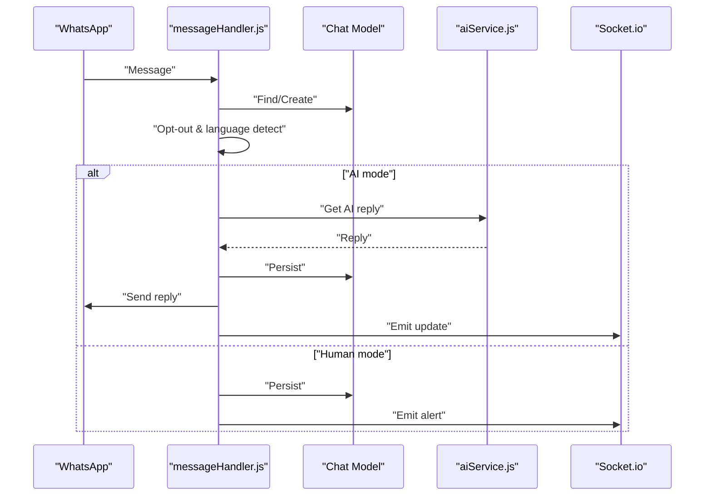
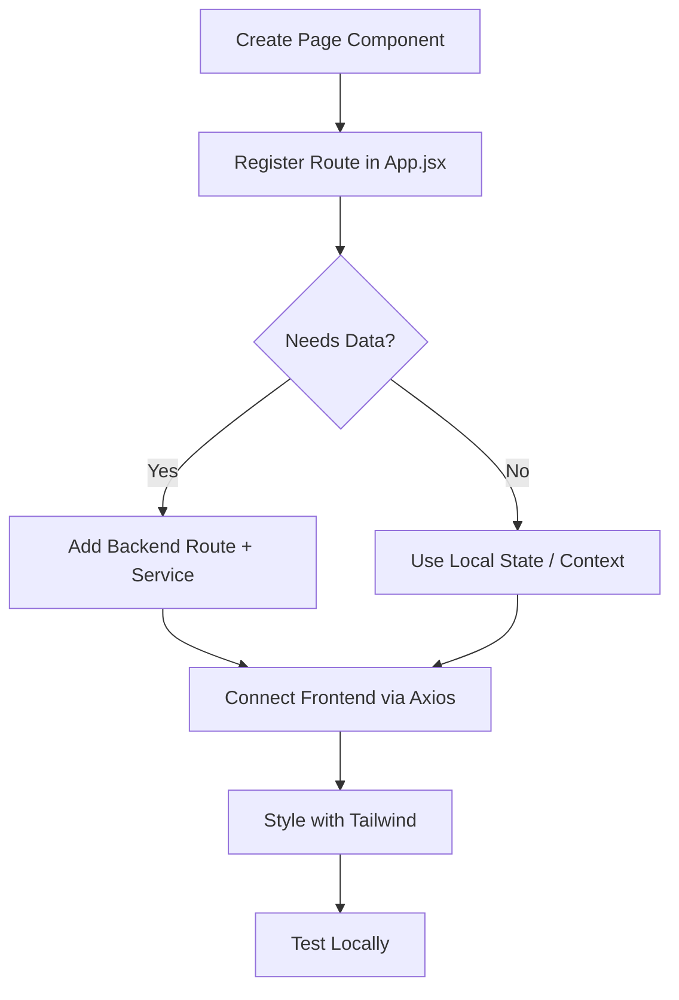
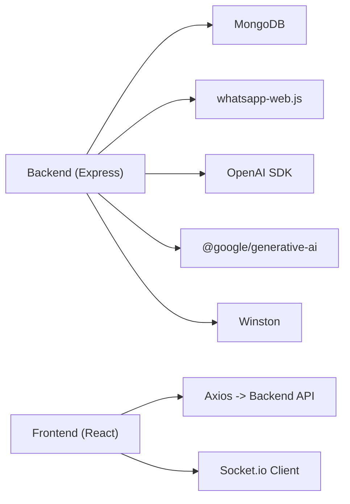

# Contributing Guide

<cite>
**Referenced Files in This Document**
- [README.md](file://nandibaag-bot/README.md)
- [backend/package.json](file://nandibaag-bot/backend/package.json)
- [frontend/package.json](file://nandibaag-bot/frontend/package.json)
- [backend/src/server.js](file://nandibaag-bot/backend/src/server.js)
- [backend/.gitignore](file://nandibaag-bot/backend/.gitignore)
- [backend/src/config/env.js](file://nandibaag-bot/backend/src/config/env.js)
- [backend/src/config/logger.js](file://nandibaag-bot/backend/src/config/logger.js)
- [backend/src/middleware/errorHandler.js](file://nandibaag-bot/backend/src/middleware/errorHandler.js)
- [backend/src/services/aiService.js](file://nandibaag-bot/backend/src/services/aiService.js)
- [backend/src/services/messageHandler.js](file://nandibaag-bot/backend/src/services/messageHandler.js)
- [backend/ecosystem.config.js](file://nandibaag-bot/backend/ecosystem.config.js)
- [backend/nodemon.json](file://nandibaag-bot/backend/nodemon.json)
- [frontend/src/App.jsx](file://nandibaag-bot/frontend/src/App.jsx)
- [frontend/tailwind.config.js](file://nandibaag-bot/frontend/tailwind.config.js)
</cite>

## Table of Contents
1. Introduction
2. Project Structure
3. Core Components
4. Architecture Overview
5. Detailed Component Analysis
6. Dependency Analysis
7. Performance Considerations
8. Troubleshooting Guide
9. Conclusion
10. Appendices

## Introduction
This Contributing Guide defines the development workflow, coding standards, Git branching strategy, and procedures for extending the Nandibaag Bot project. It covers adding new AI providers, extending message handlers, creating dashboard features, backend and frontend conventions, commit messages, pull requests, testing expectations, code review process, and release procedures.

## Project Structure
The repository is a full-stack application with separate backend and frontend directories:
- Backend (Node.js + Express): API routes, services, models, middleware, sockets, configuration, scripts, and PM2 deployment config.
- Frontend (React + Vite): Pages, components, context, hooks, utilities, and Tailwind styling.

**Diagram sources**
- [backend/src/server.js:1-241](file://nandibaag-bot/backend/src/server.js#L1-L241)
- [frontend/src/App.jsx:1-103](file://nandibaag-bot/frontend/src/App.jsx#L1-L103)

**Section sources**
- [README.md:27-63](file://nandibaag-bot/README.md#L27-L63)
- [backend/src/server.js:1-241](file://nandibaag-bot/backend/src/server.js#L1-L241)
- [frontend/src/App.jsx:1-103](file://nandibaag-bot/frontend/src/App.jsx#L1-L103)

## Core Components
- Server bootstrap and initialization:
  - Express app setup, security, CORS, compression, logging, rate limiting, health endpoint, route mounting, error handler, Socket.io initialization, default admin/settings creation, WhatsApp session restart, cron jobs, graceful shutdown.
- Configuration:
  - Environment validation via Joi; required keys include MongoDB URI, JWT settings, OpenRouter key/model, resort contacts, admin defaults, frontend URL, plus optional tiers (Gemini, Groq, Cloudflare, Cerebras), and local Ollama test mode.
- Logging:
  - Winston transports to console (dev) and files (error.log, combined.log).
- Error handling:
  - Global Express error handler returning consistent JSON; stack traces only in development.
- AI service:
  - Multi-provider orchestration (OpenRouter, Gemini, Cloudflare Workers AI, Groq, Cerebras, Ollama dev-only), response sanitization, length enforcement, reply validation, language detection, per-provider metrics, and caching for FAQ-like responses.
- Message handling:
  - Incoming WhatsApp message processing, chat persistence, opt-out handling, language detection, AI/human routing, lead scoring, follow-up scheduling, and socket notifications.
- Frontend routing:
  - Protected routes, layout with bottom navigation, pages for dashboard, connect, chats, settings, inventory.

**Section sources**
- [backend/src/server.js:1-241](file://nandibaag-bot/backend/src/server.js#L1-L241)
- [backend/src/config/env.js:1-95](file://nandibaag-bot/backend/src/config/env.js#L1-L95)
- [backend/src/config/logger.js:1-52](file://nandibaag-bot/backend/src/config/logger.js#L1-L52)
- [backend/src/middleware/errorHandler.js:1-36](file://nandibaag-bot/backend/src/middleware/errorHandler.js#L1-L36)
- [backend/src/services/aiService.js:1-800](file://nandibaag-bot/backend/src/services/aiService.js#L1-L800)
- [backend/src/services/messageHandler.js:1-183](file://nandibaag-bot/backend/src/services/messageHandler.js#L1-L183)
- [frontend/src/App.jsx:1-103](file://nandibaag-bot/frontend/src/App.jsx#L1-L103)

## Architecture Overview
High-level flow from incoming WhatsApp message to AI response and dashboard updates.

**Diagram sources**
- [backend/src/services/messageHandler.js:1-183](file://nandibaag-bot/backend/src/services/messageHandler.js#L1-L183)
- [backend/src/services/aiService.js:1-800](file://nandibaag-bot/backend/src/services/aiService.js#L1-L800)
- [backend/src/server.js:102-108](file://nandibaag-bot/backend/src/server.js#L102-L108)

## Detailed Component Analysis

### Adding a New AI Provider
Goal: Integrate a new provider into the existing multi-tier chain while preserving validation, metrics, and fallback behavior.

Steps:
1. Add environment variables for credentials and model names in env schema.
2. Implement a client adapter function similar to existing adapters.
3. Create a try*Call wrapper that:
   - Measures latency
   - Calls the provider
   - Sanitizes and enforces length limits
   - Validates output
   - Records success/invalid/error metrics
4. Include the new provider in the tiered chain logic within getAIResponse.
5. Ensure dashboard stats reflect the new provider’s metrics.

**Diagram sources**
- [backend/src/config/env.js:1-95](file://nandibaag-bot/backend/src/config/env.js#L1-L95)
- [backend/src/services/aiService.js:1-800](file://nandibaag-bot/backend/src/services/aiService.js#L1-L800)

**Section sources**
- [backend/src/config/env.js:1-95](file://nandibaag-bot/backend/src/config/env.js#L1-L95)
- [backend/src/services/aiService.js:1-800](file://nandibaag-bot/backend/src/services/aiService.js#L1-L800)

### Extending Message Handlers
Goal: Add custom pre/post-processing or conditional routing for incoming messages.

Guidelines:
- Keep handleMessage idempotent and resilient; avoid throwing unhandled exceptions.
- Use Settings and Chat models consistently for state.
- Emit socket events for real-time UI updates when needed.
- Respect opt-out phrases and human/AI modes.
- Log timing and errors for observability.

**Diagram sources**
- [backend/src/services/messageHandler.js:1-183](file://nandibaag-bot/backend/src/services/messageHandler.js#L1-L183)
- [backend/src/server.js:102-108](file://nandibaag-bot/backend/src/server.js#L102-L108)

**Section sources**
- [backend/src/services/messageHandler.js:1-183](file://nandibaag-bot/backend/src/services/messageHandler.js#L1-L183)

### Creating New Dashboard Features
Goal: Add a new page or widget to the React dashboard.

Steps:
1. Create a new page component under frontend/src/pages.
2. Register a protected route in App.jsx using the ProtectedLayout wrapper.
3. If data is needed, add a corresponding backend route and service.
4. Use Axios for HTTP calls and Socket.io client for real-time updates.
5. Follow Tailwind conventions defined in tailwind.config.js.

**Diagram sources**
- [frontend/src/App.jsx:1-103](file://nandibaag-bot/frontend/src/App.jsx#L1-L103)
- [frontend/tailwind.config.js:1-34](file://nandibaag-bot/frontend/tailwind.config.js#L1-L34)

**Section sources**
- [frontend/src/App.jsx:1-103](file://nandibaag-bot/frontend/src/App.jsx#L1-L103)
- [frontend/tailwind.config.js:1-34](file://nandibaag-bot/frontend/tailwind.config.js#L1-L34)

## Dependency Analysis
Key runtime dependencies and their roles:
- Backend: Express, Mongoose, Socket.io, whatsapp-web.js, OpenAI SDK, Google Generative AI, Winston, Helmet, CORS, Compression, Morgan, Rate Limiting, Cron, QRCode, JWT, bcryptjs, Joi.
- Frontend: React, React Router, Axios, Socket.io Client, TailwindCSS, Vite, Lucide React, Toasts, PWA plugin.

**Diagram sources**
- [backend/package.json:1-47](file://nandibaag-bot/backend/package.json#L1-L47)
- [frontend/package.json:1-28](file://nandibaag-bot/frontend/package.json#L1-L28)

**Section sources**
- [backend/package.json:1-47](file://nandibaag-bot/backend/package.json#L1-L47)
- [frontend/package.json:1-28](file://nandibaag-bot/frontend/package.json#L1-L28)

## Performance Considerations
- Prefer short, validated AI replies; enforce line and character limits to reduce payload size.
- Use in-memory cache for static FAQ-type questions with TTL to reduce provider calls.
- Leverage per-provider metrics to identify slow or failing tiers and adjust timeouts.
- Enable compression and use efficient logging levels in production.
- Avoid heavy synchronous operations in request paths; offload to cron or background tasks.

[No sources needed since this section provides general guidance]

## Troubleshooting Guide
Common issues and resolutions:
- Port conflicts: The server logs detailed instructions if the port is already in use; use the provided script to find and free ports or change PORT in .env.
- Missing environment variables: Startup validates env; fix missing or invalid values before starting.
- Session or log noise: sessions/, logs/, and caches are gitignored; ensure they remain ignored.
- Errors: Check error.log and combined.log; global error handler returns consistent JSON and hides stacks in production.

**Section sources**
- [backend/src/server.js:155-174](file://nandibaag-bot/backend/src/server.js#L155-L174)
- [backend/src/config/env.js:48-54](file://nandibaag-bot/backend/src/config/env.js#L48-L54)
- [backend/.gitignore:1-6](file://nandibaag-bot/backend/.gitignore#L1-L6)
- [backend/src/config/logger.js:1-52](file://nandibaag-bot/backend/src/config/logger.js#L1-L52)
- [backend/src/middleware/errorHandler.js:1-36](file://nandibaag-bot/backend/src/middleware/errorHandler.js#L1-L36)

## Conclusion
Follow these guidelines to contribute effectively: maintain clean separation of concerns, validate inputs and outputs, instrument with logging and metrics, keep secrets out of version control, and adhere to the branching and PR workflow. When in doubt, mirror existing patterns in services, routes, and frontend pages.

[No sources needed since this section summarizes without analyzing specific files]

## Appendices

### Development Workflow
- Prerequisites: Node.js v18+, MongoDB, OpenRouter API key.
- Backend:
  - Install deps, copy .env.example to .env, configure variables, run dev server.
  - Use nodemon for auto-restart during development.
- Frontend:
  - Install deps, start dev server.
- Production:
  - Backend: PM2 with ecosystem.config.js.
  - Frontend: Build and serve dist folder.

**Section sources**
- [README.md:65-139](file://nandibaag-bot/README.md#L65-L139)
- [backend/nodemon.json:1-19](file://nandibaag-bot/backend/nodemon.json#L1-L19)
- [backend/ecosystem.config.js:1-19](file://nandibaag-bot/backend/ecosystem.config.js#L1-L19)

### Code Standards

Backend (Node.js/Express):
- Use ES modules where appropriate; keep CommonJS for legacy compatibility as seen in current files.
- Centralize configuration via env.js with Joi validation.
- Use Winston for structured logging; avoid console in production.
- Wrap async operations with try/catch; never throw unhandled exceptions in request handlers.
- Keep services focused on business logic; routes should be thin controllers.
- Use helmet, cors, compression, and rate limiting as configured.

Frontend (React/Vite/Tailwind):
- Use functional components and hooks.
- Protect routes with ProtectedRoute and wrap layouts with ProtectedLayout.
- Style with Tailwind classes; extend theme via tailwind.config.js.
- Use Axios for HTTP and Socket.io client for real-time updates.
- Keep utils small and reusable.

**Section sources**
- [backend/src/config/env.js:1-95](file://nandibaag-bot/backend/src/config/env.js#L1-L95)
- [backend/src/config/logger.js:1-52](file://nandibaag-bot/backend/src/config/logger.js#L1-L52)
- [backend/src/middleware/errorHandler.js:1-36](file://nandibaag-bot/backend/src/middleware/errorHandler.js#L1-L36)
- [frontend/src/App.jsx:1-103](file://nandibaag-bot/frontend/src/App.jsx#L1-L103)
- [frontend/tailwind.config.js:1-34](file://nandibaag-bot/frontend/tailwind.config.js#L1-L34)

### Git Branching Strategy
- Main branch: stable, deployable code.
- Feature branches: feature/<short-description>.
- Bugfix branches: bugfix/<issue-id-or-brief>.
- Release branches: release/vX.Y.Z for final stabilization.
- Hotfix branches: hotfix/<issue-id-or-brief> for urgent fixes.
- Merge via pull requests; squash commits for clean history.

[No sources needed since this section provides general guidance]

### Commit Message Guidelines
- Format: type(scope): subject
- Types: feat, fix, docs, style, refactor, perf, test, build, ci, chore, revert
- Scope examples: ai, whatsapp, dashboard, auth, routes, services
- Examples:
  - feat(ai): add cloudflare workers ai tier
  - fix(whatsapp): handle typing state gracefully
  - docs(readme): update setup instructions
  - refactor(services): extract provider metrics helper

[No sources needed since this section provides general guidance]

### Pull Request Procedures
- Create a branch from main or latest release branch.
- Ensure all changes pass local checks and tests.
- Update documentation and environment variables if needed.
- Link related issues in the PR description.
- Request reviews from at least one maintainer.
- Squash and merge after approvals.

[No sources needed since this section provides general guidance]

### Testing Requirements
- Backend:
  - Smoke tests and utility scripts exist; run them locally before submitting changes.
  - Validate environment variables and database connectivity.
- Frontend:
  - Verify builds and preview locally.
- Manual testing:
  - Confirm WhatsApp flows, dashboard updates, and error scenarios.

**Section sources**
- [backend/package.json:6-14](file://nandibaag-bot/backend/package.json#L6-L14)
- [README.md:154-163](file://nandibaag-bot/README.md#L154-L163)

### Code Review Process
- Focus areas:
  - Correctness and edge cases
  - Security (auth, input validation, secrets)
  - Performance (latency, memory, retries)
  - Observability (logging, metrics)
  - Consistency with project structure and naming
- Provide actionable feedback and approve when satisfied.

[No sources needed since this section provides general guidance]

### Release Procedures
- Backend:
  - Tag release vX.Y.Z.
  - Deploy with PM2 using ecosystem.config.js.
- Frontend:
  - Build artifacts and deploy static assets.
- Post-release:
  - Monitor logs and metrics; roll back if necessary.

**Section sources**
- [backend/ecosystem.config.js:1-19](file://nandibaag-bot/backend/ecosystem.config.js#L1-L19)
- [README.md:122-139](file://nandibaag-bot/README.md#L122-L139)