# Database Design

<cite>
**Referenced Files in This Document**
- [User.js](file://backend/src/models/User.js)
- [Chat.js](file://backend/src/models/Chat.js)
- [Lead.js](file://backend/src/models/Lead.js)
- [Booking.js](file://backend/src/models/Booking.js)
- [FollowUp.js](file://backend/src/models/FollowUp.js)
- [Room.js](file://backend/src/models/Room.js)
- [Series.js](file://backend/src/models/Series.js)
- [Settings.js](file://backend/src/models/Settings.js)
- [RoomBooking.js](file://backend/src/models/RoomBooking.js)
- [index.js](file://backend/src/models/index.js)
- [db.js](file://backend/src/config/db.js)
- [env.js](file://backend/src/config/env.js)
</cite>

## Table of Contents
1. [Introduction](#introduction)
2. [Project Structure](#project-structure)
3. [Core Components](#core-components)
4. [Architecture Overview](#architecture-overview)
5. [Detailed Component Analysis](#detailed-component-analysis)
6. [Dependency Analysis](#dependency-analysis)
7. [Performance Considerations](#performance-considerations)
8. [Troubleshooting Guide](#troubleshooting-guide)
9. [Conclusion](#conclusion)
10. [Appendices](#appendices)

## Introduction
This document provides comprehensive data model documentation for the MongoDB schema used by the backend. It covers entity relationships, field definitions, validation rules, business constraints, indexes, query patterns, lifecycle management (including soft deletion), security considerations, and backup/recovery guidance. The models include User, Chat, Lead, Booking, FollowUp, Room, Series, Settings, and RoomBooking.

## Project Structure
The database models are defined under the backend source directory using Mongoose schemas. Each model file defines a collection with fields, validations, indexes, and optional hooks or methods. The application connects to MongoDB via a configuration module that reads the connection URI from environment variables.

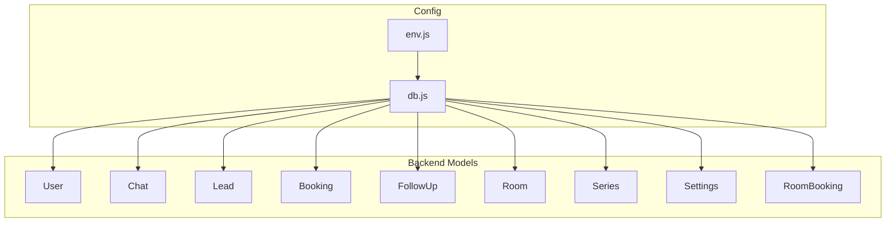

**Diagram sources**
- [db.js:10-29](file://backend/src/config/db.js#L10-L29)
- [env.js:56-57](file://backend/src/config/env.js#L56-L57)

**Section sources**
- [db.js:10-29](file://backend/src/config/db.js#L10-L29)
- [env.js:56-57](file://backend/src/config/env.js#L56-L57)

## Core Components
This section summarizes each model’s purpose, key fields, types, validations, and indexes.

- User
  - Purpose: Application users with authentication and role-based access.
  - Key fields: name, email (unique, lowercase, trimmed), password (hashed), role (admin/staff), isActive, lastLogin.
  - Validations: required fields, enum for role, boolean default for isActive.
  - Indexes: email, role, isActive.
  - Hooks/methods: pre-save hashing; comparePassword method.

- Chat
  - Purpose: WhatsApp conversation records per customer phone number.
  - Key fields: customerPhone (unique, indexed), customerName, whatsappNumberUsed, mode (ai/human), language, messages array, lastMessageAt, bookingStage, bookingDraft, isNewConversation, conversationResetAt, isArchived.
  - Validations: enums for sender/messageType/mode/language/bookingStage; defaults for mode/language/isNewConversation/isArchived.
  - Indexes: customerPhone, lastMessageAt, mode, bookingStage, isArchived, language.
  - Notes: Chats are never hard-deleted; use isArchived for soft deletion.

- Lead
  - Purpose: Sales lead tracking linked to a chat.
  - Key fields: chatId (ref Chat), customerPhone, score (0–100), scoreFactors array, status (cold/warm/hot/converted/lost), convertedAt, lastActivityAt.
  - Validations: required chatId/customerPhone; min/max on score; enum for status.
  - Indexes: chatId, customerPhone, status, score, lastActivityAt.

- Booking
  - Purpose: Finalized bookings derived from chats.
  - Key fields: chatId (ref Chat), customerName, customerPhone, bookingType (couple/group/picnic), date, isWeekend, adults, kids array, totalAmount, priceBreakdown, specialRequests, status (draft/pending_payment/confirmed/cancelled), createdBy (ai/staff).
  - Validations: required fields; enums for bookingType/status/createdBy.
  - Indexes: customerPhone, date, status, bookingType, chatId.

- FollowUp
  - Purpose: Scheduled follow-up tasks for customers.
  - Key fields: chatId (ref Chat), customerPhone, stage (3hr/1day/3day/7day), scheduledFor, status (pending/sent/cancelled), cancelReason, sentAt.
  - Validations: required chatId/customerPhone/stage/scheduledFor; enum values; defaults.
  - Indexes: chatId, customerPhone, scheduledFor, status, stage.

- Series
  - Purpose: Logical grouping of rooms (e.g., wellness series).
  - Key fields: name (unique, trimmed), status (active/maintenance/wellness/deleted), notes.
  - Validations: required name; enum for status; defaults.
  - Indexes: unique index on name.

- Room
  - Purpose: Individual room within a series.
  - Key fields: seriesId (ref Series), roomNumber (trimmed), capacity, status (active/maintenance/wellness/deleted), notes.
  - Validations: required seriesId/roomNumber/capacity; enum for status; defaults.
  - Indexes: compound unique index on seriesId + roomNumber.

- Settings
  - Purpose: Global application settings.
  - Key fields: globalMode (ai/human), whatsappNumbers array (number, label, isActive, isPrimary), openRouterModelOverride, followUpEnabled.
  - Validations: enum for globalMode; defaults.
  - Indexes: globalMode.

- RoomBooking
  - Purpose: Assigns a specific room to a booking for a date range.
  - Key fields: roomId (ref Room), bookingId (ref Booking), checkInDate, checkOutDate, status (confirmed/checked_in/checked_out/cancelled/no_show), assignedBy (ref User).
  - Validations: required references and dates; enum for status; defaults.
  - Indexes: roomId, bookingId, checkInDate, checkOutDate; compound index on roomId + checkInDate + checkOutDate.

**Section sources**
- [User.js:4-38](file://backend/src/models/User.js#L4-L38)
- [User.js:36-38](file://backend/src/models/User.js#L36-L38)
- [User.js:40-60](file://backend/src/models/User.js#L40-L60)
- [Chat.js:45-104](file://backend/src/models/Chat.js#L45-L104)
- [Chat.js:99-104](file://backend/src/models/Chat.js#L99-L104)
- [Lead.js:12-52](file://backend/src/models/Lead.js#L12-L52)
- [Lead.js:48-52](file://backend/src/models/Lead.js#L48-L52)
- [Booking.js:8-66](file://backend/src/models/Booking.js#L8-L66)
- [Booking.js:62-66](file://backend/src/models/Booking.js#L62-L66)
- [FollowUp.js:3-46](file://backend/src/models/FollowUp.js#L3-L46)
- [FollowUp.js:42-46](file://backend/src/models/FollowUp.js#L42-L46)
- [Series.js:3-21](file://backend/src/models/Series.js#L3-L21)
- [Room.js:3-33](file://backend/src/models/Room.js#L3-L33)
- [Settings.js:16-36](file://backend/src/models/Settings.js#L16-L36)
- [Settings.js:35](file://backend/src/models/Settings.js#L35)
- [RoomBooking.js:3-42](file://backend/src/models/RoomBooking.js#L3-L42)

## Architecture Overview
The following diagram shows how entities relate through references and shared identifiers.

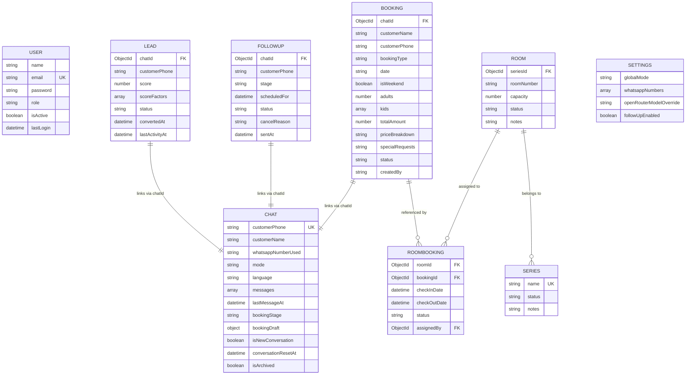

**Diagram sources**
- [User.js:4-38](file://backend/src/models/User.js#L4-L38)
- [Chat.js:45-104](file://backend/src/models/Chat.js#L45-L104)
- [Lead.js:12-52](file://backend/src/models/Lead.js#L12-L52)
- [Booking.js:8-66](file://backend/src/models/Booking.js#L8-L66)
- [FollowUp.js:3-46](file://backend/src/models/FollowUp.js#L3-L46)
- [Series.js:3-21](file://backend/src/models/Series.js#L3-L21)
- [Room.js:3-33](file://backend/src/models/Room.js#L3-L33)
- [Settings.js:16-36](file://backend/src/models/Settings.js#L16-L36)
- [RoomBooking.js:3-42](file://backend/src/models/RoomBooking.js#L3-L42)

## Detailed Component Analysis

### User Model
- Primary key: _id (auto-generated ObjectId).
- Unique constraint: email.
- Validation rules:
  - name: required.
  - email: required, unique, lowercase, trim.
  - password: required (stored hashed).
  - role: enum ['admin', 'staff'], default 'staff'.
  - isActive: boolean, default true.
  - lastLogin: optional Date.
- Indexes: email, role, isActive.
- Security:
  - Passwords are hashed before save using bcrypt.
  - comparePassword method validates candidate passwords.
- Business constraints:
  - Role controls access levels.
  - isActive can be used to disable accounts without deleting them.

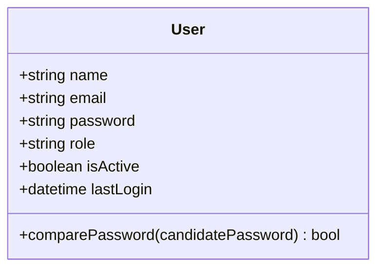

**Diagram sources**
- [User.js:4-38](file://backend/src/models/User.js#L4-L38)
- [User.js:40-60](file://backend/src/models/User.js#L40-L60)

**Section sources**
- [User.js:4-38](file://backend/src/models/User.js#L4-L38)
- [User.js:36-38](file://backend/src/models/User.js#L36-L38)
- [User.js:40-60](file://backend/src/models/User.js#L40-L60)

### Chat Model
- Primary key: _id (auto-generated ObjectId).
- Unique constraint: customerPhone.
- Embedded documents:
  - messages[]: sender (enum: customer/bot/staff), text, timestamp, messageType (enum: text/image/document).
  - bookingDraft: nested booking details captured during conversation flow.
- Enums:
  - mode: ai/human.
  - language: hindi/marathi/english/hinglish/gujarati/unknown.
  - bookingStage: none/type_selected/date_given/guests_given/kids_given/married_checked/price_quoted/name_given/phone_given/special_requests/handed_over/completed.
- Soft deletion: isArchived flag; comments explicitly state chats are never hard-deleted.
- Indexes: customerPhone, lastMessageAt, mode, bookingStage, isArchived, language.

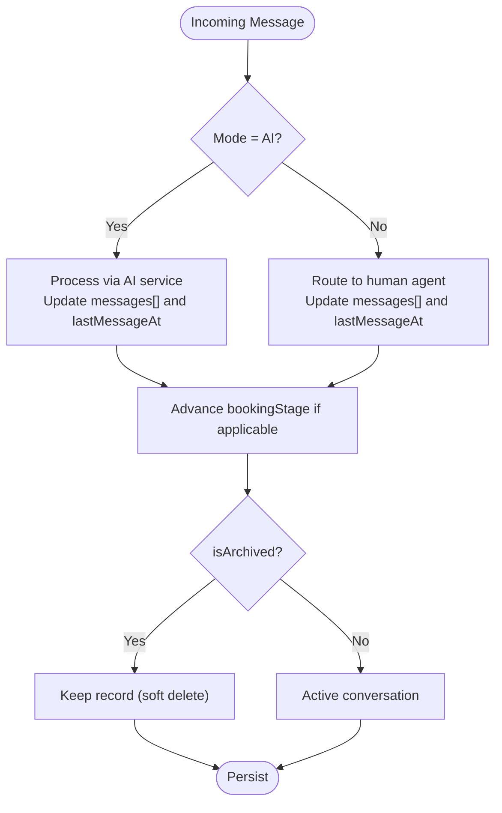

**Diagram sources**
- [Chat.js:1-4](file://backend/src/models/Chat.js#L1-L4)
- [Chat.js:45-104](file://backend/src/models/Chat.js#L45-L104)

**Section sources**
- [Chat.js:1-4](file://backend/src/models/Chat.js#L1-L4)
- [Chat.js:45-104](file://backend/src/models/Chat.js#L45-L104)
- [Chat.js:99-104](file://backend/src/models/Chat.js#L99-L104)

### Lead Model
- Primary key: _id (auto-generated ObjectId).
- References: chatId -> Chat.
- Fields:
  - customerPhone: required.
  - score: number, min 0, max 100.
  - scoreFactors: array of factor/points/addedAt.
  - status: cold/warm/hot/converted/lost.
  - convertedAt: optional Date.
  - lastActivityAt: optional Date.
- Indexes: chatId, customerPhone, status, score, lastActivityAt.

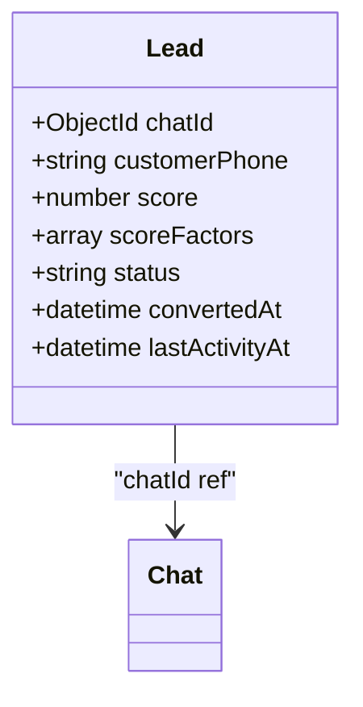

**Diagram sources**
- [Lead.js:12-52](file://backend/src/models/Lead.js#L12-L52)

**Section sources**
- [Lead.js:12-52](file://backend/src/models/Lead.js#L12-L52)
- [Lead.js:48-52](file://backend/src/models/Lead.js#L48-L52)

### Booking Model
- Primary key: _id (auto-generated ObjectId).
- References: chatId -> Chat.
- Fields:
  - customerName, customerPhone: required.
  - bookingType: couple/group/picnic.
  - date: string (required).
  - isWeekend: boolean.
  - adults: number.
  - kids: array of age/rate.
  - totalAmount: number (required).
  - priceBreakdown, specialRequests: strings.
  - status: draft/pending_payment/confirmed/cancelled.
  - createdBy: ai/staff.
- Indexes: customerPhone, date, status, bookingType, chatId.

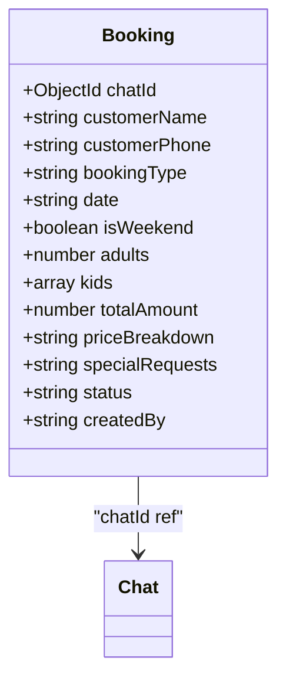

**Diagram sources**
- [Booking.js:8-66](file://backend/src/models/Booking.js#L8-L66)

**Section sources**
- [Booking.js:8-66](file://backend/src/models/Booking.js#L8-L66)
- [Booking.js:62-66](file://backend/src/models/Booking.js#L62-L66)

### FollowUp Model
- Primary key: _id (auto-generated ObjectId).
- References: chatId -> Chat.
- Fields:
  - customerPhone: required.
  - stage: 3hr/1day/3day/7day.
  - scheduledFor: required Date.
  - status: pending/sent/cancelled.
  - cancelReason: optional string.
  - sentAt: optional Date.
- Indexes: chatId, customerPhone, scheduledFor, status, stage.

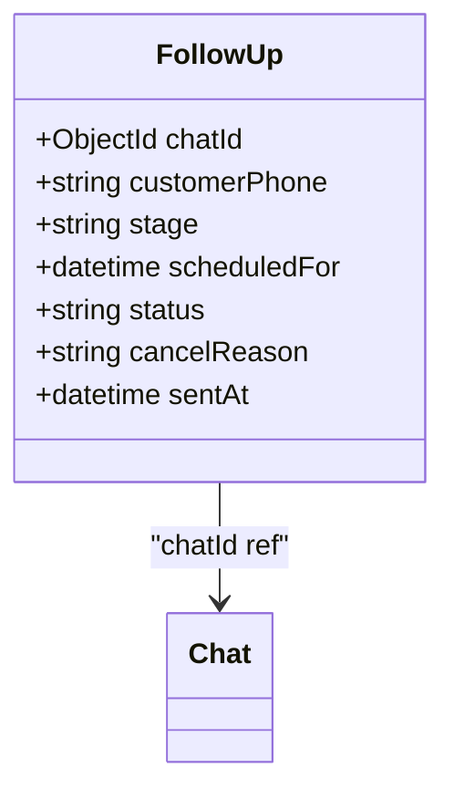

**Diagram sources**
- [FollowUp.js:3-46](file://backend/src/models/FollowUp.js#L3-L46)

**Section sources**
- [FollowUp.js:3-46](file://backend/src/models/FollowUp.js#L3-L46)
- [FollowUp.js:42-46](file://backend/src/models/FollowUp.js#L42-L46)

### Series and Room Models
- Series:
  - name: unique, trimmed.
  - status: active/maintenance/wellness/deleted.
  - notes: string.
- Room:
  - seriesId: ref Series.
  - roomNumber: trimmed.
  - capacity: number.
  - status: active/maintenance/wellness/deleted.
  - notes: string.
  - Compound unique index on seriesId + roomNumber.

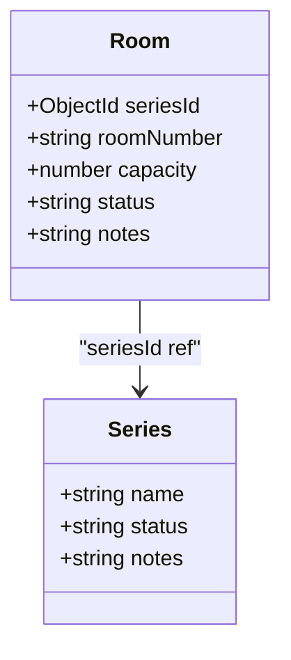

**Diagram sources**
- [Series.js:3-21](file://backend/src/models/Series.js#L3-L21)
- [Room.js:3-33](file://backend/src/models/Room.js#L3-L33)

**Section sources**
- [Series.js:3-21](file://backend/src/models/Series.js#L3-L21)
- [Room.js:3-33](file://backend/src/models/Room.js#L3-L33)

### Settings Model
- Fields:
  - globalMode: ai/human (default ai).
  - whatsappNumbers: array of number/label/isActive/isPrimary.
  - openRouterModelOverride: string (nullable).
  - followUpEnabled: boolean (default true).
- Index: globalMode.

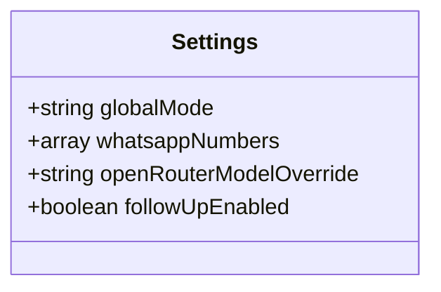

**Diagram sources**
- [Settings.js:16-36](file://backend/src/models/Settings.js#L16-L36)

**Section sources**
- [Settings.js:16-36](file://backend/src/models/Settings.js#L16-L36)
- [Settings.js:35](file://backend/src/models/Settings.js#L35)

### RoomBooking Model
- Primary key: _id (auto-generated ObjectId).
- References:
  - roomId -> Room.
  - bookingId -> Booking.
  - assignedBy -> User.
- Fields:
  - checkInDate, checkOutDate: required Dates.
  - status: confirmed/checked_in/checked_out/cancelled/no_show.
- Indexes:
  - roomId, bookingId, checkInDate, checkOutDate.
  - Compound index on roomId + checkInDate + checkOutDate for overlap queries.

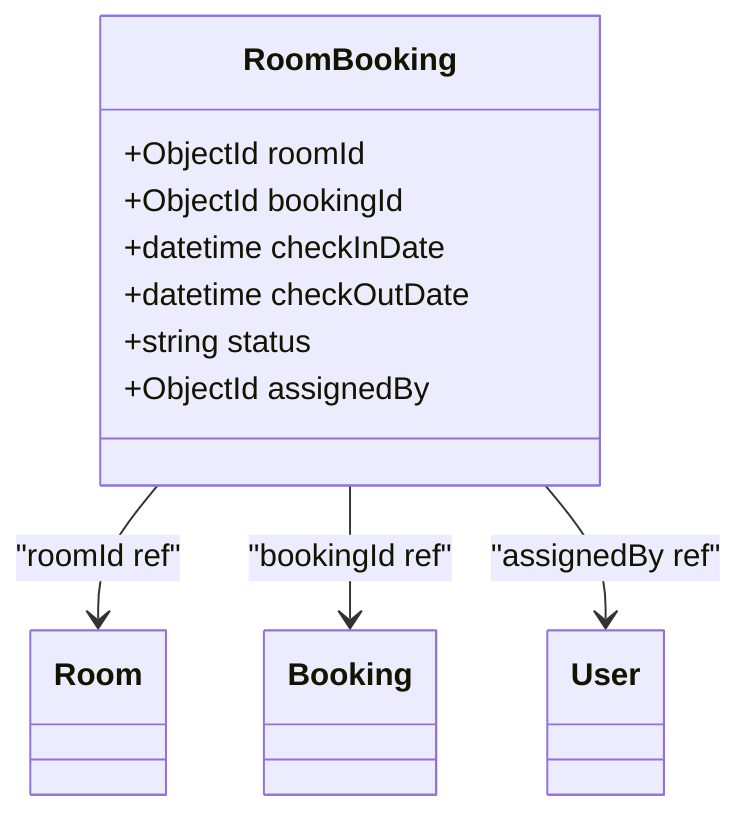

**Diagram sources**
- [RoomBooking.js:3-42](file://backend/src/models/RoomBooking.js#L3-L42)

**Section sources**
- [RoomBooking.js:3-42](file://backend/src/models/RoomBooking.js#L3-L42)

## Dependency Analysis
- Direct references:
  - Lead.chatId -> Chat.
  - Booking.chatId -> Chat.
  - FollowUp.chatId -> Chat.
  - Room.seriesId -> Series.
  - RoomBooking.roomId -> Room.
  - RoomBooking.bookingId -> Booking.
  - RoomBooking.assignedBy -> User.
- Shared identifiers:
  - customerPhone appears across Chat, Lead, Booking, FollowUp for cross-entity correlation.
- Index usage:
  - Frequent filters on status, mode, language, bookingStage, scheduledFor, and date ranges benefit from defined indexes.
  - Overlap checks for RoomBooking rely on compound index on roomId + checkInDate + checkOutDate.

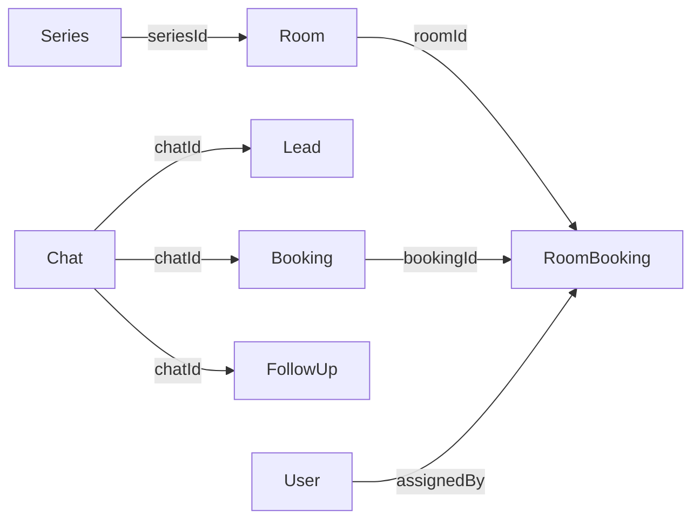

**Diagram sources**
- [Lead.js:12-52](file://backend/src/models/Lead.js#L12-L52)
- [Booking.js:8-66](file://backend/src/models/Booking.js#L8-L66)
- [FollowUp.js:3-46](file://backend/src/models/FollowUp.js#L3-L46)
- [Room.js:3-33](file://backend/src/models/Room.js#L3-L33)
- [RoomBooking.js:3-42](file://backend/src/models/RoomBooking.js#L3-L42)

**Section sources**
- [index.js:1-22](file://backend/src/models/index.js#L1-L22)

## Performance Considerations
- Index strategy:
  - High-cardinality fields like customerPhone, email, and scheduledFor are indexed to optimize lookups and scheduling queries.
  - Status and mode fields are frequently filtered; their indexes improve dashboard and filtering performance.
  - Compound index on RoomBooking supports efficient overlap detection for availability checks.
- Query patterns:
  - Recent conversations: sort by lastMessageAt descending.
  - Leads by status/score: filter by status and order by score.
  - Follow-ups due soon: filter by scheduledFor <= now and status = pending.
  - Availability: find RoomBookings for a room within a date range using the compound index.
- Data size:
  - Chat.messages arrays can grow large; consider pagination when retrieving message history.
  - Use projections to limit returned fields where possible.

[No sources needed since this section provides general guidance]

## Troubleshooting Guide
- Connection issues:
  - The app retries MongoDB connection up to a maximum number of attempts and logs errors; ensure MONGO_URI is correct and network connectivity is available.
- Common errors:
  - Duplicate key on email or customerPhone indicates uniqueness violations.
  - Invalid enum values will fail validation; verify allowed values for fields like mode, language, status.
- Debugging tips:
  - Check logs for MongoDB disconnection and error events.
  - Validate environment variables using the env schema to catch misconfiguration early.

**Section sources**
- [db.js:10-29](file://backend/src/config/db.js#L10-L29)
- [db.js:31-37](file://backend/src/config/db.js#L31-L37)
- [env.js:48-54](file://backend/src/config/env.js#L48-L54)

## Conclusion
The schema is designed for robust conversational CRM functionality with clear separation between chat-driven interactions, sales leads, bookings, and operational resources (rooms/series). Strong indexing and validation rules support reliable operations, while soft deletion preserves historical data integrity. Security is enforced at the model level with hashed passwords and role-based attributes.

[No sources needed since this section summarizes without analyzing specific files]

## Appendices

### Field Definitions and Constraints Summary
- User
  - name: String, required.
  - email: String, required, unique, lowercase, trim.
  - password: String, required (hashed).
  - role: String, enum ['admin','staff'], default 'staff'.
  - isActive: Boolean, default true.
  - lastLogin: Date, optional.
- Chat
  - customerPhone: String, required, unique, indexed.
  - customerName: String, optional.
  - whatsappNumberUsed: String, optional.
  - mode: String, enum ['ai','human'], default 'ai'.
  - language: String, enum ['hindi','marathi','english','hinglish','gujarati','unknown'], default 'unknown'.
  - messages: Array of embedded objects (sender, text, timestamp, messageType).
  - lastMessageAt: Date, indexed.
  - bookingStage: String, enum as listed, default 'none'.
  - bookingDraft: Embedded object with booking details.
  - isNewConversation: Boolean, default true.
  - conversationResetAt: Date, default null.
  - isArchived: Boolean, default false.
- Lead
  - chatId: ObjectId, ref Chat, required, indexed.
  - customerPhone: String, required.
  - score: Number, min 0, max 100, default 0.
  - scoreFactors: Array of factor/points/addedAt.
  - status: String, enum ['cold','warm','hot','converted','lost'], default 'cold', indexed.
  - convertedAt: Date, default null.
  - lastActivityAt: Date, indexed.
- Booking
  - chatId: ObjectId, ref Chat.
  - customerName: String, required.
  - customerPhone: String, required.
  - bookingType: String, enum ['couple','group','picnic'], required.
  - date: String, required.
  - isWeekend: Boolean.
  - adults: Number.
  - kids: Array of age/rate.
  - totalAmount: Number, required.
  - priceBreakdown: String.
  - specialRequests: String.
  - status: String, enum ['draft','pending_payment','confirmed','cancelled'], default 'draft', indexed.
  - createdBy: String, enum ['ai','staff'], default 'ai'.
- FollowUp
  - chatId: ObjectId, ref Chat, required, indexed.
  - customerPhone: String, required.
  - stage: String, enum ['3hr','1day','3day','7day'], required.
  - scheduledFor: Date, required, indexed.
  - status: String, enum ['pending','sent','cancelled'], default 'pending', indexed.
  - cancelReason: String, default null.
  - sentAt: Date, default null.
- Series
  - name: String, required, unique, trim.
  - status: String, enum ['active','maintenance','wellness','deleted'], default 'active'.
  - notes: String, default ''.
- Room
  - seriesId: ObjectId, ref Series, required, indexed.
  - roomNumber: String, required, trim.
  - capacity: Number, required.
  - status: String, enum ['active','maintenance','wellness','deleted'], default 'active'.
  - notes: String, default ''.
- Settings
  - globalMode: String, enum ['ai','human'], default 'ai'.
  - whatsappNumbers: Array of number/label/isActive/isPrimary.
  - openRouterModelOverride: String, default null.
  - followUpEnabled: Boolean, default true.
- RoomBooking
  - roomId: ObjectId, ref Room, required, indexed.
  - bookingId: ObjectId, ref Booking, required, indexed.
  - checkInDate: Date, required, indexed.
  - checkOutDate: Date, required, indexed.
  - status: String, enum ['confirmed','checked_in','checked_out','cancelled','no_show'], default 'confirmed'.
  - assignedBy: ObjectId, ref User, required.

**Section sources**
- [User.js:4-38](file://backend/src/models/User.js#L4-L38)
- [Chat.js:45-104](file://backend/src/models/Chat.js#L45-L104)
- [Lead.js:12-52](file://backend/src/models/Lead.js#L12-L52)
- [Booking.js:8-66](file://backend/src/models/Booking.js#L8-L66)
- [FollowUp.js:3-46](file://backend/src/models/FollowUp.js#L3-L46)
- [Series.js:3-21](file://backend/src/models/Series.js#L3-L21)
- [Room.js:3-33](file://backend/src/models/Room.js#L3-L33)
- [Settings.js:16-36](file://backend/src/models/Settings.js#L16-L36)
- [RoomBooking.js:3-42](file://backend/src/models/RoomBooking.js#L3-L42)

### Indexes and Query Patterns
- User
  - Indexes: email, role, isActive.
  - Queries: find by email; filter by role/isActive.
- Chat
  - Indexes: customerPhone, lastMessageAt, mode, bookingStage, isArchived, language.
  - Queries: recent chats by lastMessageAt; filter by mode/language/bookingStage; soft-delete via isArchived.
- Lead
  - Indexes: chatId, customerPhone, status, score, lastActivityAt.
  - Queries: leads by status; top-scoring leads; activity-based sorting.
- Booking
  - Indexes: customerPhone, date, status, bookingType, chatId.
  - Queries: bookings by date/status/type; lookup by customerPhone/chatId.
- FollowUp
  - Indexes: chatId, customerPhone, scheduledFor, status, stage.
  - Queries: upcoming follow-ups by scheduledFor and status; stage-based processing.
- Room
  - Indexes: seriesId + roomNumber (unique).
  - Queries: list rooms by series; enforce unique room numbers per series.
- RoomBooking
  - Indexes: roomId, bookingId, checkInDate, checkOutDate; compound roomId + checkInDate + checkOutDate.
  - Queries: availability checks for overlapping date ranges; assign rooms to bookings.

**Section sources**
- [User.js:36-38](file://backend/src/models/User.js#L36-L38)
- [Chat.js:99-104](file://backend/src/models/Chat.js#L99-L104)
- [Lead.js:48-52](file://backend/src/models/Lead.js#L48-L52)
- [Booking.js:62-66](file://backend/src/models/Booking.js#L62-L66)
- [FollowUp.js:42-46](file://backend/src/models/FollowUp.js#L42-L46)
- [Room.js:32](file://backend/src/models/Room.js#L32)
- [RoomBooking.js:41](file://backend/src/models/RoomBooking.js#L41)

### Data Lifecycle Management
- Soft deletion:
  - Chat uses isArchived to preserve conversation history; no hard deletes are performed on chats.
- Status transitions:
  - Booking statuses progress through draft -> pending_payment -> confirmed -> cancelled.
  - RoomBooking statuses reflect occupancy lifecycle: confirmed -> checked_in -> checked_out or cancelled/no_show.
- Archival strategies:
  - For long-term storage, consider moving archived chats and old bookings to cold storage collections or external archives based on retention policies.

**Section sources**
- [Chat.js:1-4](file://backend/src/models/Chat.js#L1-L4)
- [Chat.js:91-94](file://backend/src/models/Chat.js#L91-L94)
- [Booking.js:47-52](file://backend/src/models/Booking.js#L47-L52)
- [RoomBooking.js:26-30](file://backend/src/models/RoomBooking.js#L26-L30)

### Security and Access Control
- Authentication:
  - Passwords are hashed using bcrypt; comparePassword validates credentials.
- Authorization:
  - User.role distinguishes admin vs staff; middleware should enforce route-level permissions.
- Data protection:
  - Avoid logging sensitive fields (passwords).
  - Ensure environment variables (MONGO_URI, JWT_SECRET) are secured.

**Section sources**
- [User.js:40-60](file://backend/src/models/User.js#L40-L60)
- [User.js:20-24](file://backend/src/models/User.js#L20-L24)
- [env.js:56-59](file://backend/src/config/env.js#L56-L59)

### Backup and Recovery Procedures
- MongoDB backups:
  - Use mongodump/mongorestore or cloud provider snapshots for consistent backups.
  - Schedule regular backups for production; test restore procedures periodically.
- Point-in-time recovery:
  - Enable oplog-based replication and PITR if supported by your deployment.
- Disaster recovery:
  - Maintain offsite backups and documented runbooks for restoration.

[No sources needed since this section provides general guidance]

### Sample Data Structures and Common Queries
- Example structures (descriptive):
  - User: { name, email, password (hashed), role, isActive, lastLogin }.
  - Chat: { customerPhone, customerName, mode, language, messages[], lastMessageAt, bookingStage, bookingDraft, isNewConversation, conversationResetAt, isArchived }.
  - Lead: { chatId, customerPhone, score, scoreFactors[], status, convertedAt, lastActivityAt }.
  - Booking: { chatId, customerName, customerPhone, bookingType, date, isWeekend, adults, kids[], totalAmount, priceBreakdown, specialRequests, status, createdBy }.
  - FollowUp: { chatId, customerPhone, stage, scheduledFor, status, cancelReason, sentAt }.
  - Series: { name, status, notes }.
  - Room: { seriesId, roomNumber, capacity, status, notes }.
  - Settings: { globalMode, whatsappNumbers[], openRouterModelOverride, followUpEnabled }.
  - RoomBooking: { roomId, bookingId, checkInDate, checkOutDate, status, assignedBy }.
- Common queries (descriptive):
  - Find recent chats: sort by lastMessageAt descending, filter by isArchived=false.
  - Get leads by status: filter by status, order by score descending.
  - Upcoming follow-ups: filter by scheduledFor <= now and status=pending.
  - Room availability: find RoomBookings for a given roomId where checkInDate < newCheckOutDate and checkOutDate > newCheckInDate.

[No sources needed since this section provides general guidance]