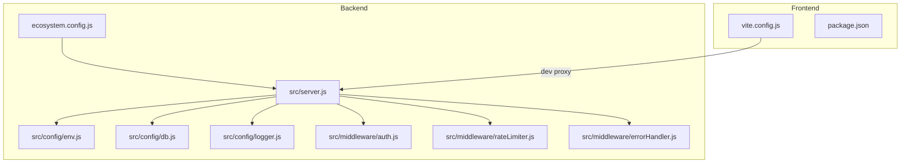
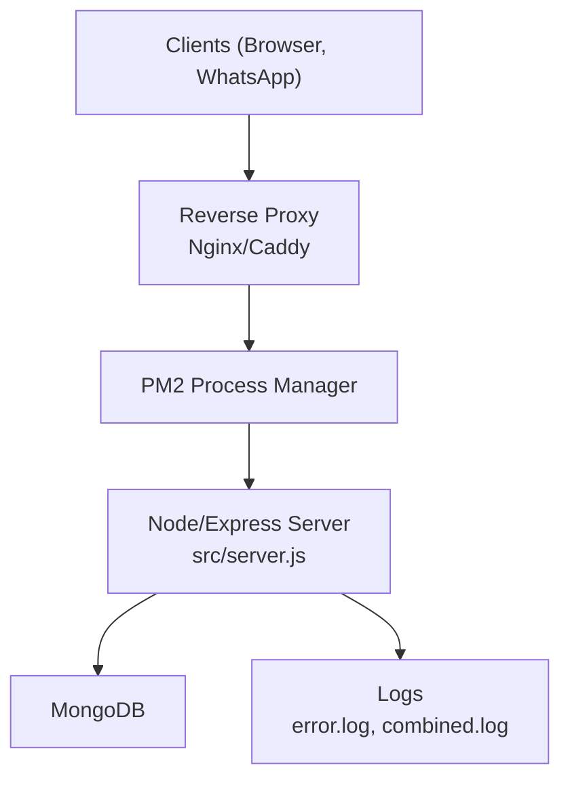
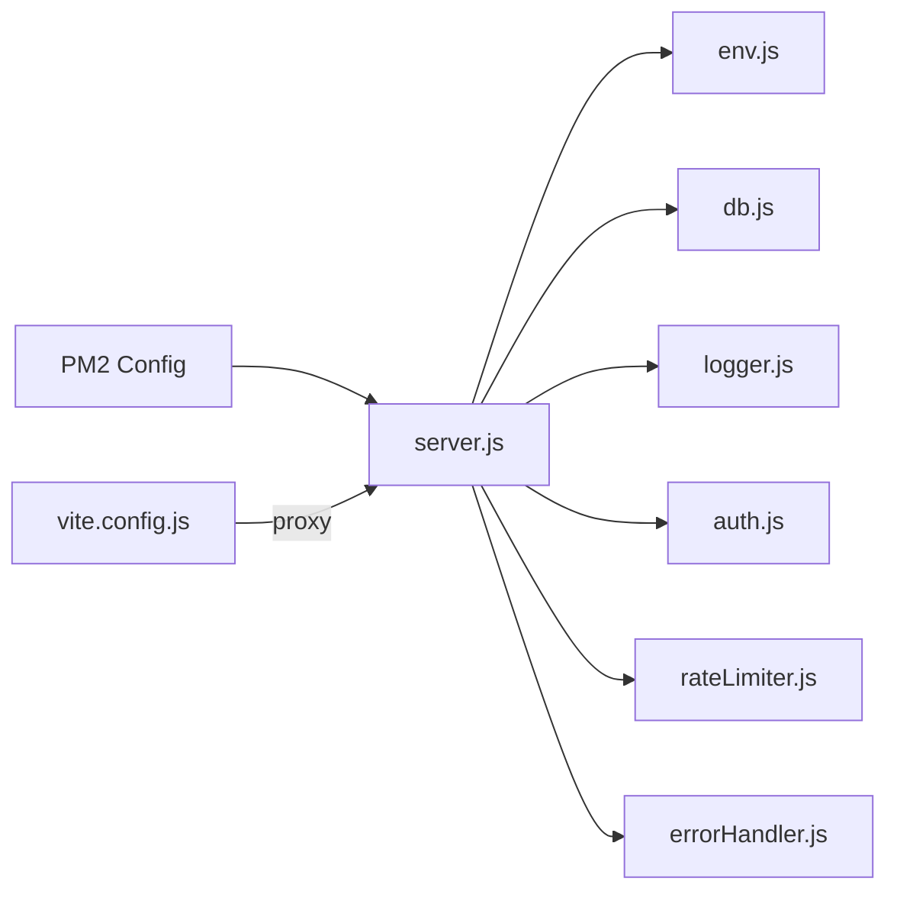
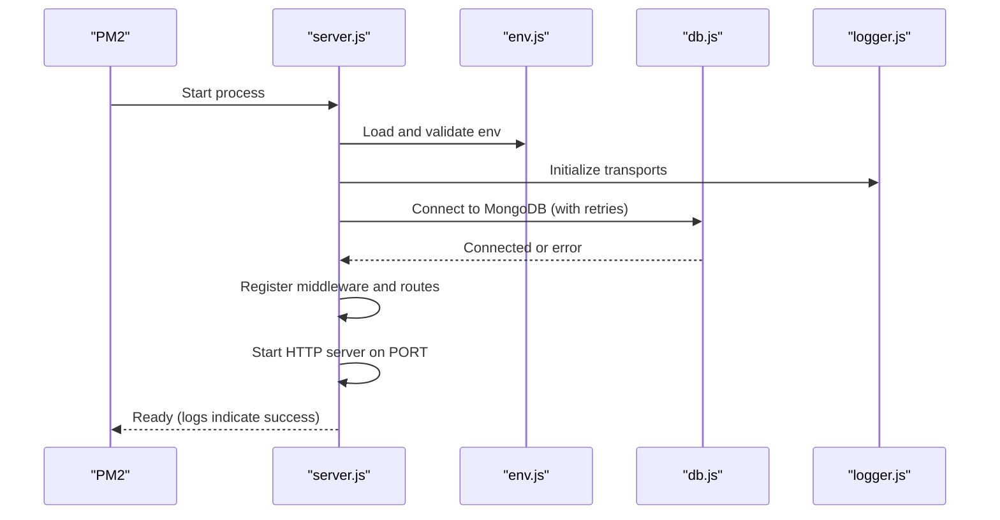

# Deployment Guide

<cite>
**Referenced Files in This Document**
- [README.md](file://README.md)
- [backend/package.json](file://backend/package.json)
- [backend/ecosystem.config.js](file://backend/ecosystem.config.js)
- [backend/src/server.js](file://backend/src/server.js)
- [backend/src/config/env.js](file://backend/src/config/env.js)
- [backend/src/config/db.js](file://backend/src/config/db.js)
- [backend/src/config/logger.js](file://backend/src/config/logger.js)
- [backend/src/middleware/auth.js](file://backend/src/middleware/auth.js)
- [backend/src/middleware/rateLimiter.js](file://backend/src/middleware/rateLimiter.js)
- [backend/src/middleware/errorHandler.js](file://backend/src/middleware/errorHandler.js)
- [frontend/vite.config.js](file://frontend/vite.config.js)
- [frontend/package.json](file://frontend/package.json)
- [backend/.gitignore](file://backend/.gitignore)
</cite>

## Table of Contents
1. Introduction
2. Project Structure
3. Core Components
4. Architecture Overview
5. Detailed Component Analysis
6. Dependency Analysis
7. Performance Considerations
8. Troubleshooting Guide
9. Conclusion
10. Appendices

## Introduction
This guide provides production deployment instructions for the Nandibaag Bot application, covering process management with PM2, environment configuration, security hardening, reverse proxy and SSL setup, load balancing, monitoring and logging, performance tuning, scaling, backup and disaster recovery, and troubleshooting. It is designed to be accessible to operators and DevOps engineers while remaining precise enough for implementation.

## Project Structure
The repository contains a Node.js/Express backend and a React/Vite frontend:
- Backend: Express server, MongoDB via Mongoose, Socket.io, WhatsApp integration, AI services, rate limiting, JWT auth, Winston logging, and PM2 configuration.
- Frontend: Vite build pipeline, PWA support, dev-time API proxy to the backend.

**Diagram sources**
- [backend/src/server.js:1-241](file://backend/src/server.js#L1-L241)
- [backend/src/config/env.js:1-95](file://backend/src/config/env.js#L1-L95)
- [backend/src/config/db.js:1-40](file://backend/src/config/db.js#L1-L40)
- [backend/src/config/logger.js:1-52](file://backend/src/config/logger.js#L1-L52)
- [backend/src/middleware/auth.js:1-68](file://backend/src/middleware/auth.js#L1-L68)
- [backend/src/middleware/rateLimiter.js:1-37](file://backend/src/middleware/rateLimiter.js#L1-L37)
- [backend/src/middleware/errorHandler.js:1-36](file://backend/src/middleware/errorHandler.js#L1-L36)
- [backend/ecosystem.config.js:1-19](file://backend/ecosystem.config.js#L1-L19)
- [frontend/vite.config.js:1-63](file://frontend/vite.config.js#L1-L63)

**Section sources**
- [README.md:1-164](file://README.md#L1-L164)
- [backend/package.json:1-47](file://backend/package.json#L1-L47)
- [frontend/package.json:1-28](file://frontend/package.json#L1-L28)

## Core Components
- Process Management (PM2): The backend uses a PM2 ecosystem file to manage the Node process, including restart policies, log files, and environment variables.
- Environment Configuration: Strict validation of required environment variables at startup; defaults provided where applicable.
- Database Connectivity: MongoDB connection with retry logic and graceful exit on repeated failures.
- Security Middleware: Helmet, CORS, compression, rate limiting, and JWT-based authentication middleware.
- Logging: Winston transports for error and combined logs; console output in development.
- Health Check: A /health endpoint exposes runtime status, uptime, MongoDB connectivity, and active WhatsApp sessions.

Key responsibilities and behaviors are implemented in the following files:
- PM2 configuration and process lifecycle
- Environment variable schema and validation
- Database connection and retries
- Security and request handling
- Logging strategy
- Health check and graceful shutdown

**Section sources**
- [backend/ecosystem.config.js:1-19](file://backend/ecosystem.config.js#L1-L19)
- [backend/src/config/env.js:1-95](file://backend/src/config/env.js#L1-L95)
- [backend/src/config/db.js:1-40](file://backend/src/config/db.js#L1-L40)
- [backend/src/middleware/rateLimiter.js:1-37](file://backend/src/middleware/rateLimiter.js#L1-L37)
- [backend/src/middleware/auth.js:1-68](file://backend/src/middleware/auth.js#L1-L68)
- [backend/src/config/logger.js:1-52](file://backend/src/config/logger.js#L1-L52)
- [backend/src/server.js:1-241](file://backend/src/server.js#L1-L241)

## Architecture Overview
Production architecture typically places a reverse proxy (e.g., Nginx or Caddy) in front of the backend, serving the static frontend assets and terminating TLS. PM2 manages the Node process, which connects to MongoDB and exposes HTTP and WebSocket endpoints.

[No sources needed since this diagram shows conceptual workflow, not actual code structure]

## Detailed Component Analysis

### PM2 Process Management
- Application name and script entry point are defined in the PM2 config.
- Instances set to 1 by default; adjust for horizontal scaling behind a load balancer if needed.
- Memory-based auto-restart threshold configured.
- Auto-restart enabled with max restarts and minimum uptime.
- Error and combined logs written to the logs directory.
- NODE_ENV set to production.

Operational commands:
- Start using the ecosystem file
- Save current state
- Generate system startup script

Considerations:
- For multi-instance mode, ensure shared state (sessions, logs) is handled appropriately.
- Use PM2 logs and monit for observability.

**Section sources**
- [backend/ecosystem.config.js:1-19](file://backend/ecosystem.config.js#L1-L19)
- [README.md:122-131](file://README.md#L122-L131)

### Environment Variables Setup
Required and optional variables are validated at startup. Key categories include:
- Database: MongoDB URI
- Authentication: JWT secret and expiration
- AI Providers: OpenRouter primary key/model, plus optional tiers (Gemini, Groq, Cloudflare Workers AI, Cerebras)
- Server: PORT, NODE_ENV
- Business: Resort contacts, admin defaults, frontend URL for CORS

Validation behavior:
- On missing or invalid values, the app logs details and exits.

Defaults:
- PORT defaults to 7000 when not provided.
- NODE_ENV defaults to development when not provided.

Recommended production values:
- Set NODE_ENV=production
- Configure a strong JWT_SECRET and appropriate JWT_EXPIRES_IN
- Provide FRONTEND_URL matching your domain
- Supply all required AI provider keys as needed

**Section sources**
- [backend/src/config/env.js:1-95](file://backend/src/config/env.js#L1-L95)
- [backend/src/server.js:1-241](file://backend/src/server.js#L1-L241)

### Security Hardening
Built-in protections:
- Helmet sets secure HTTP headers.
- CORS restricted to the configured frontend origin.
- Compression reduces payload sizes.
- Rate limiting protects general API and login endpoints.
- JWT verification middleware enforces authentication and admin roles.
- Global error handler prevents stack trace leakage in production.

Additional recommendations:
- Enforce HTTPS at the reverse proxy.
- Restrict IP access to sensitive endpoints if necessary.
- Rotate secrets regularly and store them securely (e.g., secrets manager).
- Keep dependencies updated and audit periodically.

**Section sources**
- [backend/src/server.js:1-241](file://backend/src/server.js#L1-L241)
- [backend/src/middleware/auth.js:1-68](file://backend/src/middleware/auth.js#L1-L68)
- [backend/src/middleware/rateLimiter.js:1-37](file://backend/src/middleware/rateLimiter.js#L1-L37)
- [backend/src/middleware/errorHandler.js:1-36](file://backend/src/middleware/errorHandler.js#L1-L36)

### Reverse Proxy and SSL Certificate Setup
General guidance:
- Terminate TLS at the reverse proxy and forward HTTP to the backend process.
- Enable HTTP/2 and modern TLS settings.
- Configure upstream to the PM2-managed Node process port.
- Ensure WebSocket upgrade headers are forwarded for real-time features.
- Serve the built frontend assets from the reverse proxy.

[No sources needed since this section provides general guidance]

### Load Balancing Considerations
- With PM2 instances > 1, place a load balancer in front to distribute traffic.
- Ensure sticky sessions are not required unless session data is stored externally.
- Centralize logs and metrics collection across instances.
- Scale horizontally by adding more PM2 instances per host or running multiple hosts behind a load balancer.

[No sources needed since this section provides general guidance]

### Monitoring and Logging Strategy
- Application logs:
  - Winston writes error.log and combined.log to the logs directory.
  - Console logging is enabled in development only.
- PM2 logs:
  - PM2 captures stdout/stderr and can rotate logs.
- Health checks:
  - /health endpoint returns status, uptime, MongoDB connectivity, and active WhatsApp sessions.

Log rotation:
- Use PM2 logrotate or an external tool (e.g., logrotate) to manage log growth.

Metrics:
- Integrate a metrics exporter (e.g., Prometheus client) and scrape via a time-series database.
- Forward structured logs to a centralized logging platform.

**Section sources**
- [backend/src/config/logger.js:1-52](file://backend/src/config/logger.js#L1-L52)
- [backend/src/server.js:63-86](file://backend/src/server.js#L63-L86)

### Performance Tuning
- Compression is enabled to reduce response sizes.
- Rate limiting mitigates abuse and protects resources.
- Adjust PM2 memory thresholds and instance count based on workload.
- Tune MongoDB connection options and indexes according to usage patterns.
- Cache frequently accessed data where appropriate.

**Section sources**
- [backend/src/server.js:1-241](file://backend/src/server.js#L1-L241)
- [backend/ecosystem.config.js:1-19](file://backend/ecosystem.config.js#L1-L19)

### Scaling Guidelines
- Vertical scaling: Increase CPU/memory for the Node process and MongoDB.
- Horizontal scaling: Run multiple PM2 instances or multiple hosts behind a load balancer.
- Stateless design: Avoid storing ephemeral state in-process; use databases or caches.
- Connection pooling: Ensure MongoDB and external service clients are tuned for concurrency.

[No sources needed since this section provides general guidance]

### Backup Procedures
- Database backups:
  - Schedule regular snapshots of MongoDB (e.g., mongodump or cloud-native snapshots).
  - Store backups offsite and encrypt them.
- File backups:
  - Back up logs and any persistent directories as needed.
- Configuration backups:
  - Version control configuration templates and secrets management entries.

[No sources needed since this section provides general guidance]

### Disaster Recovery Plan
- Define RPO/RTO targets aligned with business needs.
- Test restore procedures regularly.
- Maintain runbooks for common failure scenarios (DB outage, provider API failures).
- Implement health checks and automated alerts for critical components.

[No sources needed since this section provides general guidance]

### Docker Containerization Options
Conceptual approach:
- Build a minimal Node image for the backend and a static asset image for the frontend.
- Inject environment variables via container orchestration or secrets managers.
- Expose the backend port and mount volumes for logs if needed.
- Use health checks and resource limits in your orchestrator.

[No sources needed since this section provides general guidance]

### Frontend Build and Serving
- Production build produces static assets suitable for serving via a web server or CDN.
- During development, Vite proxies API requests to the backend.

**Section sources**
- [frontend/vite.config.js:1-63](file://frontend/vite.config.js#L1-L63)
- [frontend/package.json:1-28](file://frontend/package.json#L1-L28)
- [README.md:133-139](file://README.md#L133-L139)

## Dependency Analysis
High-level dependency relationships relevant to deployment:
- The server initializes configuration, database, logging, middleware, routes, and Socket.io.
- PM2 orchestrates the server process and manages logs.
- The frontend dev server proxies API calls to the backend during development.

**Diagram sources**
- [backend/ecosystem.config.js:1-19](file://backend/ecosystem.config.js#L1-L19)
- [backend/src/server.js:1-241](file://backend/src/server.js#L1-L241)
- [backend/src/config/env.js:1-95](file://backend/src/config/env.js#L1-L95)
- [backend/src/config/db.js:1-40](file://backend/src/config/db.js#L1-L40)
- [backend/src/config/logger.js:1-52](file://backend/src/config/logger.js#L1-L52)
- [backend/src/middleware/auth.js:1-68](file://backend/src/middleware/auth.js#L1-L68)
- [backend/src/middleware/rateLimiter.js:1-37](file://backend/src/middleware/rateLimiter.js#L1-L37)
- [backend/src/middleware/errorHandler.js:1-36](file://backend/src/middleware/errorHandler.js#L1-L36)
- [frontend/vite.config.js:1-63](file://frontend/vite.config.js#L1-L63)

**Section sources**
- [backend/package.json:1-47](file://backend/package.json#L1-L47)
- [frontend/package.json:1-28](file://frontend/package.json#L1-L28)

## Performance Considerations
- Enable compression and tune buffer sizes as needed.
- Monitor memory usage and adjust PM2 thresholds.
- Use connection pooling and optimize queries.
- Cache responses and static assets at the edge.
- Profile hot paths and consider worker threads for CPU-bound tasks.

[No sources needed since this section provides general guidance]

## Troubleshooting Guide
Common issues and resolutions:
- Port already in use:
  - The server logs a specific message and exits when the configured port is occupied.
  - Use the provided port-check utility to identify and free the port.
- Missing environment variables:
  - Validation fails at startup with detailed messages; ensure all required variables are present.
- MongoDB connection failures:
  - The app retries up to a configured number of times before exiting; verify connectivity and credentials.
- Authentication errors:
  - Invalid or expired tokens return explicit messages; verify JWT_SECRET and token issuance.
- Rate limiting:
  - Excessive requests are rejected; adjust limits or investigate abuse.
- Log accumulation:
  - Ensure log rotation is configured via PM2 or system tools.

Useful scripts and utilities:
- Port checking utility
- Environment setup helper

**Section sources**
- [backend/src/server.js:155-174](file://backend/src/server.js#L155-L174)
- [backend/src/config/env.js:48-54](file://backend/src/config/env.js#L48-L54)
- [backend/src/config/db.js:10-29](file://backend/src/config/db.js#L10-L29)
- [backend/src/middleware/auth.js:10-47](file://backend/src/middleware/auth.js#L10-L47)
- [backend/src/middleware/rateLimiter.js:1-37](file://backend/src/middleware/rateLimiter.js#L1-L37)
- [backend/src/config/logger.js:1-52](file://backend/src/config/logger.js#L1-L52)
- [backend/package.json:6-15](file://backend/package.json#L6-L15)

## Conclusion
By following this guide, you can deploy the Nandibaag Bot securely and reliably in production. Use PM2 for process management, enforce strict environment validation, apply security hardening, configure a reverse proxy with TLS, implement robust logging and monitoring, and plan for scaling, backups, and disaster recovery.

## Appendices

### End-to-End Startup Sequence

**Diagram sources**
- [backend/ecosystem.config.js:1-19](file://backend/ecosystem.config.js#L1-L19)
- [backend/src/server.js:1-241](file://backend/src/server.js#L1-L241)
- [backend/src/config/env.js:1-95](file://backend/src/config/env.js#L1-L95)
- [backend/src/config/db.js:1-40](file://backend/src/config/db.js#L1-L40)
- [backend/src/config/logger.js:1-52](file://backend/src/config/logger.js#L1-L52)