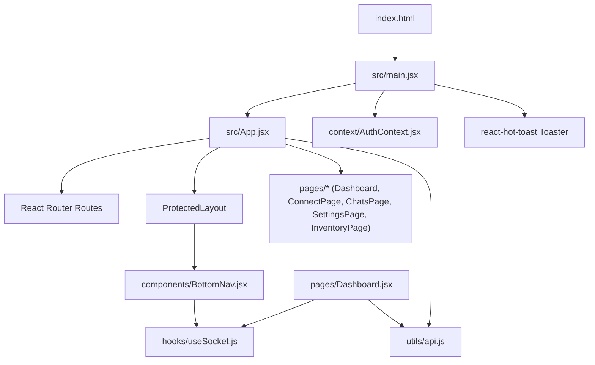
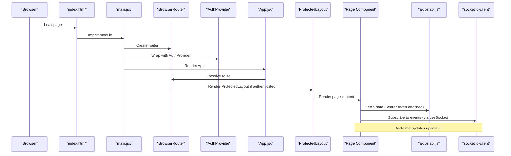
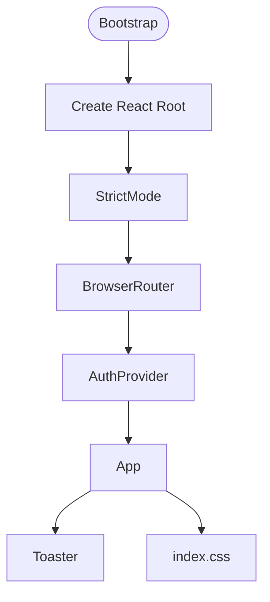
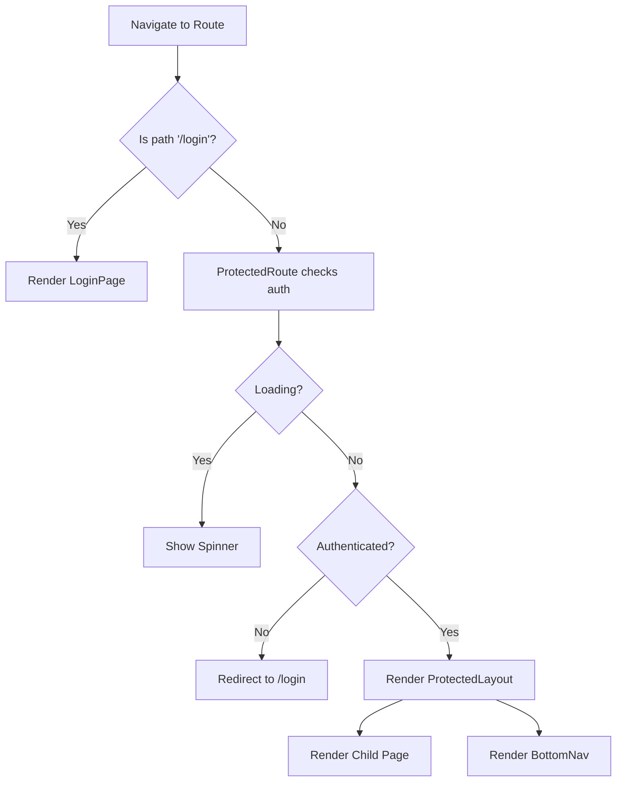
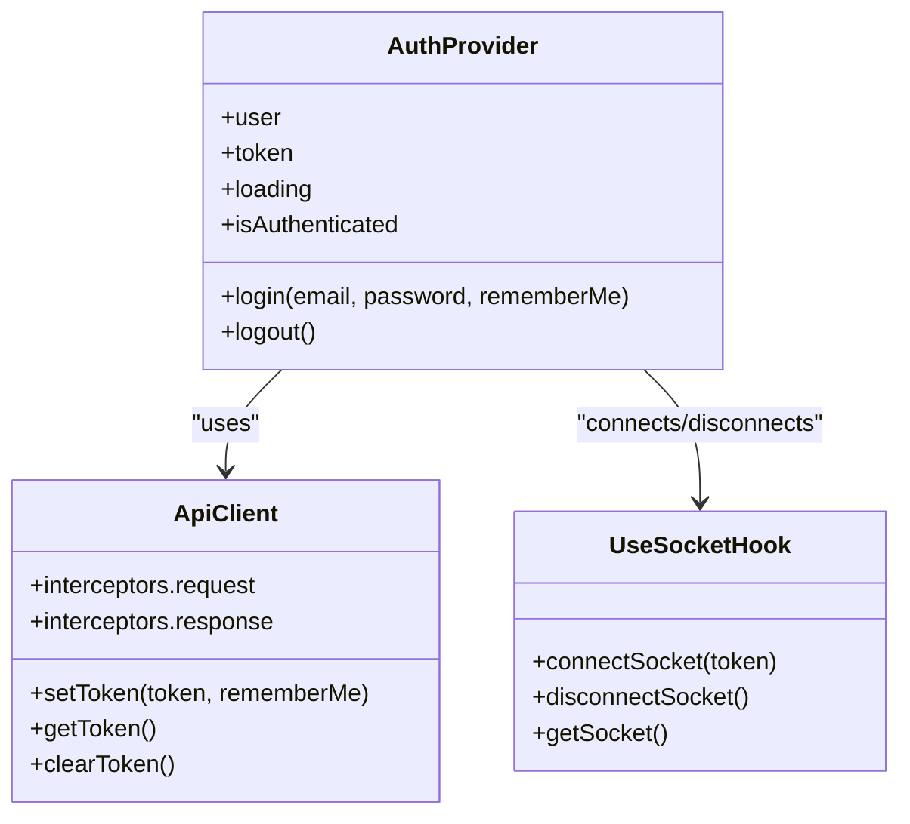
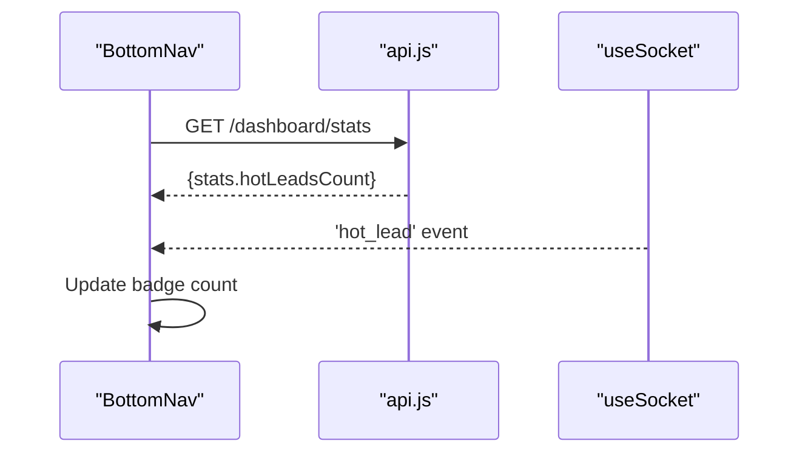
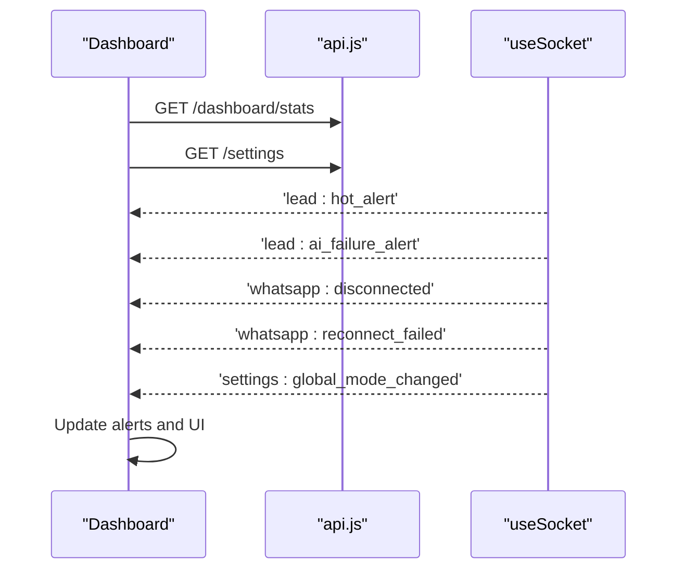
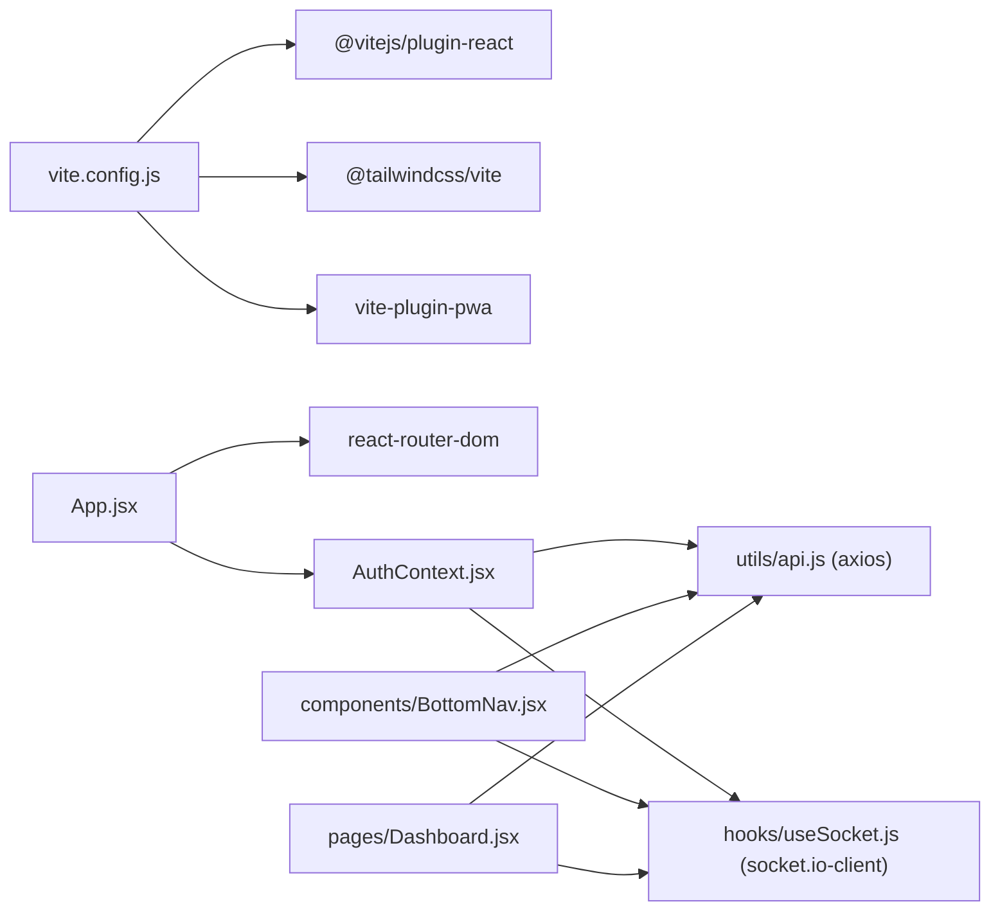

# Application Structure & Bootstrap

<cite>
**Referenced Files in This Document**
- [index.html](file://frontend/index.html)
- [main.jsx](file://frontend/src/main.jsx)
- [App.jsx](file://frontend/src/App.jsx)
- [AuthContext.jsx](file://frontend/src/context/AuthContext.jsx)
- [BottomNav.jsx](file://frontend/src/components/BottomNav.jsx)
- [Dashboard.jsx](file://frontend/src/pages/Dashboard.jsx)
- [api.js](file://frontend/src/utils/api.js)
- [useSocket.js](file://frontend/src/hooks/useSocket.js)
- [vite.config.js](file://frontend/vite.config.js)
- [tailwind.config.js](file://frontend/tailwind.config.js)
- [index.css](file://frontend/src/index.css)
- [package.json](file://frontend/package.json)
</cite>

## Table of Contents
1. [Introduction](#introduction)
2. [Project Structure](#project-structure)
3. [Core Components](#core-components)
4. [Architecture Overview](#architecture-overview)
5. [Detailed Component Analysis](#detailed-component-analysis)
6. [Dependency Analysis](#dependency-analysis)
7. [Performance Considerations](#performance-considerations)
8. [Troubleshooting Guide](#troubleshooting-guide)
9. [Conclusion](#conclusion)
10. [Appendices](#appendices)

## Introduction
This document explains the Nandibaag Bot frontend application structure and bootstrap process. It covers how the React app initializes with Vite, the main entry point configuration, component hierarchy starting from App.jsx, routing setup with React Router, provider composition pattern, TailwindCSS integration, global styling approach, and build configuration. It also includes guidelines for adding dependencies, configuring builds, and maintaining a consistent structure.

## Project Structure
The frontend is a modern React + Vite application using:
- React 18 with functional components and hooks
- React Router v6 for client-side routing
- TailwindCSS v4 via @tailwindcss/vite plugin
- Axios for HTTP requests with token interceptors
- Socket.IO client for real-time updates
- react-hot-toast for user feedback
- vite-plugin-pwa for progressive web app capabilities

**Diagram sources**
- [index.html:1-14](file://frontend/index.html#L1-L14)
- [main.jsx:1-38](file://frontend/src/main.jsx#L1-L38)
- [App.jsx:1-103](file://frontend/src/App.jsx#L1-L103)
- [AuthContext.jsx:1-114](file://frontend/src/context/AuthContext.jsx#L1-L114)
- [BottomNav.jsx:1-143](file://frontend/src/components/BottomNav.jsx#L1-L143)
- [Dashboard.jsx:1-496](file://frontend/src/pages/Dashboard.jsx#L1-L496)
- [api.js:1-83](file://frontend/src/utils/api.js#L1-L83)
- [useSocket.js:1-49](file://frontend/src/hooks/useSocket.js#L1-L49)

**Section sources**
- [index.html:1-14](file://frontend/index.html#L1-L14)
- [main.jsx:1-38](file://frontend/src/main.jsx#L1-L38)
- [App.jsx:1-103](file://frontend/src/App.jsx#L1-L103)
- [package.json:1-28](file://frontend/package.json#L1-L28)

## Core Components
- Entry bootstrap: The browser loads index.html which mounts the React root at #root and imports src/main.jsx as an ES module.
- Provider composition: main.jsx wraps the app with BrowserRouter, AuthProvider, and Toaster to provide routing, authentication state, and toast notifications globally.
- Routing and layout: App.jsx defines routes and a ProtectedLayout that enforces authentication and injects BottomNav into protected pages.
- Authentication context: AuthContext manages token persistence, current user, login/logout flows, and socket connection lifecycle.
- Real-time hook: useSocket provides a connected socket instance and auto-reconnect behavior when authenticated.
- UI shell: BottomNav renders navigation links, active states, badges, and a “More” menu; it hides on the login page.

Key responsibilities:
- main.jsx: Bootstraps React, providers, and global toast configuration.
- App.jsx: Central routing and protected layout wrapper.
- AuthContext.jsx: Auth state, token storage strategy, and socket initialization.
- useSocket.js: Encapsulates socket connection and reconnection logic.
- BottomNav.jsx: Navigation shell for protected areas.
- Dashboard.jsx: Aggregates stats, settings, alerts, and socket events.

**Section sources**
- [main.jsx:1-38](file://frontend/src/main.jsx#L1-L38)
- [App.jsx:1-103](file://frontend/src/App.jsx#L1-L103)
- [AuthContext.jsx:1-114](file://frontend/src/context/AuthContext.jsx#L1-L114)
- [useSocket.js:1-49](file://frontend/src/hooks/useSocket.js#L1-L49)
- [BottomNav.jsx:1-143](file://frontend/src/components/BottomNav.jsx#L1-L143)
- [Dashboard.jsx:1-496](file://frontend/src/pages/Dashboard.jsx#L1-L496)

## Architecture Overview
The application follows a layered architecture:
- Presentation layer: React components (pages and shared components).
- State layer: Context-based auth state and local component state.
- Data layer: Axios with request/response interceptors for tokens and error handling.
- Real-time layer: Socket.IO client managed by a custom hook.
- Build layer: Vite with plugins for React, TailwindCSS, and PWA.

**Diagram sources**
- [index.html:1-14](file://frontend/index.html#L1-L14)
- [main.jsx:1-38](file://frontend/src/main.jsx#L1-L38)
- [App.jsx:1-103](file://frontend/src/App.jsx#L1-L103)
- [AuthContext.jsx:1-114](file://frontend/src/context/AuthContext.jsx#L1-L114)
- [api.js:1-83](file://frontend/src/utils/api.js#L1-L83)
- [useSocket.js:1-49](file://frontend/src/hooks/useSocket.js#L1-L49)

## Detailed Component Analysis

### Bootstrap and Providers
- Initialization: Creates a React 18 root and renders under StrictMode.
- Providers:
  - BrowserRouter enables client-side routing.
  - AuthProvider supplies authentication state and methods.
  - Toaster provides global toast notifications with theme options.
- Global styles: Imports index.css which sets up TailwindCSS and design tokens.

**Diagram sources**
- [main.jsx:1-38](file://frontend/src/main.jsx#L1-L38)
- [index.css:1-46](file://frontend/src/index.css#L1-L46)

**Section sources**
- [main.jsx:1-38](file://frontend/src/main.jsx#L1-L38)
- [index.css:1-46](file://frontend/src/index.css#L1-L46)

### Routing and Protected Layout
- Routes:
  - /login: Public login page.
  - /, /connect, /chats, /chats/:id, /settings, /inventory: Protected routes wrapped in ProtectedLayout.
  - Wildcard redirects to /.
- ProtectedRoute:
  - Shows a spinner while loading auth state.
  - Redirects unauthenticated users to /login.
- ProtectedLayout:
  - Wraps children with ProtectedRoute and injects BottomNav.

**Diagram sources**
- [App.jsx:1-103](file://frontend/src/App.jsx#L1-L103)

**Section sources**
- [App.jsx:1-103](file://frontend/src/App.jsx#L1-L103)

### Authentication Context and Token Strategy
- Token storage:
  - If rememberMe is true: localStorage persists across sessions.
  - If rememberMe is false: sessionStorage clears on tab close.
- Lifecycle:
  - On mount, checks for existing token, connects socket, and fetches current user.
  - Login sets token, updates state, and connects socket.
  - Logout clears tokens, resets state, and disconnects socket.
- Interceptors:
  - Request interceptor attaches Bearer token based on rememberMe preference.
  - Response interceptor handles 401 by clearing tokens and redirecting to login.

**Diagram sources**
- [AuthContext.jsx:1-114](file://frontend/src/context/AuthContext.jsx#L1-L114)
- [api.js:1-83](file://frontend/src/utils/api.js#L1-L83)
- [useSocket.js:1-49](file://frontend/src/hooks/useSocket.js#L1-L49)

**Section sources**
- [AuthContext.jsx:1-114](file://frontend/src/context/AuthContext.jsx#L1-L114)
- [api.js:1-83](file://frontend/src/utils/api.js#L1-L83)
- [useSocket.js:1-49](file://frontend/src/hooks/useSocket.js#L1-L49)

### Bottom Navigation Shell
- Displays primary navigation items and a “More” menu.
- Active link highlighting uses location pathname.
- Badge shows hot lead count fetched from dashboard stats and updated via socket events.
- Hidden on the login page.

**Diagram sources**
- [BottomNav.jsx:1-143](file://frontend/src/components/BottomNav.jsx#L1-L143)
- [api.js:1-83](file://frontend/src/utils/api.js#L1-L83)
- [useSocket.js:1-49](file://frontend/src/hooks/useSocket.js#L1-L49)

**Section sources**
- [BottomNav.jsx:1-143](file://frontend/src/components/BottomNav.jsx#L1-L143)

### Dashboard and Real-Time Alerts
- Loads stats and settings on mount, refreshes periodically.
- Subscribes to multiple socket events to display live alerts and update UI state.
- Provides admin controls to toggle global mode and follow-ups.

**Diagram sources**
- [Dashboard.jsx:1-496](file://frontend/src/pages/Dashboard.jsx#L1-L496)
- [api.js:1-83](file://frontend/src/utils/api.js#L1-L83)
- [useSocket.js:1-49](file://frontend/src/hooks/useSocket.js#L1-L49)

**Section sources**
- [Dashboard.jsx:1-496](file://frontend/src/pages/Dashboard.jsx#L1-L496)

## Dependency Analysis
- Runtime dependencies:
  - react, react-dom: UI framework.
  - react-router-dom: Client-side routing.
  - axios: HTTP client with interceptors.
  - socket.io-client: Real-time communication.
  - react-hot-toast: User notifications.
  - lucide-react: Icon library used across components.
- Development dependencies:
  - vite: Build tool and dev server.
  - @vitejs/plugin-react: JSX support.
  - tailwindcss and @tailwindcss/vite: CSS framework and Vite integration.
  - vite-plugin-pwa: Progressive Web App generation.

**Diagram sources**
- [vite.config.js:1-63](file://frontend/vite.config.js#L1-L63)
- [App.jsx:1-103](file://frontend/src/App.jsx#L1-L103)
- [AuthContext.jsx:1-114](file://frontend/src/context/AuthContext.jsx#L1-L114)
- [api.js:1-83](file://frontend/src/utils/api.js#L1-L83)
- [useSocket.js:1-49](file://frontend/src/hooks/useSocket.js#L1-L49)
- [BottomNav.jsx:1-143](file://frontend/src/components/BottomNav.jsx#L1-L143)
- [Dashboard.jsx:1-496](file://frontend/src/pages/Dashboard.jsx#L1-L496)

**Section sources**
- [package.json:1-28](file://frontend/package.json#L1-L28)
- [vite.config.js:1-63](file://frontend/vite.config.js#L1-L63)

## Performance Considerations
- Dev server port and proxy:
  - Default dev server runs on port 7001 with host enabled and proxies /api to backend at http://localhost:7000.
- PWA caching:
  - Workbox runtime caching configured for external AI API calls with NetworkFirst strategy and expiration limits.
- Asset inclusion:
  - Icons are included in PWA manifest and assets glob patterns.
- CSS processing:
  - TailwindCSS v4 via Vite plugin ensures efficient scanning and minimal output.

Recommendations:
- Keep polling intervals reasonable (e.g., 30 seconds) to avoid excessive network requests.
- Use lazy loading for heavy pages if needed.
- Monitor bundle size and tree-shake unused icons or utilities.

[No sources needed since this section provides general guidance]

## Troubleshooting Guide
Common issues and resolutions:
- 401 Unauthorized:
  - The response interceptor clears tokens and redirects to /login. Ensure rememberMe preference is set correctly and tokens exist in the expected storage.
- Socket not connecting:
  - useSocket only connects when isAuthenticated and token are present. Verify AuthContext has initialized and token exists before expecting socket events.
- Hot lead badge not updating:
  - BottomNav listens to 'hot_lead' socket events and polls /dashboard/stats. Confirm both socket and API connectivity.
- Dev server port conflicts:
  - vite.config.js allows auto-increment if strictPort is false. Change port explicitly if needed.

**Section sources**
- [api.js:1-83](file://frontend/src/utils/api.js#L1-L83)
- [useSocket.js:1-49](file://frontend/src/hooks/useSocket.js#L1-L49)
- [BottomNav.jsx:1-143](file://frontend/src/components/BottomNav.jsx#L1-L143)
- [vite.config.js:1-63](file://frontend/vite.config.js#L1-L63)

## Conclusion
The Nandibaag Bot frontend is structured around a clear bootstrap sequence, provider composition, and modular routing. Authentication, token management, and real-time features are encapsulated in dedicated modules, making the codebase maintainable and scalable. TailwindCSS and Vite provide a fast development experience with robust build outputs, including PWA capabilities.

[No sources needed since this section summarizes without analyzing specific files]

## Appendices

### Build Configuration and Scripts
- Scripts:
  - dev: Starts Vite dev server.
  - build: Builds production assets.
  - preview: Serves built assets locally.
- Vite config highlights:
  - Plugins: TailwindCSS, React, PWA.
  - Server: Port 7001, host enabled, API proxy to backend.
  - PWA: Manifest, icons, workbox runtime caching.

**Section sources**
- [package.json:1-28](file://frontend/package.json#L1-L28)
- [vite.config.js:1-63](file://frontend/vite.config.js#L1-L63)

### TailwindCSS Integration and Design System
- Tailwind v4 via @tailwindcss/vite plugin.
- Theme customization:
  - Custom color palette aligned with WhatsApp branding.
  - Font stack prioritizing Inter and system fonts.
- Global CSS:
  - Tailwind import and theme variables.
  - Custom scrollbar styles for chat windows.
  - WhatsApp-style background pattern utility.
  - Smooth transitions applied globally.

**Section sources**
- [tailwind.config.js:1-34](file://frontend/tailwind.config.js#L1-L34)
- [index.css:1-46](file://frontend/src/index.css#L1-L46)

### Guidelines for Adding Dependencies
- Add runtime dependency:
  - Install package and add to dependencies in package.json.
  - Import and use within components or utilities.
- Add dev dependency:
  - Install package and add to devDependencies in package.json.
  - Configure in vite.config.js if required (e.g., new Vite plugin).
- Maintain consistency:
  - Follow existing folder conventions (components, pages, context, hooks, utils).
  - Keep global styles centralized in index.css and Tailwind theme in tailwind.config.js.

**Section sources**
- [package.json:1-28](file://frontend/package.json#L1-L28)
- [vite.config.js:1-63](file://frontend/vite.config.js#L1-L63)
- [tailwind.config.js:1-34](file://frontend/tailwind.config.js#L1-L34)
- [index.css:1-46](file://frontend/src/index.css#L1-L46)