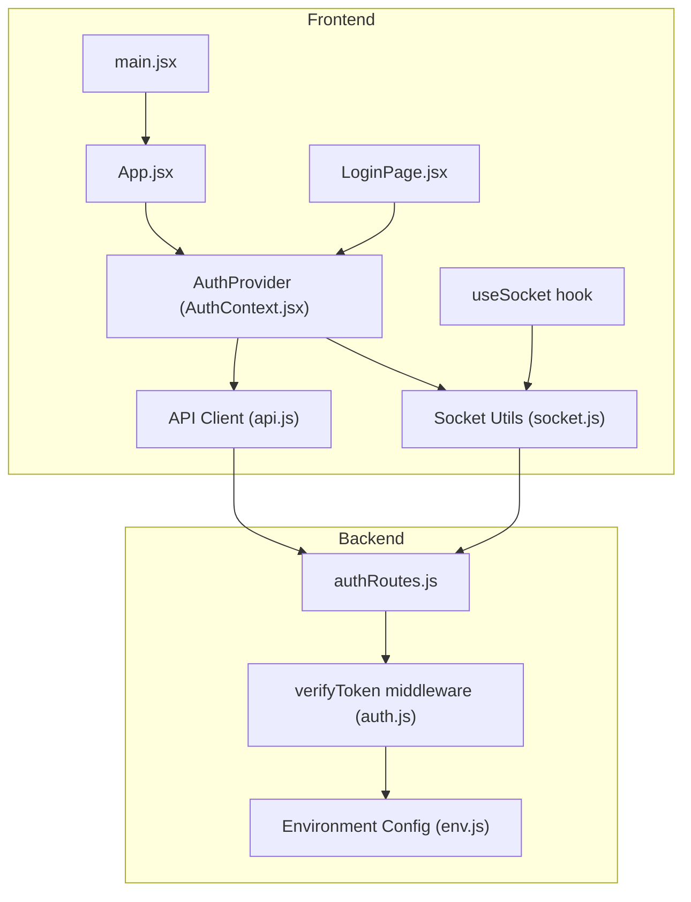
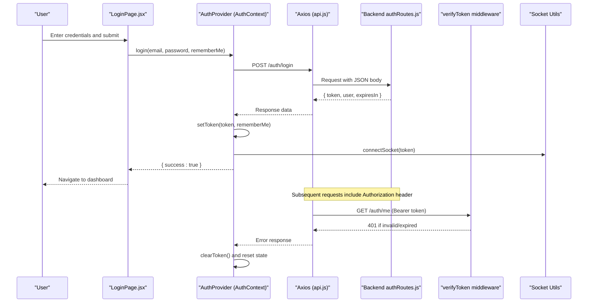
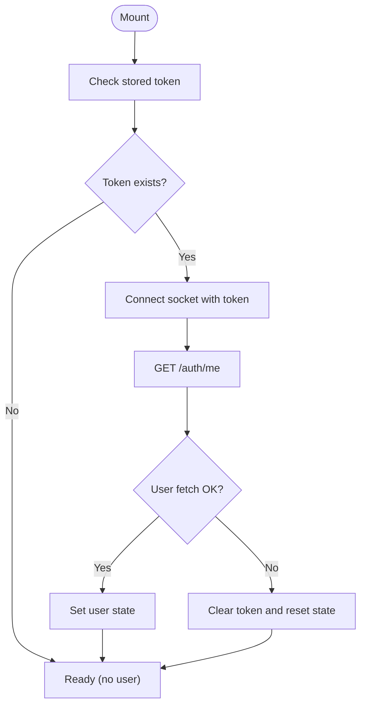
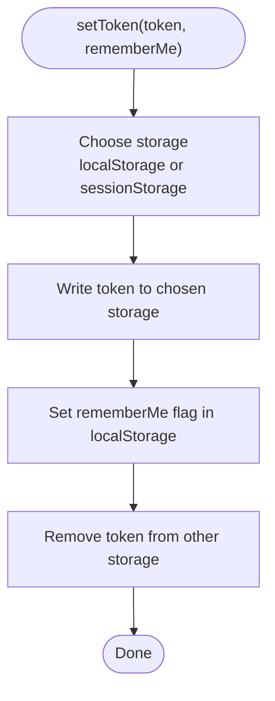
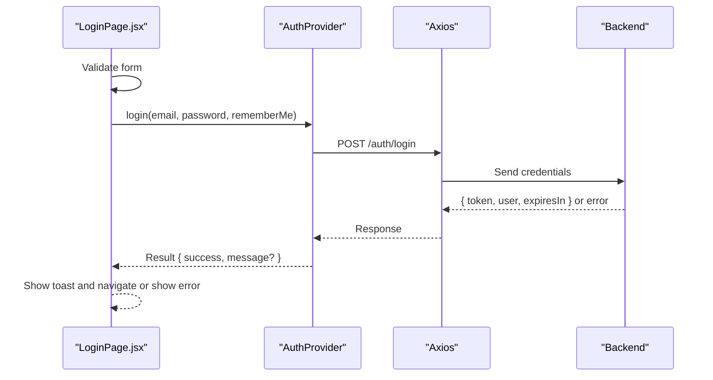
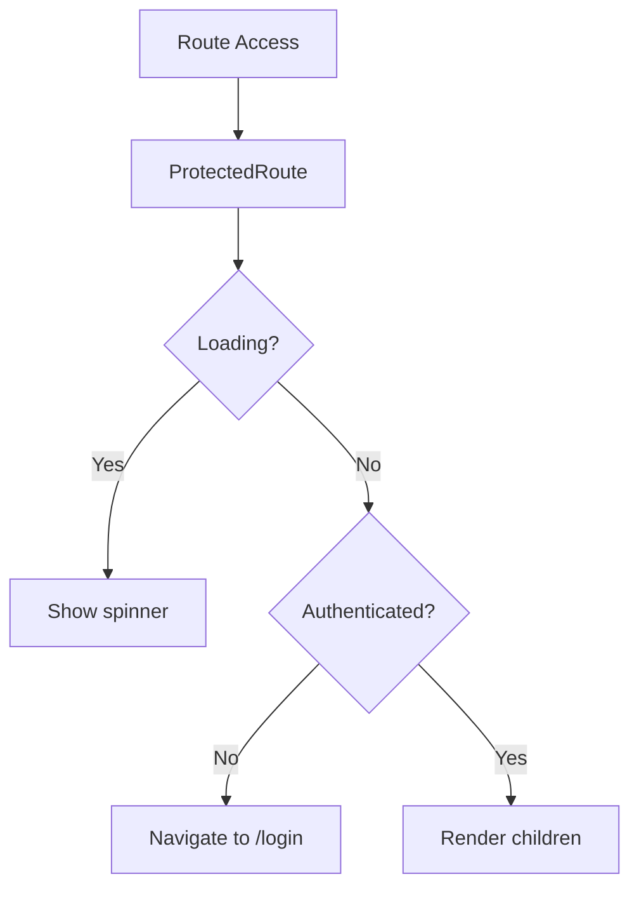
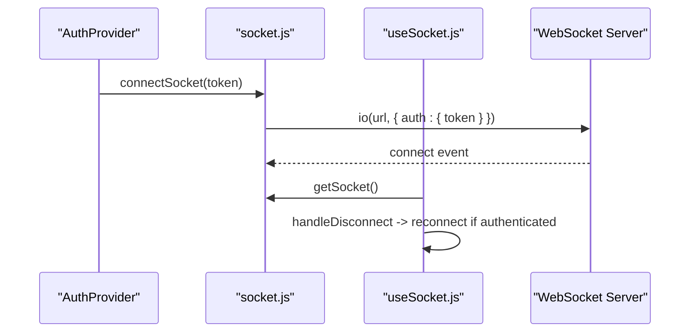
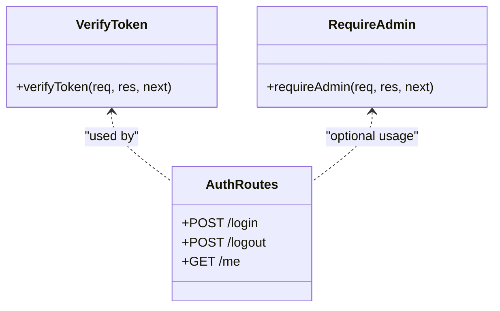
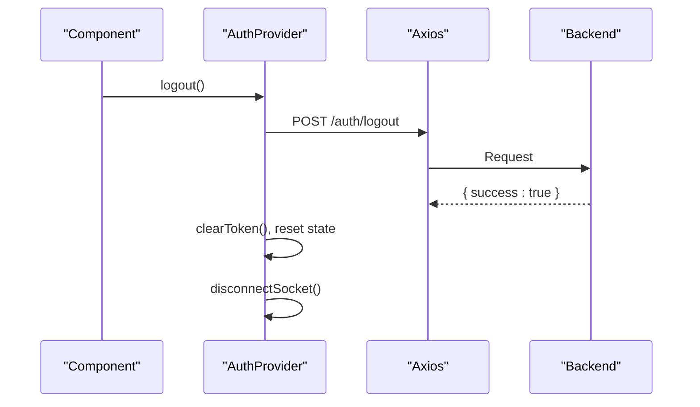
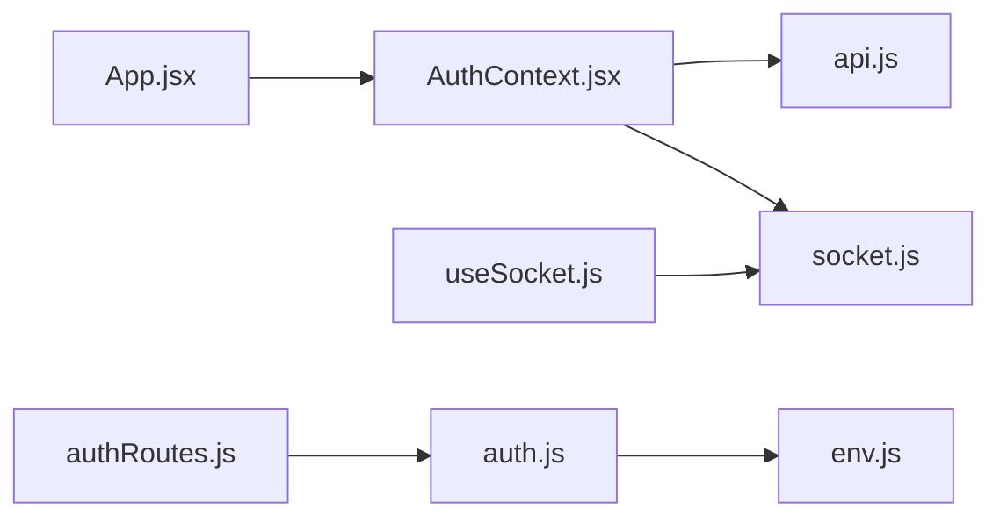

# Authentication System

<cite>
**Referenced Files in This Document**
- [AuthContext.jsx](file://frontend/src/context/AuthContext.jsx)
- [api.js](file://frontend/src/utils/api.js)
- [socket.js](file://frontend/src/utils/socket.js)
- [useSocket.js](file://frontend/src/hooks/useSocket.js)
- [LoginPage.jsx](file://frontend/src/pages/LoginPage.jsx)
- [App.jsx](file://frontend/src/App.jsx)
- [main.jsx](file://frontend/src/main.jsx)
- [auth.js](file://backend/src/middleware/auth.js)
- [authRoutes.js](file://backend/src/routes/authRoutes.js)
- [env.js](file://backend/src/config/env.js)
</cite>

## Table of Contents
1. [Introduction](#introduction)
2. [Project Structure](#project-structure)
3. [Core Components](#core-components)
4. [Architecture Overview](#architecture-overview)
5. [Detailed Component Analysis](#detailed-component-analysis)
6. [Dependency Analysis](#dependency-analysis)
7. [Performance Considerations](#performance-considerations)
8. [Troubleshooting Guide](#troubleshooting-guide)
9. [Conclusion](#conclusion)
10. [Appendices](#appendices)

## Introduction
This document explains the frontend authentication system for the application, focusing on:
- AuthContext provider architecture and user session state
- JWT token management and storage strategies
- Login flow, logout procedures, and error handling
- Protected routes and guards
- API service integration with request/response interceptors
- Socket.IO authentication and reconnection behavior
- Security best practices and token validation considerations

The implementation uses React Context for global auth state, Axios interceptors to attach Bearer tokens, and a dual storage strategy (localStorage vs sessionStorage) controlled by a remember-me flag. The backend validates JWTs and enforces role-based access control via middleware.

## Project Structure
The authentication-related code spans both frontend and backend:
- Frontend:
  - Context and hooks for auth state and socket connection
  - API client with interceptors for token attachment and 401 handling
  - Login page UI and routing with protected route wrappers
- Backend:
  - Authentication routes for login/logout/me
  - Middleware for JWT verification and admin-only checks
  - Environment configuration for JWT settings

**Diagram sources**
- [main.jsx:1-38](file://frontend/src/main.jsx#L1-L38)
- [App.jsx:1-103](file://frontend/src/App.jsx#L1-L103)
- [AuthContext.jsx:1-114](file://frontend/src/context/AuthContext.jsx#L1-L114)
- [api.js:1-83](file://frontend/src/utils/api.js#L1-L83)
- [socket.js:1-66](file://frontend/src/utils/socket.js#L1-L66)
- [useSocket.js:1-49](file://frontend/src/hooks/useSocket.js#L1-L49)
- [authRoutes.js:1-138](file://backend/src/routes/authRoutes.js#L1-L138)
- [auth.js:1-68](file://backend/src/middleware/auth.js#L1-L68)
- [env.js:1-95](file://backend/src/config/env.js#L1-L95)

**Section sources**
- [main.jsx:1-38](file://frontend/src/main.jsx#L1-L38)
- [App.jsx:1-103](file://frontend/src/App.jsx#L1-L103)
- [AuthContext.jsx:1-114](file://frontend/src/context/AuthContext.jsx#L1-L114)
- [api.js:1-83](file://frontend/src/utils/api.js#L1-L83)
- [socket.js:1-66](file://frontend/src/utils/socket.js#L1-L66)
- [useSocket.js:1-49](file://frontend/src/hooks/useSocket.js#L1-L49)
- [authRoutes.js:1-138](file://backend/src/routes/authRoutes.js#L1-L138)
- [auth.js:1-68](file://backend/src/middleware/auth.js#L1-L68)
- [env.js:1-95](file://backend/src/config/env.js#L1-L95)

## Core Components
- AuthProvider and useAuth:
  - Maintains user, token, loading, and isAuthenticated state
  - On mount, loads existing token and fetches current user profile
  - Provides login/logout methods that update state and manage sockets
- API client (Axios):
  - Request interceptor attaches Bearer token from storage based on rememberMe
  - Response interceptor clears tokens and redirects on 401
  - Token helpers set/get/clear tokens across localStorage/sessionStorage
- Socket utilities:
  - Singleton socket instance authenticated via query auth token
  - Reconnection configured with attempts and delays
  - Hook manages lifecycle and auto-reconnect while authenticated
- Protected routes:
  - Wrapper component guards routes using auth state
  - Layout wrapper includes navigation and protection
- Login page:
  - Form validation, loading states, and toast notifications
  - Calls context login and navigates on success

**Section sources**
- [AuthContext.jsx:1-114](file://frontend/src/context/AuthContext.jsx#L1-L114)
- [api.js:1-83](file://frontend/src/utils/api.js#L1-L83)
- [socket.js:1-66](file://frontend/src/utils/socket.js#L1-L66)
- [useSocket.js:1-49](file://frontend/src/hooks/useSocket.js#L1-L49)
- [App.jsx:1-103](file://frontend/src/App.jsx#L1-L103)
- [LoginPage.jsx:1-161](file://frontend/src/pages/LoginPage.jsx#L1-L161)

## Architecture Overview
The authentication architecture integrates React Context, Axios interceptors, and Socket.IO with backend JWT verification.

**Diagram sources**
- [LoginPage.jsx:1-161](file://frontend/src/pages/LoginPage.jsx#L1-L161)
- [AuthContext.jsx:1-114](file://frontend/src/context/AuthContext.jsx#L1-L114)
- [api.js:1-83](file://frontend/src/utils/api.js#L1-L83)
- [authRoutes.js:1-138](file://backend/src/routes/authRoutes.js#L1-L138)
- [auth.js:1-68](file://backend/src/middleware/auth.js#L1-L68)
- [socket.js:1-66](file://frontend/src/utils/socket.js#L1-L66)

## Detailed Component Analysis

### AuthContext Provider Architecture
- State management:
  - user: Current user object fetched from /auth/me
  - token: In-memory token used for socket and UI decisions
  - loading: Indicates initialization and user fetch status
  - isAuthenticated: Derived boolean from token presence
- Initialization:
  - On mount, retrieves token from storage and connects socket
  - Fetches current user; on failure, clears token and resets state
- Login:
  - Posts credentials to /auth/login
  - Stores token using rememberMe flag and updates state
  - Connects socket with new token
- Logout:
  - Calls /auth/logout (stateless), then clears token and disconnects socket

**Diagram sources**
- [AuthContext.jsx:1-114](file://frontend/src/context/AuthContext.jsx#L1-L114)

**Section sources**
- [AuthContext.jsx:1-114](file://frontend/src/context/AuthContext.jsx#L1-L114)

### JWT Token Management and Storage Strategies
- Dual storage strategy:
  - If rememberMe is true: store token in localStorage (persists across sessions)
  - If rememberMe is false: store token in sessionStorage (cleared on tab close)
- Request interceptor:
  - Reads rememberMe flag and selects appropriate storage
  - Attaches Authorization: Bearer <token> to all outgoing requests
- Response interceptor:
  - On 401, removes tokens from both storages and redirects to login
- Token helpers:
  - setToken: writes token to selected storage and toggles rememberMe flag
  - getToken: reads token from selected storage
  - clearToken: removes tokens and flags from both storages

**Diagram sources**
- [api.js:1-83](file://frontend/src/utils/api.js#L1-L83)

**Section sources**
- [api.js:1-83](file://frontend/src/utils/api.js#L1-L83)

### Login Flow and Error Handling
- LoginPage validates email and password, shows errors inline
- Calls AuthProvider.login with rememberMe option
- On success:
  - Displays success toast
  - Navigates to root route
- On failure:
  - Handles rate limiting messages and displays error toast

**Diagram sources**
- [LoginPage.jsx:1-161](file://frontend/src/pages/LoginPage.jsx#L1-L161)
- [AuthContext.jsx:1-114](file://frontend/src/context/AuthContext.jsx#L1-L114)
- [api.js:1-83](file://frontend/src/utils/api.js#L1-L83)
- [authRoutes.js:1-138](file://backend/src/routes/authRoutes.js#L1-L138)

**Section sources**
- [LoginPage.jsx:1-161](file://frontend/src/pages/LoginPage.jsx#L1-L161)
- [AuthContext.jsx:1-114](file://frontend/src/context/AuthContext.jsx#L1-L114)
- [api.js:1-83](file://frontend/src/utils/api.js#L1-L83)
- [authRoutes.js:1-138](file://backend/src/routes/authRoutes.js#L1-L138)

### Protected Routes and Guards
- ProtectedRoute:
  - Shows spinner while loading
  - Redirects unauthenticated users to /login
- ProtectedLayout:
  - Wraps content with ProtectedRoute and BottomNav
- App routes:
  - All protected pages are wrapped in ProtectedLayout

**Diagram sources**
- [App.jsx:1-103](file://frontend/src/App.jsx#L1-L103)

**Section sources**
- [App.jsx:1-103](file://frontend/src/App.jsx#L1-L103)

### Socket.IO Authentication and Reconnection
- connectSocket:
  - Creates singleton socket instance with auth token
  - Uses VITE_SOCKET_URL or falls back to VITE_API_URL
  - Configures transports and reconnection parameters
- useSocket hook:
  - Auto-connects when authenticated and reconnects on disconnect
  - Disconnects when not authenticated

**Diagram sources**
- [socket.js:1-66](file://frontend/src/utils/socket.js#L1-L66)
- [useSocket.js:1-49](file://frontend/src/hooks/useSocket.js#L1-L49)
- [AuthContext.jsx:1-114](file://frontend/src/context/AuthContext.jsx#L1-L114)

**Section sources**
- [socket.js:1-66](file://frontend/src/utils/socket.js#L1-L66)
- [useSocket.js:1-49](file://frontend/src/hooks/useSocket.js#L1-L49)
- [AuthContext.jsx:1-114](file://frontend/src/context/AuthContext.jsx#L1-L114)

### Role-Based Access Control (RBAC)
- Backend:
  - verifyToken middleware decodes JWT and attaches user to request
  - requireAdmin middleware enforces admin role for protected endpoints
- Frontend:
  - No explicit role checks in routes yet; roles are available in user object for future UI gating

**Diagram sources**
- [auth.js:1-68](file://backend/src/middleware/auth.js#L1-L68)
- [authRoutes.js:1-138](file://backend/src/routes/authRoutes.js#L1-L138)

**Section sources**
- [auth.js:1-68](file://backend/src/middleware/auth.js#L1-L68)
- [authRoutes.js:1-138](file://backend/src/routes/authRoutes.js#L1-L138)

### Logout Procedures
- Frontend:
  - Calls /auth/logout (stateless)
  - Clears token from storage and resets state
  - Disconnects socket
- Backend:
  - Returns success without server-side token revocation

**Diagram sources**
- [AuthContext.jsx:1-114](file://frontend/src/context/AuthContext.jsx#L1-L114)
- [api.js:1-83](file://frontend/src/utils/api.js#L1-L83)
- [authRoutes.js:1-138](file://backend/src/routes/authRoutes.js#L1-L138)

**Section sources**
- [AuthContext.jsx:1-114](file://frontend/src/context/AuthContext.jsx#L1-L114)
- [api.js:1-83](file://frontend/src/utils/api.js#L1-L83)
- [authRoutes.js:1-138](file://backend/src/routes/authRoutes.js#L1-L138)

## Dependency Analysis
- Frontend dependencies:
  - AuthContext depends on api.js for HTTP calls and socket.js for real-time connections
  - useSocket depends on AuthContext for token and auth state
  - App.jsx depends on AuthContext for route protection
- Backend dependencies:
  - authRoutes depends on verifyToken middleware and environment config
  - verifyToken depends on jwtSecret and expiration settings

**Diagram sources**
- [AuthContext.jsx:1-114](file://frontend/src/context/AuthContext.jsx#L1-L114)
- [api.js:1-83](file://frontend/src/utils/api.js#L1-L83)
- [socket.js:1-66](file://frontend/src/utils/socket.js#L1-L66)
- [useSocket.js:1-49](file://frontend/src/hooks/useSocket.js#L1-L49)
- [App.jsx:1-103](file://frontend/src/App.jsx#L1-L103)
- [authRoutes.js:1-138](file://backend/src/routes/authRoutes.js#L1-L138)
- [auth.js:1-68](file://backend/src/middleware/auth.js#L1-L68)
- [env.js:1-95](file://backend/src/config/env.js#L1-L95)

**Section sources**
- [AuthContext.jsx:1-114](file://frontend/src/context/AuthContext.jsx#L1-L114)
- [api.js:1-83](file://frontend/src/utils/api.js#L1-L83)
- [socket.js:1-66](file://frontend/src/utils/socket.js#L1-L66)
- [useSocket.js:1-49](file://frontend/src/hooks/useSocket.js#L1-L49)
- [App.jsx:1-103](file://frontend/src/App.jsx#L1-L103)
- [authRoutes.js:1-138](file://backend/src/routes/authRoutes.js#L1-L138)
- [auth.js:1-68](file://backend/src/middleware/auth.js#L1-L68)
- [env.js:1-95](file://backend/src/config/env.js#L1-L95)

## Performance Considerations
- Avoid unnecessary re-renders:
  - Memoize auth context value where possible to prevent child re-renders
- Efficient token retrieval:
  - Centralized token helpers reduce repeated storage lookups
- Socket reconnection:
  - Configure reasonable reconnection attempts and delays to balance responsiveness and resource usage
- Minimize network calls:
  - Cache user profile after initial fetch to avoid repeated /auth/me calls

[No sources needed since this section provides general guidance]

## Troubleshooting Guide
Common issues and resolutions:
- 401 Unauthorized:
  - Ensure token is present in correct storage based on rememberMe
  - Check that request interceptor attaches Authorization header
  - Confirm backend JWT secret and expiration settings are correct
- Token not persisting:
  - Verify rememberMe flag is set correctly
  - Ensure no other code clears tokens unexpectedly
- Socket not connecting:
  - Confirm token passed to connectSocket
  - Check CORS and URL configurations for WebSocket
- Rate limiting:
  - Handle 429 responses gracefully and inform users to retry later

**Section sources**
- [api.js:1-83](file://frontend/src/utils/api.js#L1-L83)
- [AuthContext.jsx:1-114](file://frontend/src/context/AuthContext.jsx#L1-L114)
- [auth.js:1-68](file://backend/src/middleware/auth.js#L1-L68)
- [authRoutes.js:1-138](file://backend/src/routes/authRoutes.js#L1-L138)

## Conclusion
The authentication system provides a robust foundation with:
- Centralized auth state via React Context
- Secure token attachment and automatic redirection on 401
- Flexible token persistence through rememberMe
- Real-time communication secured by JWT
- Backend JWT verification and role-based middleware

Future enhancements could include:
- Automatic token refresh before expiry
- Role-based UI gating in protected routes
- Refresh token rotation and secure storage patterns

[No sources needed since this section summarizes without analyzing specific files]

## Appendices

### Security Best Practices
- Use HTTPS for all communications
- Store secrets securely in environment variables
- Keep JWT secrets strong and rotate periodically
- Implement short-lived access tokens and refresh tokens
- Validate and sanitize inputs on both frontend and backend
- Enforce CSRF protections where applicable
- Log authentication events securely without sensitive data

[No sources needed since this section provides general guidance]

### Token Validation and Expiration
- Backend verifies JWT signature and expiration
- Frontend handles 401 by clearing tokens and redirecting
- Consider implementing proactive refresh before expiry

**Section sources**
- [auth.js:1-68](file://backend/src/middleware/auth.js#L1-L68)
- [api.js:1-83](file://frontend/src/utils/api.js#L1-L83)

### Configuration Notes
- JWT expiration times are configurable via environment variables
- RememberMe affects token lifetime selection on login

**Section sources**
- [env.js:1-95](file://backend/src/config/env.js#L1-L95)
- [authRoutes.js:1-138](file://backend/src/routes/authRoutes.js#L1-L138)