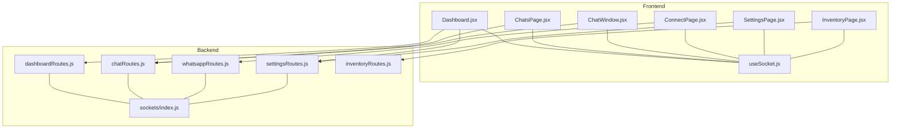
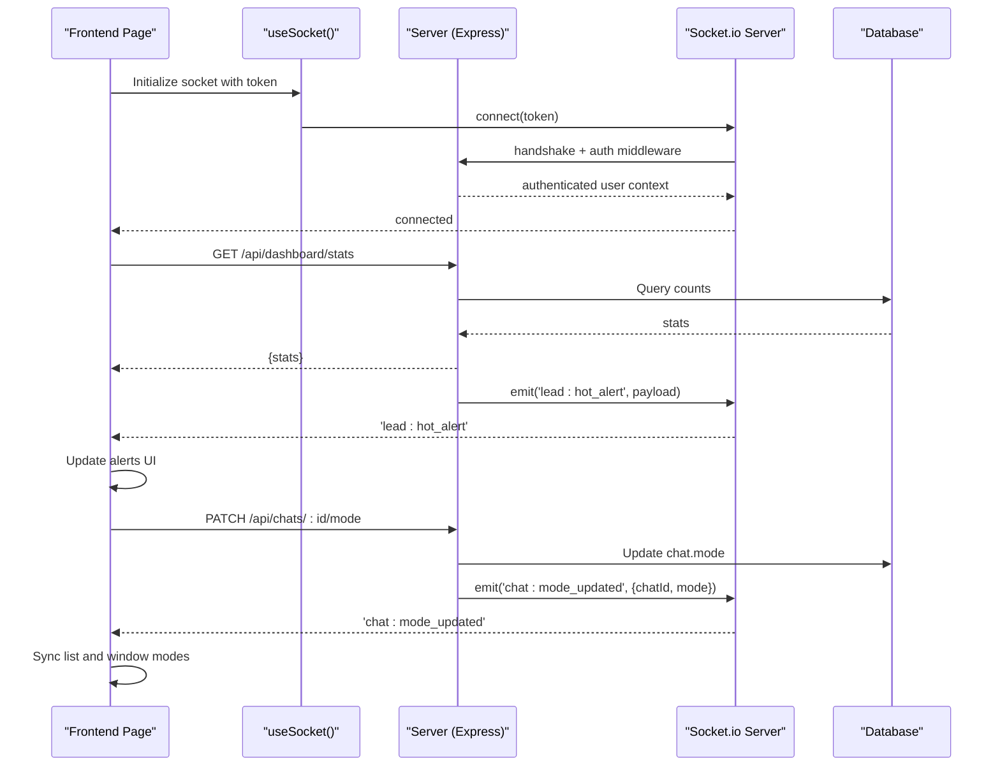
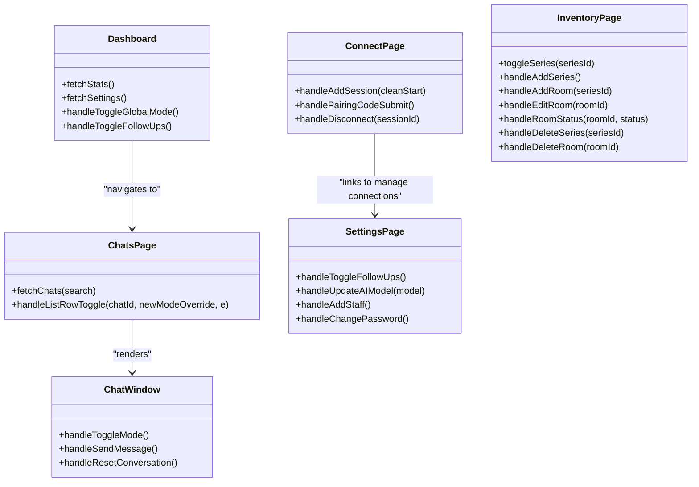

# Dashboard Pages

<cite>
**Referenced Files in This Document**
- [Dashboard.jsx](file://frontend/src/pages/Dashboard.jsx)
- [ChatsPage.jsx](file://frontend/src/pages/ChatsPage.jsx)
- [ConnectPage.jsx](file://frontend/src/pages/ConnectPage.jsx)
- [SettingsPage.jsx](file://frontend/src/pages/SettingsPage.jsx)
- [InventoryPage.jsx](file://frontend/src/pages/InventoryPage.jsx)
- [ChatWindow.jsx](file://frontend/src/components/ChatWindow.jsx)
- [useSocket.js](file://frontend/src/hooks/useSocket.js)
- [dashboardRoutes.js](file://backend/src/routes/dashboardRoutes.js)
- [chatRoutes.js](file://backend/src/routes/chatRoutes.js)
- [whatsappRoutes.js](file://backend/src/routes/whatsappRoutes.js)
- [settingsRoutes.js](file://backend/src/routes/settingsRoutes.js)
- [inventoryRoutes.js](file://backend/src/routes/inventoryRoutes.js)
- [index.js (sockets)](file://backend/src/sockets/index.js)
</cite>

## Table of Contents
1. [Introduction](#introduction)
2. [Project Structure](#project-structure)
3. [Core Components](#core-components)
4. [Architecture Overview](#architecture-overview)
5. [Detailed Component Analysis](#detailed-component-analysis)
6. [Dependency Analysis](#dependency-analysis)
7. [Performance Considerations](#performance-considerations)
8. [Troubleshooting Guide](#troubleshooting-guide)
9. [Conclusion](#conclusion)

## Introduction
This document provides comprehensive documentation for the dashboard pages in the Nandibaag Bot application. It covers:
- Main Dashboard page with statistics, real-time alerts, and overview controls
- ChatsPage for conversation management, lead tracking, and chat filtering
- ConnectPage for WhatsApp session management, QR code display, and connection status monitoring
- SettingsPage for system configuration, AI provider management, and user preferences
- InventoryPage for room series management, pricing controls, and availability settings

It also details data fetching patterns, state management approaches, and user interaction flows across these pages.

## Project Structure
The dashboard is implemented as a set of React components on the frontend, backed by Express routes and Socket.io events on the backend. Each page fetches data via REST APIs and listens to real-time socket events for live updates.

**Diagram sources**
- [Dashboard.jsx:1-496](file://frontend/src/pages/Dashboard.jsx#L1-L496)
- [ChatsPage.jsx:1-325](file://frontend/src/pages/ChatsPage.jsx#L1-L325)
- [ChatWindow.jsx:1-449](file://frontend/src/components/ChatWindow.jsx#L1-L449)
- [ConnectPage.jsx:1-579](file://frontend/src/pages/ConnectPage.jsx#L1-L579)
- [SettingsPage.jsx:1-556](file://frontend/src/pages/SettingsPage.jsx#L1-L556)
- [InventoryPage.jsx:1-632](file://frontend/src/pages/InventoryPage.jsx#L1-L632)
- [useSocket.js:1-49](file://frontend/src/hooks/useSocket.js#L1-L49)
- [dashboardRoutes.js:1-71](file://backend/src/routes/dashboardRoutes.js#L1-L71)
- [chatRoutes.js:1-254](file://backend/src/routes/chatRoutes.js#L1-L254)
- [whatsappRoutes.js:1-110](file://backend/src/routes/whatsappRoutes.js#L1-L110)
- [settingsRoutes.js:1-143](file://backend/src/routes/settingsRoutes.js#L1-L143)
- [inventoryRoutes.js:1-445](file://backend/src/routes/inventoryRoutes.js#L1-L445)
- [index.js (sockets):1-82](file://backend/src/sockets/index.js#L1-L82)

**Section sources**
- [Dashboard.jsx:1-496](file://frontend/src/pages/Dashboard.jsx#L1-L496)
- [ChatsPage.jsx:1-325](file://frontend/src/pages/ChatsPage.jsx#L1-L325)
- [ConnectPage.jsx:1-579](file://frontend/src/pages/ConnectPage.jsx#L1-L579)
- [SettingsPage.jsx:1-556](file://frontend/src/pages/SettingsPage.jsx#L1-L556)
- [InventoryPage.jsx:1-632](file://frontend/src/pages/InventoryPage.jsx#L1-L632)
- [useSocket.js:1-49](file://frontend/src/hooks/useSocket.js#L1-L49)
- [dashboardRoutes.js:1-71](file://backend/src/routes/dashboardRoutes.js#L1-L71)
- [chatRoutes.js:1-254](file://backend/src/routes/chatRoutes.js#L1-L254)
- [whatsappRoutes.js:1-110](file://backend/src/routes/whatsappRoutes.js#L1-L110)
- [settingsRoutes.js:1-143](file://backend/src/routes/settingsRoutes.js#L1-L143)
- [inventoryRoutes.js:1-445](file://backend/src/routes/inventoryRoutes.js#L1-L445)
- [index.js (sockets):1-82](file://backend/src/sockets/index.js#L1-L82)

## Core Components
- Dashboard: Aggregates key metrics, global mode toggle, follow-ups control, and live alerts.
- ChatsPage: Lists conversations, supports search, per-chat mode toggling, and integrates ChatWindow.
- ConnectPage: Manages WhatsApp sessions, QR/pairing flows, and connection status.
- SettingsPage: Configures follow-up system, AI model override, staff management, and password changes.
- InventoryPage: Manages room series and rooms, including capacity and status controls.

Key cross-cutting concerns:
- Real-time updates via Socket.io for alerts, chat messages, and mode changes.
- Optimistic UI updates with rollback on failure for critical actions.
- Admin-only features gated by role checks.

**Section sources**
- [Dashboard.jsx:1-496](file://frontend/src/pages/Dashboard.jsx#L1-L496)
- [ChatsPage.jsx:1-325](file://frontend/src/pages/ChatsPage.jsx#L1-L325)
- [ChatWindow.jsx:1-449](file://frontend/src/components/ChatWindow.jsx#L1-L449)
- [ConnectPage.jsx:1-579](file://frontend/src/pages/ConnectPage.jsx#L1-L579)
- [SettingsPage.jsx:1-556](file://frontend/src/pages/SettingsPage.jsx#L1-L556)
- [InventoryPage.jsx:1-632](file://frontend/src/pages/InventoryPage.jsx#L1-L632)

## Architecture Overview
Real-time communication is established through Socket.io. The server authenticates clients using JWT and joins them to a shared room. Frontend hooks manage reconnection and event subscriptions.

**Diagram sources**
- [useSocket.js:1-49](file://frontend/src/hooks/useSocket.js#L1-L49)
- [index.js (sockets):1-82](file://backend/src/sockets/index.js#L1-L82)
- [dashboardRoutes.js:1-71](file://backend/src/routes/dashboardRoutes.js#L1-L71)
- [chatRoutes.js:1-254](file://backend/src/routes/chatRoutes.js#L1-L254)

## Detailed Component Analysis

### Dashboard Page
Responsibilities:
- Display summary metrics: active sessions, chats today, hot leads, bookings this week.
- Provide global mode toggle (AI/Human) and follow-ups enable/disable.
- Show live alerts from socket events and browser notifications when permitted.
- Navigate to specific chats or filtered views.

Data fetching and refresh:
- Fetches stats from GET /api/dashboard/stats and settings from GET /api/settings on mount.
- Polls stats every 30 seconds.

State management:
- Local state for stats, loading flags, globalMode, followUpEnabled, pendingFollowUps, alerts, notificationPermission.
- Uses optimistic confirmation modal before switching global mode.

Real-time integration:
- Listens for hot lead alerts, AI failures, WhatsApp disconnect/reconnect failures, and global mode change events.
- Displays toast and optional browser notifications.

User interactions:
- Toggle global mode (admin only).
- Toggle follow-ups (admin only).
- Dismiss individual alerts or clear all.
- Click hot leads card to navigate to filtered chats.

API endpoints used:
- GET /api/dashboard/stats
- GET /api/settings
- PATCH /api/settings/global-mode
- PATCH /api/settings/follow-ups

Socket events listened:
- lead:hot_alert
- lead:ai_failure_alert
- whatsapp:disconnected
- whatsapp:reconnect_failed
- settings:global_mode_changed

**Section sources**
- [Dashboard.jsx:1-496](file://frontend/src/pages/Dashboard.jsx#L1-L496)
- [dashboardRoutes.js:1-71](file://backend/src/routes/dashboardRoutes.js#L1-L71)
- [settingsRoutes.js:1-143](file://backend/src/routes/settingsRoutes.js#L1-L143)

### ChatsPage
Responsibilities:
- List all non-archived chats with search by name or phone.
- Support per-chat mode toggling (AI/Human) with optimistic updates.
- Integrate ChatWindow for detailed view on desktop; navigate to chat route on mobile.
- Handle new messages and mode updates in real time.

Data fetching:
- GET /api/chats with optional search query parameter.
- Debounced search input triggers refetch.

State management:
- chats array, isLoading, searchQuery, debouncedSearch, selectedChatId, isDesktop.
- Ref-based cancellation of in-flight per-chat mode requests to avoid race conditions.

Real-time integration:
- chat:new_message: appends message and bumps chat to top.
- chats:bulk_mode_updated: applies global mode changes to all chats.
- chat:mode_updated: syncs per-chat mode across tabs/devices.

User interactions:
- Search chats.
- Select chat to open ChatWindow (desktop) or navigate (mobile).
- Toggle per-chat mode directly from list row or within ChatWindow.

API endpoints used:
- GET /api/chats?search=...
- PATCH /api/chats/:id/mode

Socket events listened:
- chat:new_message
- chats:bulk_mode_updated
- chat:mode_updated

Related component:
- ChatWindow handles sending messages, resetting conversation, and mode toggle with optimistic behavior.

**Section sources**
- [ChatsPage.jsx:1-325](file://frontend/src/pages/ChatsPage.jsx#L1-L325)
- [ChatWindow.jsx:1-449](file://frontend/src/components/ChatWindow.jsx#L1-L449)
- [chatRoutes.js:1-254](file://backend/src/routes/chatRoutes.js#L1-L254)

### ConnectPage
Responsibilities:
- Manage multiple WhatsApp sessions with labels.
- Add new numbers via QR code or pairing code flow.
- Monitor connection status and provide retry/cleanup options.

Connection flow state machine:
- States: idle → initializing → qr_ready → scanning → connected
- Failure states: init_failed, auth_failed, reconnect_failed
- Fallback polling while modal is open to ensure UI stays in sync if socket events are missed.

Data fetching:
- GET /api/whatsapp/sessions periodically and after successful connections.

User interactions:
- Add session with label and choose QR or pairing method.
- For QR: scan with WhatsApp Linked Devices.
- For pairing: enter phone number, receive code, submit to complete pairing.
- Disconnect existing sessions (admin only).
- Clean retry deletes stale session data and restarts initialization.

API endpoints used:
- GET /api/whatsapp/sessions
- POST /api/whatsapp/sessions (non-blocking; returns immediately)
- POST /api/whatsapp/sessions/:id/pairing-code
- DELETE /api/whatsapp/sessions/:id

Socket events listened:
- whatsapp:qr
- whatsapp:ready
- whatsapp:pairing_code
- whatsapp:auth_failure
- whatsapp:init_failed
- whatsapp:reconnect_failed
- whatsapp:session_destroyed

**Section sources**
- [ConnectPage.jsx:1-579](file://frontend/src/pages/ConnectPage.jsx#L1-L579)
- [whatsappRoutes.js:1-110](file://backend/src/routes/whatsappRoutes.js#L1-L110)

### SettingsPage
Responsibilities:
- Configure follow-up system enable/disable.
- Override AI model selection (auto or specific models).
- Manage staff members (add/deactivate) for admin users.
- Change current user password.
- View read-only resort information.

Data fetching:
- GET /api/settings to load follow-up and AI model settings.
- GET /api/whatsapp/sessions to list configured numbers.
- GET /api/auth/staff to list staff (admin only).

User interactions:
- Toggle follow-ups (admin only).
- Select AI model override (admin only).
- Add staff member with temporary password and role (admin only).
- Deactivate staff member (admin only).
- Change password with validation.

API endpoints used:
- GET /api/settings
- PATCH /api/settings/follow-ups
- PATCH /api/settings/ai-model
- GET /api/whatsapp/sessions
- GET /api/auth/staff
- POST /api/auth/staff
- PATCH /api/auth/staff/:id
- POST /api/auth/change-password

**Section sources**
- [SettingsPage.jsx:1-556](file://frontend/src/pages/SettingsPage.jsx#L1-L556)
- [settingsRoutes.js:1-143](file://backend/src/routes/settingsRoutes.js#L1-L143)

### InventoryPage
Responsibilities:
- Manage room series and rooms.
- Control room capacity and status (active, maintenance, wellness).
- Provide summary metrics: active rooms, total capacity, maintenance/wellness counts.

Data fetching:
- GET /api/inventory/series and GET /api/inventory/summary on mount.
- Lazy-load rooms per series when expanded.

State management:
- series list, summary object, expandedSeries map, rooms cache keyed by seriesId.
- Modals for adding/editing series and rooms, and delete confirmations.

Optimistic updates:
- All mutations apply immediate local changes and revert on error.
- After success, full data refresh ensures consistency.

User interactions:
- Add/delete series.
- Bulk mark series rooms as maintenance or active.
- Add/edit/delete rooms within a series.
- Change room status individually.

API endpoints used:
- GET /api/inventory/series
- POST /api/inventory/series
- PATCH /api/inventory/series/:id
- DELETE /api/inventory/series/:id
- GET /api/inventory/rooms?seriesId=...
- POST /api/inventory/rooms
- PATCH /api/inventory/rooms/:id
- PATCH /api/inventory/rooms/:id/status
- DELETE /api/inventory/rooms/:id
- GET /api/inventory/summary

**Section sources**
- [InventoryPage.jsx:1-632](file://frontend/src/pages/InventoryPage.jsx#L1-L632)
- [inventoryRoutes.js:1-445](file://backend/src/routes/inventoryRoutes.js#L1-L445)

## Dependency Analysis
Pages depend on:
- API utilities for HTTP calls
- useSocket hook for real-time events
- Auth context for user role and token
- Shared components like StatusBadge and ChatWindow

Backend dependencies:
- Routes depend on models and services (WhatsApp service, AI service)
- Socket.io server initialized once and accessed via getIO() helper

**Diagram sources**
- [Dashboard.jsx:1-496](file://frontend/src/pages/Dashboard.jsx#L1-L496)
- [ChatsPage.jsx:1-325](file://frontend/src/pages/ChatsPage.jsx#L1-L325)
- [ChatWindow.jsx:1-449](file://frontend/src/components/ChatWindow.jsx#L1-L449)
- [ConnectPage.jsx:1-579](file://frontend/src/pages/ConnectPage.jsx#L1-L579)
- [SettingsPage.jsx:1-556](file://frontend/src/pages/SettingsPage.jsx#L1-L556)
- [InventoryPage.jsx:1-632](file://frontend/src/pages/InventoryPage.jsx#L1-L632)

**Section sources**
- [useSocket.js:1-49](file://frontend/src/hooks/useSocket.js#L1-L49)
- [index.js (sockets):1-82](file://backend/src/sockets/index.js#L1-L82)

## Performance Considerations
- Debounced search in ChatsPage reduces unnecessary API calls during typing.
- Periodic polling for WhatsApp sessions balances freshness with network overhead.
- Optimistic UI updates minimize perceived latency for mode toggles and inventory operations.
- AbortController usage prevents race conditions when rapidly toggling per-chat mode.
- Socket.io fallback polling ensures robustness when events are missed.

[No sources needed since this section provides general guidance]

## Troubleshooting Guide
Common issues and resolutions:
- Socket not connecting: Ensure authentication token is present and valid; check CORS and server initialization.
- Global mode not syncing: Verify that both client and server emit/listen to correct events; check admin permissions.
- WhatsApp session stuck: Use clean retry to delete stale session data and reinitialize; monitor socket events for errors.
- Inventory mutation fails: Check optimistic update rollback and review server validation responses.

**Section sources**
- [useSocket.js:1-49](file://frontend/src/hooks/useSocket.js#L1-L49)
- [ConnectPage.jsx:1-579](file://frontend/src/pages/ConnectPage.jsx#L1-L579)
- [InventoryPage.jsx:1-632](file://frontend/src/pages/InventoryPage.jsx#L1-L632)

## Conclusion
The dashboard pages provide a cohesive interface for managing customer conversations, WhatsApp integrations, system settings, and room inventory. They leverage real-time updates, optimistic UI patterns, and robust error handling to deliver responsive experiences. Admin controls are clearly separated, and socket-driven synchronization ensures consistent state across tabs and devices.

[No sources needed since this section summarizes without analyzing specific files]