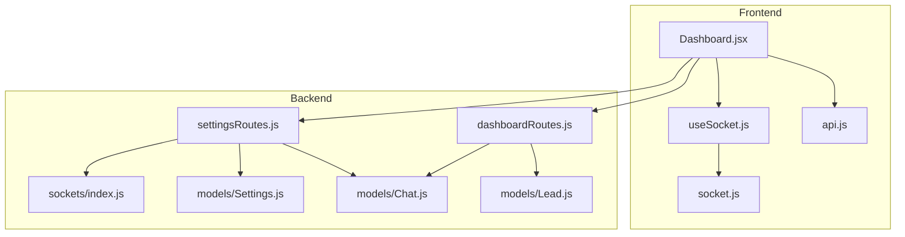
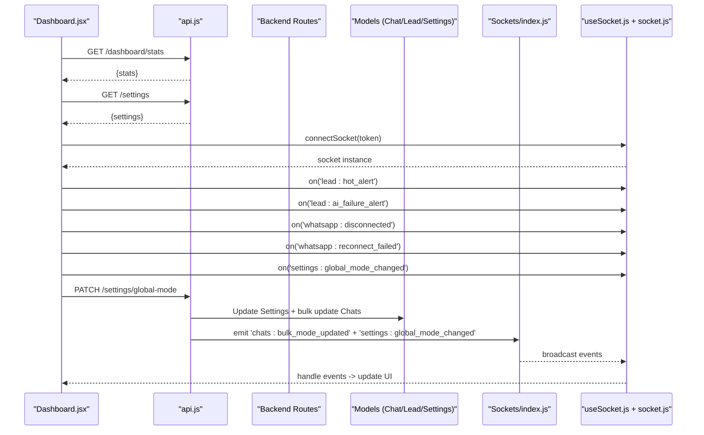
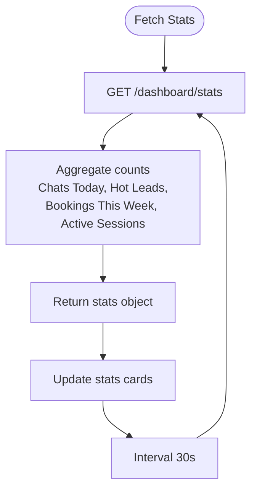
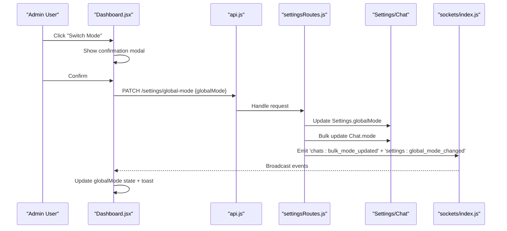
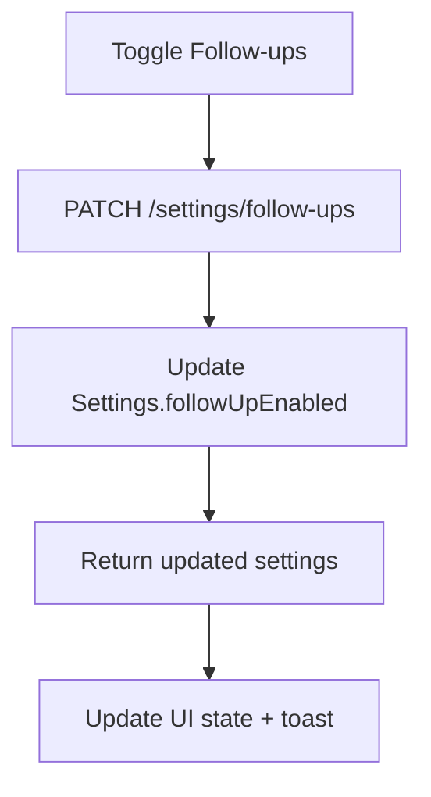
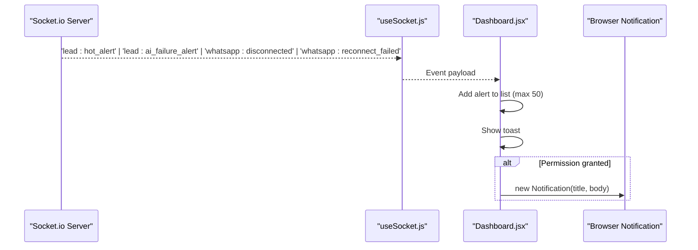
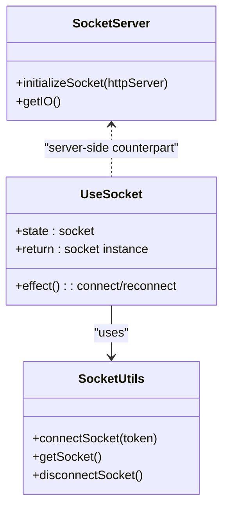
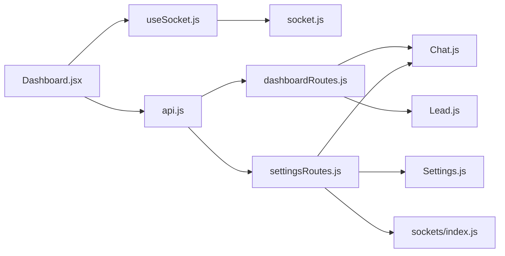

# Main Dashboard

<cite>
**Referenced Files in This Document**
- [Dashboard.jsx](file://frontend/src/pages/Dashboard.jsx)
- [useSocket.js](file://frontend/src/hooks/useSocket.js)
- [socket.js](file://frontend/src/utils/socket.js)
- [api.js](file://frontend/src/utils/api.js)
- [dashboardRoutes.js](file://backend/src/routes/dashboardRoutes.js)
- [settingsRoutes.js](file://backend/src/routes/settingsRoutes.js)
- [index.js (sockets)](file://backend/src/sockets/index.js)
- [Settings.js](file://backend/src/models/Settings.js)
- [Chat.js](file://backend/src/models/Chat.js)
- [Lead.js](file://backend/src/models/Lead.js)
</cite>

## Table of Contents
1. [Introduction](#introduction)
2. [Project Structure](#project-structure)
3. [Core Components](#core-components)
4. [Architecture Overview](#architecture-overview)
5. [Detailed Component Analysis](#detailed-component-analysis)
6. [Dependency Analysis](#dependency-analysis)
7. [Performance Considerations](#performance-considerations)
8. [Troubleshooting Guide](#troubleshooting-guide)
9. [Conclusion](#conclusion)

## Introduction
The Main Dashboard serves as the central monitoring hub for the application. It provides:
- Real-time statistics display via stats cards (active sessions, chats today, hot leads, bookings this week).
- Global mode controls to switch between AI and human response modes across all chats.
- A live alerts panel that surfaces hot lead notifications, AI failures, WhatsApp disconnections, and reconnection failures in real time.
- Follow-up status widget with enable/disable controls.
- Socket event handling for real-time updates, notification permission management, and browser notifications.
- Confirmation modal for global mode changes.
- Data fetching patterns with automatic refresh intervals.

## Project Structure
The dashboard is implemented on the frontend with supporting backend routes and services. The key files involved are:
- Frontend page and hooks: Dashboard.jsx, useSocket.js, socket.js, api.js
- Backend routes and sockets: dashboardRoutes.js, settingsRoutes.js, index.js (sockets)
- Data models: Settings.js, Chat.js, Lead.js

**Diagram sources**
- [Dashboard.jsx:1-496](file://frontend/src/pages/Dashboard.jsx#L1-L496)
- [useSocket.js:1-49](file://frontend/src/hooks/useSocket.js#L1-L49)
- [socket.js:1-66](file://frontend/src/utils/socket.js#L1-L66)
- [api.js:1-83](file://frontend/src/utils/api.js#L1-L83)
- [dashboardRoutes.js:1-71](file://backend/src/routes/dashboardRoutes.js#L1-L71)
- [settingsRoutes.js:1-143](file://backend/src/routes/settingsRoutes.js#L1-L143)
- [index.js (sockets):1-82](file://backend/src/sockets/index.js#L1-L82)
- [Settings.js:1-38](file://backend/src/models/Settings.js#L1-L38)
- [Chat.js:1-107](file://backend/src/models/Chat.js#L1-L107)
- [Lead.js:1-55](file://backend/src/models/Lead.js#L1-L55)

**Section sources**
- [Dashboard.jsx:1-496](file://frontend/src/pages/Dashboard.jsx#L1-L496)
- [dashboardRoutes.js:1-71](file://backend/src/routes/dashboardRoutes.js#L1-L71)
- [settingsRoutes.js:1-143](file://backend/src/routes/settingsRoutes.js#L1-L143)
- [index.js (sockets):1-82](file://backend/src/sockets/index.js#L1-L82)
- [Settings.js:1-38](file://backend/src/models/Settings.js#L1-L38)
- [Chat.js:1-107](file://backend/src/models/Chat.js#L1-L107)
- [Lead.js:1-55](file://backend/src/models/Lead.js#L1-L55)

## Core Components
- Stats Cards: Display active sessions, chats today, hot leads, and bookings this week. They fetch data from the backend and auto-refresh periodically.
- Global Mode Toggle: Admin-only control to switch all chats to AI or Human mode. Includes a confirmation modal before applying changes.
- Follow-ups Widget: Shows current follow-up system status and allows enabling/disabling it.
- Live Alerts Panel: Receives real-time events for hot leads, AI failures, WhatsApp disconnections, and reconnection failures. Supports toast and browser notifications.
- Socket Integration: Manages connection lifecycle, authentication, and reconnection; subscribes to relevant events on the dashboard.

**Section sources**
- [Dashboard.jsx:25-221](file://frontend/src/pages/Dashboard.jsx#L25-L221)
- [settingsRoutes.js:42-110](file://backend/src/routes/settingsRoutes.js#L42-L110)
- [index.js (sockets):18-63](file://backend/src/sockets/index.js#L18-L63)

## Architecture Overview
The dashboard coordinates UI state, HTTP requests, and WebSocket events to provide a unified operational view.

**Diagram sources**
- [Dashboard.jsx:42-176](file://frontend/src/pages/Dashboard.jsx#L42-L176)
- [dashboardRoutes.js:13-68](file://backend/src/routes/dashboardRoutes.js#L13-L68)
- [settingsRoutes.js:42-80](file://backend/src/routes/settingsRoutes.js#L42-L80)
- [index.js (sockets):50-63](file://backend/src/sockets/index.js#L50-L63)
- [useSocket.js:17-43](file://frontend/src/hooks/useSocket.js#L17-L43)
- [socket.js:13-44](file://frontend/src/utils/socket.js#L13-L44)

## Detailed Component Analysis

### Stats Cards
- Active Sessions: Counts connected WhatsApp sessions by querying session statuses.
- Chats Today: Counts chats created today.
- Hot Leads: Counts leads marked as hot.
- Bookings This Week: Counts bookings created within the last seven days.
- Auto-refresh: Stats are fetched every 30 seconds and can be manually refreshed.

Data flow:
- Frontend calls GET /dashboard/stats.
- Backend aggregates counts from Chat, Lead, Booking, and session status utilities.
- Response includes stats used by the cards.

**Diagram sources**
- [Dashboard.jsx:42-51](file://frontend/src/pages/Dashboard.jsx#L42-L51)
- [dashboardRoutes.js:13-68](file://backend/src/routes/dashboardRoutes.js#L13-L68)

**Section sources**
- [Dashboard.jsx:284-342](file://frontend/src/pages/Dashboard.jsx#L284-L342)
- [dashboardRoutes.js:13-68](file://backend/src/routes/dashboardRoutes.js#L13-L68)

### Global Mode Controls
- Purpose: Switch all existing chats to AI or Human mode.
- Behavior:
  - Admin-only toggle button.
  - Clicking opens a confirmation modal describing impact.
  - On confirm, PATCH /settings/global-mode is called.
  - Backend updates Settings and bulk updates Chat documents.
  - Backend emits real-time events to clients.
  - Frontend updates local state and shows success toast.

**Diagram sources**
- [Dashboard.jsx:178-190](file://frontend/src/pages/Dashboard.jsx#L178-L190)
- [Dashboard.jsx:462-491](file://frontend/src/pages/Dashboard.jsx#L462-L491)
- [settingsRoutes.js:42-80](file://backend/src/routes/settingsRoutes.js#L42-L80)
- [index.js (sockets):50-63](file://backend/src/sockets/index.js#L50-L63)

**Section sources**
- [Dashboard.jsx:247-281](file://frontend/src/pages/Dashboard.jsx#L247-L281)
- [Dashboard.jsx:178-190](file://frontend/src/pages/Dashboard.jsx#L178-L190)
- [Dashboard.jsx:462-491](file://frontend/src/pages/Dashboard.jsx#L462-L491)
- [settingsRoutes.js:42-80](file://backend/src/routes/settingsRoutes.js#L42-L80)
- [Settings.js:16-33](file://backend/src/models/Settings.js#L16-L33)
- [Chat.js:59-63](file://backend/src/models/Chat.js#L59-L63)

### Follow-up Status Widget
- Displays whether the follow-up system is enabled or disabled.
- Admin-only toggle updates the setting via PATCH /settings/follow-ups.
- Backend persists the change and returns updated settings.

**Diagram sources**
- [Dashboard.jsx:192-200](file://frontend/src/pages/Dashboard.jsx#L192-L200)
- [settingsRoutes.js:86-110](file://backend/src/routes/settingsRoutes.js#L86-L110)

**Section sources**
- [Dashboard.jsx:359-391](file://frontend/src/pages/Dashboard.jsx#L359-L391)
- [settingsRoutes.js:86-110](file://backend/src/routes/settingsRoutes.js#L86-L110)

### Live Alerts Panel
- Event types handled:
  - Hot lead alert: lead:hot_alert
  - AI failure alert: lead:ai_failure_alert
  - WhatsApp disconnected: whatsapp:disconnected
  - Reconnection failed: whatsapp:reconnect_failed
- Each alert adds an entry to the local list, shows a toast, and optionally triggers a browser notification if permission is granted.
- Users can clear all alerts or dismiss individual ones.

**Diagram sources**
- [Dashboard.jsx:83-176](file://frontend/src/pages/Dashboard.jsx#L83-L176)
- [useSocket.js:17-43](file://frontend/src/hooks/useSocket.js#L17-L43)
- [socket.js:31-41](file://frontend/src/utils/socket.js#L31-L41)

**Section sources**
- [Dashboard.jsx:83-176](file://frontend/src/pages/Dashboard.jsx#L83-L176)
- [Dashboard.jsx:393-458](file://frontend/src/pages/Dashboard.jsx#L393-L458)

### Socket Event Handling and Connection Lifecycle
- Authentication:
  - Frontend connects using JWT token via auth header.
  - Backend verifies token and joins authenticated users to the dashboard room.
- Reconnection:
  - Frontend attempts reconnection with exponential backoff and max attempts.
  - Hook listens for disconnect and reconnects automatically when authenticated.
- Events:
  - Dashboard subscribes to specific events for live alerts and global mode changes.

**Diagram sources**
- [useSocket.js:13-46](file://frontend/src/hooks/useSocket.js#L13-L46)
- [socket.js:13-66](file://frontend/src/utils/socket.js#L13-L66)
- [index.js (sockets):18-82](file://backend/src/sockets/index.js#L18-L82)

**Section sources**
- [useSocket.js:1-49](file://frontend/src/hooks/useSocket.js#L1-49)
- [socket.js:1-66](file://frontend/src/utils/socket.js#L1-L66)
- [index.js (sockets):1-82](file://backend/src/sockets/index.js#L1-L82)

### Notification Permission Management
- Requests browser notification permission on mount.
- Stores permission state locally to conditionally show native notifications.
- Uses app icon path for notifications.

**Section sources**
- [Dashboard.jsx:64-70](file://frontend/src/pages/Dashboard.jsx#L64-L70)
- [Dashboard.jsx:95-101](file://frontend/src/pages/Dashboard.jsx#L95-L101)

### Data Fetching Patterns and Refresh Intervals
- Initial load:
  - Fetches stats and settings once on mount.
  - Requests notification permission.
- Automatic refresh:
  - Stats are refetched every 30 seconds.
- Manual refresh:
  - Refresh button triggers immediate stats fetch.

**Section sources**
- [Dashboard.jsx:72-80](file://frontend/src/pages/Dashboard.jsx#L72-L80)
- [Dashboard.jsx:236-245](file://frontend/src/pages/Dashboard.jsx#L236-L245)

## Dependency Analysis
- Frontend dependencies:
  - Dashboard.jsx depends on api.js for REST calls, useSocket.js for WebSocket integration, and React hooks for state and effects.
  - useSocket.js depends on socket.js for connection management and AuthContext for token availability.
- Backend dependencies:
  - dashboardRoutes.js depends on models (Chat, Lead, Booking) and services (WhatsApp session status, AI model health).
  - settingsRoutes.js depends on models (Settings, Chat) and sockets to broadcast changes.
  - sockets/index.js handles authentication and room membership.

**Diagram sources**
- [Dashboard.jsx:1-6](file://frontend/src/pages/Dashboard.jsx#L1-L6)
- [useSocket.js:1-4](file://frontend/src/hooks/useSocket.js#L1-L4)
- [socket.js:1-3](file://frontend/src/utils/socket.js#L1-L3)
- [dashboardRoutes.js:1-6](file://backend/src/routes/dashboardRoutes.js#L1-L6)
- [settingsRoutes.js:1-6](file://backend/src/routes/settingsRoutes.js#L1-L6)
- [index.js (sockets):1-6](file://backend/src/sockets/index.js#L1-L6)

**Section sources**
- [Dashboard.jsx:1-6](file://frontend/src/pages/Dashboard.jsx#L1-L6)
- [useSocket.js:1-4](file://frontend/src/hooks/useSocket.js#L1-L4)
- [socket.js:1-3](file://frontend/src/utils/socket.js#L1-L3)
- [dashboardRoutes.js:1-6](file://backend/src/routes/dashboardRoutes.js#L1-L6)
- [settingsRoutes.js:1-6](file://backend/src/routes/settingsRoutes.js#L1-L6)
- [index.js (sockets):1-6](file://backend/src/sockets/index.js#L1-L6)

## Performance Considerations
- Stats polling interval is set to 30 seconds; adjust based on expected traffic and server capacity.
- Alert list is capped at 50 entries to prevent unbounded memory growth.
- Socket reconnection uses limited attempts and delays to avoid excessive network churn.
- Bulk chat updates occur only on explicit admin action, minimizing write amplification.

[No sources needed since this section provides general guidance]

## Troubleshooting Guide
- Stats not updating:
  - Verify GET /dashboard/stats returns data and check console errors.
  - Ensure the 30-second interval is running and not cleared prematurely.
- Global mode change not reflected:
  - Confirm PATCH /settings/global-mode succeeds and emits events.
  - Check that both 'chats:bulk_mode_updated' and 'settings:global_mode_changed' are emitted and received.
- Alerts not appearing:
  - Validate socket connection and event subscriptions.
  - Ensure notification permission is granted for browser notifications.
- Follow-ups toggle fails:
  - Inspect PATCH /settings/follow-ups response and error messages.
  - Confirm admin authorization is present.

**Section sources**
- [Dashboard.jsx:42-51](file://frontend/src/pages/Dashboard.jsx#L42-L51)
- [Dashboard.jsx:83-176](file://frontend/src/pages/Dashboard.jsx#L83-L176)
- [settingsRoutes.js:42-80](file://backend/src/routes/settingsRoutes.js#L42-L80)
- [settingsRoutes.js:86-110](file://backend/src/routes/settingsRoutes.js#L86-L110)
- [useSocket.js:17-43](file://frontend/src/hooks/useSocket.js#L17-L43)
- [socket.js:31-41](file://frontend/src/utils/socket.js#L31-L41)

## Conclusion
The Main Dashboard integrates real-time statistics, global controls, and live alerts into a cohesive operational interface. It leverages periodic HTTP polling for metrics, WebSocket events for instant notifications, and admin-only endpoints for critical configuration changes. Proper error handling, permission management, and reconnection logic ensure reliability under varying conditions.

[No sources needed since this section summarizes without analyzing specific files]