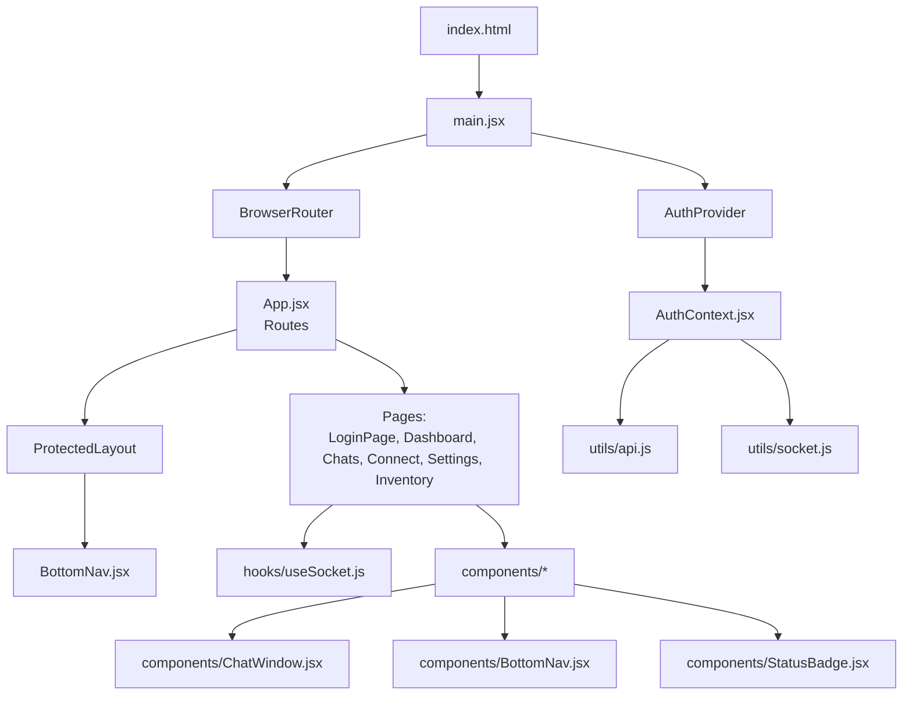
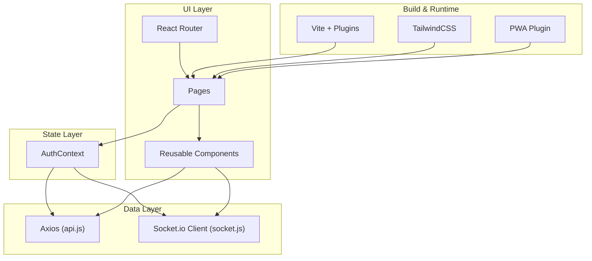
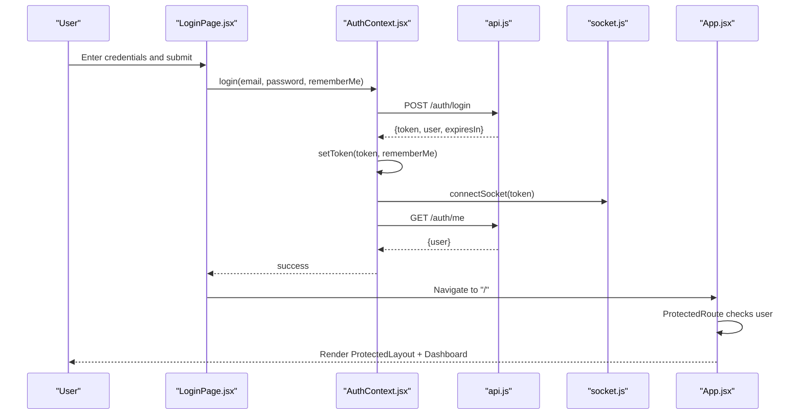
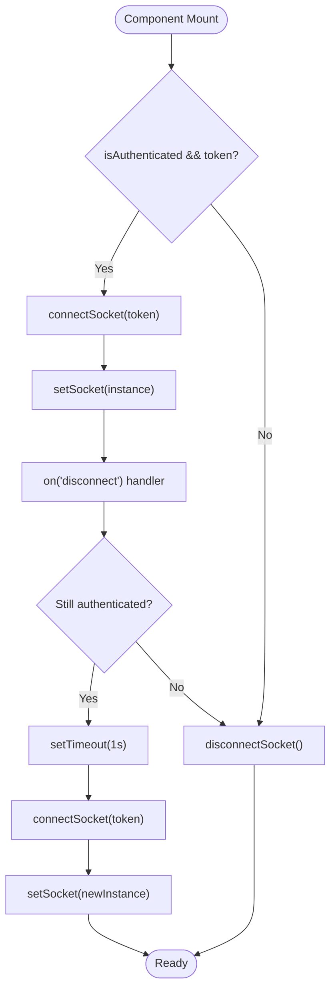
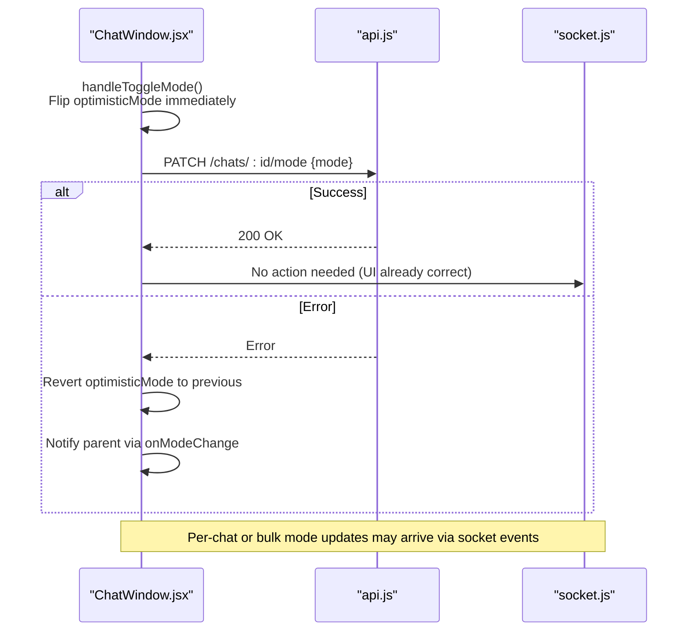
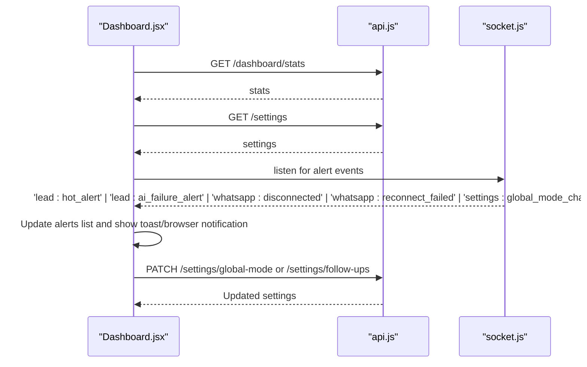
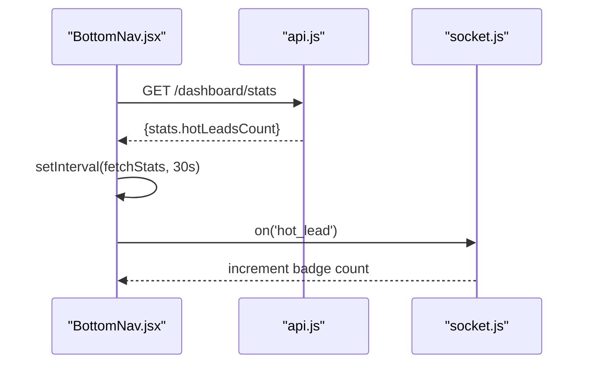
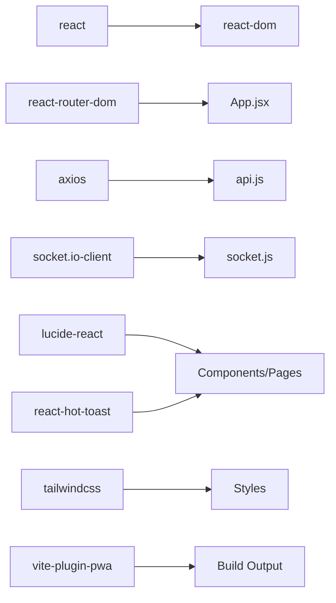

# Frontend Development

<cite>
**Referenced Files in This Document**
- [package.json](file://frontend/package.json)
- [vite.config.js](file://frontend/vite.config.js)
- [tailwind.config.js](file://frontend/tailwind.config.js)
- [index.html](file://frontend/index.html)
- [main.jsx](file://frontend/src/main.jsx)
- [App.jsx](file://frontend/src/App.jsx)
- [AuthContext.jsx](file://frontend/src/context/AuthContext.jsx)
- [api.js](file://frontend/src/utils/api.js)
- [socket.js](file://frontend/src/utils/socket.js)
- [useSocket.js](file://frontend/src/hooks/useSocket.js)
- [BottomNav.jsx](file://frontend/src/components/BottomNav.jsx)
- [StatusBadge.jsx](file://frontend/src/components/StatusBadge.jsx)
- [ChatWindow.jsx](file://frontend/src/components/ChatWindow.jsx)
- [LoginPage.jsx](file://frontend/src/pages/LoginPage.jsx)
- [Dashboard.jsx](file://frontend/src/pages/Dashboard.jsx)
</cite>

## Table of Contents
1. Introduction
2. Project Structure
3. Core Components
4. Architecture Overview
5. Detailed Component Analysis
6. Dependency Analysis
7. Performance Considerations
8. Troubleshooting Guide
9. Conclusion
10. Appendices

## Introduction
This document provides comprehensive frontend development guidance for the Nandibaag Bot dashboard. It covers the React application built with Vite, component hierarchy, state management via React Context, page-based routing, reusable UI components, custom hooks for real-time features using Socket.io, authentication context and protected routes, token management, TailwindCSS styling approach, responsive design patterns, and PWA configuration. It also includes guidelines for adding new pages, components, and integrating with backend APIs.

## Project Structure
The frontend is a modern React + Vite application:
- Entry point initializes providers, router, and global toast notifications.
- Routing defines public and protected routes with a shared layout that includes a bottom navigation bar.
- Authentication state and methods are provided via a React Context.
- HTTP client (Axios) is configured with request/response interceptors for token handling and 401 redirects.
- Real-time communication uses a singleton Socket.io client with automatic reconnection logic.
- Pages implement business features like login, dashboard, chats, connect, settings, and inventory.
- Reusable components include BottomNav, StatusBadge, and ChatWindow.
- Styling uses TailwindCSS with WhatsApp-themed color tokens and Inter font stack.
- PWA is enabled via Vite plugin with manifest and icons.

**Diagram sources**
- [index.html:1-14](file://frontend/index.html#L1-L14)
- [main.jsx:1-38](file://frontend/src/main.jsx#L1-L38)
- [App.jsx:1-103](file://frontend/src/App.jsx#L1-L103)
- [AuthContext.jsx:1-114](file://frontend/src/context/AuthContext.jsx#L1-L114)
- [api.js:1-83](file://frontend/src/utils/api.js#L1-L83)
- [socket.js:1-66](file://frontend/src/utils/socket.js#L1-L66)
- [useSocket.js:1-49](file://frontend/src/hooks/useSocket.js#L1-L49)
- [BottomNav.jsx:1-143](file://frontend/src/components/BottomNav.jsx#L1-L143)
- [ChatWindow.jsx:1-449](file://frontend/src/components/ChatWindow.jsx#L1-L449)
- [StatusBadge.jsx:1-98](file://frontend/src/components/StatusBadge.jsx#L1-L98)

**Section sources**
- [index.html:1-14](file://frontend/index.html#L1-L14)
- [main.jsx:1-38](file://frontend/src/main.jsx#L1-L38)
- [App.jsx:1-103](file://frontend/src/App.jsx#L1-L103)

## Core Components
- App and Routing
  - Defines public route /login and protected routes wrapped in ProtectedLayout.
  - ProtectedRoute checks AuthContext loading and user presence; redirects to /login if unauthenticated.
  - ProtectedLayout renders children within a container and includes BottomNav.
- Authentication Context
  - Provides user, token, login, logout, loading, and isAuthenticated.
  - On mount, restores existing token, connects socket, and fetches current user.
  - Login stores token based on rememberMe choice and connects socket.
  - Logout clears token, resets state, and disconnects socket.
- API Client (Axios)
  - Base URL from environment or default localhost.
  - Request interceptor attaches Bearer token from storage determined by rememberMe flag.
  - Response interceptor handles 401 by clearing tokens and redirecting to /login.
  - Token helpers manage localStorage vs sessionStorage selection and mutual exclusivity.
- Socket Utilities
  - Singleton socket instance with JWT auth via query/auth token.
  - Configured transports and reconnection strategy.
  - Exposes connect, get, and disconnect functions.
- Custom Hook useSocket
  - Auto-connects when authenticated, reconnects on disconnect, and disconnects when not authenticated.
- Bottom Navigation
  - Displays primary nav items and a “More” menu.
  - Fetches hot lead count periodically and updates badge via socket event.
- Status Badge
  - Renders status labels with consistent colors and border variants.
- Chat Window
  - Optimistic mode toggle with AbortController to cancel superseded requests.
  - Listens to per-chat and bulk mode updates via socket events.
  - Handles sending messages, reset conversation, and scroll behavior.

**Section sources**
- [App.jsx:12-41](file://frontend/src/App.jsx#L12-L41)
- [App.jsx:43-103](file://frontend/src/App.jsx#L43-L103)
- [AuthContext.jsx:21-98](file://frontend/src/context/AuthContext.jsx#L21-L98)
- [AuthContext.jsx:105-114](file://frontend/src/context/AuthContext.jsx#L105-L114)
- [api.js:11-54](file://frontend/src/utils/api.js#L11-L54)
- [api.js:56-83](file://frontend/src/utils/api.js#L56-L83)
- [socket.js:13-44](file://frontend/src/utils/socket.js#L13-L44)
- [useSocket.js:13-46](file://frontend/src/hooks/useSocket.js#L13-L46)
- [BottomNav.jsx:18-55](file://frontend/src/components/BottomNav.jsx#L18-L55)
- [StatusBadge.jsx:30-42](file://frontend/src/components/StatusBadge.jsx#L30-L42)
- [ChatWindow.jsx:109-143](file://frontend/src/components/ChatWindow.jsx#L109-L143)
- [ChatWindow.jsx:63-101](file://frontend/src/components/ChatWindow.jsx#L63-L101)

## Architecture Overview
The application follows a layered architecture:
- Presentation layer: React components and pages.
- State layer: React Context for auth, local component state for UI.
- Data layer: Axios for REST calls with interceptors; Socket.io for real-time events.
- Infrastructure: Vite build tooling, TailwindCSS, PWA plugin, and environment variables.

**Diagram sources**
- [App.jsx:1-103](file://frontend/src/App.jsx#L1-103)
- [AuthContext.jsx:1-114](file://frontend/src/context/AuthContext.jsx#L1-L114)
- [api.js:1-83](file://frontend/src/utils/api.js#L1-L83)
- [socket.js:1-66](file://frontend/src/utils/socket.js#L1-L66)
- [vite.config.js:1-63](file://frontend/vite.config.js#L1-L63)
- [tailwind.config.js:1-34](file://frontend/tailwind.config.js#L1-L34)

## Detailed Component Analysis

### Authentication Flow and Protected Routes
This sequence shows login, token persistence, socket connection, and protected route rendering.

**Diagram sources**
- [LoginPage.jsx:33-56](file://frontend/src/pages/LoginPage.jsx#L33-L56)
- [AuthContext.jsx:52-72](file://frontend/src/context/AuthContext.jsx#L52-L72)
- [AuthContext.jsx:39-50](file://frontend/src/context/AuthContext.jsx#L39-L50)
- [api.js:18-34](file://frontend/src/utils/api.js#L18-L34)
- [socket.js:13-44](file://frontend/src/utils/socket.js#L13-L44)
- [App.jsx:12-41](file://frontend/src/App.jsx#L12-L41)

**Section sources**
- [LoginPage.jsx:1-161](file://frontend/src/pages/LoginPage.jsx#L1-L161)
- [AuthContext.jsx:21-98](file://frontend/src/context/AuthContext.jsx#L21-L98)
- [App.jsx:12-41](file://frontend/src/App.jsx#L12-L41)

### Socket Connection Lifecycle and Reconnect Strategy

**Diagram sources**
- [useSocket.js:13-46](file://frontend/src/hooks/useSocket.js#L13-L46)
- [socket.js:13-44](file://frontend/src/utils/socket.js#L13-L44)

**Section sources**
- [useSocket.js:1-49](file://frontend/src/hooks/useSocket.js#L1-L49)
- [socket.js:1-66](file://frontend/src/utils/socket.js#L1-L66)

### Chat Mode Toggle (Optimistic Update)

**Diagram sources**
- [ChatWindow.jsx:109-143](file://frontend/src/components/ChatWindow.jsx#L109-L143)
- [ChatWindow.jsx:77-91](file://frontend/src/components/ChatWindow.jsx#L77-L91)

**Section sources**
- [ChatWindow.jsx:1-449](file://frontend/src/components/ChatWindow.jsx#L1-L449)

### Dashboard Alerts and Global Controls

**Diagram sources**
- [Dashboard.jsx:42-80](file://frontend/src/pages/Dashboard.jsx#L42-L80)
- [Dashboard.jsx:82-176](file://frontend/src/pages/Dashboard.jsx#L82-L176)
- [Dashboard.jsx:178-200](file://frontend/src/pages/Dashboard.jsx#L178-L200)

**Section sources**
- [Dashboard.jsx:1-496](file://frontend/src/pages/Dashboard.jsx#L1-L496)

### Bottom Navigation and Hot Lead Badge

**Diagram sources**
- [BottomNav.jsx:24-55](file://frontend/src/components/BottomNav.jsx#L24-L55)

**Section sources**
- [BottomNav.jsx:1-143](file://frontend/src/components/BottomNav.jsx#L1-L143)

## Dependency Analysis
Key runtime dependencies and their roles:
- react, react-dom: UI framework and DOM rendering.
- react-router-dom: Declarative routing and navigation.
- axios: HTTP client with interceptors for auth and error handling.
- socket.io-client: Real-time bidirectional communication.
- lucide-react: Icon library used across components.
- react-hot-toast: Non-blocking notifications.
- tailwindcss and @tailwindcss/vite: Utility-first CSS and Vite integration.
- vite-plugin-pwa: Service worker and web app manifest generation.

**Diagram sources**
- [package.json:11-26](file://frontend/package.json#L11-L26)
- [api.js:1-16](file://frontend/src/utils/api.js#L1-L16)
- [socket.js:1-4](file://frontend/src/utils/socket.js#L1-L4)
- [vite.config.js:1-10](file://frontend/vite.config.js#L1-L10)

**Section sources**
- [package.json:1-28](file://frontend/package.json#L1-L28)

## Performance Considerations
- Use optimistic UI updates for frequent toggles (e.g., chat mode) to reduce perceived latency and network chatter.
- Debounce or throttle expensive operations such as polling intervals; consider switching to server-driven updates where possible.
- Leverage socket reconnection strategies to minimize manual refreshes during transient network issues.
- Keep Tailwind content paths scoped to avoid unnecessary CSS bloat in production builds.
- Prefer lazy loading for heavy pages if the app grows beyond current scope.

[No sources needed since this section provides general guidance]

## Troubleshooting Guide
Common issues and resolutions:
- 401 Unauthorized
  - The response interceptor clears tokens and redirects to /login. Ensure rememberMe flag is set correctly and tokens exist in the expected storage.
- Socket Disconnections
  - The hook listens for disconnect and attempts reconnection while authenticated. Verify token availability and server reachability.
- Toast Notifications Not Showing
  - Toaster is mounted at the root level. Confirm it remains in the tree and no early returns bypass it.
- PWA Icons Not Loading
  - Ensure icons are placed under public/icons and referenced in the Vite PWA config.

**Section sources**
- [api.js:36-54](file://frontend/src/utils/api.js#L36-L54)
- [useSocket.js:22-43](file://frontend/src/hooks/useSocket.js#L22-L43)
- [main.jsx:14-34](file://frontend/src/main.jsx#L14-L34)
- [vite.config.js:10-49](file://frontend/vite.config.js#L10-L49)

## Conclusion
The Nandibaag Bot dashboard is a well-structured React + Vite application leveraging React Context for authentication, Axios for secure API calls, and Socket.io for live updates. Protected routes ensure security, while TailwindCSS and PWA enable a responsive, installable experience. The documented patterns provide a solid foundation for extending the app with new pages, components, and integrations.

[No sources needed since this section summarizes without analyzing specific files]

## Appendices

### Adding a New Page
- Create a new file under src/pages/ (e.g., NewPage.jsx).
- Register the route in App.jsx inside the Routes block.
- Wrap the route with ProtectedLayout if it requires authentication.
- Use useAuth for user info and useSocket for real-time features.
- Style with Tailwind classes and reuse components from src/components/.

**Section sources**
- [App.jsx:46-96](file://frontend/src/App.jsx#L46-L96)

### Creating a Reusable Component
- Place the component under src/components/.
- Keep props minimal and typed via JSDoc comments if needed.
- Use Tailwind utility classes for styling and lucide-react for icons.
- Export default function and import into pages/components as needed.

**Section sources**
- [StatusBadge.jsx:30-42](file://frontend/src/components/StatusBadge.jsx#L30-L42)

### Integrating with Backend APIs
- Use api.js for all HTTP requests; it automatically attaches Bearer tokens.
- Handle errors via try/catch and display feedback with react-hot-toast.
- For long-running operations, consider AbortController to cancel stale requests.

**Section sources**
- [api.js:18-34](file://frontend/src/utils/api.js#L18-L34)
- [ChatWindow.jsx:124-143](file://frontend/src/components/ChatWindow.jsx#L124-L143)

### Real-Time Features with Socket.io
- Use useSocket to obtain a connected socket instance.
- Subscribe to relevant events in useEffect and clean up listeners on unmount.
- For critical updates, combine socket events with API calls to maintain consistency.

**Section sources**
- [useSocket.js:13-46](file://frontend/src/hooks/useSocket.js#L13-L46)
- [Dashboard.jsx:82-176](file://frontend/src/pages/Dashboard.jsx#L82-L176)

### TailwindCSS and Responsive Design
- Extend theme with brand colors and fonts in tailwind.config.js.
- Use responsive prefixes (sm:, md:, lg:) to adapt layouts across devices.
- Apply consistent spacing and typography scales for readability.

**Section sources**
- [tailwind.config.js:6-30](file://frontend/tailwind.config.js#L6-L30)

### PWA Configuration
- Configure manifest, icons, and caching rules in vite.config.js.
- Include assets under public/icons and reference them in the manifest.
- Use workbox runtime caching for external APIs if appropriate.

**Section sources**
- [vite.config.js:10-49](file://frontend/vite.config.js#L10-L49)