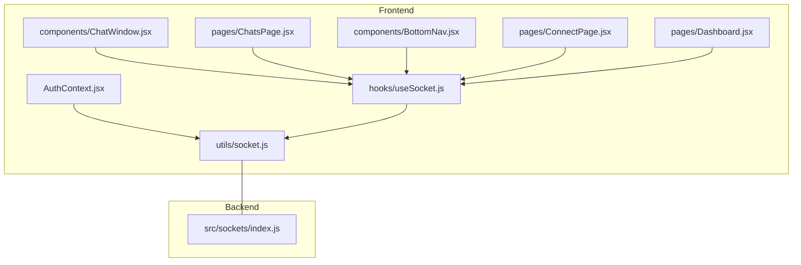
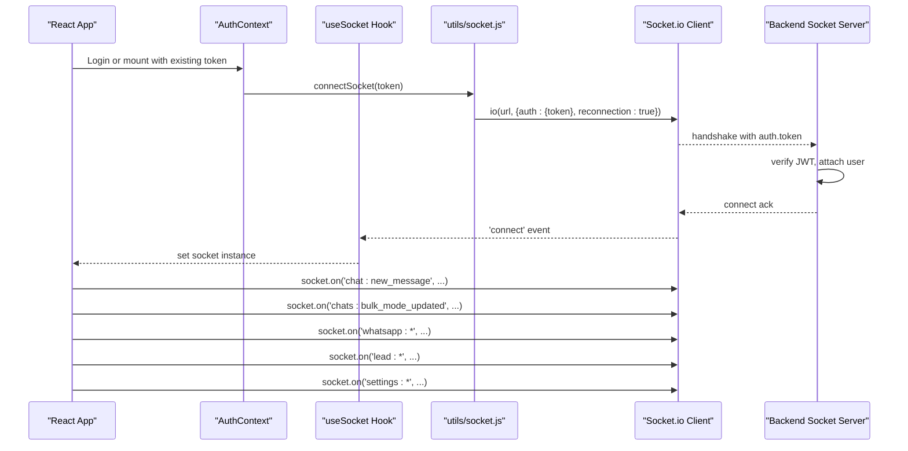
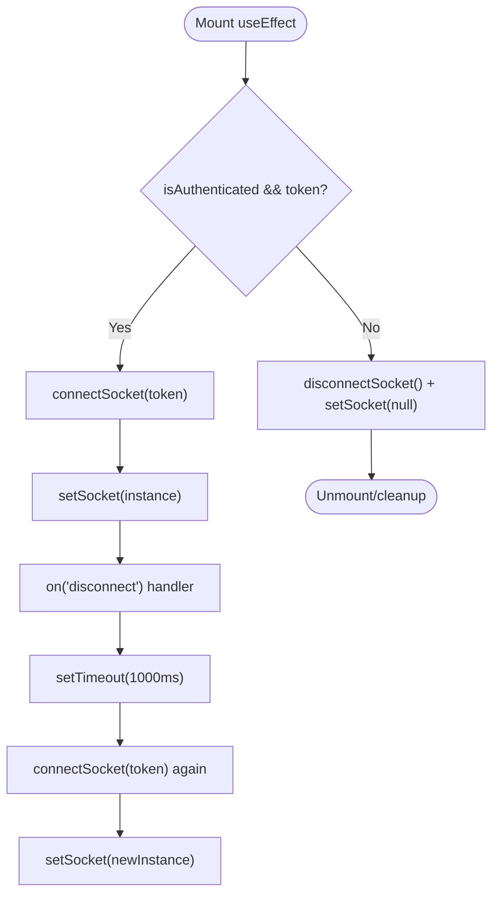
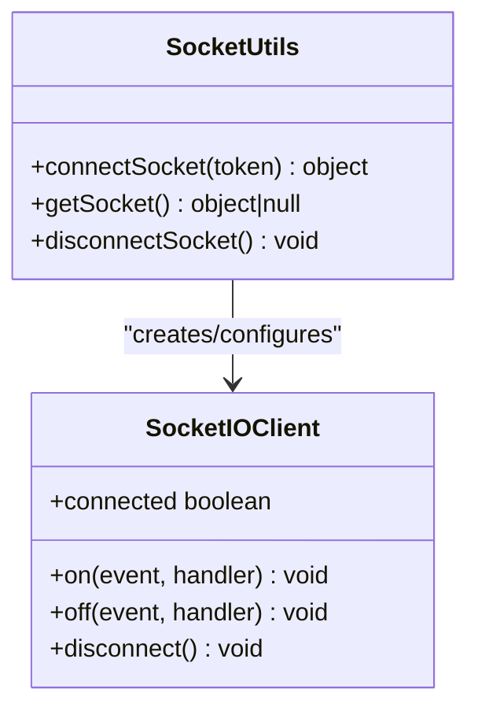
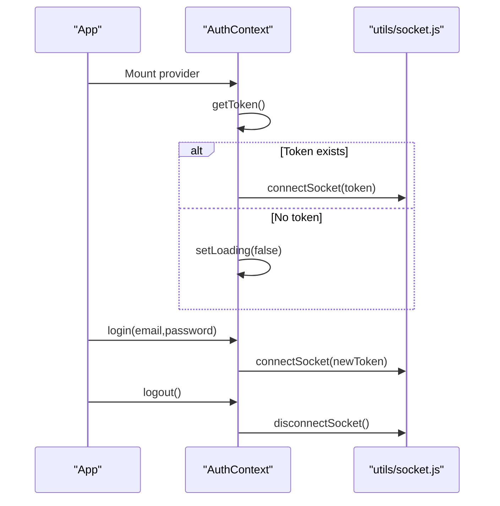
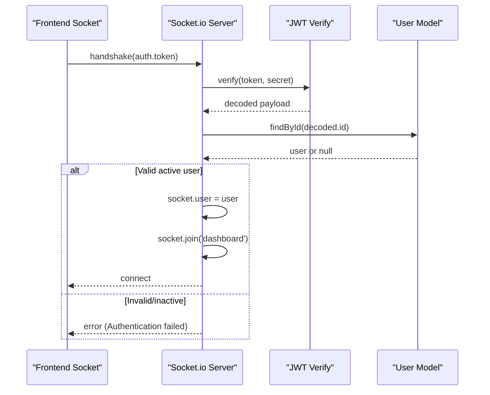
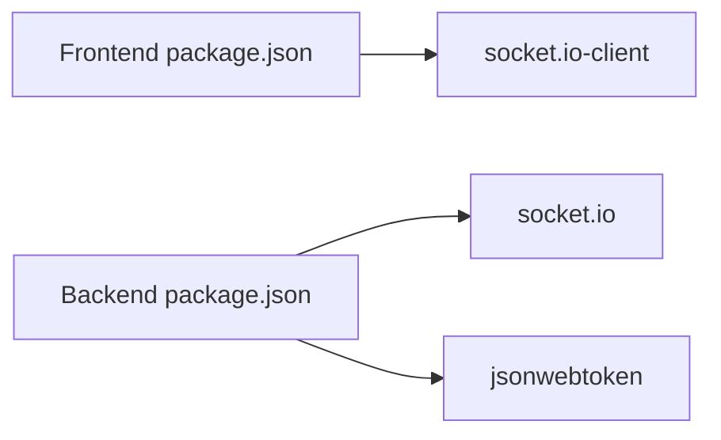

# Real-time Features

<cite>
**Referenced Files in This Document**
- [useSocket.js](file://frontend/src/hooks/useSocket.js)
- [socket.js](file://frontend/src/utils/socket.js)
- [AuthContext.jsx](file://frontend/src/context/AuthContext.jsx)
- [ChatWindow.jsx](file://frontend/src/components/ChatWindow.jsx)
- [ChatsPage.jsx](file://frontend/src/pages/ChatsPage.jsx)
- [BottomNav.jsx](file://frontend/src/components/BottomNav.jsx)
- [ConnectPage.jsx](file://frontend/src/pages/ConnectPage.jsx)
- [Dashboard.jsx](file://frontend/src/pages/Dashboard.jsx)
- [index.js (sockets)](file://backend/src/sockets/index.js)
- [package.json (frontend)](file://frontend/package.json)
- [package.json (backend)](file://backend/package.json)
</cite>

## Table of Contents
1. [Introduction](#introduction)
2. [Project Structure](#project-structure)
3. [Core Components](#core-components)
4. [Architecture Overview](#architecture-overview)
5. [Detailed Component Analysis](#detailed-component-analysis)
6. [Dependency Analysis](#dependency-analysis)
7. [Performance Considerations](#performance-considerations)
8. [Troubleshooting Guide](#troubleshooting-guide)
9. [Conclusion](#conclusion)

## Introduction
This document explains the real-time communication features implemented in the Nandibaag Bot frontend using Socket.io. It covers:
- The custom useSocket hook for connection lifecycle and reconnection
- The socket utility functions for initialization, authentication, and cleanup
- Event-driven state synchronization across chat components
- Real-time event types, message formats, and data patterns
- Connection lifecycle management, offline handling, performance optimization, and debugging techniques

## Project Structure
The real-time feature is implemented with a clear separation between:
- Frontend utilities and hooks that manage the Socket.io client
- React components that subscribe to events and update UI state
- Backend Socket.io server that authenticates connections and emits domain events

**Diagram sources**
- [AuthContext.jsx:21-36](file://frontend/src/context/AuthContext.jsx#L21-L36)
- [socket.js:13-44](file://frontend/src/utils/socket.js#L13-L44)
- [useSocket.js:13-46](file://frontend/src/hooks/useSocket.js#L13-L46)
- [ChatWindow.jsx:63-101](file://frontend/src/components/ChatWindow.jsx#L63-L101)
- [ChatsPage.jsx:120-132](file://frontend/src/pages/ChatsPage.jsx#L120-L132)
- [BottomNav.jsx:45-55](file://frontend/src/components/BottomNav.jsx#L45-L55)
- [ConnectPage.jsx:160-182](file://frontend/src/pages/ConnectPage.jsx#L160-L182)
- [Dashboard.jsx:160-176](file://frontend/src/pages/Dashboard.jsx#L160-L176)
- [index.js (sockets):18-63](file://backend/src/sockets/index.js#L18-L63)

**Section sources**
- [AuthContext.jsx:21-36](file://frontend/src/context/AuthContext.jsx#L21-L36)
- [socket.js:13-44](file://frontend/src/utils/socket.js#L13-L44)
- [useSocket.js:13-46](file://frontend/src/hooks/useSocket.js#L13-L46)
- [ChatWindow.jsx:63-101](file://frontend/src/components/ChatWindow.jsx#L63-L101)
- [ChatsPage.jsx:120-132](file://frontend/src/pages/ChatsPage.jsx#L120-L132)
- [BottomNav.jsx:45-55](file://frontend/src/components/BottomNav.jsx#L45-L55)
- [ConnectPage.jsx:160-182](file://frontend/src/pages/ConnectPage.jsx#L160-L182)
- [Dashboard.jsx:160-176](file://frontend/src/pages/Dashboard.jsx#L160-L176)
- [index.js (sockets):18-63](file://backend/src/sockets/index.js#L18-L63)

## Core Components
- Custom hook useSocket: manages connection lifecycle, reconnection on disconnect, and ensures a socket instance exists only when authenticated.
- Socket utility module: provides connectSocket, getSocket, and disconnectSocket; configures transports, reconnection, and JWT auth via handshake.
- AuthContext integration: connects/disconnects sockets on login/logout and initial token load.
- Event consumers: ChatWindow, ChatsPage, BottomNav, ConnectPage, Dashboard subscribe to specific events and update local state.

Key responsibilities:
- Authentication: pass JWT token during handshake; backend verifies and attaches user context.
- Reconnection: both client-side Socket.io reconnection and explicit reconnect logic in useSocket.
- State sync: optimistic updates with fallback to server truth via socket events.

**Section sources**
- [useSocket.js:13-46](file://frontend/src/hooks/useSocket.js#L13-L46)
- [socket.js:13-44](file://frontend/src/utils/socket.js#L13-L44)
- [AuthContext.jsx:21-36](file://frontend/src/context/AuthContext.jsx#L21-L36)
- [AuthContext.jsx:52-86](file://frontend/src/context/AuthContext.jsx#L52-L86)
- [index.js (sockets):26-63](file://backend/src/sockets/index.js#L26-L63)

## Architecture Overview
The frontend maintains a singleton Socket.io client per tab/process. On authentication, it connects with a JWT token. The backend validates the token, attaches the user, and joins the socket to a dashboard room. Various pages listen to domain-specific events to keep UI synchronized.

**Diagram sources**
- [AuthContext.jsx:52-66](file://frontend/src/context/AuthContext.jsx#L52-L66)
- [socket.js:13-44](file://frontend/src/utils/socket.js#L13-L44)
- [useSocket.js:17-43](file://frontend/src/hooks/useSocket.js#L17-L43)
- [index.js (sockets):26-63](file://backend/src/sockets/index.js#L26-L63)
- [ChatWindow.jsx:92-101](file://frontend/src/components/ChatWindow.jsx#L92-L101)
- [ChatsPage.jsx:122-132](file://frontend/src/pages/ChatsPage.jsx#L122-L132)
- [ConnectPage.jsx:164-181](file://frontend/src/pages/ConnectPage.jsx#L164-L181)
- [Dashboard.jsx:163-176](file://frontend/src/pages/Dashboard.jsx#L163-L176)

## Detailed Component Analysis

### useSocket Hook
Responsibilities:
- Create and cache a socket instance when authenticated
- Handle disconnect by attempting reconnect after a short delay
- Clean up listeners on unmount or when auth changes

Reconnection strategy:
- Relies on Socket.io built-in reconnection configuration
- Adds an explicit reconnect attempt on 'disconnect' if still authenticated

**Diagram sources**
- [useSocket.js:17-43](file://frontend/src/hooks/useSocket.js#L17-L43)

**Section sources**
- [useSocket.js:13-46](file://frontend/src/hooks/useSocket.js#L13-L46)

### Socket Utility Functions
Responsibilities:
- Singleton pattern for the Socket.io client
- Configure transports and reconnection parameters
- Attach basic connect/disconnect/connect_error logs
- Provide getSocket and disconnectSocket helpers

Configuration highlights:
- URL resolution from environment variables
- JWT passed via handshake.auth.token
- Transports include WebSocket and HTTP long-polling fallback
- Reconnection enabled with attempts and delays

**Diagram sources**
- [socket.js:13-66](file://frontend/src/utils/socket.js#L13-L66)

**Section sources**
- [socket.js:13-66](file://frontend/src/utils/socket.js#L13-L66)

### AuthContext Integration
Responsibilities:
- Connect socket on app start if a token exists
- Connect socket after successful login
- Disconnect socket on logout

**Diagram sources**
- [AuthContext.jsx:21-36](file://frontend/src/context/AuthContext.jsx#L21-L36)
- [AuthContext.jsx:52-86](file://frontend/src/context/AuthContext.jsx#L52-L86)
- [socket.js:13-44](file://frontend/src/utils/socket.js#L13-L44)

**Section sources**
- [AuthContext.jsx:21-36](file://frontend/src/context/AuthContext.jsx#L21-L36)
- [AuthContext.jsx:52-86](file://frontend/src/context/AuthContext.jsx#L52-L86)

### Event Consumers and Data Synchronization

#### ChatWindow
- Listens for new messages and mode updates
- Optimistic UI updates for mode toggling with API request cancellation and revert on failure
- Auto-scroll behavior based on user scroll position

Event types used:
- chat:new_message
- chat:mode_updated
- chats:bulk_mode_updated

Data patterns:
- Per-chat updates filtered by chatId
- Optimistic state with AbortController to supersede stale requests

**Section sources**
- [ChatWindow.jsx:63-101](file://frontend/src/components/ChatWindow.jsx#L63-L101)
- [ChatWindow.jsx:109-143](file://frontend/src/components/ChatWindow.jsx#L109-L143)

#### ChatsPage
- Listens for new messages and mode updates at the list level
- Implements optimistic toggle for list rows with per-chat request cancellation and revert

Event types used:
- chat:new_message
- chats:bulk_mode_updated
- chat:mode_updated

**Section sources**
- [ChatsPage.jsx:122-132](file://frontend/src/pages/ChatsPage.jsx#L122-L132)
- [ChatsPage.jsx:138-179](file://frontend/src/pages/ChatsPage.jsx#L138-L179)

#### BottomNav
- Subscribes to hot lead notifications to show badge counts

Event types used:
- hot_lead

**Section sources**
- [BottomNav.jsx:45-55](file://frontend/src/components/BottomNav.jsx#L45-L55)

#### ConnectPage
- Manages WhatsApp session lifecycle via socket events
- Handles QR flow, pairing code, readiness, failures, and session destruction

Event types used:
- whatsapp:qr
- whatsapp:ready
- whatsapp:pairing_code
- whatsapp:auth_failure
- whatsapp:init_failed
- whatsapp:reconnect_failed
- whatsapp:session_destroyed

**Section sources**
- [ConnectPage.jsx:164-181](file://frontend/src/pages/ConnectPage.jsx#L164-L181)

#### Dashboard
- Subscribes to alerts and global settings changes
- Displays hot leads, AI failures, WhatsApp connectivity status, and global mode changes

Event types used:
- lead:hot_alert
- lead:ai_failure_alert
- whatsapp:disconnected
- whatsapp:reconnect_failed
- settings:global_mode_changed

**Section sources**
- [Dashboard.jsx:163-176](file://frontend/src/pages/Dashboard.jsx#L163-L176)

### Backend Socket Initialization and Authentication
Responsibilities:
- Initialize Socket.io with CORS settings
- Authenticate clients using JWT passed in handshake.auth.token
- Attach user context to socket and join to a dashboard room
- Provide getIO helper for services to emit events

**Diagram sources**
- [index.js (sockets):18-63](file://backend/src/sockets/index.js#L18-L63)

**Section sources**
- [index.js (sockets):18-63](file://backend/src/sockets/index.js#L18-L63)

## Dependency Analysis
Frontend dependencies relevant to real-time:
- socket.io-client for WebSocket client
- axios for REST calls used alongside socket events

Backend dependencies relevant to real-time:
- socket.io for server
- jsonwebtoken for verifying tokens
- express/http server integration

**Diagram sources**
- [package.json (frontend):11-19](file://frontend/package.json#L11-L19)
- [package.json (backend):23-41](file://backend/package.json#L23-L41)

**Section sources**
- [package.json (frontend):11-19](file://frontend/package.json#L11-L19)
- [package.json (backend):23-41](file://backend/package.json#L23-L41)

## Performance Considerations
- Use a singleton socket instance to avoid multiple connections per tab.
- Prefer event-driven updates over polling; ensure handlers are lightweight.
- Implement optimistic UI updates with request cancellation to prevent race conditions.
- Debounce or throttle frequent events if needed (e.g., typing indicators).
- Keep event payloads minimal; send only necessary fields like chatId and mode.
- Avoid heavy computations inside event handlers; offload to Web Workers if required.
- Ensure proper listener cleanup to prevent memory leaks.

[No sources needed since this section provides general guidance]

## Troubleshooting Guide
Common issues and strategies:
- Connection errors: check connect_error logs and network reachability; verify VITE_SOCKET_URL/VITE_API_URL.
- Authentication failures: ensure JWT is present and valid; confirm backend jwtSecret matches.
- Reconnection loops: inspect reconnectionAttempts, reconnectionDelay, and reconnectionDelayMax; consider exponential backoff.
- Stale state: rely on server truth via socket events; implement revert logic on API failures.
- Missing events: verify component mounts before subscribing; ensure correct event names and namespaces.
- Offline handling: leverage built-in reconnection; persist last known state locally if needed.

Debugging tips:
- Log connect, disconnect, and connect_error events.
- Add unique identifiers to events (e.g., chatId) to filter correctly.
- Use browser DevTools Network tab to inspect WebSocket frames.
- Confirm CORS settings allow the frontend origin.

**Section sources**
- [socket.js:31-43](file://frontend/src/utils/socket.js#L31-L43)
- [useSocket.js:22-37](file://frontend/src/hooks/useSocket.js#L22-L37)
- [index.js (sockets):26-48](file://backend/src/sockets/index.js#L26-L48)

## Conclusion
The frontend’s real-time layer is centered around a robust useSocket hook and a well-configured socket utility. Events drive UI synchronization across chat, dashboard, and connection flows, while optimistic updates improve responsiveness. The backend enforces secure access via JWT and centralizes event emission through a shared Socket.io instance. Following the performance and troubleshooting recommendations will help maintain a smooth, reliable real-time experience.