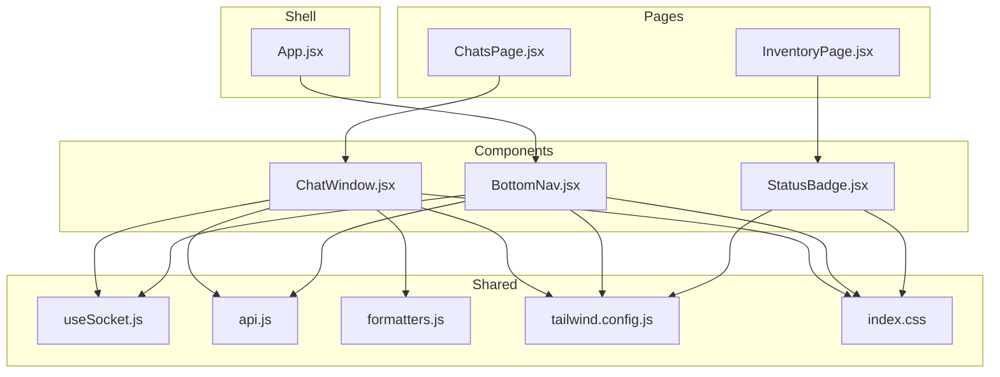
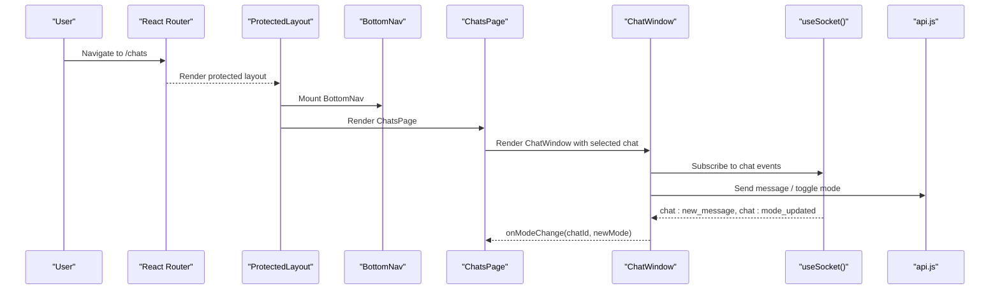
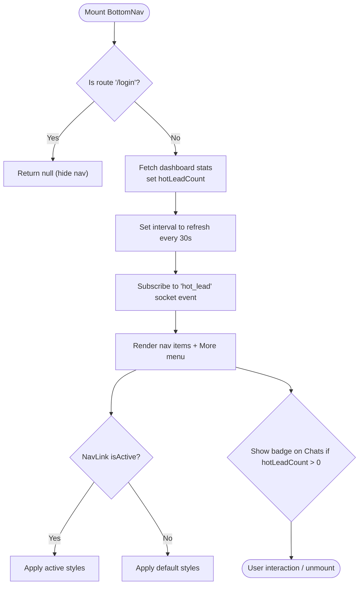
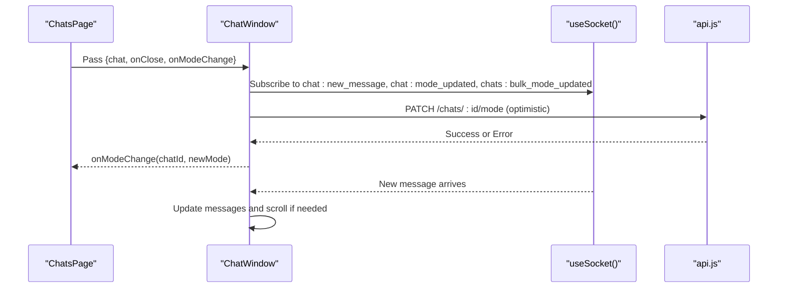
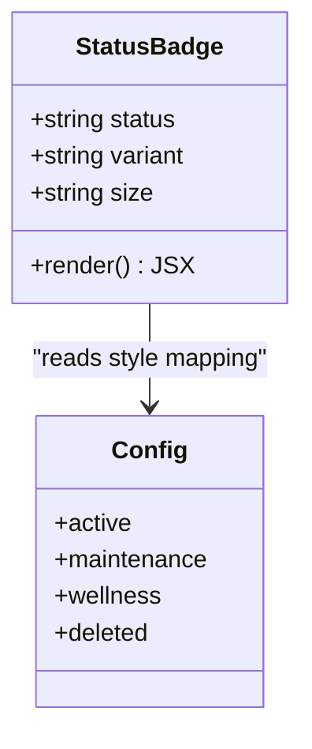
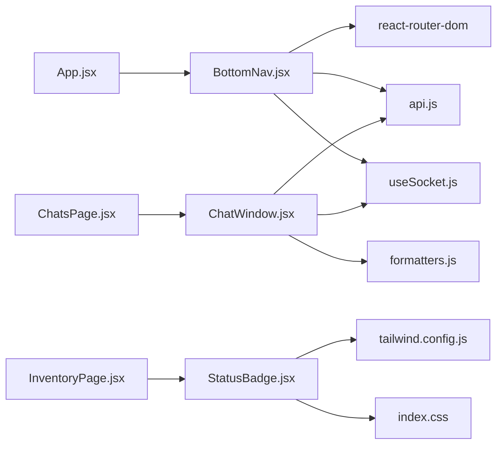

# UI Components

<cite>
**Referenced Files in This Document**
- [BottomNav.jsx](file://frontend/src/components/BottomNav.jsx)
- [ChatWindow.jsx](file://frontend/src/components/ChatWindow.jsx)
- [StatusBadge.jsx](file://frontend/src/components/StatusBadge.jsx)
- [App.jsx](file://frontend/src/App.jsx)
- [ChatsPage.jsx](file://frontend/src/pages/ChatsPage.jsx)
- [InventoryPage.jsx](file://frontend/src/pages/InventoryPage.jsx)
- [useSocket.js](file://frontend/src/hooks/useSocket.js)
- [api.js](file://frontend/src/utils/api.js)
- [formatters.js](file://frontend/src/utils/formatters.js)
- [tailwind.config.js](file://frontend/tailwind.config.js)
- [index.css](file://frontend/src/index.css)
</cite>

## Table of Contents
1. [Introduction](#introduction)
2. [Project Structure](#project-structure)
3. [Core Components](#core-components)
4. [Architecture Overview](#architecture-overview)
5. [Detailed Component Analysis](#detailed-component-analysis)
6. [Dependency Analysis](#dependency-analysis)
7. [Performance Considerations](#performance-considerations)
8. [Troubleshooting Guide](#troubleshooting-guide)
9. [Conclusion](#conclusion)

## Introduction
This document provides detailed, developer-friendly documentation for three reusable UI components used across the Nandibaag Bot frontend:
- BottomNav: Mobile-first bottom navigation with active route highlighting and a “More” menu.
- ChatWindow: Real-time chat interface with message rendering, input handling, optimistic mode toggling, and real-time updates via WebSockets.
- StatusBadge: Visual status indicator with color coding and multiple variants.

The guide covers component props interfaces, event handling patterns, styling approaches using TailwindCSS, composition strategies, usage examples, customization options, and integration guidelines.

## Project Structure
The components are located under the frontend source tree and integrate with shared utilities, hooks, and pages:
- Components: BottomNav, ChatWindow, StatusBadge
- Pages: ChatsPage (uses ChatWindow), InventoryPage (uses StatusBadge)
- App shell: ProtectedLayout wraps routes with BottomNav
- Utilities: API client, formatters, socket hook
- Styling: Tailwind configuration and global CSS

**Diagram sources**
- [App.jsx:31-41](file://frontend/src/App.jsx#L31-L41)
- [ChatsPage.jsx:308-312](file://frontend/src/pages/ChatsPage.jsx#L308-L312)
- [InventoryPage.jsx:325-326](file://frontend/src/pages/InventoryPage.jsx#L325-L326)
- [BottomNav.jsx:1-6](file://frontend/src/components/BottomNav.jsx#L1-L6)
- [ChatWindow.jsx:1-6](file://frontend/src/components/ChatWindow.jsx#L1-L6)
- [StatusBadge.jsx:1-2](file://frontend/src/components/StatusBadge.jsx#L1-L2)
- [useSocket.js:1-6](file://frontend/src/hooks/useSocket.js#L1-L6)
- [api.js:1-16](file://frontend/src/utils/api.js#L1-L16)
- [formatters.js:1-10](file://frontend/src/utils/formatters.js#L1-L10)
- [tailwind.config.js:1-17](file://frontend/tailwind.config.js#L1-L17)
- [index.css:1-12](file://frontend/src/index.css#L1-L12)

**Section sources**
- [App.jsx:31-41](file://frontend/src/App.jsx#L31-L41)
- [ChatsPage.jsx:308-312](file://frontend/src/pages/ChatsPage.jsx#L308-L312)
- [InventoryPage.jsx:325-326](file://frontend/src/pages/InventoryPage.jsx#L325-L326)
- [BottomNav.jsx:1-6](file://frontend/src/components/BottomNav.jsx#L1-L6)
- [ChatWindow.jsx:1-6](file://frontend/src/components/ChatWindow.jsx#L1-L6)
- [StatusBadge.jsx:1-2](file://frontend/src/components/StatusBadge.jsx#L1-L2)
- [useSocket.js:1-6](file://frontend/src/hooks/useSocket.js#L1-L6)
- [api.js:1-16](file://frontend/src/utils/api.js#L1-L16)
- [formatters.js:1-10](file://frontend/src/utils/formatters.js#L1-L10)
- [tailwind.config.js:1-17](file://frontend/tailwind.config.js#L1-L17)
- [index.css:1-12](file://frontend/src/index.css#L1-L12)

## Core Components
- BottomNav: Provides fixed bottom navigation for mobile, hides on login, highlights active routes, shows hot lead badge, and exposes a “More” dropdown menu.
- ChatWindow: Displays conversation history, supports sending messages, resets conversations, toggles AI/human mode optimistically, and listens to real-time events for new messages and mode changes.
- StatusBadge: Renders compact status labels or border indicators with consistent color semantics.

Key integration points:
- BottomNav integrates with routing, API stats, and socket events.
- ChatWindow integrates with sockets, API, and formatting utilities.
- StatusBadge is consumed by inventory-related pages.

**Section sources**
- [BottomNav.jsx:18-60](file://frontend/src/components/BottomNav.jsx#L18-L60)
- [ChatWindow.jsx:23-101](file://frontend/src/components/ChatWindow.jsx#L23-L101)
- [StatusBadge.jsx:30-42](file://frontend/src/components/StatusBadge.jsx#L30-L42)

## Architecture Overview
The UI layer composes these components within protected layouts and pages. The app shell injects BottomNav into all authenticated routes. ChatWindow is embedded in ChatsPage for desktop split-view and full-screen on mobile. StatusBadge appears in InventoryPage for room and series statuses.

**Diagram sources**
- [App.jsx:31-41](file://frontend/src/App.jsx#L31-L41)
- [ChatsPage.jsx:308-312](file://frontend/src/pages/ChatsPage.jsx#L308-L312)
- [ChatWindow.jsx:93-101](file://frontend/src/components/ChatWindow.jsx#L93-L101)
- [useSocket.js:13-46](file://frontend/src/hooks/useSocket.js#L13-L46)
- [api.js:18-34](file://frontend/src/utils/api.js#L18-L34)

## Detailed Component Analysis

### BottomNav
Responsibilities:
- Fixed bottom navigation bar for mobile
- Active route highlighting based on current path
- Hot lead count badge on Chats tab
- “More” menu with additional routes
- Hide on login page

Props: None (self-contained)

State and effects:
- Tracks hotLeadCount from dashboard stats API and refreshes periodically
- Subscribes to socket event for real-time hot_lead increments
- Hides when user is on login route

Navigation and active state:
- Uses NavLink for route-based active detection
- Highlights active items with WhatsApp theme colors and bold weight
- More menu toggles visibility and closes on backdrop click

Styling:
- Fixed positioning at bottom with z-index above content
- Uses Tailwind classes for layout, spacing, and colors
- Relies on custom WhatsApp palette defined in Tailwind config and CSS variables

Accessibility considerations:
- Uses semantic nav element
- Icons paired with text labels
- Keyboard navigable via standard link behavior

Integration:
- Consumed by ProtectedLayout to appear on all authenticated routes
- Integrates with api.js for stats and useSocket for live updates

Usage example:
- No direct import needed; it is rendered automatically by the app shell for protected routes.

Customization options:
- Add more primary nav items or moreMenuItems arrays
- Adjust badge threshold and interval timing
- Extend theme colors in tailwind.config.js and index.css

**Diagram sources**
- [BottomNav.jsx:24-41](file://frontend/src/components/BottomNav.jsx#L24-L41)
- [BottomNav.jsx:44-55](file://frontend/src/components/BottomNav.jsx#L44-L55)
- [BottomNav.jsx:64-95](file://frontend/src/components/BottomNav.jsx#L64-L95)
- [BottomNav.jsx:97-138](file://frontend/src/components/BottomNav.jsx#L97-L138)

**Section sources**
- [BottomNav.jsx:18-60](file://frontend/src/components/BottomNav.jsx#L18-L60)
- [BottomNav.jsx:64-142](file://frontend/src/components/BottomNav.jsx#L64-L142)
- [App.jsx:31-41](file://frontend/src/App.jsx#L31-L41)
- [tailwind.config.js:8-17](file://frontend/tailwind.config.js#L8-L17)
- [index.css:3-12](file://frontend/src/index.css#L3-L12)

### ChatWindow
Responsibilities:
- Display conversation messages with timestamps and sender indicators
- Handle user input and send messages
- Toggle between AI and human modes optimistically
- Reset conversation with confirmation modal
- Auto-scroll behavior and scroll-to-bottom indicator
- Real-time updates via socket events

Props:
- chat: object containing chat metadata and messages
- onClose: function to close the chat view
- onModeChange: callback to notify parent of mode changes

Event handling patterns:
- Optimistic mode toggle: immediately flips UI, sends API request, cancels superseded requests, reverts on failure
- Message sending: disables input while sending, clears input on success, scrolls to bottom
- Reset conversation: confirmation modal, API call, toast feedback

Real-time updates:
- Listens for new messages and per-chat/bulk mode updates
- Syncs local optimistic state with server truth and other tabs/devices

Styling:
- WhatsApp-themed header and bubbles
- Custom scrollbar and background pattern
- Responsive layout with mobile back button and desktop split view

Integration:
- Uses useSocket for real-time communication
- Uses api.js for HTTP requests
- Uses formatters for phone display and relative time

Usage example:
- Rendered inside ChatsPage with selected chat data and callbacks.

Customization options:
- Extend message types and system markers
- Customize mode toggle visuals and tooltips
- Adjust auto-scroll thresholds and debounce timings

**Diagram sources**
- [ChatsPage.jsx:308-312](file://frontend/src/pages/ChatsPage.jsx#L308-L312)
- [ChatWindow.jsx:93-101](file://frontend/src/components/ChatWindow.jsx#L93-L101)
- [ChatWindow.jsx:109-143](file://frontend/src/components/ChatWindow.jsx#L109-L143)
- [useSocket.js:13-46](file://frontend/src/hooks/useSocket.js#L13-L46)
- [api.js:18-34](file://frontend/src/utils/api.js#L18-L34)

**Section sources**
- [ChatWindow.jsx:23-101](file://frontend/src/components/ChatWindow.jsx#L23-L101)
- [ChatWindow.jsx:109-179](file://frontend/src/components/ChatWindow.jsx#L109-L179)
- [ChatWindow.jsx:197-446](file://frontend/src/components/ChatWindow.jsx#L197-L446)
- [ChatsPage.jsx:308-312](file://frontend/src/pages/ChatsPage.jsx#L308-L312)
- [formatters.js:8-26](file://frontend/src/utils/formatters.js#L8-L26)
- [formatters.js:35-68](file://frontend/src/utils/formatters.js#L35-L68)
- [index.css:14-38](file://frontend/src/index.css#L14-L38)

### StatusBadge
Responsibilities:
- Render a small status label or a left border indicator
- Provide consistent color semantics for different statuses
- Support size variants

Props:
- status: string key for status type (e.g., active, maintenance, wellness, deleted)
- variant: 'badge' | 'border'
- size: 'sm' | 'md' (when using the size-based implementation)

Color coding:
- active: green tones
- maintenance: amber tones
- wellness: blue tones
- deleted: gray tones

Accessibility:
- Semantic inline span with readable text
- High contrast text/background combinations
- Optional border variant for screen readers that rely on structural cues

Integration:
- Used in InventoryPage for series and room status displays

Usage example:
- <StatusBadge status={room.status} />
- <StatusBadge status={series.status} variant="border" />

Customization options:
- Add new statuses to the configuration map
- Extend size variants or add outline/filled variants
- Override Tailwind classes for brand-specific palettes

**Diagram sources**
- [StatusBadge.jsx:3-28](file://frontend/src/components/StatusBadge.jsx#L3-L28)
- [StatusBadge.jsx:30-42](file://frontend/src/components/StatusBadge.jsx#L30-L42)
- [StatusBadge.jsx:64-73](file://frontend/src/components/StatusBadge.jsx#L64-L73)

**Section sources**
- [StatusBadge.jsx:30-42](file://frontend/src/components/StatusBadge.jsx#L30-L42)
- [StatusBadge.jsx:64-73](file://frontend/src/components/StatusBadge.jsx#L64-L73)
- [InventoryPage.jsx:325-326](file://frontend/src/pages/InventoryPage.jsx#L325-L326)
- [InventoryPage.jsx:383-384](file://frontend/src/pages/InventoryPage.jsx#L383-L384)

## Dependency Analysis
Component-level dependencies:
- BottomNav depends on React Router, API client, and socket hook
- ChatWindow depends on socket hook, API client, and formatters
- StatusBadge has no runtime dependencies beyond React and Tailwind classes

Cross-cutting concerns:
- Authentication token injection via API interceptors
- Global theme and fonts via Tailwind config and CSS variables
- Real-time synchronization via socket hook

**Diagram sources**
- [BottomNav.jsx:1-6](file://frontend/src/components/BottomNav.jsx#L1-L6)
- [ChatWindow.jsx:1-6](file://frontend/src/components/ChatWindow.jsx#L1-L6)
- [StatusBadge.jsx:1-2](file://frontend/src/components/StatusBadge.jsx#L1-L2)
- [App.jsx:10-11](file://frontend/src/App.jsx#L10-L11)
- [ChatsPage.jsx:7](file://frontend/src/pages/ChatsPage.jsx#L7)
- [InventoryPage.jsx:4](file://frontend/src/pages/InventoryPage.jsx#L4)
- [tailwind.config.js:1-17](file://frontend/tailwind.config.js#L1-L17)
- [index.css:1-12](file://frontend/src/index.css#L1-L12)

**Section sources**
- [BottomNav.jsx:1-6](file://frontend/src/components/BottomNav.jsx#L1-L6)
- [ChatWindow.jsx:1-6](file://frontend/src/components/ChatWindow.jsx#L1-L6)
- [StatusBadge.jsx:1-2](file://frontend/src/components/StatusBadge.jsx#L1-L2)
- [App.jsx:10-11](file://frontend/src/App.jsx#L10-L11)
- [ChatsPage.jsx:7](file://frontend/src/pages/ChatsPage.jsx#L7)
- [InventoryPage.jsx:4](file://frontend/src/pages/InventoryPage.jsx#L4)
- [tailwind.config.js:1-17](file://frontend/tailwind.config.js#L1-L17)
- [index.css:1-12](file://frontend/src/index.css#L1-L12)

## Performance Considerations
- BottomNav:
  - Periodic polling for stats every 30 seconds; consider debouncing or switching to socket-driven updates if available.
  - Avoid unnecessary re-renders by memoizing icon components and static arrays.
- ChatWindow:
  - Optimistic mode toggle reduces perceived latency; ensure error paths revert state promptly.
  - Use refs for scroll targets to avoid layout thrashing.
  - Debounce heavy operations if adding rich media or long message lists.
- StatusBadge:
  - Stateless and lightweight; minimal performance impact.

[No sources needed since this section provides general guidance]

## Troubleshooting Guide
Common issues and resolutions:
- BottomNav not visible:
  - Ensure you are on a protected route; BottomNav hides on /login.
  - Verify ProtectedLayout renders BottomNav and applies bottom padding to main content.
- Hot lead badge not updating:
  - Confirm socket connection and event subscription for 'hot_lead'.
  - Check API endpoint for stats availability and network errors.
- ChatWindow not receiving real-time updates:
  - Validate socket connection and event names match backend emissions.
  - Ensure chat._id is present before subscribing.
- Mode toggle reverts unexpectedly:
  - Inspect API response and error handling; check for canceled requests overriding latest intent.
- StatusBadge incorrect colors:
  - Verify status value matches configured keys.
  - Check Tailwind theme and CSS variables for overrides.

**Section sources**
- [BottomNav.jsx:24-41](file://frontend/src/components/BottomNav.jsx#L24-L41)
- [BottomNav.jsx:44-55](file://frontend/src/components/BottomNav.jsx#L44-L55)
- [ChatWindow.jsx:93-101](file://frontend/src/components/ChatWindow.jsx#L93-L101)
- [ChatWindow.jsx:109-143](file://frontend/src/components/ChatWindow.jsx#L109-L143)
- [api.js:36-54](file://frontend/src/utils/api.js#L36-L54)
- [useSocket.js:17-43](file://frontend/src/hooks/useSocket.js#L17-L43)

## Conclusion
These three components provide foundational UI primitives for navigation, messaging, and status indication. They follow consistent patterns for state management, real-time updates, and styling with TailwindCSS. By adhering to the documented props, event contracts, and integration points, developers can compose robust features across the application while maintaining accessibility and responsive behavior.