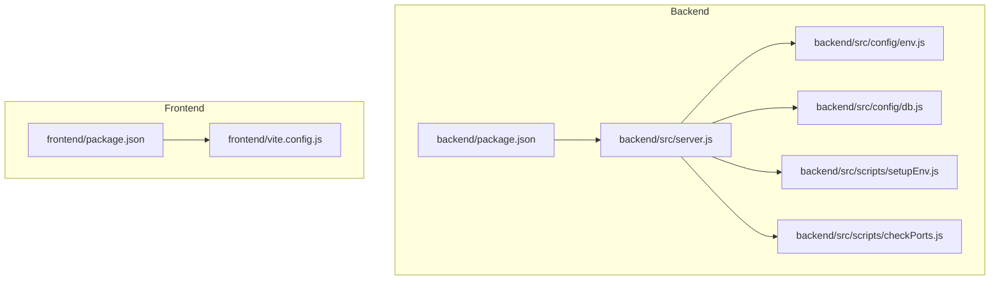
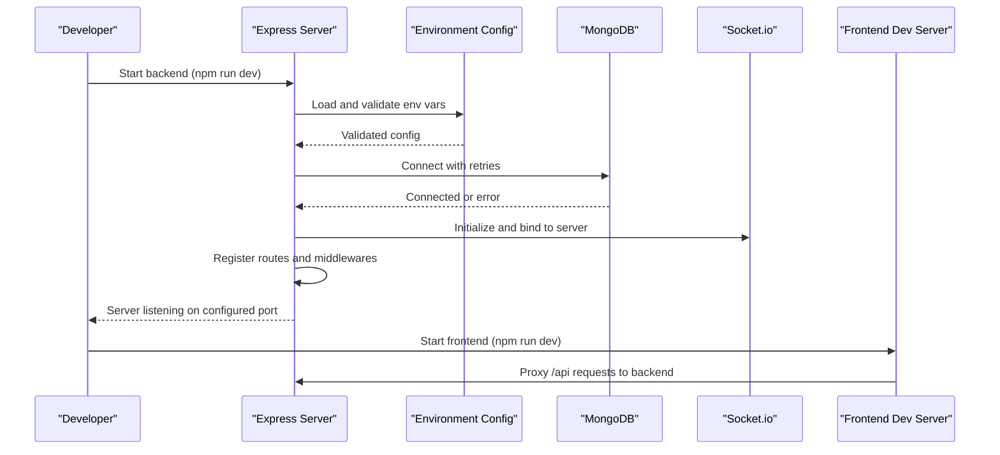
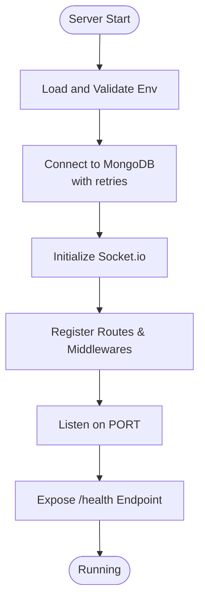
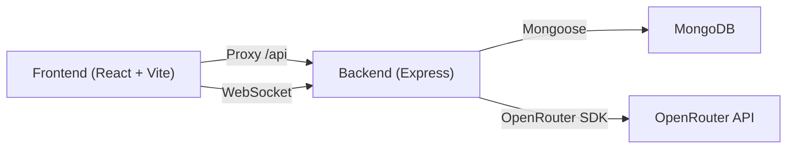

# Getting Started

<cite>
**Referenced Files in This Document**
- [README.md](file://README.md)
- [backend/package.json](file://backend/package.json)
- [frontend/package.json](file://frontend/package.json)
- [backend/src/server.js](file://backend/src/server.js)
- [backend/src/config/env.js](file://backend/src/config/env.js)
- [backend/src/config/db.js](file://backend/src/config/db.js)
- [backend/src/scripts/setupEnv.js](file://backend/src/scripts/setupEnv.js)
- [backend/src/scripts/checkPorts.js](file://backend/src/scripts/checkPorts.js)
- [frontend/vite.config.js](file://frontend/vite.config.js)
</cite>

## Table of Contents
1. Introduction
2. Project Structure
3. Core Components
4. Architecture Overview
5. Detailed Component Analysis
6. Dependency Analysis
7. Performance Considerations
8. Troubleshooting Guide
9. Conclusion

## Introduction
Nandibaag Bot is a full-stack WhatsApp bot for Nandibaag Resort management with AI-powered customer service and a real-time monitoring dashboard. The backend runs on Node.js/Express with MongoDB, Socket.io, and OpenRouter-based AI services. The frontend is a React + Vite application that provides an interactive dashboard and real-time updates.

This guide helps you set up both the backend and frontend locally for development, configure environment variables, install dependencies, and start the servers. It also includes troubleshooting tips for common setup issues such as port conflicts, database connection problems, and API key validation errors.

## Project Structure
The repository is organized into two main parts:
- backend: Express server, models, routes, services, configuration, and scripts
- frontend: React app built with Vite, TailwindCSS, and PWA support

**Diagram sources**
- [backend/package.json:1-46](file://backend/package.json#L1-L46)
- [backend/src/server.js:1-239](file://backend/src/server.js#L1-L239)
- [backend/src/config/env.js:1-95](file://backend/src/config/env.js#L1-L95)
- [backend/src/config/db.js:1-40](file://backend/src/config/db.js#L1-L40)
- [backend/src/scripts/setupEnv.js:1-192](file://backend/src/scripts/setupEnv.js#L1-L192)
- [backend/src/scripts/checkPorts.js:1-226](file://backend/src/scripts/checkPorts.js#L1-L226)
- [frontend/package.json:1-28](file://frontend/package.json#L1-L28)
- [frontend/vite.config.js:1-63](file://frontend/vite.config.js#L1-L63)

**Section sources**
- [README.md:27-63](file://README.md#L27-L63)

## Core Components
- Backend entry point initializes Express, middleware (security, CORS, compression, logging), rate limiting, health check, routes, Socket.io, and graceful shutdown.
- Environment validation ensures required variables are present at startup.
- Database connection uses Mongoose with retry logic and error handling.
- Setup script creates .env files for backend and frontend interactively.
- Port checker detects conflicts and suggests fixes.
- Frontend dev server proxies API calls to the backend and serves the UI.

Key commands:
- Backend development: npm run dev
- Frontend development: npm run dev

**Section sources**
- [backend/src/server.js:1-239](file://backend/src/server.js#L1-L239)
- [backend/src/config/env.js:1-95](file://backend/src/config/env.js#L1-L95)
- [backend/src/config/db.js:1-40](file://backend/src/config/db.js#L1-L40)
- [backend/src/scripts/setupEnv.js:1-192](file://backend/src/scripts/setupEnv.js#L1-L192)
- [backend/src/scripts/checkPorts.js:1-226](file://backend/src/scripts/checkPorts.js#L1-L226)
- [frontend/vite.config.js:51-62](file://frontend/vite.config.js#L51-L62)
- [backend/package.json:6-14](file://backend/package.json#L6-L14)
- [frontend/package.json:6-10](file://frontend/package.json#L6-L10)

## Architecture Overview
High-level flow during startup:
- Load environment variables and validate them
- Connect to MongoDB with retries
- Initialize Socket.io and register services
- Start HTTP server and expose API routes
- Health endpoint reports status including MongoDB connectivity and active WhatsApp sessions

**Diagram sources**
- [backend/src/server.js:108-172](file://backend/src/server.js#L108-L172)
- [backend/src/config/env.js:48-54](file://backend/src/config/env.js#L48-L54)
- [backend/src/config/db.js:10-29](file://backend/src/config/db.js#L10-L29)
- [frontend/vite.config.js:55-60](file://frontend/vite.config.js#L55-L60)

## Detailed Component Analysis

### Prerequisites
- Node.js v18 or higher
- MongoDB (local or cloud instance)
- OpenRouter API key

These prerequisites are documented in the project README.

**Section sources**
- [README.md:67-71](file://README.md#L67-L71)

### Installation Steps

#### Backend
1. Navigate to the backend directory.
2. Install dependencies using the package manager.
3. Create or generate the .env file:
   - Option A: Use the interactive setup script to create backend/.env and frontend/.env.
   - Option B: Copy from example if available and fill in values manually.
4. Configure environment variables (see next section).
5. Start the development server.

Commands:
- cd backend
- npm install
- npm run setup (interactive)
- npm run dev

Notes:
- The default backend port is defined in environment configuration.
- The setup script writes both backend/.env and frontend/.env.

**Section sources**
- [backend/package.json:6-14](file://backend/package.json#L6-L14)
- [backend/src/scripts/setupEnv.js:46-192](file://backend/src/scripts/setupEnv.js#L46-L192)
- [backend/src/config/env.js:12-13](file://backend/src/config/env.js#L12-L13)

#### Frontend
1. Navigate to the frontend directory.
2. Install dependencies.
3. Start the development server.

Commands:
- cd frontend
- npm install
- npm run dev

Notes:
- The frontend dev server defaults to a specific port and proxies API calls to the backend.

**Section sources**
- [frontend/package.json:6-10](file://frontend/package.json#L6-L10)
- [frontend/vite.config.js:51-62](file://frontend/vite.config.js#L51-L62)

### Environment Variables Configuration

Required and optional variables are validated at startup. The following keys are used by the backend:

- Required
  - MONGO_URI: MongoDB connection URI
  - JWT_SECRET: Secret key for JWT token signing
  - JWT_EXPIRES_IN: JWT token expiration time (e.g., "7d")
  - OPENROUTER_API_KEY: OpenRouter API key for AI calls
  - OPENROUTER_MODEL_PRIMARY: Primary OpenRouter model to use
  - PORT: Server port (default provided)
  - NODE_ENV: Environment (development, production, test)
  - RESORT_CONTACT_1, RESORT_CONTACT_2, RESORT_CONTACT_3: Resort contact numbers
  - ADMIN_DEFAULT_EMAIL: Default admin email
  - ADMIN_DEFAULT_PASSWORD: Default admin password
  - FRONTEND_URL: Frontend application URL (used for CORS)

- Optional
  - GEMINI_API_KEY, GEMINI_MODEL: Google Gemini settings
  - GROQ_API_KEY, GROQ_MODEL, GROQ_BASE_URL: Groq settings
  - CLOUDFLARE_ACCOUNT_ID, CLOUDFLARE_API_TOKEN, CLOUDFLARE_MODEL: Cloudflare Workers AI settings
  - CEREBRAS_API_KEY, CEREBRAS_MODEL: Cerebras settings
  - AI_TEST_MODE, OLLAMA_BASE_URL, OLLAMA_MODEL: Local testing mode (dev only)

Frontend variables (generated by setup script):
- VITE_API_URL: Base URL for API calls
- VITE_SOCKET_URL: WebSocket server URL

How to set them:
- Interactive setup: Run the setup script to be prompted for values and have .env files created automatically.
- Manual setup: Create backend/.env and frontend/.env and add the variables above.

Validation behavior:
- On startup, environment variables are validated; missing required variables cause the process to exit with details.

**Section sources**
- [backend/src/config/env.js:4-54](file://backend/src/config/env.js#L4-L54)
- [backend/src/config/env.js:56-94](file://backend/src/config/env.js#L56-L94)
- [backend/src/scripts/setupEnv.js:82-117](file://backend/src/scripts/setupEnv.js#L82-L117)
- [backend/src/scripts/setupEnv.js:114-117](file://backend/src/scripts/setupEnv.js#L114-L117)

### Startup Flow and Initialization
- The server loads configuration, connects to MongoDB with retries, initializes Socket.io, registers routes, and starts listening.
- A health endpoint exposes runtime status including MongoDB connectivity and active WhatsApp sessions.
- Graceful shutdown handles session cleanup and server/MongoDB disconnection.

**Diagram sources**
- [backend/src/server.js:108-172](file://backend/src/server.js#L108-L172)
- [backend/src/config/db.js:10-29](file://backend/src/config/db.js#L10-L29)

**Section sources**
- [backend/src/server.js:108-172](file://backend/src/server.js#L108-L172)
- [backend/src/config/db.js:10-29](file://backend/src/config/db.js#L10-L29)

## Dependency Analysis
- Backend depends on Express, Mongoose, Socket.io, OpenAI SDK (via OpenRouter), Winston, and other utilities.
- Frontend depends on React, Vite, TailwindCSS, Axios, and Socket.io client.
- The frontend dev server proxies API requests to the backend to avoid CORS issues during development.

**Diagram sources**
- [frontend/vite.config.js:55-60](file://frontend/vite.config.js#L55-L60)
- [backend/package.json:22-41](file://backend/package.json#L22-L41)
- [frontend/package.json:11-19](file://frontend/package.json#L11-L19)

**Section sources**
- [backend/package.json:22-41](file://backend/package.json#L22-L41)
- [frontend/package.json:11-19](file://frontend/package.json#L11-L19)
- [frontend/vite.config.js:55-60](file://frontend/vite.config.js#L55-L60)

## Performance Considerations
- Compression middleware is enabled to reduce payload sizes.
- Rate limiting is applied to general API endpoints and authentication routes.
- MongoDB connection includes retry logic to improve resilience during transient failures.
- Frontend dev server uses strictPort false to auto-increment if the default port is busy.

[No sources needed since this section provides general guidance]

## Troubleshooting Guide

Common issues and resolutions:

- Port conflicts
  - Symptom: Server fails to start due to EADDRINUSE.
  - Resolution:
    - Use the port checker script to identify processes using the configured ports and follow its instructions to free them.
    - Alternatively, change the PORT variable in backend/.env and ensure frontend URLs match.
  - References:
    - Error handling for port conflicts in server startup.
    - Port checking utility reads backend/.env and frontend/.env to report usage.

- MongoDB connection problems
  - Symptom: Connection errors or repeated retries.
  - Resolution:
    - Verify MONGO_URI is correct and accessible.
    - Check network/firewall rules and credentials for cloud instances.
    - Review logs for retry attempts and final failure messages.
  - References:
    - Connection logic with retries and error logging.

- API key validation errors
  - Symptom: Server exits immediately with environment validation errors.
  - Resolution:
    - Ensure all required variables are present and correctly formatted.
    - Confirm OPENROUTER_API_KEY is valid and corresponds to an active account.
    - Re-run the setup script to regenerate .env files with prompts.
  - References:
    - Environment schema validation and exit on error.

- Frontend cannot reach backend
  - Symptom: API calls fail or CORS errors.
  - Resolution:
    - Ensure VITE_API_URL points to the backend base path (/api).
    - Verify frontend dev server proxy configuration targets the correct backend port.
    - Confirm CORS origin matches the frontend URL.
  - References:
    - Frontend proxy configuration.
    - Backend CORS configuration using FRONTEND_URL.

Useful commands:
- Check ports: npm run check-ports (from backend)
- Generate .env files: npm run setup (from backend)
- Start backend: npm run dev
- Start frontend: npm run dev

**Section sources**
- [backend/src/server.js:157-166](file://backend/src/server.js#L157-L166)
- [backend/src/scripts/checkPorts.js:122-220](file://backend/src/scripts/checkPorts.js#L122-L220)
- [backend/src/config/db.js:10-29](file://backend/src/config/db.js#L10-L29)
- [backend/src/config/env.js:48-54](file://backend/src/config/env.js#L48-L54)
- [frontend/vite.config.js:55-60](file://frontend/vite.config.js#L55-L60)

## Conclusion
You now have the essential steps to set up and run Nandibaag Bot locally. After installing dependencies and configuring environment variables, start the backend and frontend development servers. Use the included scripts to assist with environment setup and port conflict resolution. For production, refer to the deployment notes in the README and adjust environment variables accordingly.

[No sources needed since this section summarizes without analyzing specific files]