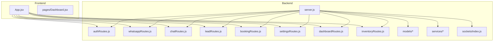
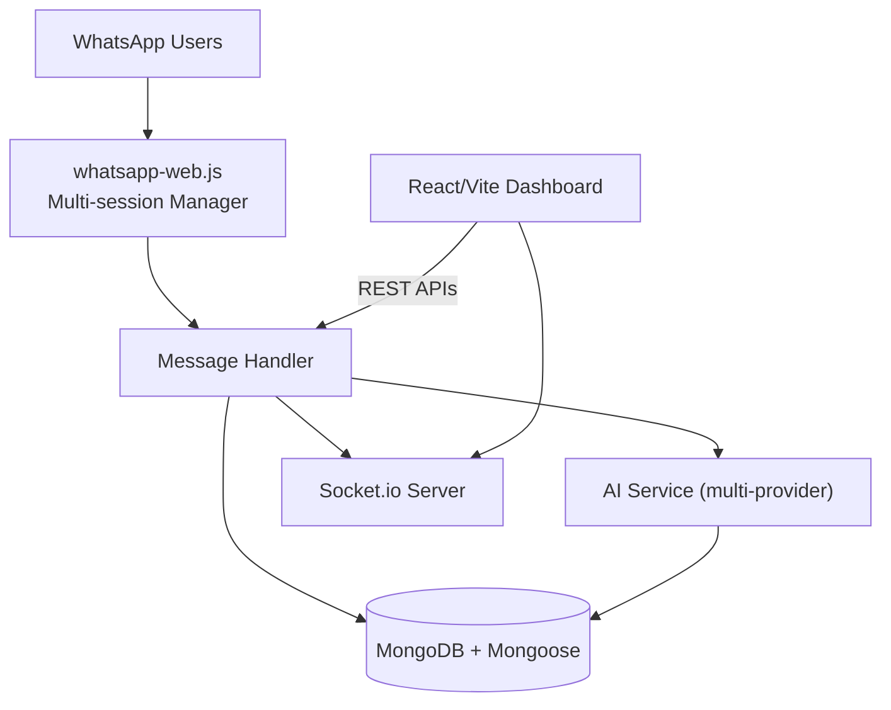
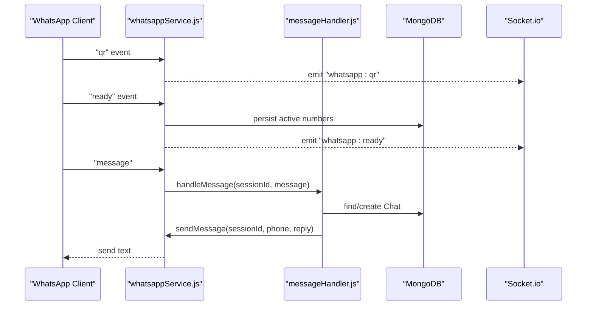
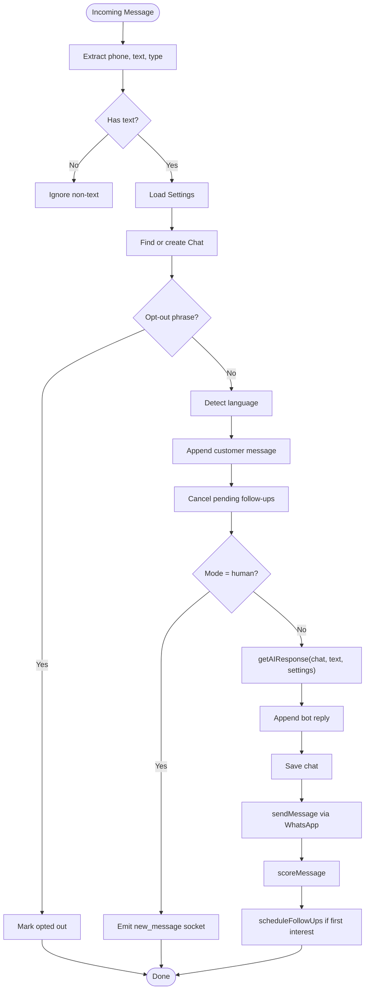
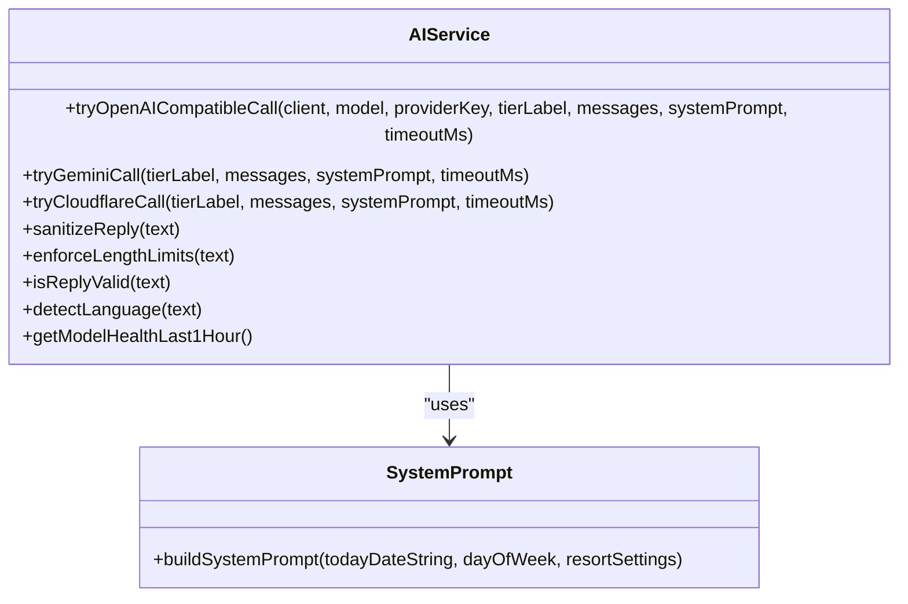
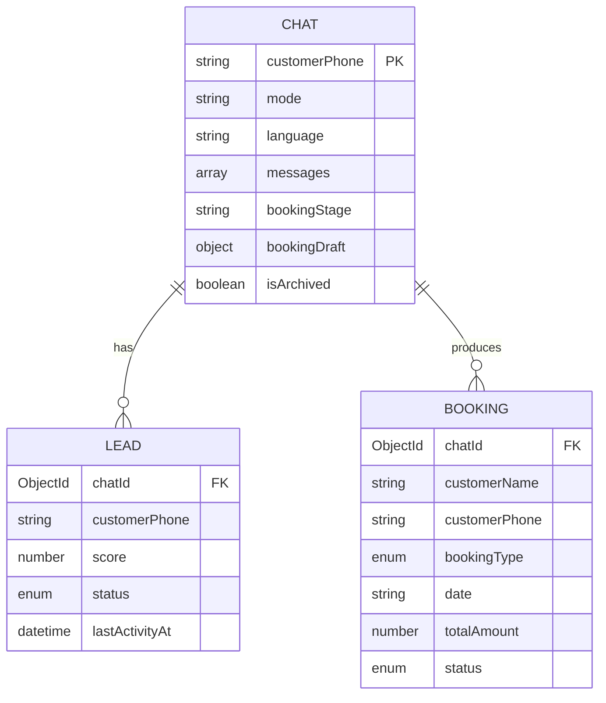
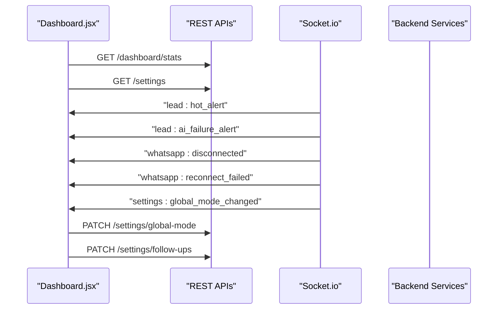
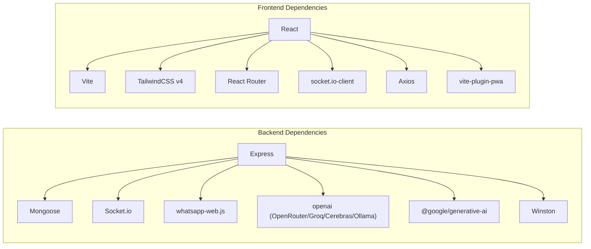

# Project Overview

<cite>
**Referenced Files in This Document**
- [README.md](file://README.md)
- [backend/package.json](file://backend/package.json)
- [frontend/package.json](file://frontend/package.json)
- [server.js](file://backend/src/server.js)
- [aiService.js](file://backend/src/services/aiService.js)
- [whatsappService.js](file://backend/src/services/whatsappService.js)
- [messageHandler.js](file://backend/src/services/messageHandler.js)
- [systemPrompt.js](file://backend/src/services/systemPrompt.js)
- [Chat.js](file://backend/src/models/Chat.js)
- [Lead.js](file://backend/src/models/Lead.js)
- [Booking.js](file://backend/src/models/Booking.js)
- [index.js (sockets)](file://backend/src/sockets/index.js)
- [App.jsx](file://frontend/src/App.jsx)
- [Dashboard.jsx](file://frontend/src/pages/Dashboard.jsx)
</cite>

## Table of Contents
1. Introduction
2. Project Structure
3. Core Components
4. Architecture Overview
5. Detailed Component Analysis
6. Dependency Analysis
7. Performance Considerations
8. Troubleshooting Guide
9. Conclusion

## Introduction
Nandibaag Bot is a full-stack WhatsApp automation system designed for resort management at Nandibaag Resort, Karjat. It provides AI-powered customer service and a real-time monitoring dashboard to streamline inquiries, lead capture, booking automation, and follow-ups. The system integrates multiple AI providers through a unified interface, supports multi-session WhatsApp connections, and exposes a React/Vite-based admin dashboard with live alerts and controls.

Key capabilities:
- Multi-provider AI integration (OpenRouter/OpenAI-compatible, Gemini, Cloudflare Workers AI, Groq, Cerebras, local Ollama)
- Real-time WhatsApp messaging via whatsapp-web.js with session persistence and auto-reconnect
- Lead scoring and follow-up scheduling
- Booking automation with structured conversation flow and pricing rules
- Live dashboard with WebSocket-driven notifications and settings control

Practical examples:
- A guest messages “Group stay weekend” on WhatsApp; the bot detects intent, collects date and guest count, quotes price, captures name/phone, and schedules follow-ups if needed.
- Staff toggle global mode from AI to Human on the dashboard; all chats switch to manual handling until reverted.
- When an AI provider fails or returns invalid output, the system logs diagnostics and notifies staff in real time.

**Section sources**
- [README.md:1-26](file://README.md#L1-L26)
- [README.md:145-153](file://README.md#L145-L153)

## Project Structure
The repository is organized into backend and frontend layers:
- Backend (Node.js/Express): API routes, services, models, middleware, sockets, scripts, and configuration
- Frontend (React/Vite): Pages, components, context, hooks, utilities, and build/PWA config

**Diagram sources**
- [server.js:23-31](file://backend/src/server.js#L23-L31)
- [App.jsx:46-96](file://frontend/src/App.jsx#L46-L96)

**Section sources**
- [README.md:27-63](file://README.md#L27-L63)
- [server.js:33-98](file://backend/src/server.js#L33-L98)
- [App.jsx:43-100](file://frontend/src/App.jsx#L43-L100)

## Core Components
- WhatsApp Session Manager: Manages multiple sessions per resort number, QR/pairing auth, auto-reconnect, message queuing, and health checks.
- Message Handler: Routes incoming messages, persists chat history, applies mode (AI/Human), triggers AI response, lead scoring, and follow-up scheduling.
- AI Service: Unified adapter across multiple providers with sanitization, validation, caching, and metrics.
- Models: Chat, Lead, Booking, Settings, Room, etc., define data structures and indexes.
- Sockets: Authenticated Socket.io server for real-time dashboard updates.
- Dashboard UI: Displays stats, alerts, global mode toggles, and follow-up status.

**Section sources**
- [whatsappService.js:20-48](file://backend/src/services/whatsappService.js#L20-L48)
- [messageHandler.js:8-21](file://backend/src/services/messageHandler.js#L8-L21)
- [aiService.js:14-19](file://backend/src/services/aiService.js#L14-L19)
- [Chat.js:45-97](file://backend/src/models/Chat.js#L45-L97)
- [Lead.js:12-46](file://backend/src/models/Lead.js#L12-L46)
- [Booking.js:8-60](file://backend/src/models/Booking.js#L8-L60)
- [index.js (sockets):18-63](file://backend/src/sockets/index.js#L18-L63)
- [Dashboard.jsx:25-80](file://frontend/src/pages/Dashboard.jsx#L25-L80)

## Architecture Overview
High-level architecture showing how backend and frontend collaborate:

**Diagram sources**
- [whatsappService.js:258-290](file://backend/src/services/whatsappService.js#L258-L290)
- [messageHandler.js:22-178](file://backend/src/services/messageHandler.js#L22-L178)
- [aiService.js:640-727](file://backend/src/services/aiService.js#L640-L727)
- [index.js (sockets):18-63](file://backend/src/sockets/index.js#L18-L63)
- [server.js:100-106](file://backend/src/server.js#L100-L106)

## Detailed Component Analysis

### WhatsApp Session Management
- Multi-session architecture with LocalAuth persistence per session folder
- Event-driven lifecycle: qr → authenticated → ready → disconnected
- Auto-reconnect with exponential backoff and per-chat message queue locks
- Health check cron and graceful shutdown

**Diagram sources**
- [whatsappService.js:152-194](file://backend/src/services/whatsappService.js#L152-L194)
- [whatsappService.js:258-290](file://backend/src/services/whatsappService.js#L258-L290)
- [whatsappService.js:466-508](file://backend/src/services/whatsappService.js#L466-L508)
- [messageHandler.js:22-178](file://backend/src/services/messageHandler.js#L22-L178)

**Section sources**
- [whatsappService.js:107-147](file://backend/src/services/whatsappService.js#L107-L147)
- [whatsappService.js:333-363](file://backend/src/services/whatsappService.js#L333-L363)
- [whatsappService.js:601-612](file://backend/src/services/whatsappService.js#L601-L612)

### Message Handling and Conversation Flow
- Detects opt-out phrases, language, and mode (AI/Human)
- Persists messages, cancels pending follow-ups when customer replies
- In AI mode, generates response via AI service, scores lead, schedules follow-ups

**Diagram sources**
- [messageHandler.js:22-178](file://backend/src/services/messageHandler.js#L22-L178)

**Section sources**
- [messageHandler.js:22-178](file://backend/src/services/messageHandler.js#L22-L178)

### AI Service and Provider Integration
- Unified adapters for OpenRouter/OpenAI-compatible, Gemini, Cloudflare Workers AI, Groq, Cerebras, and local Ollama
- Response sanitization, length enforcement, and strict validation
- Per-provider metrics and hourly reset snapshots
- Optional FAQ cache keyed by last message + booking stage

**Diagram sources**
- [aiService.js:649-727](file://backend/src/services/aiService.js#L649-L727)
- [aiService.js:734-774](file://backend/src/services/aiService.js#L734-L774)
- [aiService.js:781-800](file://backend/src/services/aiService.js#L781-L800)
- [aiService.js:213-289](file://backend/src/services/aiService.js#L213-L289)
- [aiService.js:477-546](file://backend/src/services/aiService.js#L477-L546)
- [aiService.js:594-637](file://backend/src/services/aiService.js#L594-L637)
- [systemPrompt.js:9-90](file://backend/src/services/systemPrompt.js#L9-L90)

**Section sources**
- [aiService.js:14-19](file://backend/src/services/aiService.js#L14-L19)
- [aiService.js:200-208](file://backend/src/services/aiService.js#L200-L208)
- [aiService.js:402-471](file://backend/src/services/aiService.js#L402-L471)
- [systemPrompt.js:9-90](file://backend/src/services/systemPrompt.js#L9-L90)

### Data Models
- Chat: Tracks conversation state, messages, booking draft, language, and archival
- Lead: Scores and tracks conversion funnel stages
- Booking: Stores finalized bookings with pricing breakdown and status

**Diagram sources**
- [Chat.js:45-97](file://backend/src/models/Chat.js#L45-L97)
- [Lead.js:12-46](file://backend/src/models/Lead.js#L12-L46)
- [Booking.js:8-60](file://backend/src/models/Booking.js#L8-L60)

**Section sources**
- [Chat.js:45-97](file://backend/src/models/Chat.js#L45-L97)
- [Lead.js:12-46](file://backend/src/models/Lead.js#L12-L46)
- [Booking.js:8-60](file://backend/src/models/Booking.js#L8-L60)

### Real-Time Dashboard and Controls
- Protected routes and layout with bottom navigation
- Stats polling and settings fetch
- WebSocket listeners for hot leads, AI failures, WhatsApp disconnects, reconnect failures, and global mode changes
- Admin-only toggles for global mode and follow-ups

**Diagram sources**
- [Dashboard.jsx:42-80](file://frontend/src/pages/Dashboard.jsx#L42-L80)
- [Dashboard.jsx:83-176](file://frontend/src/pages/Dashboard.jsx#L83-L176)
- [Dashboard.jsx:178-200](file://frontend/src/pages/Dashboard.jsx#L178-L200)
- [index.js (sockets):18-63](file://backend/src/sockets/index.js#L18-L63)

**Section sources**
- [App.jsx:46-96](file://frontend/src/App.jsx#L46-L96)
- [Dashboard.jsx:25-80](file://frontend/src/pages/Dashboard.jsx#L25-L80)
- [Dashboard.jsx:83-176](file://frontend/src/pages/Dashboard.jsx#L83-L176)

## Dependency Analysis
Technology stack summary:
- Backend: Node.js, Express, MongoDB + Mongoose, Socket.io, whatsapp-web.js, OpenAI SDK (OpenRouter), @google/generative-ai, openai (Groq/Cerebras/Ollama), Winston, PM2
- Frontend: React, Vite, TailwindCSS v4, React Router, Socket.io Client, Axios, Lucide React, vite-plugin-pwa

**Diagram sources**
- [backend/package.json:22-41](file://backend/package.json#L22-L41)
- [frontend/package.json:11-26](file://frontend/package.json#L11-L26)

**Section sources**
- [backend/package.json:1-46](file://backend/package.json#L1-L46)
- [frontend/package.json:1-28](file://frontend/package.json#L1-L28)
- [README.md:5-26](file://README.md#L5-L26)

## Performance Considerations
- AI response caching for FAQ-type queries reduces provider calls while ensuring dynamic booking queries remain fresh
- Length limits and sentence-boundary trimming keep responses concise and readable on WhatsApp
- Per-chat message queue prevents race conditions during concurrent updates
- Exponential backoff minimizes load during reconnection attempts
- Hourly provider metrics help identify slow or failing endpoints

[No sources needed since this section provides general guidance]

## Troubleshooting Guide
Common issues and indicators:
- WhatsApp session unlink/disconnect: Dashboard emits disconnect/reconnect_failed events; verify QR pairing or pairing code flow
- AI failure alerts: Hot lead and AI failure alerts surface on dashboard; review logs and provider health metrics
- Port conflicts: Startup error indicates EADDRINUSE; use provided script to free ports or change PORT
- Stale Puppeteer locks: Session lock cleanup prevents browser-in-use errors after abrupt restarts

Operational tips:
- Use health endpoint to confirm server, MongoDB connectivity, and active WhatsApp sessions
- Monitor dashboard alerts and stats refresh intervals
- Ensure environment variables are configured before startup

**Section sources**
- [Dashboard.jsx:132-156](file://frontend/src/pages/Dashboard.jsx#L132-L156)
- [server.js:157-166](file://backend/src/server.js#L157-L166)
- [whatsappService.js:212-256](file://backend/src/services/whatsappService.js#L212-L256)
- [whatsappService.js:76-92](file://backend/src/services/whatsappService.js#L76-L92)

## Conclusion
Nandibaag Bot delivers a robust, production-ready WhatsApp automation platform tailored for resort operations. Its multi-provider AI layer, resilient WhatsApp session management, structured booking flow, and real-time dashboard provide comprehensive coverage for customer engagement and operational oversight. The modular architecture and clear separation of concerns make it maintainable and extensible for future enhancements.

[No sources needed since this section summarizes without analyzing specific files]