# Backend Architecture

<cite>
**Referenced Files in This Document**
- [server.js](file://backend/src/server.js)
- [package.json](file://backend/package.json)
- [ecosystem.config.js](file://backend/ecosystem.config.js)
- [db.js](file://backend/src/config/db.js)
- [env.js](file://backend/src/config/env.js)
- [logger.js](file://backend/src/config/logger.js)
- [auth.js](file://backend/src/middleware/auth.js)
- [errorHandler.js](file://backend/src/middleware/errorHandler.js)
- [rateLimiter.js](file://backend/src/middleware/rateLimiter.js)
- [index.js](file://backend/src/sockets/index.js)
- [aiService.js](file://backend/src/services/aiService.js)
- [whatsappService.js](file://backend/src/services/whatsappService.js)
- [messageHandler.js](file://backend/src/services/messageHandler.js)
- [systemPrompt.js](file://backend/src/services/systemPrompt.js)
- [authRoutes.js](file://backend/src/routes/authRoutes.js)
- [whatsappRoutes.js](file://backend/src/routes/whatsappRoutes.js)
- [User.js](file://backend/src/models/User.js)
- [Chat.js](file://backend/src/models/Chat.js)
</cite>

## Table of Contents
1. Introduction
2. Project Structure
3. Core Components
4. Architecture Overview
5. Detailed Component Analysis
6. Dependency Analysis
7. Performance Considerations
8. Troubleshooting Guide
9. Conclusion

## Introduction
This document describes the backend architecture for a WhatsApp-integrated resort booking assistant. It covers the Express.js server setup, modular middleware pipeline, service layer pattern, route organization, session management with whatsapp-web.js, multi-provider AI integration strategy, Socket.io real-time communication, database connection handling, error management patterns, process-level handlers, security middleware (helmet, CORS, rate limiting), logging configuration, graceful shutdown procedures, and scalability considerations.

## Project Structure
The backend is organized by feature and responsibility:
- Entry point and application bootstrap
- Configuration (environment validation, DB connection, logging)
- Middleware (authentication, rate limiting, global error handler)
- Routes (REST endpoints grouped by domain)
- Services (WhatsApp sessions, message routing, AI orchestration, follow-ups, lead scoring)
- Sockets (Socket.io initialization and authentication)
- Models (Mongoose schemas for users, chats, etc.)

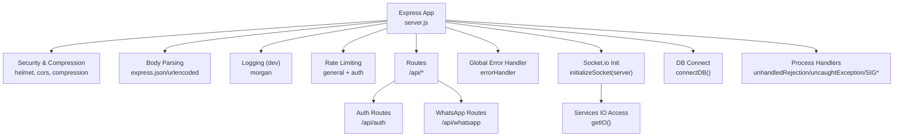

**Diagram sources**
- [server.js:34-108](file://backend/src/server.js#L34-L108)
- [errorHandler.js:1-36](file://backend/src/middleware/errorHandler.js#L1-L36)
- [rateLimiter.js:1-37](file://backend/src/middleware/rateLimiter.js#L1-L37)
- [index.js:1-82](file://backend/src/sockets/index.js#L1-L82)
- [db.js:1-40](file://backend/src/config/db.js#L1-L40)

**Section sources**
- [server.js:1-241](file://backend/src/server.js#L1-L241)
- [package.json:1-47](file://backend/package.json#L1-L47)

## Core Components
- Express application lifecycle: create app, apply middleware, mount routes, initialize Socket.io, connect to MongoDB, seed defaults, start listening, register process signals.
- Security middleware: helmet, CORS configured with frontend URL, compression, body parsers, dev-only morgan logging.
- Rate limiting: general API limiter and stricter login limiter.
- Global error handler: structured JSON responses, stack only in development.
- Authentication: JWT verification and admin role guard.
- Database: Mongoose connection with retry logic and event listeners.
- Real-time: Socket.io with JWT handshake and dashboard room.
- WhatsApp sessions: multi-session manager with LocalAuth persistence, auto-reconnect, per-chat queue locks, pairing code support, health checks.
- AI orchestration: multi-provider chain with fallbacks, response sanitization/validation, metrics, and language detection helpers.
- Message routing: mode-based flow (AI vs human), opt-out handling, follow-up scheduling, lead scoring.

**Section sources**
- [server.js:34-174](file://backend/src/server.js#L34-L174)
- [auth.js:1-68](file://backend/src/middleware/auth.js#L1-L68)
- [errorHandler.js:1-36](file://backend/src/middleware/errorHandler.js#L1-L36)
- [rateLimiter.js:1-37](file://backend/src/middleware/rateLimiter.js#L1-L37)
- [db.js:1-40](file://backend/src/config/db.js#L1-L40)
- [index.js:1-82](file://backend/src/sockets/index.js#L1-L82)
- [whatsappService.js:1-642](file://backend/src/services/whatsappService.js#L1-L642)
- [aiService.js:1-800](file://backend/src/services/aiService.js#L1-L800)
- [messageHandler.js:1-183](file://backend/src/services/messageHandler.js#L1-L183)

## Architecture Overview
High-level runtime interactions across HTTP, WebSocket, external APIs, and data stores.

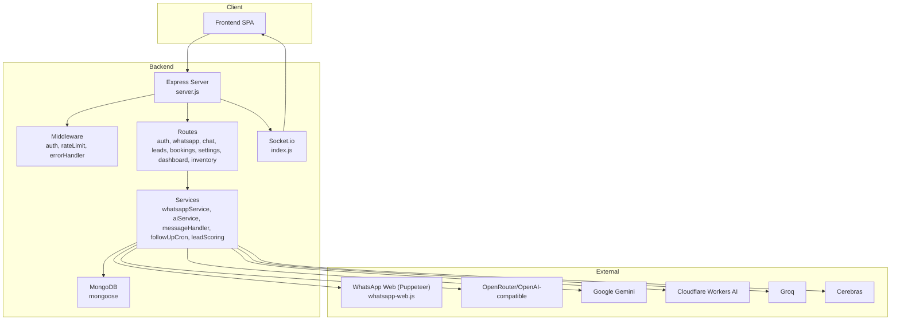

**Diagram sources**
- [server.js:34-108](file://backend/src/server.js#L34-L108)
- [whatsappRoutes.js:1-110](file://backend/src/routes/whatsappRoutes.js#L1-L110)
- [authRoutes.js:1-138](file://backend/src/routes/authRoutes.js#L1-L138)
- [whatsappService.js:1-642](file://backend/src/services/whatsappService.js#L1-L642)
- [aiService.js:1-800](file://backend/src/services/aiService.js#L1-L800)
- [index.js:1-82](file://backend/src/sockets/index.js#L1-L82)
- [db.js:1-40](file://backend/src/config/db.js#L1-L40)

## Detailed Component Analysis

### Express Server Setup and Bootstrap
- Creates Express app and HTTP server.
- Applies security and utility middleware (helmet, CORS, compression, body parsing).
- Adds dev logging via morgan when NODE_ENV is development.
- Mounts rate limiters on /api and /api/auth/login.
- Registers a health endpoint that reports MongoDB connectivity and active WhatsApp sessions.
- Mounts all route modules under /api prefixes.
- Initializes Socket.io and injects the instance into services.
- Connects to MongoDB, seeds default admin user and settings, restarts active WhatsApp sessions, starts cron jobs, then listens on PORT.
- Registers process-level error handlers and graceful shutdown.

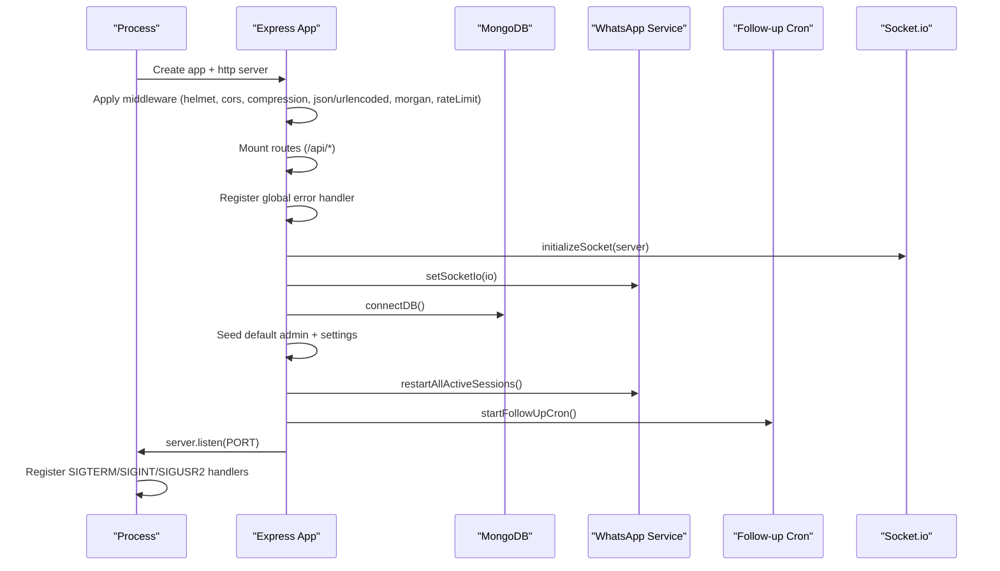

**Diagram sources**
- [server.js:34-174](file://backend/src/server.js#L34-L174)
- [index.js:1-82](file://backend/src/sockets/index.js#L1-L82)
- [db.js:1-40](file://backend/src/config/db.js#L1-L40)

**Section sources**
- [server.js:34-174](file://backend/src/server.js#L34-L174)

### Middleware Pipeline
- Security: helmet sets secure headers; CORS allows credentials from configured frontend URL; compression reduces payload size.
- Body parsing: express.json and express.urlencoded.
- Logging: morgan dev format in development.
- Rate limiting: general limiter for /api, stricter limiter for /api/auth/login.
- Authentication: verifyToken extracts and validates JWT, attaches decoded user; requireAdmin enforces admin role.
- Global error handler: logs errors with context, returns consistent JSON, includes stack only in development.

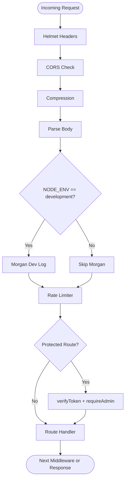

**Diagram sources**
- [server.js:37-61](file://backend/src/server.js#L37-L61)
- [auth.js:1-68](file://backend/src/middleware/auth.js#L1-L68)
- [errorHandler.js:1-36](file://backend/src/middleware/errorHandler.js#L1-L36)
- [rateLimiter.js:1-37](file://backend/src/middleware/rateLimiter.js#L1-L37)

**Section sources**
- [server.js:37-61](file://backend/src/server.js#L37-L61)
- [auth.js:1-68](file://backend/src/middleware/auth.js#L1-L68)
- [errorHandler.js:1-36](file://backend/src/middleware/errorHandler.js#L1-L36)
- [rateLimiter.js:1-37](file://backend/src/middleware/rateLimiter.js#L1-L37)

### Session Management with whatsapp-web.js
- Multi-session architecture: Map of sessionId to Client instances; LocalAuth persists per-session browser state on disk.
- Initialization: Non-blocking initSession registers event listeners and fires client.initialize(); emits QR, ready, authenticated, auth_failure, disconnected events via Socket.io.
- Auto-reconnect: Exponential backoff up to 5 attempts; resets counters on success; emits reconnect_failed after max attempts.
- Pairing code: Alternative to QR via requestPairingCode.
- Per-chat concurrency: Message queue locks ensure sequential processing per customer chat.
- Health checks: Periodic cron job inspects session states.
- Lifecycle: destroySession and destroyAllSessions gracefully log out and destroy clients; cleanup of stale lock files and session folders.

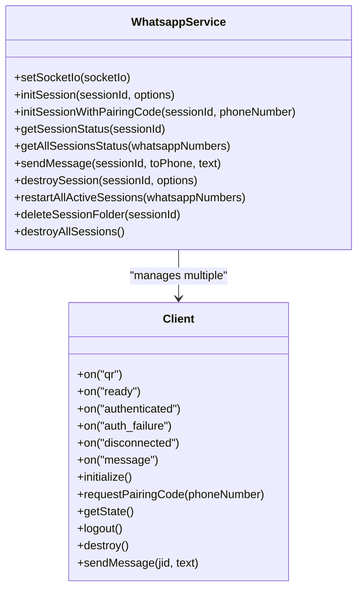

**Diagram sources**
- [whatsappService.js:1-642](file://backend/src/services/whatsappService.js#L1-L642)

**Section sources**
- [whatsappService.js:1-642](file://backend/src/services/whatsappService.js#L1-L642)

### Multi-Provider AI Integration Strategy
- Providers: OpenRouter/OpenAI-compatible, Google Gemini, Cloudflare Workers AI, Groq, Cerebras; optional local Ollama for testing.
- Orchestration: Centralized getAIResponse builds system prompt, runs provider chain with timeouts, sanitizes output, enforces length limits, validates content, records per-provider metrics, and detects language.
- Validation: Rejects malformed or unsafe outputs (unexpected scripts, markdown leakage, repeated words, truncated words); provides diagnostic reasons for rejections.
- Caching: In-memory cache for FAQ-like questions with TTL; excludes dynamic pricing or personal data.
- Metrics: Hourly-resetting in-memory counters for success/invalid/error and average latency per provider.

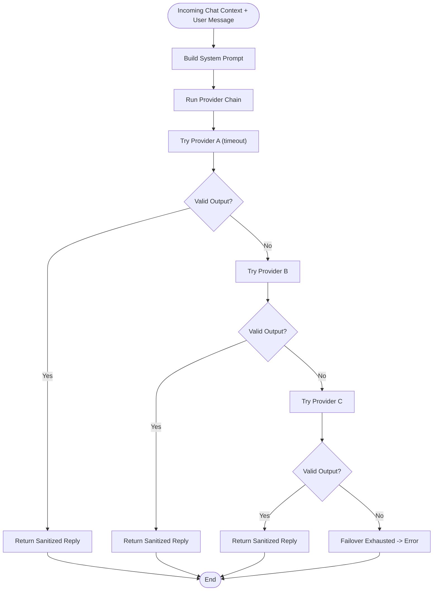

**Diagram sources**
- [aiService.js:1-800](file://backend/src/services/aiService.js#L1-L800)
- [systemPrompt.js:1-94](file://backend/src/services/systemPrompt.js#L1-L94)

**Section sources**
- [aiService.js:1-800](file://backend/src/services/aiService.js#L1-L800)
- [systemPrompt.js:1-94](file://backend/src/services/systemPrompt.js#L1-L94)

### Socket.io Real-Time Communication
- Initialization: Server created with CORS configured from environment; JWT middleware verifies token and loads user; connected staff join 'dashboard' room.
- Usage: Services call getIO() to emit events like QR codes, session status changes, new messages, and alerts.

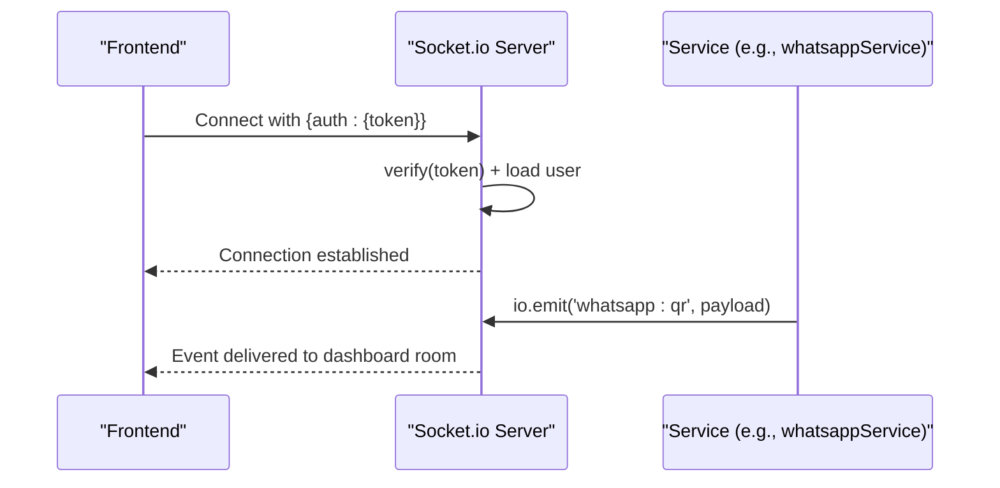

**Diagram sources**
- [index.js:1-82](file://backend/src/sockets/index.js#L1-L82)
- [whatsappService.js:150-194](file://backend/src/services/whatsappService.js#L150-L194)

**Section sources**
- [index.js:1-82](file://backend/src/sockets/index.js#L1-L82)

### Message Handling Flow
- Queuing: Incoming WhatsApp messages are queued per chat to avoid race conditions.
- Routing: Loads settings, finds or creates Chat, handles opt-outs, updates language, saves conversation history, cancels pending follow-ups.
- Mode: If human mode, notifies staff via Socket.io without auto-reply; if AI mode, calls AI service, sends reply, scores lead, schedules follow-ups.

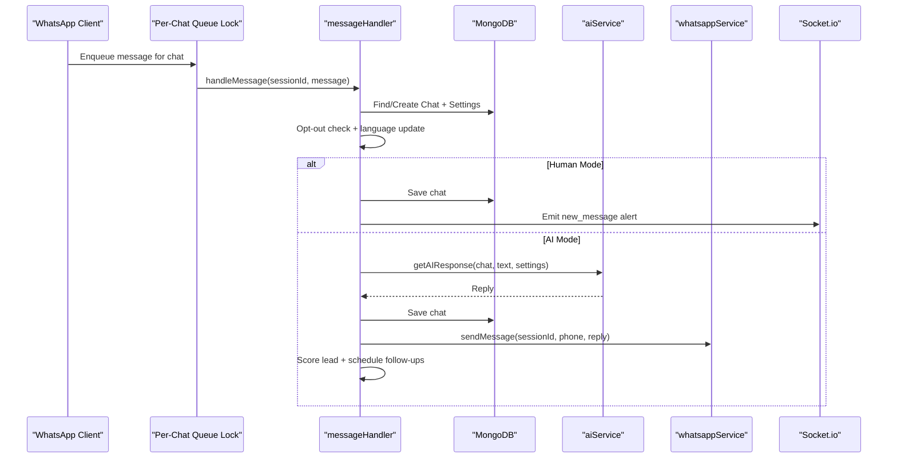

**Diagram sources**
- [whatsappService.js:259-290](file://backend/src/services/whatsappService.js#L259-L290)
- [messageHandler.js:1-183](file://backend/src/services/messageHandler.js#L1-L183)
- [aiService.js:1-800](file://backend/src/services/aiService.js#L1-L800)

**Section sources**
- [whatsappService.js:259-290](file://backend/src/services/whatsappService.js#L259-L290)
- [messageHandler.js:1-183](file://backend/src/services/messageHandler.js#L1-L183)

### API Routes Organization
- Authentication: Login, logout, current user info with JWT verification.
- WhatsApp: List sessions, start session (non-blocking), request pairing code, destroy session.
- Other domains: Chats, leads, bookings, settings, dashboard, inventory, availability mounted under /api.

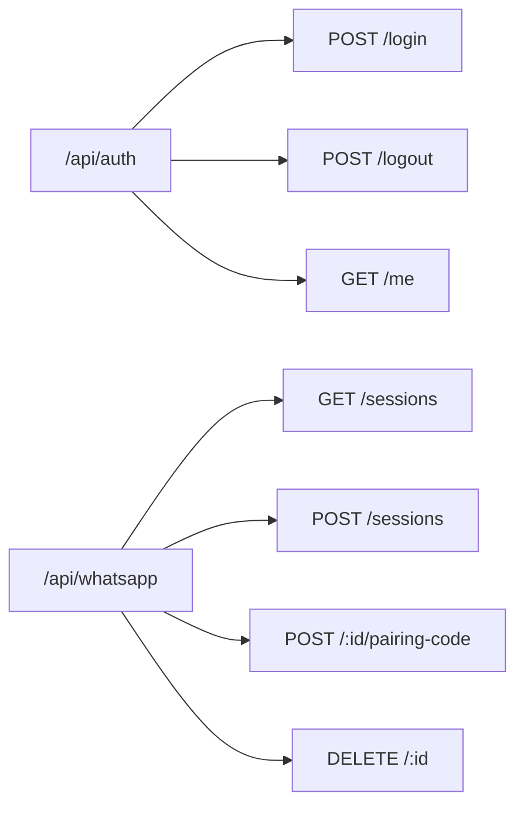

**Diagram sources**
- [authRoutes.js:1-138](file://backend/src/routes/authRoutes.js#L1-L138)
- [whatsappRoutes.js:1-110](file://backend/src/routes/whatsappRoutes.js#L1-L110)

**Section sources**
- [authRoutes.js:1-138](file://backend/src/routes/authRoutes.js#L1-L138)
- [whatsappRoutes.js:1-110](file://backend/src/routes/whatsappRoutes.js#L1-L110)

### Data Models
- User: name, email (unique, lowercase), password (hashed pre-save hook), role (admin/staff), isActive, lastLogin; indexes for performance.
- Chat: customerPhone (unique), whatsappNumberUsed, mode (ai/human), language, messages array, lastMessageAt, bookingStage, bookingDraft, isNewConversation, isArchived; multiple indexes for queries.

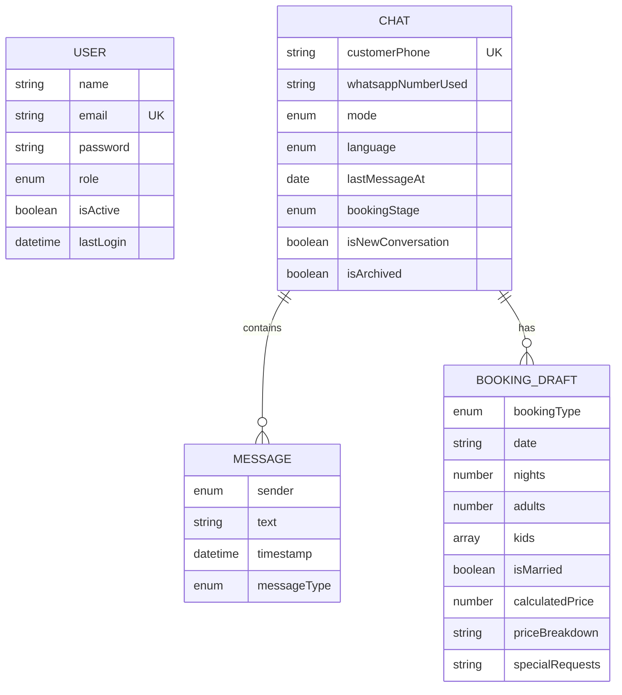

**Diagram sources**
- [User.js:1-63](file://backend/src/models/User.js#L1-L63)
- [Chat.js:1-107](file://backend/src/models/Chat.js#L1-L107)

**Section sources**
- [User.js:1-63](file://backend/src/models/User.js#L1-L63)
- [Chat.js:1-107](file://backend/src/models/Chat.js#L1-L107)

## Dependency Analysis
Key runtime dependencies include Express, Mongoose, Socket.io, whatsapp-web.js, OpenAI SDK, Google Generative AI, node-cron, winston, helmet, cors, compression, morgan, express-rate-limit, bcryptjs, jsonwebtoken, qrcode.

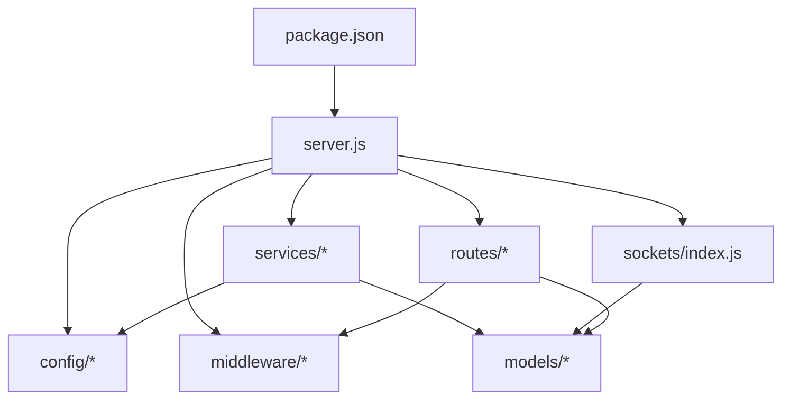

**Diagram sources**
- [package.json:1-47](file://backend/package.json#L1-L47)
- [server.js:1-33](file://backend/src/server.js#L1-L33)

**Section sources**
- [package.json:1-47](file://backend/package.json#L1-L47)
- [server.js:1-33](file://backend/src/server.js#L1-L33)

## Performance Considerations
- Compression enabled to reduce payload sizes.
- Per-chat message queue locks prevent contention on shared resources.
- AI provider timeouts and retries mitigate slow or failing external calls.
- In-memory caching for FAQ-type answers reduces redundant API calls.
- Indexes on frequently queried fields in models improve read performance.
- Health checks and metrics help identify bottlenecks.

[No sources needed since this section provides general guidance]

## Troubleshooting Guide
- Port conflicts: Startup logs indicate EADDRINUSE and suggest using port checker script or changing PORT.
- MongoDB connectivity: Retry mechanism with exponential delays; process exits after max attempts; disconnect and error events logged.
- Graceful shutdown: Destroys WhatsApp sessions, closes HTTP server, disconnects MongoDB; force-exit timeout prevents hangs.
- Process errors: Unhandled rejections and uncaught exceptions are logged; uncaught exception triggers exit.
- WhatsApp sessions: Stale lock files cleaned automatically; unlink/disconnect reasons handled distinctly; pairing code alternative available.
- AI failures: Provider-specific diagnostics and rejection reasons logged; socket alerts emitted for staff visibility.

**Section sources**
- [server.js:155-174](file://backend/src/server.js#L155-L174)
- [server.js:176-238](file://backend/src/server.js#L176-L238)
- [db.js:10-39](file://backend/src/config/db.js#L10-L39)
- [whatsappService.js:76-92](file://backend/src/services/whatsappService.js#L76-L92)
- [whatsappService.js:212-256](file://backend/src/services/whatsappService.js#L212-L256)
- [aiService.js:649-727](file://backend/src/services/aiService.js#L649-L727)

## Conclusion
The backend implements a robust, modular architecture centered around Express with clear separation of concerns: middleware for cross-cutting concerns, routes for API boundaries, services for business logic, and Socket.io for real-time updates. Session management leverages whatsapp-web.js with resilient auto-reconnect and per-chat concurrency controls. The AI layer integrates multiple providers with fallbacks, strict output validation, and observability. Security, logging, and graceful shutdown are well-defined, supporting reliable operation and operational clarity.

[No sources needed since this section summarizes without analyzing specific files]