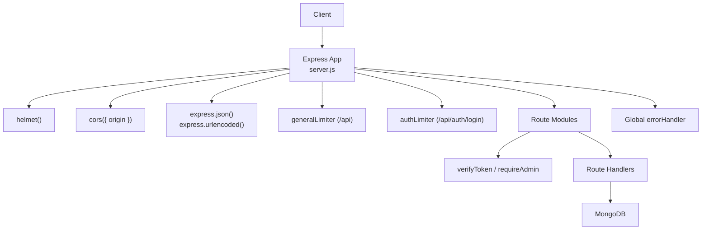
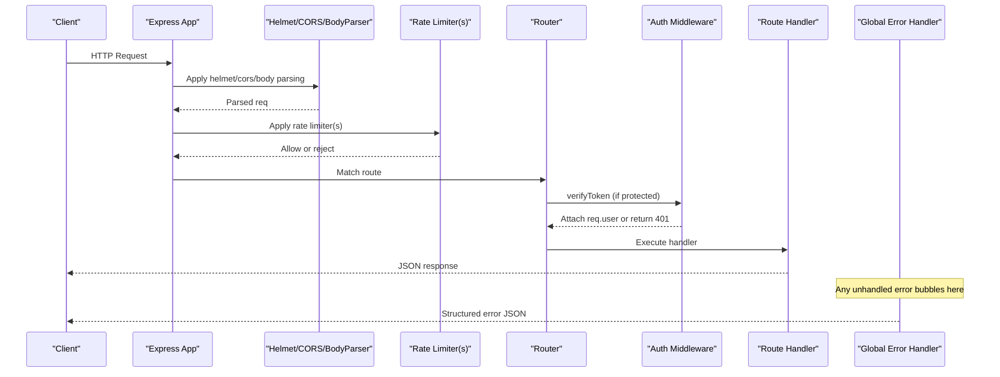
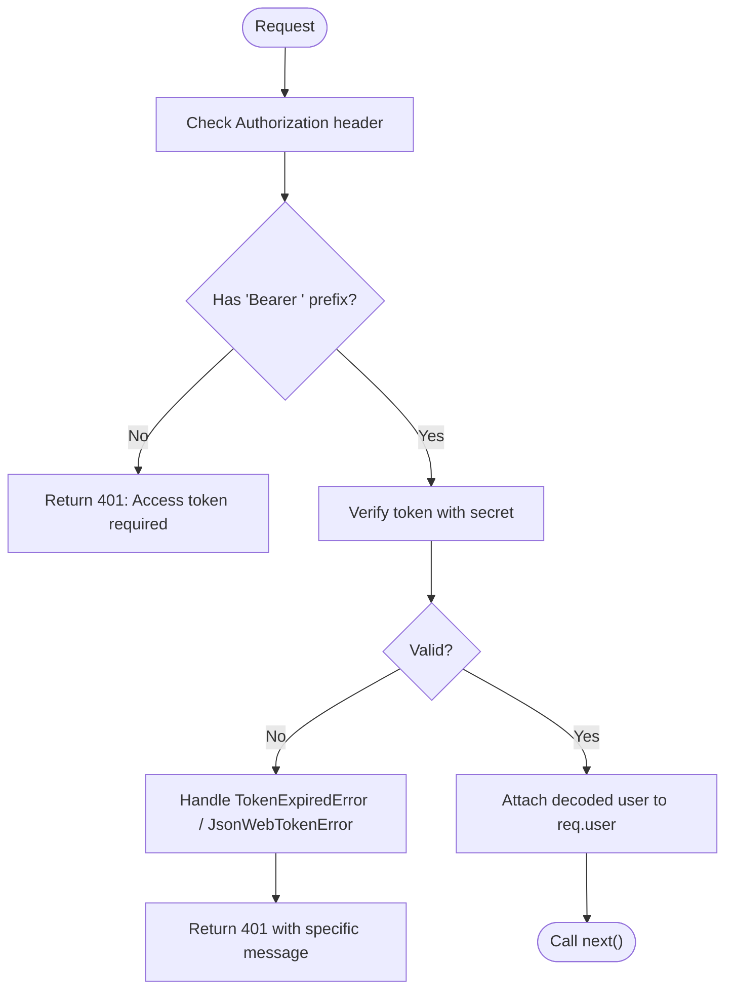
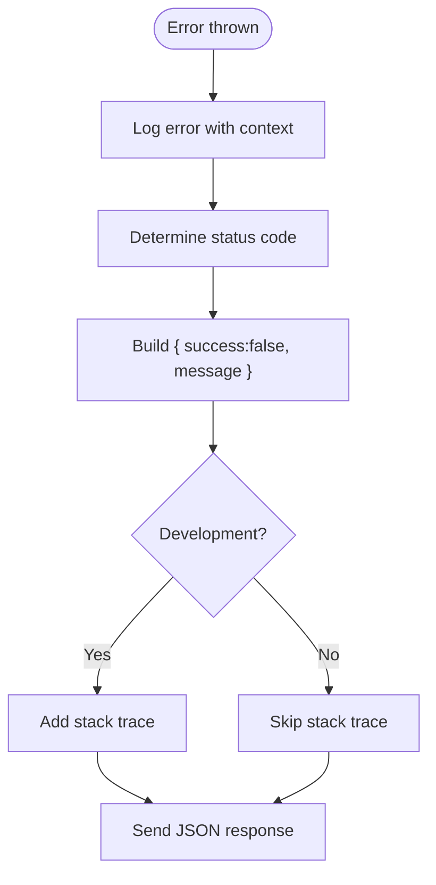
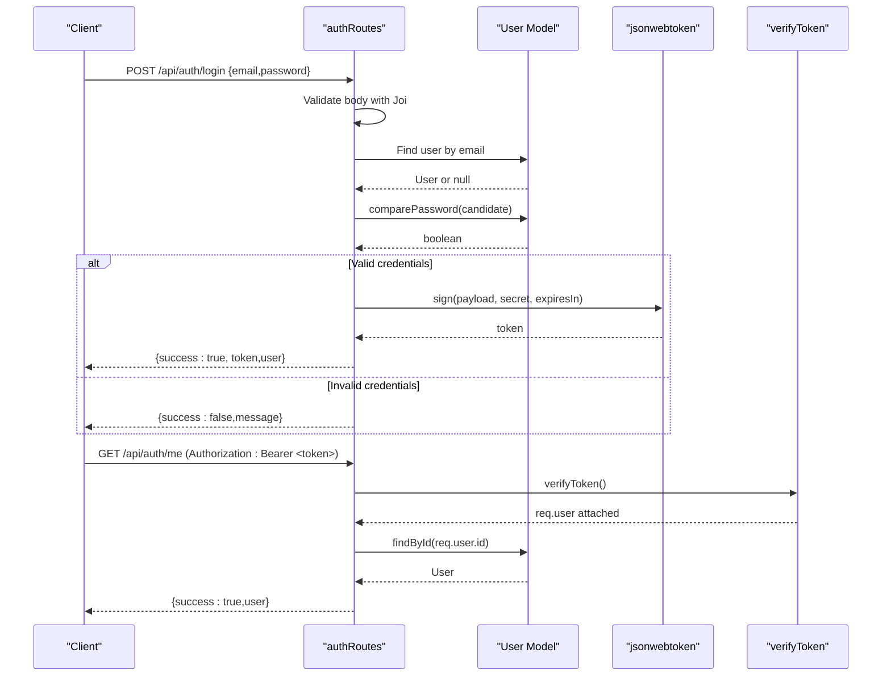
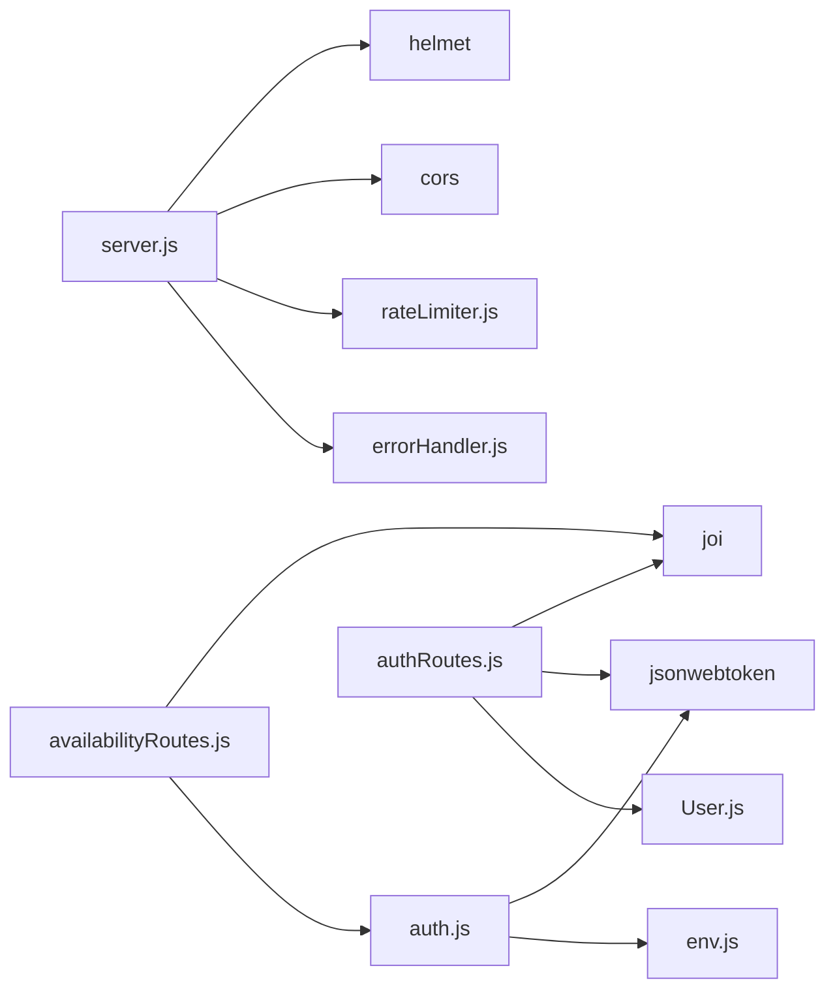

# Middleware & Security

<cite>
**Referenced Files in This Document**
- [server.js](file://backend/src/server.js)
- [auth.js](file://backend/src/middleware/auth.js)
- [errorHandler.js](file://backend/src/middleware/errorHandler.js)
- [rateLimiter.js](file://backend/src/middleware/rateLimiter.js)
- [env.js](file://backend/src/config/env.js)
- [User.js](file://backend/src/models/User.js)
- [authRoutes.js](file://backend/src/routes/authRoutes.js)
- [bookingRoutes.js](file://backend/src/routes/bookingRoutes.js)
- [leadRoutes.js](file://backend/src/routes/leadRoutes.js)
- [availabilityRoutes.js](file://backend/src/routes/availabilityRoutes.js)
</cite>

## Table of Contents
1. [Introduction](#introduction)
2. [Project Structure](#project-structure)
3. [Core Components](#core-components)
4. [Architecture Overview](#architecture-overview)
5. [Detailed Component Analysis](#detailed-component-analysis)
6. [Dependency Analysis](#dependency-analysis)
7. [Performance Considerations](#performance-considerations)
8. [Troubleshooting Guide](#troubleshooting-guide)
9. [Conclusion](#conclusion)

## Introduction
This document explains the middleware and security layer of the backend application. It covers:
- Authentication using JWT tokens
- Role-based access control (RBAC)
- Request validation patterns
- Error handling strategy with a global error handler and structured responses
- Rate limiting for general API and authentication endpoints
- Security headers via helmet, CORS configuration, and input sanitization practices

The goal is to provide both high-level understanding and concrete code references so you can implement similar patterns confidently.

## Project Structure
The middleware and security features are implemented across a small set of focused files:
- Server bootstrap and middleware wiring
- Authentication and authorization middleware
- Global error handler
- Rate limiters
- Environment configuration and schema validation
- Route handlers that demonstrate usage of these components

**Diagram sources**
- [server.js:34-100](file://backend/src/server.js#L34-L100)
- [auth.js:10-62](file://backend/src/middleware/auth.js#L10-L62)
- [errorHandler.js:9-33](file://backend/src/middleware/errorHandler.js#L9-L33)
- [rateLimiter.js:7-31](file://backend/src/middleware/rateLimiter.js#L7-L31)

**Section sources**
- [server.js:34-100](file://backend/src/server.js#L34-L100)

## Core Components
- Authentication middleware: verifies JWT from Authorization header and attaches decoded user to request.
- RBAC middleware: enforces admin-only access on protected routes.
- Global error handler: centralizes logging and returns consistent JSON errors without leaking stack traces in production.
- Rate limiters: separate limits for general API and login endpoint.
- Input validation: Joi schemas used at route boundaries; helper utilities for reuse.
- Security headers and CORS: helmet applied globally; CORS restricted to configured frontend URL.

**Section sources**
- [auth.js:10-62](file://backend/src/middleware/auth.js#L10-L62)
- [errorHandler.js:9-33](file://backend/src/middleware/errorHandler.js#L9-L33)
- [rateLimiter.js:7-31](file://backend/src/middleware/rateLimiter.js#L7-L31)
- [authRoutes.js:12-16](file://backend/src/routes/authRoutes.js#L12-L16)
- [availabilityRoutes.js:46-65](file://backend/src/routes/availabilityRoutes.js#L46-L65)
- [server.js:38-60](file://backend/src/server.js#L38-L60)

## Architecture Overview
The request lifecycle through middleware and security layers:

**Diagram sources**
- [server.js:38-100](file://backend/src/server.js#L38-L100)
- [auth.js:10-47](file://backend/src/middleware/auth.js#L10-L47)
- [errorHandler.js:9-33](file://backend/src/middleware/errorHandler.js#L9-L33)

## Detailed Component Analysis

### Authentication Middleware (JWT)
- Extracts Authorization header and expects Bearer token format.
- Verifies token against secret from environment configuration.
- Attaches decoded payload to req.user for downstream use.
- Returns clear 401 messages for missing, invalid, or expired tokens.

**Diagram sources**
- [auth.js:10-47](file://backend/src/middleware/auth.js#L10-L47)

Usage examples:
- Protected route example path: [bookingRoutes.js:11](file://backend/src/routes/bookingRoutes.js#L11)
- Admin-only route example path: [availabilityRoutes.js:4](file://backend/src/routes/availabilityRoutes.js#L4)

**Section sources**
- [auth.js:10-62](file://backend/src/middleware/auth.js#L10-L62)
- [env.js:58-59](file://backend/src/config/env.js#L58-L59)
- [bookingRoutes.js:11](file://backend/src/routes/bookingRoutes.js#L11)
- [availabilityRoutes.js:4](file://backend/src/routes/availabilityRoutes.js#L4)

### Role-Based Access Control (RBAC)
- The admin check middleware ensures only users with role admin can proceed.
- Applied after verifyToken since it depends on req.user.

Example usage:
- Admin-only route composition: [availabilityRoutes.js:4](file://backend/src/routes/availabilityRoutes.js#L4)

Security note:
- Ensure all sensitive operations explicitly apply requireAdmin where needed.

**Section sources**
- [auth.js:53-62](file://backend/src/middleware/auth.js#L53-L62)
- [availabilityRoutes.js:4](file://backend/src/routes/availabilityRoutes.js#L4)

### Request Validation and Input Sanitization
Patterns used:
- Joi schemas define strict shapes for incoming payloads.
- Route-level validation returns 400 with human-readable messages.
- Helper functions encapsulate repeated validation logic.
- Additional checks for IDs and date ranges improve robustness.

Examples:
- Login validation schema: [authRoutes.js:12-16](file://backend/src/routes/authRoutes.js#L12-L16)
- Availability validation helpers and schemas: [availabilityRoutes.js:19-65](file://backend/src/routes/availabilityRoutes.js#L19-L65)

Sanitization notes:
- Email normalization occurs at model level (lowercase, trim).
- Password hashing is handled by a pre-save hook using bcrypt.

**Section sources**
- [authRoutes.js:12-16](file://backend/src/routes/authRoutes.js#L12-L16)
- [availabilityRoutes.js:19-65](file://backend/src/routes/availabilityRoutes.js#L19-L65)
- [User.js:9-14](file://backend/src/models/User.js#L9-L14)
- [User.js:40-52](file://backend/src/models/User.js#L40-L52)

### Error Handling Strategy
- Global error handler logs full context and returns a consistent JSON shape.
- In development, stack traces are included; in production, they are omitted.
- All route handlers pass unexpected errors to the global handler via next(error).

**Diagram sources**
- [errorHandler.js:9-33](file://backend/src/middleware/errorHandler.js#L9-L33)

Concrete usage:
- Passing errors to global handler: [authRoutes.js:90-92](file://backend/src/routes/authRoutes.js#L90-L92), [bookingRoutes.js:28-30](file://backend/src/routes/bookingRoutes.js#L28-L30), [availabilityRoutes.js:97-99](file://backend/src/routes/availabilityRoutes.js#L97-L99)

**Section sources**
- [errorHandler.js:9-33](file://backend/src/middleware/errorHandler.js#L9-L33)
- [authRoutes.js:90-92](file://backend/src/routes/authRoutes.js#L90-L92)
- [bookingRoutes.js:28-30](file://backend/src/routes/bookingRoutes.js#L28-L30)
- [availabilityRoutes.js:97-99](file://backend/src/routes/availabilityRoutes.js#L97-L99)

### Rate Limiting
Two distinct limiters are applied:
- General API: higher threshold suitable for normal operations.
- Authentication login: stricter limit to mitigate brute-force attempts.

Configuration:
- Window and max values are defined per limiter.
- Standard headers are enabled; legacy headers disabled.

Application:
- General limiter applies to all /api routes.
- Auth limiter applies specifically to /api/auth/login.

**Section sources**
- [rateLimiter.js:7-31](file://backend/src/middleware/rateLimiter.js#L7-L31)
- [server.js:59-60](file://backend/src/server.js#L59-L60)

### Security Headers and CORS
- helmet() is applied early to set secure HTTP headers.
- cors() restricts allowed origins to the configured frontend URL and enables credentials.

Environment-driven configuration:
- Frontend URL comes from environment variables validated at startup.

**Section sources**
- [server.js:38-44](file://backend/src/server.js#L38-L44)
- [env.js:19](file://backend/src/config/env.js#L19)

### End-to-End Authentication Flow

**Diagram sources**
- [authRoutes.js:22-93](file://backend/src/routes/authRoutes.js#L22-L93)
- [authRoutes.js:110-135](file://backend/src/routes/authRoutes.js#L110-L135)
- [auth.js:10-47](file://backend/src/middleware/auth.js#L10-L47)
- [User.js:54-60](file://backend/src/models/User.js#L54-L60)

## Dependency Analysis
Key dependencies and their roles:
- express-rate-limit: provides IP-based rate limiting.
- jsonwebtoken: signs and verifies JWTs.
- helmet: sets secure HTTP response headers.
- cors: configures cross-origin policy.
- Joi: validates environment variables and request bodies.
- bcryptjs: hashes and compares passwords.

**Diagram sources**
- [server.js:16-21](file://backend/src/server.js#L16-L21)
- [auth.js:1-3](file://backend/src/middleware/auth.js#L1-3)
- [authRoutes.js:1-7](file://backend/src/routes/authRoutes.js#L1-7)
- [availabilityRoutes.js:1-5](file://backend/src/routes/availabilityRoutes.js#L1-5)
- [User.js:1-2](file://backend/src/models/User.js#L1-2)

**Section sources**
- [server.js:16-21](file://backend/src/server.js#L16-L21)
- [auth.js:1-3](file://backend/src/middleware/auth.js#L1-3)
- [authRoutes.js:1-7](file://backend/src/routes/authRoutes.js#L1-7)
- [availabilityRoutes.js:1-5](file://backend/src/routes/availabilityRoutes.js#L1-5)
- [User.js:1-2](file://backend/src/models/User.js#L1-2)

## Performance Considerations
- Rate limiting reduces load and protects sensitive endpoints.
- Helmet and CORS add minimal overhead but significantly improve security posture.
- Using standard headers for rate limiting avoids extra processing.
- Keep validation schemas tight to fail fast and reduce unnecessary database calls.

[No sources needed since this section provides general guidance]

## Troubleshooting Guide
Common issues and resolutions:
- Missing or malformed Authorization header: ensure clients send Authorization: Bearer <token>.
- Token expired or invalid: refresh tokens or re-authenticate; verify secret configuration.
- Too many requests: wait for window reset or adjust limits if appropriate.
- CORS errors: confirm frontend URL matches the configured FRONTEND_URL.
- Unexpected errors: check global error logs and ensure next(error) is called in catch blocks.

Operational references:
- Global error handler behavior: [errorHandler.js:9-33](file://backend/src/middleware/errorHandler.js#L9-L33)
- Rate limiter responses: [rateLimiter.js:7-31](file://backend/src/middleware/rateLimiter.js#L7-L31)
- Auth flow error paths: [authRoutes.js:22-93](file://backend/src/routes/authRoutes.js#L22-L93)

**Section sources**
- [errorHandler.js:9-33](file://backend/src/middleware/errorHandler.js#L9-L33)
- [rateLimiter.js:7-31](file://backend/src/middleware/rateLimiter.js#L7-L31)
- [authRoutes.js:22-93](file://backend/src/routes/authRoutes.js#L22-L93)

## Conclusion
The middleware and security layer follows a clear separation of concerns:
- Centralized security headers and CORS
- Strict input validation at route boundaries
- JWT-based authentication with optional admin-only enforcement
- Consistent error handling with safe production behavior
- Targeted rate limiting for general and authentication endpoints

These patterns provide a solid foundation for secure, maintainable APIs.

[No sources needed since this section summarizes without analyzing specific files]