# Server Configuration

<cite>
**Referenced Files in This Document**
- [server.js](file://backend/src/server.js)
- [db.js](file://backend/src/config/db.js)
- [env.js](file://backend/src/config/env.js)
- [logger.js](file://backend/src/config/logger.js)
- [errorHandler.js](file://backend/src/middleware/errorHandler.js)
- [rateLimiter.js](file://backend/src/middleware/rateLimiter.js)
- [User.js](file://backend/src/models/User.js)
- [Settings.js](file://backend/src/models/Settings.js)
- [package.json](file://backend/package.json)
- [checkPorts.js](file://backend/src/scripts/checkPorts.js)
- [setupEnv.js](file://backend/src/scripts/setupEnv.js)
</cite>

## Table of Contents
1. [Introduction](#introduction)
2. [Project Structure](#project-structure)
3. [Core Components](#core-components)
4. [Architecture Overview](#architecture-overview)
5. [Detailed Component Analysis](#detailed-component-analysis)
6. [Dependency Analysis](#dependency-analysis)
7. [Performance Considerations](#performance-considerations)
8. [Troubleshooting Guide](#troubleshooting-guide)
9. [Conclusion](#conclusion)
10. [Appendices](#appendices)

## Introduction
This document explains the Express.js server configuration and initialization for the backend application. It covers the bootstrap process, middleware pipeline (security, CORS, compression, body parsing, logging, rate limiting), environment-based logging setup, health check endpoint, database connection management with retry logic, default admin user creation, settings initialization, port management, error handling strategies, and graceful shutdown. Practical examples of environment variable configuration and deployment considerations are included.

## Project Structure
The server is bootstrapped from a single entry point that wires up Express, HTTP, Socket.io, routes, middleware, and services. Configuration is centralized via validated environment variables, and logging is configured per environment. Database connectivity uses Mongoose with retry logic.

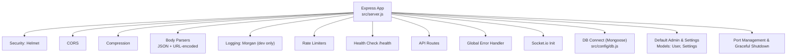

**Diagram sources**
- [server.js:34-100](file://backend/src/server.js#L34-L100)
- [db.js:10-29](file://backend/src/config/db.js#L10-L29)
- [User.js:1-63](file://backend/src/models/User.js#L1-L63)
- [Settings.js:1-38](file://backend/src/models/Settings.js#L1-L38)

**Section sources**
- [server.js:1-100](file://backend/src/server.js#L1-L100)
- [package.json:1-47](file://backend/package.json#L1-L47)

## Core Components
- Express app and HTTP server creation
- Middleware stack: helmet, cors, compression, express.json/urlencoded, morgan (development), rate limiters
- Health check endpoint at GET /health
- API route mounting under /api/*
- Global error handler
- Socket.io initialization and service wiring
- Database connection with retry logic
- Default admin user and settings seeding
- Port management and graceful shutdown handlers

**Section sources**
- [server.js:34-100](file://backend/src/server.js#L34-L100)
- [server.js:110-174](file://backend/src/server.js#L110-L174)
- [server.js:176-238](file://backend/src/server.js#L176-L238)
- [db.js:10-29](file://backend/src/config/db.js#L10-L29)
- [logger.js:1-52](file://backend/src/config/logger.js#L1-L52)
- [rateLimiter.js:1-37](file://backend/src/middleware/rateLimiter.js#L1-L37)
- [errorHandler.js:1-36](file://backend/src/middleware/errorHandler.js#L1-L36)

## Architecture Overview
The server initializes the Express app, applies security and performance middleware, mounts routes, sets up global error handling, connects to MongoDB with retries, seeds initial data, starts background tasks, and listens on a configurable port. Socket.io is initialized and shared with services. Process-level event handlers ensure robustness and graceful shutdown.

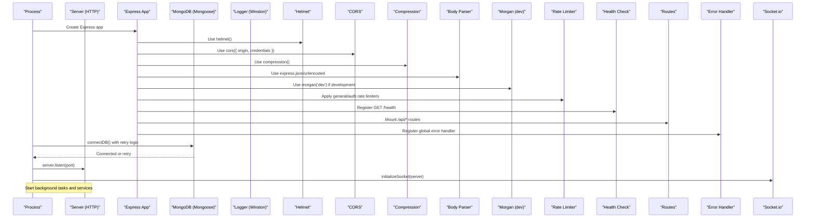

**Diagram sources**
- [server.js:34-100](file://backend/src/server.js#L34-L100)
- [server.js:110-174](file://backend/src/server.js#L110-L174)
- [db.js:10-29](file://backend/src/config/db.js#L10-L29)
- [logger.js:1-52](file://backend/src/config/logger.js#L1-L52)

## Detailed Component Analysis

### Express Bootstrap and Middleware Pipeline
- Security: Helmet applied globally to set secure headers.
- CORS: Configured with frontend URL and credentials enabled.
- Compression: Enabled to reduce payload sizes.
- Body Parsing: JSON and URL-encoded bodies parsed with extended support.
- Logging: Morgan dev formatter used only when NODE_ENV is development.
- Rate Limiting: General limiter for /api and stricter limiter for login endpoints.
- Health Check: GET /health returns status, uptime, MongoDB connection state, active WhatsApp sessions count, and timestamp.
- Routes: Mounted under /api/auth, /api/whatsapp, /api/chats, /api/leads, /api/bookings, /api/settings, /api/dashboard, /api/inventory, /api/availability.
- Global Error Handler: Centralized error response formatting; stacks exposed only in development.

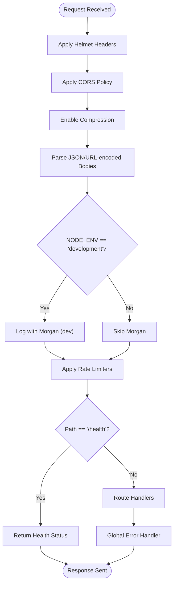

**Diagram sources**
- [server.js:34-100](file://backend/src/server.js#L34-L100)
- [rateLimiter.js:1-37](file://backend/src/middleware/rateLimiter.js#L1-L37)
- [errorHandler.js:1-36](file://backend/src/middleware/errorHandler.js#L1-L36)

**Section sources**
- [server.js:34-100](file://backend/src/server.js#L34-L100)
- [rateLimiter.js:1-37](file://backend/src/middleware/rateLimiter.js#L1-L37)
- [errorHandler.js:1-36](file://backend/src/middleware/errorHandler.js#L1-L36)

### Environment-Based Logging Setup (Winston + Morgan)
- Winston logger configured with transports:
  - Development: Console transport with colored timestamps and optional metadata.
  - All environments: File transports for errors and combined logs in JSON format.
- Level selection based on NODE_ENV (debug in development, info otherwise).
- Morgan used conditionally in development for request logging.

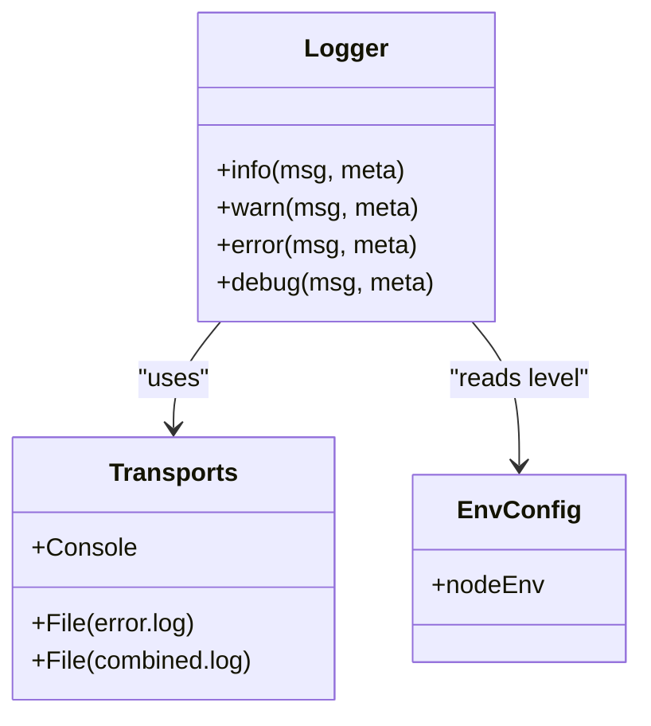

**Diagram sources**
- [logger.js:1-52](file://backend/src/config/logger.js#L1-L52)

**Section sources**
- [logger.js:1-52](file://backend/src/config/logger.js#L1-L52)
- [server.js:54-56](file://backend/src/server.js#L54-L56)

### Health Check Endpoint Implementation
- GET /health provides:
  - status: ok/error
  - uptime: process uptime
  - mongoConnected: boolean derived from Mongoose connection readyState
  - activeWhatsappSessions: count of connected sessions
  - timestamp: ISO string
- Returns 500 with message on exceptions.

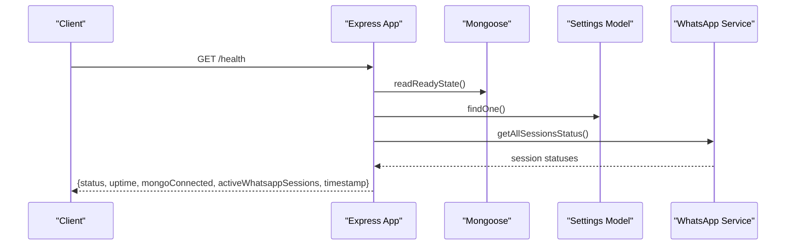

**Diagram sources**
- [server.js:63-86](file://backend/src/server.js#L63-L86)

**Section sources**
- [server.js:63-86](file://backend/src/server.js#L63-L86)

### Database Connection Management (Mongoose with Retry Logic)
- connectDB attempts to connect using validated MONGO_URI.
- Retries up to a maximum number of times with a fixed delay between attempts.
- Logs each attempt and exits the process after exhausting retries.
- Listens for disconnected and error events to log warnings/errors.

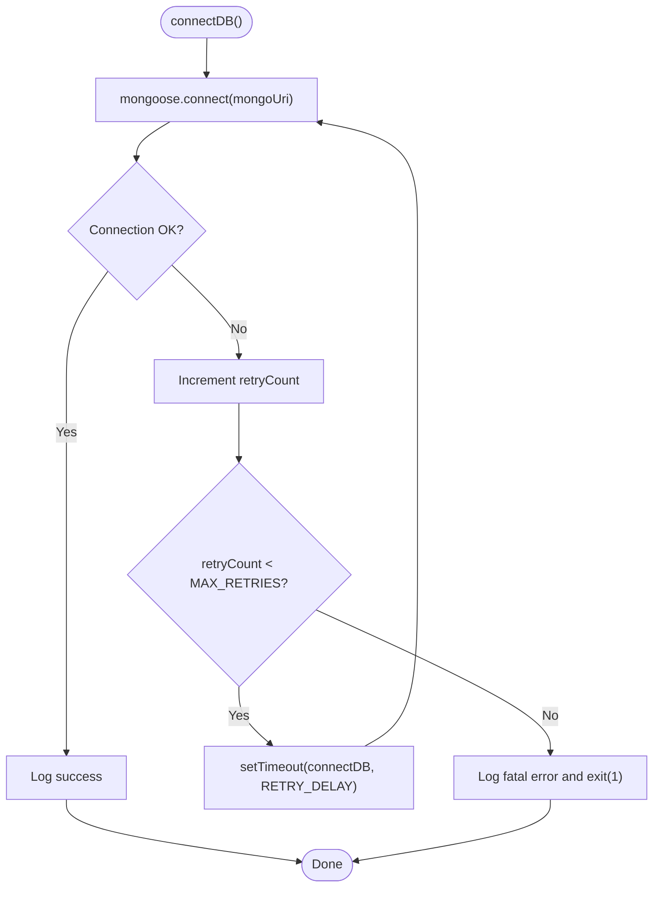

**Diagram sources**
- [db.js:10-29](file://backend/src/config/db.js#L10-L29)

**Section sources**
- [db.js:10-29](file://backend/src/config/db.js#L10-L29)

### Default Admin User Creation and Settings Initialization
- On startup, checks for existing admin users; creates one if none exist.
- Ensures default settings document exists; creates it if missing.
- Restarts active WhatsApp sessions based on configured numbers.
- Starts follow-up cron job.

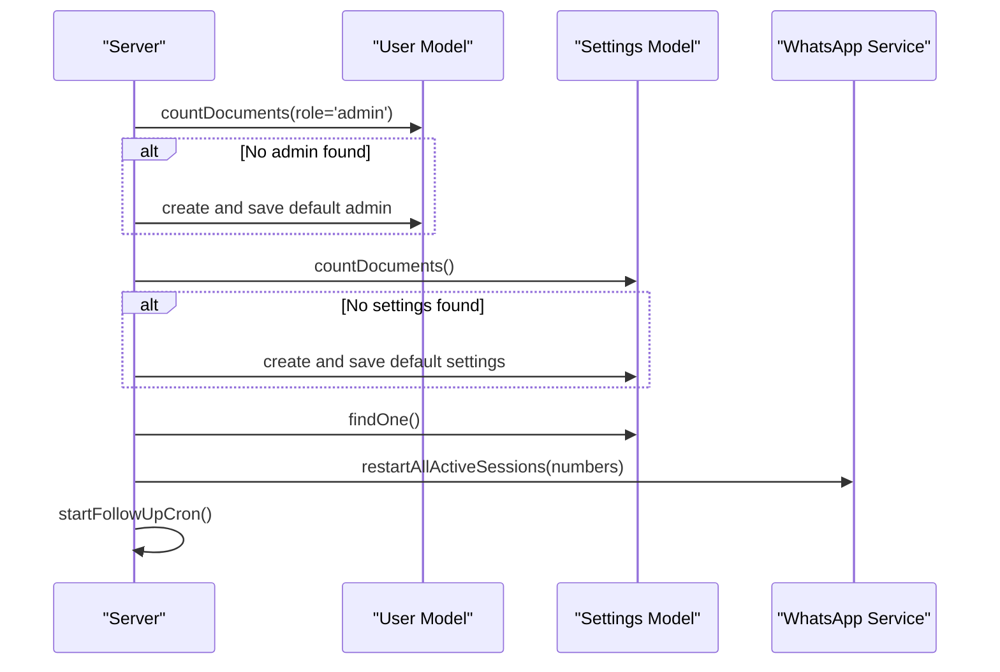

**Diagram sources**
- [server.js:115-152](file://backend/src/server.js#L115-L152)
- [User.js:1-63](file://backend/src/models/User.js#L1-L63)
- [Settings.js:1-38](file://backend/src/models/Settings.js#L1-L38)

**Section sources**
- [server.js:115-152](file://backend/src/server.js#L115-L152)
- [User.js:1-63](file://backend/src/models/User.js#L1-L63)
- [Settings.js:1-38](file://backend/src/models/Settings.js#L1-L38)

### Port Management
- Server listens on PORT from environment; defaults provided by validation schema.
- On EADDRINUSE, logs actionable guidance and exits.
- Utility script checks ports across backend and frontend configurations and identifies processes using them.

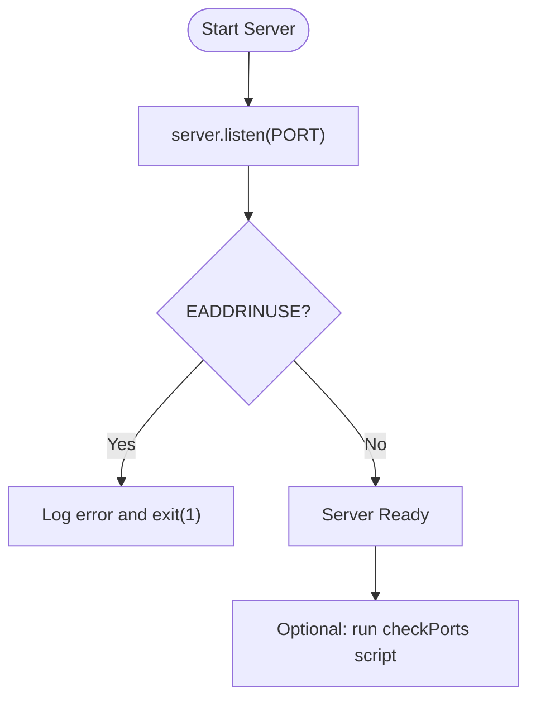

**Diagram sources**
- [server.js:155-168](file://backend/src/server.js#L155-L168)
- [checkPorts.js:122-220](file://backend/src/scripts/checkPorts.js#L122-L220)

**Section sources**
- [server.js:155-168](file://backend/src/server.js#L155-L168)
- [checkPorts.js:122-220](file://backend/src/scripts/checkPorts.js#L122-L220)

### Error Handling Strategies
- Global Express error handler formats consistent JSON responses and logs detailed context.
- Stack traces included only in development.
- Process-level handlers:
  - unhandledRejection: logs promise rejections.
  - uncaughtException: logs and exits the process.

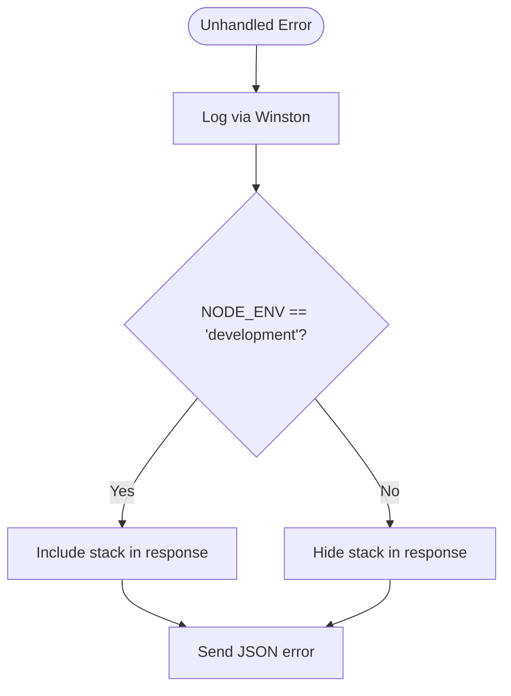

**Diagram sources**
- [errorHandler.js:1-36](file://backend/src/middleware/errorHandler.js#L1-L36)
- [server.js:176-184](file://backend/src/server.js#L176-L184)

**Section sources**
- [errorHandler.js:1-36](file://backend/src/middleware/errorHandler.js#L1-L36)
- [server.js:176-184](file://backend/src/server.js#L176-L184)

### Graceful Shutdown
- Handles SIGTERM, SIGINT, SIGUSR2 signals.
- Prevents concurrent shutdowns.
- Destroys all WhatsApp sessions before closing server.
- Closes HTTP server, disconnects MongoDB, and exits cleanly.
- Includes a timeout to force-exit if shutdown hangs.

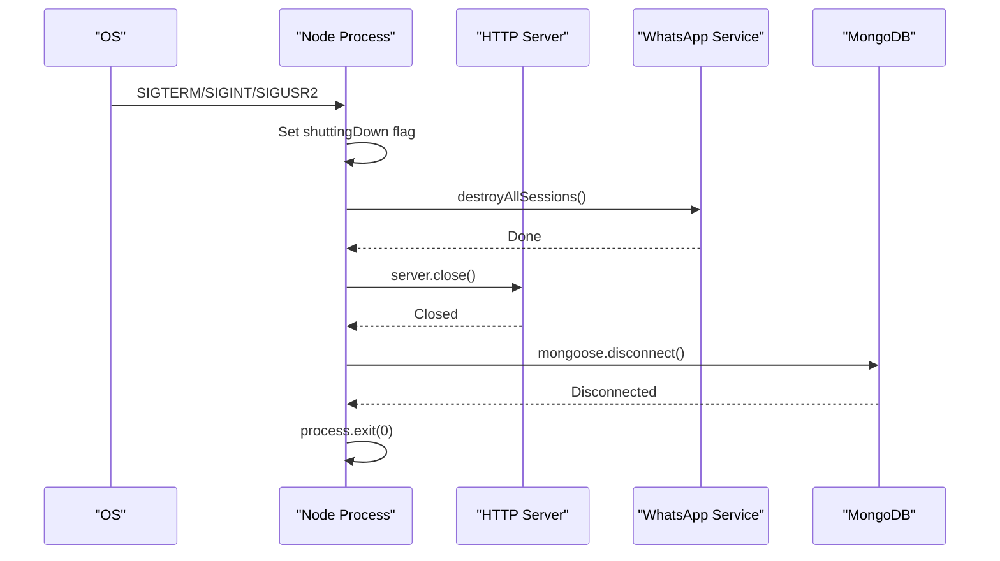

**Diagram sources**
- [server.js:186-238](file://backend/src/server.js#L186-L238)

**Section sources**
- [server.js:186-238](file://backend/src/server.js#L186-L238)

## Dependency Analysis
Key runtime dependencies relevant to server configuration:
- express, http, socket.io for web and real-time communication
- mongoose for MongoDB ODM
- helmet, cors, compression for security and performance
- morgan for request logging (development)
- express-rate-limit for protection against abuse
- winston for structured logging
- dotenv and joi for environment loading and validation

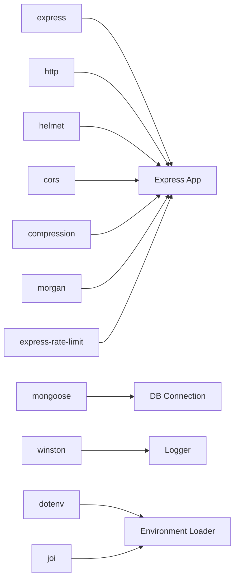

**Diagram sources**
- [package.json:23-42](file://backend/package.json#L23-L42)
- [server.js:1-22](file://backend/src/server.js#L1-L22)
- [logger.js:1-52](file://backend/src/config/logger.js#L1-L52)
- [env.js:1-95](file://backend/src/config/env.js#L1-L95)

**Section sources**
- [package.json:23-42](file://backend/package.json#L23-L42)

## Performance Considerations
- Enable compression to reduce bandwidth usage.
- Use rate limiting to protect endpoints and mitigate abuse.
- Keep Morgan disabled in production to avoid overhead.
- Ensure MongoDB connection pool settings align with workload (via Mongoose options).
- Avoid heavy synchronous operations in request handlers.
- Monitor health endpoint for uptime and dependency status.

[No sources needed since this section provides general guidance]

## Troubleshooting Guide
- Port conflicts:
  - Run the port checker script to identify processes using configured ports and get commands to terminate them.
  - The server logs a clear message and exits when EADDRINUSE occurs.
- MongoDB connection failures:
  - The connection function retries with exponential backoff-like delays until max attempts; verify MONGO_URI and network access.
- Health check issues:
  - Inspect mongoConnected and activeWhatsappSessions fields to diagnose dependency states.
- Logging:
  - In development, console logs include colors and timestamps; file logs capture errors and combined entries in JSON for analysis.
- Graceful shutdown:
  - If shutdown hangs, the process will force-exit after a timeout; inspect WhatsApp session cleanup and server close callbacks.

**Section sources**
- [checkPorts.js:122-220](file://backend/src/scripts/checkPorts.js#L122-L220)
- [server.js:155-168](file://backend/src/server.js#L155-L168)
- [db.js:10-29](file://backend/src/config/db.js#L10-L29)
- [server.js:63-86](file://backend/src/server.js#L63-L86)
- [logger.js:1-52](file://backend/src/config/logger.js#L1-L52)
- [server.js:186-238](file://backend/src/server.js#L186-L238)

## Conclusion
The server configuration follows best practices for Express applications: strong security headers, strict CORS policy, compression, robust logging, rate limiting, comprehensive error handling, resilient database connectivity, and graceful shutdown. Environment variables are validated centrally, and utilities assist with setup and port management. These patterns provide a reliable foundation for production deployments.

[No sources needed since this section summarizes without analyzing specific files]

## Appendices

### Environment Variables Reference
Required and optional variables validated by the configuration module:
- MONGO_URI: MongoDB connection URI
- JWT_SECRET: Secret key for JWT token signing
- JWT_EXPIRES_IN: Token expiration time (e.g., "7d")
- OPENROUTER_API_KEY: OpenRouter API key for AI calls
- OPENROUTER_MODEL_PRIMARY: Primary OpenRouter model
- PORT: Server port (default provided)
- NODE_ENV: Environment (development, production, test)
- RESORT_CONTACT_1/2/3: Resort contact numbers
- ADMIN_DEFAULT_EMAIL: Default admin email
- ADMIN_DEFAULT_PASSWORD: Default admin password
- FRONTEND_URL: Frontend application URL
- Optional AI provider keys and models (Gemini, Groq, Cloudflare, Cerebras, Ollama)

Practical example values can be generated using the setup script, which writes both backend/.env and frontend/.env with sensible defaults and prompts for required inputs.

**Section sources**
- [env.js:4-95](file://backend/src/config/env.js#L4-L95)
- [setupEnv.js:49-192](file://backend/src/scripts/setupEnv.js#L49-L192)

### Deployment Considerations
- Set NODE_ENV=production to disable verbose logging and adjust log levels.
- Configure CORS origin to the deployed frontend domain.
- Ensure firewall rules allow inbound traffic on the configured PORT.
- Use a process manager (e.g., systemd, PM2) to handle restarts and signal forwarding for graceful shutdown.
- Store secrets securely (e.g., secret managers) and avoid committing .env files.
- Validate environment variables at startup; the application exits on validation failure.

[No sources needed since this section provides general guidance]