# Data Flow Patterns

<cite>
**Referenced Files in This Document**
- [server.js](file://backend/src/server.js)
- [whatsappService.js](file://backend/src/services/whatsappService.js)
- [messageHandler.js](file://backend/src/services/messageHandler.js)
- [aiService.js](file://backend/src/services/aiService.js)
- [leadScoring.js](file://backend/src/services/leadScoring.js)
- [followUpService.js](file://backend/src/services/followUpService.js)
- [followUpCron.js](file://backend/src/services/followUpCron.js)
- [index.js](file://backend/src/sockets/index.js)
- [Chat.js](file://backend/src/models/Chat.js)
- [Booking.js](file://backend/src/models/Booking.js)
- [FollowUp.js](file://backend/src/models/FollowUp.js)
- [db.js](file://backend/src/config/db.js)
- [whatsappRoutes.js](file://backend/src/routes/whatsappRoutes.js)
- [bookingRoutes.js](file://backend/src/routes/bookingRoutes.js)
</cite>

## Table of Contents
1. Introduction
2. Project Structure
3. Core Components
4. Architecture Overview
5. Detailed Component Analysis
6. Dependency Analysis
7. Performance Considerations
8. Troubleshooting Guide
9. Conclusion

## Introduction
This document explains the end-to-end data flow patterns in the Nandibaag Bot system, focusing on:
- WhatsApp incoming message ingestion and processing
- AI response generation with multi-provider fallbacks
- Real-time updates via Socket.io
- Conversation state management and lead scoring
- Booking automation and follow-up scheduling
- Caching strategies, error handling, retry logic, and performance optimizations

The system is event-driven and asynchronous, using Express for HTTP APIs, whatsapp-web.js for WhatsApp sessions, Mongoose for MongoDB persistence, and Socket.io for real-time dashboard updates.

## Project Structure
At a high level:
- server.js bootstraps Express, Socket.io, database connectivity, routes, services, and lifecycle hooks
- Services encapsulate business logic (WhatsApp session management, message handling, AI orchestration, lead scoring, follow-ups)
- Models define persistent entities (Chat, Booking, FollowUp)
- Routes expose REST endpoints for admin operations
- Sockets provide authenticated real-time channels to the frontend

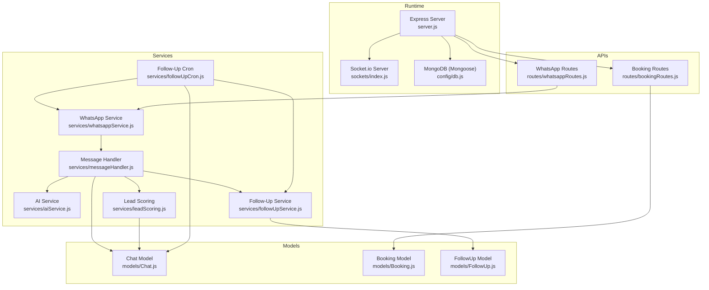

**Diagram sources**
- [server.js:1-241](file://backend/src/server.js#L1-L241)
- [index.js:1-82](file://backend/src/sockets/index.js#L1-L82)
- [db.js:1-40](file://backend/src/config/db.js#L1-L40)
- [whatsappService.js:1-642](file://backend/src/services/whatsappService.js#L1-L642)
- [messageHandler.js:1-183](file://backend/src/services/messageHandler.js#L1-L183)
- [aiService.js:1-800](file://backend/src/services/aiService.js#L1-L800)
- [leadScoring.js:1-235](file://backend/src/services/leadScoring.js#L1-L235)
- [followUpService.js:1-126](file://backend/src/services/followUpService.js#L1-L126)
- [followUpCron.js:1-209](file://backend/src/services/followUpCron.js#L1-L209)
- [Chat.js:1-107](file://backend/src/models/Chat.js#L1-L107)
- [Booking.js:1-69](file://backend/src/models/Booking.js#L1-L69)
- [FollowUp.js:1-49](file://backend/src/models/FollowUp.js#L1-L49)
- [whatsappRoutes.js:1-110](file://backend/src/routes/whatsappRoutes.js#L1-L110)
- [bookingRoutes.js:1-71](file://backend/src/routes/bookingRoutes.js#L1-L71)

**Section sources**
- [server.js:1-241](file://backend/src/server.js#L1-L241)
- [README.md:1-164](file://README.md#L1-L164)

## Core Components
- WhatsApp Session Manager: Manages multiple concurrent sessions, QR/pairing flows, auto-reconnect with exponential backoff, per-chat message queue locks, and health checks.
- Message Handler: Orchestrates conversation flow—mode routing (AI/human), opt-out detection, language detection, chat persistence, AI call, lead scoring, follow-up scheduling, and outbound messaging.
- AI Orchestration: Multi-provider fallback chain (OpenRouter/OpenAI-compatible, Gemini, Cloudflare Workers AI, Groq, Cerebras, Ollama), reply sanitization/validation, length limits, and per-provider metrics.
- Lead Scoring: Heuristic-based scoring with status transitions (cold/warm/hot) and real-time alerts.
- Follow-Up System: Scheduled follow-ups at 3h/1d/3d/7d, cancellation on engagement or conversion, cron-based dispatch, and safe retries when sessions are unavailable.
- Real-Time Updates: Authenticated Socket.io channel for staff dashboards; emits session states, new messages, hot leads, and AI failures.
- Persistence: Chat, Booking, FollowUp models with indexes for efficient queries.

**Section sources**
- [whatsappService.js:1-642](file://backend/src/services/whatsappService.js#L1-L642)
- [messageHandler.js:1-183](file://backend/src/services/messageHandler.js#L1-L183)
- [aiService.js:1-800](file://backend/src/services/aiService.js#L1-L800)
- [leadScoring.js:1-235](file://backend/src/services/leadScoring.js#L1-L235)
- [followUpService.js:1-126](file://backend/src/services/followUpService.js#L1-L126)
- [followUpCron.js:1-209](file://backend/src/services/followUpCron.js#L1-L209)
- [index.js:1-82](file://backend/src/sockets/index.js#L1-L82)
- [Chat.js:1-107](file://backend/src/models/Chat.js#L1-L107)
- [Booking.js:1-69](file://backend/src/models/Booking.js#L1-L69)
- [FollowUp.js:1-49](file://backend/src/models/FollowUp.js#L1-L49)

## Architecture Overview
End-to-end message pipeline from WhatsApp to AI and back, including side effects (scoring, follow-ups, persistence).

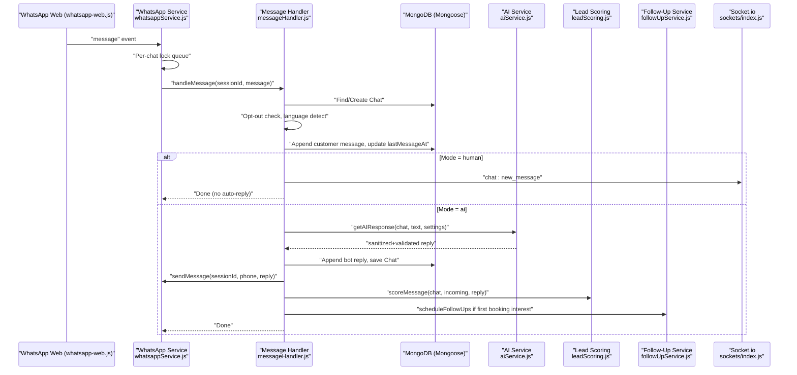

**Diagram sources**
- [whatsappService.js:258-290](file://backend/src/services/whatsappService.js#L258-L290)
- [messageHandler.js:22-178](file://backend/src/services/messageHandler.js#L22-L178)
- [aiService.js:640-800](file://backend/src/services/aiService.js#L640-L800)
- [leadScoring.js:38-163](file://backend/src/services/leadScoring.js#L38-L163)
- [followUpService.js:18-61](file://backend/src/services/followUpService.js#L18-L61)
- [index.js:18-63](file://backend/src/sockets/index.js#L18-L63)

## Detailed Component Analysis

### WhatsApp Session Management and Ingestion
- Multi-session architecture with LocalAuth persistence per number.
- Event-driven initialization: QR emission, ready/auth_failure/disconnected events.
- Auto-reconnect with exponential backoff; permanent unlink detected and handled by cleanup.
- Per-chat message queue locks ensure sequential processing per customer to avoid race conditions on Chat updates.
- Health checks every 2 minutes.

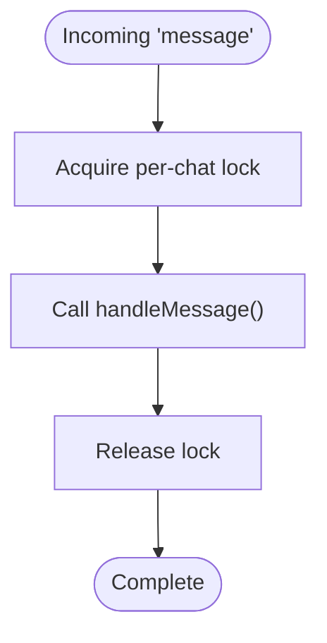

**Diagram sources**
- [whatsappService.js:258-290](file://backend/src/services/whatsappService.js#L258-L290)

**Section sources**
- [whatsappService.js:107-321](file://backend/src/services/whatsappService.js#L107-L321)
- [whatsappService.js:333-363](file://backend/src/services/whatsappService.js#L333-L363)
- [whatsappService.js:466-508](file://backend/src/services/whatsappService.js#L466-L508)
- [whatsappService.js:601-612](file://backend/src/services/whatsappService.js#L601-L612)

### Message Processing Pipeline
- Extract contact and text; ignore non-text.
- Emit typing indicator immediately for responsiveness.
- Load Settings; find or create Chat; handle opt-out phrases; detect language.
- Append customer message; cancel pending follow-ups upon engagement.
- If mode=human: persist and notify staff via Socket.io; no auto-reply.
- If mode=ai: generate AI response, append bot reply, save Chat, send via WhatsApp, score lead, schedule follow-ups on first booking interest.

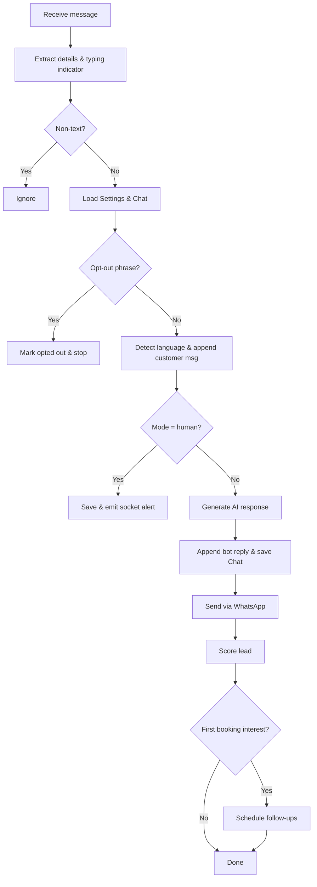

**Diagram sources**
- [messageHandler.js:22-178](file://backend/src/services/messageHandler.js#L22-L178)

**Section sources**
- [messageHandler.js:22-178](file://backend/src/services/messageHandler.js#L22-L178)

### AI Response Generation and Multi-Provider Fallback
- Providers: OpenRouter/OpenAI-compatible, Gemini, Cloudflare Workers AI, Groq, Cerebras, Ollama.
- Each provider call wrapped with timeout control, sanitization, length enforcement, and strict validation.
- Metrics tracked per provider (success/invalid/error counts, latency) with hourly reset.
- Fallback chain attempts providers until a valid reply is produced or all fail.

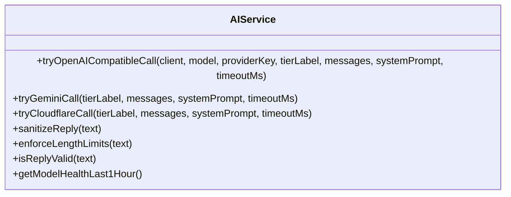

**Diagram sources**
- [aiService.js:649-727](file://backend/src/services/aiService.js#L649-L727)
- [aiService.js:734-774](file://backend/src/services/aiService.js#L734-L774)
- [aiService.js:781-800](file://backend/src/services/aiService.js#L781-L800)
- [aiService.js:213-289](file://backend/src/services/aiService.js#L213-L289)
- [aiService.js:477-546](file://backend/src/services/aiService.js#L477-L546)
- [aiService.js:402-471](file://backend/src/services/aiService.js#L402-L471)

**Section sources**
- [aiService.js:1-800](file://backend/src/services/aiService.js#L1-L800)

### Lead Scoring Workflow
- Heuristics award points for pricing interest, dates, guest counts, name/phone sharing, browsing signals, and explicit booking intent.
- Status transitions: cold (0–30), warm (31–60), hot (61–100).
- Emits hot lead alerts and AI failure alerts via Socket.io.

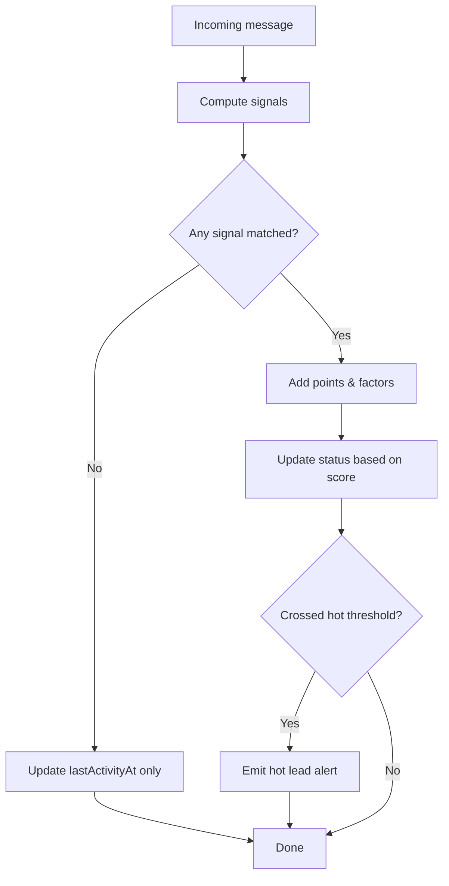

**Diagram sources**
- [leadScoring.js:38-163](file://backend/src/services/leadScoring.js#L38-L163)
- [leadScoring.js:171-182](file://backend/src/services/leadScoring.js#L171-L182)
- [leadScoring.js:192-202](file://backend/src/services/leadScoring.js#L192-L202)

**Section sources**
- [leadScoring.js:1-235](file://backend/src/services/leadScoring.js#L1-L235)

### Follow-Up Scheduling and Dispatch
- On first booking interest, schedules four follow-ups at 3h, 1d, 3d, 7d.
- Cancels pending follow-ups on customer reply, booking creation, opt-out, or human takeover.
- Cron runs every 5 minutes, processes due follow-ups sequentially, sends via WhatsApp, appends to Chat, and marks status.
- Skips archived/opted-out/human chats; cancels stale (>24h past due); retries next tick if session not connected.

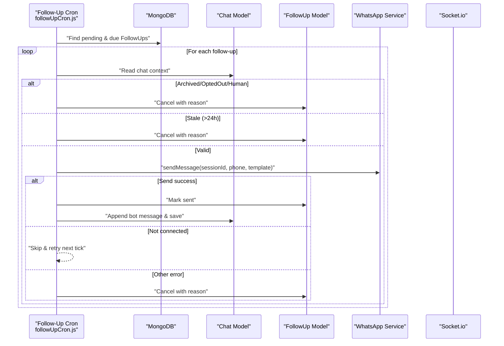

**Diagram sources**
- [followUpCron.js:127-163](file://backend/src/services/followUpCron.js#L127-L163)
- [followUpCron.js:33-122](file://backend/src/services/followUpCron.js#L33-L122)
- [followUpService.js:18-61](file://backend/src/services/followUpService.js#L18-L61)
- [followUpService.js:75-90](file://backend/src/services/followUpService.js#L75-L90)

**Section sources**
- [followUpService.js:1-126](file://backend/src/services/followUpService.js#L1-L126)
- [followUpCron.js:1-209](file://backend/src/services/followUpCron.js#L1-L209)

### Real-Time Updates via Socket.io
- Authentication middleware validates JWT and user status; joins users to dashboard room.
- Services emit events: new messages, session states, hot leads, AI failures.

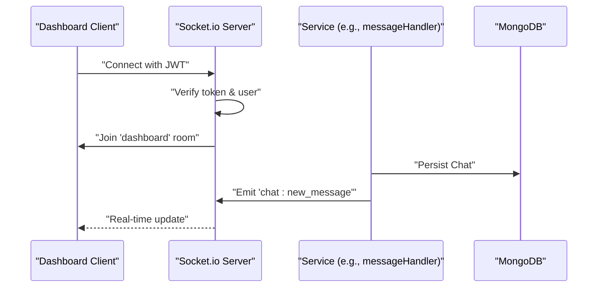

**Diagram sources**
- [index.js:18-63](file://backend/src/sockets/index.js#L18-L63)
- [messageHandler.js:110-123](file://backend/src/services/messageHandler.js#L110-L123)

**Section sources**
- [index.js:1-82](file://backend/src/sockets/index.js#L1-L82)

### Booking Automation Flow
- Conversational state captured in Chat.bookingStage and bookingDraft fields.
- When a booking is finalized, a Booking document is created and lead marked converted.
- Admin can list bookings and update statuses via API.

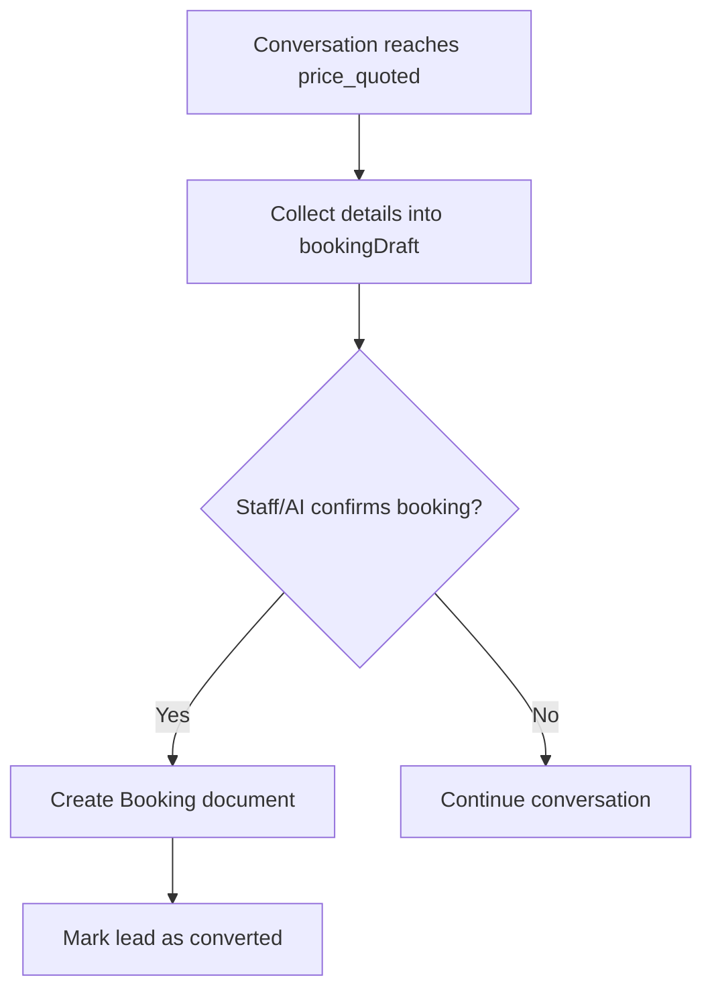

**Diagram sources**
- [Chat.js:45-97](file://backend/src/models/Chat.js#L45-L97)
- [Booking.js:8-60](file://backend/src/models/Booking.js#L8-L60)
- [bookingRoutes.js:11-31](file://backend/src/routes/bookingRoutes.js#L11-L31)
- [bookingRoutes.js:37-68](file://backend/src/routes/bookingRoutes.js#L37-L68)
- [leadScoring.js:209-226](file://backend/src/services/leadScoring.js#L209-L226)

**Section sources**
- [Chat.js:1-107](file://backend/src/models/Chat.js#L1-L107)
- [Booking.js:1-69](file://backend/src/models/Booking.js#L1-L69)
- [bookingRoutes.js:1-71](file://backend/src/routes/bookingRoutes.js#L1-L71)
- [leadScoring.js:209-226](file://backend/src/services/leadScoring.js#L209-L226)

### Error Handling and Retry Logic
- WhatsApp:
  - Auto-reconnect with exponential backoff up to 5 attempts; emits reconnect_failed after exhaustion.
  - Per-chat message queue prevents duplicate processing.
  - sendMessage retries once after 3 seconds on transient failure.
- AI:
  - Provider calls use AbortController timeouts; invalid outputs rejected and retried against next provider.
  - Per-provider metrics track errors and latencies.
- Follow-ups:
  - Cron skips disconnected sessions and retries next tick; cancels stale follow-ups older than 24 hours.
- Database:
  - Connection retry loop with max attempts before exit.

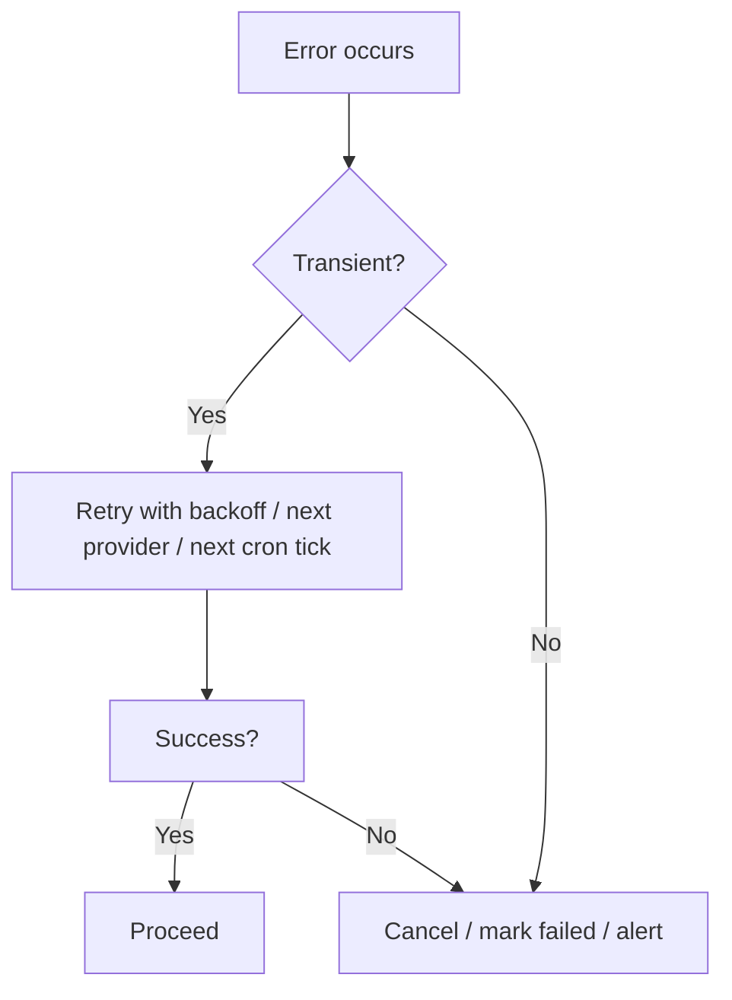

**Diagram sources**
- [whatsappService.js:333-363](file://backend/src/services/whatsappService.js#L333-L363)
- [whatsappService.js:466-508](file://backend/src/services/whatsappService.js#L466-L508)
- [aiService.js:649-727](file://backend/src/services/aiService.js#L649-L727)
- [followUpCron.js:127-163](file://backend/src/services/followUpCron.js#L127-L163)
- [db.js:10-29](file://backend/src/config/db.js#L10-L29)

**Section sources**
- [whatsappService.js:333-363](file://backend/src/services/whatsappService.js#L333-L363)
- [whatsappService.js:466-508](file://backend/src/services/whatsappService.js#L466-L508)
- [aiService.js:649-727](file://backend/src/services/aiService.js#L649-L727)
- [followUpCron.js:127-163](file://backend/src/services/followUpCron.js#L127-L163)
- [db.js:10-29](file://backend/src/config/db.js#L10-L29)

## Dependency Analysis
High-level dependencies between core modules:

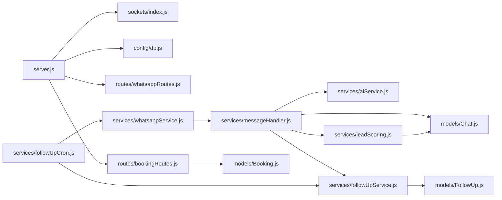

**Diagram sources**
- [server.js:1-241](file://backend/src/server.js#L1-L241)
- [whatsappService.js:1-642](file://backend/src/services/whatsappService.js#L1-L642)
- [messageHandler.js:1-183](file://backend/src/services/messageHandler.js#L1-L183)
- [aiService.js:1-800](file://backend/src/services/aiService.js#L1-L800)
- [leadScoring.js:1-235](file://backend/src/services/leadScoring.js#L1-L235)
- [followUpService.js:1-126](file://backend/src/services/followUpService.js#L1-L126)
- [followUpCron.js:1-209](file://backend/src/services/followUpCron.js#L1-L209)
- [Chat.js:1-107](file://backend/src/models/Chat.js#L1-L107)
- [FollowUp.js:1-49](file://backend/src/models/FollowUp.js#L1-L49)
- [Booking.js:1-69](file://backend/src/models/Booking.js#L1-L69)
- [whatsappRoutes.js:1-110](file://backend/src/routes/whatsappRoutes.js#L1-L110)
- [bookingRoutes.js:1-71](file://backend/src/routes/bookingRoutes.js#L1-L71)

**Section sources**
- [server.js:1-241](file://backend/src/server.js#L1-L241)

## Performance Considerations
- Per-chat message queue locks prevent contention on Chat writes.
- AI response cache for FAQ-type questions reduces external API calls; dynamic booking-related responses bypass cache to ensure freshness.
- Length and line limits on AI replies reduce payload size and improve readability.
- Provider metrics enable observability and potential routing improvements.
- Cron jobs run sequentially to avoid overwhelming WhatsApp API.
- Compression and rate limiting applied at the Express layer.

[No sources needed since this section provides general guidance]

## Troubleshooting Guide
Common issues and where to look:
- WhatsApp session not connecting or frequently disconnecting:
  - Check QR/pairing code events and reconnection attempts.
  - Verify session folder cleanup and lock file removal.
  - Review health check logs and session status endpoints.
- AI failures or invalid responses:
  - Inspect provider-specific diagnostics and rejection reasons.
  - Validate environment keys and model availability.
- Follow-ups not sending:
  - Confirm cron enabled in settings and timezone.
  - Ensure WhatsApp session is connected; stale follow-ups may be cancelled.
- Dashboard not receiving updates:
  - Verify Socket.io authentication and CORS configuration.
  - Confirm events emitted from services.

**Section sources**
- [whatsappService.js:152-210](file://backend/src/services/whatsappService.js#L152-L210)
- [whatsappService.js:333-363](file://backend/src/services/whatsappService.js#L333-L363)
- [aiService.js:649-727](file://backend/src/services/aiService.js#L649-L727)
- [followUpCron.js:127-163](file://backend/src/services/followUpCron.js#L127-L163)
- [index.js:18-63](file://backend/src/sockets/index.js#L18-L63)

## Conclusion
The Nandibaag Bot implements a robust, event-driven architecture that ingests WhatsApp messages, orchestrates AI responses across multiple providers, persists conversation state, scores leads, and automates follow-ups. Real-time Socket.io updates keep the dashboard synchronized. The design emphasizes resilience through retries, backoffs, and careful error handling, while optimizing performance via caching and concurrency controls.