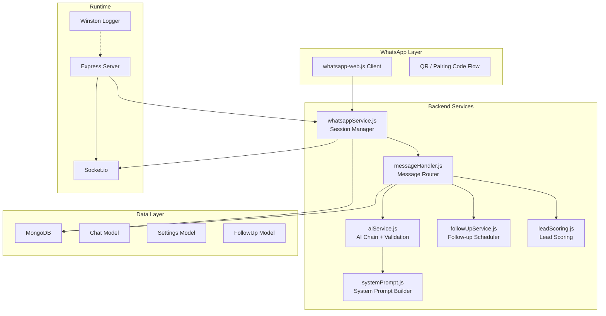
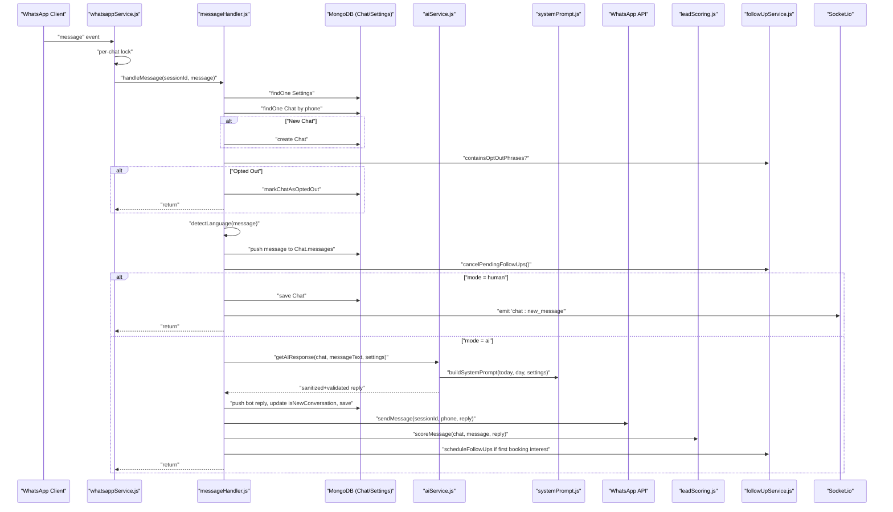
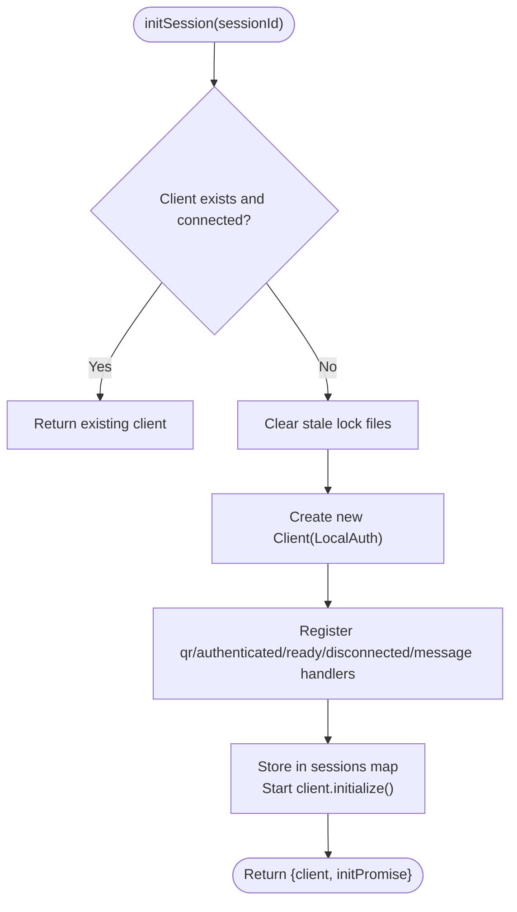
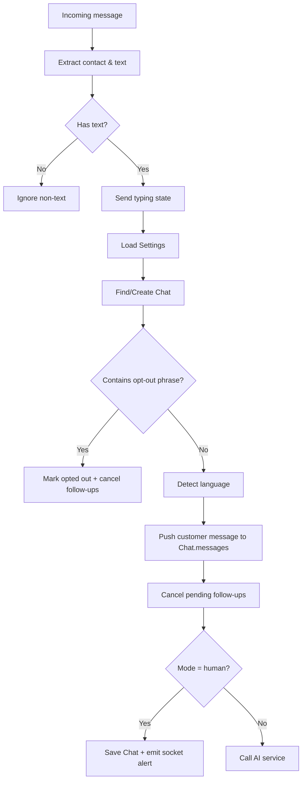
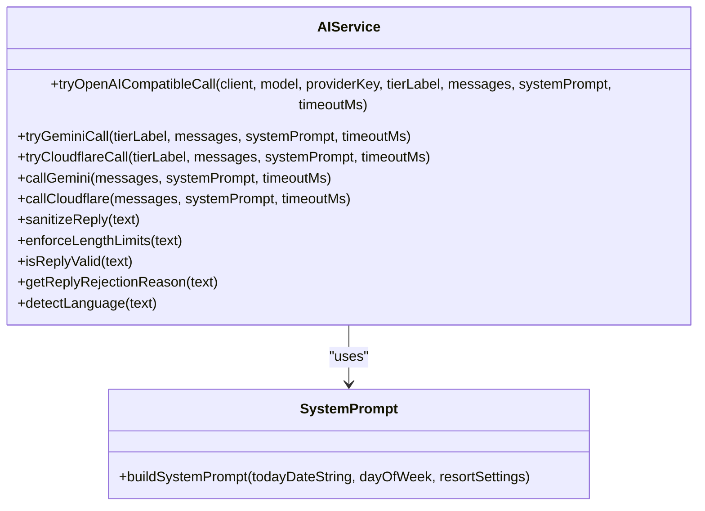
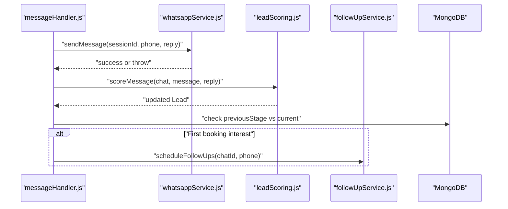
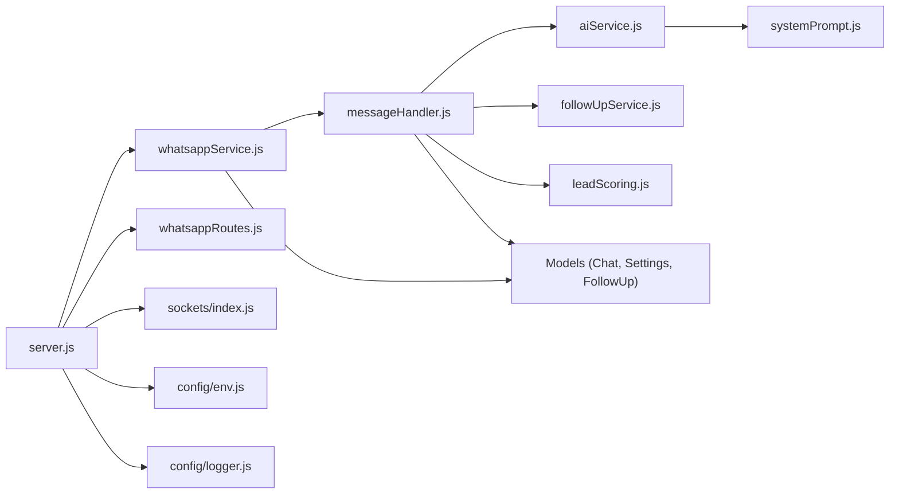

# Message Processing Pipeline

<cite>
**Referenced Files in This Document**
- [server.js](file://backend/src/server.js)
- [whatsappService.js](file://backend/src/services/whatsappService.js)
- [messageHandler.js](file://backend/src/services/messageHandler.js)
- [aiService.js](file://backend/src/services/aiService.js)
- [systemPrompt.js](file://backend/src/services/systemPrompt.js)
- [followUpService.js](file://backend/src/services/followUpService.js)
- [leadScoring.js](file://backend/src/services/leadScoring.js)
- [Chat.js](file://backend/src/models/Chat.js)
- [Settings.js](file://backend/src/models/Settings.js)
- [FollowUp.js](file://backend/src/models/FollowUp.js)
- [logger.js](file://backend/src/config/logger.js)
- [env.js](file://backend/src/config/env.js)
- [whatsappRoutes.js](file://backend/src/routes/whatsappRoutes.js)
</cite>

## Table of Contents
1. [Introduction](#introduction)
2. [Project Structure](#project-structure)
3. [Core Components](#core-components)
4. [Architecture Overview](#architecture-overview)
5. [Detailed Component Analysis](#detailed-component-analysis)
6. [Dependency Analysis](#dependency-analysis)
7. [Performance Considerations](#performance-considerations)
8. [Troubleshooting Guide](#troubleshooting-guide)
9. [Conclusion](#conclusion)

## Introduction
This document explains the end-to-end message processing pipeline for Nandibaag Bot, from incoming WhatsApp messages to validation, chat state management, AI response generation, and final delivery. It covers routing logic, conversation state tracking, language detection, opt-out handling, error recovery, timing analysis, performance optimizations, and debugging strategies.

## Project Structure
The backend is an Express application that:
- Manages multiple WhatsApp sessions using whatsapp-web.js with LocalAuth persistence
- Routes incoming messages through a per-chat queue to avoid race conditions
- Persists conversation state in MongoDB via Mongoose models (Chat, Settings, FollowUp)
- Generates AI responses via a multi-provider chain (OpenRouter, Gemini, Groq, Cloudflare, Cerebras, Ollama)
- Schedules follow-ups and scores leads based on conversation signals
- Emits real-time events via Socket.io to the dashboard

**Diagram sources**
- [server.js:102-110](file://backend/src/server.js#L102-L110)
- [whatsappService.js:258-290](file://backend/src/services/whatsappService.js#L258-L290)
- [messageHandler.js:22-178](file://backend/src/services/messageHandler.js#L22-L178)
- [aiService.js:640-800](file://backend/src/services/aiService.js#L640-L800)
- [systemPrompt.js:9-91](file://backend/src/services/systemPrompt.js#L9-L91)
- [followUpService.js:18-61](file://backend/src/services/followUpService.js#L18-L61)
- [leadScoring.js:38-163](file://backend/src/services/leadScoring.js#L38-L163)
- [Chat.js:45-106](file://backend/src/models/Chat.js#L45-L106)
- [Settings.js:16-37](file://backend/src/models/Settings.js#L16-L37)
- [FollowUp.js:3-48](file://backend/src/models/FollowUp.js#L3-L48)
- [logger.js:46-51](file://backend/src/config/logger.js#L46-L51)

**Section sources**
- [server.js:110-174](file://backend/src/server.js#L110-L174)
- [whatsappService.js:107-321](file://backend/src/services/whatsappService.js#L107-L321)
- [messageHandler.js:22-178](file://backend/src/services/messageHandler.js#L22-L178)

## Core Components
- Session Manager (whatsappService.js): Initializes and manages multiple WhatsApp sessions, handles QR/pairing code flows, auto-reconnects with exponential backoff, enforces per-chat message queues, and emits status events.
- Message Handler (messageHandler.js): Orchestrates message flow—validation, mode routing (AI/human), opt-out checks, language detection, state updates, AI call, reply sending, lead scoring, and follow-up scheduling.
- AI Service (aiService.js): Multi-provider chain with fallbacks, prompt building, output sanitization, length enforcement, and strict reply validation; includes in-memory cache for FAQ-type questions.
- System Prompt (systemPrompt.js): Builds contextual system instructions including resort info, pricing, policies, link rules, language guidance, and conversation flow constraints.
- Follow-up Service (followUpService.js): Schedules staged follow-ups and cancels them when customers engage or opt out.
- Lead Scoring (leadScoring.js): Assigns points based on signals (pricing interest, dates, guest counts, intent phrases) and emits hot-lead alerts.
- Models (Chat.js, Settings.js, FollowUp.js): Persist conversation state, settings, and scheduled follow-ups with appropriate indexes.
- Logging (logger.js): Winston-based logging to console and files.

**Section sources**
- [whatsappService.js:20-50](file://backend/src/services/whatsappService.js#L20-L50)
- [messageHandler.js:8-21](file://backend/src/services/messageHandler.js#L8-L21)
- [aiService.js:186-208](file://backend/src/services/aiService.js#L186-L208)
- [systemPrompt.js:9-91](file://backend/src/services/systemPrompt.js#L9-L91)
- [followUpService.js:18-61](file://backend/src/services/followUpService.js#L18-L61)
- [leadScoring.js:15-37](file://backend/src/services/leadScoring.js#L15-L37)
- [Chat.js:45-106](file://backend/src/models/Chat.js#L45-L106)
- [Settings.js:16-37](file://backend/src/models/Settings.js#L16-L37)
- [FollowUp.js:3-48](file://backend/src/models/FollowUp.js#L3-L48)
- [logger.js:46-51](file://backend/src/config/logger.js#L46-L51)

## Architecture Overview
The pipeline follows a clear sequence:
1. WhatsApp client receives a message event.
2. Per-chat lock ensures sequential processing per customer.
3. Message handler validates input, loads settings, finds/creates Chat, checks opt-out, detects language, updates state.
4. If AI mode: build system prompt, run AI chain, validate/sanitize reply, send via WhatsApp, score lead, schedule follow-ups.
5. If human mode: save message and notify staff via Socket.io.
6. Errors are logged and surfaced to the dashboard; retries and fallbacks are applied at the AI layer.

**Diagram sources**
- [whatsappService.js:258-290](file://backend/src/services/whatsappService.js#L258-L290)
- [messageHandler.js:22-178](file://backend/src/services/messageHandler.js#L22-L178)
- [aiService.js:640-800](file://backend/src/services/aiService.js#L640-L800)
- [systemPrompt.js:9-91](file://backend/src/services/systemPrompt.js#L9-L91)
- [followUpService.js:18-61](file://backend/src/services/followUpService.js#L18-L61)
- [leadScoring.js:38-163](file://backend/src/services/leadScoring.js#L38-L163)
- [Chat.js:45-106](file://backend/src/models/Chat.js#L45-L106)
- [Settings.js:16-37](file://backend/src/models/Settings.js#L16-L37)

## Detailed Component Analysis

### WhatsApp Session Management
- Multi-session architecture: Map of sessionId to Client instances; LocalAuth persists session data per number.
- Initialization: Non-blocking initSession registers listeners, starts initialize(), emits QR/pairing code/ready/init_failed events.
- Auto-reconnect: Exponential backoff up to 5 attempts; permanent disconnects (logout/unpaired) trigger cleanup and UI alerts.
- Message queuing: Per-chat locks prevent concurrent updates to the same Chat document.
- Health checks: Cron job periodically checks session states.

**Diagram sources**
- [whatsappService.js:107-321](file://backend/src/services/whatsappService.js#L107-L321)

**Section sources**
- [whatsappService.js:40-92](file://backend/src/services/whatsappService.js#L40-L92)
- [whatsappService.js:107-321](file://backend/src/services/whatsappService.js#L107-L321)
- [whatsappService.js:333-363](file://backend/src/services/whatsappService.js#L333-L363)
- [whatsappService.js:601-612](file://backend/src/services/whatsappService.js#L601-L612)

### Message Routing and State Management
- Input validation: Ignores non-text messages; triggers typing indicator immediately.
- Settings retrieval: Loads global defaults and active numbers.
- Chat lifecycle: Finds or creates Chat; initializes default fields (mode, language, stages).
- Opt-out handling: Detects opt-out phrases and marks chat opted out; cancels pending follow-ups.
- Language detection: Heuristic detection updates Chat.language.
- Mode routing: Human mode saves message and notifies staff; AI mode proceeds to response generation.
- Conversation state: Updates isNewConversation, lastMessageAt, and pushes messages array entries.

**Diagram sources**
- [messageHandler.js:22-124](file://backend/src/services/messageHandler.js#L22-L124)
- [followUpService.js:98-118](file://backend/src/services/followUpService.js#L98-L118)
- [aiService.js:594-637](file://backend/src/services/aiService.js#L594-L637)

**Section sources**
- [messageHandler.js:22-124](file://backend/src/services/messageHandler.js#L22-L124)
- [Chat.js:45-106](file://backend/src/models/Chat.js#L45-L106)
- [Settings.js:16-37](file://backend/src/models/Settings.js#L16-L37)

### AI Response Generation and Validation
- Provider chain: Attempts multiple providers (OpenRouter primary, then Gemini, Groq, Cloudflare, Cerebras, Ollama in test mode) with timeouts and metrics.
- Prompt building: Uses systemPrompt.js to inject resort context, pricing, policies, link rules, and conversation flow constraints.
- Output sanitization: Strips reasoning tags, markdown, bold, headers, links; enforces line and character limits.
- Reply validation: Enforces length, script whitelist, markdown/code syntax checks, repeated word checks, English blacklist, vowel presence, truncation patterns.
- In-memory cache: Short-lived cache for FAQ-like queries keyed by hash of last message and booking stage.

**Diagram sources**
- [aiService.js:649-727](file://backend/src/services/aiService.js#L649-L727)
- [aiService.js:734-774](file://backend/src/services/aiService.js#L734-L774)
- [aiService.js:781-800](file://backend/src/services/aiService.js#L781-L800)
- [aiService.js:213-289](file://backend/src/services/aiService.js#L213-L289)
- [aiService.js:477-588](file://backend/src/services/aiService.js#L477-L588)
- [aiService.js:594-637](file://backend/src/services/aiService.js#L594-L637)
- [systemPrompt.js:9-91](file://backend/src/services/systemPrompt.js#L9-L91)

**Section sources**
- [aiService.js:186-208](file://backend/src/services/aiService.js#L186-L208)
- [aiService.js:213-289](file://backend/src/services/aiService.js#L213-L289)
- [aiService.js:477-588](file://backend/src/services/aiService.js#L477-L588)
- [aiService.js:594-637](file://backend/src/services/aiService.js#L594-L637)
- [systemPrompt.js:9-91](file://backend/src/services/systemPrompt.js#L9-L91)

### Delivery and Post-processing
- Sending replies: Validates session connectivity, formats JID, retries once after delay.
- Lead scoring: Awards points for pricing interest, date/guest inputs, name/phone, browsing signals, booking intent; updates status and emits hot-lead alerts.
- Follow-up scheduling: Creates staged follow-ups when booking interest emerges; cancels on engagement or opt-out.
- Error recovery: AI failures log errors and emit alerts; WhatsApp send retries; per-chat locks ensure consistency.

**Diagram sources**
- [messageHandler.js:146-161](file://backend/src/services/messageHandler.js#L146-L161)
- [whatsappService.js:466-508](file://backend/src/services/whatsappService.js#L466-L508)
- [leadScoring.js:38-163](file://backend/src/services/leadScoring.js#L38-L163)
- [followUpService.js:18-61](file://backend/src/services/followUpService.js#L18-L61)

**Section sources**
- [whatsappService.js:466-508](file://backend/src/services/whatsappService.js#L466-L508)
- [leadScoring.js:38-163](file://backend/src/services/leadScoring.js#L38-L163)
- [followUpService.js:18-61](file://backend/src/services/followUpService.js#L18-L61)

## Dependency Analysis
- Server bootstraps Express, Socket.io, routes, and services; sets Socket.io instance for services and restarts active WhatsApp sessions.
- WhatsApp routes expose endpoints to manage sessions (initialize, pairing code, destroy) and query statuses.
- Message flow depends on models (Chat, Settings, FollowUp) and services (AI, follow-ups, lead scoring).
- Logging is centralized via Winston; environment variables validated via Joi.

**Diagram sources**
- [server.js:102-110](file://backend/src/server.js#L102-L110)
- [whatsappRoutes.js:1-110](file://backend/src/routes/whatsappRoutes.js#L1-L110)
- [whatsappService.js:258-290](file://backend/src/services/whatsappService.js#L258-L290)
- [messageHandler.js:22-178](file://backend/src/services/messageHandler.js#L22-L178)
- [aiService.js:640-800](file://backend/src/services/aiService.js#L640-L800)
- [systemPrompt.js:9-91](file://backend/src/services/systemPrompt.js#L9-L91)
- [env.js:48-94](file://backend/src/config/env.js#L48-L94)
- [logger.js:46-51](file://backend/src/config/logger.js#L46-L51)

**Section sources**
- [server.js:110-174](file://backend/src/server.js#L110-L174)
- [whatsappRoutes.js:1-110](file://backend/src/routes/whatsappRoutes.js#L1-L110)
- [env.js:48-94](file://backend/src/config/env.js#L48-L94)
- [logger.js:46-51](file://backend/src/config/logger.js#L46-L51)

## Performance Considerations
- Per-chat message queue locks: Prevents race conditions and reduces contention on Chat documents.
- Typing indicator fire-and-forget: Improves perceived responsiveness without blocking processing.
- AI provider chain with timeouts: Limits latency exposure; invalid outputs are rejected early to avoid downstream costs.
- In-memory FAQ cache: Reduces API calls for repetitive static-info queries; TTL prevents staleness.
- Length enforcement and sanitization: Keeps responses concise and safe, reducing bandwidth and parsing overhead.
- Health check cron: Periodic monitoring helps detect degraded sessions proactively.
- Retry on send: One retry with short delay increases resilience against transient network issues.

[No sources needed since this section provides general guidance]

## Troubleshooting Guide
- Session not initialized or disconnected:
  - Verify session status via GET /api/whatsapp/sessions; watch for 'connecting'/'disconnected'.
  - Use POST /api/whatsapp/sessions to start initialization; listen for 'whatsapp:qr', 'whatsapp:ready', 'whatsapp:init_failed'.
  - For permanent unlink, reconnect via QR/pairing code; session folder cleanup occurs automatically.
- AI failures:
  - Check logs for provider-specific errors and rejection reasons; review sanitized vs raw replies.
  - Ensure required API keys and models are configured in environment variables.
- Opt-out handling:
  - Confirm opt-out phrases are detected; verify follow-ups are cancelled and chat marked opted out.
- Lead scoring anomalies:
  - Inspect score factors and thresholds; confirm hot-lead alerts are emitted when crossing thresholds.
- Database indexing:
  - Ensure indexes exist on frequently queried fields (customerPhone, lastMessageAt, mode, bookingStage, isArchived, language).

**Section sources**
- [whatsappRoutes.js:13-60](file://backend/src/routes/whatsappRoutes.js#L13-L60)
- [whatsappService.js:212-256](file://backend/src/services/whatsappService.js#L212-L256)
- [aiService.js:697-727](file://backend/src/services/aiService.js#L697-L727)
- [followUpService.js:98-118](file://backend/src/services/followUpService.js#L98-L118)
- [leadScoring.js:171-202](file://backend/src/services/leadScoring.js#L171-L202)
- [Chat.js:99-106](file://backend/src/models/Chat.js#L99-L106)

## Conclusion
Nandibaag Bot’s message processing pipeline is designed for reliability, clarity, and scalability. The per-chat queue ensures consistent state updates, while the multi-provider AI chain with robust validation safeguards response quality. Opt-out handling, follow-up scheduling, and lead scoring integrate seamlessly into the flow, and comprehensive logging plus Socket.io events enable effective monitoring and troubleshooting.