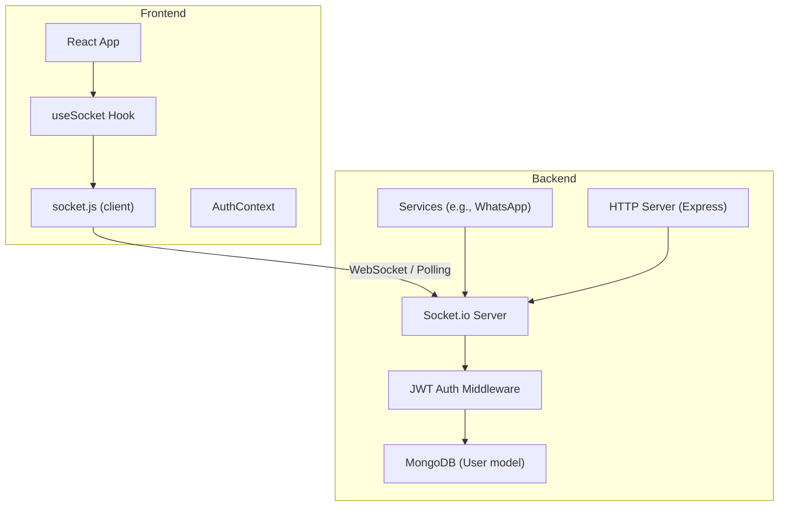
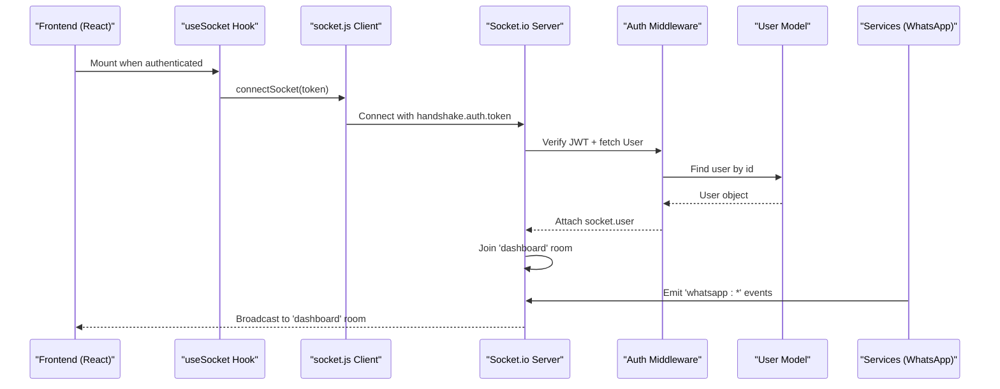
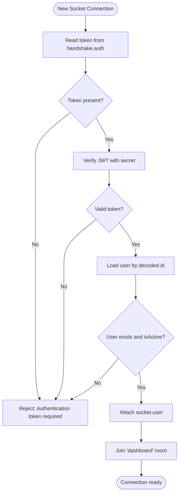
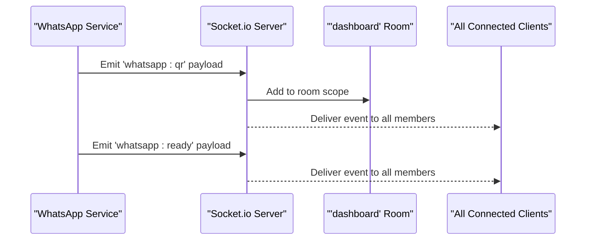
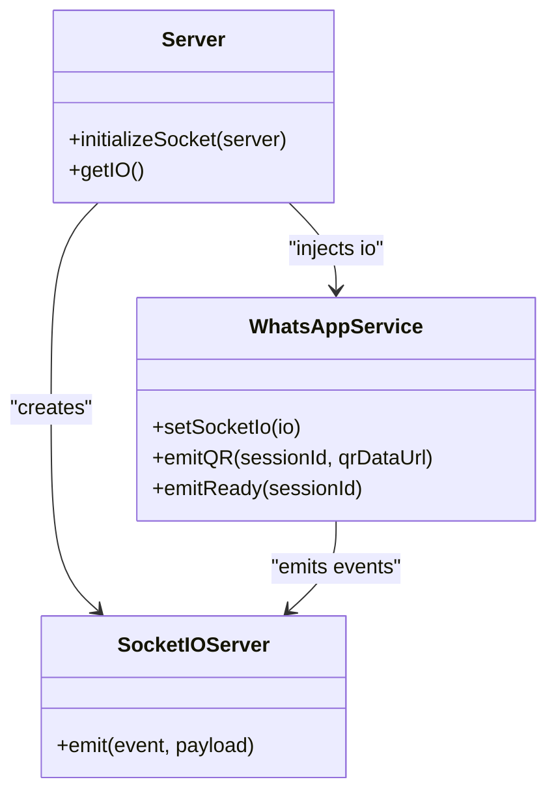
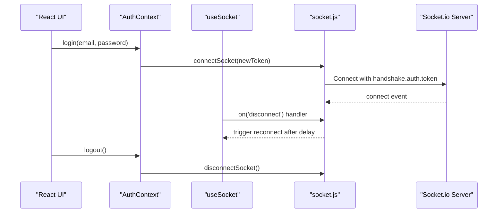
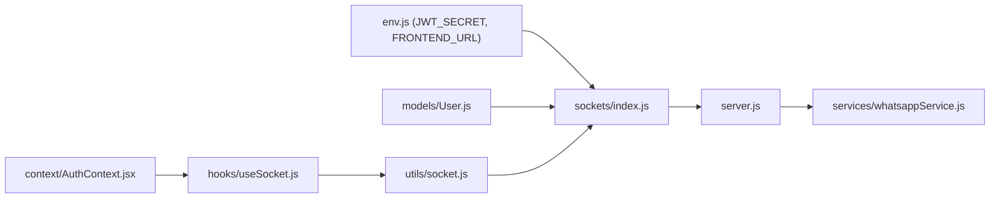

# Real-time Communication

<cite>
**Referenced Files in This Document**
- [server.js](file://backend/src/server.js)
- [index.js](file://backend/src/sockets/index.js)
- [env.js](file://backend/src/config/env.js)
- [auth.js](file://backend/src/middleware/auth.js)
- [User.js](file://backend/src/models/User.js)
- [whatsappService.js](file://backend/src/services/whatsappService.js)
- [AuthContext.jsx](file://frontend/src/context/AuthContext.jsx)
- [useSocket.js](file://frontend/src/hooks/useSocket.js)
- [socket.js](file://frontend/src/utils/socket.js)
</cite>

## Table of Contents
1. [Introduction](#introduction)
2. [Project Structure](#project-structure)
3. [Core Components](#core-components)
4. [Architecture Overview](#architecture-overview)
5. [Detailed Component Analysis](#detailed-component-analysis)
6. [Dependency Analysis](#dependency-analysis)
7. [Performance Considerations](#performance-considerations)
8. [Troubleshooting Guide](#troubleshooting-guide)
9. [Conclusion](#conclusion)

## Introduction
This document explains the real-time communication system built with Socket.io across the backend and frontend. It covers connection establishment, authentication middleware, event broadcasting patterns, room-based messaging, client-side socket management, and lifecycle handling. The system supports live dashboard updates, chat notifications, and system alerts through an event-driven architecture. It also documents error handling, reconnection strategies, and performance considerations for high-concurrency scenarios.

## Project Structure
The real-time layer is implemented as a thin integration over the HTTP server:
- Backend initializes Socket.io on the same HTTP server, applies JWT-based authentication middleware, joins authenticated users to a shared room, and exposes a helper for services to emit events.
- Frontend manages a singleton socket instance, connects with JWT via handshake auth, and handles reconnection logic.

**Diagram sources**
- [server.js:102-108](file://backend/src/server.js#L102-L108)
- [index.js:18-63](file://backend/src/sockets/index.js#L18-L63)
- [whatsappService.js:15-17](file://backend/src/services/whatsappService.js#L15-L17)
- [AuthContext.jsx:21-36](file://frontend/src/context/AuthContext.jsx#L21-L36)
- [useSocket.js:13-46](file://frontend/src/hooks/useSocket.js#L13-L46)
- [socket.js:13-44](file://frontend/src/utils/socket.js#L13-L44)

**Section sources**
- [server.js:102-108](file://backend/src/server.js#L102-L108)
- [index.js:18-63](file://backend/src/sockets/index.js#L18-L63)
- [AuthContext.jsx:21-36](file://frontend/src/context/AuthContext.jsx#L21-L36)
- [useSocket.js:13-46](file://frontend/src/hooks/useSocket.js#L13-L46)
- [socket.js:13-44](file://frontend/src/utils/socket.js#L13-L44)

## Core Components
- Socket.io initialization and configuration
  - CORS configured from environment; accepts GET/POST methods.
  - Authentication middleware validates JWT passed in handshake.auth.token and attaches user to socket.
  - On connection, authenticated sockets join a shared room for broadcast-style updates.
  - Exposes getIO() so services can emit events without circular imports.
- HTTP server integration
  - Initializes Socket.io before starting the server and injects the io instance into services.
- Frontend client
  - Singleton socket created with handshake auth token.
  - Reconnection enabled with attempts and delay caps.
  - React hook coordinates connect/disconnect based on authentication state.

**Section sources**
- [index.js:18-63](file://backend/src/sockets/index.js#L18-L63)
- [index.js:71-76](file://backend/src/sockets/index.js#L71-L76)
- [server.js:102-108](file://backend/src/server.js#L102-L108)
- [socket.js:13-44](file://frontend/src/utils/socket.js#L13-L44)
- [useSocket.js:13-46](file://frontend/src/hooks/useSocket.js#L13-L46)

## Architecture Overview
The system follows an event-driven pattern:
- Clients authenticate via JWT and establish a WebSocket or polling transport.
- The server verifies tokens, loads user data, and allows only active users.
- Authenticated clients are joined to a common room to receive broadcasts.
- Services emit domain-specific events (e.g., WhatsApp session status) to the frontend.

**Diagram sources**
- [AuthContext.jsx:53-66](file://frontend/src/context/AuthContext.jsx#L53-L66)
- [useSocket.js:17-43](file://frontend/src/hooks/useSocket.js#L17-L43)
- [socket.js:13-44](file://frontend/src/utils/socket.js#L13-L44)
- [index.js:27-60](file://backend/src/sockets/index.js#L27-L60)
- [whatsappService.js:152-194](file://backend/src/services/whatsappService.js#L152-L194)

## Detailed Component Analysis

### Backend Socket Initialization and Authentication
- Initialization
  - Creates a Socket.io server bound to the HTTP server with CORS settings.
  - Provides initializeSocket(httpServer) and getIO() helpers.
- Authentication middleware
  - Reads token from socket.handshake.auth.token.
  - Verifies JWT using the configured secret and looks up the user.
  - Rejects connections if token is missing, invalid, expired, or user is inactive.
  - Attaches the resolved user to socket.user for downstream handlers.
- Connection lifecycle
  - Logs connection and disconnection events.
  - Joins every authenticated socket to a shared room for broadcast-style updates.

**Diagram sources**
- [index.js:27-60](file://backend/src/sockets/index.js#L27-L60)
- [env.js:56-69](file://backend/src/config/env.js#L56-L69)
- [User.js:1-38](file://backend/src/models/User.js#L1-L38)

**Section sources**
- [index.js:18-63](file://backend/src/sockets/index.js#L18-L63)
- [env.js:56-69](file://backend/src/config/env.js#L56-L69)
- [User.js:1-38](file://backend/src/models/User.js#L1-L38)

### Room-Based Messaging and Broadcasting
- All authenticated sockets join a single room named 'dashboard'.
- Any service that holds the io instance can emit events to this room to update all connected dashboards simultaneously.
- This pattern is used for live status updates such as WhatsApp session readiness and QR prompts.

**Diagram sources**
- [index.js:50-60](file://backend/src/sockets/index.js#L50-L60)
- [whatsappService.js:152-194](file://backend/src/services/whatsappService.js#L152-L194)

**Section sources**
- [index.js:50-60](file://backend/src/sockets/index.js#L50-L60)
- [whatsappService.js:152-194](file://backend/src/services/whatsappService.js#L152-L194)

### Service Integration Points
- Services receive the global io instance via setters during server startup.
- Example: WhatsApp service emits QR codes and readiness events to the frontend.
- This decouples business logic from transport concerns and avoids circular imports.

**Diagram sources**
- [server.js:102-108](file://backend/src/server.js#L102-L108)
- [whatsappService.js:15-17](file://backend/src/services/whatsappService.js#L15-L17)
- [whatsappService.js:152-194](file://backend/src/services/whatsappService.js#L152-L194)

**Section sources**
- [server.js:102-108](file://backend/src/server.js#L102-L108)
- [whatsappService.js:15-17](file://backend/src/services/whatsappService.js#L15-L17)
- [whatsappService.js:152-194](file://backend/src/services/whatsappService.js#L152-L194)

### Frontend Socket Management
- Singleton client creation
  - Uses a module-level variable to ensure one socket per process.
  - Configured with transports fallback (websocket then polling), reconnection enabled, and attempt/delay limits.
- React hook orchestration
  - Connects when authenticated and token is available.
  - Subscribes to disconnect events and attempts to reconnect after a short delay.
  - Cleans up listeners and disconnects when unauthenticated or component unmounts.
- Context integration
  - On login, sets token and immediately connects the socket.
  - On logout, clears token and disconnects the socket.

**Diagram sources**
- [AuthContext.jsx:53-86](file://frontend/src/context/AuthContext.jsx#L53-L86)
- [useSocket.js:17-43](file://frontend/src/hooks/useSocket.js#L17-L43)
- [socket.js:13-44](file://frontend/src/utils/socket.js#L13-L44)

**Section sources**
- [socket.js:13-44](file://frontend/src/utils/socket.js#L13-L44)
- [useSocket.js:13-46](file://frontend/src/hooks/useSocket.js#L13-L46)
- [AuthContext.jsx:53-86](file://frontend/src/context/AuthContext.jsx#L53-L86)

### Event-Driven Patterns for Live Updates
- Dashboard updates
  - Authenticated clients join 'dashboard' and receive broadcasts for system-wide events.
- Chat notifications
  - Services can emit chat-related events to the 'dashboard' room for staff to see new messages or statuses.
- System alerts
  - Global alerts (e.g., maintenance notices) can be emitted to the same room for immediate visibility.

[No sources needed since this section describes conceptual usage patterns]

## Dependency Analysis
Key dependencies and relationships:
- Backend
  - Express HTTP server hosts Socket.io.
  - Socket.io uses JWT secret from environment and User model for lookup.
  - Services depend on the injected io instance to emit events.
- Frontend
  - React components rely on useSocket hook and socket.js utilities.
  - AuthContext drives connection lifecycle based on token presence.

**Diagram sources**
- [env.js:56-69](file://backend/src/config/env.js#L56-L69)
- [index.js:18-63](file://backend/src/sockets/index.js#L18-L63)
- [User.js:1-38](file://backend/src/models/User.js#L1-L38)
- [server.js:102-108](file://backend/src/server.js#L102-L108)
- [whatsappService.js:15-17](file://backend/src/services/whatsappService.js#L15-L17)
- [AuthContext.jsx:21-36](file://frontend/src/context/AuthContext.jsx#L21-L36)
- [useSocket.js:13-46](file://frontend/src/hooks/useSocket.js#L13-L46)
- [socket.js:13-44](file://frontend/src/utils/socket.js#L13-L44)

**Section sources**
- [env.js:56-69](file://backend/src/config/env.js#L56-L69)
- [index.js:18-63](file://backend/src/sockets/index.js#L18-L63)
- [User.js:1-38](file://backend/src/models/User.js#L1-L38)
- [server.js:102-108](file://backend/src/server.js#L102-L108)
- [AuthContext.jsx:21-36](file://frontend/src/context/AuthContext.jsx#L21-L36)
- [useSocket.js:13-46](file://frontend/src/hooks/useSocket.js#L13-L46)
- [socket.js:13-44](file://frontend/src/utils/socket.js#L13-L44)

## Performance Considerations
- Transport selection
  - Prefer WebSocket; fall back to polling for compatibility.
- Reconnection tuning
  - Limit reconnection attempts and cap delays to avoid thundering herds.
- Room scoping
  - Keep rooms small and targeted to reduce broadcast fan-out.
- Emission batching
  - Coalesce multiple rapid updates into fewer emissions where possible.
- Memory and concurrency
  - Avoid heavy synchronous work inside event handlers.
  - Offload long-running tasks to background jobs and emit lightweight status updates.
- CORS and security
  - Restrict allowed origins and validate tokens strictly.

[No sources needed since this section provides general guidance]

## Troubleshooting Guide
Common issues and resolutions:
- Missing or invalid token
  - Ensure the client sends a valid JWT in handshake.auth.token.
  - Check server logs for authentication errors and verify JWT secret configuration.
- Inactive or non-existent user
  - Confirm the user record exists and is active before allowing socket connections.
- Disconnections and reconnection loops
  - Inspect client-side disconnect reasons and adjust reconnection parameters.
  - Validate network connectivity and firewall rules for WebSocket ports.
- CORS failures
  - Ensure FRONTEND_URL matches the browser origin and is accepted by the server.
- Service emission not received
  - Verify the io instance is set before emitting and that clients are joined to the correct room.

**Section sources**
- [index.js:27-48](file://backend/src/sockets/index.js#L27-L48)
- [index.js:50-60](file://backend/src/sockets/index.js#L50-L60)
- [socket.js:31-41](file://frontend/src/utils/socket.js#L31-L41)
- [useSocket.js:22-37](file://frontend/src/hooks/useSocket.js#L22-L37)
- [env.js:19](file://backend/src/config/env.js#L19)

## Conclusion
The real-time layer integrates Socket.io tightly with the existing Express server and JWT-based authentication. Authenticated clients join a shared room to receive broadcasts, while services emit domain events to keep dashboards current. The frontend manages a resilient socket connection with automatic reconnection and lifecycle-aware cleanup. For high-concurrency environments, focus on efficient room scoping, controlled reconnection behavior, and asynchronous event processing to maintain responsiveness and stability.