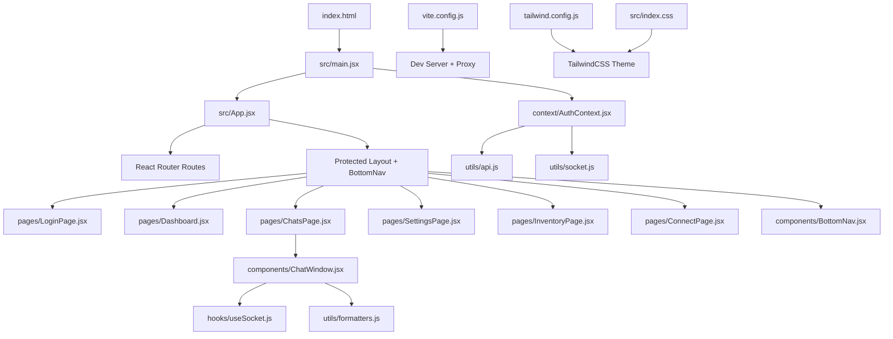
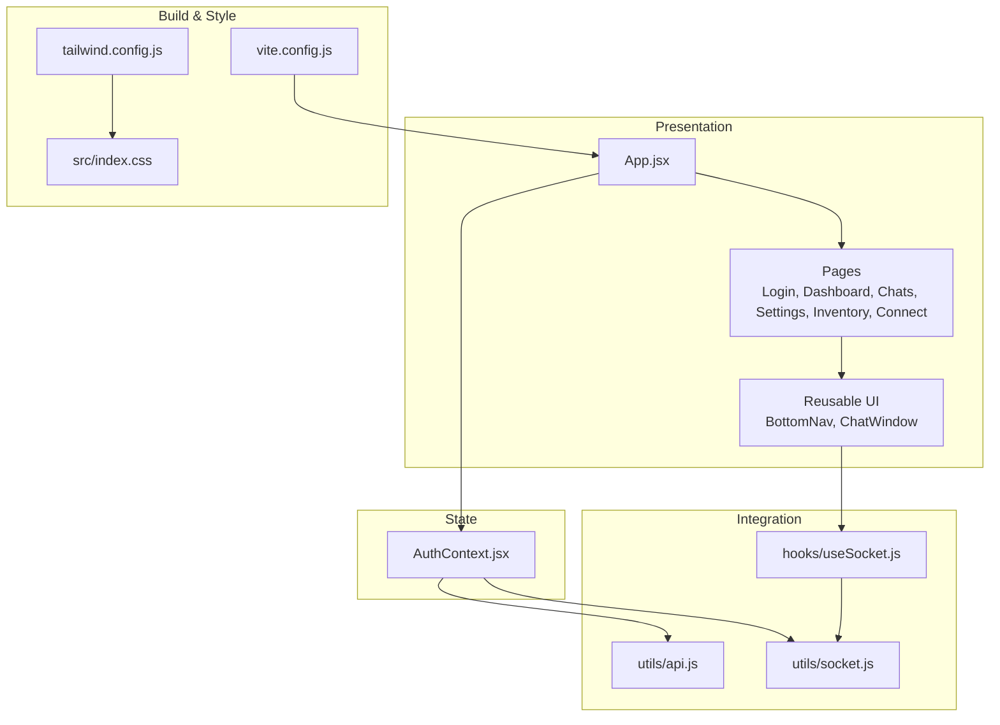
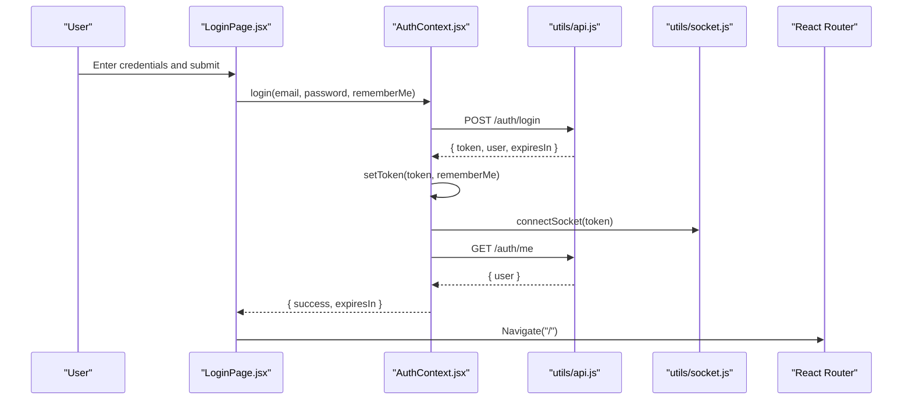
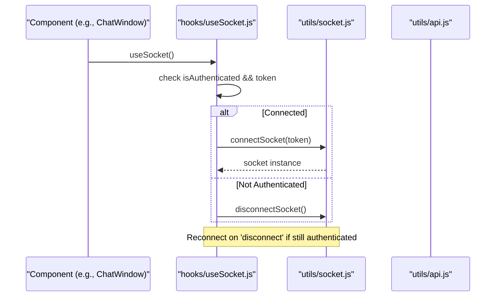
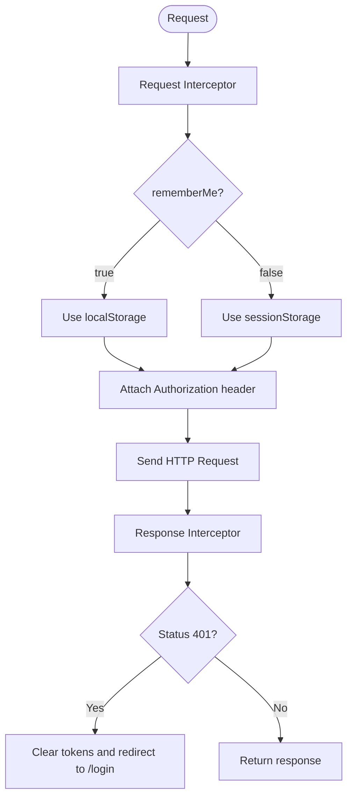
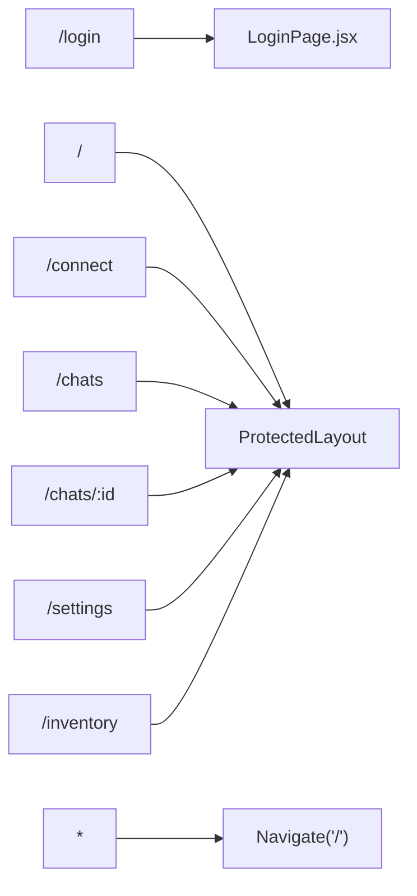
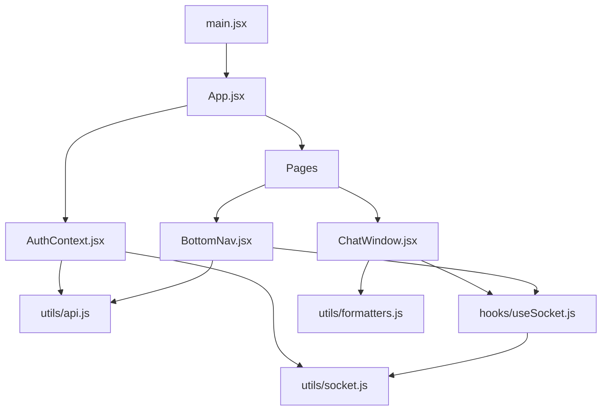

# Frontend Architecture

<cite>
**Referenced Files in This Document**
- [index.html](file://frontend/index.html)
- [main.jsx](file://frontend/src/main.jsx)
- [App.jsx](file://frontend/src/App.jsx)
- [AuthContext.jsx](file://frontend/src/context/AuthContext.jsx)
- [api.js](file://frontend/src/utils/api.js)
- [socket.js](file://frontend/src/utils/socket.js)
- [useSocket.js](file://frontend/src/hooks/useSocket.js)
- [LoginPage.jsx](file://frontend/src/pages/LoginPage.jsx)
- [Dashboard.jsx](file://frontend/src/pages/Dashboard.jsx)
- [ChatWindow.jsx](file://frontend/src/components/ChatWindow.jsx)
- [BottomNav.jsx](file://frontend/src/components/BottomNav.jsx)
- [formatters.js](file://frontend/src/utils/formatters.js)
- [vite.config.js](file://frontend/vite.config.js)
- [tailwind.config.js](file://frontend/tailwind.config.js)
- [index.css](file://frontend/src/index.css)
- [package.json](file://frontend/package.json)
</cite>

## Table of Contents
1. Introduction
2. Project Structure
3. Core Components
4. Architecture Overview
5. Detailed Component Analysis
6. Dependency Analysis
7. Performance Considerations
8. Troubleshooting Guide
9. Conclusion

## Introduction
This document describes the React frontend architecture for the Nandibaag Bot Dashboard. It explains the component-based layout, routing, authentication with JWT tokens, real-time communication via Socket.io client, API service abstraction, state management patterns, responsive design approach, build configuration with Vite and TailwindCSS, development workflow, performance optimization strategies, and cross-browser compatibility considerations.

## Project Structure
The frontend is a modern React application built with Vite and styled with TailwindCSS. The entry point renders the root React tree with global providers (routing and authentication), then delegates to an application shell that configures routes and protected layouts. Pages implement feature screens, while reusable UI components encapsulate shared behaviors like navigation and chat interactions. Utilities provide HTTP and WebSocket abstractions and formatting helpers.

**Diagram sources**
- [index.html:1-14](file://frontend/index.html#L1-L14)
- [main.jsx:1-38](file://frontend/src/main.jsx#L1-L38)
- [App.jsx:1-103](file://frontend/src/App.jsx#L1-L103)
- [AuthContext.jsx:1-114](file://frontend/src/context/AuthContext.jsx#L1-L114)
- [api.js:1-83](file://frontend/src/utils/api.js#L1-L83)
- [socket.js:1-66](file://frontend/src/utils/socket.js#L1-L66)
- [useSocket.js:1-49](file://frontend/src/hooks/useSocket.js#L1-L49)
- [LoginPage.jsx:1-161](file://frontend/src/pages/LoginPage.jsx#L1-L161)
- [Dashboard.jsx:1-496](file://frontend/src/pages/Dashboard.jsx#L1-L496)
- [ChatWindow.jsx:1-449](file://frontend/src/components/ChatWindow.jsx#L1-L449)
- [BottomNav.jsx:1-143](file://frontend/src/components/BottomNav.jsx#L1-L143)
- [formatters.js:1-123](file://frontend/src/utils/formatters.js#L1-L123)
- [vite.config.js:1-63](file://frontend/vite.config.js#L1-L63)
- [tailwind.config.js:1-34](file://frontend/tailwind.config.js#L1-L34)
- [index.css:1-46](file://frontend/src/index.css#L1-L46)

**Section sources**
- [index.html:1-14](file://frontend/index.html#L1-L14)
- [main.jsx:1-38](file://frontend/src/main.jsx#L1-L38)
- [App.jsx:1-103](file://frontend/src/App.jsx#L1-L103)
- [vite.config.js:1-63](file://frontend/vite.config.js#L1-L63)
- [tailwind.config.js:1-34](file://frontend/tailwind.config.js#L1-L34)
- [index.css:1-46](file://frontend/src/index.css#L1-L46)

## Core Components
- Application Shell and Routing
  - Root provider setup includes BrowserRouter and AuthProvider, plus toast notifications.
  - App defines routes for login, dashboard, connect, chats (including dynamic id), settings, and inventory. A protected layout wraps authenticated routes and injects a persistent bottom navigation.
- Authentication Context
  - Provides user, token, loading, login/logout, and isAuthenticated. On mount, it restores session from storage, connects Socket.io if a token exists, and fetches current user. Login persists token based on rememberMe choice and connects socket; logout clears storage and disconnects socket.
- API Service Abstraction
  - Axios instance with base URL and JSON headers. Request interceptor attaches Bearer token using either localStorage or sessionStorage depending on rememberMe flag. Response interceptor handles 401 by clearing tokens and redirecting to login. Helpers manage token persistence and retrieval consistently.
- Real-time Communication
  - Singleton Socket.io client initialized with auth token and reconnection options. Hook useSocket manages lifecycle tied to authentication state, auto-reconnects when disconnected, and exposes a stable socket reference to consumers.
- Key Pages and UI
  - LoginPage validates inputs, calls login context, shows toasts, and navigates on success.
  - Dashboard displays stats, global mode toggle, follow-ups status, and live alerts via socket events.
  - ChatWindow implements optimistic mode toggling, message sending, reset confirmation, and real-time updates for new messages and mode changes.
  - BottomNav provides main navigation, hot lead badge, and a “More” menu for additional pages.

**Section sources**
- [main.jsx:1-38](file://frontend/src/main.jsx#L1-L38)
- [App.jsx:1-103](file://frontend/src/App.jsx#L1-L103)
- [AuthContext.jsx:1-114](file://frontend/src/context/AuthContext.jsx#L1-L114)
- [api.js:1-83](file://frontend/src/utils/api.js#L1-L83)
- [socket.js:1-66](file://frontend/src/utils/socket.js#L1-L66)
- [useSocket.js:1-49](file://frontend/src/hooks/useSocket.js#L1-L49)
- [LoginPage.jsx:1-161](file://frontend/src/pages/LoginPage.jsx#L1-L161)
- [Dashboard.jsx:1-496](file://frontend/src/pages/Dashboard.jsx#L1-L496)
- [ChatWindow.jsx:1-449](file://frontend/src/components/ChatWindow.jsx#L1-L449)
- [BottomNav.jsx:1-143](file://frontend/src/components/BottomNav.jsx#L1-L143)

## Architecture Overview
The system follows a layered architecture:
- Presentation Layer: React components organized into pages and reusable UI components.
- State Layer: React Context for authentication and local component state for UI flows.
- Integration Layer: API client (Axios) and Socket.io client for backend communication.
- Build and Styling: Vite for bundling and dev server, TailwindCSS for utility-first styling, PWA plugin for offline capabilities.

**Diagram sources**
- [App.jsx:1-103](file://frontend/src/App.jsx#L1-L103)
- [AuthContext.jsx:1-114](file://frontend/src/context/AuthContext.jsx#L1-L114)
- [api.js:1-83](file://frontend/src/utils/api.js#L1-L83)
- [socket.js:1-66](file://frontend/src/utils/socket.js#L1-L66)
- [useSocket.js:1-49](file://frontend/src/hooks/useSocket.js#L1-L49)
- [vite.config.js:1-63](file://frontend/vite.config.js#L1-L63)
- [tailwind.config.js:1-34](file://frontend/tailwind.config.js#L1-L34)
- [index.css:1-46](file://frontend/src/index.css#L1-L46)

## Detailed Component Analysis

### Authentication Flow (JWT)
The authentication flow uses JWT tokens stored conditionally in localStorage or sessionStorage based on the rememberMe option. The request interceptor automatically attaches the token to outgoing requests, and response interceptors handle unauthorized responses by clearing tokens and redirecting to login.

**Diagram sources**
- [LoginPage.jsx:1-161](file://frontend/src/pages/LoginPage.jsx#L1-L161)
- [AuthContext.jsx:1-114](file://frontend/src/context/AuthContext.jsx#L1-L114)
- [api.js:1-83](file://frontend/src/utils/api.js#L1-L83)
- [socket.js:1-66](file://frontend/src/utils/socket.js#L1-L66)

**Section sources**
- [AuthContext.jsx:1-114](file://frontend/src/context/AuthContext.jsx#L1-L114)
- [api.js:1-83](file://frontend/src/utils/api.js#L1-L83)
- [LoginPage.jsx:1-161](file://frontend/src/pages/LoginPage.jsx#L1-L161)

### Real-time Communication (Socket.io Client)
The application maintains a singleton Socket.io connection authenticated with a JWT token. The useSocket hook ensures the socket is connected only when authenticated and reconnects on disconnection.

**Diagram sources**
- [useSocket.js:1-49](file://frontend/src/hooks/useSocket.js#L1-L49)
- [socket.js:1-66](file://frontend/src/utils/socket.js#L1-L66)
- [api.js:1-83](file://frontend/src/utils/api.js#L1-L83)

**Section sources**
- [useSocket.js:1-49](file://frontend/src/hooks/useSocket.js#L1-L49)
- [socket.js:1-66](file://frontend/src/utils/socket.js#L1-L66)

### API Service Abstraction Layer
The API layer centralizes HTTP behavior, including token injection and error handling. It also provides helper functions for token management to ensure consistent storage selection between localStorage and sessionStorage.

**Diagram sources**
- [api.js:1-83](file://frontend/src/utils/api.js#L1-L83)

**Section sources**
- [api.js:1-83](file://frontend/src/utils/api.js#L1-L83)

### Routing Structure
Routes are defined centrally in the application shell. Public route for login and protected routes wrapped in a layout that enforces authentication and adds persistent navigation.

**Diagram sources**
- [App.jsx:1-103](file://frontend/src/App.jsx#L1-L103)

**Section sources**
- [App.jsx:1-103](file://frontend/src/App.jsx#L1-L103)

### State Management Patterns
- Global Authentication State: Provided via AuthContext, exposing user, token, loading, and actions.
- Local UI State: Components manage their own state for forms, modals, and UI flags.
- Optimistic Updates: Chat mode toggling uses optimistic UI with immediate feedback and rollback on failure.
- Real-time Sync: Socket events update UI state directly (alerts, hot leads, mode changes).

**Section sources**
- [AuthContext.jsx:1-114](file://frontend/src/context/AuthContext.jsx#L1-L114)
- [ChatWindow.jsx:1-449](file://frontend/src/components/ChatWindow.jsx#L1-L449)
- [Dashboard.jsx:1-496](file://frontend/src/pages/Dashboard.jsx#L1-L496)

### Responsive Design Approach
- Mobile-first layout with fixed bottom navigation for primary actions.
- Conditional rendering hides navigation on login page.
- Tailwind utility classes control spacing, typography, colors, and grid layouts across breakpoints.
- Custom scrollbar styles and WhatsApp-themed backgrounds enhance UX.

**Section sources**
- [BottomNav.jsx:1-143](file://frontend/src/components/BottomNav.jsx#L1-L143)
- [index.css:1-46](file://frontend/src/index.css#L1-L46)
- [tailwind.config.js:1-34](file://frontend/tailwind.config.js#L1-L34)

### Build Configuration with Vite and TailwindCSS
- Vite plugins include React, TailwindCSS, and PWA support with custom manifest and Workbox caching rules.
- Development server runs on port 7001 with proxy configured for /api to backend at localhost:7000.
- Tailwind theme extends color palette and font stack; index.css imports Tailwind and defines custom theme variables and styles.

**Section sources**
- [vite.config.js:1-63](file://frontend/vite.config.js#L1-L63)
- [tailwind.config.js:1-34](file://frontend/tailwind.config.js#L1-L34)
- [index.css:1-46](file://frontend/src/index.css#L1-L46)
- [package.json:1-28](file://frontend/package.json#L1-L28)

## Dependency Analysis
The following diagram maps key runtime dependencies among core modules.

**Diagram sources**
- [main.jsx:1-38](file://frontend/src/main.jsx#L1-L38)
- [App.jsx:1-103](file://frontend/src/App.jsx#L1-L103)
- [AuthContext.jsx:1-114](file://frontend/src/context/AuthContext.jsx#L1-L114)
- [api.js:1-83](file://frontend/src/utils/api.js#L1-L83)
- [socket.js:1-66](file://frontend/src/utils/socket.js#L1-L66)
- [useSocket.js:1-49](file://frontend/src/hooks/useSocket.js#L1-L49)
- [ChatWindow.jsx:1-449](file://frontend/src/components/ChatWindow.jsx#L1-L449)
- [BottomNav.jsx:1-143](file://frontend/src/components/BottomNav.jsx#L1-L143)
- [formatters.js:1-123](file://frontend/src/utils/formatters.js#L1-L123)

**Section sources**
- [main.jsx:1-38](file://frontend/src/main.jsx#L1-L38)
- [App.jsx:1-103](file://frontend/src/App.jsx#L1-L103)
- [AuthContext.jsx:1-114](file://frontend/src/context/AuthContext.jsx#L1-L114)
- [api.js:1-83](file://frontend/src/utils/api.js#L1-L83)
- [socket.js:1-66](file://frontend/src/utils/socket.js#L1-L66)
- [useSocket.js:1-49](file://frontend/src/hooks/useSocket.js#L1-L49)
- [ChatWindow.jsx:1-449](file://frontend/src/components/ChatWindow.jsx#L1-L449)
- [BottomNav.jsx:1-143](file://frontend/src/components/BottomNav.jsx#L1-L143)
- [formatters.js:1-123](file://frontend/src/utils/formatters.js#L1-L123)

## Performance Considerations
- Token Storage Strategy: Using localStorage vs sessionStorage avoids unnecessary network calls and keeps sessions secure per tab when not remembered.
- Request Interceptors: Centralized token attachment reduces duplication and prevents accidental unauthenticated requests.
- Response Interceptors: Automatic 401 handling prevents stale token usage and improves resilience.
- Socket Reconnection: Configured attempts and delays reduce flakiness under transient network issues.
- Optimistic UI: Immediate feedback for mode toggles improves perceived performance; rollback on failure maintains consistency.
- PWA Caching: Workbox runtime caching for specific endpoints can improve load times and reliability.
- Efficient Rendering: Avoid excessive re-renders by keeping socket listeners scoped and cleaning up in effect hooks.

[No sources needed since this section provides general guidance]

## Troubleshooting Guide
- Authentication Issues
  - If users are repeatedly redirected to login, verify that tokens are stored correctly and not cleared unexpectedly. Check 401 handling and rememberMe flag logic.
- Socket Connection Problems
  - Inspect browser console for connection errors and reconnection logs. Ensure the correct socket URL is configured and CORS allows connections.
- API Errors
  - Review response interceptor behavior for redirects and token cleanup. Confirm environment variables for API and socket URLs.
- UI State Mismatches
  - For optimistic updates, confirm that failures trigger rollback and that socket events reconcile state back to server truth.

**Section sources**
- [api.js:1-83](file://frontend/src/utils/api.js#L1-L83)
- [socket.js:1-66](file://frontend/src/utils/socket.js#L1-L66)
- [useSocket.js:1-49](file://frontend/src/hooks/useSocket.js#L1-L49)
- [ChatWindow.jsx:1-449](file://frontend/src/components/ChatWindow.jsx#L1-L449)

## Conclusion
The frontend employs a clear, modular architecture centered around React components, context-driven authentication, and robust integration layers for HTTP and real-time communication. Vite and TailwindCSS streamline development and styling, while PWA features and careful state management contribute to performance and reliability. The documented patterns and diagrams should help maintain consistency and guide future enhancements.

[No sources needed since this section summarizes without analyzing specific files]