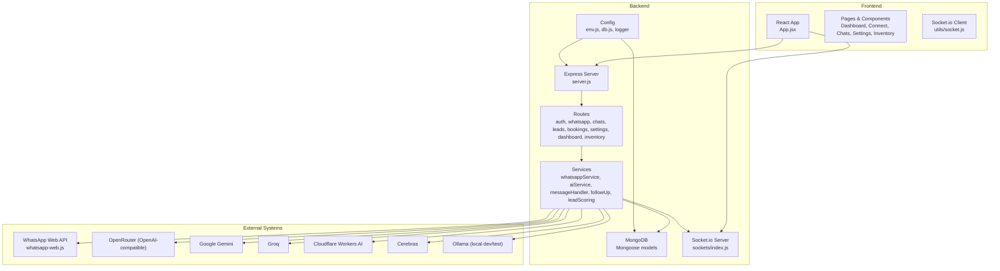
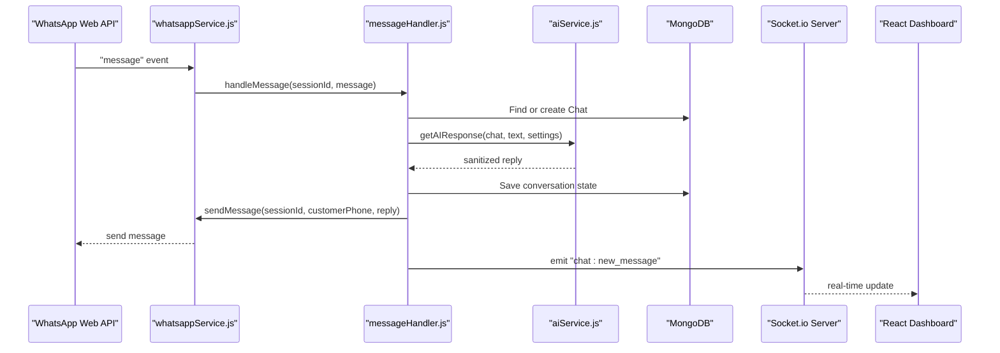
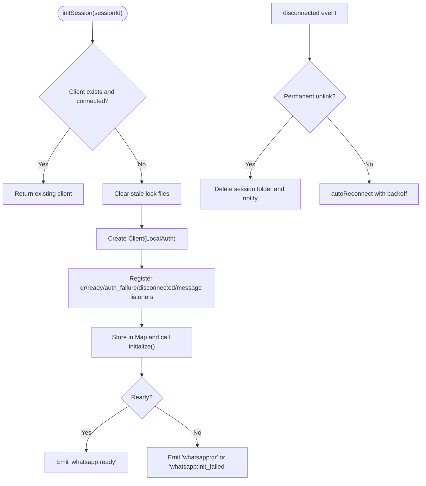
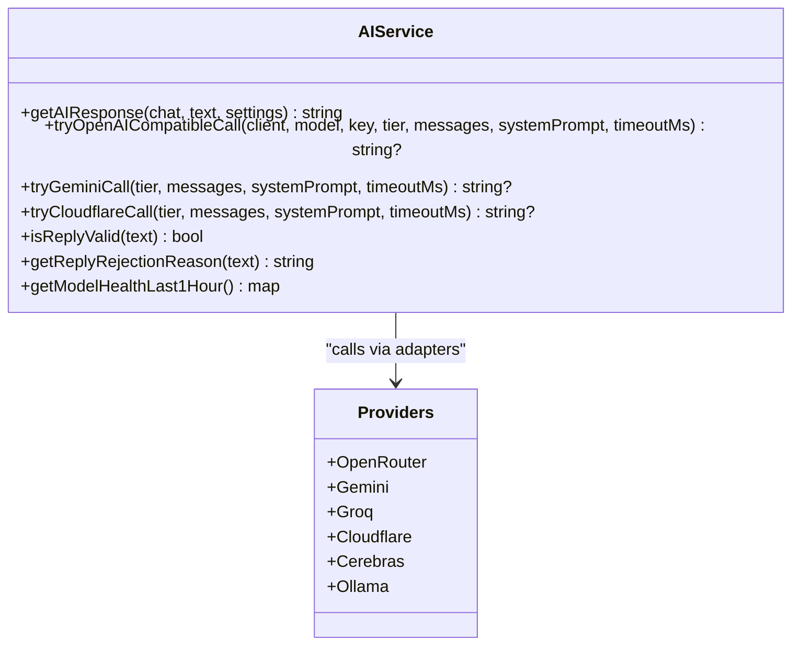
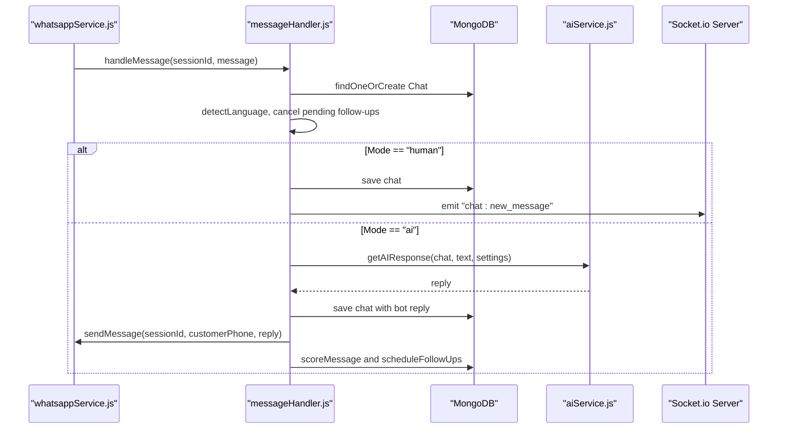
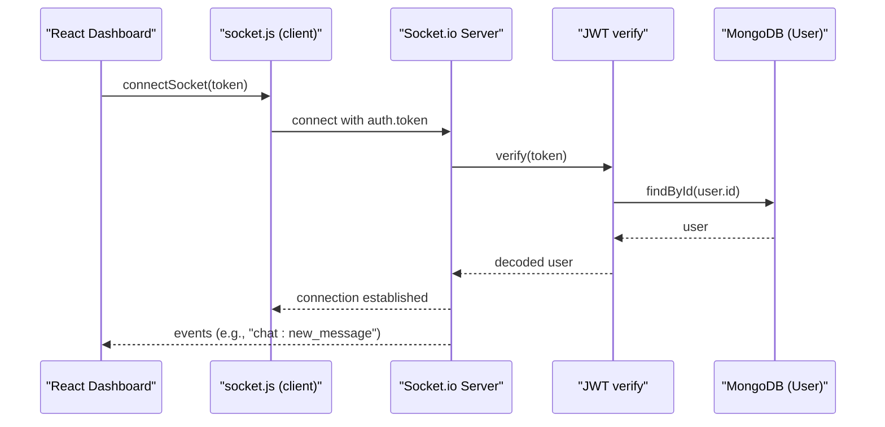
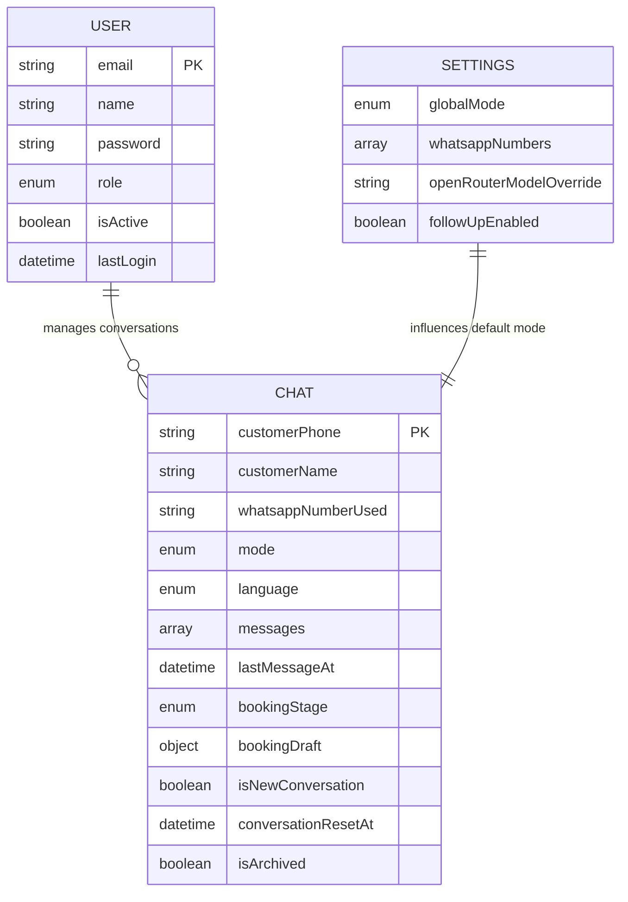
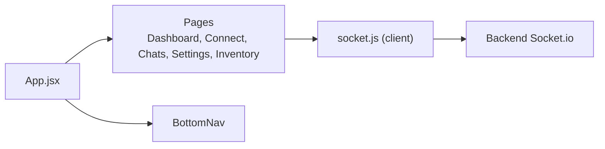
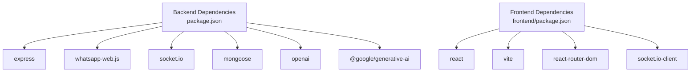

# System Architecture

<cite>
**Referenced Files in This Document**
- [README.md](file://README.md)
- [package.json](file://backend/package.json)
- [frontend package.json](file://frontend/package.json)
- [server.js](file://backend/src/server.js)
- [env.js](file://backend/src/config/env.js)
- [db.js](file://backend/src/config/db.js)
- [sockets/index.js](file://backend/src/sockets/index.js)
- [whatsappService.js](file://backend/src/services/whatsappService.js)
- [aiService.js](file://backend/src/services/aiService.js)
- [messageHandler.js](file://backend/src/services/messageHandler.js)
- [index.js (models)](file://backend/src/models/index.js)
- [User.js](file://backend/src/models/User.js)
- [Chat.js](file://backend/src/models/Chat.js)
- [Settings.js](file://backend/src/models/Settings.js)
- [App.jsx](file://frontend/src/App.jsx)
- [socket.js](file://frontend/src/utils/socket.js)
- [ecosystem.config.js](file://backend/ecosystem.config.js)
</cite>

## Table of Contents
1. Introduction
2. Project Structure
3. Core Components
4. Architecture Overview
5. Detailed Component Analysis
6. Dependency Analysis
7. Performance Considerations
8. Troubleshooting Guide
9. Conclusion

## Introduction
This document describes the Nandibaag Bot system architecture as a modular monolith with clear separation between backend services and frontend components. It explains how WhatsApp service orchestration, AI provider abstraction, real-time communication via Socket.io, and data flows interact to deliver an AI-powered WhatsApp assistant for resort management. It also documents technical decisions such as multi-provider AI strategy, session management, event-driven architecture, scalability considerations, deployment topology, and infrastructure requirements.

## Project Structure
The repository is organized into two primary applications:
- Backend (Node.js + Express): API server, WhatsApp integration, AI orchestration, database access, and real-time events.
- Frontend (React + Vite): Admin dashboard for monitoring and operations.

**Diagram sources**
- [server.js:1-239](file://backend/src/server.js#L1-L239)
- [sockets/index.js:1-82](file://backend/src/sockets/index.js#L1-L82)
- [whatsappService.js:1-642](file://backend/src/services/whatsappService.js#L1-L642)
- [aiService.js:1-800](file://backend/src/services/aiService.js#L1-L800)
- [messageHandler.js:1-183](file://backend/src/services/messageHandler.js#L1-L183)
- [env.js:1-95](file://backend/src/config/env.js#L1-L95)
- [db.js:1-40](file://backend/src/config/db.js#L1-L40)
- [App.jsx:1-103](file://frontend/src/App.jsx#L1-L103)
- [socket.js:1-66](file://frontend/src/utils/socket.js#L1-L66)

**Section sources**
- [README.md:1-164](file://README.md#L1-L164)
- [package.json:1-46](file://backend/package.json#L1-L46)
- [frontend package.json:1-28](file://frontend/package.json#L1-L28)

## Core Components
- Express server: Bootstraps HTTP server, mounts middleware, routes, Socket.io, initializes services, and handles graceful shutdown.
- WhatsApp service: Manages multiple persistent sessions per phone number using LocalAuth, auto-reconnects, emits status events, and sends messages.
- AI service: Multi-provider abstraction layer that attempts OpenRouter, Gemini, Groq, Cloudflare Workers AI, Cerebras, and Ollama with validation, sanitization, caching, and metrics.
- Message handler: Orchestrates chat lifecycle, mode selection (AI/human), language detection, lead scoring, follow-up scheduling, and real-time notifications.
- Real-time layer: Socket.io server authenticates staff users and broadcasts live updates; client connects with JWT and joins a shared room.
- Data persistence: Mongoose models for User, Chat, Settings, Leads, Bookings, etc., with indexes and soft-delete semantics for chats.
- Configuration: Environment validation, MongoDB connection with retries, logging, and health checks.

**Section sources**
- [server.js:1-239](file://backend/src/server.js#L1-L239)
- [whatsappService.js:1-642](file://backend/src/services/whatsappService.js#L1-L642)
- [aiService.js:1-800](file://backend/src/services/aiService.js#L1-L800)
- [messageHandler.js:1-183](file://backend/src/services/messageHandler.js#L1-L183)
- [sockets/index.js:1-82](file://backend/src/sockets/index.js#L1-L82)
- [db.js:1-40](file://backend/src/config/db.js#L1-L40)
- [env.js:1-95](file://backend/src/config/env.js#L1-L95)
- [index.js (models):1-22](file://backend/src/models/index.js#L1-L22)
- [User.js:1-63](file://backend/src/models/User.js#L1-L63)
- [Chat.js:1-107](file://backend/src/models/Chat.js#L1-L107)
- [Settings.js:1-38](file://backend/src/models/Settings.js#L1-L38)

## Architecture Overview
High-level design highlights:
- Modular monolith: Single Node.js process exposes REST APIs and WebSocket endpoints while encapsulating domain logic in services.
- Event-driven messaging: WhatsApp events drive processing pipelines; internal events update the dashboard in real time.
- Multi-provider AI: A resilient chain across providers ensures availability and performance; responses are sanitized and validated before delivery.
- Session management: Persistent per-number WhatsApp sessions with LocalAuth, exponential backoff reconnection, and cleanup on disconnect/unlink.
- Real-time dashboard: Authenticated staff clients receive live updates for session states, new messages, and alerts.

**Diagram sources**
- [whatsappService.js:258-290](file://backend/src/services/whatsappService.js#L258-L290)
- [messageHandler.js:22-178](file://backend/src/services/messageHandler.js#L22-L178)
- [aiService.js:1-800](file://backend/src/services/aiService.js#L1-L800)
- [sockets/index.js:1-82](file://backend/src/sockets/index.js#L1-L82)

## Detailed Component Analysis

### WhatsApp Service Orchestration
Responsibilities:
- Initialize and manage multiple sessions keyed by sessionId (phone label).
- Persist auth data per session via LocalAuth.
- Emit QR, ready, disconnected, pairing code, and failure events to the dashboard.
- Auto-reconnect with exponential backoff; handle permanent unlinking by cleaning session data.
- Enforce per-chat sequential processing to avoid race conditions.
- Send outbound messages with retry logic.

Key behaviors:
- Non-blocking initialization with event-driven readiness.
- Health check cron and periodic state inspection.
- Graceful destruction of all sessions during shutdown.

**Diagram sources**
- [whatsappService.js:107-321](file://backend/src/services/whatsappService.js#L107-L321)
- [whatsappService.js:333-363](file://backend/src/services/whatsappService.js#L333-L363)
- [whatsappService.js:212-256](file://backend/src/services/whatsappService.js#L212-L256)

**Section sources**
- [whatsappService.js:1-642](file://backend/src/services/whatsappService.js#L1-L642)

### AI Provider Abstraction Layer
Design:
- Unified interface to multiple providers: OpenRouter (OpenAI-compatible), Google Gemini, Groq, Cloudflare Workers AI, Cerebras, and local Ollama.
- Response pipeline: sanitize, enforce length limits, validate content, cache FAQ-like answers briefly, and record per-provider metrics.
- Resilience: timeouts, abort signals, and fallback across providers; invalid outputs are rejected and retried against next tier.

Key functions:
- tryOpenAICompatibleCall: standardizes calls for OpenAI-compatible endpoints.
- tryGeminiCall / callGemini: adapter for Gemini SDK.
- tryCloudflareCall / callCloudflare: direct REST adapter for Cloudflare.
- isReplyValid and getReplyRejectionReason: robust output validation and diagnostics.
- getModelHealthLast1Hour: snapshot of success/error/latency per provider.

**Diagram sources**
- [aiService.js:1-800](file://backend/src/services/aiService.js#L1-L800)

**Section sources**
- [aiService.js:1-800](file://backend/src/services/aiService.js#L1-L800)
- [env.js:1-95](file://backend/src/config/env.js#L1-L95)

### Message Handling and Conversation Flow
Responsibilities:
- Locate or create Chat document, detect language, and persist conversation history.
- Honor opt-out phrases and mark chats accordingly.
- Route to human mode (notify staff) or AI mode (generate response).
- Score leads, schedule follow-ups, and broadcast real-time updates.

Processing steps:
- Immediate typing indicator to improve UX.
- Fetch global settings and determine per-chat mode.
- Generate AI reply if enabled, save conversation, send via WhatsApp, score, and schedule follow-ups.

**Diagram sources**
- [messageHandler.js:22-178](file://backend/src/services/messageHandler.js#L22-L178)
- [whatsappService.js:466-508](file://backend/src/services/whatsappService.js#L466-L508)
- [sockets/index.js:1-82](file://backend/src/sockets/index.js#L1-L82)

**Section sources**
- [messageHandler.js:1-183](file://backend/src/services/messageHandler.js#L1-L183)
- [Chat.js:1-107](file://backend/src/models/Chat.js#L1-L107)
- [Settings.js:1-38](file://backend/src/models/Settings.js#L1-L38)

### Real-Time Communication (Socket.io)
Server-side:
- Initializes Socket.io with CORS configured from environment.
- Authenticates connections using JWT passed in handshake.
- Joins authenticated users to a shared "dashboard" room for broadcasting.

Client-side:
- Singleton socket client with reconnection and transport fallbacks.
- Uses token from authentication context to connect securely.

**Diagram sources**
- [sockets/index.js:1-82](file://backend/src/sockets/index.js#L1-L82)
- [socket.js:1-66](file://frontend/src/utils/socket.js#L1-L66)
- [User.js:1-63](file://backend/src/models/User.js#L1-L63)

**Section sources**
- [sockets/index.js:1-82](file://backend/src/sockets/index.js#L1-L82)
- [socket.js:1-66](file://frontend/src/utils/socket.js#L1-L66)

### Data Models and Persistence
Core entities:
- User: Authentication and roles.
- Chat: Per-customer conversation history, booking stage, language, and draft details.
- Settings: Global bot mode, WhatsApp numbers list, follow-up toggles.

Indexes and constraints:
- Unique and indexed fields for efficient queries (customerPhone, lastMessageAt, mode, bookingStage, isArchived, language).
- Soft delete via isArchived flag to preserve analytics and compliance.

**Diagram sources**
- [User.js:1-63](file://backend/src/models/User.js#L1-L63)
- [Chat.js:1-107](file://backend/src/models/Chat.js#L1-L107)
- [Settings.js:1-38](file://backend/src/models/Settings.js#L1-L38)

**Section sources**
- [index.js (models):1-22](file://backend/src/models/index.js#L1-L22)
- [User.js:1-63](file://backend/src/models/User.js#L1-L63)
- [Chat.js:1-107](file://backend/src/models/Chat.js#L1-L107)
- [Settings.js:1-38](file://backend/src/models/Settings.js#L1-L38)

### Frontend Application
- React application with protected routes and bottom navigation.
- Pages include Dashboard, Connect, Chats, Settings, and Inventory.
- Real-time updates via Socket.io client integrated with authentication context.

**Diagram sources**
- [App.jsx:1-103](file://frontend/src/App.jsx#L1-L103)
- [socket.js:1-66](file://frontend/src/utils/socket.js#L1-L66)

**Section sources**
- [App.jsx:1-103](file://frontend/src/App.jsx#L1-L103)
- [socket.js:1-66](file://frontend/src/utils/socket.js#L1-L66)

## Dependency Analysis
Key runtime dependencies:
- Backend: Express, Socket.io, whatsapp-web.js, OpenAI SDK, Google Generative AI, Mongoose, Winston, node-cron, compression, helmet, morgan, rate limiting, JWT.
- Frontend: React, Vite, TailwindCSS, React Router, Axios, Socket.io-client, Lucide icons, PWA plugin.

**Diagram sources**
- [package.json:1-46](file://backend/package.json#L1-L46)
- [frontend package.json:1-28](file://frontend/package.json#L1-L28)

**Section sources**
- [package.json:1-46](file://backend/package.json#L1-L46)
- [frontend package.json:1-28](file://frontend/package.json#L1-L28)

## Performance Considerations
- AI response caching: In-memory cache for static FAQ-type questions with short TTL reduces external API load.
- Length and line limits: Enforced to keep WhatsApp messages concise and readable.
- Provider metrics: Hourly reset metrics track latency and error rates to guide failover and capacity planning.
- Database indexing: Critical query patterns (customerPhone, lastMessageAt, mode, bookingStage, isArchived, language) are indexed for fast retrieval.
- Compression and security: Middleware enables compression and security headers to reduce payload size and harden the API surface.
- Rate limiting: Protects endpoints from abuse and resource exhaustion.

[No sources needed since this section provides general guidance]

## Troubleshooting Guide
Common issues and resolutions:
- WhatsApp session stuck or locked: Stale Puppeteer lock files can block restarts; the service cleans SingletonLock/SingletonSocket automatically. If needed, delete the session folder for the affected sessionId.
- Permanent unlink: On LOGOUT/UNPAIRED reasons, the service deletes session data and notifies the dashboard; reconnect via QR or pairing code.
- AI failures: Invalid or corrupted replies are rejected; logs include rejection reasons. The chain falls back to the next provider. Use dashboard stats to identify problematic tiers.
- MongoDB connectivity: Connection retries up to a threshold; on repeated failures, the process exits. Verify URI and network reachability.
- Port conflicts: Startup script detects EADDRINUSE and suggests remediation.

Operational tips:
- Use health endpoint to monitor active WhatsApp sessions and uptime.
- Review logs for timing diagnostics and provider-specific errors.
- Ensure environment variables are present and valid at startup.

**Section sources**
- [whatsappService.js:76-92](file://backend/src/services/whatsappService.js#L76-L92)
- [whatsappService.js:212-256](file://backend/src/services/whatsappService.js#L212-L256)
- [aiService.js:477-588](file://backend/src/services/aiService.js#L477-L588)
- [db.js:10-29](file://backend/src/config/db.js#L10-L29)
- [server.js:157-166](file://backend/src/server.js#L157-L166)

## Conclusion
Nandibaag Bot implements a robust modular monolith that integrates WhatsApp Web with a resilient, multi-provider AI layer and a real-time admin dashboard. Its event-driven architecture, careful session management, and comprehensive validation/sanitization ensure reliability and maintainability. With clear separation of concerns, strong configuration validation, and observability features, the system scales horizontally at the process level (PM2) and vertically through provider diversity and caching strategies.