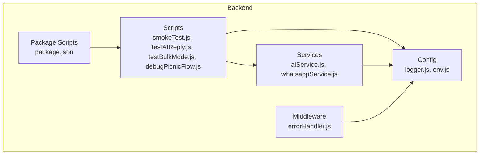
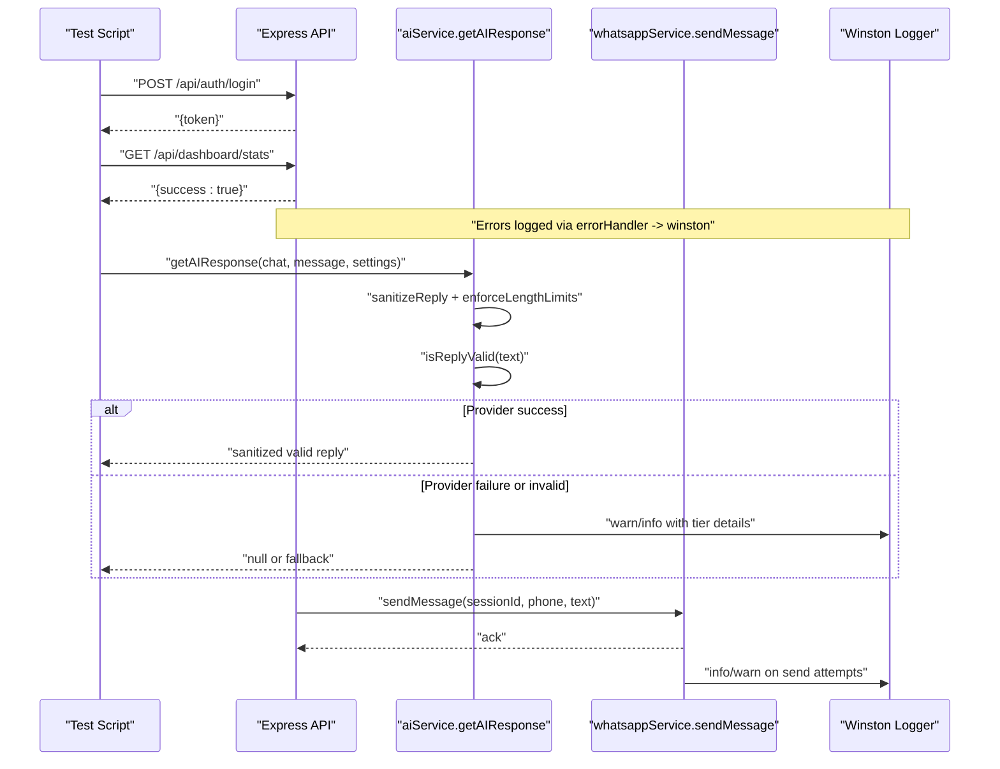
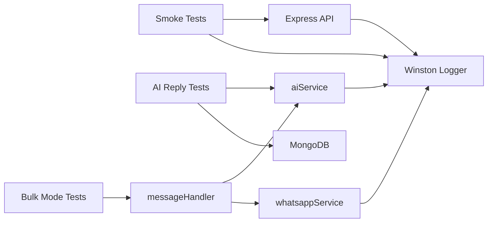

# Testing & Debugging

<cite>
**Referenced Files in This Document**
- [smokeTest.js](file://backend/src/scripts/smokeTest.js)
- [testAIReply.js](file://backend/src/scripts/testAIReply.js)
- [testBulkMode.js](file://backend/src/scripts/testBulkMode.js)
- [debugPicnicFlow.js](file://backend/src/scripts/debugPicnicFlow.js)
- [logger.js](file://backend/src/config/logger.js)
- [env.js](file://backend/src/config/env.js)
- [errorHandler.js](file://backend/src/middleware/errorHandler.js)
- [aiService.js](file://backend/src/services/aiService.js)
- [whatsappService.js](file://backend/src/services/whatsappService.js)
- [MANUAL_TESTING_CHECKLIST.md](file://MANUAL_TESTING_CHECKLIST.md)
- [package.json](file://backend/package.json)
</cite>

## Table of Contents
1. [Introduction](#introduction)
2. [Project Structure](#project-structure)
3. [Core Components](#core-components)
4. [Architecture Overview](#architecture-overview)
5. [Detailed Component Analysis](#detailed-component-analysis)
6. [Dependency Analysis](#dependency-analysis)
7. [Performance Considerations](#performance-considerations)
8. [Troubleshooting Guide](#troubleshooting-guide)
9. [Conclusion](#conclusion)
10. [Appendices](#appendices)

## Introduction
This document provides comprehensive testing and debugging guidance for the Nandibaag Bot system. It covers:
- Existing automated tests: smoke tests, AI reply validation, bulk mode behavior
- Logging strategy using Winston, log levels, and analysis techniques
- Debugging approaches for WhatsApp connection issues, AI service failures, and database connectivity problems
- Manual end-to-end testing checklist
- Performance testing guidelines and error tracking strategies
- Troubleshooting guides, diagnostic tools usage, and step-by-step procedures

## Project Structure
The backend includes:
- Scripts for automated testing and diagnostics
- Configuration for environment variables and logging
- Services for AI providers and WhatsApp sessions
- Middleware for centralized error handling
- A manual testing checklist for end-to-end flows

**Diagram sources**
- [smokeTest.js:1-271](file://backend/src/scripts/smokeTest.js#L1-L271)
- [testAIReply.js:1-468](file://backend/src/scripts/testAIReply.js#L1-L468)
- [testBulkMode.js:1-169](file://backend/src/scripts/testBulkMode.js#L1-L169)
- [debugPicnicFlow.js:1-309](file://backend/src/scripts/debugPicnicFlow.js#L1-L309)
- [logger.js:1-52](file://backend/src/config/logger.js#L1-L52)
- [env.js:1-95](file://backend/src/config/env.js#L1-L95)
- [aiService.js:1-800](file://backend/src/services/aiService.js#L1-L800)
- [whatsappService.js:1-642](file://backend/src/services/whatsappService.js#L1-L642)
- [errorHandler.js:1-36](file://backend/src/middleware/errorHandler.js#L1-L36)
- [package.json:1-47](file://backend/package.json#L1-L47)

**Section sources**
- [package.json:6-15](file://backend/package.json#L6-L15)

## Core Components
- Smoke Test Suite: Validates critical API endpoints, authentication, rate limiting, and basic health checks against a running backend.
- AI Reply Test Suite: Executes scenario-based validations of AI responses without requiring a live WhatsApp connection; includes heuristic reply validation tests.
- Bulk Mode Test: Verifies global and per-chat mode switching behavior and message routing logic by simulating incoming messages and asserting AI/WhatsApp interactions.
- Diagnostic Script: Reproduces specific booking flow scenarios and performs detailed diagnostics on reply validation and tiered provider calls.
- Logging: Winston-based logging with console output in development and JSON file outputs for combined logs and errors.
- Error Handling: Centralized Express error handler that logs via Winston and returns consistent JSON responses, suppressing stack traces in production.

**Section sources**
- [smokeTest.js:1-271](file://backend/src/scripts/smokeTest.js#L1-L271)
- [testAIReply.js:1-468](file://backend/src/scripts/testAIReply.js#L1-L468)
- [testBulkMode.js:1-169](file://backend/src/scripts/testBulkMode.js#L1-L169)
- [debugPicnicFlow.js:1-309](file://backend/src/scripts/debugPicnicFlow.js#L1-L309)
- [logger.js:1-52](file://backend/src/config/logger.js#L1-L52)
- [errorHandler.js:1-36](file://backend/src/middleware/errorHandler.js#L1-L36)

## Architecture Overview
The testing and debugging architecture integrates multiple layers:
- Automated scripts exercise APIs, AI services, and session behaviors
- AI service orchestrates a multi-tier provider chain (Groq, Cerebras, Cloudflare, Gemini, OpenRouter) with fallbacks and metrics
- WhatsApp service manages multi-session connections, auto-reconnect, and message queuing
- Winston logs are emitted to console (development) and files (combined and error-only)
- Express error handler centralizes error logging and response formatting

**Diagram sources**
- [smokeTest.js:1-271](file://backend/src/scripts/smokeTest.js#L1-L271)
- [aiService.js:1-800](file://backend/src/services/aiService.js#L1-L800)
- [whatsappService.js:1-642](file://backend/src/services/whatsappService.js#L1-L642)
- [errorHandler.js:1-36](file://backend/src/middleware/errorHandler.js#L1-L36)
- [logger.js:1-52](file://backend/src/config/logger.js#L1-L52)

## Detailed Component Analysis

### Smoke Tests
Purpose:
- Validate server reachability and core endpoints
- Confirm authentication flow and token issuance
- Verify protected routes respond correctly
- Ensure rate limiting triggers under rapid login attempts

Key behaviors:
- Uses built-in fetch with timeout to call endpoints
- Records pass/fail results and prints summary
- Exits with non-zero code if any test fails

Usage:
- Run via npm script defined in package.json

Operational notes:
- Requires backend running on configured port
- Admin credentials must be set in environment

**Section sources**
- [smokeTest.js:1-271](file://backend/src/scripts/smokeTest.js#L1-L271)
- [package.json:6-15](file://backend/package.json#L6-L15)

### AI Reply Testing
Purpose:
- Validate AI behavior across scripted scenarios without needing WhatsApp
- Exercise reply validation heuristics
- Connect to MongoDB to support settings retrieval during tests

Key behaviors:
- Builds mock chat objects and invokes getAIResponse
- Checks expected keywords and rejects unwanted content
- Skips scenarios based on environment flags (e.g., local Ollama vs production tiers)
- Runs heuristic validation tests for reply quality

Usage:
- Run via npm script defined in package.json

Operational notes:
- Requires MONGO_URI and AI provider keys configured
- Supports AI_TEST_MODE for local Ollama testing

**Section sources**
- [testAIReply.js:1-468](file://backend/src/scripts/testAIReply.js#L1-L468)
- [aiService.js:1-800](file://backend/src/services/aiService.js#L1-L800)
- [env.js:1-95](file://backend/src/config/env.js#L1-L95)
- [package.json:6-15](file://backend/package.json#L6-L15)

### Bulk Mode Testing
Purpose:
- Verify global and per-chat mode switching behavior
- Ensure incoming messages are handled according to current mode
- Assert AI and WhatsApp interactions occur only when appropriate

Key behaviors:
- Seeds Settings and Chat documents
- Simulates PATCH global mode updates and bulk updates to chats
- Sends simulated messages and tracks whether AI and WhatsApp were invoked
- Validates silent behavior in human mode and active replies in AI mode

Usage:
- Execute the script directly with Node

Operational notes:
- Requires MongoDB connection
- Stubs aiService and whatsappService to avoid external dependencies

**Section sources**
- [testBulkMode.js:1-169](file://backend/src/scripts/testBulkMode.js#L1-L169)

### Picnic Flow Debug Script
Purpose:
- Reproduce a specific booking flow failure scenario
- Perform detailed diagnostics on reply validation and tiered provider calls
- Provide structured rejection reasons for isReplyValid failures

Key behaviors:
- Mirrors isReplyValid logic with enhanced diagnostic output
- Connects to MongoDB and runs getAIResponse with full tier logging
- Reports total time and final reply validity

Usage:
- Execute the script directly with Node

Operational notes:
- Useful for isolating edge cases in AI response generation and validation

**Section sources**
- [debugPicnicFlow.js:1-309](file://backend/src/scripts/debugPicnicFlow.js#L1-L309)
- [aiService.js:1-800](file://backend/src/services/aiService.js#L1-L800)

### Logging Strategy (Winston)
Configuration:
- Development: Console transport with colorization, timestamp, and pretty-printed metadata
- All environments: File transports for combined logs and error-only logs in JSON format
- Level: debug in development, info in production

Analysis techniques:
- Use grep or log viewers to filter by level and timestamp
- Inspect error.log for exceptions and warnings
- Analyze combined.log for request/response context and timing diagnostics
- Correlate timestamps across transports to trace end-to-end flows

**Section sources**
- [logger.js:1-52](file://backend/src/config/logger.js#L1-L52)

### Error Handling
Behavior:
- Global Express error handler logs errors via Winston with URL, method, IP, and stack (in development)
- Returns consistent JSON error shape with success flag and message
- Omits stack traces in production for security

Integration:
- Used across all routes to standardize error responses and logging

**Section sources**
- [errorHandler.js:1-36](file://backend/src/middleware/errorHandler.js#L1-L36)

### AI Service Tiering and Validation
Tiered Providers:
- Groq (production tier), Cerebras (optional), Cloudflare Workers AI (REST), Gemini (SDK), OpenRouter (OpenAI-compatible)
- Each provider has dedicated adapters and retry/timeout handling
- Metrics tracked per provider for success, invalid, error counts, and average latency

Validation Pipeline:
- sanitizeReply removes leaked reasoning tokens and markdown artifacts
- enforceLengthLimits caps lines and characters, trimming at sentence boundaries
- isReplyValid enforces length, script whitelist, markdown/code syntax checks, repeated word detection, English word blacklist, vowel presence, and truncation patterns
- getReplyRejectionReason provides human-readable diagnostics for rejections

Fallback Chain:
- On failure or invalid output, the system falls back to the next tier
- Logs include tier labels, latency, and reasons for failure

**Section sources**
- [aiService.js:1-800](file://backend/src/services/aiService.js#L1-L800)

### WhatsApp Service and Session Management
Capabilities:
- Multi-session management with LocalAuth persistence
- Auto-reconnect with exponential backoff
- Per-chat message queue locks to prevent race conditions
- Socket.io events to keep dashboard synchronized
- Pairing code flow alternative to QR scanning

Diagnostics:
- Health check cron job monitors session states
- Detailed logging for initialization, ready, auth_failure, disconnected, and send attempts

**Section sources**
- [whatsappService.js:1-642](file://backend/src/services/whatsappService.js#L1-L642)

## Dependency Analysis
Automated tests depend on:
- Environment configuration (MongoDB URI, API keys, ports)
- AI service for response generation and validation
- WhatsApp service for sending messages (mocked in bulk mode tests)
- Winston logger for consistent logging across components

**Diagram sources**
- [smokeTest.js:1-271](file://backend/src/scripts/smokeTest.js#L1-L271)
- [testAIReply.js:1-468](file://backend/src/scripts/testAIReply.js#L1-L468)
- [testBulkMode.js:1-169](file://backend/src/scripts/testBulkMode.js#L1-L169)
- [aiService.js:1-800](file://backend/src/services/aiService.js#L1-L800)
- [whatsappService.js:1-642](file://backend/src/services/whatsappService.js#L1-L642)
- [logger.js:1-52](file://backend/src/config/logger.js#L1-L52)

**Section sources**
- [package.json:6-15](file://backend/package.json#L6-L15)

## Performance Considerations
- AI Response Latency:
  - Monitor per-provider latency metrics exposed by aiService
  - Use timing logs to identify slow tiers and optimize timeouts
- Rate Limiting:
  - Smoke tests validate rate limiting behavior; ensure thresholds align with expected traffic
- Message Queuing:
  - Per-chat locks prevent concurrent writes; monitor queue depth under high load
- Caching:
  - In-memory FAQ cache reduces API calls for static queries; verify TTL and key collision behavior
- Database Operations:
  - Bulk updates and model operations should be profiled; consider indexing frequently queried fields

[No sources needed since this section provides general guidance]

## Troubleshooting Guide

### WhatsApp Connection Issues
Symptoms:
- Dashboard shows “not initialized” or “connecting”
- Frequent disconnects or auth failures
- QR not appearing or pairing code requests failing

Diagnostic steps:
- Check session status via getAllSessionsStatus and getSessionStatus
- Review logs for qr, ready, authenticated, auth_failure, disconnected events
- Inspect reconnect attempts and backoff delays
- Clear stale lock files if Puppeteer crashes occur
- For permanent unlinking, delete session folder and re-initiate QR/pairing flow

Tools:
- WhatsApp service functions: initSession, initSessionWithPairingCode, destroySession, restartAllActiveSessions
- Socket events: whatsapp:qr, whatsapp:ready, whatsapp:auth_failure, whatsapp:disconnected, whatsapp:reconnect_failed

**Section sources**
- [whatsappService.js:1-642](file://backend/src/services/whatsappService.js#L1-L642)

### AI Service Failures
Symptoms:
- Invalid or corrupted replies
- Fallback transitions between tiers
- Timeouts or rate limit errors

Diagnostic steps:
- Inspect tier-specific logs for success/invalid/error counts and latency
- Use getReplyRejectionReason to understand why isReplyValid rejected a reply
- Validate environment keys and model availability for each tier
- Run AI reply tests to reproduce scenarios and observe keyword checks

Tools:
- aiService functions: tryOpenAICompatibleCall, tryGeminiCall, tryCloudflareCall, isReplyValid, getReplyRejectionReason
- AI test script: testAIReply.js

**Section sources**
- [aiService.js:1-800](file://backend/src/services/aiService.js#L1-L800)
- [testAIReply.js:1-468](file://backend/src/scripts/testAIReply.js#L1-L468)

### Database Connectivity Problems
Symptoms:
- MongoDB connection failures during tests or startup
- Model operations failing due to connection errors

Diagnostic steps:
- Verify MONGO_URI in environment configuration
- Ensure MongoDB is reachable and credentials are correct
- Use test scripts that connect to MongoDB to confirm connectivity

Tools:
- env.js exports mongoUri used by test scripts
- testAIReply.js and debugPicnicFlow.js connect to MongoDB explicitly

**Section sources**
- [env.js:1-95](file://backend/src/config/env.js#L1-L95)
- [testAIReply.js:1-468](file://backend/src/scripts/testAIReply.js#L1-L468)
- [debugPicnicFlow.js:1-309](file://backend/src/scripts/debugPicnicFlow.js#L1-L309)

### End-to-End Manual Testing Checklist
Follow the documented checklist to validate:
- WhatsApp connection and QR/pairing flow
- Booking flows (Couple, Group, Picnic)
- Mode switching (per-chat and global)
- Follow-up triggers and cancellation
- Resilience (backend restart and reconnection)
- PWA/mobile experience

Run automated tests first, then proceed with manual verification.

**Section sources**
- [MANUAL_TESTING_CHECKLIST.md:1-179](file://MANUAL_TESTING_CHECKLIST.md#L1-L179)

### Error Tracking Strategies
- Centralized logging via Winston ensures consistent error capture
- Use errorHandler to standardize error responses and suppress stacks in production
- Analyze error.log for exceptions and combined.log for contextual information
- Correlate timestamps across transports to trace request flows

**Section sources**
- [logger.js:1-52](file://backend/src/config/logger.js#L1-L52)
- [errorHandler.js:1-36](file://backend/src/middleware/errorHandler.js#L1-L36)

## Conclusion
The Nandibaag Bot system provides robust automated and manual testing capabilities, comprehensive logging, and resilient AI and WhatsApp integrations. By leveraging the provided scripts, logging strategies, and troubleshooting guides, teams can efficiently validate functionality, diagnose issues, and maintain high reliability in production.

[No sources needed since this section summarizes without analyzing specific files]

## Appendices

### Running Tests and Scripts
- Smoke tests: npm run smoke-test
- AI reply tests: npm run test-ai
- Bulk mode test: node src/scripts/testBulkMode.js
- Picnic flow debug: node src/scripts/debugPicnicFlow.js

**Section sources**
- [package.json:6-15](file://backend/package.json#L6-L15)